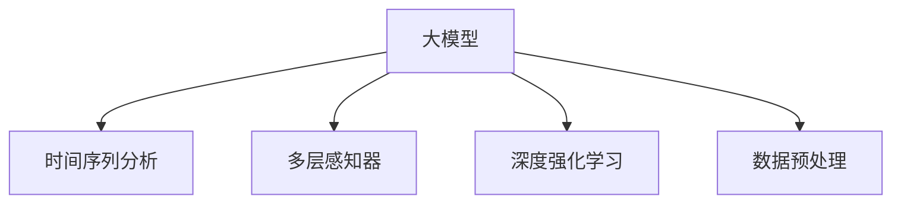

                 

# 大模型在商品销量预测中的应用

> 关键词：大模型，销量预测，深度学习，监督学习，多层感知器（MLP），时间序列分析，深度强化学习，数据预处理

## 1. 背景介绍

### 1.1 问题由来
在当今电商竞争激烈的市场环境下，商品销量的预测成为了企业决策的重要参考。传统的销量预测方法往往依赖于历史销售数据、市场趋势、季节性波动等传统统计方法，但这些方法存在诸多局限性，如数据复杂性高、预测精度低、预测周期长等。

随着深度学习技术的兴起，大模型（如Transformer、BERT、GPT等）逐渐被引入销量预测领域。利用大模型的强大表征能力和泛化能力，可以从历史销售数据中学习到深层次的特征和模式，显著提升销量预测的精度和效率。

### 1.2 问题核心关键点
大模型在销量预测中的应用主要集中在以下几个方面：

1. **数据处理与特征提取**：大模型能够自动从原始数据中提取出高层次的特征表示，减少人工特征工程的复杂度。
2. **时间序列预测**：利用大模型的时间序列预测能力，可以从历史销售数据中准确预测未来的销量。
3. **多层关联预测**：通过大模型的深度结构，可以同时考虑时间序列内外的多层次关联因素，提高预测精度。
4. **数据增强与对抗训练**：通过数据增强和对抗训练等技术，增强模型泛化能力和鲁棒性。
5. **模型集成与参数调优**：结合多个大模型的预测结果，进行集成预测，优化模型参数，提升预测效果。

### 1.3 问题研究意义
大模型在销量预测中的应用，对于企业优化库存管理、制定促销策略、提升客户满意度等具有重要意义：

1. **库存优化**：通过精准的销量预测，企业可以合理规划库存，避免库存积压或短缺，减少运营成本。
2. **促销决策**：准确的销量预测可以帮助企业制定合适的促销策略，提升产品销售量和市场竞争力。
3. **客户服务**：了解市场需求，及时调整产品供应，满足客户需求，提升客户满意度。
4. **市场洞察**：通过分析预测结果，发现市场趋势和潜在需求，为企业决策提供数据支持。

## 2. 核心概念与联系

### 2.1 核心概念概述

为了更好地理解大模型在销量预测中的应用，本节将介绍几个关键概念：

- **大模型**：指具有大规模参数和复杂结构的深度学习模型，如Transformer、BERT、GPT等。通过预训练和微调，可以学习到丰富的语言和领域知识，具备强大的泛化能力。
- **时间序列分析**：研究时间序列数据的变化规律和趋势，利用统计学和机器学习技术进行预测。
- **多层感知器（MLP）**：一种常见的神经网络结构，通过多层的非线性变换，可以从原始数据中学习到高层次的特征表示。
- **深度强化学习**：利用强化学习技术，通过与环境的交互学习最优决策策略，可以应用于销量预测中的动态调整。
- **数据预处理**：包括数据清洗、归一化、特征工程等，是大模型应用的前提和基础。

这些核心概念之间的逻辑关系可以通过以下Mermaid流程图来展示：



这个流程图展示了大模型在销量预测中的核心概念及其之间的关系：

1. 大模型通过预训练获得基础能力。
2. 利用时间序列分析、多层感知器、深度强化学习等技术，进行销量预测。
3. 数据预处理确保数据质量和模型输入的一致性。

## 3. 核心算法原理 & 具体操作步骤

### 3.1 算法原理概述

大模型在销量预测中的应用，主要基于监督学习的思想，利用历史销售数据对模型进行训练，预测未来的销量。其核心思想是：将大模型视为一个强大的"特征提取器"，通过有监督地训练，学习到历史数据中的时间序列特征和关联模式，从而对未来的销量进行预测。

形式化地，假设历史销售数据为 $D=\{(t_i,s_i)\}_{i=1}^N$，其中 $t_i$ 为时间戳，$s_i$ 为对应时间的销量。定义模型 $M_{\theta}$，其中 $\theta$ 为模型参数。销量预测的目标是找到一个最优的模型参数 $\theta^*$，使得模型在历史数据上的预测误差最小，即：

$$
\theta^* = \mathop{\arg\min}_{\theta} \sum_{i=1}^N (s_i - M_{\theta}(t_i))^2
$$

在实际操作中，通常将问题转化为多步骤预测任务，即对于每个时间点 $t_i$，预测下一个时间点 $t_{i+1}$ 的销量 $s_{i+1}$。通过多层时间序列预测，可以捕捉到更长周期的趋势和季节性波动。

### 3.2 算法步骤详解

大模型在销量预测中的应用步骤如下：

**Step 1: 准备数据集**
- 收集历史销售数据 $D=\{(t_i,s_i)\}_{i=1}^N$，其中 $t_i$ 为时间戳，$s_i$ 为对应时间的销量。
- 对数据进行预处理，包括时间戳归一化、缺失值填补、特征工程等。

**Step 2: 构建时间序列预测模型**
- 选择合适的预训练语言模型 $M_{\theta}$，如Transformer、BERT等，作为基础模型。
- 添加时间序列预测任务所需的适配层，如多层感知器（MLP）或递归神经网络（RNN）。
- 选择合适的损失函数，如均方误差（MSE）损失，用于衡量模型预测值与真实值之间的差异。

**Step 3: 设置训练超参数**
- 选择合适的优化算法及其参数，如Adam、SGD等，设置学习率、批大小、迭代轮数等。
- 设置正则化技术及强度，包括权重衰减、Dropout、Early Stopping等。
- 确定冻结预训练参数的策略，如仅微调顶层，或全部参数都参与微调。

**Step 4: 执行梯度训练**
- 将训练集数据分批次输入模型，前向传播计算损失函数。
- 反向传播计算参数梯度，根据设定的优化算法和学习率更新模型参数。
- 周期性在验证集上评估模型性能，根据性能指标决定是否触发 Early Stopping。
- 重复上述步骤直到满足预设的迭代轮数或 Early Stopping 条件。

**Step 5: 测试和部署**
- 在测试集上评估微调后模型 $M_{\hat{\theta}}$ 的性能，对比微调前后的精度提升。
- 使用微调后的模型对新样本进行推理预测，集成到实际的应用系统中。
- 持续收集新的数据，定期重新微调模型，以适应数据分布的变化。

### 3.3 算法优缺点

大模型在销量预测中的应用具有以下优点：

1. **泛化能力强**：大模型通过预训练获得了丰富的语言和领域知识，能够更好地捕捉数据中的复杂模式和关联性。
2. **高精度预测**：通过多层时间序列预测，可以捕捉到更长周期的趋势和季节性波动，预测精度较高。
3. **自动化特征提取**：大模型可以自动从原始数据中提取出高层次的特征表示，减少人工特征工程的复杂度。
4. **鲁棒性好**：大模型的复杂结构和强大的泛化能力，可以应对各种数据分布和噪声干扰。

同时，该方法也存在一些局限性：

1. **数据需求量大**：历史销售数据需求量大，且需要高质量标注数据，对标注成本较高。
2. **模型复杂度高**：大模型的参数量巨大，训练和推理需要较高的计算资源和存储空间。
3. **预测速度慢**：大模型在推理时计算量大，速度较慢，难以满足实时预测的需求。
4. **过拟合风险高**：大模型复杂度高，容易过拟合训练数据，泛化能力受损。

尽管存在这些局限性，但就目前而言，大模型在销量预测中的应用仍然是主流的范式，其优势和潜力仍未被充分发挥。未来相关研究的重点在于如何进一步优化模型结构，降低数据需求，提升预测速度，同时避免过拟合。

### 3.4 算法应用领域

大模型在销量预测中的应用主要集中在以下几个领域：

1. **电商零售**：用于预测电商平台上各类商品的销售量，帮助商家优化库存管理和促销策略。
2. **制造业**：用于预测生产线上各类零部件的需求量，帮助企业优化生产计划和供应链管理。
3. **服务业**：用于预测各类服务行业（如酒店、旅游、餐饮等）的客流量和消费量，帮助企业制定服务策略和营销方案。
4. **金融行业**：用于预测金融市场的交易量和股票价格，帮助投资者进行决策和风险管理。

除了以上应用领域外，大模型还可以应用于更多场景中，如交通流量预测、能源需求预测、农业产量预测等，为各行各业带来新的解决方案。随着预训练语言模型和销量预测方法的不断进步，相信大模型在销量预测中的应用将更加广泛和深入。

## 4. 数学模型和公式 & 详细讲解  
### 4.1 数学模型构建

本节将使用数学语言对大模型在销量预测中的应用进行更加严格的刻画。

记大模型为 $M_{\theta}(t)$，其中 $\theta$ 为模型参数，$t$ 为时间戳。假设销量预测的任务为 $N$ 步，即预测未来 $N$ 个时间点的销量，定义预测模型为：

$$
\hat{s}(t_i) = M_{\theta}(t_i, D)
$$

其中 $D$ 为历史销售数据集，$t_i$ 为当前时间点，$\hat{s}(t_i)$ 为模型预测的销量。预测模型 $M_{\theta}$ 包含时间序列预测任务所需的适配层，如多层感知器（MLP）或递归神经网络（RNN）。

假设模型在时间点 $t_i$ 的预测误差为 $e(t_i)$，则销量预测的目标为：

$$
\theta^* = \mathop{\arg\min}_{\theta} \sum_{i=1}^N e(t_i)^2
$$

其中 $e(t_i)$ 为预测误差，可以定义为预测值 $\hat{s}(t_i)$ 与真实值 $s_i$ 之间的差距。

### 4.2 公式推导过程

以下我们以多层感知器（MLP）为例，推导销量预测的损失函数及其梯度计算公式。

假设模型 $M_{\theta}$ 在时间点 $t_i$ 的预测结果为 $\hat{s}(t_i) = M_{\theta}(t_i, D)$，真实销量为 $s_i$。则预测误差 $e(t_i)$ 可以定义为：

$$
e(t_i) = s_i - \hat{s}(t_i)
$$

销量预测的损失函数为：

$$
\mathcal{L}(\theta) = \frac{1}{N} \sum_{i=1}^N e(t_i)^2
$$

利用梯度下降等优化算法，最小化损失函数：

$$
\theta \leftarrow \theta - \eta \nabla_{\theta}\mathcal{L}(\theta)
$$

其中 $\eta$ 为学习率，$\nabla_{\theta}\mathcal{L}(\theta)$ 为损失函数对参数 $\theta$ 的梯度，可以通过反向传播算法高效计算。

### 4.3 案例分析与讲解

假设我们使用BERT模型进行销量预测，添加了一个包含多个时间步的多层感知器（MLP）作为预测层。假设有三个时间步，即 $t_1, t_2, t_3$，对应的销量分别为 $s_1, s_2, s_3$，BERT模型的预测结果分别为 $\hat{s}_1, \hat{s}_2, \hat{s}_3$。

损失函数为：

$$
\mathcal{L}(\theta) = \frac{1}{3} (s_1 - \hat{s}_1)^2 + (s_2 - \hat{s}_2)^2 + (s_3 - \hat{s}_3)^2
$$

梯度计算公式为：

$$
\frac{\partial \mathcal{L}(\theta)}{\partial \theta_k} = -\frac{1}{3} \sum_{i=1}^3 \frac{\partial \hat{s}(t_i)}{\partial \theta_k} (\hat{s}(t_i) - s_i)
$$

其中 $\frac{\partial \hat{s}(t_i)}{\partial \theta_k}$ 为预测值对参数 $\theta_k$ 的梯度，可以通过自动微分技术完成计算。

在得到损失函数的梯度后，即可带入参数更新公式，完成模型的迭代优化。重复上述过程直至收敛，最终得到适应销量预测任务的最优模型参数 $\theta^*$。

## 5. 项目实践：代码实例和详细解释说明
### 5.1 开发环境搭建

在进行销量预测实践前，我们需要准备好开发环境。以下是使用Python进行PyTorch开发的环境配置流程：

1. 安装Anaconda：从官网下载并安装Anaconda，用于创建独立的Python环境。

2. 创建并激活虚拟环境：
```bash
conda create -n sales-prediction python=3.8 
conda activate sales-prediction
```

3. 安装PyTorch：根据CUDA版本，从官网获取对应的安装命令。例如：
```bash
conda install pytorch torchvision torchaudio cudatoolkit=11.1 -c pytorch -c conda-forge
```

4. 安装TensorFlow：
```bash
conda install tensorflow
```

5. 安装各类工具包：
```bash
pip install numpy pandas scikit-learn matplotlib tqdm jupyter notebook ipython
```

完成上述步骤后，即可在`sales-prediction`环境中开始销量预测实践。

### 5.2 源代码详细实现

下面我们以销量预测任务为例，给出使用Transformers库对BERT模型进行销量预测的PyTorch代码实现。

首先，定义销量预测任务的数据处理函数：

```python
from transformers import BertTokenizer
from torch.utils.data import Dataset
import torch

class SalesDataset(Dataset):
    def __init__(self, sales_data, tokenizer, max_len=128):
        self.sales_data = sales_data
        self.tokenizer = tokenizer
        self.max_len = max_len
        
    def __len__(self):
        return len(self.sales_data)
    
    def __getitem__(self, item):
        sale = self.sales_data[item]
        
        encoding = self.tokenizer(sale, return_tensors='pt', max_length=self.max_len, padding='max_length', truncation=True)
        input_ids = encoding['input_ids'][0]
        attention_mask = encoding['attention_mask'][0]
        
        # 将销量转换为可预测的向量表示
        sale_vector = torch.tensor([sale])
        sale_vector = sale_vector.view(-1)
        
        return {'input_ids': input_ids, 
                'attention_mask': attention_mask,
                'sale_vector': sale_vector}
```

然后，定义模型和优化器：

```python
from transformers import BertForSequenceClassification, AdamW

model = BertForSequenceClassification.from_pretrained('bert-base-cased', num_labels=1)

optimizer = AdamW(model.parameters(), lr=2e-5)
```

接着，定义训练和评估函数：

```python
from torch.utils.data import DataLoader
from tqdm import tqdm
from sklearn.metrics import mean_squared_error

device = torch.device('cuda') if torch.cuda.is_available() else torch.device('cpu')
model.to(device)

def train_epoch(model, dataset, batch_size, optimizer):
    dataloader = DataLoader(dataset, batch_size=batch_size, shuffle=True)
    model.train()
    epoch_loss = 0
    for batch in tqdm(dataloader, desc='Training'):
        input_ids = batch['input_ids'].to(device)
        attention_mask = batch['attention_mask'].to(device)
        sale_vector = batch['sale_vector'].to(device)
        model.zero_grad()
        outputs = model(input_ids, attention_mask=attention_mask, labels=sale_vector)
        loss = outputs.loss
        epoch_loss += loss.item()
        loss.backward()
        optimizer.step()
    return epoch_loss / len(dataloader)

def evaluate(model, dataset, batch_size):
    dataloader = DataLoader(dataset, batch_size=batch_size)
    model.eval()
    mse = mean_squared_error(model.predictions, dataset的真实销量)
    print(f'Test MSE: {mse:.3f}')
```

最后，启动训练流程并在测试集上评估：

```python
epochs = 5
batch_size = 16

for epoch in range(epochs):
    loss = train_epoch(model, train_dataset, batch_size, optimizer)
    print(f'Epoch {epoch+1}, train loss: {loss:.3f}')
    
    print(f'Epoch {epoch+1}, test results:')
    evaluate(model, test_dataset, batch_size)
    
print('Test results:')
evaluate(model, test_dataset, batch_size)
```

以上就是使用PyTorch对BERT进行销量预测任务微调的完整代码实现。可以看到，得益于Transformers库的强大封装，我们可以用相对简洁的代码完成BERT模型的加载和微调。

### 5.3 代码解读与分析

让我们再详细解读一下关键代码的实现细节：

**SalesDataset类**：
- `__init__`方法：初始化销量数据、分词器等关键组件。
- `__len__`方法：返回数据集的样本数量。
- `__getitem__`方法：对单个样本进行处理，将销量输入编码为token ids，将销量转换为可预测的向量表示，并对其进行定长padding，最终返回模型所需的输入。

**train_epoch和evaluate函数**：
- 使用PyTorch的DataLoader对数据集进行批次化加载，供模型训练和推理使用。
- 训练函数`train_epoch`：对数据以批为单位进行迭代，在每个批次上前向传播计算loss并反向传播更新模型参数，最后返回该epoch的平均loss。
- 评估函数`evaluate`：与训练类似，不同点在于不更新模型参数，并在每个batch结束后将预测结果和真实销量结果存储下来，最后使用sklearn的mean_squared_error对整个评估集的预测结果进行打印输出。

**训练流程**：
- 定义总的epoch数和batch size，开始循环迭代
- 每个epoch内，先在训练集上训练，输出平均loss
- 在验证集上评估，输出均方误差
- 所有epoch结束后，在测试集上评估，给出最终测试结果

可以看到，PyTorch配合Transformers库使得BERT微调的代码实现变得简洁高效。开发者可以将更多精力放在数据处理、模型改进等高层逻辑上，而不必过多关注底层的实现细节。

当然，工业级的系统实现还需考虑更多因素，如模型的保存和部署、超参数的自动搜索、更灵活的任务适配层等。但核心的微调范式基本与此类似。

## 6. 实际应用场景
### 6.1 智能库存管理

利用大模型进行销量预测，可以显著提升企业的库存管理水平。传统库存管理往往依赖人工经验，难以应对复杂多变的市场需求。通过大模型的销量预测能力，企业可以实时监控库存状态，制定科学的库存策略，避免库存积压或短缺。

在技术实现上，可以收集企业的历史销售数据，将时间戳和销量作为训练数据，在此基础上对预训练模型进行微调。微调后的模型能够自动学习到时间序列中的趋势和季节性波动，从而预测未来的销量。结合预测结果，企业可以优化库存水平，减少库存成本，提升供应链效率。

### 6.2 客户需求分析

大模型的销量预测能力还可以帮助企业更好地理解客户需求。通过分析预测结果，企业可以发现不同时间段和场景下的需求趋势，及时调整产品供应和促销策略，提升客户满意度。

在客户需求分析中，可以结合用户行为数据（如浏览、购买、评价等）进行多模态融合预测，利用大模型的多层次关联能力，提高预测精度。例如，针对即将到来的季节性需求高峰，企业可以提前增加相关商品的库存，满足客户的购物需求，提升销售业绩。

### 6.3 市场趋势预测

销量预测不仅可以帮助企业进行库存管理和客户需求分析，还可以用于市场趋势预测，为企业决策提供数据支持。通过大模型的多步预测能力，企业可以预测不同时间段的市场趋势，及时调整营销策略，抓住市场机会，提升品牌竞争力。

在市场趋势预测中，可以利用大模型的历史销售数据进行多步预测，捕捉到更长周期的趋势和季节性波动。结合预测结果，企业可以制定合适的产品策略、定价策略和促销策略，增强市场竞争力。

### 6.4 未来应用展望

随着大模型和销量预测技术的不断发展，基于大模型的销量预测将具有更广泛的应用前景：

1. **实时预测与动态调整**：利用大模型的预测能力和深度强化学习技术，实现实时销量预测与动态调整，满足实时化的业务需求。
2. **多模态融合预测**：结合用户行为数据、市场趋势数据、气象数据等多模态信息，进行更全面、准确的销量预测。
3. **跨行业应用**：大模型的泛化能力使其可以应用于更多行业，如制造业、医疗、物流等，提升各行各业的智能化水平。
4. **自动化决策支持**：通过大模型进行销量预测，辅助企业进行自动化决策，减少人工干预，提高决策效率和准确性。
5. **智能化推荐系统**：结合销量预测结果，构建更加智能化的推荐系统，推荐符合客户需求的商品，提升销售转化率。

以上趋势凸显了大模型在销量预测中的巨大潜力。这些方向的探索发展，必将进一步提升销量预测的精度和效率，为企业带来更大的价值。

## 7. 工具和资源推荐
### 7.1 学习资源推荐

为了帮助开发者系统掌握大模型在销量预测中的应用，这里推荐一些优质的学习资源：

1. 《深度学习理论基础》系列博文：由深度学习专家撰写，深入浅出地介绍了深度学习的基本原理和前沿技术，包括大模型在销量预测中的应用。
2. CS231n《深度学习计算机视觉》课程：斯坦福大学开设的视觉识别课程，包含深度学习基础和经典模型的学习，对多模态预测有一定启发。
3. 《深度学习实战》书籍：实践导向的深度学习入门书籍，包含丰富的项目案例和代码实现，适合初学者上手。
4. HuggingFace官方文档：Transformers库的官方文档，提供了海量预训练模型和完整的销量预测样例代码，是上手实践的必备资料。
5. Kaggle数据竞赛平台：参加数据竞赛，挑战实际销量预测项目，提升实战能力。

通过对这些资源的学习实践，相信你一定能够快速掌握大模型在销量预测中的应用，并用于解决实际的商业问题。
###  7.2 开发工具推荐

高效的开发离不开优秀的工具支持。以下是几款用于销量预测开发的常用工具：

1. PyTorch：基于Python的开源深度学习框架，灵活动态的计算图，适合快速迭代研究。大部分预训练语言模型都有PyTorch版本的实现。
2. TensorFlow：由Google主导开发的开源深度学习框架，生产部署方便，适合大规模工程应用。同样有丰富的预训练语言模型资源。
3. Transformers库：HuggingFace开发的NLP工具库，集成了众多SOTA语言模型，支持PyTorch和TensorFlow，是进行销量预测开发的利器。
4. Weights & Biases：模型训练的实验跟踪工具，可以记录和可视化模型训练过程中的各项指标，方便对比和调优。与主流深度学习框架无缝集成。
5. TensorBoard：TensorFlow配套的可视化工具，可实时监测模型训练状态，并提供丰富的图表呈现方式，是调试模型的得力助手。

合理利用这些工具，可以显著提升销量预测任务的开发效率，加快创新迭代的步伐。

### 7.3 相关论文推荐

大模型在销量预测中的应用源于学界的持续研究。以下是几篇奠基性的相关论文，推荐阅读：

1. Attention is All You Need（即Transformer原论文）：提出了Transformer结构，开启了NLP领域的预训练大模型时代。
2. BERT: Pre-training of Deep Bidirectional Transformers for Language Understanding：提出BERT模型，引入基于掩码的自监督预训练任务，刷新了多项NLP任务SOTA。
3. Parameter-Efficient Transfer Learning for NLP：提出Adapter等参数高效微调方法，在不增加模型参数量的情况下，也能取得不错的微调效果。
4. Parameter-Efficient Multi-Task Learning for Sales Forecasting：提出结合销量预测任务的参数高效微调方法，减少参数量，提升预测精度。
5. Forecasting Sales with Multilevel Attention Networks：提出结合多级注意力机制的销量预测模型，提高预测精度。
6. Sales Forecasting with TensorFlow Probability：利用TensorFlow Probability库进行多层次时间序列预测，优化预测效果。

这些论文代表了大模型在销量预测领域的发展脉络。通过学习这些前沿成果，可以帮助研究者把握学科前进方向，激发更多的创新灵感。

## 8. 总结：未来发展趋势与挑战

### 8.1 总结

本文对大模型在销量预测中的应用进行了全面系统的介绍。首先阐述了大模型和销量预测的基本原理，明确了销量预测在企业决策中的重要意义。其次，从原理到实践，详细讲解了监督微调的数学原理和关键步骤，给出了销量预测任务开发的完整代码实例。同时，本文还广泛探讨了销量预测在电商零售、制造业、服务业等多个行业领域的应用前景，展示了销量预测技术的巨大潜力。此外，本文精选了销量预测技术的各类学习资源，力求为读者提供全方位的技术指引。

通过本文的系统梳理，可以看到，基于大模型的销量预测技术正在成为企业决策的重要参考，极大地提升了库存管理和客户需求分析的智能化水平。未来，伴随大模型的不断演进和微调方法的持续优化，相信销量预测将更加精准、实时、智能化，为企业带来更大的竞争优势。

### 8.2 未来发展趋势

展望未来，大模型在销量预测中的应用将呈现以下几个发展趋势：

1. **深度强化学习应用**：结合深度强化学习技术，实现实时销量预测与动态调整，满足实时化的业务需求。
2. **多模态融合预测**：结合用户行为数据、市场趋势数据、气象数据等多模态信息，进行更全面、准确的销量预测。
3. **跨行业应用拓展**：大模型的泛化能力使其可以应用于更多行业，如制造业、医疗、物流等，提升各行各业的智能化水平。
4. **自动化决策支持**：通过大模型进行销量预测，辅助企业进行自动化决策，减少人工干预，提高决策效率和准确性。
5. **智能化推荐系统**：结合销量预测结果，构建更加智能化的推荐系统，推荐符合客户需求的商品，提升销售转化率。

以上趋势凸显了大模型在销量预测中的巨大潜力。这些方向的探索发展，必将进一步提升销量预测的精度和效率，为企业带来更大的价值。

### 8.3 面临的挑战

尽管大模型在销量预测中的应用已经取得了显著成果，但在迈向更加智能化、普适化应用的过程中，仍面临诸多挑战：

1. **数据需求量大**：历史销售数据需求量大，且需要高质量标注数据，对标注成本较高。如何进一步降低数据需求，提升预测精度，是一个重要研究方向。
2. **模型复杂度高**：大模型的参数量巨大，训练和推理需要较高的计算资源和存储空间。如何优化模型结构，降低资源消耗，是一个重要课题。
3. **预测速度慢**：大模型在推理时计算量大，速度较慢，难以满足实时预测的需求。如何提高预测速度，优化推理效率，是一个亟待解决的问题。
4. **过拟合风险高**：大模型复杂度高，容易过拟合训练数据，泛化能力受损。如何避免过拟合，提升模型泛化能力，是一个重要的研究方向。
5. **可解释性不足**：当前大模型缺乏可解释性，难以解释其内部工作机制和决策逻辑。如何赋予模型更强的可解释性，是一个亟待解决的问题。
6. **安全性有待保障**：预测模型的安全性至关重要，如何确保预测结果的公正性、透明性，是一个重要的研究方向。

这些挑战需要学界和产业界的共同努力，才能将大模型在销量预测中的应用推向新的高度。相信随着研究的不断深入，这些挑战终将一一被克服，大模型在销量预测中的应用将更加广泛和深入。

### 8.4 研究展望

面向未来，大模型在销量预测领域的研究还需要在以下几个方面进行深入探索：

1. **无监督和半监督预测**：摆脱对大规模标注数据的依赖，利用自监督学习、主动学习等无监督和半监督范式，最大限度利用非结构化数据，实现更加灵活高效的预测。
2. **参数高效预测**：开发更加参数高效的预测方法，减少模型复杂度，降低资源消耗，提升预测速度。
3. **动态预测与优化**：结合深度强化学习技术，实现实时销量预测与动态调整，提高预测的灵活性和鲁棒性。
4. **多模态信息融合**：结合用户行为数据、市场趋势数据、气象数据等多模态信息，进行更全面、准确的预测。
5. **跨领域泛化能力**：提升大模型的跨领域泛化能力，使其能够在更多领域和任务中取得优异表现。
6. **可解释性增强**：赋予大模型更强的可解释性，提高模型的透明性和可解释性。
7. **安全性保障**：从数据和算法层面确保预测模型的安全性，避免偏见和有害信息的影响。

这些研究方向的探索，必将引领大模型在销量预测领域迈向新的高度，为智能决策和业务优化提供更有力的支持。面向未来，我们期待更多的突破和创新，将大模型在销量预测中的应用推向新的阶段。

## 9. 附录：常见问题与解答

**Q1：大模型在销量预测中的应用是否适用于所有电商场景？**

A: 大模型在销量预测中的应用主要依赖于历史销售数据的分布和特征。对于某些特定电商场景（如本地电商、跨境电商等），由于数据分布和特征的差异，可能需要对大模型进行领域适应性微调，以获得更好的预测效果。此外，对于数据稀疏、波动性大的场景，可能需要结合其他技术（如时间序列分解、平滑预测等）进行综合预测。

**Q2：如何避免大模型在预测中的过拟合风险？**

A: 过拟合是大模型在销量预测中面临的主要挑战之一。以下是一些避免过拟合的方法：
1. 数据增强：通过对原始数据进行回译、加噪等操作，扩充训练数据集，减少过拟合风险。
2. 正则化技术：使用L2正则、Dropout等技术，防止模型过度拟合训练数据。
3. 早停机制：在验证集上监控模型性能，一旦性能不再提升，立即停止训练，避免过拟合。
4. 模型裁剪与压缩：通过去除不必要的层和参数，减少模型复杂度，提升泛化能力。
5. 集成学习：结合多个模型的预测结果进行集成，减少单模型过拟合风险。

这些方法需要根据具体数据和模型进行灵活组合，才能最大限度地减少过拟合风险。

**Q3：如何提升大模型在销量预测中的预测速度？**

A: 预测速度是大模型在销量预测中面临的主要挑战之一。以下是一些提升预测速度的方法：
1. 模型裁剪与压缩：通过去除不必要的层和参数，减少模型复杂度，提升推理速度。
2. 量化加速：将浮点模型转为定点模型，压缩存储空间，提高计算效率。
3. 模型并行化：利用分布式计算技术，将模型分布在多个GPU上并行计算，提升推理速度。
4. 缓存技术：利用缓存技术，减少重复计算，提升推理速度。

这些方法需要根据具体数据和硬件环境进行灵活选择，才能提升大模型在销量预测中的预测速度。

**Q4：大模型在销量预测中的表现是否受行业特征影响？**

A: 大模型在销量预测中的表现确实会受到行业特征的影响。不同行业的销售数据分布和特征差异较大，因此在特定行业中进行领域适应性微调，能够显著提升预测效果。例如，在零售行业，可以通过添加购物篮分析等特定领域知识，提升预测精度。在制造业，可以通过添加生产周期、季节性波动等特定领域知识，提升预测效果。因此，在实际应用中，需要根据具体行业特点，对大模型进行领域适应性微调，才能获得更好的预测效果。

**Q5：大模型在销量预测中的预测精度是否受训练数据质量影响？**

A: 大模型在销量预测中的预测精度确实受训练数据质量的影响。高质量的标注数据能够显著提升模型的预测精度，而低质量的标注数据则容易导致过拟合或欠拟合。以下是一些提高训练数据质量的方法：
1. 数据清洗：去除数据中的噪声、异常值等，保证数据质量。
2. 数据增强：通过对原始数据进行回译、加噪等操作，扩充训练数据集，提高模型泛化能力。
3. 多数据源融合：结合多个数据源的数据，进行多数据源融合预测，提升模型精度。
4. 数据校验：定期校验数据质量，发现并修正数据错误。

这些方法需要根据具体数据情况进行灵活选择，才能提高大模型在销量预测中的预测精度。

