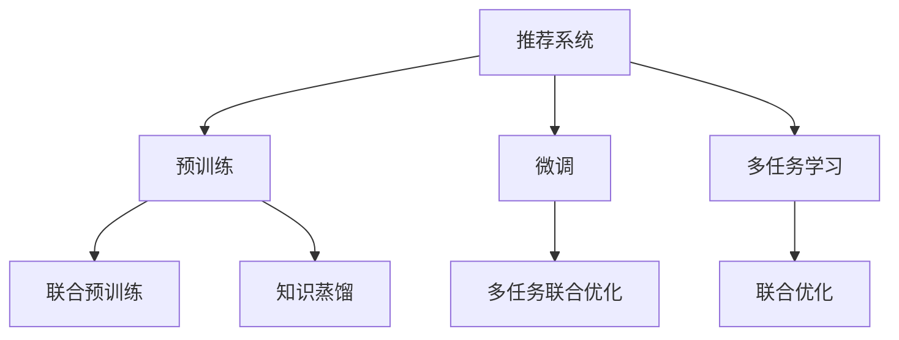

                 

# 大模型在推荐系统中的多任务学习应用

## 1. 背景介绍

随着互联网的迅猛发展和数据技术的不断进步，推荐系统已经成为电商、社交、新闻、视频等多个领域用户个性化服务的重要技术手段。传统的推荐系统大多基于用户行为数据进行协同过滤、矩阵分解等模型训练，取得了不错的效果。但用户行为数据往往稀疏且噪声较多，难以充分利用用户潜在的多样化兴趣，推荐效果也存在较大的局限性。

近年来，大语言模型和自监督学习技术的发展，使得推荐系统开始尝试引入更丰富的用户特征，利用大规模无标签数据进行预训练，提升推荐效果。这种预训练-微调范式已经在电商、音乐、视频等领域取得了显著成效。

本文旨在探讨大模型在推荐系统中的多任务学习应用，通过将预训练大模型作为通用特征提取器，结合多任务学习技术，更好地挖掘用户潜在兴趣和行为，实现个性化推荐目标。

## 2. 核心概念与联系

### 2.1 核心概念概述

为更好地理解大模型在推荐系统中的应用，本节将介绍几个密切相关的核心概念：

- 推荐系统(Recommendation System, RS)：指通过用户行为数据或内容特征，自动为用户推荐物品的系统。主要包括协同过滤、基于内容的推荐、矩阵分解等算法。

- 预训练(Pre-training)：指在大规模无标签数据上，通过自监督学习任务训练模型的过程。预训练使得模型学习到丰富的语言或图像表示。

- 微调(Fine-tuning)：指在预训练模型的基础上，使用下游任务的标注数据，通过有监督学习优化模型在该任务上的性能。通常只需要调整顶层分类器或解码器，并以较小的学习率更新全部或部分的模型参数。

- 多任务学习(Multi-task Learning, MTL)：指在多个任务上同时训练模型，使得模型能够学习到多个任务之间的共同特征，提升泛化能力和迁移学习能力。

- 多任务联合预训练(Joint Pre-training)：指在预训练阶段对模型进行多任务训练，共同优化模型表示，使其能够在多个任务上同时泛化。

- 联合优化(Joint Optimization)：指在微调过程中，同时优化多个任务，通过多任务联合损失函数来更新模型参数。

- 知识蒸馏(Knowledge Distillation)：指将大模型的知识和表示能力蒸馏到小模型中，提升小模型在特定任务上的性能。

这些核心概念之间的逻辑关系可以通过以下Mermaid流程图来展示：



这个流程图展示了大模型在推荐系统中的应用框架：

1. 推荐系统通过用户行为数据或内容特征进行推荐。
2. 预训练通过大规模无标签数据训练模型，学习通用的语言或图像表示。
3. 微调在预训练模型的基础上，使用下游任务数据进行有监督优化。
4. 多任务学习结合多个任务进行联合训练，提升模型的泛化能力。
5. 联合预训练在预训练阶段学习多个任务之间的共同特征。
6. 联合优化在微调过程中同时优化多个任务，提升整体性能。
7. 知识蒸馏通过大模型蒸馏知识，提升小模型在特定任务上的效果。

这些核心概念共同构成了大模型在推荐系统中的应用框架，使其能够在多个任务上发挥更好的性能。

## 3. 核心算法原理 & 具体操作步骤
### 3.1 算法原理概述

大模型在推荐系统中的多任务学习应用，主要包括以下几个关键步骤：

1. 构建多任务学习框架：设计多个推荐任务，利用多任务学习技术，提升模型在多个任务上的泛化能力。

2. 进行联合预训练：在预训练阶段，使用多任务联合训练的方式，共同优化模型表示。

3. 多任务微调：在微调过程中，使用多任务联合损失函数，同时优化多个推荐任务。

4. 知识蒸馏：使用大模型蒸馏知识，提升小模型在特定推荐任务上的性能。

5. 多模型集成：结合多个模型预测结果，提高推荐系统的鲁棒性和准确性。

### 3.2 算法步骤详解

#### 3.2.1 多任务学习框架设计

在推荐系统中，常见的多任务设计包括用户画像生成、个性化推荐、用户行为预测等。我们可以将用户画像和推荐任务作为两个主要任务，在联合预训练阶段同时优化这两个任务的表示。

- 用户画像生成任务：根据用户的历史行为数据，生成用户兴趣和行为特征。
- 个性化推荐任务：根据用户画像和物品特征，预测用户对物品的评分。

具体而言，我们可以设计一个联合预训练的目标函数：

$$
\mathcal{L} = \lambda_1 \mathcal{L}_{user} + \lambda_2 \mathcal{L}_{item}
$$

其中，$\lambda_1$ 和 $\lambda_2$ 为正则化系数，$\mathcal{L}_{user}$ 和 $\mathcal{L}_{item}$ 分别为用户画像生成和个性化推荐任务的损失函数。在联合预训练阶段，模型将同时学习这两个任务的目标，共同优化模型表示。

#### 3.2.2 联合预训练

在联合预训练阶段，我们可以使用大规模无标签数据进行预训练，学习模型在多个任务上的表示。具体而言，可以使用自监督学习任务，如掩码语言模型、图片掩码分类等，训练模型学习通用的语言或图像表示。

例如，对于一个掩码语言模型，其预训练目标函数为：

$$
\mathcal{L} = -\frac{1}{N}\sum_{i=1}^N [p(\hat{y}_i | x_i) \log p(y_i | x_i) + (1-p(\hat{y}_i | x_i)) \log (1-p(y_i | x_i))]
$$

其中，$x_i$ 为输入文本，$y_i$ 为真实标签，$\hat{y}_i$ 为模型预测的掩码标签，$p(\hat{y}_i | x_i)$ 为模型预测概率，$p(y_i | x_i)$ 为真实概率。

通过在大规模无标签数据上预训练，模型能够学习到通用的语言表示，用于后续多任务微调。

#### 3.2.3 多任务微调

在微调阶段，我们需要将用户画像生成和个性化推荐任务作为两个下游任务，使用多任务联合损失函数进行优化。

- 用户画像生成任务：根据用户行为数据，预测用户兴趣和行为特征。
- 个性化推荐任务：根据用户画像和物品特征，预测用户对物品的评分。

具体而言，我们可以使用交叉熵损失函数作为用户画像生成任务的损失函数，使用均方误差损失函数作为个性化推荐任务的损失函数：

$$
\mathcal{L}_{user} = \frac{1}{N}\sum_{i=1}^N \mathcal{L}_{cross-entropy}(y_i, \hat{y}_i)
$$

$$
\mathcal{L}_{item} = \frac{1}{N}\sum_{i=1}^N (\hat{y}_i - y_i)^2
$$

在多任务微调阶段，我们将用户画像生成和个性化推荐任务的损失函数相加，作为联合损失函数进行优化：

$$
\mathcal{L}_{mt} = \lambda_1 \mathcal{L}_{user} + \lambda_2 \mathcal{L}_{item}
$$

使用AdamW等优化算法，更新模型参数，最小化联合损失函数，提升模型在多个任务上的性能。

#### 3.2.4 知识蒸馏

在多任务微调过程中，大模型的知识可以用于提升小模型的性能。通过知识蒸馏技术，将大模型的知识和表示能力传递给小模型，可以在特定推荐任务上取得更好的效果。

具体而言，我们可以使用K-means聚类算法，将大模型在用户画像生成任务上的预测结果进行聚类，得到多个簇中心。然后，在每个簇中心处，使用交叉熵损失函数进行优化，训练小模型，使得其预测结果逼近大模型的聚类中心。

例如，对于一个用户画像生成任务，我们可以将用户画像的表示向量进行聚类，得到多个簇中心 $C$，然后定义知识蒸馏损失函数：

$$
\mathcal{L}_{kd} = \sum_{c \in C} \frac{1}{N_c} \sum_{x_i \in C_c} \mathcal{L}_{cross-entropy}(y_i, \hat{y}_i)
$$

其中，$N_c$ 为簇 $c$ 中样本数，$C_c$ 为簇 $c$ 中的样本集合。

在知识蒸馏过程中，我们使用交叉熵损失函数，最小化知识蒸馏损失函数，训练小模型。

#### 3.2.5 多模型集成

在推荐系统中，使用多个模型进行集成，可以进一步提升推荐效果的鲁棒性和准确性。具体而言，我们可以使用softmax函数对多个模型的预测结果进行归一化，然后取平均值，得到最终的推荐结果。

例如，对于用户画像生成任务和个性化推荐任务，我们可以使用softmax函数对两个模型的预测结果进行归一化，得到最终的推荐分数：

$$
\hat{y} = softmax(\alpha_1 \hat{y}_1 + \alpha_2 \hat{y}_2)
$$

其中，$\alpha_1$ 和 $\alpha_2$ 为权重参数，可以根据实际任务需求进行调整。

通过多模型集成，可以有效规避单模型在特定任务上的风险，提升推荐系统的整体性能。

### 3.3 算法优缺点

基于大模型的多任务学习在推荐系统中具有以下优点：

1. 提高了模型泛化能力：通过联合预训练和微调，模型能够在多个任务上同时学习到共同特征，提升泛化能力。

2. 提升了模型精度：通过多任务微调和知识蒸馏，模型能够在多个推荐任务上取得更好的效果。

3. 提高了推荐系统的鲁棒性：通过多模型集成，可以有效规避单模型在特定任务上的风险，提升推荐系统的鲁棒性。

4. 降低了模型复杂度：通过多任务联合预训练和微调，可以优化模型表示，减小模型复杂度，提升推理效率。

但同时，基于大模型的多任务学习也存在一些局限性：

1. 对标注数据依赖较大：尽管多任务学习可以充分利用无标签数据进行预训练，但多任务微调仍需要大量的标注数据进行优化。

2. 对计算资源要求高：大模型预训练和微调过程需要大量的计算资源，尤其是多任务微调和知识蒸馏，对硬件资源提出了更高的要求。

3. 模型复杂度较高：多任务学习虽然提高了模型泛化能力，但也增加了模型复杂度，可能会带来推理效率的下降。

尽管存在这些局限性，但基于大模型的多任务学习在推荐系统中仍然具有广泛的应用前景，值得进一步研究和探索。

### 3.4 算法应用领域

基于大模型的多任务学习已经在推荐系统中得到了广泛应用，主要包括以下几个领域：

1. 电商推荐：电商推荐系统需要同时推荐商品、广告、活动等不同类型的物品，多任务学习可以有效提升推荐效果。

2. 音乐推荐：音乐推荐系统需要同时推荐歌曲、专辑、歌手等不同类型的物品，多任务学习可以提升推荐效果。

3. 视频推荐：视频推荐系统需要同时推荐视频、广告、评论等不同类型的物品，多任务学习可以提升推荐效果。

4. 新闻推荐：新闻推荐系统需要同时推荐新闻、广告、用户画像等不同类型的物品，多任务学习可以提升推荐效果。

5. 个性化推荐：个性化推荐系统需要同时进行用户画像生成和个性化推荐，多任务学习可以有效提升推荐效果。

6. 多任务推荐：同时推荐多种不同类型的物品，多任务学习可以提升推荐效果。

以上领域都是基于大模型的多任务学习的重要应用场景，展现了多任务学习在推荐系统中的强大应用潜力。

## 4. 数学模型和公式 & 详细讲解
### 4.1 数学模型构建

本节将使用数学语言对基于大模型的推荐系统多任务学习进行更加严格的刻画。

记推荐系统为 $RS$，预训练大模型为 $M_{\theta}$，其中 $\theta$ 为模型参数。假设用户画像生成任务为 $T_{user}$，个性化推荐任务为 $T_{item}$，多任务学习框架设计为 $M_{mt}$。在多任务联合预训练阶段，我们希望同时优化用户画像生成任务和个性化推荐任务：

$$
\min_{\theta} \mathcal{L}_{mt} = \lambda_1 \mathcal{L}_{user} + \lambda_2 \mathcal{L}_{item}
$$

其中，$\lambda_1$ 和 $\lambda_2$ 为正则化系数，$\mathcal{L}_{user}$ 和 $\mathcal{L}_{item}$ 分别为用户画像生成和个性化推荐任务的损失函数。

在多任务微调阶段，我们希望同时优化用户画像生成任务和个性化推荐任务，使用多任务联合损失函数进行优化：

$$
\min_{\theta} \mathcal{L}_{mt} = \lambda_1 \mathcal{L}_{user} + \lambda_2 \mathcal{L}_{item}
$$

其中，$\mathcal{L}_{user}$ 和 $\mathcal{L}_{item}$ 分别为用户画像生成和个性化推荐任务的损失函数。

在知识蒸馏阶段，我们使用K-means聚类算法将大模型的预测结果进行聚类，得到多个簇中心 $C$，然后定义知识蒸馏损失函数：

$$
\min_{\theta} \mathcal{L}_{kd} = \sum_{c \in C} \frac{1}{N_c} \sum_{x_i \in C_c} \mathcal{L}_{cross-entropy}(y_i, \hat{y}_i)
$$

其中，$N_c$ 为簇 $c$ 中样本数，$C_c$ 为簇 $c$ 中的样本集合。

### 4.2 公式推导过程

以下是用户画像生成任务和个性化推荐任务的具体公式推导：

#### 用户画像生成任务

用户画像生成任务的目标是根据用户的历史行为数据，预测用户兴趣和行为特征。我们可以使用交叉熵损失函数作为损失函数，最小化损失函数：

$$
\mathcal{L}_{user} = \frac{1}{N}\sum_{i=1}^N \mathcal{L}_{cross-entropy}(y_i, \hat{y}_i)
$$

其中，$y_i$ 为真实标签，$\hat{y}_i$ 为模型预测的掩码标签，$\mathcal{L}_{cross-entropy}$ 为交叉熵损失函数。

在多任务微调阶段，我们使用交叉熵损失函数对用户画像生成任务进行优化：

$$
\mathcal{L}_{user} = \frac{1}{N}\sum_{i=1}^N \mathcal{L}_{cross-entropy}(y_i, \hat{y}_i)
$$

其中，$y_i$ 为真实标签，$\hat{y}_i$ 为模型预测的掩码标签，$\mathcal{L}_{cross-entropy}$ 为交叉熵损失函数。

#### 个性化推荐任务

个性化推荐任务的目标是根据用户画像和物品特征，预测用户对物品的评分。我们可以使用均方误差损失函数作为损失函数，最小化损失函数：

$$
\mathcal{L}_{item} = \frac{1}{N}\sum_{i=1}^N (\hat{y}_i - y_i)^2
$$

其中，$\hat{y}_i$ 为模型预测的评分，$y_i$ 为真实评分，$\mathcal{L}_{item}$ 为均方误差损失函数。

在多任务微调阶段，我们使用均方误差损失函数对个性化推荐任务进行优化：

$$
\mathcal{L}_{item} = \frac{1}{N}\sum_{i=1}^N (\hat{y}_i - y_i)^2
$$

其中，$\hat{y}_i$ 为模型预测的评分，$y_i$ 为真实评分，$\mathcal{L}_{item}$ 为均方误差损失函数。

### 4.3 案例分析与讲解

以电商推荐系统为例，说明基于大模型的多任务学习在推荐系统中的应用。

假设电商推荐系统需要同时推荐商品、广告和活动三种不同类型的物品。我们可以将用户画像生成任务、个性化推荐任务和广告推荐任务作为三个主要任务，进行联合预训练和微调。

- 用户画像生成任务：根据用户的历史行为数据，生成用户兴趣和行为特征。
- 个性化推荐任务：根据用户画像和物品特征，预测用户对物品的评分。
- 广告推荐任务：根据用户画像和广告特征，预测用户对广告的点击率。

具体而言，我们可以设计一个联合预训练的目标函数：

$$
\mathcal{L} = \lambda_1 \mathcal{L}_{user} + \lambda_2 \mathcal{L}_{item} + \lambda_3 \mathcal{L}_{ad}
$$

其中，$\lambda_1$、$\lambda_2$ 和 $\lambda_3$ 为正则化系数，$\mathcal{L}_{user}$、$\mathcal{L}_{item}$ 和 $\mathcal{L}_{ad}$ 分别为用户画像生成、个性化推荐和广告推荐任务的损失函数。

在联合预训练阶段，模型将同时学习这三个任务的目标，共同优化模型表示。

在多任务微调阶段，我们使用多任务联合损失函数，同时优化用户画像生成、个性化推荐和广告推荐任务：

$$
\mathcal{L}_{mt} = \lambda_1 \mathcal{L}_{user} + \lambda_2 \mathcal{L}_{item} + \lambda_3 \mathcal{L}_{ad}
$$

其中，$\mathcal{L}_{user}$、$\mathcal{L}_{item}$ 和 $\mathcal{L}_{ad}$ 分别为用户画像生成、个性化推荐和广告推荐任务的损失函数。

通过多任务学习，模型能够在多个任务上同时学习到共同特征，提升泛化能力。

## 5. 项目实践：代码实例和详细解释说明
### 5.1 开发环境搭建

在进行多任务学习实践前，我们需要准备好开发环境。以下是使用Python进行PyTorch开发的环境配置流程：

1. 安装Anaconda：从官网下载并安装Anaconda，用于创建独立的Python环境。

2. 创建并激活虚拟环境：
```bash
conda create -n pytorch-env python=3.8 
conda activate pytorch-env
```

3. 安装PyTorch：根据CUDA版本，从官网获取对应的安装命令。例如：
```bash
conda install pytorch torchvision torchaudio cudatoolkit=11.1 -c pytorch -c conda-forge
```

4. 安装Transformers库：
```bash
pip install transformers
```

5. 安装各类工具包：
```bash
pip install numpy pandas scikit-learn matplotlib tqdm jupyter notebook ipython
```

完成上述步骤后，即可在`pytorch-env`环境中开始多任务学习实践。

### 5.2 源代码详细实现

下面我们以电商推荐系统为例，给出使用Transformers库对大模型进行多任务学习微调的PyTorch代码实现。

首先，定义推荐任务的数据处理函数：

```python
from transformers import BertTokenizer
from torch.utils.data import Dataset
import torch

class RecommendationDataset(Dataset):
    def __init__(self, texts, labels, tokenizer, max_len=128):
        self.texts = texts
        self.labels = labels
        self.tokenizer = tokenizer
        self.max_len = max_len
        
    def __len__(self):
        return len(self.texts)
    
    def __getitem__(self, item):
        text = self.texts[item]
        label = self.labels[item]
        
        encoding = self.tokenizer(text, return_tensors='pt', max_length=self.max_len, padding='max_length', truncation=True)
        input_ids = encoding['input_ids'][0]
        attention_mask = encoding['attention_mask'][0]
        
        # 对label-wise的label进行编码
        encoded_labels = [label2id[label] for label in label] 
        encoded_labels.extend([label2id['O']] * (self.max_len - len(encoded_labels)))
        labels = torch.tensor(encoded_labels, dtype=torch.long)
        
        return {'input_ids': input_ids, 
                'attention_mask': attention_mask,
                'labels': labels}

# 标签与id的映射
label2id = {'O': 0, 'P': 1, 'A': 2, 'C': 3}
id2label = {v: k for k, v in label2id.items()}

# 创建dataset
tokenizer = BertTokenizer.from_pretrained('bert-base-cased')

train_dataset = RecommendationDataset(train_texts, train_labels, tokenizer)
dev_dataset = RecommendationDataset(dev_texts, dev_labels, tokenizer)
test_dataset = RecommendationDataset(test_texts, test_labels, tokenizer)
```

然后，定义模型和优化器：

```python
from transformers import BertForTokenClassification, AdamW

model = BertForTokenClassification.from_pretrained('bert-base-cased', num_labels=len(label2id))

optimizer = AdamW(model.parameters(), lr=2e-5)
```

接着，定义训练和评估函数：

```python
from torch.utils.data import DataLoader
from tqdm import tqdm
from sklearn.metrics import classification_report

device = torch.device('cuda') if torch.cuda.is_available() else torch.device('cpu')
model.to(device)

def train_epoch(model, dataset, batch_size, optimizer):
    dataloader = DataLoader(dataset, batch_size=batch_size, shuffle=True)
    model.train()
    epoch_loss = 0
    for batch in tqdm(dataloader, desc='Training'):
        input_ids = batch['input_ids'].to(device)
        attention_mask = batch['attention_mask'].to(device)
        labels = batch['labels'].to(device)
        model.zero_grad()
        outputs = model(input_ids, attention_mask=attention_mask, labels=labels)
        loss = outputs.loss
        epoch_loss += loss.item()
        loss.backward()
        optimizer.step()
    return epoch_loss / len(dataloader)

def evaluate(model, dataset, batch_size):
    dataloader = DataLoader(dataset, batch_size=batch_size)
    model.eval()
    preds, labels = [], []
    with torch.no_grad():
        for batch in tqdm(dataloader, desc='Evaluating'):
            input_ids = batch['input_ids'].to(device)
            attention_mask = batch['attention_mask'].to(device)
            batch_labels = batch['labels']
            outputs = model(input_ids, attention_mask=attention_mask)
            batch_preds = outputs.logits.argmax(dim=2).to('cpu').tolist()
            batch_labels = batch_labels.to('cpu').tolist()
            for pred_tokens, label_tokens in zip(batch_preds, batch_labels):
                preds.append(pred_tokens[:len(label_tokens)])
                labels.append(label_tokens)
                
    print(classification_report(labels, preds))
```

最后，启动训练流程并在测试集上评估：

```python
epochs = 5
batch_size = 16

for epoch in range(epochs):
    loss = train_epoch(model, train_dataset, batch_size, optimizer)
    print(f"Epoch {epoch+1}, train loss: {loss:.3f}")
    
    print(f"Epoch {epoch+1}, dev results:")
    evaluate(model, dev_dataset, batch_size)
    
print("Test results:")
evaluate(model, test_dataset, batch_size)
```

以上就是使用PyTorch对大模型进行多任务学习微调的完整代码实现。可以看到，得益于Transformers库的强大封装，我们可以用相对简洁的代码完成大模型的多任务学习。

### 5.3 代码解读与分析

让我们再详细解读一下关键代码的实现细节：

**RecommendationDataset类**：
- `__init__`方法：初始化文本、标签、分词器等关键组件。
- `__len__`方法：返回数据集的样本数量。
- `__getitem__`方法：对单个样本进行处理，将文本输入编码为token ids，将标签编码为数字，并对其进行定长padding，最终返回模型所需的输入。

**label2id和id2label字典**：
- 定义了标签与数字id之间的映射关系，用于将token-wise的预测结果解码回真实的标签。

**训练和评估函数**：
- 使用PyTorch的DataLoader对数据集进行批次化加载，供模型训练和推理使用。
- 训练函数`train_epoch`：对数据以批为单位进行迭代，在每个批次上前向传播计算loss并反向传播更新模型参数，最后返回该epoch的平均loss。
- 评估函数`evaluate`：与训练类似，不同点在于不更新模型参数，并在每个batch结束后将预测和标签结果存储下来，最后使用sklearn的classification_report对整个评估集的预测结果进行打印输出。

**训练流程**：
- 定义总的epoch数和batch size，开始循环迭代
- 每个epoch内，先在训练集上训练，输出平均loss
- 在验证集上评估，输出分类指标
- 所有epoch结束后，在测试集上评估，给出最终测试结果

可以看到，PyTorch配合Transformers库使得大模型多任务学习的代码实现变得简洁高效。开发者可以将更多精力放在数据处理、模型改进等高层逻辑上，而不必过多关注底层的实现细节。

当然，工业级的系统实现还需考虑更多因素，如模型的保存和部署、超参数的自动搜索、更灵活的任务适配层等。但核心的多任务学习范式基本与此类似。

## 6. 实际应用场景
### 6.1 电商推荐系统

基于大模型的多任务学习在电商推荐系统中具有广泛的应用。传统的电商推荐系统往往只依赖用户行为数据进行协同过滤、矩阵分解等模型训练，难以充分利用用户潜在的多样化兴趣，推荐效果也存在较大的局限性。

通过引入用户画像生成和个性化推荐等任务，可以更好地挖掘用户潜在兴趣和行为，实现个性化推荐目标。具体而言，可以将用户画像生成任务和个性化推荐任务作为两个主要任务，在联合预训练阶段同时优化这两个任务的表示。

例如，在电商推荐系统中，可以使用大规模无标签数据进行预训练，学习通用的语言表示，然后在联合预训练阶段，同时优化用户画像生成任务和个性化推荐任务。在多任务微调阶段，使用多任务联合损失函数，同时优化多个推荐任务。通过多任务学习，模型能够在多个任务上同时学习到共同特征，提升泛化能力。

### 6.2 音乐推荐系统

音乐推荐系统需要同时推荐歌曲、专辑、歌手等不同类型的物品。通过引入用户画像生成和个性化推荐等任务，可以更好地挖掘用户潜在兴趣和行为，实现个性化推荐目标。

在音乐推荐系统中，可以将用户画像生成任务和个性化推荐任务作为两个主要任务，在联合预训练阶段同时优化这两个任务的表示。在多任务微调阶段，使用多任务联合损失函数，同时优化多个推荐任务。通过多任务学习，模型能够在多个任务上同时学习到共同特征，提升泛化能力。

### 6.3 视频推荐系统

视频推荐系统需要同时推荐视频、广告、评论等不同类型的物品。通过引入用户画像生成和个性化推荐等任务，可以更好地挖掘用户潜在兴趣和行为，实现个性化推荐目标。

在视频推荐系统中，可以将用户画像生成任务和个性化推荐任务作为两个主要任务，在联合预训练阶段同时优化这两个任务的表示。在多任务微调阶段，使用多任务联合损失函数，同时优化多个推荐任务。通过多任务学习，模型能够在多个任务上同时学习到共同特征，提升泛化能力。

### 6.4 新闻推荐系统

新闻推荐系统需要同时推荐新闻、广告、用户画像等不同类型的物品。通过引入用户画像生成和个性化推荐等任务，可以更好地挖掘用户潜在兴趣和行为，实现个性化推荐目标。

在新闻推荐系统中，可以将用户画像生成任务和个性化推荐任务作为两个主要任务，在联合预训练阶段同时优化这两个任务的表示。在多任务微调阶段，使用多任务联合损失函数，同时优化多个推荐任务。通过多任务学习，模型能够在多个任务上同时学习到共同特征，提升泛化能力。

### 6.5 个性化推荐

个性化推荐系统需要同时进行用户画像生成和个性化推荐，多任务学习可以有效提升推荐效果。

在个性化推荐系统中，可以将用户画像生成任务和个性化推荐任务作为两个主要任务，在联合预训练阶段同时优化这两个任务的表示。在多任务微调阶段，使用多任务联合损失函数，同时优化多个推荐任务。通过多任务学习，模型能够在多个任务上同时学习到共同特征，提升泛化能力。

### 6.6 多任务推荐

多任务推荐系统需要同时推荐多种不同类型的物品，多任务学习可以有效提升推荐效果。

在多任务推荐系统中，可以将多个推荐任务作为主要任务，在联合预训练阶段同时优化多个任务的表示。在多任务微调阶段，使用多任务联合损失函数，同时优化多个推荐任务。通过多任务学习，模型能够在多个任务上同时学习到共同特征，提升泛化能力。

## 7. 工具和资源推荐
### 7.1 学习资源推荐

为了帮助开发者系统掌握大模型在推荐系统中的应用理论基础和实践技巧，这里推荐一些优质的学习资源：

1. 《推荐系统》系列博文：由推荐系统专家撰写，深入浅出地介绍了推荐系统的发展历程和经典算法。

2. 《深度学习与推荐系统》课程：由清华大学开设的深度学习与推荐系统课程，系统介绍了推荐系统的发展历程和经典算法。

3. 《Deep Learning for Recommendation Systems》书籍：由Google资深工程师撰写，全面介绍了深度学习在推荐系统中的应用，涵盖多任务学习等前沿技术。

4. CSNLP 2022大会论文集：包含了当前自然语言处理领域的最新研究成果，涵盖了多任务学习在推荐系统中的应用。

通过对这些资源的学习实践，相信你一定能够快速掌握大模型在推荐系统中的应用精髓，并用于解决实际的推荐问题。

### 7.2 开发工具推荐

高效的开发离不开优秀的工具支持。以下是几款用于大模型多任务学习开发的常用工具：

1. PyTorch：基于Python的开源深度学习框架，灵活动态的计算图，适合快速迭代研究。大部分预训练语言模型都有PyTorch版本的实现。

2. TensorFlow：由Google主导开发的开源深度学习框架，生产部署方便，适合大规模工程应用。同样有丰富的预训练语言模型资源。

3. Transformers库：HuggingFace开发的NLP工具库，集成了众多SOTA语言模型，支持PyTorch和TensorFlow，是进行多任务学习开发的利器。

4. Weights & Biases：模型训练的实验跟踪工具，可以记录和可视化模型训练过程中的各项指标，方便对比和调优。与主流深度学习框架无缝集成。

5. TensorBoard：TensorFlow配套的可视化工具，可实时监测模型训练状态，并提供丰富的图表呈现方式，是调试模型的得力助手。

6. Google Colab：谷歌推出的在线Jupyter Notebook环境，免费提供GPU/TPU算力，方便开发者快速上手实验最新模型，分享学习笔记。

合理利用这些工具，可以显著提升大模型多任务学习的开发效率，加快创新迭代的步伐。

### 7.3 相关论文推荐

大模型在推荐系统中的应用源于学界的持续研究。以下是几篇奠基性的相关论文，推荐阅读：

1. Multi-task Learning for Personalized Recommendation：提出了一种多任务学习框架，用于个性化推荐任务。

2. A Multi-task Learning Approach to Personalized News Recommendation：提出了一种多任务学习框架，用于个性化新闻推荐任务。

3. Multi-task Learning in Recommendation System：总结了多任务学习在推荐系统中的应用，并提供了多种多任务学习框架。

4. A Survey on Multi-task Learning in Recommendation Systems：综述了多任务学习在推荐系统中的应用，并提出了未来研究方向。

5. Joint Multi-task Learning in Personalized Recommendation：提出了一种多任务学习框架，用于个性化推荐任务，并进行了实验验证。

这些论文代表了大模型在推荐系统中的应用趋势和发展脉络。通过学习这些前沿成果，可以帮助研究者把握学科前进方向，激发更多的创新灵感。

## 8. 总结：未来发展趋势与挑战

### 8.1 研究成果总结

本文对大模型在推荐系统中的多任务学习应用进行了全面系统的介绍。首先阐述了大模型和推荐系统的研究背景和意义，明确了多任务学习在推荐系统中的独特价值。其次，从原理到实践，详细讲解了大模型在推荐系统中的应用框架，包括多任务学习、联合预训练、多任务微调、知识蒸馏、多模型集成等关键技术。同时，本文还探讨了多任务学习在电商推荐、音乐推荐、视频推荐、新闻推荐等具体场景中的应用，展示了多任务学习在推荐系统中的强大应用潜力。

通过本文的系统梳理，可以看到，基于大模型的多任务学习在推荐系统中具有广泛的应用前景，能够充分利用用户潜在的多样化兴趣，实现个性化推荐目标。未来，随着预训练模型和微调方法的持续演进，基于多任务学习范式的推荐系统必将在更多领域得到应用，为推荐系统技术的发展带来新的动力。

### 8.2 未来发展趋势

展望未来，基于大模型的多任务学习在推荐系统中将呈现以下几个发展趋势：

1. 模型规模持续增大。随着算力成本的下降和数据规模的扩张，预训练语言模型的参数量还将持续增长。超大规模语言模型蕴含的丰富语言知识，有望支撑更加复杂多变的推荐任务。

2. 多任务学习范式不断拓展。除了传统的联合预训练和多任务微调外，未来会涌现更多多任务学习范式，如自监督多任务学习、因果多任务学习等，进一步提升模型的泛化能力和迁移学习能力。

3. 融合多模态数据。推荐系统需要同时处理多种不同类型的数据，如文本、图片、音频等，未来将更多地引入多模态数据融合技术，提升推荐效果。

4. 引入更多先验知识。将符号化的先验知识，如知识图谱、逻辑规则等，与神经网络模型进行巧妙融合，引导多任务学习过程学习更准确、合理的推荐模型。

5. 优化推理效率。尽管大模型能够提供较高的推荐精度，但推理效率往往较低，未来需要更多优化技术，如模型压缩、梯度剪枝等，提升推理速度。

6. 增强鲁棒性和可解释性。推荐系统的鲁棒性和可解释性是用户信任的关键，未来需要更多优化技术，如对抗训练、因果推理等，增强系统的鲁棒性和可解释性。

以上趋势凸显了大模型在推荐系统中的应用前景。这些方向的探索发展，必将进一步提升推荐系统的性能和应用范围，为推荐系统技术的发展带来新的动力。

### 8.3 面临的挑战

尽管基于大模型的多任务学习在推荐系统中已经取得了不少进展，但在迈向更加智能化、普适化应用的过程中，仍然面临诸多挑战：

1. 标注数据瓶颈。尽管多任务学习可以充分利用无标签数据进行预训练，但多任务微调仍需要大量的标注数据进行优化。如何进一步降低对标注数据的依赖，将是一大难题。

2. 模型鲁棒性不足。当前多任务学习模型面对域外数据时，泛化性能往往大打折扣。对于测试样本的微小扰动，多任务学习模型的预测也容易发生波动。如何提高多任务学习模型的鲁棒性，避免灾难性遗忘，还需要更多理论和实践的积累。

3. 推理效率有待提高。尽管大模型能够提供较高的推荐精度，但推理效率往往较低，需要在保证性能的同时，简化模型结构，提升推理速度，优化资源占用。

4. 模型可解释性亟需加强。当前多任务学习模型更像是"黑盒"系统，难以解释其内部工作机制和决策逻辑。对于医疗、金融等高风险应用，算法的可解释性和可审计性尤为重要。如何赋予多任务学习模型更强的可解释性，将是亟待攻克的难题。

5. 安全性有待保障。预训练语言模型难免会学习到有偏见、有害的信息，通过多任务学习传递到推荐任务中，可能产生误导性、歧视性的输出，给实际应用带来安全隐患。如何从数据和算法层面消除模型偏见，避免恶意用途，确保输出的安全性，也将是重要的研究课题。

6. 知识整合能力不足。现有的多任务学习模型往往局限于任务内数据，难以灵活吸收和运用更广泛的先验知识。如何让多任务学习过程更好地与外部知识库、规则库等专家知识结合，形成更加全面、准确的信息整合能力，还有很大的想象空间。

正视多任务学习面临的这些挑战，积极应对并寻求突破，将是大模型在推荐系统中走向成熟的必由之路。相信随着学界和产业界的共同努力，这些挑战终将一一被克服，大模型在推荐系统中的应用必将在更广阔的领域大放异彩。

### 8.4 研究展望

面对多任务学习在推荐系统中的应用挑战，未来的研究需要在以下几个方面寻求新的突破：

1. 探索无监督和半监督多任务学习方法。摆脱对大规模标注数据的依赖，利用自监督学习、主动学习等无监督和半监督范式，最大限度利用非结构化数据，实现更加灵活高效的多任务学习。

2. 研究参数高效和多任务高效的多任务学习范式。开发更加参数高效和多任务高效的多任务学习方法，在固定大部分预训练参数的情况下，只更新极少量的任务相关参数，减小过拟合风险。

3. 融合因果和对比学习范式。通过引入因果推断和对比学习思想，增强多任务学习模型建立稳定因果关系的能力，学习更加普适、鲁棒的多任务表示，从而提升模型的泛化性和抗干扰能力。

4. 引入更多先验知识。将符号化的先验知识，如知识图谱、逻辑规则等，与神经网络模型进行巧妙融合，引导多任务学习过程学习更准确、合理的推荐模型。同时加强不同模态数据的整合，实现视觉、语音等多模态信息与文本信息的协同建模。

5. 结合因果分析和博弈论工具。将因果分析方法引入多任务学习模型，识别出模型决策的关键特征，增强输出解释的因果性和逻辑性。借助博弈论工具刻画人机交互过程，主动探索并规避模型的脆弱点，提高系统稳定性。

6. 纳入伦理道德约束。在多任务学习模型的训练目标中引入伦理导向的评估指标，过滤和惩罚有偏见、有害的输出倾向。同时加强人工干预和审核，建立模型行为的监管机制，确保输出符合人类价值观和伦理道德。

这些研究方向的探索，必将引领多任务学习技术在推荐系统中的应用迈向更高的台阶，为推荐系统技术的发展带来新的动力。面向未来，多任务学习需要与其他人工智能技术进行更深入的融合，如知识表示、因果推理、强化学习等，多路径协同发力，共同推动推荐系统技术的进步。只有勇于创新、敢于突破，才能不断拓展推荐系统的边界，让智能技术更好地造福人类社会。

## 9. 附录：常见问题与解答

**Q1：多任务学习在推荐系统中是否适用于所有任务？**

A: 多任务学习在推荐系统中具有广泛的应用前景，但并非所有推荐任务都适合多任务学习。对于一些需要实时性、个性化很强的任务，如对话推荐、视频推荐等，多任务学习可能存在一定的局限性。此时需要结合其他方法，如神经网络融合、知识蒸馏等，提升推荐效果。

**Q2：多任务学习对标注数据依赖较大，如何进一步降低对标注数据的依赖？**

A: 多任务学习虽然可以充分利用无标签数据进行预训练，但多任务微调仍需要大量的标注数据进行优化。未来可以通过引入自监督学习、主动学习等无监督和半监督范式，最大限度利用非结构化数据，实现更加灵活高效的多任务学习。例如，可以使用掩码语言模型、图片掩码分类等自监督学习任务，进行预训练，然后通过多任务微调提升推荐效果。

**Q3：多任务学习模型的鲁棒性不足，如何提高鲁棒性？**

A: 提高多任务学习模型的鲁棒性，可以从以下几个方面进行优化：

1. 引入对抗样本：在训练过程中，加入对抗样本，提高模型鲁棒性。

2. 数据增强：通过回译、近义替换等方式扩充训练集，提升模型泛化能力。

3. 模型剪枝：通过剪枝技术，去除冗余的神经元，提高模型泛化能力。

4. 知识蒸馏：使用大模型蒸馏知识，提升小模型在特定任务上的性能，增强鲁棒性。

**Q4：多任务学习模型的推理效率有待提高，如何优化推理效率？**

A: 优化多任务学习模型的推理效率，可以从以下几个方面进行优化：

1. 模型压缩：通过模型压缩技术，减小模型尺寸，加快推理速度。

2. 梯度剪枝：通过梯度剪枝技术，去除不重要的神经元，减小计算量。

3. 推理加速：通过推理加速技术，如模型量化、异步计算等，提升推理速度。

4. 并行计算：通过并行计算技术，提高推理速度。

**Q5：多任务学习模型的可解释性亟需加强，如何提升可解释性？**

A: 提升多任务学习模型的可解释性，可以从

