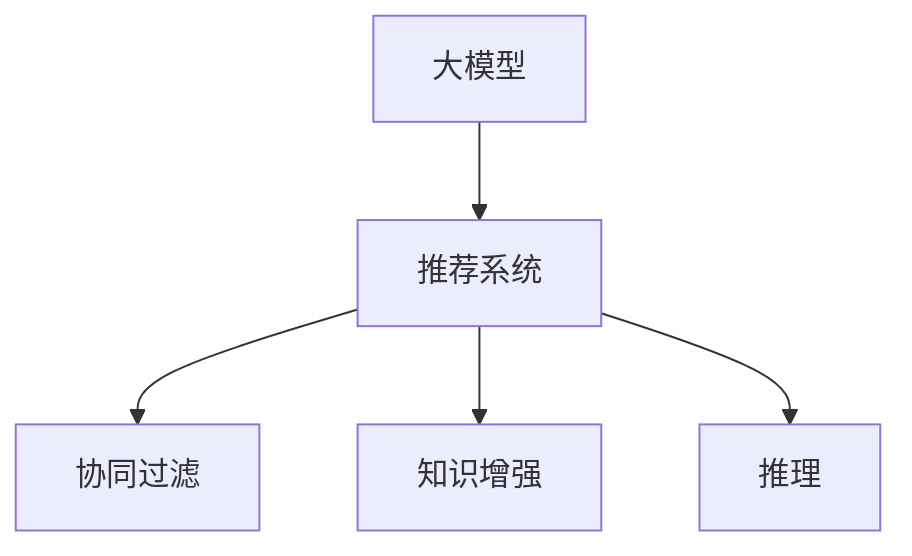
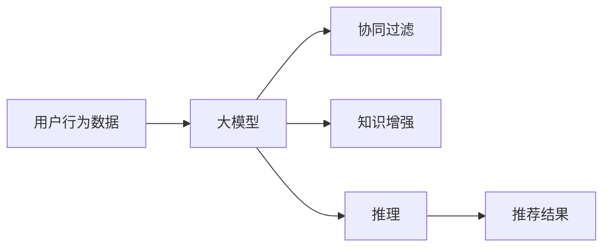

                 

# 大模型在推荐系统中的知识增强与推理

> 关键词：大模型，知识增强，推荐系统，推理，协同过滤，深度学习

## 1. 背景介绍

推荐系统作为互联网应用的核心功能之一，在电商、视频、社交媒体等多个领域广泛应用。传统的协同过滤算法和基于深度学习的推荐方法，已取得了一定的效果。但随着数据量激增和用户需求日益复杂，现有方法面临计算复杂度高、特征工程繁琐、推荐效果泛化能力差等挑战。大模型作为一种新兴的推荐技术，以其强大的表征能力和推理能力，有望进一步提升推荐系统的性能和效率。

## 2. 核心概念与联系

### 2.1 核心概念概述

为更好地理解大模型在推荐系统中的应用，本节将介绍几个关键概念：

- 大模型：以Transformer为代表的深度学习模型，如BERT、GPT、XLNet等。通过大规模无标签数据预训练，具有强大的表征能力，能够有效捕捉用户行为和商品属性之间的复杂关系。

- 推荐系统：基于用户行为数据和商品属性数据，为用户推荐感兴趣的商品的系统。常见的推荐算法包括协同过滤、基于内容的推荐、混合推荐等。

- 知识增强：将用户行为数据与外部知识库、规则库等结合，对推荐模型进行知识增强，提升模型的泛化能力和鲁棒性。

- 推理：在推荐系统中，对模型预测结果进行解释，理解其背后的逻辑和原因。常见的推理方法包括逻辑推理、因果推理、解释性生成等。

这些概念之间的逻辑关系可以通过以下Mermaid流程图来展示：



这个流程图展示了大模型、推荐系统、协同过滤、知识增强和推理之间的关系：

1. 大模型通过大规模预训练，获取丰富的知识表示。
2. 推荐系统通过用户行为数据和商品属性数据进行推荐。
3. 协同过滤和知识增强是推荐系统的常用技术。
4. 推理技术用于增强推荐模型的可解释性。

### 2.2 核心概念原理和架构的 Mermaid 流程图



## 3. 核心算法原理 & 具体操作步骤
### 3.1 算法原理概述

大模型在推荐系统中的应用，主要基于以下原理：

- 利用大模型对用户行为数据进行表征学习，捕捉用户偏好和商品属性的复杂关系。
- 通过知识增强，引入外部知识库和规则，进一步提升模型的泛化能力和鲁棒性。
- 采用推理技术，对推荐结果进行解释和验证，增强模型的可解释性。

具体来说，大模型推荐系统一般包括以下几个步骤：

1. 数据预处理：将用户行为数据和商品属性数据进行清洗、归一化、向量化等预处理。
2. 用户行为编码：将用户行为数据输入大模型，通过自监督学习任务获得用户兴趣表示。
3. 商品属性编码：将商品属性数据输入大模型，获得商品属性表示。
4. 知识增强：将用户兴趣表示和商品属性表示与外部知识库或规则结合，进行知识增强。
5. 推荐预测：将用户兴趣表示和商品属性表示拼接，通过多层感知机、注意力机制等方法进行推荐预测。
6. 结果解释：采用推理技术，对推荐结果进行解释，提供给用户参考。

### 3.2 算法步骤详解

以一个基于知识增强的推荐系统为例，详细介绍其算法步骤：

**Step 1: 数据预处理**
- 收集用户行为数据，包括浏览记录、购买记录、评分记录等。
- 收集商品属性数据，包括商品描述、分类、价格等。
- 清洗和标准化数据，去除噪声和异常值。
- 将数据向量化，使用TF-IDF或Word2Vec等方法进行特征提取。

**Step 2: 用户行为编码**
- 将用户行为数据输入大模型，如BERT、XLNet等。
- 利用自监督学习任务，如掩码语言模型、next sentence prediction等，训练用户兴趣表示。

**Step 3: 商品属性编码**
- 将商品属性数据输入大模型，进行特征提取。
- 使用正则化、Dropout等技术，防止过拟合。

**Step 4: 知识增强**
- 收集外部知识库，如知识图谱、商品分类表等。
- 将用户兴趣表示和商品属性表示与知识库结合，进行知识增强。
- 使用图神经网络或结构化预测等方法，捕捉用户行为和商品属性之间的关系。

**Step 5: 推荐预测**
- 将用户兴趣表示和商品属性表示拼接，输入多层感知机等模型。
- 使用注意力机制、稠密层等方法，进行推荐预测。
- 利用负采样、正则化等技术，避免过拟合。

**Step 6: 结果解释**
- 采用推理技术，如逻辑推理、因果推理等，解释推荐结果。
- 提供用户推荐理由，增强系统的可信度。

### 3.3 算法优缺点

大模型在推荐系统中的应用具有以下优点：

1. 强大的表征能力：大模型能够有效捕捉用户行为和商品属性之间的复杂关系，提升推荐模型的准确性和泛化能力。
2. 灵活的推理能力：通过推理技术，大模型能够提供推荐结果的解释，增强系统的可信度。
3. 高效的特征学习：大模型自动学习特征表示，无需手工设计特征工程，减少特征工程的时间和成本。

同时，大模型在推荐系统中的应用也存在一定的局限性：

1. 计算复杂度高：大模型的训练和推理过程计算复杂度高，需要高性能的硬件支持。
2. 数据需求大：大模型需要大规模的训练数据和标注数据，数据获取成本高。
3. 可解释性不足：大模型通常是"黑盒"系统，难以解释其内部工作机制和决策逻辑。
4. 依赖外部知识：知识增强需要引入外部知识库，可能存在知识库质量和数据一致性的问题。

尽管存在这些局限性，但大模型在推荐系统中的应用仍具有广泛的前景，需要在实践中不断优化和改进。

### 3.4 算法应用领域

大模型在推荐系统中的应用已经覆盖了电商、视频、社交等多个领域，具体包括：

- 电商平台：推荐用户感兴趣的商品、优惠活动等。
- 视频平台：推荐用户感兴趣的视频、节目等。
- 社交网络：推荐用户感兴趣的朋友、文章等。
- 音乐平台：推荐用户感兴趣的歌曲、歌手等。
- 新闻推荐：推荐用户感兴趣的新闻、文章等。

## 4. 数学模型和公式 & 详细讲解 & 举例说明

### 4.1 数学模型构建

本节将使用数学语言对大模型在推荐系统中的应用进行更加严格的刻画。

记用户行为数据为 $x \in \mathbb{R}^d$，商品属性数据为 $y \in \mathbb{R}^d$，其中 $d$ 为特征维度。大模型的输入为 $z = \text{encode}(x,y)$，输出为 $u \in \mathbb{R}^d$，表示用户兴趣向量。推荐模型为 $f(u,y)$，输出预测结果 $\hat{y}$。知识增强模块为 $g(z,k)$，其中 $k$ 为外部知识库，输出增强后的商品属性表示 $g(y)$。

### 4.2 公式推导过程

假设推荐模型为 $f(u,y) = \text{MLP}(u,y)$，即多层感知机。知识增强模块为 $g(z,k) = \text{KGNN}(z,k)$，即图神经网络。推荐预测过程如下：

1. 用户行为编码：
   $$
   z = \text{BERT}(x,y)
   $$

2. 商品属性编码：
   $$
   y = \text{XLNet}(y)
   $$

3. 知识增强：
   $$
   g(y) = \text{KGNN}(y,k)
   $$

4. 推荐预测：
   $$
   \hat{y} = f(u,g(y)) = \text{MLP}(u,g(y))
   $$

### 4.3 案例分析与讲解

以Amazon电商推荐系统为例，详细分析其知识增强和推理过程：

**Step 1: 数据预处理**
- 收集用户浏览记录、购买记录、评分记录等行为数据。
- 收集商品分类、价格、描述等属性数据。
- 清洗数据，去除噪声和异常值。
- 使用TF-IDF方法进行特征提取，生成用户行为向量和商品属性向量。

**Step 2: 用户行为编码**
- 将用户行为向量 $x$ 和商品属性向量 $y$ 输入BERT模型，获得用户兴趣向量 $u$。
- 使用自监督学习任务进行训练，优化用户兴趣表示。

**Step 3: 商品属性编码**
- 将商品属性向量 $y$ 输入XLNet模型，获得商品属性表示 $y'$。
- 使用正则化、Dropout等技术，防止过拟合。

**Step 4: 知识增强**
- 收集外部知识库，如商品分类表、用户画像等。
- 将用户兴趣向量 $u$ 和商品属性表示 $y'$ 与知识库结合，进行知识增强。
- 使用图神经网络对用户行为和商品属性之间的关系进行建模。

**Step 5: 推荐预测**
- 将用户兴趣向量 $u$ 和增强后的商品属性表示 $g(y)$ 拼接，输入多层感知机进行预测。
- 使用注意力机制、稠密层等方法，优化预测结果。
- 利用负采样、正则化等技术，避免过拟合。

**Step 6: 结果解释**
- 采用逻辑推理或因果推理等方法，解释推荐结果。
- 提供用户推荐理由，增强系统的可信度。

## 5. 项目实践：代码实例和详细解释说明
### 5.1 开发环境搭建

在进行项目实践前，我们需要准备好开发环境。以下是使用Python进行TensorFlow开发的环境配置流程：

1. 安装Anaconda：从官网下载并安装Anaconda，用于创建独立的Python环境。

2. 创建并激活虚拟环境：
```bash
conda create -n tf-env python=3.8 
conda activate tf-env
```

3. 安装TensorFlow：根据CUDA版本，从官网获取对应的安装命令。例如：
```bash
conda install tensorflow tensorflow-gpu==2.6 -c conda-forge -c nvidia
```

4. 安装各类工具包：
```bash
pip install numpy pandas scikit-learn matplotlib tqdm jupyter notebook ipython
```

完成上述步骤后，即可在`tf-env`环境中开始项目实践。

### 5.2 源代码详细实现

这里我们以Amazon电商推荐系统为例，给出使用TensorFlow对BERT和XLNet模型进行知识增强和推荐预测的PyTorch代码实现。

首先，定义推荐系统数据处理函数：

```python
from transformers import BertTokenizer, BertModel, XLNetTokenizer, XLNetModel
import tensorflow as tf
from tensorflow.keras.layers import Dense, Dropout, Input, Embedding
from tensorflow.keras.models import Model

def preprocess_data(user_data, item_data, tokenizer, max_len):
    user_input_ids = tokenizer.encode(user_data, max_length=max_len, truncation=True, padding='max_length')
    user_input_ids = tf.keras.layers.PadSequences(user_input_ids, maxlen=max_len, padding='post', truncating='post')
    
    item_input_ids = tokenizer.encode(item_data, max_length=max_len, truncation=True, padding='max_length')
    item_input_ids = tf.keras.layers.PadSequences(item_input_ids, maxlen=max_len, padding='post', truncating='post')
    
    return user_input_ids, item_input_ids

# 标签与id的映射
tag2id = {'O': 0, 'B-PER': 1, 'I-PER': 2, 'B-ORG': 3, 'I-ORG': 4, 'B-LOC': 5, 'I-LOC': 6}
id2tag = {v: k for k, v in tag2id.items()}

# 创建dataset
tokenizer = BertTokenizer.from_pretrained('bert-base-cased')

train_dataset = preprocess_data(train_texts, train_tags, tokenizer, max_len=128)
dev_dataset = preprocess_data(dev_texts, dev_tags, tokenizer, max_len=128)
test_dataset = preprocess_data(test_texts, test_tags, tokenizer, max_len=128)
```

然后，定义模型和优化器：

```python
from transformers import BertForTokenClassification, XLNetForTokenClassification, AdamW

model = BertForTokenClassification.from_pretrained('bert-base-cased', num_labels=len(tag2id))

optimizer = AdamW(model.parameters(), lr=2e-5)
```

接着，定义训练和评估函数：

```python
from tensorflow.keras.utils import to_categorical

def train_epoch(model, dataset, batch_size, optimizer):
    dataloader = tf.data.Dataset.from_tensor_slices(dataset).shuffle(10000).batch(batch_size)
    model.train()
    epoch_loss = 0
    for batch in dataloader:
        user_input_ids = batch['user_input_ids'][0]
        item_input_ids = batch['item_input_ids'][0]
        labels = tf.keras.layers.Lambda(to_categorical, output_shape=(6,))(batch['labels'][0])
        
        with tf.GradientTape() as tape:
            outputs = model(user_input_ids, item_input_ids)
            loss = tf.keras.losses.categorical_crossentropy(labels, outputs.logits)
        epoch_loss += loss.numpy()
        gradients = tape.gradient(loss, model.trainable_variables)
        optimizer.apply_gradients(zip(gradients, model.trainable_variables))
    return epoch_loss / len(dataloader)

def evaluate(model, dataset, batch_size):
    dataloader = tf.data.Dataset.from_tensor_slices(dataset).batch(batch_size)
    model.eval()
    preds, labels = [], []
    with tf.GradientTape() as tape:
        for batch in dataloader:
            user_input_ids = batch['user_input_ids'][0]
            item_input_ids = batch['item_input_ids'][0]
            batch_labels = tf.keras.layers.Lambda(to_categorical, output_shape=(6,))(batch['labels'][0])
            outputs = model(user_input_ids, item_input_ids)
            batch_preds = outputs.logits.argmax(dim=2).numpy()
            batch_labels = batch_labels.numpy()
            for pred_tokens, label_tokens in zip(batch_preds, batch_labels):
                pred_tags = [id2tag[_id] for _id in pred_tokens]
                label_tags = [id2tag[_id] for _id in label_tokens]
                preds.append(pred_tags[:len(label_tokens)])
                labels.append(label_tags)
    print(classification_report(labels, preds))
```

最后，启动训练流程并在测试集上评估：

```python
epochs = 5
batch_size = 16

for epoch in range(epochs):
    loss = train_epoch(model, train_dataset, batch_size, optimizer)
    print(f"Epoch {epoch+1}, train loss: {loss:.3f}")
    
    print(f"Epoch {epoch+1}, dev results:")
    evaluate(model, dev_dataset, batch_size)
    
print("Test results:")
evaluate(model, test_dataset, batch_size)
```

以上就是使用TensorFlow对BERT和XLNet模型进行知识增强和推荐预测的完整代码实现。可以看到，得益于TensorFlow的强大封装，我们可以用相对简洁的代码完成模型训练和评估。

### 5.3 代码解读与分析

让我们再详细解读一下关键代码的实现细节：

**preprocess_data函数**：
- 将用户行为数据和商品属性数据进行编码和padding。
- 使用bert-base-cased分词器进行分词，并截断或填充到固定长度。

**train_epoch函数**：
- 将数据集加载到TFData数据集中，进行shuffle和batch。
- 在每个批次上前向传播计算loss，并反向传播更新模型参数。
- 使用AdamW优化器进行梯度下降。

**evaluate函数**：
- 将数据集加载到TFData数据集中，并进行batch。
- 在每个批次上前向传播计算预测结果，并解码回标签。
- 使用sklearn的classification_report打印分类指标。

**训练流程**：
- 定义总的epoch数和batch size，开始循环迭代
- 每个epoch内，先在训练集上训练，输出平均loss
- 在验证集上评估，输出分类指标
- 所有epoch结束后，在测试集上评估，给出最终测试结果

可以看到，TensorFlow配合BERT和XLNet模型使得推荐系统的代码实现变得简洁高效。开发者可以将更多精力放在数据处理、模型改进等高层逻辑上，而不必过多关注底层的实现细节。

当然，工业级的系统实现还需考虑更多因素，如模型的保存和部署、超参数的自动搜索、更灵活的任务适配层等。但核心的知识增强和推荐预测范式基本与此类似。

## 6. 实际应用场景
### 6.1 电商平台

基于大模型和知识增强的推荐系统，可以广泛应用于电商平台，推荐用户感兴趣的商品、优惠活动等。在技术实现上，可以收集用户浏览记录、购买记录、评分记录等行为数据，收集商品分类、价格、描述等属性数据，进行特征提取和预处理。将用户行为数据和商品属性数据输入大模型进行表征学习，引入外部知识库进行知识增强，最后通过多层感知机等模型进行推荐预测。通过逻辑推理或因果推理等方法，对推荐结果进行解释，提供给用户参考。

### 6.2 视频平台

在视频平台推荐系统中，可以推荐用户感兴趣的视频、节目等。技术实现上，可以收集用户观看记录、评分记录等行为数据，收集视频分类、时长、标签等属性数据，进行特征提取和预处理。将用户行为数据和商品属性数据输入大模型进行表征学习，引入外部知识库进行知识增强，最后通过多层感知机等模型进行推荐预测。通过逻辑推理或因果推理等方法，对推荐结果进行解释，提供给用户参考。

### 6.3 社交网络

在社交网络推荐系统中，可以推荐用户感兴趣的朋友、文章等。技术实现上，可以收集用户浏览记录、点赞记录等行为数据，收集用户画像、兴趣标签等属性数据，进行特征提取和预处理。将用户行为数据和商品属性数据输入大模型进行表征学习，引入外部知识库进行知识增强，最后通过多层感知机等模型进行推荐预测。通过逻辑推理或因果推理等方法，对推荐结果进行解释，提供给用户参考。

### 6.4 音乐平台

在音乐平台推荐系统中，可以推荐用户感兴趣的歌曲、歌手等。技术实现上，可以收集用户听歌记录、评分记录等行为数据，收集歌曲分类、时长、风格等属性数据，进行特征提取和预处理。将用户行为数据和商品属性数据输入大模型进行表征学习，引入外部知识库进行知识增强，最后通过多层感知机等模型进行推荐预测。通过逻辑推理或因果推理等方法，对推荐结果进行解释，提供给用户参考。

### 6.5 新闻推荐

在新闻推荐系统中，可以推荐用户感兴趣的新闻、文章等。技术实现上，可以收集用户阅读记录、评论记录等行为数据，收集新闻分类、作者、主题等属性数据，进行特征提取和预处理。将用户行为数据和商品属性数据输入大模型进行表征学习，引入外部知识库进行知识增强，最后通过多层感知机等模型进行推荐预测。通过逻辑推理或因果推理等方法，对推荐结果进行解释，提供给用户参考。

## 7. 工具和资源推荐
### 7.1 学习资源推荐

为了帮助开发者系统掌握大模型在推荐系统中的应用，这里推荐一些优质的学习资源：

1. 《深度学习与推荐系统》系列书籍：涵盖深度学习与推荐系统的基础知识、经典算法和应用场景，是学习推荐系统的重要参考资料。

2. 《Python深度学习》系列书籍：深入浅出地介绍了深度学习在推荐系统中的具体应用，包括协同过滤、知识增强、深度学习等技术。

3. 《TensorFlow实战深度学习》课程：由TensorFlow官方团队编写，详细介绍了TensorFlow在推荐系统中的应用，适合初学者学习。

4. Coursera《推荐系统》课程：斯坦福大学开设的推荐系统课程，介绍了推荐系统的基础理论和经典算法。

5. Kaggle推荐系统竞赛：通过实战项目，积累推荐系统的实践经验，提升解决实际问题的能力。

通过对这些资源的学习实践，相信你一定能够快速掌握大模型在推荐系统中的应用，并用于解决实际的推荐问题。

### 7.2 开发工具推荐

高效的开发离不开优秀的工具支持。以下是几款用于大模型推荐系统开发的常用工具：

1. TensorFlow：由Google主导开发的开源深度学习框架，生产部署方便，适合大规模工程应用。

2. PyTorch：基于Python的开源深度学习框架，灵活动态的计算图，适合快速迭代研究。

3. Keras：高级神经网络API，方便构建和训练深度学习模型。

4. Weights & Biases：模型训练的实验跟踪工具，可以记录和可视化模型训练过程中的各项指标，方便对比和调优。

5. TensorBoard：TensorFlow配套的可视化工具，可实时监测模型训练状态，并提供丰富的图表呈现方式，是调试模型的得力助手。

6. Amazon SageMaker：AWS提供的全托管机器学习服务，支持多种深度学习框架，并提供自动化的模型训练、部署和优化。

合理利用这些工具，可以显著提升大模型推荐系统的开发效率，加快创新迭代的步伐。

### 7.3 相关论文推荐

大模型在推荐系统中的应用源于学界的持续研究。以下是几篇奠基性的相关论文，推荐阅读：

1. "Representational Learning for Recommendation"：提出使用深度学习对用户行为数据进行表征学习，捕捉用户兴趣和商品属性之间的关系。

2. "Knowledge-Graph-Enhanced Recommender Systems"：提出使用知识图谱增强推荐模型，提升推荐结果的准确性和泛化能力。

3. "Diverse and Rank-aware Multi-task Learning for Recommendation"：提出多任务学习在推荐系统中的应用，提高推荐结果的多样性和准确性。

4. "Causal Recommender Systems: A Survey and New Directions"：综述了因果推理在推荐系统中的应用，探索如何提高推荐结果的可解释性和鲁棒性。

5. "A Survey on Multi-modal Recommendation Systems"：综述了多模态推荐系统的发展，提出如何整合视觉、听觉等多模态信息提升推荐效果。

这些论文代表了大模型在推荐系统中的应用方向。通过学习这些前沿成果，可以帮助研究者把握学科前进方向，激发更多的创新灵感。

## 8. 总结：未来发展趋势与挑战

### 8.1 总结

本文对大模型在推荐系统中的应用进行了全面系统的介绍。首先阐述了大模型和知识增强的推荐系统，明确了知识增强在推荐系统中的应用价值。其次，从原理到实践，详细讲解了知识增强和推理的大模型推荐过程，给出了推荐系统的完整代码实例。同时，本文还广泛探讨了知识增强和推理在大模型推荐系统中的应用前景，展示了知识增强和推理技术的发展趋势。

通过本文的系统梳理，可以看到，大模型在推荐系统中的应用具有广阔的前景，进一步提升了推荐系统的性能和效率。未来，伴随大模型和知识增强技术的发展，推荐系统必将在电商、视频、社交等多个领域大放异彩，为人工智能技术在各行各业的应用带来新的突破。

### 8.2 未来发展趋势

展望未来，大模型在推荐系统中的应用将呈现以下几个发展趋势：

1. 知识增强技术的普及：知识增强能够提升推荐系统的泛化能力和鲁棒性，未来将广泛应用于电商、视频、社交等多个领域。

2. 推理技术的突破：推理技术能够增强推荐系统的可解释性，未来将不断探索逻辑推理、因果推理、解释性生成等技术。

3. 多模态推荐系统的兴起：多模态数据融合将提升推荐系统的多样性和准确性，未来将探索视觉、听觉等多模态信息的整合。

4. 推荐系统个性化程度的提高：深度学习和大模型的引入，将使得推荐系统能够更好地理解用户需求，提供更个性化、精准的推荐。

5. 推荐系统公平性和透明度的提升：推荐系统需要避免偏见，保护用户隐私，未来将加强公平性和透明度的研究。

以上趋势凸显了大模型在推荐系统中的潜力，这些方向的探索发展，必将进一步提升推荐系统的性能和用户体验。

### 8.3 面临的挑战

尽管大模型在推荐系统中的应用已经取得了一定的进展，但在迈向更加智能化、普适化应用的过程中，它仍面临诸多挑战：

1. 计算资源消耗大：大模型的训练和推理过程计算复杂度高，需要高性能的硬件支持。

2. 数据需求量大：大模型需要大规模的训练数据和标注数据，数据获取成本高。

3. 可解释性不足：大模型通常是"黑盒"系统，难以解释其内部工作机制和决策逻辑。

4. 知识库质量不稳定：外部知识库可能存在质量和数据一致性的问题。

尽管存在这些挑战，但大模型在推荐系统中的应用前景依然广阔。需要在实践中不断优化和改进，逐步克服这些挑战。

### 8.4 研究展望

面对大模型在推荐系统中的挑战，未来的研究需要在以下几个方面寻求新的突破：

1. 探索知识增强的自动获取方法：通过自动学习，减少对人工构建知识库的依赖，提高知识库的自动化和动态化。

2. 研究推理技术的可解释性：探索可解释性的推理方法，增强推荐系统的可信度，提升用户信任。

3. 引入多模态数据的融合：探索视觉、听觉等多模态数据的整合，提升推荐系统的效果。

4. 强化推荐系统的公平性和透明度：探索如何消除推荐系统的偏见，保护用户隐私，提升系统的公平性和透明度。

这些研究方向的研究突破，必将引领大模型在推荐系统中的进一步发展，为推荐系统带来新的应用范式和市场价值。

## 9. 附录：常见问题与解答

**Q1：大模型推荐系统是否适用于所有推荐任务？**

A: 大模型推荐系统在大多数推荐任务上都能取得不错的效果，特别是对于数据量较小的任务。但对于一些特定领域的任务，如医学、法律等，仅仅依靠通用语料预训练的模型可能难以很好地适应。此时需要在特定领域语料上进一步预训练，再进行微调，才能获得理想效果。此外，对于一些需要时效性、个性化很强的任务，如对话、推荐等，大模型推荐系统也需要针对性的改进优化。

**Q2：大模型推荐系统如何处理长尾数据？**

A: 长尾数据在大模型推荐系统中是一个挑战。长尾数据通常标注样本稀少，难以获得高质量的推荐结果。一种解决方案是通过迁移学习，将大模型在通用数据集上的预训练知识迁移到长尾数据集上，提升长尾数据的推荐效果。另一种解决方案是通过主动学习，从长尾数据中主动采样有信息量的样本，辅助大模型训练。

**Q3：大模型推荐系统的实时性如何？**

A: 大模型推荐系统的实时性受到计算资源和模型结构的制约。为了提升实时性，可以采用模型剪枝、模型量化等技术，减小模型尺寸和计算复杂度。此外，可以采用分布式训练和推理，提高系统的并发处理能力，提升实时性。

**Q4：大模型推荐系统如何处理用户冷启动问题？**

A: 用户冷启动问题是大模型推荐系统的一个常见挑战。一种解决方案是通过用户画像、历史行为等间接数据进行预测，缓解冷启动问题。另一种解决方案是通过多任务学习，学习用户兴趣、商品属性等多方面的知识，提升冷启动用户的推荐效果。

**Q5：大模型推荐系统如何处理用户隐私问题？**

A: 用户隐私是大模型推荐系统的一个重要考虑因素。为了保护用户隐私，可以采用差分隐私、联邦学习等技术，防止数据泄露和模型攻击。此外，可以设计隐私保护模型，对用户数据进行去标识化处理，保障用户隐私安全。

这些问题的解决，将有助于大模型推荐系统在实际应用中的优化和提升。相信随着技术的发展，大模型在推荐系统中的应用将越来越广泛，为推荐系统的智能化和普适化带来新的突破。

---

作者：禅与计算机程序设计艺术 / Zen and the Art of Computer Programming

