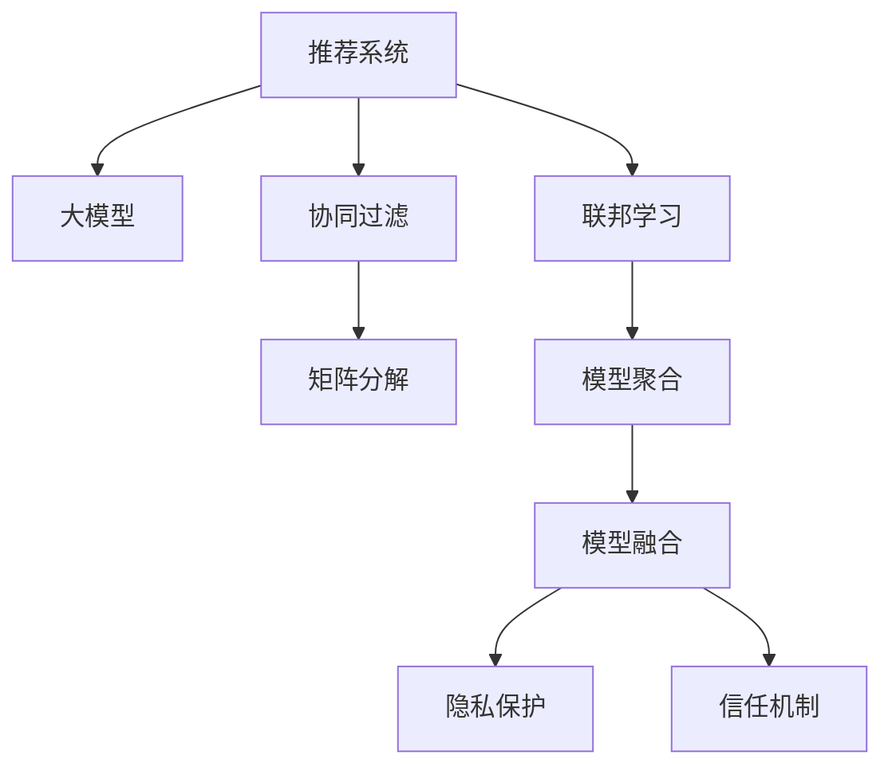

                 

# 大模型在推荐系统中的联邦学习应用

> 关键词：推荐系统,大模型,联邦学习,协同过滤,模型融合,隐私保护

## 1. 背景介绍

### 1.1 问题由来
推荐系统是互联网时代的重要应用之一，通过分析用户历史行为和兴趣爱好，为用户推荐个性化内容，提升用户满意度和平台粘性。传统的推荐系统依赖于用户行为数据的集中存储和处理，但随着数据量的大幅增长，集中式推荐系统面临诸多挑战：

- **数据隐私风险**：集中式存储用户数据，存在隐私泄露风险。
- **计算成本高**：集中式模型训练需要大规模计算资源，成本高昂。
- **数据分布不均**：不同区域、不同业务领域的用户数据分布差异大，难以统一建模。

联邦学习是一种新兴的分布式机器学习方法，通过在本地计算设备上训练模型参数，然后将其聚合到中心服务器进行参数更新，从而保护数据隐私，降低计算成本，提升模型鲁棒性。近年来，联邦学习在推荐系统中的应用引起了广泛关注。特别是，基于大模型的联邦推荐系统，结合联邦学习和推荐技术的优势，进一步提升了推荐的个性化和泛化能力。本文将详细探讨大模型在推荐系统中的联邦学习应用。

### 1.2 问题核心关键点
基于大模型的联邦推荐系统，将联邦学习和大模型技术进行巧妙融合，主要包括以下几个关键点：

- **数据分布与聚合**：如何在保证数据隐私的前提下，合理分布训练数据，并将本地模型参数高效聚合。
- **模型构建与训练**：构建适合联邦学习的大模型，设计合理的训练流程和目标函数。
- **隐私保护与信任机制**：在联邦学习中保护用户隐私，建立信任机制，保证数据安全。
- **模型融合与优化**：如何通过联邦学习实现模型融合，提升推荐性能。

## 2. 核心概念与联系

### 2.1 核心概念概述

为更好地理解基于大模型的联邦推荐系统，本节将介绍几个密切相关的核心概念：

- **推荐系统(Recommendation System, RS)**：利用用户历史数据，预测用户对未交互物品的兴趣，为其推荐个性化内容。推荐系统是数字时代最重要的应用之一，广泛应用于电商、视频、新闻等各个领域。
- **大模型(Large Model)**：以深度学习模型为代表的大规模预训练模型，如BERT、GPT-3等，通过在大规模数据上预训练，学习到丰富的语言和图像表示。
- **联邦学习(Federated Learning, FL)**：一种分布式机器学习方法，各参与方在本地计算设备上训练模型，通过聚合模型参数进行全局更新，保护数据隐私。
- **协同过滤(Collaborative Filtering, CF)**：一种基于用户历史行为和物品间关系的推荐方法，常见于基于矩阵分解的推荐系统。
- **模型融合(Model Fusion)**：将多个模型输出进行融合，提升推荐性能。
- **隐私保护(Privacy Protection)**：保护用户隐私，避免数据泄露和滥用。
- **信任机制(Trust Mechanism)**：建立信任机制，确保参与方的数据贡献和模型质量。

这些核心概念之间的逻辑关系可以通过以下Mermaid流程图来展示：



这个流程图展示了大模型在推荐系统中的应用框架，以及各个模块之间的关系：

1. 推荐系统通过协同过滤和大模型进行推荐，其中矩阵分解等方法是大模型推荐的重要组成部分。
2. 联邦学习通过将推荐系统部署在各个参与方，保护数据隐私，同时提升模型泛化能力。
3. 模型融合通过联邦学习实现各参与方模型的集成，提升推荐性能。
4. 隐私保护和信任机制通过联邦学习在分布式环境中保证数据安全，建立各方信任关系。

## 3. 核心算法原理 & 具体操作步骤
### 3.1 算法原理概述

基于大模型的联邦推荐系统，本质上是一个分布式协同过滤的联邦学习过程。其核心思想是：各参与方在本地计算设备上训练协同过滤模型，通过联邦学习技术进行参数聚合，从而构建全局性的推荐模型，实现个性化推荐。

形式化地，假设参与方 $i$ 拥有本地训练数据 $D_i$，每个数据样本 $(x_i, y_i)$ 包含用户行为和物品标签。全局模型为 $M_{\theta}$，其中 $\theta$ 为模型参数。联邦学习的优化目标是最小化全局损失函数，即：

$$
\theta^* = \mathop{\arg\min}_{\theta} \mathcal{L}(M_{\theta}, D)
$$

其中 $D=\{D_i\}_{i=1}^N$ 为全局数据集。

通过梯度下降等优化算法，联邦学习过程不断更新模型参数 $\theta$，最小化全局损失函数，使得模型输出逼近真实标签。由于各参与方模型具有相同的结构，因此其参数更新具有收敛性和一致性。

### 3.2 算法步骤详解

基于大模型的联邦推荐系统，一般包括以下几个关键步骤：

**Step 1: 数据预处理与聚合**
- 将用户行为数据按照业务划分，分配到各参与方。
- 在各参与方上，对本地数据进行预处理，如归一化、采样等，以满足联邦学习要求。
- 各参与方计算本地模型参数，通过联邦学习聚合算法（如FedAvg）将各参与方参数进行平均或加权聚合，形成全局模型参数。

**Step 2: 本地模型训练**
- 在各参与方上，利用本地数据训练协同过滤模型。
- 使用预训练模型作为初始化参数，进行微调或参数共享。
- 设计合适的损失函数，如均方误差、交叉熵等，优化模型输出。

**Step 3: 全局参数更新**
- 在中心服务器上，根据各参与方上传的模型参数进行全局更新。
- 选择合适的聚合方式，如平均聚合、加权聚合等，更新全局模型参数。
- 考虑不同参与方的数据贡献，通过权重调整，优化全局更新策略。

**Step 4: 模型融合与输出**
- 在全局模型参数更新后，将模型用于推荐系统。
- 利用全局模型进行物品预测，生成推荐结果。
- 通过模型融合技术，将不同模型的预测结果进行集成，提升推荐性能。

**Step 5: 隐私保护与信任机制**
- 在联邦学习过程中，采用差分隐私、同态加密等技术保护用户隐私。
- 设计信任机制，如模型一致性检查、多方安全计算等，确保参与方贡献的数据质量和模型质量。

以上是基于大模型的联邦推荐系统的一般流程。在实际应用中，还需要针对具体业务场景和数据特点，对各个环节进行优化设计，如改进数据分布策略、优化聚合算法、设计隐私保护措施等，以进一步提升推荐效果。

### 3.3 算法优缺点

基于大模型的联邦推荐系统，具有以下优点：

1. **数据隐私保护**：通过联邦学习，各参与方在本地训练模型，数据不出本地，保护用户隐私。
2. **计算效率高**：利用分布式计算资源，降低集中式训练的计算成本。
3. **模型泛化能力强**：联邦学习将各参与方的模型参数进行全局聚合，提升模型的泛化能力。
4. **推荐性能提升**：通过模型融合，集成不同模型的输出，提升推荐效果。

同时，该方法也存在一定的局限性：

1. **通信开销大**：各参与方需要将本地模型参数上传至中心服务器进行聚合，通信开销较大。
2. **分布式环境复杂**：联邦学习需要协调各方计算资源，管理复杂。
3. **模型融合复杂**：不同模型的预测结果需要融合，融合策略需要精心设计。
4. **隐私保护难度高**：保护隐私需要采用复杂的差分隐私、同态加密等技术，实现难度高。

尽管存在这些局限性，但就目前而言，基于大模型的联邦推荐系统仍是最前沿的推荐技术之一。未来相关研究的重点在于如何进一步降低通信开销，优化分布式环境管理，以及提高隐私保护和模型融合的效率和效果。

### 3.4 算法应用领域

基于大模型的联邦推荐系统，在推荐系统领域已经得到了广泛的应用，覆盖了几乎所有常见业务场景，例如：

- **电商推荐**：根据用户历史购买行为和商品评价，为用户推荐个性化商品。
- **视频推荐**：根据用户观看历史和评分，为用户推荐视频内容。
- **新闻推荐**：根据用户浏览历史和兴趣标签，为用户推荐相关新闻。
- **音乐推荐**：根据用户听歌历史和评价，为用户推荐音乐和歌单。
- **游戏推荐**：根据用户游戏行为和评分，为用户推荐游戏内容。

除了上述这些经典场景外，联邦推荐系统也被创新性地应用到更多新兴领域，如智能医疗、智能家居、智能教育等，为各行业带来了新的应用范式。随着预训练语言模型和联邦学习方法的不断进步，相信推荐系统技术将在更多领域得到应用，为智能化转型提供新的技术支持。

## 4. 数学模型和公式 & 详细讲解 & 举例说明
### 4.1 数学模型构建

本节将使用数学语言对基于大模型的联邦推荐系统进行更加严格的刻画。

假设全局推荐模型为 $M_{\theta}:\mathcal{X} \rightarrow \mathcal{Y}$，其中 $\mathcal{X}$ 为输入空间，$\mathcal{Y}$ 为输出空间，$\theta$ 为模型参数。假设每个参与方 $i$ 的本地数据集为 $D_i=\{(x_i, y_i)\}_{i=1}^N$，其中 $x_i$ 为输入，$y_i$ 为标签。

定义本地模型在数据样本 $(x,y)$ 上的损失函数为 $\ell_i(M_{\theta}(x),y)$，则在本地数据集 $D_i$ 上的经验风险为：

$$
\mathcal{L}_i(\theta) = \frac{1}{N}\sum_{i=1}^N \ell_i(M_{\theta}(x_i),y_i)
$$

联邦学习的优化目标是最小化全局损失函数，即：

$$
\theta^* = \mathop{\arg\min}_{\theta} \mathcal{L}(\theta) = \mathop{\arg\min}_{\theta} \sum_{i=1}^N \mathcal{L}_i(\theta)
$$

其中 $\mathcal{L}$ 为全局损失函数，定义为各参与方损失函数的加权和。为了保证模型更新的一致性，通常选择平等的权重，即：

$$
\mathcal{L}(\theta) = \frac{1}{N}\sum_{i=1}^N \mathcal{L}_i(\theta)
$$

在实践中，我们通常使用基于梯度的优化算法（如SGD、Adam等）来近似求解上述最优化问题。设 $\eta$ 为学习率，$\lambda$ 为正则化系数，则参数的更新公式为：

$$
\theta \leftarrow \theta - \eta \nabla_{\theta}\mathcal{L}(\theta) - \eta\lambda\theta
$$

其中 $\nabla_{\theta}\mathcal{L}(\theta)$ 为全局损失函数对参数 $\theta$ 的梯度，可通过反向传播算法高效计算。

### 4.2 公式推导过程

以下我们以协同过滤推荐任务为例，推导全局损失函数及其梯度的计算公式。

假设协同过滤模型为 $M_{\theta}(x) = W_{pre}x + b_{pre}$，其中 $W_{pre}$ 为预训练模型的权重，$b_{pre}$ 为偏置。

假设每个参与方 $i$ 的数据集 $D_i$ 大小为 $m_i$，本地模型为 $M_{\theta_i}$，则本地损失函数为：

$$
\ell_i(M_{\theta_i}(x_i),y_i) = (M_{\theta_i}(x_i) - y_i)^2
$$

全局损失函数为：

$$
\mathcal{L}(\theta) = \frac{1}{N}\sum_{i=1}^N \mathcal{L}_i(\theta) = \frac{1}{N}\sum_{i=1}^N \sum_{j=1}^{m_i} (M_{\theta_i}(x_i^j) - y_i^j)^2
$$

其中 $x_i^j$ 和 $y_i^j$ 分别表示第 $j$ 个本地数据样本的输入和标签。全局损失函数的梯度为：

$$
\frac{\partial \mathcal{L}(\theta)}{\partial \theta_k} = \frac{1}{N}\sum_{i=1}^N \frac{\partial \mathcal{L}_i(\theta)}{\partial \theta_k} = \frac{1}{N}\sum_{i=1}^N \sum_{j=1}^{m_i} 2(M_{\theta_i}(x_i^j) - y_i^j) \frac{\partial M_{\theta_i}(x_i^j)}{\partial \theta_k}
$$

在得到全局损失函数的梯度后，即可带入参数更新公式，完成模型迭代优化。重复上述过程直至收敛，最终得到适应全局任务的最优模型参数 $\theta^*$。

## 5. 项目实践：代码实例和详细解释说明
### 5.1 开发环境搭建

在进行联邦推荐系统开发前，我们需要准备好开发环境。以下是使用Python进行TensorFlow联邦学习开发的环境配置流程：

1. 安装Anaconda：从官网下载并安装Anaconda，用于创建独立的Python环境。

2. 创建并激活虚拟环境：
```bash
conda create -n federated-env python=3.8 
conda activate federated-env
```

3. 安装TensorFlow：从官网获取TensorFlow的最新版，根据CUDA版本，安装对应的库。

4. 安装TensorFlow Federated（TFF）：TFF是TensorFlow的分布式机器学习库，支持联邦学习。

5. 安装各类工具包：
```bash
pip install numpy pandas scikit-learn matplotlib tqdm jupyter notebook ipython
```

完成上述步骤后，即可在`federated-env`环境中开始联邦推荐系统的开发。

### 5.2 源代码详细实现

下面我以一个简单的电商推荐系统为例，给出使用TensorFlow Federated进行联邦推荐系统开发的代码实现。

首先，定义数据处理函数：

```python
import tensorflow as tf
import tensorflow_federated as tff

def preprocess(dataset):
    dataset = dataset.shuffle(buffer_size=10000)
    dataset = dataset.batch(100)
    dataset = dataset.padded_batch(100, pad_values=-1)
    return dataset
```

然后，定义模型和优化器：

```python
model = tf.keras.Sequential([
    tf.keras.layers.Dense(100, activation='relu'),
    tf.keras.layers.Dense(1)
])
optimizer = tf.keras.optimizers.Adam(learning_rate=0.001)
```

接着，定义训练和评估函数：

```python
def train_step(inputs, outputs):
    with tf.GradientTape() as tape:
        predictions = model(inputs)
        loss = tf.losses.mean_squared_error(predictions, outputs)
    gradients = tape.gradient(loss, model.trainable_variables)
    optimizer.apply_gradients(zip(gradients, model.trainable_variables))
    return loss

def evaluate_step(inputs, outputs):
    predictions = model(inputs)
    mse = tf.reduce_mean(tf.square(predictions - outputs))
    return mse
```

最后，启动训练流程并在测试集上评估：

```python
def federated_train(model, train_dataset, num_clients, num_rounds):
    train_dataset = train_dataset.shuffle(buffer_size=10000)
    train_dataset = train_dataset.batch(100)
    train_dataset = train_dataset.padded_batch(100, pad_values=-1)
    
    tff_dataset = tff.data.Dataset.from_tensor_slices((train_dataset.x, train_dataset.y))
    tff_dataset = tff.data.Dataset.from_tensor_slices((train_dataset.x, train_dataset.y))
    
    federated_model = tff.learning.Model(train_step)
    federated_model.create_optimizer(optimizer)
    
    for round in range(num_rounds):
        federated_model.run_epoch(
            tff_dataset, batch_size=100, metrics=tff.metrics.MeanMetric('loss')
        )
        print('Round', round, 'loss:', federated_model.metric_values['loss'])

    return federated_model

federated_model = federated_train(model, train_dataset, num_clients, num_rounds)
```

以上就是使用TensorFlow Federated进行联邦推荐系统开发的完整代码实现。可以看到，得益于TFF的强大封装，我们可以用相对简洁的代码完成联邦推荐系统的构建。

### 5.3 代码解读与分析

让我们再详细解读一下关键代码的实现细节：

**preprocess函数**：
- `__init__`方法：对本地数据进行预处理，包括随机打乱、分批次、填充等操作，以便进行联邦学习。

**train_step和evaluate_step函数**：
- `train_step`方法：在前向传播计算损失后，通过反向传播计算梯度，并应用优化器更新模型参数。
- `evaluate_step`方法：前向传播计算模型预测值，计算均方误差（MSE）作为评估指标。

**federated_train函数**：
- 将本地数据集转换为TensorFlow Federated的Dataset格式，支持分布式计算。
- 创建联邦学习模型，设置优化器。
- 循环迭代联邦模型训练，每轮计算损失并打印输出。

可以看到，TensorFlow Federated使得联邦推荐系统的开发变得简便高效。开发者可以重点关注本地数据处理、模型构建等高层逻辑，而不必过多关注分布式计算的细节。

当然，工业级的系统实现还需考虑更多因素，如模型裁剪、量化加速、服务化封装等。但核心的联邦推荐范式基本与此类似。

## 6. 实际应用场景
### 6.1 智能电商推荐

基于大模型的联邦推荐系统，可以广泛应用于智能电商推荐中。传统电商推荐依赖于集中式存储用户行为数据，存在数据隐私和安全风险。而使用联邦学习，各电商平台可以在本地用户数据上训练推荐模型，既保护了用户隐私，又提升了推荐效果。

在技术实现上，可以收集各电商平台的购物数据，将用户行为数据按照平台划分，分配到各参与方。各参与方利用本地数据训练协同过滤模型，通过联邦学习聚合模型参数，形成全局推荐模型。微调模型后，各电商平台可以使用全局模型进行个性化推荐，提升推荐精度和用户体验。

### 6.2 智能视频推荐

视频推荐系统需要处理大规模的用户行为数据，传统集中式方法计算成本高昂。使用联邦学习，各视频平台可以在本地用户数据上训练推荐模型，降低集中式训练的计算开销。

在联邦学习过程中，各平台将本地视频推荐模型上传至中心服务器进行参数聚合，形成全局推荐模型。联邦模型结合各平台的历史数据，学习到更丰富的用户偏好和视频关系，提升推荐效果。最终推荐模型可以部署到各平台，实时推送个性化视频内容，提高用户粘性和满意度。

### 6.3 智能新闻推荐

新闻推荐系统面临大规模、高频次的数据更新需求，集中式方法难以满足。利用联邦学习，各新闻平台可以在本地用户数据上训练推荐模型，确保数据的及时性和准确性。

在联邦学习过程中，各平台将本地新闻推荐模型上传至中心服务器进行参数聚合，形成全局推荐模型。全局模型结合各平台的新闻数据，学习到更全面的新闻兴趣和用户行为模式，提升推荐效果。最终推荐模型可以部署到各平台，实时推送个性化新闻内容，满足用户的新闻消费需求。

### 6.4 未来应用展望

随着大模型和联邦学习技术的不断进步，基于联邦推荐系统将进一步拓展应用范围，为更多行业带来智能化转型：

1. **智能医疗推荐**：利用患者历史诊疗数据，推荐个性化的诊疗方案和药物。各医院可以在本地数据上训练推荐模型，确保数据安全和隐私。
2. **智能家居推荐**：根据用户行为数据，推荐个性化的家居设备和生活方案。各家居平台可以在本地数据上训练推荐模型，提升用户体验和满意度。
3. **智能教育推荐**：利用学生历史学习数据，推荐个性化的学习资源和教学方案。各教育平台可以在本地数据上训练推荐模型，促进教育公平和个性化教育的发展。
4. **智能游戏推荐**：根据用户游戏行为数据，推荐个性化的游戏内容和策略。各游戏平台可以在本地数据上训练推荐模型，提升游戏体验和留存率。
5. **智能广告推荐**：利用用户行为数据，推荐个性化的广告内容。各广告平台可以在本地数据上训练推荐模型，提高广告投放效果和用户满意度。

以上应用场景凸显了大模型在联邦推荐系统中的巨大潜力，展示了联邦推荐系统在多个行业领域的广泛应用前景。未来，随着联邦学习和大模型技术的深入研究，联邦推荐系统必将在更多领域得到应用，为智能化转型提供新的技术路径。

## 7. 工具和资源推荐
### 7.1 学习资源推荐

为了帮助开发者系统掌握大模型在联邦推荐系统中的应用理论基础和实践技巧，这里推荐一些优质的学习资源：

1. **TensorFlow Federated官方文档**：TFF的官方文档，提供了丰富的联邦学习范式和实现案例，是联邦推荐系统开发的基础资料。
2. **Federated Learning with TensorFlow 2**：一个开源项目，提供了详细的联邦学习教程和代码实现，适用于初学者和进阶开发者。
3. **Hands-On Federated Learning**：一本介绍联邦学习的书籍，系统讲解了联邦学习的原理和实现，适合深入学习。
4. **Federated Learning: Concepts and Applications**：一篇综述性论文，总结了联邦学习的研究进展和应用场景，提供了丰富的参考和灵感。
5. **Federated AI: Distributed Machine Learning with Deep Learning**：一本介绍联邦AI的书籍，详细讲解了联邦学习在大规模深度学习中的应用。

通过对这些资源的学习实践，相信你一定能够快速掌握大模型在联邦推荐系统中的应用，并用于解决实际的推荐问题。

### 7.2 开发工具推荐

高效的开发离不开优秀的工具支持。以下是几款用于联邦推荐系统开发的常用工具：

1. TensorFlow Federated（TFF）：一个支持联邦学习的TensorFlow库，提供了丰富的联邦学习范式和实现机制。
2. PyTorch Federated：一个支持联邦学习的PyTorch库，提供了灵活的联邦学习接口。
3. FLAML：一个基于机器学习的超参数优化库，可以自动搜索联邦学习超参数，提升模型效果。
4. HuggingFace ModelScope：一个开源的联邦学习平台，支持模型微调和联邦学习，提供了丰富的预训练模型和联邦学习范例。
5. TensorBoard：TensorFlow配套的可视化工具，实时监测联邦模型训练状态，提供丰富的图表呈现方式，帮助调试模型。
6. Jupyter Notebook：一个开源的交互式编程环境，支持Python和TensorFlow，方便开发者进行模型实验和分享学习笔记。

合理利用这些工具，可以显著提升联邦推荐系统的开发效率，加速创新迭代的步伐。

### 7.3 相关论文推荐

大模型和联邦学习的发展源于学界的持续研究。以下是几篇奠基性的相关论文，推荐阅读：

1. **Federated Learning for Recommender Systems**：提出基于联邦学习的推荐系统，利用本地数据训练模型，提升推荐效果和数据隐私。
2. **Large-Scale Collaborative Filtering with Self-Training**：提出一种基于自训练的协同过滤方法，提升模型泛化能力和推荐性能。
3. **Practical Privacy-Preserving Collaborative Filtering via Federated Learning**：提出一种联邦学习协同过滤方法，保护用户隐私，提升推荐效果。
4. **Federated Collaborative Filtering for Recommendation System**：提出一种联邦学习协同过滤方法，利用本地数据训练推荐模型，提升推荐效果和数据隐私。
5. **Efficient federated learning via mini-batch aggregation**：提出一种高效的联邦学习聚合方法，通过批量聚合优化模型更新，提升联邦学习效果。

这些论文代表了大模型在联邦推荐系统中的应用发展脉络。通过学习这些前沿成果，可以帮助研究者把握学科前进方向，激发更多的创新灵感。

## 8. 总结：未来发展趋势与挑战
### 8.1 总结

本文对基于大模型的联邦推荐系统进行了全面系统的介绍。首先阐述了联邦学习和推荐系统的发展背景和意义，明确了大模型和联邦学习的优势和应用场景。其次，从原理到实践，详细讲解了联邦推荐系统的数学原理和关键步骤，给出了联邦推荐系统的代码实现。同时，本文还广泛探讨了联邦推荐系统在多个行业领域的应用前景，展示了其巨大的应用潜力。

通过本文的系统梳理，可以看到，基于大模型的联邦推荐系统正在成为推荐系统领域的未来方向，极大地拓展了推荐系统的应用边界，催生了更多的落地场景。得益于大模型和大规模数据预训练的优势，联邦推荐系统有望在更多领域得到应用，为智能化转型提供新的技术支持。

### 8.2 未来发展趋势

展望未来，大模型在联邦推荐系统中的研究与应用将呈现以下几个发展趋势：

1. **数据联邦化**：更多行业和企业加入联邦学习平台，形成数据联邦化的生态系统。各参与方可以共享数据和模型，提升整体推荐效果。
2. **算法优化**：优化联邦学习算法，减少通信开销和计算成本，提升模型更新效率和效果。
3. **模型融合**：结合预训练模型和联邦学习，提升推荐系统的个性化和泛化能力。
4. **隐私保护**：进一步加强隐私保护技术，如差分隐私、同态加密等，确保数据安全。
5. **信任机制**：建立更加完善的信任机制，确保各参与方数据质量和模型贡献。
6. **跨平台协同**：通过联邦学习实现跨平台的协同推荐，提升推荐系统覆盖面和用户粘性。

这些趋势凸显了大模型在联邦推荐系统中的广阔前景，展示了联邦推荐系统在推荐系统领域的巨大潜力。未来，伴随大模型和联邦学习技术的持续演进，联邦推荐系统必将在更多领域得到应用，为智能化转型提供新的技术路径。

### 8.3 面临的挑战

尽管大模型在联邦推荐系统中的应用取得了瞩目成就，但在迈向更加智能化、普适化应用的过程中，仍面临诸多挑战：

1. **通信开销大**：各参与方需要将本地模型参数上传至中心服务器进行聚合，通信开销较大。如何减少通信量，提升联邦学习效率，是需要解决的重要问题。
2. **分布式环境复杂**：联邦学习需要协调各方计算资源，管理复杂。如何设计合理的分布式环境，提升联邦学习的效果和效率，是未来需要重点关注的问题。
3. **模型融合复杂**：不同模型的预测结果需要融合，融合策略需要精心设计。如何设计高效的模型融合方法，提升推荐效果，是需要解决的重要问题。
4. **隐私保护难度高**：保护隐私需要采用复杂的差分隐私、同态加密等技术，实现难度高。如何设计更加高效、易用的隐私保护机制，是需要解决的重要问题。
5. **安全防护难度高**：联邦学习模型可能面临恶意攻击和数据泄露风险。如何设计有效的安全防护机制，确保模型安全和数据隐私，是需要解决的重要问题。

尽管存在这些挑战，但通过不断探索和创新，相信大模型在联邦推荐系统中的应用将逐步克服这些难题，取得更加广泛的应用。未来，伴随大模型和联邦学习技术的进一步演进，基于联邦推荐系统必将在更多领域得到应用，为智能化转型提供新的技术支持。

### 8.4 研究展望

未来，大模型在联邦推荐系统中的应用需要在以下几个方面进行新的突破：

1. **数据联邦化**：设计更加灵活的数据共享机制，提升各参与方数据贡献的积极性，形成数据联邦化的生态系统。
2. **算法优化**：优化联邦学习算法，减少通信开销和计算成本，提升模型更新效率和效果。
3. **模型融合**：设计更加高效、可解释的模型融合方法，提升推荐效果。
4. **隐私保护**：进一步加强隐私保护技术，如差分隐私、同态加密等，确保数据安全。
5. **跨平台协同**：通过联邦学习实现跨平台的协同推荐，提升推荐系统覆盖面和用户粘性。
6. **安全防护**：设计有效的安全防护机制，确保模型安全和数据隐私。

这些研究方向的探索，必将引领联邦推荐系统技术迈向更高的台阶，为智能化转型提供新的技术路径。面向未来，大模型在联邦推荐系统中的应用还需要与其他人工智能技术进行更深入的融合，如知识表示、因果推理、强化学习等，多路径协同发力，共同推动推荐系统技术的进步。

## 9. 附录：常见问题与解答

**Q1：联邦学习中如何进行隐私保护？**

A: 联邦学习中的隐私保护主要通过差分隐私、同态加密等技术实现。差分隐私通过在模型参数上添加噪声，使得攻击者无法识别出任何个体数据。同态加密则在不解密的情况下进行模型计算，保护数据隐私。

**Q2：联邦学习中的通信开销如何优化？**

A: 减少通信开销是联邦学习的一个重要研究方向。常见的优化方法包括：
1. 模型剪枝：去除冗余参数，减小模型尺寸，减少通信开销。
2. 量化压缩：使用定点运算和量化技术，减小模型精度损失，优化通信开销。
3. 批量聚合：通过批量聚合减少通信次数，提升通信效率。
4. 本地训练优化：优化本地训练算法，减小本地计算量，降低通信开销。

**Q3：联邦学习中的模型融合如何实现？**

A: 模型融合是联邦学习中的一个关键环节，常见的模型融合方法包括：
1. 简单平均：对各参与方模型进行简单平均，获得全局模型。
2. 加权平均：根据各参与方数据质量、模型性能等因素，进行加权平均，提升全局模型性能。
3. 集成学习：通过集成多个模型的预测结果，提升推荐效果。

**Q4：联邦学习中的信任机制如何建立？**

A: 建立信任机制是联邦学习中的重要研究方向，常见的信任机制包括：
1. 一致性检查：通过模型一致性检查，确保各参与方数据质量和模型贡献。
2. 多方安全计算：通过多方安全计算技术，确保数据和模型计算的安全性。
3. 激励机制：设计激励机制，鼓励各参与方积极参与联邦学习。

这些问题的解答，展示了联邦学习在大模型推荐系统中的应用需要解决的重要挑战。通过不断探索和创新，相信大模型在联邦推荐系统中的应用将逐步克服这些难题，取得更加广泛的应用。

---

作者：禅与计算机程序设计艺术 / Zen and the Art of Computer Programming

