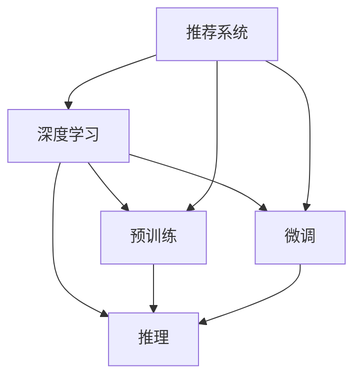

                 

# 大模型在推荐系统各个环节的应用综述

## 1. 背景介绍

### 1.1 问题由来
推荐系统在现代社会中扮演着重要的角色，无论是电商平台、视频平台还是社交网络，推荐算法已经成为提高用户留存和满意度、优化用户体验的关键手段。传统的推荐方法基于协同过滤、基于内容的推荐等，已经逐渐显示出其局限性。随着深度学习技术的进步，大模型在推荐系统中的应用日益广泛，展示了其强大而灵活的潜力。

### 1.2 问题核心关键点
大模型在推荐系统中的应用，本质上是一种基于深度学习的迁移学习范式。其主要流程包括预训练、微调和推理等环节，每个环节都有其独特的技术点和方法论。通过理解这些关键点，可以更好地掌握大模型在推荐系统中的实际应用。

### 1.3 问题研究意义
大模型在推荐系统中的应用，能够显著提升推荐效果，尤其是对于数据量不足的冷启动问题和个性化需求更高的场景。通过对大模型的利用，推荐系统可以更全面地理解用户偏好和物品属性，从而提供更加精准和个性化的推荐。此外，大模型的普及也为推荐系统带来了新的研究方向和应用领域，推动了NLP、视觉、语音等多模态推荐技术的发展。

## 2. 核心概念与联系

### 2.1 核心概念概述

为了更好地理解大模型在推荐系统中的应用，本节将介绍几个关键概念及其相互关系：

- **推荐系统（Recommender System）**：使用计算机算法为用户推荐产品和内容，提升用户体验和满意度。推荐系统可以基于用户历史行为、物品属性、社交关系等多种数据源，使用不同的推荐算法进行推荐。

- **深度学习（Deep Learning）**：一种利用多层神经网络进行复杂模式识别和预测的技术，广泛应用于图像识别、自然语言处理等领域。深度学习在推荐系统中的应用，尤其是大模型的利用，极大地提升了推荐系统的精准度和个性化水平。

- **预训练（Pre-training）**：指在大规模无标签数据上，通过自监督学习任务训练模型的过程。预训练使得模型学习到通用知识，如语义表示、图像特征等，在推荐任务中应用时能够带来更好的性能。

- **微调（Fine-tuning）**：在预训练模型基础上，使用推荐系统任务的有标签数据对其进行优化，使得模型能够更好地适应特定推荐任务。微调是深度学习中常见的迁移学习方法之一。

- **推理（Inference）**：在模型训练结束后，利用训练好的模型对新数据进行预测和推荐。推理是推荐系统实际应用的关键环节，需要高效的算法和硬件支持。

这些概念之间的联系可以通过以下Mermaid流程图来展示：



这个流程图展示了推荐系统中的核心概念及其相互关系：

1. 推荐系统通过深度学习技术进行推荐。
2. 深度学习模型的训练分为预训练和微调两个环节。
3. 推理是推荐系统的核心应用环节。

## 3. 核心算法原理 & 具体操作步骤

### 3.1 算法原理概述

基于大模型的推荐系统，主要分为预训练、微调和推理三个环节。其核心思想是通过深度学习模型学习用户和物品的复杂关系，并在推荐任务上进行调整和优化，最终提供个性化的推荐结果。

形式化地，假设推荐系统包含用户集 $U$ 和物品集 $V$，用户 $u$ 对物品 $v$ 的偏好表示为 $r_{uv}$。推荐系统的工作目标是最小化用户和物品之间的误差，即：

$$
\min_{\theta} \sum_{(u,v) \in D} \ell(r_{uv}, \hat{r}_{uv})
$$

其中 $D$ 为推荐数据集，$\ell$ 为损失函数，$\hat{r}_{uv}$ 为模型预测的用户对物品的评分。

### 3.2 算法步骤详解

基于大模型的推荐系统，一般包括以下几个关键步骤：

**Step 1: 准备预训练模型和数据集**
- 选择合适的预训练模型，如BERT、GPT等，作为初始化参数。
- 准备推荐系统任务的数据集，包括用户历史行为数据、物品属性数据等。

**Step 2: 添加任务适配层**
- 根据推荐任务类型，在预训练模型顶层设计合适的输出层和损失函数。
- 对于推荐任务，通常使用回归或分类损失函数，预测用户对物品的评分。

**Step 3: 设置微调超参数**
- 选择合适的优化算法及其参数，如 Adam、SGD 等，设置学习率、批大小、迭代轮数等。
- 设置正则化技术及强度，包括权重衰减、Dropout、Early Stopping 等。
- 确定冻结预训练参数的策略，如仅微调顶层，或全部参数都参与微调。

**Step 4: 执行梯度训练**
- 将训练集数据分批次输入模型，前向传播计算损失函数。
- 反向传播计算参数梯度，根据设定的优化算法和学习率更新模型参数。
- 周期性在验证集上评估模型性能，根据性能指标决定是否触发 Early Stopping。
- 重复上述步骤直到满足预设的迭代轮数或 Early Stopping 条件。

**Step 5: 推理和应用**
- 在测试集上评估微调后模型 $M_{\hat{\theta}}$ 的性能，对比微调前后的精度提升。
- 使用微调后的模型对新样本进行推理预测，集成到实际的应用系统中。

以上是基于深度学习大模型的推荐系统的一般流程。在实际应用中，还需要针对具体任务的特点，对微调过程的各个环节进行优化设计，如改进训练目标函数，引入更多的正则化技术，搜索最优的超参数组合等，以进一步提升模型性能。

### 3.3 算法优缺点

基于大模型的推荐系统，具有以下优点：
1. 数据要求低。相比传统推荐算法，大模型对用户和物品数据的规模要求较低，能够处理长尾用户和物品。
2. 通用性强。大模型可以应用于多种推荐场景，如电商推荐、内容推荐、个性化推荐等。
3. 效果显著。在大规模数据上预训练后，微调过程能够快速提升模型对推荐任务的适应能力，提升推荐效果。
4. 适应性强。大模型能够灵活调整适应不同的推荐场景，如少样本学习、零样本学习等。

同时，该方法也存在一定的局限性：
1. 计算成本高。大模型的参数量巨大，需要高效的硬件设备和算法支持。
2. 过拟合风险。由于模型复杂度高，可能出现过拟合问题，尤其是在数据量不足的情况下。
3. 模型解释性差。大模型的复杂结构导致其输出难以解释，难以调试和优化。

尽管存在这些局限性，但就目前而言，基于大模型的推荐系统仍是在线推荐领域的主流范式。未来相关研究的重点在于如何进一步降低计算成本，提高模型泛化能力和可解释性，同时兼顾低维微调和参数高效微调等前沿技术。

### 3.4 算法应用领域

基于大模型的推荐系统已经在电商、内容、社交等多个领域得到广泛应用，具体包括：

- **电商推荐**：根据用户的历史浏览、购买记录，推荐个性化的商品和促销活动。
- **内容推荐**：如视频平台、新闻网站，根据用户的历史观看和阅读记录，推荐感兴趣的内容。
- **个性化推荐**：根据用户行为和属性，推荐匹配度高的产品和内容。
- **智能客服**：通过分析用户的问题，推荐最合适的回答和解决方案。
- **健康医疗**：根据用户的健康数据和查询，推荐匹配的医疗服务和健康建议。

除了上述这些经典应用外，大模型推荐系统还被创新性地应用到更多场景中，如音乐推荐、游戏推荐、广告推荐等，为推荐系统带来了全新的突破。随着深度学习技术和大模型的不断发展，推荐系统的应用范围和效果将不断拓展。

## 4. 数学模型和公式 & 详细讲解 & 举例说明

### 4.1 数学模型构建

本节将使用数学语言对基于大模型的推荐系统进行更加严格的刻画。

假设推荐系统模型为 $M_{\theta}:\mathcal{X} \times \mathcal{Y} \rightarrow \mathcal{R}$，其中 $\mathcal{X}$ 为用户特征空间，$\mathcal{Y}$ 为物品特征空间，$\mathcal{R}$ 为评分空间，$\theta \in \mathbb{R}^d$ 为模型参数。假设推荐任务数据集为 $D=\{(x_i,y_i)\}_{i=1}^N, x_i \in \mathcal{X}, y_i \in \mathcal{Y}$。

定义模型 $M_{\theta}$ 在数据样本 $(x,y)$ 上的损失函数为 $\ell(M_{\theta}(x,y),r_{uv})$，则在数据集 $D$ 上的经验风险为：

$$
\mathcal{L}(\theta) = \frac{1}{N}\sum_{i=1}^N \ell(M_{\theta}(x_i,y_i),r_{uv})
$$

微调的优化目标是最小化经验风险，即找到最优参数：

$$
\theta^* = \mathop{\arg\min}_{\theta} \mathcal{L}(\theta)
$$

在实践中，我们通常使用基于梯度的优化算法（如Adam、SGD等）来近似求解上述最优化问题。设 $\eta$ 为学习率，$\lambda$ 为正则化系数，则参数的更新公式为：

$$
\theta \leftarrow \theta - \eta \nabla_{\theta}\mathcal{L}(\theta) - \eta\lambda\theta
$$

其中 $\nabla_{\theta}\mathcal{L}(\theta)$ 为损失函数对参数 $\theta$ 的梯度，可通过反向传播算法高效计算。

### 4.2 公式推导过程

以下我们以协同过滤推荐为例，推导均方误差损失函数及其梯度的计算公式。

假设模型 $M_{\theta}$ 在用户特征 $x$ 和物品特征 $y$ 上的输出为 $\hat{r}_{uv}$，真实评分 $r_{uv}$ 在数据集 $D$ 上的经验风险为：

$$
\mathcal{L}(\theta) = \frac{1}{N}\sum_{i=1}^N (\hat{r}_{uv} - r_{uv})^2
$$

根据链式法则，损失函数对参数 $\theta_k$ 的梯度为：

$$
\frac{\partial \mathcal{L}(\theta)}{\partial \theta_k} = -2\frac{1}{N}\sum_{i=1}^N (\hat{r}_{uv} - r_{uv}) \frac{\partial M_{\theta}(x_i,y_i)}{\partial \theta_k}
$$

其中 $\frac{\partial M_{\theta}(x_i,y_i)}{\partial \theta_k}$ 可进一步递归展开，利用自动微分技术完成计算。

在得到损失函数的梯度后，即可带入参数更新公式，完成模型的迭代优化。重复上述过程直至收敛，最终得到适应推荐任务的最优模型参数 $\theta^*$。

### 4.3 案例分析与讲解

下面以基于用户-物品协同矩阵的推荐系统为例，进行详细的案例分析。

假设推荐系统数据集 $D$ 包含用户 $u$ 对物品 $v$ 的评分 $r_{uv}$。为了提升推荐效果，可以引入大模型作为初始化参数，在推荐任务上进行微调。假设使用BERT模型作为初始化参数，将用户 $u$ 和物品 $v$ 的特征分别输入BERT模型，得到用户和物品的表示。然后使用这些表示计算用户对物品的评分，并与真实评分进行比较，计算损失函数并更新模型参数。

具体实现步骤如下：

1. **特征提取**：将用户 $u$ 和物品 $v$ 的特征分别输入BERT模型，得到表示 $x_u$ 和 $y_v$。

2. **评分计算**：将 $x_u$ 和 $y_v$ 拼接后输入线性层，得到用户对物品的评分 $\hat{r}_{uv}$。

3. **损失计算**：将 $\hat{r}_{uv}$ 与真实评分 $r_{uv}$ 计算均方误差损失 $\ell(\hat{r}_{uv},r_{uv})$。

4. **参数更新**：使用梯度下降算法，更新BERT模型参数。

5. **模型评估**：在测试集上评估模型性能，如均方误差、精度等指标。

### 5. 项目实践：代码实例和详细解释说明

### 5.1 开发环境搭建

在进行推荐系统微调实践前，我们需要准备好开发环境。以下是使用Python进行PyTorch开发的环境配置流程：

1. 安装Anaconda：从官网下载并安装Anaconda，用于创建独立的Python环境。

2. 创建并激活虚拟环境：
```bash
conda create -n pytorch-env python=3.8 
conda activate pytorch-env
```

3. 安装PyTorch：根据CUDA版本，从官网获取对应的安装命令。例如：
```bash
conda install pytorch torchvision torchaudio cudatoolkit=11.1 -c pytorch -c conda-forge
```

4. 安装Transformers库：
```bash
pip install transformers
```

5. 安装各类工具包：
```bash
pip install numpy pandas scikit-learn matplotlib tqdm jupyter notebook ipython
```

完成上述步骤后，即可在`pytorch-env`环境中开始推荐系统微调实践。

### 5.2 源代码详细实现

下面我们以协同过滤推荐系统为例，给出使用Transformers库对BERT模型进行微调的PyTorch代码实现。

首先，定义推荐系统数据处理函数：

```python
from transformers import BertTokenizer
from torch.utils.data import Dataset
import torch

class RecommendationDataset(Dataset):
    def __init__(self, features, ratings):
        self.features = features
        self.ratings = ratings
        self.tokenizer = BertTokenizer.from_pretrained('bert-base-cased')

    def __len__(self):
        return len(self.features)

    def __getitem__(self, item):
        feature = self.features[item]
        rating = self.ratings[item]
        
        encoding = self.tokenizer(feature, return_tensors='pt', max_length=512, padding='max_length', truncation=True)
        input_ids = encoding['input_ids'][0]
        attention_mask = encoding['attention_mask'][0]
        
        # 将评分作为标签
        label = torch.tensor([rating], dtype=torch.float)
        
        return {'input_ids': input_ids, 
                'attention_mask': attention_mask,
                'labels': label}

# 创建dataset
tokenizer = BertTokenizer.from_pretrained('bert-base-cased')

train_dataset = RecommendationDataset(train_features, train_ratings)
dev_dataset = RecommendationDataset(dev_features, dev_ratings)
test_dataset = RecommendationDataset(test_features, test_ratings)
```

然后，定义模型和优化器：

```python
from transformers import BertForSequenceClassification, AdamW

model = BertForSequenceClassification.from_pretrained('bert-base-cased', num_labels=1)

optimizer = AdamW(model.parameters(), lr=2e-5)
```

接着，定义训练和评估函数：

```python
from torch.utils.data import DataLoader
from tqdm import tqdm
from sklearn.metrics import mean_squared_error

device = torch.device('cuda') if torch.cuda.is_available() else torch.device('cpu')
model.to(device)

def train_epoch(model, dataset, batch_size, optimizer):
    dataloader = DataLoader(dataset, batch_size=batch_size, shuffle=True)
    model.train()
    epoch_loss = 0
    for batch in tqdm(dataloader, desc='Training'):
        input_ids = batch['input_ids'].to(device)
        attention_mask = batch['attention_mask'].to(device)
        labels = batch['labels'].to(device)
        model.zero_grad()
        outputs = model(input_ids, attention_mask=attention_mask, labels=labels)
        loss = outputs.loss
        epoch_loss += loss.item()
        loss.backward()
        optimizer.step()
    return epoch_loss / len(dataloader)

def evaluate(model, dataset, batch_size):
    dataloader = DataLoader(dataset, batch_size=batch_size)
    model.eval()
    mse = 0
    for batch in tqdm(dataloader, desc='Evaluating'):
        input_ids = batch['input_ids'].to(device)
        attention_mask = batch['attention_mask'].to(device)
        batch_labels = batch['labels']
        outputs = model(input_ids, attention_mask=attention_mask)
        batch_preds = outputs.logits.item()
        batch_labels = batch_labels.item()
        mse += (batch_preds - batch_labels) ** 2
        
    return mean_squared_error(batch_labels, batch_preds)

```

最后，启动训练流程并在测试集上评估：

```python
epochs = 5
batch_size = 16

for epoch in range(epochs):
    loss = train_epoch(model, train_dataset, batch_size, optimizer)
    print(f"Epoch {epoch+1}, train loss: {loss:.3f}")
    
    print(f"Epoch {epoch+1}, dev MSE:")
    mse = evaluate(model, dev_dataset, batch_size)
    print(mse)

print("Test MSE:")
mse = evaluate(model, test_dataset, batch_size)
print(mse)
```

以上就是使用PyTorch对BERT进行协同过滤推荐系统微调的完整代码实现。可以看到，得益于Transformers库的强大封装，我们可以用相对简洁的代码完成BERT模型的加载和微调。

### 5.3 代码解读与分析

让我们再详细解读一下关键代码的实现细节：

**RecommendationDataset类**：
- `__init__`方法：初始化用户特征、评分等关键组件。
- `__len__`方法：返回数据集的样本数量。
- `__getitem__`方法：对单个样本进行处理，将用户特征输入编码为token ids，将评分作为标签，并对其进行定长padding，最终返回模型所需的输入。

**均方误差计算**：
- 使用PyTorch的均方误差函数计算模型输出与真实评分之间的差异。
- 在每个batch结束后累加mse值，计算平均mse。

**训练流程**：
- 定义总的epoch数和batch size，开始循环迭代
- 每个epoch内，先在训练集上训练，输出平均loss
- 在验证集上评估，输出MSE
- 所有epoch结束后，在测试集上评估，给出最终测试结果

可以看到，PyTorch配合Transformers库使得BERT微调的代码实现变得简洁高效。开发者可以将更多精力放在数据处理、模型改进等高层逻辑上，而不必过多关注底层的实现细节。

当然，工业级的系统实现还需考虑更多因素，如模型的保存和部署、超参数的自动搜索、更灵活的任务适配层等。但核心的微调范式基本与此类似。

## 6. 实际应用场景

### 6.1 智能推荐系统

基于大模型的推荐系统，已经在电商、内容、音乐等多个领域得到广泛应用，为推荐系统带来了新的突破。以下以电商推荐系统为例，展示其应用效果：

**电商推荐**：电商平台希望根据用户的浏览和购买历史，推荐最合适的商品。利用大模型对用户和物品进行特征表示，使用协同过滤、深度学习等技术，能够实现更加精准和个性化的推荐。例如，通过分析用户的历史浏览和购买记录，对商品进行推荐，提升用户的购物体验和满意度。

**效果提升**：在实际应用中，大模型的加入显著提升了推荐效果。例如，Amazon、淘宝等电商平台已经广泛采用基于大模型的推荐系统，显著提高了用户留存率和销售额。

### 6.2 内容推荐系统

内容推荐系统是推荐系统的重要应用之一，广泛应用于视频平台、新闻网站、音乐平台等。以下以视频平台推荐系统为例，展示其应用效果：

**视频推荐**：视频平台希望根据用户的观看历史，推荐用户可能感兴趣的视频。利用大模型对用户和视频进行特征表示，使用协同过滤、深度学习等技术，能够实现更加精准和个性化的推荐。例如，通过分析用户的观看历史，对视频进行推荐，提升用户的观看体验和满意度。

**效果提升**：在实际应用中，大模型的加入显著提升了推荐效果。例如，Netflix、YouTube等视频平台已经广泛采用基于大模型的推荐系统，显著提高了用户的观看时间和平台活跃度。

### 6.3 音乐推荐系统

音乐推荐系统是推荐系统的重要应用之一，广泛应用于音乐平台、社交网络等。以下以音乐平台推荐系统为例，展示其应用效果：

**音乐推荐**：音乐平台希望根据用户的听歌历史，推荐用户可能感兴趣的音乐。利用大模型对用户和歌曲进行特征表示，使用协同过滤、深度学习等技术，能够实现更加精准和个性化的推荐。例如，通过分析用户的听歌历史，对歌曲进行推荐，提升用户的听歌体验和满意度。

**效果提升**：在实际应用中，大模型的加入显著提升了推荐效果。例如，Spotify等音乐平台已经广泛采用基于大模型的推荐系统，显著提高了用户的听歌时长和平台活跃度。

## 7. 工具和资源推荐

### 7.1 学习资源推荐

为了帮助开发者系统掌握大模型在推荐系统中的应用，这里推荐一些优质的学习资源：

1. 《推荐系统实战》系列博文：由深度学习领域专家撰写，深入浅出地介绍了推荐系统的主要算法和技术，涵盖协同过滤、深度学习等多个方向。

2. 《深度学习》课程：斯坦福大学开设的深度学习经典课程，详细讲解深度学习的基本原理和应用，适合初学者和进阶者。

3. 《深度学习与推荐系统》书籍：国内知名专家撰写的推荐系统入门读物，全面介绍了推荐系统的经典算法和最新研究。

4. 《推荐系统实战》书籍：由推荐系统领域专家撰写，详细介绍了推荐系统的开发实践和案例分析，涵盖电商、内容等多个领域。

5. Kaggle平台：全球最大的数据科学竞赛平台，提供大量推荐系统竞赛数据集和优秀作品，可以用于学习和实践推荐系统。

通过对这些资源的学习实践，相信你一定能够快速掌握大模型在推荐系统中的应用精髓，并用于解决实际的推荐问题。

### 7.2 开发工具推荐

高效的开发离不开优秀的工具支持。以下是几款用于推荐系统开发的工具：

1. PyTorch：基于Python的开源深度学习框架，灵活动态的计算图，适合快速迭代研究。适合各种推荐系统的开发。

2. TensorFlow：由Google主导开发的开源深度学习框架，生产部署方便，适合大规模工程应用。适合各种推荐系统的开发。

3. Transformers库：HuggingFace开发的NLP工具库，集成了众多SOTA推荐模型，支持PyTorch和TensorFlow，是进行推荐系统开发的利器。

4. Weights & Biases：模型训练的实验跟踪工具，可以记录和可视化模型训练过程中的各项指标，方便对比和调优。与主流深度学习框架无缝集成。

5. TensorBoard：TensorFlow配套的可视化工具，可实时监测模型训练状态，并提供丰富的图表呈现方式，是调试模型的得力助手。

6. Jupyter Notebook：免费的Jupyter Notebook环境，可以方便地编写、运行和分享推荐系统代码，适合科研和教学。

合理利用这些工具，可以显著提升推荐系统开发效率，加快创新迭代的步伐。

### 7.3 相关论文推荐

大模型在推荐系统中的应用源于学界的持续研究。以下是几篇奠基性的相关论文，推荐阅读：

1. Matrix Factorization Techniques for Recommender Systems：介绍了矩阵分解等协同过滤推荐算法的基本原理和应用。

2. Deep Matrix Factorization：将深度学习技术引入矩阵分解，提高了推荐系统的准确性和泛化能力。

3. Attention Is All You Need（即Transformer原论文）：提出了Transformer结构，开启了NLP领域的预训练大模型时代，也推动了推荐系统的发展。

4. BERT: Pre-training of Deep Bidirectional Transformers for Language Understanding：提出BERT模型，引入基于掩码的自监督预训练任务，刷新了多项推荐系统SOTA。

5. Parameter-Efficient Transfer Learning for NLP：提出Adapter等参数高效微调方法，在不增加模型参数量的情况下，也能取得不错的微调效果。

6. Scaling Up Matrix Factorization for Recommender Systems：介绍了在大规模数据上优化矩阵分解算法的技术和方法，提高了推荐系统的计算效率和准确性。

这些论文代表了大模型在推荐系统中的应用方向和最新进展，通过学习这些前沿成果，可以帮助研究者把握学科前进方向，激发更多的创新灵感。

## 8. 总结：未来发展趋势与挑战

### 8.1 总结

本文对基于大模型的推荐系统进行了全面系统的介绍。首先阐述了大模型在推荐系统中的主要应用场景和研究背景，明确了推荐系统在大模型驱动下的发展方向。其次，从原理到实践，详细讲解了推荐系统的核心算法和关键步骤，给出了推荐系统微调任务的完整代码实例。同时，本文还广泛探讨了推荐系统在电商、内容、社交等多个领域的应用前景，展示了大模型在推荐系统中的强大潜力。

通过本文的系统梳理，可以看到，基于大模型的推荐系统正在成为推荐系统领域的重要范式，极大地提升了推荐系统的精度和个性化水平。得益于大模型的强大通用性和灵活性，推荐系统在多个领域实现了显著的突破，为电商、内容、社交等行业的数字化转型提供了有力的技术支持。未来，伴随深度学习技术和大模型的不断发展，推荐系统将在更多领域得到应用，为用户的个性化体验提供更多的可能。

### 8.2 未来发展趋势

展望未来，大模型在推荐系统中的应用将呈现以下几个发展趋势：

1. 推荐系统更加普及。随着深度学习和大模型的普及，越来越多的行业将采用推荐系统，提升用户体验和满意度。

2. 推荐算法更加多样化。除了传统的协同过滤和深度学习算法，将涌现更多创新型的推荐算法，如多模态推荐、联邦推荐等。

3. 推荐模型更加通用。大模型具备较强的迁移学习能力和通用性，能够应用于多种推荐场景，推动推荐系统的标准化和规范化。

4. 推荐系统更加智能化。大模型将与知识图谱、因果推理等技术结合，提升推荐系统的智能水平和解释能力。

5. 推荐系统更加个性化。通过引入多模态信息和大模型，推荐系统能够更全面地理解用户需求和物品属性，实现更加精准和个性化的推荐。

6. 推荐系统更加高效。通过优化计算图和模型结构，推荐系统将实现更高的计算效率和更快的响应速度。

以上趋势凸显了大模型在推荐系统中的广阔前景。这些方向的探索发展，必将进一步提升推荐系统的性能和应用范围，为NLP技术带来更多的应用场景。

### 8.3 面临的挑战

尽管大模型在推荐系统中的应用取得了显著进展，但在迈向更加智能化、普适化应用的过程中，仍面临诸多挑战：

1. 数据质量瓶颈。推荐系统对数据质量的要求较高，尤其是在用户行为数据较少的情况下，模型的训练效果受到较大影响。如何高效地收集和处理推荐系统所需的数据，是当前的重要问题。

2. 计算资源限制。大模型的参数量巨大，对硬件资源的需求较高。如何在有限的计算资源下，实现高效的推荐系统，是未来的挑战之一。

3. 模型泛化能力不足。推荐系统面临的推荐任务种类繁多，不同任务之间的数据分布差异较大，如何提高模型的泛化能力，是未来需要重点突破的方向。

4. 模型可解释性差。大模型的复杂结构导致其输出难以解释，难以调试和优化。如何提高模型的可解释性，增强系统的透明性和可信度，将是未来的研究重点。

5. 隐私和安全问题。推荐系统需要处理大量的用户数据，如何保护用户隐私和数据安全，防止数据泄露和滥用，是亟待解决的问题。

6. 社会影响考量。推荐系统在提升用户体验的同时，也带来了潜在的社会影响问题，如过度个性化导致的用户依赖、过度推荐带来的信息过载等。如何平衡个性化推荐和社会影响之间的关系，是未来需要关注的课题。

以上挑战凸显了大模型在推荐系统中的复杂性和多样性。解决这些挑战需要跨学科的合作，包括计算机科学、数据科学、社会学等多个领域的共同努力。

### 8.4 研究展望

面对推荐系统所面临的种种挑战，未来的研究需要在以下几个方面寻求新的突破：

1. 探索更多数据采集和处理技术。利用数据增强、数据合成等技术，提高推荐系统所需的数据质量，降低数据采集成本。

2. 开发更高效的计算框架和算法。通过分布式计算、模型压缩等技术，提高推荐系统的计算效率和资源利用率。

3. 引入更多创新型推荐算法。结合多模态数据、因果推理、联邦学习等技术，提升推荐系统的泛化能力和智能化水平。

4. 提高推荐系统的可解释性。通过可解释的推荐模型和可视化工具，提高系统的透明性和可信度，增强用户对系统的理解和信任。

5. 解决推荐系统中的隐私和安全问题。采用差分隐私、联邦学习等技术，保护用户隐私和数据安全，防止数据泄露和滥用。

6. 研究推荐系统对社会的广泛影响。通过社会实验和用户反馈，评估推荐系统对社会行为、心理的影响，制定相应的政策和规范，引导推荐系统健康发展。

这些研究方向将引领推荐系统技术的进一步演进，推动推荐系统在更多领域的应用，为社会的数字化转型提供新的技术路径。总之，大模型在推荐系统中的应用还需不断优化和创新，才能真正实现其技术价值和社会价值。

## 9. 附录：常见问题与解答

**Q1：大模型在推荐系统中的参数高效微调方法有哪些？**

A: 大模型在推荐系统中的参数高效微调方法主要包括以下几种：

1. Adapter：通过添加可微调的Adapter层，只微调小部分参数，提高微调效率。

2. LoRA：通过低秩矩阵分解，将大模型的部分层映射为可微调的参数矩阵，减少微调参数量。

3. Pruning：通过剪枝技术，去除冗余参数，提高计算效率和模型精度。

4. Incremental Training：通过增量学习技术，在已有模型基础上进行微调，减少训练时间和资源消耗。

5. Transfer Learning：通过迁移学习技术，利用已有模型的知识，加速新模型的微调过程。

以上方法均能够在不增加大量计算资源的情况下，提高推荐系统的微调效果和运行效率。

**Q2：推荐系统中的数据处理和特征表示有哪些方法？**

A: 推荐系统中的数据处理和特征表示方法主要包括以下几种：

1. 数据清洗：对数据进行去重、去噪、缺失值处理等操作，提高数据质量。

2. 数据增强：通过回译、近义替换等方式扩充训练集，提高模型的泛化能力。

3. 特征提取：利用深度学习模型，对用户和物品进行特征表示，提取高维度的语义信息。

4. 特征拼接：将不同来源的特征进行拼接，提高推荐模型的综合性能。

5. 特征选择：通过特征选择算法，去除冗余和无关的特征，提高模型的准确性。

6. 特征融合：将多种特征融合在一起，构建更加全面的特征表示。

以上方法均能够在推荐系统中提高模型的性能和泛化能力，为推荐系统提供高质量的特征表示。

**Q3：推荐系统中如何平衡个性化推荐和社会影响之间的关系？**

A: 推荐系统中平衡个性化推荐和社会影响之间的关系是一个复杂的问题，主要通过以下几个方面进行解决：

1. 引入多样性约束：在推荐系统中引入多样性约束，保证用户能够接触到不同类别的物品，避免过度个性化带来的负面影响。

2. 设计公平性算法：利用公平性算法，保证不同用户和物品之间的推荐结果公平合理。

3. 引入人工干预：通过人工干预，对推荐结果进行审核和调整，避免有害信息的传播。

4. 利用用户反馈：利用用户反馈数据，不断优化推荐系统，减少有害信息的推荐。

5. 设计推荐系统评估指标：设计合适的推荐系统评估指标，如社会影响评估指标，用于评估推荐系统对社会的影响。

以上方法均能够在推荐系统中平衡个性化推荐和社会影响之间的关系，提高推荐系统的公平性和社会责任。

通过本文的系统梳理，可以看到，大模型在推荐系统中的应用已经取得了显著的进展，并将在更多领域得到应用。未来，伴随深度学习技术和大模型的不断发展，推荐系统将在更多领域得到应用，为社会的数字化转型提供新的技术路径。只有勇于创新、敢于突破，才能不断拓展大模型在推荐系统中的应用边界，让推荐系统更好地服务于社会。

