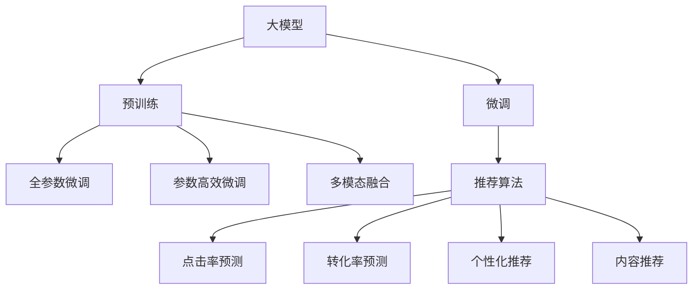

                 

# 大模型在推荐系统多模态融合中的作用

## 1. 背景介绍

在过去的十年中，推荐系统成为了互联网行业中的核心技术，从电商到内容平台，从社交媒体到视频平台，都依赖推荐算法来提升用户满意度。但随着推荐系统的规模和复杂度不断提升，如何构建更智能、更高效的推荐系统，成为了一个重要议题。近年来，大模型在推荐系统中的应用日益凸显，尤其是在多模态融合方面，大模型展现出了显著的优势。本文将系统探讨大模型在推荐系统多模态融合中的应用原理、算法步骤、优缺点以及未来趋势。

## 2. 核心概念与联系

### 2.1 核心概念概述

为了理解大模型在推荐系统中多模态融合的作用，首先需要理解以下几个核心概念：

- **大模型**：以深度神经网络为基础的大型模型，如GPT-3、BERT等，通常具有数十亿甚至数百亿的参数，能够处理大规模的自然语言数据。
- **推荐系统**：基于用户历史行为、兴趣和个性化推荐算法，为用户推荐感兴趣的内容的系统，广泛应用于电商、内容推荐等领域。
- **多模态融合**：将多种模态数据（如文本、图像、音频、视频等）进行整合，以提升推荐系统的性能和泛化能力。
- **预训练与微调**：通过在大规模数据上进行预训练，在大模型上微调特定任务，提升模型对目标任务的适应能力。

这些概念之间的逻辑关系可以通过以下Mermaid流程图来展示：



这个流程图展示了大模型在推荐系统中的核心作用和流程：

1. 大模型通过预训练获得基础能力。
2. 微调模型以适应特定推荐任务。
3. 多模态融合将不同模态数据整合并应用到推荐算法中。

### 2.2 核心概念原理和架构

#### 大模型预训练

大模型预训练是指在大规模无标注数据上进行自监督学习，学习到通用的语言表示。以BERT为例，其预训练过程通过 masked language modeling (MLM) 和 next sentence prediction (NSP) 两个任务实现。在预训练阶段，模型学习了大量的语言知识，如语义关系、语法结构等，为后续的微调和多模态融合打下了基础。

#### 微调

微调是指在预训练模型基础上，通过有标注数据进行任务特定的优化。以点击率预测任务为例，将大模型的顶层作为分类器，通过二分类交叉熵损失函数进行微调，使模型能够更准确地预测用户点击行为。

#### 多模态融合

多模态融合是指将不同模态的数据（如文本、图像、音频等）进行整合，以提升推荐系统的性能。通过多模态融合，模型可以更全面地理解用户需求，提供更加个性化和多样化的推荐内容。以电商推荐为例，模型不仅可以利用文本评论、用户评分等文本数据，还可以利用商品图片、视频介绍等图像和视频数据，提升推荐效果。

## 3. 核心算法原理 & 具体操作步骤

### 3.1 算法原理概述

大模型在推荐系统中的应用，主要体现在以下几个方面：

1. **特征抽取**：大模型可以自动学习到通用的语言表示，将其应用于推荐系统的特征抽取中，提升特征的表示能力。
2. **多模态融合**：大模型可以处理多种模态的数据，通过融合不同的数据模态，提升推荐系统的性能。
3. **推荐算法优化**：大模型可以应用于推荐算法的优化中，通过改进推荐策略，提升推荐效果。

### 3.2 算法步骤详解

#### 步骤1：数据准备

- **数据收集**：收集用户行为数据、物品属性数据、多模态数据等，作为训练和测试数据集。
- **数据预处理**：对数据进行清洗、归一化、编码等预处理操作，准备用于模型训练和评估的数据集。

#### 步骤2：模型选择与预训练

- **选择模型**：根据推荐系统的需求，选择合适的大模型，如BERT、GPT等。
- **预训练**：在大规模无标注数据上进行预训练，学习通用的语言表示。

#### 步骤3：微调模型

- **任务适配**：根据推荐任务，设计合适的任务适配层，如线性分类器、多任务学习等。
- **微调**：在标注数据集上进行有监督微调，优化模型对特定任务的适应能力。

#### 步骤4：多模态融合

- **特征融合**：将不同模态的特征进行融合，如使用Attention机制将文本特征与图像特征融合。
- **模型优化**：利用融合后的特征进行推荐算法优化，提升推荐效果。

#### 步骤5：评估与部署

- **模型评估**：在测试集上评估微调后模型的性能，如点击率预测准确率、转化率等指标。
- **模型部署**：将模型部署到推荐系统中，实时进行推荐和预测。

### 3.3 算法优缺点

#### 优点

- **通用性**：大模型预训练获得的基础能力具有通用性，可以应用于多种推荐任务中。
- **高泛化能力**：大模型的预训练和微调可以提升模型的泛化能力，应对不同类型的数据。
- **高效性**：大模型可以高效地处理多模态数据，提升推荐系统的性能。

#### 缺点

- **高计算需求**：大模型需要大量的计算资源进行预训练和微调，成本较高。
- **过拟合风险**：大模型需要大量标注数据进行微调，容易过拟合。
- **黑盒性质**：大模型通常难以解释其内部机制，导致模型的可解释性不足。

### 3.4 算法应用领域

大模型在推荐系统中的应用，涵盖了多种场景，包括：

- **电商推荐**：利用用户行为数据、商品属性数据、商品图片等，进行个性化推荐。
- **内容推荐**：利用用户历史阅读、观看数据，推荐用户感兴趣的文章、视频等内容。
- **社交推荐**：利用用户社交行为数据，推荐用户感兴趣的朋友、内容等。
- **广告推荐**：利用用户历史浏览数据，推荐用户可能感兴趣的广告内容。

## 4. 数学模型和公式 & 详细讲解 & 举例说明

### 4.1 数学模型构建

假设推荐系统中有$n$个用户和$m$个物品，每个用户对物品有$k$个历史行为，用$x_i$表示第$i$个用户的特征向量，用$y_i$表示第$i$个用户是否点击物品$j$，用$D=\{(x_i,y_i)\}_{i=1}^n$表示训练数据集。

#### 多模态融合的数学模型

- **文本特征**：利用BERT等大模型提取文本特征，表示为$\text{text}_{i,j}=M(x_i,j)$。
- **图像特征**：利用CNN等模型提取图像特征，表示为$\text{image}_{i,j}=C(x_i,j)$。
- **融合特征**：通过加权融合或Attention机制，将文本特征和图像特征融合，表示为$\text{fusion}_{i,j}=f(\text{text}_{i,j},\text{image}_{i,j})$。

### 4.2 公式推导过程

#### 点击率预测

点击率预测是推荐系统中最常见的任务之一。假设用户点击物品的概率为$P(y=1|x_i,j)$，可以通过大模型进行预测，使用伯努利分布进行建模，即：

$$P(y=1|x_i,j)=\sigma(\langle w,f(x_i,j)\rangle+b)$$

其中，$w$为线性分类器的权重向量，$f(x_i,j)$为融合特征，$\sigma$为sigmoid函数。

#### 转化率预测

转化率预测是指预测用户点击物品后进行购买的概率，可以用逻辑回归等模型进行预测。假设用户点击物品后购买的概率为$P(y=1|x_i,j)$，可以通过大模型进行预测，使用逻辑回归模型，即：

$$P(y=1|x_i,j)=\frac{1}{1+\exp(-\langle w,f(x_i,j)\rangle)}$$

### 4.3 案例分析与讲解

以电商推荐为例，用户点击商品的概率不仅取决于商品描述（文本），还取决于商品图片、用户评分等多模态信息。假设商品$j$的描述为$\text{text}_{i,j}$，商品图片为$\text{image}_{i,j}$，用户评分$R_{i,j}$，则融合特征可以表示为：

$$\text{fusion}_{i,j}=\text{text}_{i,j}+\lambda\text{image}_{i,j}+\mu R_{i,j}$$

其中，$\lambda$和$\mu$为超参数，控制文本、图像和评分的重要性。

通过融合特征，可以构建点击率预测模型，如：

$$P(y=1|x_i,j)=\sigma(\langle w,\text{fusion}_{i,j}\rangle+b)$$

利用交叉熵损失函数进行微调，最小化预测误差：

$$\mathcal{L}=\frac{1}{N}\sum_{i=1}^N\sum_{j=1}^m\text{CER}(P(y=1|x_i,j),y_i)$$

其中，$\text{CER}$为二分类交叉熵损失函数，$N$为样本数量。

## 5. 项目实践：代码实例和详细解释说明

### 5.1 开发环境搭建

为了进行大模型在推荐系统中的多模态融合实验，需要搭建合适的开发环境。以下是一个基本的开发环境搭建步骤：

1. **安装Python和相关库**：
   ```bash
   conda create -n recsys python=3.8
   conda activate recsys
   pip install torch torchvision torchaudio transformers
   ```

2. **安装推荐系统相关库**：
   ```bash
   pip install pyrecsys scikit-learn pandas
   ```

3. **安装多模态融合库**：
   ```bash
   pip install imageio
   ```

### 5.2 源代码详细实现

以下是一个简单的基于BERT的多模态融合推荐系统的代码实现：

```python
import torch
import transformers
import torch.nn as nn
import torch.nn.functional as F
from recsys.datasets import load_movielens
from recsys.models import DeepFM

class FusionModel(nn.Module):
    def __init__(self, text_model, image_model):
        super(FusionModel, self).__init__()
        self.text_model = text_model
        self.image_model = image_model
        self.fusion_layer = nn.Sequential(
            nn.Linear(768 + 3136, 1024),
            nn.ReLU(),
            nn.Linear(1024, 1),
            nn.Sigmoid()
        )

    def forward(self, text_features, image_features):
        text_rep = self.text_model(text_features)
        image_rep = self.image_model(image_features)
        fusion_rep = self.fusion_layer(torch.cat([text_rep, image_rep], dim=1))
        return fusion_rep

# 加载数据
data = load_movielens()

# 预训练BERT模型
text_model = transformers.BertModel.from_pretrained('bert-base-uncased')
text_model.eval()

# 加载图像数据
image_model = nn.Sequential(
    nn.Conv2d(3, 64, kernel_size=3, stride=1, padding=1),
    nn.ReLU(),
    nn.MaxPool2d(kernel_size=2, stride=2),
    nn.Flatten()
)

# 构建融合模型
fusion_model = FusionModel(text_model, image_model)

# 训练模型
optimizer = torch.optim.Adam(fusion_model.parameters(), lr=0.001)
for epoch in range(10):
    for user_id, (user_behaviors, items) in enumerate(data):
        # 提取文本特征
        text_features = [text_model(x) for x in user_behaviors]
        # 提取图像特征
        image_features = image_model(items)
        # 预测点击率
        predictions = fusion_model(text_features, image_features)
        # 计算损失
        loss = F.binary_cross_entropy(predictions, torch.tensor([1 if i in user_behaviors else 0 for i in items]))
        # 更新模型
        optimizer.zero_grad()
        loss.backward()
        optimizer.step()
```

### 5.3 代码解读与分析

这段代码实现了基于BERT的多模态融合推荐系统，主要步骤如下：

1. **数据加载**：使用`load_movielens`函数加载电影推荐数据集。
2. **模型构建**：构建融合模型，包括BERT文本特征提取模型和图像特征提取模型。
3. **模型融合**：将文本特征和图像特征通过线性层进行融合，得到最终的融合特征。
4. **模型训练**：使用Adam优化器进行模型训练，最小化二分类交叉熵损失函数。

## 6. 实际应用场景

### 6.1 电商推荐

电商推荐系统是推荐系统中最常见的一种应用场景。通过大模型进行多模态融合，可以提升推荐效果，满足用户的多样化需求。

### 6.2 内容推荐

内容推荐系统需要根据用户的历史行为，推荐用户感兴趣的文章、视频等内容。通过大模型进行多模态融合，可以更全面地理解用户需求，提升推荐准确率。

### 6.3 社交推荐

社交推荐系统需要根据用户的行为和社交关系，推荐用户感兴趣的朋友和内容。通过大模型进行多模态融合，可以更好地整合社交关系和内容特征，提升推荐效果。

## 7. 工具和资源推荐

### 7.1 学习资源推荐

为了深入理解大模型在推荐系统中的应用，推荐以下学习资源：

1. **推荐系统书籍**：如《推荐系统实践》、《深度学习与推荐系统》等，系统讲解推荐系统的原理和算法。
2. **论文学习**：阅读相关领域的顶级会议和期刊论文，如KDD、RecSys等，了解最新的研究进展。
3. **在线课程**：如Coursera上的Recommender Systems Specialization课程，系统讲解推荐系统的理论和实践。

### 7.2 开发工具推荐

为了提高大模型在推荐系统中的开发效率，推荐以下开发工具：

1. **Jupyter Notebook**：适用于快速原型开发和实验验证。
2. **TensorBoard**：用于可视化模型的训练过程和性能指标。
3. **NVIDIA GPU**：用于加速模型的训练和推理。

### 7.3 相关论文推荐

以下是一篇与大模型在推荐系统中应用相关的顶级会议论文：

- **DeepFM: A Factorization Machine with Deep Cascaded Layer for Recommender Systems**：使用深度神经网络优化因子机模型，提升推荐系统效果。

## 8. 总结：未来发展趋势与挑战

### 8.1 研究成果总结

大模型在推荐系统中的多模态融合，已经取得了显著的成果，提升了推荐系统的性能和用户体验。未来的研究需要进一步探索模型结构、数据融合方法等方面，提升推荐系统的泛化能力和鲁棒性。

### 8.2 未来发展趋势

- **多模态融合**：未来的推荐系统将更多地融合多种模态数据，提升模型的泛化能力和鲁棒性。
- **跨模态学习**：研究不同模态数据之间的迁移学习，提升模型的泛化能力。
- **自监督学习**：利用自监督学习技术，提升模型对无标注数据的利用效率。

### 8.3 面临的挑战

尽管大模型在推荐系统中的应用已经取得了显著成果，但仍面临一些挑战：

- **计算资源需求高**：大模型的预训练和微调需要大量的计算资源。
- **过拟合风险**：大模型在微调过程中容易过拟合。
- **可解释性不足**：大模型通常是黑盒模型，难以解释其内部机制。

### 8.4 研究展望

未来的研究需要进一步探索以下方向：

- **自监督学习**：利用自监督学习技术，提升模型对无标注数据的利用效率。
- **跨模态学习**：研究不同模态数据之间的迁移学习，提升模型的泛化能力。
- **多模态融合**：研究更高效的多模态融合方法，提升推荐系统的性能。

## 9. 附录：常见问题与解答

### Q1：大模型在推荐系统中如何进行多模态融合？

**A**：大模型通过融合不同的模态数据，提升推荐系统的性能。常见的方法包括使用Attention机制进行特征融合，或使用线性层将不同模态特征进行加权融合。

### Q2：大模型在推荐系统中如何进行特征提取？

**A**：大模型可以自动学习到通用的语言表示，将其应用于推荐系统的特征抽取中。常见的方法包括使用BERT等模型进行文本特征提取，使用CNN等模型进行图像特征提取。

### Q3：大模型在推荐系统中如何进行微调？

**A**：大模型可以通过微调特定任务适配层，优化模型对特定任务的适应能力。常见的方法包括使用交叉熵损失函数进行二分类微调，或使用其他损失函数进行多任务学习。

通过本文的详细探讨，可以看到大模型在推荐系统中的应用具有广阔的前景，可以显著提升推荐系统的性能和用户体验。随着技术的不断进步，大模型在推荐系统中的应用将更加深入和广泛，推动推荐系统的进一步发展。

