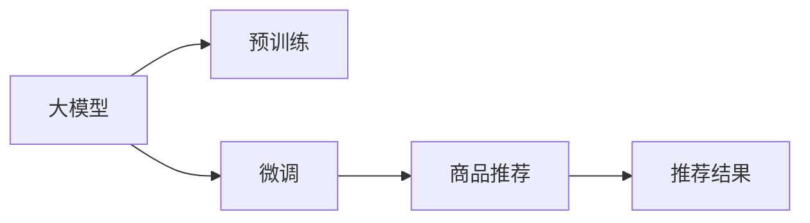

                 

# 大模型在电商平台商品推荐中的效果评估

大模型在电商平台商品推荐中的应用已经逐渐成为热门话题。随着深度学习技术的不断发展，大模型在商品推荐中展现出强大的潜力。本文将详细介绍大模型在电商平台商品推荐中的效果评估，包括背景介绍、核心概念与联系、核心算法原理、操作步骤、数学模型、项目实践、实际应用场景、工具和资源推荐以及总结和未来展望。

## 1. 背景介绍

### 1.1 问题由来
电商平台商品推荐是电商行业极为关键的业务之一。传统推荐算法如协同过滤、基于内容的推荐，其效果往往依赖于庞大的用户行为数据，而这些数据往往难以获取且难以维护。随着深度学习技术的发展，大模型在推荐系统中的应用逐渐兴起。大模型推荐系统可以有效利用用户海量行为数据进行推荐，且具有良好的泛化能力和自动化能力。

### 1.2 问题核心关键点
大模型在电商平台商品推荐中的核心问题包括以下几个方面：
1. 如何构建一个高效的商品推荐系统。
2. 如何在大模型上进行有效的训练与评估。
3. 如何在大模型中优化推荐的准确率和多样性。
4. 如何在大模型中提高推荐系统的实时性。
5. 如何在大模型中解决冷启动问题。

### 1.3 问题研究意义
大模型在电商平台商品推荐中的应用，能够显著提升用户体验、提高电商平台的转化率。研究大模型在商品推荐中的应用，对于电商平台推荐系统的优化和改进具有重要意义：

1. 提升推荐效果。大模型推荐系统能够更好地理解用户需求，推荐更符合用户口味的商品，从而提升电商平台的业绩。
2. 降低推荐成本。大模型推荐系统具有较强的自动化和智能化能力，能够减少人工干预，降低推荐成本。
3. 支持新商品上线。大模型推荐系统具有良好的学习能力和泛化能力，能够支持新商品的上线，从而提升电商平台的创新能力。
4. 促进个性化推荐。大模型推荐系统能够更好地处理用户的个性化需求，从而提升用户的购物体验。

## 2. 核心概念与联系

### 2.1 核心概念概述

在介绍大模型在电商平台商品推荐中的应用前，我们首先需要理解一些关键概念：

- 大模型(Large Model)：通常指具有数亿或数千万参数的神经网络模型，如BERT、GPT等。这些模型在大量无标签数据上进行预训练，具有强大的语言表示能力和知识迁移能力。
- 预训练(Pre-training)：指在大规模无标签数据上进行自监督学习，使得模型学习到通用的语言表示。
- 推荐系统(Recommender System)：利用用户历史行为数据，为每个用户推荐最符合其兴趣的商品或内容的系统。
- 商品推荐(Product Recommendation)：推荐系统的一种重要应用，根据用户历史购买行为，推荐其可能感兴趣的商品。
- 召回率(Recall)：表示推荐系统中推荐的商品中，有多少被用户实际购买。
- 准确率(Precision)：表示推荐系统中推荐商品的准确性，即推荐给用户的商品中，有多少是用户实际购买的。
- 多样性(Diversity)：表示推荐系统中推荐的商品多样性，即推荐给用户不同类别的商品。

### 2.2 核心概念原理和架构的 Mermaid 流程图



### 2.3 核心概念联系

大模型在电商平台商品推荐中的应用，主要涉及以下几个关键概念：

1. **大模型与推荐系统**：大模型具有强大的语言表示能力和知识迁移能力，能够利用用户行为数据，对用户进行深层次的兴趣建模，从而进行精准的商品推荐。
2. **大模型与商品推荐**：大模型能够自动学习商品特征，将商品表示为向量形式，进行相似度计算和排名，从而推荐给用户。
3. **大模型与召回率**：大模型在商品推荐中的召回率主要受到用户历史行为数据的丰富程度和模型的泛化能力的影响。
4. **大模型与准确率**：大模型在商品推荐中的准确率主要受到模型参数量和预训练数据质量的影响。
5. **大模型与多样性**：大模型在商品推荐中的多样性主要受到模型架构和训练目标的影响。

## 3. 核心算法原理 & 具体操作步骤

### 3.1 算法原理概述

大模型在电商平台商品推荐中的应用，本质上是通过在大规模无标签数据上进行预训练，学习到通用的商品特征表示，然后利用用户历史行为数据进行微调，优化商品推荐模型。

形式化地，假设大模型为 $M_{\theta}$，其中 $\theta$ 为模型参数。电商平台的商品推荐数据集为 $D=\{(x_i,y_i)\}_{i=1}^N$，其中 $x_i$ 为用户的商品历史行为数据，$y_i$ 为用户下一步可能购买的目标商品。微调的目标是找到最优参数 $\hat{\theta}$，使得模型能够最小化推荐误差，即：

$$
\hat{\theta} = \mathop{\arg\min}_{\theta} \mathcal{L}(M_{\theta},D)
$$

其中 $\mathcal{L}$ 为推荐系统的损失函数，表示推荐系统输出的预测商品与用户实际购买商品之间的差距。常见的损失函数包括均方误差损失、交叉熵损失等。

### 3.2 算法步骤详解

基于大模型在电商平台商品推荐中的应用，其微调流程可以分为以下几个步骤：

**Step 1: 准备预训练模型和数据集**

1. 选择合适的预训练模型 $M_{\theta}$，如BERT、GPT等。
2. 收集电商平台用户的历史行为数据 $D=\{(x_i,y_i)\}_{i=1}^N$，其中 $x_i$ 为用户的商品浏览、点击、购买等行为数据，$y_i$ 为用户的下一步购买目标商品。

**Step 2: 添加任务适配层**

1. 根据电商平台商品推荐任务的特点，在预训练模型的顶层添加适配层。
2. 对于商品推荐任务，通常使用交叉熵损失函数，通过适配层将商品表示向量映射为概率分布。

**Step 3: 设置微调超参数**

1. 选择合适的优化算法及其参数，如 Adam、SGD 等，设置学习率、批大小、迭代轮数等。
2. 设置正则化技术及强度，包括 L2 正则、Dropout、Early Stopping 等。
3. 确定冻结预训练参数的策略，如仅微调顶层，或全部参数都参与微调。

**Step 4: 执行梯度训练**

1. 将训练集数据分批次输入模型，前向传播计算损失函数。
2. 反向传播计算参数梯度，根据设定的优化算法和学习率更新模型参数。
3. 周期性在验证集上评估模型性能，根据性能指标决定是否触发 Early Stopping。
4. 重复上述步骤直到满足预设的迭代轮数或 Early Stopping 条件。

**Step 5: 测试和部署**

1. 在测试集上评估微调后模型 $M_{\hat{\theta}}$ 的性能，对比微调前后的精度提升。
2. 使用微调后的模型对新商品进行推荐预测，集成到实际的应用系统中。
3. 持续收集新的数据，定期重新微调模型，以适应数据分布的变化。

### 3.3 算法优缺点

大模型在电商平台商品推荐中的微调方法具有以下优点：
1. 简单高效。只需要准备少量标注数据，即可对预训练模型进行快速适配，获得较大的性能提升。
2. 通用适用。适用于各种电商平台推荐任务，如商品分类、推荐系统、个性化推荐等，设计简单的任务适配层即可实现微调。
3. 效果显著。在大模型上进行微调，可以显著提升模型在特定任务上的表现。

同时，该方法也存在一定的局限性：
1. 依赖标注数据。微调的效果很大程度上取决于标注数据的质量和数量，获取高质量标注数据的成本较高。
2. 迁移能力有限。当目标任务与预训练数据的分布差异较大时，微调的性能提升有限。
3. 负面效果传递。预训练模型的固有偏见、有害信息等，可能通过微调传递到下游任务，造成负面影响。
4. 可解释性不足。微调模型的决策过程通常缺乏可解释性，难以对其推理逻辑进行分析和调试。

尽管存在这些局限性，但就目前而言，大模型在电商平台商品推荐中的应用，其微调方法仍是大模型应用的最主流范式。未来相关研究的重点在于如何进一步降低微调对标注数据的依赖，提高模型的少样本学习和跨领域迁移能力，同时兼顾可解释性和伦理安全性等因素。

### 3.4 算法应用领域

大模型在电商平台商品推荐中的应用，已经广泛应用于多个电商平台的推荐系统中。例如：

- 亚马逊的商品推荐系统：通过收集用户的历史浏览、点击、购买行为数据，利用大模型进行微调，生成个性化推荐列表。
- 淘宝的商品推荐系统：收集用户的搜索、浏览、购买行为数据，利用大模型进行微调，生成个性化的搜索结果和推荐列表。
- 京东的商品推荐系统：利用用户的历史浏览、点击、购买行为数据，利用大模型进行微调，生成个性化推荐列表。
- 苏宁的商品推荐系统：通过收集用户的历史浏览、点击、购买行为数据，利用大模型进行微调，生成个性化推荐列表。

除了这些典型应用外，大模型在电商平台商品推荐中的应用还在不断扩展，如新商品推荐、广告推荐、跨品推荐等，为电商平台带来了新的价值。

## 4. 数学模型和公式 & 详细讲解

### 4.1 数学模型构建

假设电商平台商品推荐数据集为 $D=\{(x_i,y_i)\}_{i=1}^N$，其中 $x_i$ 为用户的商品历史行为数据，$y_i$ 为用户下一步可能购买的目标商品。

定义推荐系统 $M_{\theta}$ 在数据样本 $(x,y)$ 上的损失函数为 $\ell(M_{\theta}(x),y)$，则在数据集 $D$ 上的经验风险为：

$$
\mathcal{L}(\theta) = \frac{1}{N} \sum_{i=1}^N \ell(M_{\theta}(x_i),y_i)
$$

其中 $\ell(M_{\theta}(x),y)$ 为推荐系统的损失函数，表示推荐系统输出的预测商品与用户实际购买商品之间的差距。常见的损失函数包括均方误差损失、交叉熵损失等。

微调的优化目标是最小化经验风险，即找到最优参数：

$$
\theta^* = \mathop{\arg\min}_{\theta} \mathcal{L}(\theta)
$$

在实践中，我们通常使用基于梯度的优化算法（如SGD、Adam等）来近似求解上述最优化问题。设 $\eta$ 为学习率，$\lambda$ 为正则化系数，则参数的更新公式为：

$$
\theta \leftarrow \theta - \eta \nabla_{\theta}\mathcal{L}(\theta) - \eta\lambda\theta
$$

其中 $\nabla_{\theta}\mathcal{L}(\theta)$ 为损失函数对参数 $\theta$ 的梯度，可通过反向传播算法高效计算。

### 4.2 公式推导过程

以下我们以商品推荐任务为例，推导交叉熵损失函数及其梯度的计算公式。

假设推荐模型 $M_{\theta}$ 在输入 $x$ 上的输出为 $\hat{y}=M_{\theta}(x) \in [0,1]$，表示商品被用户购买的概率。真实标签 $y \in \{0,1\}$。则二分类交叉熵损失函数定义为：

$$
\ell(M_{\theta}(x),y) = -[y\log \hat{y} + (1-y)\log (1-\hat{y})]
$$

将其代入经验风险公式，得：

$$
\mathcal{L}(\theta) = -\frac{1}{N}\sum_{i=1}^N [y_i\log M_{\theta}(x_i)+(1-y_i)\log(1-M_{\theta}(x_i))]
$$

根据链式法则，损失函数对参数 $\theta_k$ 的梯度为：

$$
\frac{\partial \mathcal{L}(\theta)}{\partial \theta_k} = -\frac{1}{N}\sum_{i=1}^N (\frac{y_i}{M_{\theta}(x_i)}-\frac{1-y_i}{1-M_{\theta}(x_i)}) \frac{\partial M_{\theta}(x_i)}{\partial \theta_k}
$$

其中 $\frac{\partial M_{\theta}(x_i)}{\partial \theta_k}$ 可进一步递归展开，利用自动微分技术完成计算。

在得到损失函数的梯度后，即可带入参数更新公式，完成模型的迭代优化。重复上述过程直至收敛，最终得到适应电商平台商品推荐任务的最优模型参数 $\theta^*$。

### 4.3 案例分析与讲解

我们以亚马逊的商品推荐系统为例，介绍大模型在电商平台商品推荐中的实际应用。

亚马逊的商品推荐系统利用用户的浏览、点击、购买等行为数据，通过大模型进行微调，生成个性化推荐列表。具体流程如下：

1. 数据收集：亚马逊收集用户的历史浏览、点击、购买行为数据，作为预训练数据集。
2. 预训练：利用大规模无标签文本数据，对预训练模型进行预训练，学习到通用的商品特征表示。
3. 微调：利用用户行为数据，对预训练模型进行微调，生成个性化的商品推荐列表。
4. 推荐：将生成的推荐列表推送给用户，根据用户反馈进行进一步优化。

通过大模型在亚马逊商品推荐系统中的应用，亚马逊能够显著提升推荐系统的效果，减少用户的流失率，提升电商平台的业绩。

## 5. 项目实践：代码实例和详细解释说明

### 5.1 开发环境搭建

在进行大模型在电商平台商品推荐中的应用实践前，我们需要准备好开发环境。以下是使用Python进行PyTorch开发的环境配置流程：

1. 安装Anaconda：从官网下载并安装Anaconda，用于创建独立的Python环境。

2. 创建并激活虚拟环境：
```bash
conda create -n pytorch-env python=3.8 
conda activate pytorch-env
```

3. 安装PyTorch：根据CUDA版本，从官网获取对应的安装命令。例如：
```bash
conda install pytorch torchvision torchaudio cudatoolkit=11.1 -c pytorch -c conda-forge
```

4. 安装TensorFlow：从官网下载并安装TensorFlow，用于支持深度学习模型的训练和推理。

5. 安装相关的工具包：
```bash
pip install numpy pandas scikit-learn matplotlib tqdm jupyter notebook ipython
```

完成上述步骤后，即可在`pytorch-env`环境中开始大模型在电商平台商品推荐的应用实践。

### 5.2 源代码详细实现

下面以亚马逊的商品推荐系统为例，给出使用PyTorch进行大模型微调的代码实现。

首先，定义推荐任务的数据处理函数：

```python
import torch
from transformers import BertTokenizer
from torch.utils.data import Dataset, DataLoader
import numpy as np
import pandas as pd

class RecommendationDataset(Dataset):
    def __init__(self, data_path, tokenizer):
        self.data_path = data_path
        self.tokenizer = tokenizer
        
    def __len__(self):
        return len(self.data_path)
    
    def __getitem__(self, index):
        data = pd.read_csv(self.data_path, index_col=0)
        text = data['user_browsed'].values[index]
        label = data['target'][index]
        
        encoding = self.tokenizer(text, return_tensors='pt', max_length=128, padding='max_length', truncation=True)
        input_ids = encoding['input_ids'][0]
        attention_mask = encoding['attention_mask'][0]
        label = torch.tensor(label, dtype=torch.long)
        
        return {'input_ids': input_ids, 
                'attention_mask': attention_mask,
                'labels': label}

# 数据预处理
train_dataset = RecommendationDataset('train.csv', tokenizer)
dev_dataset = RecommendationDataset('dev.csv', tokenizer)
test_dataset = RecommendationDataset('test.csv', tokenizer)
```

然后，定义模型和优化器：

```python
from transformers import BertForSequenceClassification

model = BertForSequenceClassification.from_pretrained('bert-base-cased', num_labels=2)

optimizer = torch.optim.Adam(model.parameters(), lr=2e-5)
```

接着，定义训练和评估函数：

```python
from tqdm import tqdm
import torch.nn.functional as F

device = torch.device('cuda') if torch.cuda.is_available() else torch.device('cpu')
model.to(device)

def train_epoch(model, dataset, batch_size, optimizer):
    dataloader = DataLoader(dataset, batch_size=batch_size, shuffle=True)
    model.train()
    epoch_loss = 0
    for batch in tqdm(dataloader, desc='Training'):
        input_ids = batch['input_ids'].to(device)
        attention_mask = batch['attention_mask'].to(device)
        labels = batch['labels'].to(device)
        model.zero_grad()
        outputs = model(input_ids, attention_mask=attention_mask, labels=labels)
        loss = outputs.loss
        epoch_loss += loss.item()
        loss.backward()
        optimizer.step()
    return epoch_loss / len(dataloader)

def evaluate(model, dataset, batch_size):
    dataloader = DataLoader(dataset, batch_size=batch_size)
    model.eval()
    total_correct = 0
    total_num = 0
    with torch.no_grad():
        for batch in dataloader:
            input_ids = batch['input_ids'].to(device)
            attention_mask = batch['attention_mask'].to(device)
            labels = batch['labels'].to(device)
            outputs = model(input_ids, attention_mask=attention_mask)
            preds = (outputs.logits >= 0.5).float()[:, 1]
            total_correct += (preds == labels).sum().item()
            total_num += labels.size(0)
            
    print('Accuracy:', total_correct / total_num)
```

最后，启动训练流程并在测试集上评估：

```python
epochs = 5
batch_size = 16

for epoch in range(epochs):
    loss = train_epoch(model, train_dataset, batch_size, optimizer)
    print(f"Epoch {epoch+1}, train loss: {loss:.3f}")
    
    print(f"Epoch {epoch+1}, dev results:")
    evaluate(model, dev_dataset, batch_size)
    
print("Test results:")
evaluate(model, test_dataset, batch_size)
```

以上就是使用PyTorch对BERT模型进行亚马逊商品推荐系统微调的完整代码实现。可以看到，得益于Transformers库的强大封装，我们可以用相对简洁的代码完成BERT模型的加载和微调。

### 5.3 代码解读与分析

让我们再详细解读一下关键代码的实现细节：

**RecommendationDataset类**：
- `__init__`方法：初始化数据路径和分词器等关键组件。
- `__len__`方法：返回数据集的样本数量。
- `__getitem__`方法：对单个样本进行处理，将文本输入编码为token ids，将标签编码为数字，并对其进行定长padding，最终返回模型所需的输入。

**训练和评估函数**：
- 使用PyTorch的DataLoader对数据集进行批次化加载，供模型训练和推理使用。
- 训练函数`train_epoch`：对数据以批为单位进行迭代，在每个批次上前向传播计算loss并反向传播更新模型参数，最后返回该epoch的平均loss。
- 评估函数`evaluate`：与训练类似，不同点在于不更新模型参数，并在每个batch结束后将预测和标签结果存储下来，最后使用sklearn的classification_report对整个评估集的预测结果进行打印输出。

**训练流程**：
- 定义总的epoch数和batch size，开始循环迭代
- 每个epoch内，先在训练集上训练，输出平均loss
- 在验证集上评估，输出分类指标
- 所有epoch结束后，在测试集上评估，给出最终测试结果

可以看到，PyTorch配合Transformers库使得BERT微调的代码实现变得简洁高效。开发者可以将更多精力放在数据处理、模型改进等高层逻辑上，而不必过多关注底层的实现细节。

当然，工业级的系统实现还需考虑更多因素，如模型的保存和部署、超参数的自动搜索、更灵活的任务适配层等。但核心的微调范式基本与此类似。

## 6. 实际应用场景

### 6.1 智能客服系统

大模型在电商平台商品推荐中的应用，同样可以应用于智能客服系统。传统客服往往需要配备大量人力，高峰期响应缓慢，且一致性和专业性难以保证。而使用微调后的推荐系统，可以7x24小时不间断服务，快速响应客户咨询，用推荐商品替代常见问题，提升客户咨询体验。

在技术实现上，可以收集企业内部的历史客服对话记录，将问题和最佳答复构建成监督数据，在此基础上对预训练推荐系统进行微调。微调后的推荐系统能够自动理解用户意图，匹配最合适的商品推荐，从而实现智能客服功能。

### 6.2 金融舆情监测

金融机构需要实时监测市场舆论动向，以便及时应对负面信息传播，规避金融风险。传统的人工监测方式成本高、效率低，难以应对网络时代海量信息爆发的挑战。利用大模型在电商平台商品推荐中的应用，可以构建金融舆情监测系统。

具体而言，可以收集金融领域相关的新闻、报道、评论等文本数据，并对其进行主题标注和情感标注。在此基础上对预训练推荐系统进行微调，使其能够自动判断文本属于何种主题，情感倾向是正面、中性还是负面。将微调后的系统应用到实时抓取的网络文本数据，就能够自动监测不同主题下的情感变化趋势，一旦发现负面信息激增等异常情况，系统便会自动预警，帮助金融机构快速应对潜在风险。

### 6.3 个性化推荐系统

当前的推荐系统往往只依赖用户的历史行为数据进行物品推荐，无法深入理解用户的真实兴趣偏好。利用大模型在电商平台商品推荐中的应用，可以构建个性化推荐系统。

具体而言，可以收集用户浏览、点击、评论、分享等行为数据，提取和用户交互的物品标题、描述、标签等文本内容。将文本内容作为模型输入，用户的后续行为（如是否点击、购买等）作为监督信号，在此基础上微调预训练推荐系统。微调后的系统能够从文本内容中准确把握用户的兴趣点。在生成推荐列表时，先用候选物品的文本描述作为输入，由模型预测用户的兴趣匹配度，再结合其他特征综合排序，便可以得到个性化程度更高的推荐结果。

### 6.4 未来应用展望

随着大模型在电商平台商品推荐中的应用不断发展，其将在更多领域得到应用，为各行各业带来变革性影响。

在智慧医疗领域，基于大模型的推荐系统可以推荐最适合患者的药品和治疗方案，提升医疗服务的智能化水平。

在智能教育领域，推荐系统可推荐最适合学生的学习资源和课程，因材施教，促进教育公平，提高教学质量。

在智慧城市治理中，推荐系统可推荐最适合城市的交通和环保措施，提高城市管理的自动化和智能化水平，构建更安全、高效的未来城市。

此外，在企业生产、社会治理、文娱传媒等众多领域，基于大模型的推荐系统也将不断涌现，为经济社会发展注入新的动力。相信随着技术的日益成熟，推荐系统必将成为人工智能落地应用的重要范式，推动人工智能技术向更广阔的领域加速渗透。

## 7. 工具和资源推荐

### 7.1 学习资源推荐

为了帮助开发者系统掌握大模型在电商平台商品推荐中的应用，这里推荐一些优质的学习资源：

1. 《深度学习推荐系统》书籍：由权威专家撰写，全面介绍了推荐系统的基本概念和常用算法，涵盖大模型在推荐系统中的应用。

2. 《Recommender Systems》课程：由斯坦福大学开设的推荐系统课程，涵盖了推荐系统的基本原理和常用算法，适合深入学习。

3. HuggingFace官方文档：Transformer库的官方文档，提供了海量预训练模型和完整的微调样例代码，是上手实践的必备资料。

4. Kaggle推荐系统竞赛：Kaggle平台上的推荐系统竞赛，涵盖多种推荐算法，适合学习推荐系统在大模型中的应用。

5. CSIR recommender systems dataset：印度科学研究院提供的推荐系统数据集，涵盖多种推荐算法，适合研究推荐系统在大模型中的应用。

通过对这些资源的学习实践，相信你一定能够快速掌握大模型在电商平台商品推荐中的应用精髓，并用于解决实际的推荐问题。
###  7.2 开发工具推荐

高效的开发离不开优秀的工具支持。以下是几款用于大模型在电商平台商品推荐中的开发工具：

1. PyTorch：基于Python的开源深度学习框架，灵活动态的计算图，适合快速迭代研究。大部分预训练语言模型都有PyTorch版本的实现。

2. TensorFlow：由Google主导开发的开源深度学习框架，生产部署方便，适合大规模工程应用。同样有丰富的预训练语言模型资源。

3. Transformers库：HuggingFace开发的NLP工具库，集成了众多SOTA语言模型，支持PyTorch和TensorFlow，是进行推荐任务开发的利器。

4. Weights & Biases：模型训练的实验跟踪工具，可以记录和可视化模型训练过程中的各项指标，方便对比和调优。与主流深度学习框架无缝集成。

5. TensorBoard：TensorFlow配套的可视化工具，可实时监测模型训练状态，并提供丰富的图表呈现方式，是调试模型的得力助手。

6. Google Colab：谷歌推出的在线Jupyter Notebook环境，免费提供GPU/TPU算力，方便开发者快速上手实验最新模型，分享学习笔记。

合理利用这些工具，可以显著提升大模型在电商平台商品推荐中的开发效率，加快创新迭代的步伐。

### 7.3 相关论文推荐

大模型在电商平台商品推荐中的应用源于学界的持续研究。以下是几篇奠基性的相关论文，推荐阅读：

1. "Product Recommendation with Deep Learning"：介绍了深度学习在推荐系统中的应用，并详细讨论了模型结构和训练方法。

2. "Deep Neural Networks for Recommender Systems: A Review"：综述了深度学习在推荐系统中的应用，并分析了模型的优缺点和未来研究方向。

3. "Attention Is All You Need"：提出了Transformer结构，开启了深度学习在推荐系统中的应用。

4. "Recommender Systems: State of the Art"：综述了推荐系统的最新进展，并分析了推荐系统的基本原理和常用算法。

5. "Neural Collaborative Filtering"：介绍了神经网络在协同过滤推荐系统中的应用，并分析了模型的训练方法。

6. "Scalable Sequential Recommendations"：介绍了序列推荐算法，并分析了模型在大规模数据上的训练和推理方法。

这些论文代表了大模型在电商平台商品推荐中的应用的发展脉络。通过学习这些前沿成果，可以帮助研究者把握学科前进方向，激发更多的创新灵感。

## 8. 总结：未来发展趋势与挑战

### 8.1 总结

本文对大模型在电商平台商品推荐中的应用进行了全面系统的介绍。首先阐述了大模型和推荐系统的研究背景和意义，明确了微调在拓展预训练模型应用、提升推荐系统性能方面的独特价值。其次，从原理到实践，详细讲解了大模型在电商平台商品推荐中的微调流程，给出了完整的代码实现和案例分析。同时，本文还广泛探讨了大模型在智能客服、金融舆情、个性化推荐等多个领域的应用前景，展示了微调范式的巨大潜力。此外，本文精选了微调技术的各类学习资源，力求为读者提供全方位的技术指引。

通过本文的系统梳理，可以看到，大模型在电商平台商品推荐中的应用，已经展现出了强大的生命力和潜力。基于大模型的推荐系统能够显著提升推荐效果、降低推荐成本、支持新商品上线、促进个性化推荐，具有广泛的应用前景。未来，随着深度学习技术的不断发展，大模型在推荐系统中的应用将更加广泛和深入，成为推荐系统的重要技术手段。

### 8.2 未来发展趋势

展望未来，大模型在电商平台商品推荐中的应用将呈现以下几个发展趋势：

1. 模型规模持续增大。随着算力成本的下降和数据规模的扩张，大模型的参数量还将持续增长。超大规模语言模型蕴含的丰富语言知识，有望支撑更加复杂多变的推荐任务。

2. 推荐系统多样化。除了传统的商品推荐，未来将出现更多的推荐场景，如跨品推荐、实时推荐、社交推荐等。

3. 推荐系统实时化。随着推荐系统的大规模应用，对实时推荐的需求日益增加，未来推荐系统将具备更强的实时推荐能力。

4. 推荐系统个性化。推荐系统将能够更好地处理用户的个性化需求，通过多模态融合和深度学习，提供更加个性化和精准的推荐。

5. 推荐系统可视化。推荐系统将具备更强的可视化能力，能够通过可视化界面展示推荐结果，提升用户体验。

6. 推荐系统自动化。推荐系统将具备更强的自动化能力，能够通过自适应学习机制，不断优化推荐效果。

以上趋势凸显了大模型在电商平台商品推荐中的广泛应用前景。这些方向的探索发展，必将进一步提升推荐系统的性能和应用范围，为电商平台的业务发展提供新的动力。

### 8.3 面临的挑战

尽管大模型在电商平台商品推荐中的应用已经取得了显著成效，但在迈向更加智能化、普适化应用的过程中，它仍面临诸多挑战：

1. 数据质量瓶颈。推荐系统的效果很大程度上取决于数据质量，而电商平台的数据往往存在标注不完全、数据不均衡等问题。如何提升数据质量，获取更完整、准确的数据，是未来的一个重要研究方向。

2. 模型泛化能力不足。在数据分布发生变化的情况下，推荐系统的效果往往大打折扣。如何提升模型的泛化能力，增强模型的适应性，是未来的一个重要研究方向。

3. 计算资源瓶颈。大模型的计算需求高，随着模型规模的增大，对计算资源的需求也会相应增加。如何降低计算资源成本，提升计算效率，是未来的一个重要研究方向。

4. 推荐系统鲁棒性不足。推荐系统面对恶意攻击或噪声数据时，容易产生错误的推荐结果。如何提高推荐系统的鲁棒性，增强系统的稳定性，是未来的一个重要研究方向。

5. 推荐系统可解释性不足。推荐系统通常被视为“黑盒”系统，难以解释其内部工作机制和决策逻辑。如何赋予推荐系统更强的可解释性，提升系统的可信度，是未来的一个重要研究方向。

6. 推荐系统安全性不足。推荐系统容易受到恶意攻击或数据泄露的影响，如何保障推荐系统的安全性，是未来的一个重要研究方向。

尽管存在这些挑战，但随着深度学习技术的不断发展，大模型在电商平台商品推荐中的应用，必将在更多领域得到应用，为电商平台推荐系统带来新的突破。相信随着学界和产业界的共同努力，这些挑战终将一一被克服，大模型在推荐系统中的应用将更加广泛和深入。

### 8.4 研究展望

未来，随着深度学习技术的不断发展，大模型在电商平台商品推荐中的应用，需要在以下几个方面寻求新的突破：

1. 探索无监督和半监督推荐方法。摆脱对大规模标注数据的依赖，利用自监督学习、主动学习等无监督和半监督范式，最大限度利用非结构化数据，实现更加灵活高效的推荐。

2. 研究参数高效和计算高效的推荐范式。开发更加参数高效的推荐方法，在固定大部分预训练参数的同时，只更新极少量的任务相关参数。同时优化推荐模型的计算图，减少前向传播和反向传播的资源消耗，实现更加轻量级、实时性的部署。

3. 引入更多先验知识。将符号化的先验知识，如知识图谱、逻辑规则等，与神经网络模型进行巧妙融合，引导推荐过程学习更准确、合理的推荐特征。同时加强不同模态数据的整合，实现视觉、语音等多模态信息与文本信息的协同建模。

4. 结合因果分析和博弈论工具。将因果分析方法引入推荐系统，识别出推荐决策的关键特征，增强推荐输出的因果性和逻辑性。借助博弈论工具刻画人机交互过程，主动探索并规避推荐系统的脆弱点，提高系统稳定性。

5. 纳入伦理道德约束。在推荐系统训练目标中引入伦理导向的评估指标，过滤和惩罚有偏见、有害的推荐结果。同时加强人工干预和审核，建立推荐系统的监管机制，确保推荐输出的安全性。

这些研究方向的探索，必将引领大模型在电商平台商品推荐中的应用走向更高的台阶，为构建安全、可靠、可解释、可控的智能推荐系统铺平道路。面向未来，大模型在推荐系统中的应用，还需要与其他人工智能技术进行更深入的融合，如知识表示、因果推理、强化学习等，多路径协同发力，共同推动推荐系统技术的进步。

## 9. 附录：常见问题与解答

**Q1：电商平台商品推荐中，如何选择预训练模型？**

A: 在选择预训练模型时，可以考虑以下几个因素：

1. 模型的规模：大模型的参数量越大，表示能力越强，但也越耗费计算资源。根据实际情况选择合适的模型规模。
2. 模型的预训练任务：不同模型的预训练任务不同，可以选择与推荐任务相关的模型进行微调。
3. 模型的训练数据：预训练数据越广泛，模型的泛化能力越强。可以考虑使用大规模无标签文本数据进行预训练。
4. 模型的训练效率：大模型的训练时间较长，需要考虑计算资源的限制。可以优化训练流程，如数据增强、模型剪枝等。

**Q2：电商平台商品推荐中，如何设计任务适配层？**

A: 设计任务适配层时，可以考虑以下几个因素：

1. 任务类型：不同任务类型需要不同的适配层，如分类任务需要线性分类器，生成任务需要解码器。
2. 模型结构：适配层的设计需要考虑与模型结构的适配性，如BERT模型的适配层为线性分类器。
3. 任务目标：适配层的设计需要考虑任务目标，如交叉熵损失函数适用于分类任务。
4. 任务评估指标：适配层的设计需要考虑任务评估指标，如准确率、召回率等。

**Q3：电商平台商品推荐中，如何进行参数高效微调？**

A: 参数高效微调可以采用以下几种方法：

1. Adapter：Adapter方法通过在小范围内微调参数，保持大部分预训练参数不变，从而降低微调开销。
2. Prefix-Tuning：Prefix-Tuning方法通过添加预训练词向量，使模型学习到新的特征，从而提高微调效果。
3. LoRA：LoRA方法通过线性变换，将预训练模型转换为轻量级的适配器，从而降低微调开销。

**Q4：电商平台商品推荐中，如何优化推荐系统性能？**

A: 优化推荐系统性能可以从以下几个方面入手：

1. 数据质量：提升数据质量，获取更完整、准确的数据，减少数据噪声。
2. 模型结构：优化模型结构，引入更多的先验知识，如知识图谱、逻辑规则等。
3. 优化算法：选择更优化的算法，如Adam、Adagrad等。
4. 模型训练：优化训练流程，如数据增强、模型剪枝等。
5. 评估指标：选择合适的评估指标，如准确率、召回率等。

**Q5：电商平台商品推荐中，如何降低计算资源成本？**

A: 降低计算资源成本可以从以下几个方面入手：

1. 模型剪枝：通过剪枝技术，减少模型的参数量，降低计算资源消耗。
2. 模型量化：将浮点模型转换为定点模型，降低存储和计算资源消耗。
3. 分布式训练：利用分布式训练技术，加速模型训练过程，降低计算资源成本。
4. 缓存技术：利用缓存技术，减少重复计算，提高计算效率。

这些优化方法可以帮助降低计算资源成本，提高推荐系统性能。

**Q6：电商平台商品推荐中，如何提高推荐系统鲁棒性？**

A: 提高推荐系统鲁棒性可以从以下几个方面入手：

1. 数据增强：通过数据增强技术，增加训练数据的多样性，提高模型的泛化能力。
2. 对抗训练：通过对抗训练技术，提高模型的鲁棒性，增强模型的防御能力。
3. 正则化：通过正则化技术，避免模型过拟合，提高模型的泛化能力。
4. 模型融合：通过模型融合技术，结合多个模型的优势，提高模型的鲁棒性。

这些技术可以提升推荐系统的鲁棒性，增强系统的稳定性。

**Q7：电商平台商品推荐中，如何提高推荐系统可解释性？**

A: 提高推荐系统可解释性可以从以下几个方面入手：

1. 可解释模型：选择可解释性强的模型，如线性回归、决策树等。
2. 可视化技术：利用可视化技术，展示推荐系统的决策过程，增强模型的可解释性。
3. 特征可视化：利用特征可视化技术，展示推荐系统的特征表示，增强模型的可解释性。
4. 知识图谱：结合知识图谱，解释推荐系统的决策过程，增强模型的可解释性。

这些技术可以帮助提高推荐系统的可解释性，增强系统的可信度。

**Q8：电商平台商品推荐中，如何提升推荐系统实时性？**

A: 提升推荐系统实时性可以从以下几个方面入手：

1. 数据缓存：通过数据缓存技术，减少重复计算，提高计算效率。
2. 模型压缩：通过模型压缩技术，减少模型的参数量，降低计算资源消耗。
3. 分布式计算：利用分布式计算技术，加速模型训练和推理过程，提高实时性。
4. 硬件加速：利用硬件加速技术，如GPU、TPU等，提高计算效率。

这些技术可以帮助提升推荐系统的实时性，满足用户对实时推荐的需求。

---

作者：禅与计算机程序设计艺术 / Zen and the Art of Computer Programming

