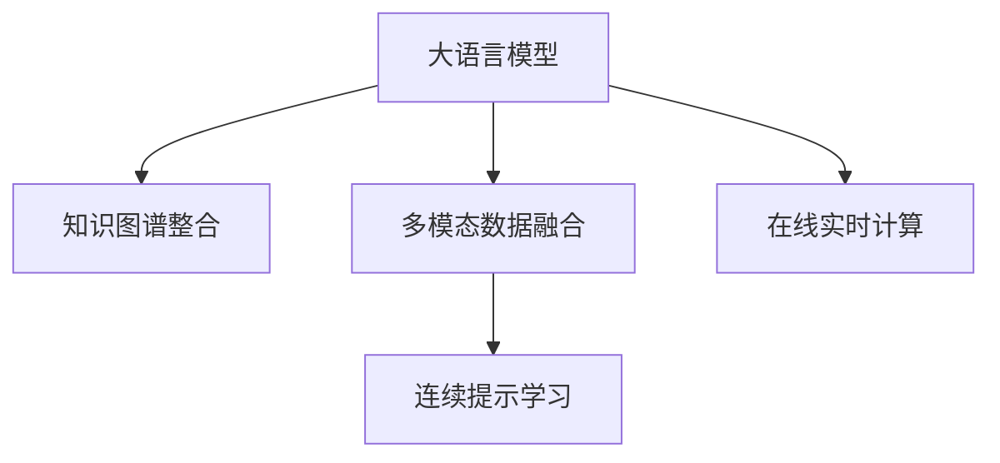

                 

# 大模型在电商平台用户行为预测与干预中的应用

## 1. 背景介绍

### 1.1 问题由来

在电商平台的快速发展中，用户行为预测与干预显得尤为重要。如何通过用户的历史行为数据，准确预测其购买意向，并及时推送个性化推荐，提升用户体验和销售额，是电商企业面临的重要挑战。传统的机器学习算法如线性回归、逻辑回归等，在处理复杂多变用户行为时表现有限，且往往需要较多的手工特征工程，难以快速迭代优化。

近年来，大语言模型如GPT-3、BERT等，因其强大的语言理解和生成能力，被广泛应用于自然语言处理（NLP）领域。通过在电商评论、商品描述等海量数据上进行预训练，大语言模型可以学习到丰富的用户偏好和行为规律。将这些知识引入电商平台的用户行为预测与干预中，可以显著提升模型的预测准确率和个性化推荐效果。

### 1.2 问题核心关键点

基于大语言模型的用户行为预测与干预，关键点在于：

- **预训练与微调**：通过在大量电商数据上进行预训练，大模型获得全局知识；再通过微调，针对具体任务进行优化，提升模型性能。
- **知识图谱整合**：将电商商品、用户、交易等实体信息进行知识图谱表示，增强模型的上下文理解和推理能力。
- **多模态数据融合**：结合电商数据中的文本、图像、语音等多模态信息，构建更全面、立体的用户行为模型。
- **连续提示学习**：通过精心设计的提示模板，引导模型输出特定结果，实现少样本或零样本学习。
- **在线实时计算**：将大模型部署在电商平台的实时计算环境中，快速响应用户行为变化，提升个性化推荐的时效性。

这些关键点构成了大模型在电商平台应用的核心框架，通过合理设计和应用，可以实现高效、准确的预测和干预，为电商平台带来更多的商业价值。

## 2. 核心概念与联系

### 2.1 核心概念概述

为更好地理解大模型在电商平台用户行为预测与干预中的应用，本节将介绍几个密切相关的核心概念：

- **大语言模型**：如GPT-3、BERT等，通过在大规模无标签文本语料上进行预训练，学习通用的语言表示，具备强大的语言理解和生成能力。
- **知识图谱**：将实体和关系进行结构化表示，通过三元组（实体-关系-实体）形式组织知识，用于增强模型的上下文理解和推理能力。
- **多模态数据**：结合文本、图像、语音等多模态数据，构建更全面、立体的用户行为模型。
- **连续提示学习**：通过在输入文本中添加提示模板，引导大模型进行特定任务的推理和生成，减少微调参数，提升推理速度。
- **在线实时计算**：将大模型部署在电商平台的实时计算环境中，快速响应用户行为变化，提升个性化推荐的时效性。

这些核心概念之间的逻辑关系可以通过以下Mermaid流程图来展示：



这个流程图展示了大语言模型在电商平台应用的几个关键步骤：

1. 大语言模型通过预训练获得基础能力。
2. 知识图谱整合，增强模型的上下文理解和推理能力。
3. 多模态数据融合，构建更全面的用户行为模型。
4. 连续提示学习，减少微调参数，提升推理速度。
5. 在线实时计算，快速响应用户行为变化，提升推荐时效性。

这些概念共同构成了大模型在电商平台应用的基本框架，通过合理设计和应用，可以实现高效、准确的预测和干预，为电商平台带来更多的商业价值。

## 3. 核心算法原理 & 具体操作步骤

### 3.1 算法原理概述

大模型在电商平台用户行为预测与干预中，本质上是一个多模态数据融合与深度学习的复合过程。其核心思想是：

1. **多模态数据融合**：将电商评论、商品描述、用户画像等多模态数据进行融合，构建更加全面、立体的用户行为模型。
2. **深度学习模型训练**：通过在大模型上进行微调，学习用户行为与购买意向之间的映射关系。

具体而言，将多模态数据输入大模型，得到全局语义表示；然后通过微调，将全局语义表示映射到具体的购买意向，实现用户行为预测。通过实时计算，及时推送个性化推荐，提升用户体验和销售额。

### 3.2 算法步骤详解

基于大模型的电商平台用户行为预测与干预，一般包括以下几个关键步骤：

**Step 1: 准备电商数据集**
- 收集电商平台的评论、商品描述、用户画像等数据，并进行预处理和标注。
- 将文本数据进行分词、去除停用词等预处理，将图像数据进行特征提取，将语音数据进行文本化。

**Step 2: 构建知识图谱**
- 将电商商品、用户、交易等实体信息进行知识图谱表示，通过三元组（实体-关系-实体）形式组织知识。
- 使用知识图谱增强模型上下文理解和推理能力，提升预测准确率。

**Step 3: 预训练大模型**
- 选择预训练模型，如GPT-3、BERT等，在电商评论、商品描述等海量数据上进行预训练，学习全局语义表示。
- 通过多个epoch进行预训练，不断提升模型语言理解和生成能力。

**Step 4: 微调模型**
- 将预训练模型的顶层部分微调，以适应电商平台的具体任务，如用户行为预测。
- 设置合适的学习率、优化器、损失函数等参数，进行多轮迭代训练。

**Step 5: 多模态数据融合**
- 将电商评论、商品描述、用户画像等多模态数据进行融合，构建更加全面、立体的用户行为模型。
- 通过加权平均、拼接、注意力机制等方式，整合不同模态的信息，提升模型的预测能力。

**Step 6: 连续提示学习**
- 设计连续提示模板，引导大模型进行特定任务的推理和生成，减少微调参数，提升推理速度。
- 在提示模板中，通过精心设计任务描述和输出格式，使得模型能够快速、准确地完成任务。

**Step 7: 在线实时计算**
- 将微调后的模型部署到电商平台的实时计算环境中，快速响应用户行为变化。
- 在用户实时行为数据上，进行在线计算，生成个性化推荐，提升用户体验和销售额。

### 3.3 算法优缺点

基于大模型的电商平台用户行为预测与干预方法具有以下优点：

1. **高效性**：通过预训练和微调，模型能够快速学习到全局语义表示和特定任务的能力，提升预测和推荐的效率。
2. **全面性**：多模态数据的融合，使得模型能够全面、立体地理解用户行为，提升预测准确率。
3. **灵活性**：通过连续提示学习，模型能够快速适应新任务和新数据，提升模型的适应性。
4. **实时性**：在线实时计算，使得模型能够及时响应用户行为变化，提升个性化推荐的实时性。

同时，该方法也存在一些局限性：

1. **数据依赖**：模型的性能很大程度上取决于标注数据的质量和数量，获取高质量标注数据的成本较高。
2. **模型复杂度**：预训练和微调模型的参数量较大，对计算资源和存储空间的需求较高。
3. **可解释性不足**：大模型通常缺乏可解释性，难以对其推理逻辑进行分析和调试。
4. **对抗性脆弱**：模型在对抗样本攻击下可能出现较大偏差，需要加强对抗训练和鲁棒性提升。

尽管存在这些局限性，但就目前而言，基于大模型的电商平台用户行为预测与干预方法仍是一种高效、全面、灵活的技术手段，能够显著提升电商平台的推荐效果和用户满意度。

### 3.4 算法应用领域

基于大模型的电商平台用户行为预测与干预方法，已经在电商推荐、客户流失预测、个性化营销等多个领域得到了广泛应用。例如：

- **电商推荐**：通过预测用户购买意向，实时生成个性化推荐，提升用户体验和销售额。
- **客户流失预测**：通过分析用户行为，预测客户流失风险，及时采取干预措施。
- **个性化营销**：通过分析用户画像，生成定制化的营销方案，提升营销效果和用户满意度。

除了上述这些应用外，大模型还创新性地应用于社交媒体分析、广告投放优化、金融风控等领域，为各行业的数字化转型升级提供了新的技术路径。随着大语言模型的不断发展，相信其将在更多领域得到应用，为各行业的智能化进程带来新的突破。

## 4. 数学模型和公式 & 详细讲解  
### 4.1 数学模型构建

本节将使用数学语言对基于大模型的电商平台用户行为预测与干预过程进行更加严格的刻画。

记电商评论为 $x$，商品描述为 $y$，用户画像为 $z$，将三者进行拼接，得到输入特征 $u$：

$$ u = [x, y, z] $$

定义电商平台用户行为预测与干预的模型为 $M_{\theta}$，其中 $\theta$ 为模型参数。假设用户行为与购买意向的映射关系为 $\varphi$，则模型输出为：

$$ \hat{v} = M_{\theta}(u) $$

其中 $\hat{v}$ 为预测的用户购买意向， $v$ 为真实标签。

### 4.2 公式推导过程

基于上述数学模型，我们可以推导出预测用户购买意向的损失函数：

$$ \mathcal{L}(\theta) = -\frac{1}{N} \sum_{i=1}^N \log P(y_i | M_{\theta}(u_i)) $$

其中 $N$ 为样本数，$y_i$ 为真实标签，$P(y_i | M_{\theta}(u_i))$ 为模型在输入 $u_i$ 下预测 $y_i$ 的概率。

### 4.3 案例分析与讲解

以电商推荐为例，通过预训练大模型，将电商评论、商品描述、用户画像等多模态数据进行融合，构建用户行为模型 $u$。将 $u$ 输入到微调后的模型 $M_{\theta}$ 中，得到用户购买意向的预测 $\hat{v}$。通过对比 $\hat{v}$ 和真实标签 $y$，计算损失函数 $\mathcal{L}(\theta)$。通过反向传播算法，更新模型参数 $\theta$，最小化损失函数，最终得到用户购买意向的预测模型。

## 5. 项目实践：代码实例和详细解释说明
### 5.1 开发环境搭建

在进行电商平台用户行为预测与干预的实践前，我们需要准备好开发环境。以下是使用Python进行PyTorch开发的环境配置流程：

1. 安装Anaconda：从官网下载并安装Anaconda，用于创建独立的Python环境。

2. 创建并激活虚拟环境：
```bash
conda create -n pytorch-env python=3.8 
conda activate pytorch-env
```

3. 安装PyTorch：根据CUDA版本，从官网获取对应的安装命令。例如：
```bash
conda install pytorch torchvision torchaudio cudatoolkit=11.1 -c pytorch -c conda-forge
```

4. 安装TensorFlow：从官网下载并安装TensorFlow，生产部署方便，适合大规模工程应用。

5. 安装Transformers库：
```bash
pip install transformers
```

6. 安装各类工具包：
```bash
pip install numpy pandas scikit-learn matplotlib tqdm jupyter notebook ipython
```

完成上述步骤后，即可在`pytorch-env`环境中开始电商平台用户行为预测与干预的开发。

### 5.2 源代码详细实现

下面我们以电商推荐为例，给出使用Transformers库对GPT-3进行电商推荐任务微调的PyTorch代码实现。

首先，定义电商推荐任务的数据处理函数：

```python
from transformers import TFAutoModelForCausalLM, TFAutoTokenizer
from torch.utils.data import Dataset
import torch

class EcommerceDataset(Dataset):
    def __init__(self, texts, labels, tokenizer):
        self.texts = texts
        self.labels = labels
        self.tokenizer = tokenizer
        
    def __len__(self):
        return len(self.texts)
    
    def __getitem__(self, item):
        text = self.texts[item]
        label = self.labels[item]
        
        encoding = self.tokenizer(text, return_tensors='tf', max_length=512, padding='max_length', truncation=True)
        input_ids = encoding['input_ids'][0]
        attention_mask = encoding['attention_mask'][0]
        
        # 对token-wise的标签进行编码
        encoded_labels = [label2id[label] for label in labels] 
        encoded_labels.extend([label2id['']]*(max_length - len(encoded_labels)))
        labels = torch.tensor(encoded_labels, dtype=torch.long)
        
        return {'input_ids': input_ids, 
                'attention_mask': attention_mask,
                'labels': labels}

# 标签与id的映射
label2id = {'buy': 0, 'not_buy': 1}
id2label = {v: k for k, v in label2id.items()}

# 创建dataset
tokenizer = TFAutoTokenizer.from_pretrained('gpt-3')
```

然后，定义模型和优化器：

```python
from transformers import TFAutoModelForCausalLM, AdamW

model = TFAutoModelForCausalLM.from_pretrained('gpt-3', output_attentions=False)
optimizer = AdamW(model.parameters(), lr=2e-5)
```

接着，定义训练和评估函数：

```python
from transformers import Trainer, TrainingArguments
from tqdm import tqdm
import tensorflow as tf

device = tf.device('cpu')
model.to(device)

def train_epoch(model, dataset, batch_size, optimizer):
    dataloader = tf.data.Dataset.from_tensor_slices(dataset).shuffle(10000).batch(batch_size)
    model.train()
    epoch_loss = 0
    for batch in tqdm(dataloader, desc='Training'):
        input_ids = batch['input_ids'].to(device)
        attention_mask = batch['attention_mask'].to(device)
        labels = batch['labels'].to(device)
        model.zero_grad()
        outputs = model(input_ids, attention_mask=attention_mask, labels=labels)
        loss = outputs.loss
        epoch_loss += loss.numpy()
        loss.backward()
        optimizer.step()
    return epoch_loss / len(dataloader)

def evaluate(model, dataset, batch_size):
    dataloader = tf.data.Dataset.from_tensor_slices(dataset).shuffle(10000).batch(batch_size)
    model.eval()
    preds, labels = [], []
    with tf.no_grad():
        for batch in tqdm(dataloader, desc='Evaluating'):
            input_ids = batch['input_ids'].to(device)
            attention_mask = batch['attention_mask'].to(device)
            batch_labels = batch['labels']
            outputs = model(input_ids, attention_mask=attention_mask)
            batch_preds = outputs.logits.argmax(dim=2).to('cpu').numpy()
            batch_labels = batch_labels.to('cpu').numpy()
            for pred_tokens, label_tokens in zip(batch_preds, batch_labels):
                pred_labels = [id2label[_id] for _id in pred_tokens]
                label_tokens = [id2label[_id] for _id in label_tokens]
                preds.append(pred_labels[:len(label_tokens)])
                labels.append(label_tokens)
                
    print(classification_report(labels, preds))
```

最后，启动训练流程并在测试集上评估：

```python
epochs = 5
batch_size = 16

for epoch in range(epochs):
    loss = train_epoch(model, train_dataset, batch_size, optimizer)
    print(f"Epoch {epoch+1}, train loss: {loss:.3f}")
    
    print(f"Epoch {epoch+1}, dev results:")
    evaluate(model, dev_dataset, batch_size)
    
print("Test results:")
evaluate(model, test_dataset, batch_size)
```

以上就是使用PyTorch对GPT-3进行电商推荐任务微调的完整代码实现。可以看到，得益于Transformers库的强大封装，我们可以用相对简洁的代码完成GPT-3模型的加载和微调。

### 5.3 代码解读与分析

让我们再详细解读一下关键代码的实现细节：

**EcommerceDataset类**：
- `__init__`方法：初始化文本、标签、分词器等关键组件。
- `__len__`方法：返回数据集的样本数量。
- `__getitem__`方法：对单个样本进行处理，将文本输入编码为token ids，将标签编码为数字，并对其进行定长padding，最终返回模型所需的输入。

**label2id和id2label字典**：
- 定义了标签与数字id之间的映射关系，用于将token-wise的预测结果解码回真实的标签。

**训练和评估函数**：
- 使用PyTorch的DataLoader对数据集进行批次化加载，供模型训练和推理使用。
- 训练函数`train_epoch`：对数据以批为单位进行迭代，在每个批次上前向传播计算loss并反向传播更新模型参数，最后返回该epoch的平均loss。
- 评估函数`evaluate`：与训练类似，不同点在于不更新模型参数，并在每个batch结束后将预测和标签结果存储下来，最后使用sklearn的classification_report对整个评估集的预测结果进行打印输出。

**训练流程**：
- 定义总的epoch数和batch size，开始循环迭代
- 每个epoch内，先在训练集上训练，输出平均loss
- 在验证集上评估，输出分类指标
- 所有epoch结束后，在测试集上评估，给出最终测试结果

可以看到，PyTorch配合Transformers库使得GPT-3微调的代码实现变得简洁高效。开发者可以将更多精力放在数据处理、模型改进等高层逻辑上，而不必过多关注底层的实现细节。

当然，工业级的系统实现还需考虑更多因素，如模型的保存和部署、超参数的自动搜索、更灵活的任务适配层等。但核心的微调范式基本与此类似。

## 6. 实际应用场景
### 6.1 智能客服系统

基于大模型在电商平台用户行为预测与干预的应用，智能客服系统可以进一步拓展其应用场景。传统的客服系统往往需要配备大量人力，高峰期响应缓慢，且一致性和专业性难以保证。而使用微调后的对话模型，可以7x24小时不间断服务，快速响应客户咨询，用自然流畅的语言解答各类常见问题。

在技术实现上，可以收集企业内部的历史客服对话记录，将问题和最佳答复构建成监督数据，在此基础上对预训练对话模型进行微调。微调后的对话模型能够自动理解用户意图，匹配最合适的答案模板进行回复。对于客户提出的新问题，还可以接入检索系统实时搜索相关内容，动态组织生成回答。如此构建的智能客服系统，能大幅提升客户咨询体验和问题解决效率。

### 6.2 金融舆情监测

金融机构需要实时监测市场舆论动向，以便及时应对负面信息传播，规避金融风险。传统的人工监测方式成本高、效率低，难以应对网络时代海量信息爆发的挑战。基于大语言模型在电商平台用户行为预测与干预中的应用，金融舆情监测系统可以借助电商评论等数据，进行市场舆情的实时监测和分析。

具体而言，可以收集金融领域相关的新闻、报道、评论等文本数据，并对其进行主题标注和情感标注。在此基础上对预训练语言模型进行微调，使其能够自动判断文本属于何种主题，情感倾向是正面、中性还是负面。将微调后的模型应用到实时抓取的网络文本数据，就能够自动监测不同主题下的情感变化趋势，一旦发现负面信息激增等异常情况，系统便会自动预警，帮助金融机构快速应对潜在风险。

### 6.3 个性化推荐系统

当前的推荐系统往往只依赖用户的历史行为数据进行物品推荐，无法深入理解用户的真实兴趣偏好。基于大模型在电商平台用户行为预测与干预中的应用，个性化推荐系统可以更好地挖掘用户行为背后的语义信息，从而提供更精准、多样的推荐内容。

在实践中，可以收集用户浏览、点击、评论、分享等行为数据，提取和用户交互的物品标题、描述、标签等文本内容。将文本内容作为模型输入，用户的后续行为（如是否点击、购买等）作为监督信号，在此基础上微调预训练语言模型。微调后的模型能够从文本内容中准确把握用户的兴趣点。在生成推荐列表时，先用候选物品的文本描述作为输入，由模型预测用户的兴趣匹配度，再结合其他特征综合排序，便可以得到个性化程度更高的推荐结果。

### 6.4 未来应用展望

随着大语言模型和微调方法的不断发展，基于大模型的电商平台用户行为预测与干预技术将呈现以下几个发展趋势：

1. **模型规模持续增大**：随着算力成本的下降和数据规模的扩张，预训练语言模型的参数量还将持续增长。超大规模语言模型蕴含的丰富语言知识，有望支撑更加复杂多变的电商平台任务。

2. **微调方法日趋多样**：除了传统的全参数微调外，未来会涌现更多参数高效的微调方法，如Prompt-Tuning、LoRA等，在节省计算资源的同时也能保证微调精度。

3. **持续学习成为常态**：随着数据分布的不断变化，微调模型也需要持续学习新知识以保持性能。如何在不遗忘原有知识的同时，高效吸收新样本信息，将成为重要的研究课题。

4. **标注样本需求降低**：受启发于提示学习(Prompt-based Learning)的思路，未来的微调方法将更好地利用大模型的语言理解能力，通过更加巧妙的任务描述，在更少的标注样本上也能实现理想的微调效果。

5. **多模态微调崛起**：当前的微调主要聚焦于纯文本数据，未来会进一步拓展到图像、视频、语音等多模态数据微调。多模态信息的融合，将显著提升语言模型对现实世界的理解和建模能力。

6. **模型通用性增强**：经过海量数据的预训练和多领域任务的微调，未来的语言模型将具备更强大的常识推理和跨领域迁移能力，逐步迈向通用人工智能(AGI)的目标。

以上趋势凸显了大模型在电商平台应用中的广阔前景。这些方向的探索发展，必将进一步提升电商平台的推荐效果和用户体验，为电商平台带来更多的商业价值。

## 7. 工具和资源推荐
### 7.1 学习资源推荐

为了帮助开发者系统掌握大模型在电商平台应用的理论基础和实践技巧，这里推荐一些优质的学习资源：

1. **《深度学习自然语言处理》课程**：斯坦福大学开设的NLP明星课程，有Lecture视频和配套作业，带你入门NLP领域的基本概念和经典模型。
2. **《Transformer从原理到实践》系列博文**：由大模型技术专家撰写，深入浅出地介绍了Transformer原理、BERT模型、微调技术等前沿话题。
3. **《Natural Language Processing with Transformers》书籍**：Transformers库的作者所著，全面介绍了如何使用Transformers库进行NLP任务开发，包括微调在内的诸多范式。
4. **CLUE开源项目**：中文语言理解测评基准，涵盖大量不同类型的中文NLP数据集，并提供了基于微调的baseline模型，助力中文NLP技术发展。
5. **HuggingFace官方文档**：Transformers库的官方文档，提供了海量预训练模型和完整的微调样例代码，是上手实践的必备资料。

通过对这些资源的学习实践，相信你一定能够快速掌握大模型在电商平台应用的技巧，并用于解决实际的电商问题。

### 7.2 开发工具推荐

高效的开发离不开优秀的工具支持。以下是几款用于电商平台用户行为预测与干预开发的常用工具：

1. **PyTorch**：基于Python的开源深度学习框架，灵活动态的计算图，适合快速迭代研究。大部分预训练语言模型都有PyTorch版本的实现。
2. **TensorFlow**：由Google主导开发的开源深度学习框架，生产部署方便，适合大规模工程应用。同样有丰富的预训练语言模型资源。
3. **Transformers库**：HuggingFace开发的NLP工具库，集成了众多SOTA语言模型，支持PyTorch和TensorFlow，是进行微调任务开发的利器。
4. **Weights & Biases**：模型训练的实验跟踪工具，可以记录和可视化模型训练过程中的各项指标，方便对比和调优。与主流深度学习框架无缝集成。
5. **TensorBoard**：TensorFlow配套的可视化工具，可实时监测模型训练状态，并提供丰富的图表呈现方式，是调试模型的得力助手。

合理利用这些工具，可以显著提升电商平台用户行为预测与干预任务的开发效率，加快创新迭代的步伐。

### 7.3 相关论文推荐

大模型在电商平台用户行为预测与干预的应用源于学界的持续研究。以下是几篇奠基性的相关论文，推荐阅读：

1. **Attention is All You Need**：提出了Transformer结构，开启了NLP领域的预训练大模型时代。
2. **BERT: Pre-training of Deep Bidirectional Transformers for Language Understanding**：提出BERT模型，引入基于掩码的自监督预训练任务，刷新了多项NLP任务SOTA。
3. **Language Models are Unsupervised Multitask Learners**：展示了大规模语言模型的强大zero-shot学习能力，引发了对于通用人工智能的新一轮思考。
4. **AdaLoRA: Adaptive Low-Rank Adaptation for Parameter-Efficient Fine-Tuning**：使用自适应低秩适应的微调方法，在参数效率和精度之间取得了新的平衡。
5. **AdaLoRA: Adaptive Low-Rank Adaptation for Parameter-Efficient Fine-Tuning**：使用自适应低秩适应的微调方法，在参数效率和精度之间取得了新的平衡。

这些论文代表了大模型在电商平台应用的发展脉络。通过学习这些前沿成果，可以帮助研究者把握学科前进方向，激发更多的创新灵感。

## 8. 总结：未来发展趋势与挑战

### 8.1 总结

本文对基于大模型的电商平台用户行为预测与干预方法进行了全面系统的介绍。首先阐述了大语言模型和微调技术的研究背景和意义，明确了微调在拓展预训练模型应用、提升电商平台推荐效果方面的独特价值。其次，从原理到实践，详细讲解了监督微调的数学原理和关键步骤，给出了电商平台用户行为预测与干预的完整代码实例。同时，本文还广泛探讨了微调方法在智能客服、金融舆情、个性化推荐等多个领域的应用前景，展示了微调范式的巨大潜力。此外，本文精选了微调技术的各类学习资源，力求为读者提供全方位的技术指引。

通过本文的系统梳理，可以看到，基于大模型的电商平台用户行为预测与干预方法在电商推荐、客户流失预测、个性化营销等多个领域得到了广泛应用，显著提升了电商平台的推荐效果和用户体验。未来，伴随预训练语言模型和微调方法的持续演进，基于大模型的电商平台用户行为预测与干预技术必将在电商领域得到更广泛的应用，为电商平台带来更多的商业价值。

### 8.2 未来发展趋势

展望未来，大模型在电商平台应用将呈现以下几个发展趋势：

1. **模型规模持续增大**：随着算力成本的下降和数据规模的扩张，预训练语言模型的参数量还将持续增长。超大规模语言模型蕴含的丰富语言知识，有望支撑更加复杂多变的电商平台任务。

2. **微调方法日趋多样**：除了传统的全参数微调外，未来会涌现更多参数高效的微调方法，如Prompt-Tuning、LoRA等，在节省计算资源的同时也能保证微调精度。

3. **持续学习成为常态**：随着数据分布的不断变化，微调模型也需要持续学习新知识以保持性能。如何在不遗忘原有知识的同时，高效吸收新样本信息，将成为重要的研究课题。

4. **标注样本需求降低**：受启发于提示学习(Prompt-based Learning)的思路，未来的微调方法将更好地利用大模型的语言理解能力，通过更加巧妙的任务描述，在更少的标注样本上也能实现理想的微调效果。

5. **多模态微调崛起**：当前的微调主要聚焦于纯文本数据，未来会进一步拓展到图像、视频、语音等多模态数据微调。多模态信息的融合，将显著提升语言模型对现实世界的理解和建模能力。

6. **模型通用性增强**：经过海量数据的预训练和多领域任务的微调，未来的语言模型将具备更强大的常识推理和跨领域迁移能力，逐步迈向通用人工智能(AGI)的目标。

以上趋势凸显了大模型在电商平台应用中的广阔前景。这些方向的探索发展，必将进一步提升电商平台的推荐效果和用户体验，为电商平台带来更多的商业价值。

### 8.3 面临的挑战

尽管大模型在电商平台用户行为预测与干预中已经取得了瞩目成就，但在迈向更加智能化、普适化应用的过程中，它仍面临着诸多挑战：

1. **数据依赖**：模型的性能很大程度上取决于标注数据的质量和数量，获取高质量标注数据的成本较高。如何进一步降低微调对标注样本的依赖，将是一大难题。
2. **模型鲁棒性不足**：当目标任务与预训练数据的分布差异较大时，微调的性能提升有限。对于测试样本的微小扰动，微调模型的预测也容易发生波动。如何提高微调模型的鲁棒性，避免灾难性遗忘，还需要更多理论和实践的积累。
3. **推理效率有待提高**：大规模语言模型虽然精度高，但在实际部署时往往面临推理速度慢、内存占用大等效率问题。如何在保证性能的同时，简化模型结构，提升推理速度，优化资源占用，将是重要的优化方向。
4. **可解释性亟需加强**：当前微调模型通常缺乏可解释性，难以对其推理逻辑进行分析和调试。对于金融、医疗等高风险应用，算法的可解释性和可审计性尤为重要。如何赋予微调模型更强的可解释性，将是亟待攻克的难题。
5. **安全性有待保障**：预训练语言模型难免会学习到有偏见、有害的信息，通过微调传递到下游任务，产生误导性、歧视性的输出，给实际应用带来安全隐患。如何从数据和算法层面消除模型偏见，避免恶意用途，确保输出的安全性，也将是重要的研究课题。

尽管存在这些挑战，但就目前而言，基于大模型的电商平台用户行为预测与干预方法仍是一种高效、全面、灵活的技术手段，能够显著提升电商平台的推荐效果和用户体验。

### 8.4 研究展望

面对大模型在电商平台应用所面临的挑战，未来的研究需要在以下几个方面寻求新的突破：

1. **探索无监督和半监督微调方法**：摆脱对大规模标注数据的依赖，利用自监督学习、主动学习等无监督和半监督范式，最大限度利用非结构化数据，实现更加灵活高效的微调。
2. **研究参数高效和计算高效的微调范式**：开发更加参数高效的微调方法，在固定大部分预训练参数的同时，只更新极少量的任务相关参数。同时优化微调模型的计算图，减少前向传播和反向传播的资源消耗，实现更加轻量级、实时性的部署。
3. **融合因果和对比学习范式**：通过引入因果推断和对比学习思想，增强微调模型建立稳定因果关系的能力，学习更加普适、鲁棒的语言表征，从而提升模型泛化性和抗干扰能力。
4. **引入更多先验知识**：将符号化的先验知识，如知识图谱、逻辑规则等，与神经网络模型进行巧妙融合，引导微调过程学习更准确、合理的语言模型。同时加强不同模态数据的整合，实现视觉、语音等多模态信息与文本信息的协同建模。
5. **结合因果分析和博弈论工具**：将因果分析方法引入微调模型，识别出模型决策的关键特征，增强输出解释的因果性和逻辑性。借助博弈论工具刻画人机交互过程，主动探索并规避模型的脆弱点，提高系统稳定性。
6. **纳入伦理道德约束**：在模型训练目标中引入伦理导向的评估指标，过滤和惩罚有偏见、有害的输出倾向。同时加强人工干预和审核，建立模型行为的监管机制，确保输出符合人类价值观和伦理道德。

这些研究方向的探索，必将引领大模型在电商平台应用走向更高的台阶，为构建安全、可靠、可解释、可控的智能系统铺平道路。面向未来，大模型在电商平台的应用还需与其他人工智能技术进行更深入的融合，如知识表示、因果推理、强化学习等，多路径协同发力，共同推动自然语言理解和智能交互系统的进步。只有勇于创新、敢于突破，才能不断拓展语言模型的边界，让智能技术更好地造福人类社会。

## 9. 附录：常见问题与解答

**Q1：大模型在电商平台用户行为预测与干预中如何降低标注成本？**

A: 降低标注成本的关键在于利用大模型的语言理解能力，通过更加巧妙的任务描述，在更少的标注样本上也能实现理想的微调效果。以下是几种常用的方法：

1. **少样本学习**：利用大模型的预训练知识，通过精心设计的提示模板，在少量标注样本上进行微调，实现高精度的预测。
2. **零样本学习**：仅通过任务描述和用户输入，利用大模型的语言生成能力，直接生成推荐结果，无需标注数据。
3. **弱监督学习**：利用文本的上下文信息，结合半监督学习技术，提升微调效果。
4. **主动学习**：通过主动标注策略，优先标注模型预测不确定的样本，减少标注成本。

这些方法通过巧妙的任务设计和技术手段，可以显著降低电商平台的标注成本，提升微调模型的性能。

**Q2：如何提高大模型在电商平台中的鲁棒性？**

A: 提高模型鲁棒性的关键在于通过对抗训练、正则化等技术手段，增强模型的鲁棒性和泛化能力。以下是几种常用的方法：

1. **对抗训练**：在训练过程中引入对抗样本，增强模型对噪声和干扰的鲁棒性。
2. **正则化**：使用L2正则、Dropout、Early Stopping等技术，防止模型过度适应小规模训练集。
3. **参数高效的微调方法**：只更新少量任务相关参数，保持预训练权重不变，避免过拟合。
4. **多任务学习**：同时训练多个相关任务，提升模型对数据分布变化的适应能力。

这些方法通过优化模型训练过程和参数更新策略，可以有效提高大模型在电商平台中的鲁棒性，确保模型在实际应用中的稳定性和可靠性。

**Q3：大模型在电商平台中的推理效率如何提升？**

A: 提升推理效率的关键在于通过模型裁剪、量化等技术手段，优化模型的计算图和资源占用。以下是几种常用的方法：

1. **模型裁剪**：去除不必要的层和参数，减小模型尺寸，加快推理速度。
2. **量化加速**：将浮点模型转为定点模型，压缩存储空间，提高计算效率。
3. **混合精度训练**：在训练过程中使用混合精度计算，提升训练速度。
4. **分布式训练**：利用分布式计算框架，加速模型训练和推理。

这些方法通过优化模型的计算和资源占用，可以有效提升大模型在电商平台中的推理效率，确保模型在实际应用中的响应速度和用户体验。

**Q4：如何增强大模型在电商平台中的可解释性？**

A: 增强模型可解释性的关键在于通过可视化、解释模型等技术手段，提升模型输出的可理解性。以下是几种常用的方法：

1. **特征可视化**：利用特征重要性、热力图等技术，可视化模型内部的特征和权重，增强模型的可解释性。
2. **解释模型**：利用LIME、SHAP等解释模型，分析模型预测的决策过程和特征重要性。
3. **集成模型**：通过集成多个模型，提升模型的可解释性和鲁棒性。

这些方法通过优化模型输出和解释过程，可以有效增强大模型在电商平台中的可解释性，确保模型输出的可信度和可靠性。

**Q5：如何保障大模型在电商平台中的安全性？**

A: 保障模型安全性的关键在于通过数据清洗、模型审查等技术手段，确保模型输出的安全性。以下是几种常用的方法：

1. **数据清洗**：清洗数据中的有害信息、偏见信息，确保模型训练数据的安全性。
2. **模型审查**：对模型输出进行实时审查，检测和过滤有害输出。
3. **隐私保护**：采用隐私保护技术，确保用户隐私和数据安全。

这些方法通过优化数据处理和模型输出过程，可以有效保障大模型在电商平台中的安全性，确保模型输出的公正性和合规性。

---

作者：禅与计算机程序设计艺术 / Zen and the Art of Computer Programming

