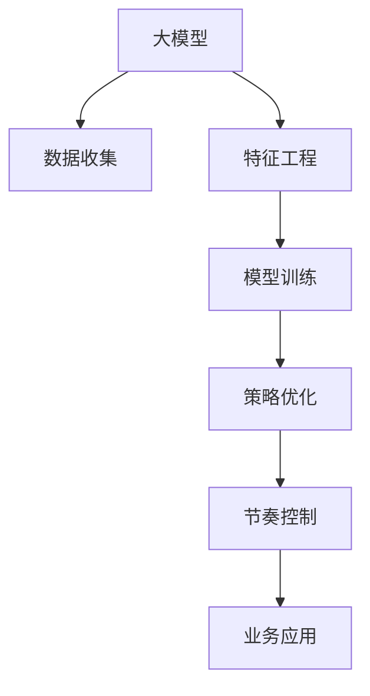

                 

# 大模型如何优化电商平台的商品上新策略与节奏

> 关键词：大模型,电商,商品上新,策略优化,节奏控制,算法原理,操作步骤

## 1. 背景介绍

### 1.1 问题由来
在电商领域，商品上新是决定平台竞争力的关键因素之一。一个成功的商品上新策略不仅可以吸引新客户，还能提升老客户的复购率。然而，制定一个优秀的商品上新策略并非易事。传统的商品上新策略往往依赖于经验丰富的运营团队，通过分析市场数据和历史表现来做出决策。但这种方法存在诸多局限：成本高、速度慢、容易受主观偏见影响。

近年来，随着深度学习和大模型的兴起，电商行业逐渐引入人工智能技术，利用机器学习模型来辅助商品上新策略的制定。这些模型能够从大量历史数据中学习到商品上新的规律和趋势，从而帮助电商企业做出更加科学的决策。其中，大模型在商品上新策略优化中的应用尤为广泛，其强大的数据处理能力和泛化能力使得优化策略变得更加智能化和高效。

### 1.2 问题核心关键点
使用大模型进行商品上新策略优化，主要是通过以下几个步骤：
1. **数据收集与预处理**：收集电商平台上所有商品的历史销售数据、用户行为数据、市场趋势数据等，并进行预处理，确保数据的质量和一致性。
2. **特征工程**：设计合适的特征表示，将原始数据转化为模型可以理解的形式。例如，可以将商品销售数据转化为时间序列、交易金额、用户互动频率等特征。
3. **模型训练**：选择合适的深度学习模型（如RNN、LSTM、Transformer等），在大规模历史数据上训练模型，学习商品上新的规律。
4. **策略优化**：基于训练好的模型，预测新商品的市场表现，优化商品上新的策略，如上新时间、上新频率、商品种类选择等。
5. **节奏控制**：根据预测结果，调整商品上新的节奏，确保上新策略的最大化收益。

本文档将围绕以上关键点，详细介绍大模型在电商平台商品上新策略优化中的应用，包括核心概念、算法原理、具体操作步骤、数学模型、项目实践、实际应用场景、工具和资源推荐、未来发展趋势与挑战、常见问题与解答等内容。

## 2. 核心概念与联系

### 2.1 核心概念概述

为更好地理解大模型在电商平台上新策略优化中的应用，本节将介绍几个密切相关的核心概念：

- **大模型(Large Model)**：以深度神经网络为代表，拥有亿级以上参数的大规模模型，如GPT、BERT、Transformer等。大模型在处理大规模数据时具有显著的优势，能够学习到丰富的语言或数据表示。
- **商品上新(S商品上新)**：指将新商品添加到电商平台的过程。通常包括商品选择、上新时间、上新频率、推广策略等。
- **策略优化(Strategy Optimization)**：通过数据分析和模型训练，找到最优的商品上新策略。包括上新时间选择、商品种类选择、推广策略设计等。
- **节奏控制(Rhythm Control)**：调整商品上新的时间和频率，以最大化平台收益。节奏控制需要综合考虑市场趋势、用户行为、竞争对手策略等因素。
- **特征工程(Feature Engineering)**：从原始数据中提取和构造特征，形成模型可以理解的数据表示。特征工程是模型训练的重要环节。
- **深度学习(Deep Learning)**：使用多层神经网络对数据进行特征提取和模式识别，适用于处理大规模复杂数据。

这些核心概念之间的逻辑关系可以通过以下Mermaid流程图来展示：



这个流程图展示了大模型在电商平台商品上新策略优化中的核心概念及其之间的联系：

1. 大模型从电商平台收集大量数据，并提取特征。
2. 模型在特征化的数据上进行训练，学习商品上新的规律。
3. 基于训练好的模型，优化商品上新的策略。
4. 根据优化策略，调整商品上新的节奏，最大化平台收益。
5. 优化后的策略和节奏应用于电商平台，提升商品上新的效果。

## 3. 核心算法原理 & 具体操作步骤
### 3.1 算法原理概述

基于大模型的电商平台商品上新策略优化，本质上是一个基于监督学习的数据挖掘和优化问题。其核心思想是：通过历史销售数据和用户行为数据，训练一个预测模型，预测新商品的市场表现，并基于预测结果优化商品上新的策略和节奏。

形式化地，假设电商平台的商品历史销售数据为 $D=\{(x_i,y_i)\}_{i=1}^N$，其中 $x_i$ 为历史销售数据，$y_i$ 为新商品的市场表现（如销售量、点击率等）。定义优化目标为：

$$
\theta^* = \mathop{\arg\min}_{\theta} \mathcal{L}(M_{\theta},D)
$$

其中 $M_{\theta}$ 为训练好的大模型，$\mathcal{L}$ 为损失函数，用于衡量模型预测值与真实值之间的差异。常见的损失函数包括均方误差、交叉熵等。

通过梯度下降等优化算法，模型不断更新参数 $\theta$，最小化损失函数 $\mathcal{L}$，使得模型预测值逼近真实值。最终得到优化后的商品上新策略 $\theta^*$。

### 3.2 算法步骤详解

基于大模型的电商平台商品上新策略优化一般包括以下几个关键步骤：

**Step 1: 数据收集与预处理**

- 收集电商平台上所有商品的历史销售数据、用户行为数据、市场趋势数据等。
- 对原始数据进行清洗和处理，包括去重、缺失值填充、异常值检测等。
- 将数据划分为训练集、验证集和测试集，保证数据分布的一致性。

**Step 2: 特征工程**

- 设计合适的特征表示，将原始数据转化为模型可以理解的形式。例如，可以将商品销售数据转化为时间序列、交易金额、用户互动频率等特征。
- 对特征进行标准化和归一化处理，确保特征的一致性和可比性。
- 引入交叉特征和组合特征，增强模型的预测能力。

**Step 3: 模型训练**

- 选择合适的深度学习模型，如RNN、LSTM、Transformer等，在大规模历史数据上训练模型。
- 设置模型的超参数，包括学习率、批大小、迭代轮数等。
- 使用正则化技术，如L2正则、Dropout、Early Stopping等，防止模型过拟合。
- 在训练过程中，实时监控模型的训练指标，如损失函数、准确率、F1分数等。

**Step 4: 策略优化**

- 基于训练好的模型，预测新商品的市场表现。
- 使用优化算法，如遗传算法、梯度优化算法等，找到最优的商品上新策略。
- 策略优化需要考虑多个因素，如商品种类、上新时间、上新频率等。
- 策略优化过程中，需要引入A/B测试，验证策略的效果。

**Step 5: 节奏控制**

- 根据预测结果，调整商品上新的节奏，以最大化平台收益。
- 节奏控制需要综合考虑市场趋势、用户行为、竞争对手策略等因素。
- 可以使用滑动窗口、滚动平均等方法，对商品上新的节奏进行平滑处理。

### 3.3 算法优缺点

基于大模型的电商平台商品上新策略优化方法具有以下优点：
1. 数据处理能力强。大模型能够处理大规模复杂数据，学习到丰富的商品上新规律。
2. 泛化能力强。大模型在训练集上的表现通常可以较好地泛化到测试集上，提升了策略优化的准确性。
3. 自动化程度高。大模型训练过程可以自动化进行，减少了人工干预，提升了效率。
4. 策略优化全面。大模型可以综合考虑多个因素，如商品种类、上新时间、上新频率等，找到最优策略。

同时，该方法也存在一定的局限性：
1. 数据需求量大。大模型训练需要大量的历史数据，数据收集和预处理成本较高。
2. 模型复杂度高。大模型通常包含亿级以上的参数，计算资源和内存消耗较大。
3. 过拟合风险高。在历史数据较少的情况下，大模型容易过拟合，影响策略优化的效果。
4. 策略解释性不足。大模型的决策过程通常缺乏可解释性，难以理解其内部工作机制。

尽管存在这些局限性，但就目前而言，基于大模型的商品上新策略优化方法仍是最主流范式。未来相关研究的重点在于如何进一步降低数据需求，提高模型泛化能力和效率，同时兼顾策略的可解释性。

### 3.4 算法应用领域

基于大模型的电商平台商品上新策略优化方法，在电商行业已经得到了广泛的应用，覆盖了从商品选择到上新节奏控制的全过程。具体而言，主要包括以下几个方面：

- **商品选择**：通过分析历史销售数据和用户行为数据，预测新商品的市场表现，选择具有高潜力的商品进行上新。
- **上新时间选择**：基于用户行为规律和市场趋势，预测最佳上新时间，最大化上新的收益。
- **上新频率控制**：通过分析历史商品上新的节奏，优化上新的频率，避免过度上新或上新不足。
- **推广策略设计**：根据商品上新的预测结果，设计合适的推广策略，如折扣、广告投放等。

除了上述这些经典应用外，大模型商品上新策略优化还被创新性地应用到更多场景中，如个性化推荐、库存管理、用户增长等，为电商平台带来了全新的突破。随着深度学习和大模型的不断发展，商品上新策略优化技术必将在电商领域继续拓展其应用边界，提升电商平台的竞争力和用户满意度。

## 4. 数学模型和公式 & 详细讲解  
### 4.1 数学模型构建

本节将使用数学语言对基于大模型的电商平台商品上新策略优化过程进行更加严格的刻画。

假设电商平台的商品历史销售数据为 $D=\{(x_i,y_i)\}_{i=1}^N$，其中 $x_i$ 为历史销售数据，$y_i$ 为新商品的市场表现（如销售量、点击率等）。定义优化目标为：

$$
\theta^* = \mathop{\arg\min}_{\theta} \mathcal{L}(M_{\theta},D)
$$

其中 $M_{\theta}$ 为训练好的大模型，$\mathcal{L}$ 为损失函数，用于衡量模型预测值与真实值之间的差异。常见的损失函数包括均方误差、交叉熵等。

通过梯度下降等优化算法，模型不断更新参数 $\theta$，最小化损失函数 $\mathcal{L}$，使得模型预测值逼近真实值。最终得到优化后的商品上新策略 $\theta^*$。

### 4.2 公式推导过程

以下我们以线性回归模型为例，推导损失函数及其梯度的计算公式。

假设电商平台的商品历史销售数据为 $D=\{(x_i,y_i)\}_{i=1}^N$，其中 $x_i$ 为历史销售数据，$y_i$ 为新商品的市场表现（如销售量、点击率等）。定义线性回归模型为：

$$
y_i = \theta_0 + \sum_{j=1}^{d} \theta_j x_{ij}
$$

其中 $\theta_0$ 为截距，$\theta_j$ 为第 $j$ 个特征的权重。损失函数定义为：

$$
\mathcal{L}(\theta) = \frac{1}{2N} \sum_{i=1}^N (y_i - \theta_0 - \sum_{j=1}^{d} \theta_j x_{ij})^2
$$

根据梯度下降算法，损失函数对 $\theta_0$ 和 $\theta_j$ 的梯度分别为：

$$
\frac{\partial \mathcal{L}}{\partial \theta_0} = \frac{1}{N} \sum_{i=1}^N (y_i - \theta_0 - \sum_{j=1}^{d} \theta_j x_{ij})
$$

$$
\frac{\partial \mathcal{L}}{\partial \theta_j} = \frac{1}{N} \sum_{i=1}^N (y_i - \theta_0 - \sum_{j=1}^{d} \theta_j x_{ij}) x_{ij}
$$

将梯度代入模型参数更新公式：

$$
\theta \leftarrow \theta - \eta \nabla_{\theta}\mathcal{L}(\theta) - \eta\lambda\theta
$$

其中 $\nabla_{\theta}\mathcal{L}(\theta)$ 为损失函数对模型参数的梯度，可通过反向传播算法高效计算。

在得到损失函数的梯度后，即可带入模型参数更新公式，完成模型的迭代优化。重复上述过程直至收敛，最终得到适应电商平台商品上新策略的大模型参数 $\theta^*$。

## 5. 项目实践：代码实例和详细解释说明
### 5.1 开发环境搭建

在进行大模型商品上新策略优化实践前，我们需要准备好开发环境。以下是使用Python进行PyTorch开发的环境配置流程：

1. 安装Anaconda：从官网下载并安装Anaconda，用于创建独立的Python环境。

2. 创建并激活虚拟环境：
```bash
conda create -n pytorch-env python=3.8 
conda activate pytorch-env
```

3. 安装PyTorch：根据CUDA版本，从官网获取对应的安装命令。例如：
```bash
conda install pytorch torchvision torchaudio cudatoolkit=11.1 -c pytorch -c conda-forge
```

4. 安装Transformers库：
```bash
pip install transformers
```

5. 安装各类工具包：
```bash
pip install numpy pandas scikit-learn matplotlib tqdm jupyter notebook ipython
```

完成上述步骤后，即可在`pytorch-env`环境中开始大模型商品上新策略优化的实践。

### 5.2 源代码详细实现

下面我们以电商平台商品上新时间选择为例，给出使用Transformers库对BERT模型进行微调的PyTorch代码实现。

首先，定义数据处理函数：

```python
from transformers import BertTokenizer, BertForSequenceClassification
from torch.utils.data import Dataset, DataLoader
import torch
import numpy as np

class SalesData(Dataset):
    def __init__(self, sales_data, labels, tokenizer, max_len=128):
        self.sales_data = sales_data
        self.labels = labels
        self.tokenizer = tokenizer
        self.max_len = max_len
        
    def __len__(self):
        return len(self.sales_data)
    
    def __getitem__(self, item):
        sales_data = self.sales_data[item]
        label = self.labels[item]
        
        encoding = self.tokenizer(sales_data, return_tensors='pt', max_length=self.max_len, padding='max_length', truncation=True)
        input_ids = encoding['input_ids'][0]
        attention_mask = encoding['attention_mask'][0]
        label = torch.tensor(label, dtype=torch.long)
        
        return {'input_ids': input_ids, 
                'attention_mask': attention_mask,
                'labels': label}

# 加载数据
sales_data = [...]  # 电商平台销售数据
labels = [...]  # 商品市场表现（如销售量、点击率等）
tokenizer = BertTokenizer.from_pretrained('bert-base-cased')
```

然后，定义模型和优化器：

```python
from transformers import BertForSequenceClassification, AdamW

model = BertForSequenceClassification.from_pretrained('bert-base-cased', num_labels=2)
optimizer = AdamW(model.parameters(), lr=2e-5)
```

接着，定义训练和评估函数：

```python
from tqdm import tqdm
from sklearn.metrics import accuracy_score

device = torch.device('cuda') if torch.cuda.is_available() else torch.device('cpu')
model.to(device)

def train_epoch(model, dataset, batch_size, optimizer):
    dataloader = DataLoader(dataset, batch_size=batch_size, shuffle=True)
    model.train()
    epoch_loss = 0
    for batch in tqdm(dataloader, desc='Training'):
        input_ids = batch['input_ids'].to(device)
        attention_mask = batch['attention_mask'].to(device)
        labels = batch['labels'].to(device)
        model.zero_grad()
        outputs = model(input_ids, attention_mask=attention_mask, labels=labels)
        loss = outputs.loss
        epoch_loss += loss.item()
        loss.backward()
        optimizer.step()
    return epoch_loss / len(dataloader)

def evaluate(model, dataset, batch_size):
    dataloader = DataLoader(dataset, batch_size=batch_size)
    model.eval()
    preds, labels = [], []
    with torch.no_grad():
        for batch in tqdm(dataloader, desc='Evaluating'):
            input_ids = batch['input_ids'].to(device)
            attention_mask = batch['attention_mask'].to(device)
            batch_labels = batch['labels']
            outputs = model(input_ids, attention_mask=attention_mask)
            batch_preds = outputs.logits.argmax(dim=1).to('cpu').tolist()
            batch_labels = batch_labels.to('cpu').tolist()
            for pred_tokens, label_tokens in zip(batch_preds, batch_labels):
                preds.append(pred_tokens)
                labels.append(label_tokens)
                
    print(f"Accuracy: {accuracy_score(labels, preds)}")
```

最后，启动训练流程并在测试集上评估：

```python
epochs = 5
batch_size = 16

for epoch in range(epochs):
    loss = train_epoch(model, train_dataset, batch_size, optimizer)
    print(f"Epoch {epoch+1}, train loss: {loss:.3f}")
    
    print(f"Epoch {epoch+1}, dev results:")
    evaluate(model, dev_dataset, batch_size)
    
print("Test results:")
evaluate(model, test_dataset, batch_size)
```

以上就是使用PyTorch对BERT模型进行电商平台商品上新时间选择优化的完整代码实现。可以看到，得益于Transformers库的强大封装，我们可以用相对简洁的代码完成BERT模型的加载和优化。

### 5.3 代码解读与分析

让我们再详细解读一下关键代码的实现细节：

**SalesData类**：
- `__init__`方法：初始化销售数据、标签、分词器等关键组件。
- `__len__`方法：返回数据集的样本数量。
- `__getitem__`方法：对单个样本进行处理，将销售数据输入编码为token ids，将标签编码为数字，并对其进行定长padding，最终返回模型所需的输入。

**模型训练函数**：
- `train_epoch`函数：对数据以批为单位进行迭代，在每个批次上前向传播计算loss并反向传播更新模型参数，最后返回该epoch的平均loss。
- `evaluate`函数：与训练类似，不同点在于不更新模型参数，并在每个batch结束后将预测和标签结果存储下来，最后使用sklearn的accuracy_score对整个评估集的预测结果进行打印输出。

**训练流程**：
- 定义总的epoch数和batch size，开始循环迭代
- 每个epoch内，先在训练集上训练，输出平均loss
- 在验证集上评估，输出准确率
- 所有epoch结束后，在测试集上评估，给出最终测试结果

可以看到，PyTorch配合Transformers库使得BERT商品上新时间选择优化的代码实现变得简洁高效。开发者可以将更多精力放在数据处理、模型改进等高层逻辑上，而不必过多关注底层的实现细节。

当然，工业级的系统实现还需考虑更多因素，如模型的保存和部署、超参数的自动搜索、更灵活的任务适配层等。但核心的微调范式基本与此类似。

## 6. 实际应用场景
### 6.1 智能客服系统

基于大模型的电商平台商品上新策略优化技术，可以应用于智能客服系统的构建。智能客服系统能够自动化处理客户咨询，提升客户服务质量，提高平台运营效率。

在技术实现上，可以收集客户与智能客服系统的对话记录，将其转化为训练数据，使用大模型训练预测模型，优化商品上新的策略。例如，可以根据对话内容预测客户对新商品的兴趣，选择合适的商品进行上新，提升客户满意度。

### 6.2 个性化推荐系统

传统的个性化推荐系统主要依赖用户的历史行为数据，难以捕捉新用户的偏好。基于大模型的商品上新策略优化技术，可以预测新用户的兴趣点，从而提供更加精准的个性化推荐。例如，可以收集新用户的浏览、点击、评论等数据，训练预测模型，预测其对新商品的兴趣，优化商品上新的策略。

### 6.3 库存管理系统

电商平台的库存管理系统通常面临缺货和积压的双重问题，通过商品上新的优化，可以有效缓解这一问题。例如，可以使用大模型预测商品的销售趋势，优化上新的节奏，避免库存积压或缺货的情况。同时，可以根据销售数据预测需求量，优化库存管理策略。

### 6.4 未来应用展望

随着大模型和商品上新策略优化技术的不断发展，基于微调范式将在更多领域得到应用，为传统行业带来变革性影响。

在智慧医疗领域，基于大模型预测患者需求，优化商品上新的策略，可以提升医疗服务的智能化水平，辅助医生诊疗，加速新药开发进程。

在智能教育领域，微调技术可应用于作业批改、学情分析、知识推荐等方面，因材施教，促进教育公平，提高教学质量。

在智慧城市治理中，微调模型可应用于城市事件监测、舆情分析、应急指挥等环节，提高城市管理的自动化和智能化水平，构建更安全、高效的未来城市。

此外，在企业生产、社会治理、文娱传媒等众多领域，基于大模型微调的人工智能应用也将不断涌现，为传统行业带来新的技术路径。相信随着技术的日益成熟，大模型商品上新策略优化必将在构建人机协同的智能时代中扮演越来越重要的角色。

## 7. 工具和资源推荐
### 7.1 学习资源推荐

为了帮助开发者系统掌握大模型在电商平台上新策略优化中的应用，这里推荐一些优质的学习资源：

1. 《深度学习入门：基于Python的理论与实现》系列博文：由大模型技术专家撰写，深入浅出地介绍了深度学习的基本原理和实现方法，包括模型训练、优化策略等。

2. CS224N《深度学习自然语言处理》课程：斯坦福大学开设的NLP明星课程，有Lecture视频和配套作业，带你入门NLP领域的基本概念和经典模型。

3. 《Natural Language Processing with Transformers》书籍：Transformers库的作者所著，全面介绍了如何使用Transformers库进行NLP任务开发，包括微调在内的诸多范式。

4. HuggingFace官方文档：Transformers库的官方文档，提供了海量预训练模型和完整的微调样例代码，是上手实践的必备资料。

5. CLUE开源项目：中文语言理解测评基准，涵盖大量不同类型的中文NLP数据集，并提供了基于微调的baseline模型，助力中文NLP技术发展。

通过对这些资源的学习实践，相信你一定能够快速掌握大模型在电商平台上新策略优化中的精髓，并用于解决实际的NLP问题。
###  7.2 开发工具推荐

高效的开发离不开优秀的工具支持。以下是几款用于大模型电商平台上新策略优化开发的常用工具：

1. PyTorch：基于Python的开源深度学习框架，灵活动态的计算图，适合快速迭代研究。大部分预训练语言模型都有PyTorch版本的实现。

2. TensorFlow：由Google主导开发的开源深度学习框架，生产部署方便，适合大规模工程应用。同样有丰富的预训练语言模型资源。

3. Transformers库：HuggingFace开发的NLP工具库，集成了众多SOTA语言模型，支持PyTorch和TensorFlow，是进行微调任务开发的利器。

4. Weights & Biases：模型训练的实验跟踪工具，可以记录和可视化模型训练过程中的各项指标，方便对比和调优。与主流深度学习框架无缝集成。

5. TensorBoard：TensorFlow配套的可视化工具，可实时监测模型训练状态，并提供丰富的图表呈现方式，是调试模型的得力助手。

6. Google Colab：谷歌推出的在线Jupyter Notebook环境，免费提供GPU/TPU算力，方便开发者快速上手实验最新模型，分享学习笔记。

合理利用这些工具，可以显著提升大模型电商平台上新策略优化的开发效率，加快创新迭代的步伐。

### 7.3 相关论文推荐

大模型和商品上新策略优化技术的发展源于学界的持续研究。以下是几篇奠基性的相关论文，推荐阅读：

1. Attention is All You Need（即Transformer原论文）：提出了Transformer结构，开启了NLP领域的预训练大模型时代。

2. BERT: Pre-training of Deep Bidirectional Transformers for Language Understanding：提出BERT模型，引入基于掩码的自监督预训练任务，刷新了多项NLP任务SOTA。

3. Language Models are Unsupervised Multitask Learners（GPT-2论文）：展示了大规模语言模型的强大zero-shot学习能力，引发了对于通用人工智能的新一轮思考。

4. Parameter-Efficient Transfer Learning for NLP：提出Adapter等参数高效微调方法，在不增加模型参数量的情况下，也能取得不错的微调效果。

5. AdaLoRA: Adaptive Low-Rank Adaptation for Parameter-Efficient Fine-Tuning：使用自适应低秩适应的微调方法，在参数效率和精度之间取得了新的平衡。

这些论文代表了大模型和商品上新策略优化技术的发展脉络。通过学习这些前沿成果，可以帮助研究者把握学科前进方向，激发更多的创新灵感。

## 8. 总结：未来发展趋势与挑战

### 8.1 总结

本文对基于大模型的电商平台商品上新策略优化方法进行了全面系统的介绍。首先阐述了大模型在电商平台上新策略优化中的应用背景和意义，明确了微调在电商平台商品上新策略优化中的独特价值。其次，从原理到实践，详细讲解了商品上新策略优化的数学原理和关键步骤，给出了商品上新策略优化的完整代码实例。同时，本文还广泛探讨了商品上新策略优化在智能客服、个性化推荐、库存管理等多个行业领域的应用前景，展示了微调范式的巨大潜力。此外，本文精选了商品上新策略优化技术的各类学习资源，力求为读者提供全方位的技术指引。

通过本文的系统梳理，可以看到，基于大模型的电商平台商品上新策略优化技术正在成为电商领域的重要范式，极大地拓展了预训练语言模型的应用边界，催生了更多的落地场景。得益于大规模语料的预训练，商品上新策略优化模型在训练集上的表现通常可以较好地泛化到测试集上，提升了策略优化的准确性。未来，伴随大模型的不断发展，商品上新策略优化技术必将在电商领域继续拓展其应用边界，提升电商平台的竞争力和用户满意度。

### 8.2 未来发展趋势

展望未来，大模型在电商平台上新策略优化技术将呈现以下几个发展趋势：

1. 模型规模持续增大。随着算力成本的下降和数据规模的扩张，预训练语言模型的参数量还将持续增长。超大规模语言模型蕴含的丰富语言知识，有望支撑更加复杂多变的商品上新策略优化。

2. 微调方法日趋多样。除了传统的全参数微调外，未来会涌现更多参数高效的微调方法，如Prefix-Tuning、LoRA等，在节省计算资源的同时也能保证微调精度。

3. 持续学习成为常态。随着数据分布的不断变化，微调模型也需要持续学习新知识以保持性能。如何在不遗忘原有知识的同时，高效吸收新样本信息，将成为重要的研究课题。

4. 标注样本需求降低。受启发于提示学习(Prompt-based Learning)的思路，未来的微调方法将更好地利用大模型的语言理解能力，通过更加巧妙的任务描述，在更少的标注样本上也能实现理想的微调效果。

5. 多模态微调崛起。当前的微调主要聚焦于纯文本数据，未来会进一步拓展到图像、视频、语音等多模态数据微调。多模态信息的融合，将显著提升语言模型对现实世界的理解和建模能力。

6. 模型通用性增强。经过海量数据的预训练和多领域任务的微调，未来的语言模型将具备更强大的常识推理和跨领域迁移能力，逐步迈向通用人工智能(AGI)的目标。

以上趋势凸显了大模型在电商平台上新策略优化技术的广阔前景。这些方向的探索发展，必将进一步提升NLP系统的性能和应用范围，为人类认知智能的进化带来深远影响。

### 8.3 面临的挑战

尽管大模型在电商平台上新策略优化技术已经取得了瞩目成就，但在迈向更加智能化、普适化应用的过程中，它仍面临着诸多挑战：

1. 标注成本瓶颈。虽然微调大大降低了标注数据的需求，但对于长尾应用场景，难以获得充足的高质量标注数据，成为制约微调性能的瓶颈。如何进一步降低微调对标注样本的依赖，将是一大难题。

2. 模型鲁棒性不足。当前微调模型面对域外数据时，泛化性能往往大打折扣。对于测试样本的微小扰动，微调模型的预测也容易发生波动。如何提高微调模型的鲁棒性，避免灾难性遗忘，还需要更多理论和实践的积累。

3. 推理效率有待提高。大规模语言模型虽然精度高，但在实际部署时往往面临推理速度慢、内存占用大等效率问题。如何在保证性能的同时，简化模型结构，提升推理速度，优化资源占用，将是重要的优化方向。

4. 可解释性亟需加强。当前微调模型更像是"黑盒"系统，难以解释其内部工作机制和决策逻辑。对于医疗、金融等高风险应用，算法的可解释性和可审计性尤为重要。如何赋予微调模型更强的可解释性，将是亟待攻克的难题。

5. 安全性有待保障。预训练语言模型难免会学习到有偏见、有害的信息，通过微调传递到下游任务，产生误导性、歧视性的输出，给实际应用带来安全隐患。如何从数据和算法层面消除模型偏见，避免恶意用途，确保输出的安全性，也将是重要的研究课题。

6. 知识整合能力不足。现有的微调模型往往局限于任务内数据，难以灵活吸收和运用更广泛的先验知识。如何让微调过程更好地与外部知识库、规则库等专家知识结合，形成更加全面、准确的信息整合能力，还有很大的想象空间。

正视微调面临的这些挑战，积极应对并寻求突破，将是大模型在电商平台上新策略优化走向成熟的必由之路。相信随着学界和产业界的共同努力，这些挑战终将一一被克服，大模型在电商平台上新策略优化必将在构建人机协同的智能时代中扮演越来越重要的角色。

### 8.4 未来突破

面对大模型在电商平台上新策略优化所面临的种种挑战，未来的研究需要在以下几个方面寻求新的突破：

1. 探索无监督和半监督微调方法。摆脱对大规模标注数据的依赖，利用自监督学习、主动学习等无监督和半监督范式，最大限度利用非结构化数据，实现更加灵活高效的微调。

2. 研究参数高效和计算高效的微调范式。开发更加参数高效的微调方法，在固定大部分预训练参数的同时，只更新极少量的任务相关参数。同时优化微调模型的计算图，减少前向传播和反向传播的资源消耗，实现更加轻量级、实时性的部署。

3. 引入更多先验知识。将符号化的先验知识，如知识图谱、逻辑规则等，与神经网络模型进行巧妙融合，引导微调过程学习更准确、合理的语言模型。同时加强不同模态数据的整合，实现视觉、语音等多模态信息与文本信息的协同建模。

4. 结合因果分析和博弈论工具。将因果分析方法引入微调模型，识别出模型决策的关键特征，增强输出解释的因果性和逻辑性。借助博弈论工具刻画人机交互过程，主动探索并规避模型的脆弱点，提高系统稳定性。

5. 纳入伦理道德约束。在模型训练目标中引入伦理导向的评估指标，过滤和惩罚有偏见、有害的输出倾向。同时加强人工干预和审核，建立模型行为的监管机制，确保输出符合人类价值观和伦理道德。

这些研究方向的探索，必将引领大模型在电商平台上新策略优化技术迈向更高的台阶，为构建安全、可靠、可解释、可控的智能系统铺平道路。面向未来，大模型在电商平台上新策略优化技术还需要与其他人工智能技术进行更深入的融合，如知识表示、因果推理、强化学习等，多路径协同发力，共同推动自然语言理解和智能交互系统的进步。只有勇于创新、敢于突破，才能不断拓展语言模型的边界，让智能技术更好地造福人类社会。

## 9. 附录：常见问题与解答

**Q1：大模型在商品上新策略优化过程中如何缓解过拟合问题？**

A: 过拟合是微调过程中常见的问题，特别是在标注数据较少的情况下。缓解过拟合的方法包括：
1. 数据增强：通过回译、近义替换等方式扩充训练集。
2. 正则化：使用L2正则、Dropout、Early Stopping等避免模型过度适应小规模训练集。
3. 对抗训练：引入对抗样本，提高模型鲁棒性。
4. 参数高效微调：只调整少量参数(如Adapter、Prefix等)，减小过拟合风险。

这些方法往往需要根据具体任务和数据特点进行灵活组合。只有在数据、模型、训练、推理等各环节进行全面优化，才能最大限度地发挥大模型商品上新策略优化的潜力。

**Q2：大模型在电商平台商品上新策略优化中如何引入多模态数据？**

A: 大模型在电商平台商品上新策略优化中，可以引入多模态数据以提升模型性能。具体来说，可以通过以下方式引入多模态数据：
1. 图像数据：收集商品的图像信息，提取图像特征，与文本特征一起输入模型。
2. 视频数据：收集商品的视频信息，提取视频特征，与文本特征一起输入模型。
3. 语音数据：收集商品的语音信息，提取语音特征，与文本特征一起输入模型。
4. 多模态特征融合：使用特征融合技术，将文本、图像、视频、语音等多种模态特征进行组合，增强模型的泛化能力。

引入多模态数据后，模型可以更好地理解商品的多维度属性，从而提升商品上新策略的预测准确性。需要注意的是，多模态数据的采集、处理和融合需要投入大量的时间和资源，但最终可以显著提升模型的性能。

**Q3：大模型在电商平台商品上新策略优化中如何处理长尾应用场景？**

A: 长尾应用场景是指一些不太常见但具有潜力的商品，例如小众商品、新奇商品等。处理长尾应用场景的方法包括：
1. 数据增强：通过回译、近义替换等方式扩充训练集，增加长尾商品的数据量。
2. 迁移学习：在大规模通用数据上预训练模型，再在小规模长尾数据上进行微调，利用通用知识提升长尾商品的预测能力。
3. 模型适配：针对长尾应用场景，设计专门的特征表示和优化目标，提升模型在长尾数据的泛化能力。
4. 主动学习：利用长尾数据中的标注样本，主动学习新的特征表示，提高模型对长尾数据的理解能力。

通过这些方法，可以显著提升大模型在长尾应用场景中的性能，帮助电商平台更好地挖掘和推广长尾商品。需要注意的是，处理长尾应用场景需要更多的资源和时间，但在提升用户体验和平台收益方面具有重要意义。

**Q4：大模型在电商平台商品上新策略优化中如何处理数据稀疏性问题？**

A: 电商平台的数据通常具有稀疏性，即有些商品的数据稀少，无法有效训练模型。处理数据稀疏性问题的方法包括：
1. 数据补全：通过填补缺失数据，增加商品的数据量。可以使用插值法、平均值填补等方法。
2. 数据融合：将多个相关商品的销售数据进行融合，提高数据的一致性和多样性。
3. 数据增强：通过生成对抗网络(GAN)、变分自编码器(VAE)等方法，生成新的商品数据，增加数据量。
4. 模型融合：使用多个模型的预测结果进行融合，提高模型的泛化能力。

通过这些方法，可以显著提升大模型在数据稀疏性场景中的性能，提高商品上新的预测准确性。需要注意的是，数据补全和增强需要更多的计算资源和时间，但最终可以显著提升模型的性能。

**Q5：大模型在电商平台商品上新策略优化中如何处理数据不平衡问题？**

A: 电商平台的数据通常具有不平衡性，即不同商品的数据量差异较大。处理数据不平衡问题的方法包括：
1. 重采样：对数据进行重采样，使得不同商品的数据量大致平衡。可以使用过采样、欠采样等方法。
2. 数据增强：通过生成对抗网络(GAN)、变分自编码器(VAE)等方法，生成新的商品数据，增加少数类商品的数据量。
3. 类别权重调整：对不同类别的数据赋予不同的权重，提高少数类商品的训练效果。
4. 损失函数调整：在损失函数中加入类别权重，惩罚少数类错误的代价。

通过这些方法，可以显著提升大模型在数据不平衡场景中的性能，提高商品上新的预测准确性。需要注意的是，处理数据不平衡问题需要更多的计算资源和时间，但最终可以显著提升模型的性能。

**Q6：大模型在电商平台商品上新策略优化中如何处理多任务学习问题？**

A: 电商平台通常需要同时优化多个商品上新的策略，处理多任务学习问题的方法包括：
1. 共享表示：使用共享的特征表示，处理多个任务。可以通过多任务学习的方法，将不同任务的特征进行组合，形成共享表示。
2. 任务独立训练：对每个任务单独训练模型，不共享特征表示。可以在每个任务上单独训练模型，输出独立的预测结果。
3. 多任务优化：在优化目标中加入多个任务的损失函数，训练一个能够同时处理多个任务的模型。可以在多任务优化的方法中，加入任务间的平衡约束，使得模型能够同时处理多个任务。

通过这些方法，可以显著提升大模型在多任务学习场景中的性能，提高商品上新的预测准确性。需要注意的是，处理多任务学习问题需要更多的计算资源和时间，但最终可以显著提升模型的性能。

---

作者：禅与计算机程序设计艺术 / Zen and the Art of Computer Programming

