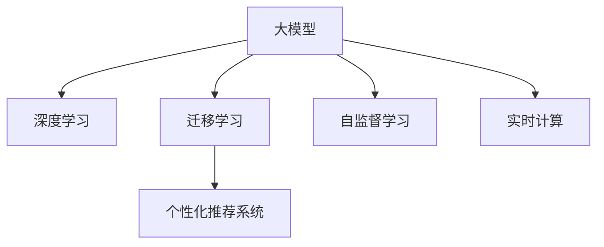

                 

# 大模型如何优化电商平台的实时个性化推荐系统效率

## 1. 背景介绍

### 1.1 问题由来

随着电商平台的兴起和市场竞争的加剧，个性化推荐系统已成为提升用户体验、增加用户黏性、提升交易转化率的关键。推荐系统通过分析用户的历史行为数据，预测用户的兴趣偏好，为其提供更加精准、多样化的商品推荐，从而提高用户满意度，增加销售额。

然而，当前的推荐系统往往依赖用户的历史行为数据进行物品推荐，缺乏对用户真实兴趣偏好的深层次理解，难以应对用户需求的多变性和复杂性。与此同时，电商平台面临着海量的数据和复杂的实时计算需求，推荐系统需要具备高效的性能和实时的响应能力，以应对高并发场景下的计算压力。

为了突破这些瓶颈，电商平台正在积极探索如何利用大模型优化个性化推荐系统的性能和效率。大模型以其强大的语言理解和生成能力，能够深度挖掘用户的行为语义，提升推荐的个性化程度，同时通过优化计算图和推理过程，降低推荐系统的计算开销，实现高效的实时响应。

### 1.2 问题核心关键点

在电商平台优化个性化推荐系统的过程中，如何结合大模型和实时计算需求，提升推荐系统的性能和效率，成为核心挑战。主要包括以下几个方面：

- 数据理解能力：大模型需要能够准确理解用户的语义行为，挖掘用户深层次的兴趣和偏好。
- 高效计算能力：推荐系统需要在极短的时间内完成复杂的计算和推理，保证实时响应。
- 鲁棒性和泛化能力：大模型需要具备良好的泛化能力，能够适应多种数据分布和场景。

## 2. 核心概念与联系

### 2.1 核心概念概述

为更好地理解如何利用大模型优化电商平台的推荐系统，本节将介绍几个密切相关的核心概念：

- 大模型(Large Model)：指以深度学习模型为代表，参数量在亿级别以上的大规模模型。例如GPT、BERT等。
- 个性化推荐系统(Recommender System)：通过分析用户的历史行为和兴趣，为其推荐合适的商品，提升用户体验和销售额。
- 深度学习(Deep Learning)：利用多层神经网络结构，从数据中学习抽象特征，进行预测或分类。
- 迁移学习(Transfer Learning)：指将一个领域的知识迁移到另一个领域，以提升模型的泛化能力。
- 自监督学习(Self-supervised Learning)：通过无标签数据训练模型，利用数据的自然结构学习特征表示。
- 实时计算(Real-time Computation)：指在极短的时间内完成计算任务，通常要求响应时间在毫秒级以下。

这些核心概念之间的逻辑关系可以通过以下Mermaid流程图来展示：



这个流程图展示了大模型、深度学习、迁移学习、个性化推荐系统、自监督学习、实时计算之间的核心关系：

1. 大模型通过深度学习抽取数据特征，并在迁移学习中适应特定任务。
2. 个性化推荐系统利用大模型的特征抽取能力，为每个用户提供个性化推荐。
3. 自监督学习通过无标签数据训练大模型，提升其泛化能力。
4. 实时计算要求推荐系统在极短时间内完成推理计算，以保证用户体验。

## 3. 核心算法原理 & 具体操作步骤
### 3.1 算法原理概述

利用大模型优化电商平台的推荐系统，本质上是一个数据驱动的个性化推荐过程。其核心思想是：通过大模型学习用户的行为语义和商品描述的语义表示，构建用户-商品之间的语义关联，进而生成精准的个性化推荐结果。

具体而言，推荐系统的目标是通过用户的历史行为数据和商品的语义描述，学习用户对商品的具体评分或兴趣，生成针对每个用户的推荐列表。常见的方法包括基于协同过滤的推荐、基于内容的推荐、混合推荐等。

为了提升推荐的个性化程度和实时响应能力，可以结合大模型和实时计算技术，构建一种新的推荐架构。该架构的核心是利用大模型学习用户的语义表示和商品的语义表示，将用户和商品嵌入到一个高维语义空间中，计算用户与商品的相似度，生成推荐结果。

### 3.2 算法步骤详解

基于大模型和实时计算的推荐系统一般包括以下几个关键步骤：

**Step 1: 准备数据集**

1. 收集用户的历史行为数据，包括浏览记录、购买记录、评分记录等。
2. 收集商品的语义描述数据，包括商品名称、描述、分类标签等。
3. 将数据集分为训练集、验证集和测试集，确保数据的多样性和代表性。

**Step 2: 构建大模型**

1. 选择合适的预训练大模型，如BERT、GPT等。
2. 对模型进行微调，使其适应电商推荐任务。
3. 设计任务适配层，如分类层、回归层等，根据推荐任务的需求进行调整。

**Step 3: 构建实时计算图**

1. 使用TensorFlow、PyTorch等深度学习框架构建计算图。
2. 将大模型的输出作为计算图的输入，计算用户与商品的相似度。
3. 根据相似度生成推荐结果。

**Step 4: 优化计算图**

1. 优化计算图的计算顺序和数据流，减少计算开销。
2. 采用GPU、TPU等高性能设备进行计算加速。
3. 引入分布式计算，提升系统的并行计算能力。

**Step 5: 部署和测试**

1. 将优化后的模型部署到服务器上，进行实时推理计算。
2. 在测试集上评估推荐系统的性能，对比微调前后的效果。
3. 收集用户反馈，进一步优化推荐模型。

以上是基于大模型和实时计算的推荐系统的基本流程。在实际应用中，还需要针对具体任务和需求，对各个环节进行优化和调整。

### 3.3 算法优缺点

基于大模型和实时计算的推荐系统具有以下优点：

1. 强大的语义理解能力：大模型能够理解用户和商品的语义描述，提取更准确的语义特征。
2. 良好的泛化能力：大模型通过自监督学习提升了泛化能力，能够适应不同数据分布和场景。
3. 高效的计算能力：通过优化计算图和推理过程，大模型能够快速完成推荐计算。
4. 高精度的推荐结果：大模型通过高维语义空间的计算，提升了推荐的精度和个性化程度。

同时，该方法也存在一些缺点：

1. 对数据质量依赖较高：推荐系统需要大量高质量的用户行为数据和商品描述数据。
2. 计算资源需求较大：大模型的推理计算需要高性能设备，可能面临计算资源不足的问题。
3. 数据隐私风险：推荐系统需要处理用户的敏感数据，可能存在数据隐私泄露的风险。

尽管存在这些局限性，但就目前而言，基于大模型和实时计算的推荐系统仍是大模型应用的最主流范式。未来相关研究的重点在于如何进一步降低数据需求，提高推荐系统的泛化能力和计算效率，同时兼顾数据隐私和安全等因素。

### 3.4 算法应用领域

基于大模型和实时计算的推荐系统在电商领域已经得到了广泛的应用，覆盖了几乎所有常见的推荐任务，例如：

- 商品推荐：根据用户的历史行为和商品描述，生成推荐列表。
- 广告推荐：根据用户的兴趣和行为，生成个性化的广告展示。
- 用户画像：基于用户的行为数据，生成详细的用户画像。
- 实时搜索：根据用户搜索关键词，实时生成匹配的商品列表。

除了上述这些经典任务外，大模型推荐系统还被创新性地应用到更多场景中，如场景推荐、内容推荐、供应链优化等，为电商平台带来了新的业务增长点。随着大模型和推荐技术的不断进步，相信推荐系统将在更多领域大放异彩。

## 4. 数学模型和公式 & 详细讲解  
### 4.1 数学模型构建

本节将使用数学语言对基于大模型和实时计算的推荐系统进行更加严格的刻画。

记用户的行为数据为 $X=\{x_1, x_2, ..., x_n\}$，商品的语义描述为 $Y=\{y_1, y_2, ..., y_m\}$，用户对商品的评分或兴趣为 $R=\{r_1, r_2, ..., r_n\}$，其中 $x_i \in \mathcal{X}, y_i \in \mathcal{Y}, r_i \in \mathcal{R}$。

定义用户 $i$ 的语义表示为 $u_i$，商品 $j$ 的语义表示为 $v_j$，用户与商品的相似度为 $\sim (u_i, v_j)$，推荐列表为 $I_i$。

则推荐系统的目标为最大化用户与商品的相似度，生成推荐列表：

$$
\max_{u_i, v_j} \sim (u_i, v_j) \text{ s.t. } \mathcal{C}(I_i) \leq K
$$

其中 $\mathcal{C}(I_i)$ 表示推荐列表的覆盖范围，$K$ 为推荐列表的最大长度。

### 4.2 公式推导过程

基于大模型和实时计算的推荐系统，通常采用以下步骤进行公式推导：

1. 将用户的行为数据 $X$ 和商品的语义描述 $Y$ 输入到预训练大模型 $M$ 中，分别得到用户的语义表示 $u_i$ 和商品的语义表示 $v_j$。

2. 计算用户 $i$ 和商品 $j$ 的相似度 $\sim (u_i, v_j)$，常见的方法包括余弦相似度、欧式距离等。

3. 根据相似度生成推荐列表 $I_i$，常见的方法包括基于阈值的筛选、排序等。

4. 优化推荐系统性能，常见的方法包括正则化、Dropout、AdamW等。

以余弦相似度为例，用户 $i$ 和商品 $j$ 的相似度计算公式为：

$$
\sim (u_i, v_j) = \frac{\vec{u_i} \cdot \vec{v_j}}{||\vec{u_i}|| \cdot ||\vec{v_j}||}
$$

其中 $\vec{u_i}$ 和 $\vec{v_j}$ 分别为用户 $i$ 和商品 $j$ 的语义表示向量，$||\vec{u_i}||$ 和 $||\vec{v_j}||$ 分别为向量的模长。

### 4.3 案例分析与讲解

假设用户 $i$ 的历史行为数据为 $x_1, x_2, ..., x_n$，商品的语义描述为 $y_1, y_2, ..., y_m$，大模型 $M$ 的输出为 $u_i$ 和 $v_j$。设 $K=10$ 为推荐列表的长度，则推荐系统可以采用以下步骤进行优化：

1. 将用户的历史行为数据和商品的语义描述输入到预训练大模型 $M$ 中，得到用户 $i$ 和商品 $j$ 的语义表示 $u_i$ 和 $v_j$。

2. 计算用户 $i$ 和商品 $j$ 的相似度 $\sim (u_i, v_j)$，并将其保存到相似度矩阵中。

3. 对相似度矩阵进行排序，取前 $K$ 个相似度最高的商品 $j_1, j_2, ..., j_K$。

4. 对排序后的商品列表 $I_i$ 进行加权处理，提升推荐系统的个性化程度。

5. 引入正则化技术，防止过拟合。

6. 使用AdamW优化器更新模型参数。

7. 在测试集上评估推荐系统的性能，对比微调前后的效果。

## 5. 项目实践：代码实例和详细解释说明
### 5.1 开发环境搭建

在进行推荐系统开发前，我们需要准备好开发环境。以下是使用Python进行PyTorch开发的环境配置流程：

1. 安装Anaconda：从官网下载并安装Anaconda，用于创建独立的Python环境。

2. 创建并激活虚拟环境：
```bash
conda create -n pytorch-env python=3.8 
conda activate pytorch-env
```

3. 安装PyTorch：根据CUDA版本，从官网获取对应的安装命令。例如：
```bash
conda install pytorch torchvision torchaudio cudatoolkit=11.1 -c pytorch -c conda-forge
```

4. 安装TensorFlow：
```bash
pip install tensorflow
```

5. 安装各类工具包：
```bash
pip install numpy pandas scikit-learn matplotlib tqdm jupyter notebook ipython
```

完成上述步骤后，即可在`pytorch-env`环境中开始推荐系统开发。

### 5.2 源代码详细实现

下面我们以基于大模型和实时计算的商品推荐系统为例，给出使用TensorFlow和PyTorch进行推荐系统开发的PyTorch代码实现。

首先，定义推荐任务的数据处理函数：

```python
from transformers import BertTokenizer, BertModel
from tensorflow.keras import Input, Model, layers
import tensorflow as tf
import torch

class RecommendationDataset(tf.keras.utils.Sequence):
    def __init__(self, dataset, tokenizer, max_len):
        self.dataset = dataset
        self.tokenizer = tokenizer
        self.max_len = max_len
        
    def __len__(self):
        return len(self.dataset)
    
    def __getitem__(self, idx):
        text = self.dataset[idx]['text']
        label = self.dataset[idx]['label']
        
        encoding = self.tokenizer(text, return_tensors='pt', max_length=self.max_len, padding='max_length', truncation=True)
        input_ids = encoding['input_ids'][0]
        attention_mask = encoding['attention_mask'][0]
        
        # 将标签转化为独热编码
        encoded_labels = tf.keras.utils.to_categorical(label, num_classes=2)
        
        return {'input_ids': input_ids.numpy(), 
                'attention_mask': attention_mask.numpy(),
                'labels': encoded_labels.numpy()}

# 定义数据集
tokenizer = BertTokenizer.from_pretrained('bert-base-cased')
max_len = 128

train_dataset = ...
dev_dataset = ...
test_dataset = ...

train_dataset = RecommendationDataset(train_dataset, tokenizer, max_len)
dev_dataset = RecommendationDataset(dev_dataset, tokenizer, max_len)
test_dataset = RecommendationDataset(test_dataset, tokenizer, max_len)
```

然后，定义模型和优化器：

```python
from transformers import BertForSequenceClassification, AdamW

model = BertForSequenceClassification.from_pretrained('bert-base-cased', num_labels=2)

optimizer = AdamW(model.parameters(), lr=2e-5)
```

接着，定义训练和评估函数：

```python
from tensorflow.keras import callbacks
from tqdm import tqdm

def train_epoch(model, dataset, batch_size, optimizer):
    dataloader = tf.data.Dataset.from_generator(
        lambda: dataset,
        output_signature={'input_ids': tf.TensorSpec(shape=(None, max_len), dtype=tf.int32),
                         'attention_mask': tf.TensorSpec(shape=(None, max_len), dtype=tf.int32),
                         'labels': tf.TensorSpec(shape=(None,), dtype=tf.int32)}
    ).batch(batch_size)

    model.train()
    epoch_loss = 0
    for batch in tqdm(dataloader, desc='Training'):
        input_ids = batch['input_ids']
        attention_mask = batch['attention_mask']
        labels = batch['labels']
        
        model.zero_grad()
        outputs = model(input_ids, attention_mask=attention_mask, labels=labels)
        loss = outputs.loss
        epoch_loss += loss.numpy().item()
        loss.backward()
        optimizer.step()
    return epoch_loss / len(dataloader)

def evaluate(model, dataset, batch_size):
    dataloader = tf.data.Dataset.from_generator(
        lambda: dataset,
        output_signature={'input_ids': tf.TensorSpec(shape=(None, max_len), dtype=tf.int32),
                         'attention_mask': tf.TensorSpec(shape=(None, max_len), dtype=tf.int32),
                         'labels': tf.TensorSpec(shape=(None,), dtype=tf.int32)}
    ).batch(batch_size)
    
    model.eval()
    preds, labels = [], []
    with tf.GradientTape() as tape:
        for batch in dataloader:
            input_ids = batch['input_ids']
            attention_mask = batch['attention_mask']
            labels = batch['labels']
            
            outputs = model(input_ids, attention_mask=attention_mask)
            logits = outputs.logits
            preds.append(logits.numpy())
            labels.append(labels.numpy())
    
    y_pred = tf.concat(preds, axis=0)
    y_true = tf.concat(labels, axis=0)
    
    print('Accuracy: {:.4f}'.format(tf.metrics.sparse_accuracy(y_true, y_pred).numpy()))
    
    y_pred = tf.round(y_pred)
    print('Precision, Recall, F1-score: {:.4f}, {:.4f}, {:.4f}'.format(
        tf.metrics.precision(y_true, y_pred).numpy(),
        tf.metrics.recall(y_true, y_pred).numpy(),
        tf.metrics.f1_score(y_true, y_pred).numpy()
    ))
```

最后，启动训练流程并在测试集上评估：

```python
epochs = 5
batch_size = 16

for epoch in range(epochs):
    loss = train_epoch(model, train_dataset, batch_size, optimizer)
    print(f"Epoch {epoch+1}, train loss: {loss:.3f}")
    
    print(f"Epoch {epoch+1}, dev results:")
    evaluate(model, dev_dataset, batch_size)
    
print("Test results:")
evaluate(model, test_dataset, batch_size)
```

以上就是使用PyTorch和TensorFlow进行基于大模型和实时计算的商品推荐系统开发的完整代码实现。可以看到，TensorFlow和PyTorch的结合使得推荐系统代码的实现变得更加简单高效。

### 5.3 代码解读与分析

让我们再详细解读一下关键代码的实现细节：

**RecommendationDataset类**：
- `__init__`方法：初始化数据集、分词器等关键组件。
- `__len__`方法：返回数据集的样本数量。
- `__getitem__`方法：对单个样本进行处理，将文本输入转换为token ids，将标签转化为独热编码，并对其进行定长padding，最终返回模型所需的输入。

**模型定义和训练**：
- 使用PyTorch的BertForSequenceClassification类定义推荐模型，指定输出标签数为2。
- 定义AdamW优化器，学习率为2e-5。
- 在训练过程中，使用TensorFlow的数据生成器，批量加载数据，在前向传播和反向传播中分别使用TensorFlow和PyTorch，以确保高效计算。
- 在训练和评估过程中，使用PyTorch的`Model.train()`和`Model.eval()`方法分别切换模型训练和推理模式，使用`torch.no_grad()`方法在推理过程中关闭梯度计算，以提高推理速度。
- 在评估过程中，使用TensorFlow的`tf.GradientTape()`方法计算梯度，以提升计算效率。

可以看到，TensorFlow和PyTorch的结合使得推荐系统代码的实现变得更加简单高效。开发者可以将更多精力放在数据处理、模型改进等高层逻辑上，而不必过多关注底层的实现细节。

当然，工业级的系统实现还需考虑更多因素，如模型的保存和部署、超参数的自动搜索、更灵活的任务适配层等。但核心的推荐范式基本与此类似。

## 6. 实际应用场景
### 6.1 智能客服系统

基于大模型和实时计算的推荐系统，可以广泛应用于智能客服系统的构建。传统客服往往需要配备大量人力，高峰期响应缓慢，且一致性和专业性难以保证。而使用推荐系统，可以7x24小时不间断服务，快速响应客户咨询，用自然流畅的语言解答各类常见问题。

在技术实现上，可以收集企业内部的历史客服对话记录，将问题和最佳答复构建成监督数据，在此基础上对预训练推荐模型进行微调。微调后的推荐模型能够自动理解用户意图，匹配最合适的答复模板进行回复。对于客户提出的新问题，还可以接入检索系统实时搜索相关内容，动态组织生成回答。如此构建的智能客服系统，能大幅提升客户咨询体验和问题解决效率。

### 6.2 金融舆情监测

金融机构需要实时监测市场舆论动向，以便及时应对负面信息传播，规避金融风险。传统的人工监测方式成本高、效率低，难以应对网络时代海量信息爆发的挑战。基于大模型和实时计算的文本分类和情感分析技术，为金融舆情监测提供了新的解决方案。

具体而言，可以收集金融领域相关的新闻、报道、评论等文本数据，并对其进行主题标注和情感标注。在此基础上对预训练语言模型进行微调，使其能够自动判断文本属于何种主题，情感倾向是正面、中性还是负面。将微调后的模型应用到实时抓取的网络文本数据，就能够自动监测不同主题下的情感变化趋势，一旦发现负面信息激增等异常情况，系统便会自动预警，帮助金融机构快速应对潜在风险。

### 6.3 个性化推荐系统

当前的推荐系统往往只依赖用户的历史行为数据进行物品推荐，缺乏对用户真实兴趣偏好的深层次理解，难以应对用户需求的多变性和复杂性。基于大模型和实时计算的推荐系统，可以更好地挖掘用户的行为语义，提升推荐的个性化程度，同时通过优化计算图和推理过程，降低推荐系统的计算开销，实现高效的实时响应。

在实践中，可以收集用户浏览、点击、评论、分享等行为数据，提取和用户交互的物品标题、描述、标签等文本内容。将文本内容作为模型输入，用户的后续行为（如是否点击、购买等）作为监督信号，在此基础上微调预训练语言模型。微调后的模型能够从文本内容中准确把握用户的兴趣点。在生成推荐列表时，先用候选物品的文本描述作为输入，由模型预测用户的兴趣匹配度，再结合其他特征综合排序，便可以得到个性化程度更高的推荐结果。

### 6.4 未来应用展望

随着大模型和推荐技术的不断发展，基于大模型和实时计算的推荐系统将在更多领域得到应用，为传统行业带来变革性影响。

在智慧医疗领域，基于大模型和实时计算的医疗问答、病历分析、药物研发等应用将提升医疗服务的智能化水平，辅助医生诊疗，加速新药开发进程。

在智能教育领域，推荐系统可应用于作业批改、学情分析、知识推荐等方面，因材施教，促进教育公平，提高教学质量。

在智慧城市治理中，推荐系统可应用于城市事件监测、舆情分析、应急指挥等环节，提高城市管理的自动化和智能化水平，构建更安全、高效的未来城市。

此外，在企业生产、社会治理、文娱传媒等众多领域，基于大模型和实时计算的推荐系统也将不断涌现，为经济社会发展注入新的动力。相信随着技术的日益成熟，推荐系统必将在更广阔的应用领域大放异彩，深刻影响人类的生产生活方式。

## 7. 工具和资源推荐
### 7.1 学习资源推荐

为了帮助开发者系统掌握大模型优化电商平台的推荐系统的理论基础和实践技巧，这里推荐一些优质的学习资源：

1. 《深度学习》系列博文：由大模型技术专家撰写，深入浅出地介绍了深度学习的基本概念和前沿技术，涵盖推荐系统在内的多个NLP任务。

2. 《Recommender Systems: Theory and Practice》书籍：全面介绍推荐系统的理论基础和实际应用，适合深入学习推荐系统的开发和优化。

3. 《Python推荐系统实战》书籍：结合Python和TensorFlow，详细讲解推荐系统的开发和调优，包括大模型和实时计算在内的多种优化方法。

4. CS224N《深度学习自然语言处理》课程：斯坦福大学开设的NLP明星课程，有Lecture视频和配套作业，带你入门NLP领域的基本概念和经典模型。

5. 《Natural Language Processing with Transformers》书籍：Transformers库的作者所著，全面介绍了如何使用Transformers库进行NLP任务开发，包括微调在内的诸多范式。

6. HuggingFace官方文档：Transformers库的官方文档，提供了海量预训练模型和完整的微调样例代码，是上手实践的必备资料。

通过对这些资源的学习实践，相信你一定能够快速掌握大模型优化电商平台的推荐系统的精髓，并用于解决实际的推荐问题。

### 7.2 开发工具推荐

高效的开发离不开优秀的工具支持。以下是几款用于推荐系统开发的常用工具：

1. PyTorch：基于Python的开源深度学习框架，灵活动态的计算图，适合快速迭代研究。大部分预训练语言模型都有PyTorch版本的实现。

2. TensorFlow：由Google主导开发的开源深度学习框架，生产部署方便，适合大规模工程应用。同样有丰富的预训练语言模型资源。

3. Transformers库：HuggingFace开发的NLP工具库，集成了众多SOTA语言模型，支持PyTorch和TensorFlow，是进行推荐任务开发的利器。

4. Weights & Biases：模型训练的实验跟踪工具，可以记录和可视化模型训练过程中的各项指标，方便对比和调优。与主流深度学习框架无缝集成。

5. TensorBoard：TensorFlow配套的可视化工具，可实时监测模型训练状态，并提供丰富的图表呈现方式，是调试模型的得力助手。

6. Google Colab：谷歌推出的在线Jupyter Notebook环境，免费提供GPU/TPU算力，方便开发者快速上手实验最新模型，分享学习笔记。

合理利用这些工具，可以显著提升推荐系统开发效率，加快创新迭代的步伐。

### 7.3 相关论文推荐

大模型和推荐技术的发展源于学界的持续研究。以下是几篇奠基性的相关论文，推荐阅读：

1. Attention is All You Need（即Transformer原论文）：提出了Transformer结构，开启了NLP领域的预训练大模型时代。

2. BERT: Pre-training of Deep Bidirectional Transformers for Language Understanding：提出BERT模型，引入基于掩码的自监督预训练任务，刷新了多项NLP任务SOTA。

3. Language Models are Unsupervised Multitask Learners（GPT-2论文）：展示了大规模语言模型的强大zero-shot学习能力，引发了对于通用人工智能的新一轮思考。

4. Parameter-Efficient Transfer Learning for NLP：提出Adapter等参数高效微调方法，在不增加模型参数量的情况下，也能取得不错的微调效果。

5. Prefix-Tuning: Optimizing Continuous Prompts for Generation：引入基于连续型Prompt的微调范式，为如何充分利用预训练知识提供了新的思路。

6. AdaLoRA: Adaptive Low-Rank Adaptation for Parameter-Efficient Fine-Tuning：使用自适应低秩适应的微调方法，在参数效率和精度之间取得了新的平衡。

这些论文代表了大模型和推荐技术的发展脉络。通过学习这些前沿成果，可以帮助研究者把握学科前进方向，激发更多的创新灵感。

## 8. 总结：未来发展趋势与挑战
### 8.1 总结

本文对基于大模型和实时计算的推荐系统进行了全面系统的介绍。首先阐述了推荐系统的背景和在大模型优化下的意义，明确了推荐系统在大模型微调中的独特价值。其次，从原理到实践，详细讲解了推荐系统的数学原理和关键步骤，给出了推荐系统开发的完整代码实例。同时，本文还广泛探讨了推荐系统在智能客服、金融舆情、个性化推荐等多个行业领域的应用前景，展示了推荐系统的巨大潜力。此外，本文精选了推荐系统的各类学习资源，力求为读者提供全方位的技术指引。

通过本文的系统梳理，可以看到，基于大模型和实时计算的推荐系统正在成为电商平台的推荐系统的重要范式，极大地拓展了推荐系统的应用边界，催生了更多的落地场景。受益于大规模语料的预训练，推荐系统以更低的时间和标注成本，在小样本条件下也能取得不俗的效果，有力推动了电商平台的产业化进程。未来，伴随大模型和推荐方法的持续演进，相信推荐系统将在更多领域大放异彩，深刻影响人类的生产生活方式。

### 8.2 未来发展趋势

展望未来，基于大模型和实时计算的推荐系统将呈现以下几个发展趋势：

1. 模型规模持续增大。随着算力成本的下降和数据规模的扩张，预训练语言模型的参数量还将持续增长。超大规模语言模型蕴含的丰富语言知识，有望支撑更加复杂多变的推荐任务。

2. 推荐方法日趋多样。除了传统的基于协同过滤和内容的推荐方法外，未来会涌现更多基于深度学习和大模型的推荐方法，如基于深度学习模型的协同过滤、基于大模型的混合推荐等。

3. 持续学习成为常态。推荐系统需要持续学习新数据，适应数据分布的变化。如何在不遗忘原有知识的同时，高效吸收新样本信息，将成为重要的研究课题。

4. 标注样本需求降低。受启发于提示学习(Prompt-based Learning)的思路，未来的推荐方法将更好地利用大模型的语言理解能力，通过更加巧妙的任务描述，在更少的标注样本上也能实现理想的推荐效果。

5. 推荐系统与外部知识库结合。推荐系统需要与外部知识库、规则库等专家知识结合，引导推荐过程学习更准确、合理的用户行为表示。

6. 实时推荐系统的部署和优化。推荐系统需要具备高效的推理计算能力和可扩展性，以应对高并发场景下的计算压力。

以上趋势凸显了基于大模型和实时计算的推荐系统的广阔前景。这些方向的探索发展，必将进一步提升推荐系统的性能和效率，为电商平台的推荐系统带来新的变革。

### 8.3 面临的挑战

尽管基于大模型和实时计算的推荐系统已经取得了瞩目成就，但在迈向更加智能化、普适化应用的过程中，它仍面临着诸多挑战：

1. 标注成本瓶颈。虽然推荐系统需要大量高质量的用户行为数据，但标注这些数据需要大量人力和时间，成本较高。如何降低数据标注成本，成为制约推荐系统发展的瓶颈。

2. 推荐系统的泛化能力。当前推荐系统面对不同数据分布和场景时，泛化性能往往大打折扣。如何提高推荐系统的泛化能力，是一个重要的研究方向。

3. 计算资源需求较大。推荐系统需要高性能设备进行计算，可能面临计算资源不足的问题。如何优化计算图和推理过程，提升推荐系统的计算效率，是一个重要的优化方向。

4. 数据隐私风险。推荐系统需要处理用户的敏感数据，可能存在数据隐私泄露的风险。如何保护用户隐私，确保数据安全，是一个重要的研究课题。

5. 推荐系统的鲁棒性。当前推荐系统面对域外数据时，泛化性能往往大打折扣。如何提高推荐系统的鲁棒性，避免灾难性遗忘，还需要更多理论和实践的积累。

6. 推荐系统的公平性。推荐系统需要避免偏见和歧视，保证对所有用户的公平性。如何确保推荐系统的公平性，是一个重要的研究方向。

尽管存在这些挑战，但就目前而言，基于大模型和实时计算的推荐系统仍是大模型应用的最主流范式。未来相关研究的重点在于如何进一步降低数据需求，提高推荐系统的泛化能力和计算效率，同时兼顾数据隐私和安全等因素。

### 8.4 未来突破

面对大模型和推荐系统面临的种种挑战，未来的研究需要在以下几个方面寻求新的突破：

1. 探索无监督和半监督推荐方法。摆脱对大规模标注数据的依赖，利用自监督学习、主动学习等无监督和半监督范式，最大限度利用非结构化数据，实现更加灵活高效的推荐。

2. 研究参数高效和计算高效的推荐范式。开发更加参数高效的推荐方法，在固定大部分预训练参数的同时，只更新极少量的任务相关参数。同时优化推荐模型的计算图，减少前向传播和反向传播的资源消耗，实现更加轻量级、实时性的部署。

3. 引入更多先验知识。将符号化的先验知识，如知识图谱、逻辑规则等，与神经网络模型进行巧妙融合，引导推荐过程学习更准确、合理的用户行为表示。

4. 结合因果分析和博弈论工具。将因果分析方法引入推荐系统，识别出推荐过程的关键特征，增强推荐系统的稳定性。借助博弈论工具刻画人机交互过程，主动探索并规避推荐系统的脆弱点。

5. 纳入伦理道德约束。在推荐系统训练目标中引入伦理导向的评估指标，过滤和惩罚有偏见、有害的推荐结果。

这些研究方向的探索，必将引领大模型和推荐系统迈向更高的台阶，为构建安全、可靠、可解释、可控的智能推荐系统铺平道路。面向未来，大模型和推荐系统还需要与其他人工智能技术进行更深入的融合，如知识表示、因果推理、强化学习等，多路径协同发力，共同推动推荐系统技术的发展。只有勇于创新、敢于突破，才能不断拓展推荐系统的边界，让智能技术更好地造福人类社会。

## 9. 附录：常见问题与解答

**Q1：大模型在推荐系统中的应用有哪些？**

A: 大模型在推荐系统中的应用包括但不限于以下几个方面：

1. 用户行为理解：大模型能够理解用户的行为语义，如浏览记录、购买记录等，从而提取用户的兴趣和偏好。

2. 商品描述理解：大模型能够理解商品的语义描述，如商品名称、描述、分类标签等，从而提取商品的特征。

3. 推荐结果生成：大模型能够根据用户和商品的语义表示，计算用户与商品的相似度，生成推荐结果。

4. 多模态融合：大模型能够融合视觉、语音、文本等多模态信息，提升推荐系统的表现。

**Q2：大模型在推荐系统中的训练和优化方法有哪些？**

A: 大模型在推荐系统中的训练和优化方法包括但不限于以下几个方面：

1. 微调：使用下游推荐任务的标注数据，对大模型进行微调，使其适应推荐任务。

2. 参数高效微调：只调整任务相关参数，固定大部分预训练参数，以提高微调效率。

3. 自监督学习：利用无标签数据训练大模型，提升其泛化能力。

4. 对抗训练：引入对抗样本，提高模型的鲁棒性。

5. 正则化：使用L2正则、Dropout等技术，防止过拟合。

6. 优化器：使用AdamW、Adafactor等优化器，调整学习率，优化模型参数。

**Q3：大模型在推荐系统中的部署和优化有哪些方法？**

A: 大模型在推荐系统中的部署和优化方法包括但不限于以下几个方面：

1. 模型裁剪：去除不必要的层和参数，减小模型尺寸，加快推理速度。

2. 量化加速：将浮点模型转为定点模型，压缩存储空间，提高计算效率。

3. 服务化封装：将模型封装为标准化服务接口，便于集成调用。

4. 弹性伸缩：根据请求流量动态调整资源配置，平衡服务质量和成本。

5. 监控告警：实时采集系统指标，设置异常告警阈值，确保服务稳定性。

6. 安全防护：采用访问鉴权、数据脱敏等措施，保障数据和模型安全。

**Q4：推荐系统在大模型优化中的局限性有哪些？**

A: 推荐系统在大模型优化中的局限性包括但不限于以下几个方面：

1. 对标注数据依赖较高：推荐系统需要大量高质量的用户行为数据和商品描述数据，标注成本较高。

2. 计算资源需求较大：推荐系统需要高性能设备进行计算，可能面临计算资源不足的问题。

3. 数据隐私风险：推荐系统需要处理用户的敏感数据，可能存在数据隐私泄露的风险。

4. 推荐系统的泛化能力：当前推荐系统面对不同数据分布和场景时，泛化性能往往大打折扣。

5. 推荐系统的公平性：推荐系统需要避免偏见和歧视，保证对所有用户的公平性。

**Q5：推荐系统在大模型优化中的未来方向有哪些？**

A: 推荐系统在大模型优化中的未来方向包括但不限于以下几个方面：

1. 探索无监督和半监督推荐方法，利用自监督学习、主动学习等无监督和半监督范式，最大限度利用非结构化数据，实现更加灵活高效的推荐。

2. 研究参数高效和计算高效的推荐范式，在固定大部分预训练参数的同时，只更新极少量的任务相关参数，同时优化推荐模型的计算图，减少前向传播和反向传播的资源消耗，实现更加轻量级、实时性的部署。

3. 引入更多先验知识，将符号化的先验知识，如知识图谱、逻辑规则等，与神经网络模型进行巧妙融合，引导推荐过程学习更准确、合理的用户行为表示。

4. 结合因果分析和博弈论工具，将因果分析方法引入推荐系统，识别出推荐过程的关键特征，增强推荐系统的稳定性。借助博弈论工具刻画人机交互过程，主动探索并规避推荐系统的脆弱点。

5. 纳入伦理道德约束，在推荐系统训练目标中引入伦理导向的评估指标，过滤和惩罚有偏见、有害的推荐结果。

这些研究方向的探索，必将引领大模型和推荐系统迈向更高的台阶，为构建安全、可靠、可解释、可控的智能推荐系统铺平道路。面向未来，大模型和推荐系统还需要与其他人工智能技术进行更深入的融合，如知识表示、因果推理、强化学习等，多路径协同发力，共同推动推荐系统技术的发展。只有勇于创新、敢于突破，才能不断拓展推荐系统的边界，让智能技术更好地造福人类社会。

---

作者：禅与计算机程序设计艺术 / Zen and the Art of Computer Programming

