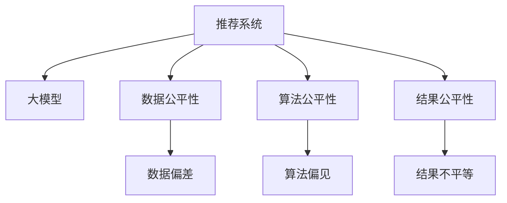

                 

# 大模型对推荐系统公平性的影响研究

在人工智能技术的推动下，推荐系统已成为互联网生态的重要组成部分，广泛应用在电子商务、新闻推荐、音乐推荐、视频推荐等领域。然而，推荐系统算法的公平性问题也逐渐引起关注。尽管现有的研究大多集中在如何提升推荐系统的精度和多样性，但公平性问题尚未得到充分探索。本文将探讨大模型在推荐系统中的公平性问题，研究其影响机理，并提出相应的解决方案。

## 1. 背景介绍

### 1.1 问题由来
随着人工智能技术的不断发展，推荐系统开始采用深度学习、大模型等高级技术。这些技术虽然大幅提升了推荐的精度和效果，但同时也可能引入新的问题。推荐系统在用户数据、兴趣偏好等方面，存在潜在的不公平现象，如性别歧视、年龄歧视、地域歧视等。这些问题不仅影响了用户体验，也可能引发法律和伦理纠纷。

### 1.2 问题核心关键点
推荐系统公平性问题主要集中在以下三个方面：
- **数据公平性**：推荐系统所依据的数据是否公平，即数据是否充分反映不同群体、不同用户的多样性。
- **算法公平性**：推荐算法是否公平，即算法是否对所有用户一视同仁，避免产生偏见。
- **结果公平性**：推荐结果是否公平，即是否对所有用户提供公平的机会。

这些关键点涉及数据、算法和结果三个层次，需要系统地研究，方能提出有效的解决措施。

## 2. 核心概念与联系

### 2.1 核心概念概述

为更好地理解大模型在推荐系统中的公平性问题，本节将介绍几个密切相关的核心概念：

- **推荐系统(Recommendation System)**：通过收集用户行为数据，预测用户偏好，推荐合适的商品、内容或服务的技术。常见的推荐算法包括基于协同过滤、内容基推荐、深度学习推荐等。
- **大模型(Large Model)**：以深度学习框架为代表的，通过海量数据预训练得到的庞大参数模型。典型的如BERT、GPT等。
- **公平性(Fairness)**：推荐系统公平性问题，指算法或结果不应歧视任何用户群体，应提供平等的机会。
- **数据偏差(Data Bias)**：推荐系统数据集存在对某些群体的歧视，导致推荐结果的不公平。
- **算法偏见(Algorithm Bias)**：推荐算法在训练过程中，学习到了某些偏见，产生不公平的结果。
- **结果不平等(Outcome Inequality)**：推荐结果对某些群体不平等，导致用户体验和机会的差异。

这些核心概念之间的逻辑关系可以通过以下Mermaid流程图来展示：



这个流程图展示了大模型在推荐系统中的公平性问题，包括数据、算法和结果三个层次，其核心在于如何平衡和处理这些层次间的公平性。

## 3. 核心算法原理 & 具体操作步骤
### 3.1 算法原理概述

大模型在推荐系统中的应用，本质上是一种基于深度学习的大规模数据驱动技术。其核心思想是：通过预训练得到的基础知识表示，在推荐系统中进行微调，以提升推荐效果。但这种微调过程，也可能引入新的偏见和歧视，产生不公平现象。

具体来说，大模型在推荐系统中的公平性问题主要体现在以下方面：
- **数据偏差**：预训练数据和推荐系统训练数据可能存在差异，导致模型学习到的特征与实际推荐任务不符。
- **算法偏见**：微调过程可能学习到数据中的偏见，导致对某些群体的不公平推荐。
- **结果不平等**：由于算法偏见，导致推荐结果对某些群体的用户不平等。

解决这些问题，需要从数据采集、算法设计和结果评估等多个方面进行综合考虑。

### 3.2 算法步骤详解

基于大模型的推荐系统公平性优化，一般包括以下几个关键步骤：

**Step 1: 数据采集与处理**
- 收集具有代表性的用户数据，尽量消除数据中的群体偏见，确保样本分布均衡。
- 对数据进行清洗和预处理，去除噪声和异常值，保证数据质量。
- 使用数据增强技术，如回译、近义替换等，丰富数据多样性。

**Step 2: 模型微调和公平性约束**
- 选择合适的预训练大模型，将其作为推荐系统的基础模型。
- 设计合适的公平性约束条件，如使用平衡性约束、反偏见约束等，限制模型的输出偏差。
- 在微调过程中，引入公平性约束条件，优化模型参数。

**Step 3: 评估与优化**
- 对推荐系统进行公平性评估，如使用平衡精度(Balanced Accuracy)、AUC公平性(AUC Fairness)等指标。
- 根据评估结果，进一步优化模型和算法，减小偏见和歧视。
- 采用对抗训练、多样性增强等技术，提升推荐系统的公平性。

### 3.3 算法优缺点

基于大模型的推荐系统公平性优化方法，具有以下优点：
1. **高效性**：利用深度学习模型的强大表征能力，可以迅速提升推荐系统的效果。
2. **灵活性**：通过设计公平性约束条件，可以灵活应对不同场景下的公平性问题。
3. **泛化性**：大模型通常具有良好的泛化能力，可以在不同领域和数据集上进行推广。

同时，该方法也存在以下局限性：
1. **数据依赖性**：数据采集和处理需要耗费大量人力物力，且数据质量对模型性能有直接影响。
2. **算法复杂度**：公平性约束条件设计复杂，需要大量实验验证。
3. **模型鲁棒性**：在处理新数据或面对分布变化时，模型鲁棒性可能降低。
4. **隐私风险**：数据采集和处理过程中可能涉及用户隐私，存在一定的隐私风险。

尽管存在这些局限性，但就目前而言，基于大模型的推荐系统公平性优化方法仍是一种高效可行的解决方案。

### 3.4 算法应用领域

基于大模型的推荐系统公平性优化方法，在多个应用领域都有广泛的应用前景，例如：

- **电商推荐**：通过收集用户浏览、购买行为数据，对商品进行推荐。需要在保证推荐精度的同时，避免对某些群体产生歧视。
- **新闻推荐**：对新闻文章进行阅读量和互动量的综合评估，推荐用户感兴趣的新闻内容。需要确保不同群体的用户都能获得公平的推荐机会。
- **视频推荐**：根据用户观看历史和评分，推荐适合的视频内容。需要避免对不同兴趣群体的用户进行歧视性推荐。
- **音乐推荐**：根据用户听歌历史和偏好，推荐新歌曲或歌手。需要确保对不同性别、年龄群体的用户都能提供公平的推荐服务。

除了这些典型场景，基于大模型的推荐系统公平性优化方法，还可以应用于社交网络、智能广告、在线教育等领域，提升用户公平体验，促进社会和谐。

## 4. 数学模型和公式 & 详细讲解 & 举例说明

### 4.1 数学模型构建

本节将使用数学语言对大模型在推荐系统中的公平性优化过程进行更加严格的刻画。

记推荐系统中的用户集合为 $U$，商品集合为 $I$，用户行为数据为 $D=\{(u,i,v)\}_{i=1}^N$，其中 $u$ 表示用户，$i$ 表示商品，$v$ 表示行为（如浏览、购买等）。

定义推荐模型的预测函数为 $f(u, i)$，表示用户 $u$ 对商品 $i$ 的兴趣程度。假设模型为基于大模型的深度神经网络，输出层为 $K$ 维向量，其中 $k$ 维表示商品 $i$ 的兴趣预测。

定义推荐系统的公平性约束条件为 $\mathcal{F} = \{\mathcal{F}_1, \mathcal{F}_2, \ldots, \mathcal{F}_K\}$，其中 $\mathcal{F}_k$ 表示对商品 $i$ 兴趣预测的公平性约束条件。常见的公平性约束条件包括平衡性约束(Balanced Constraint)、反偏见约束(Anti-bias Constraint)等。

### 4.2 公式推导过程

以下我们以平衡性约束为例，推导公平性约束条件下的推荐模型优化公式。

假设用户集合 $U$ 分为 $K$ 个群体 $G_k = \{u \mid f(u, i) \geq \bar{f}_k\}$，其中 $\bar{f}_k$ 为群体 $k$ 的兴趣预测均值。

平衡性约束要求所有群体的用户数量分布均衡，即：

$$
\frac{|G_k|}{|U|} = \bar{p}_k
$$

其中 $\bar{p}_k$ 为群体 $k$ 的期望用户数量。

令 $f_k = \mathbb{E}[f(u, i) \mid u \in G_k]$ 表示群体 $k$ 的兴趣预测均值。则平衡性约束可以表示为：

$$
\mathcal{F}_1: \frac{\sum_{u \in G_k} f(u, i)}{\sum_{u \in U} f(u, i)} = \bar{p}_k
$$

令 $f_{k}^+ = \max_{u \in G_k} f(u, i)$ 和 $f_{k}^- = \min_{u \in G_k} f(u, i)$ 分别为群体 $k$ 的兴趣预测最大值和最小值。则反偏见约束可以表示为：

$$
\mathcal{F}_2: \max(f_{k}^+, f_{k}^-) \leq \bar{f}_k + \Delta_k
$$

其中 $\Delta_k$ 为偏见容忍度，表示模型输出应与真实均值保持一致，不能偏离过大。

在上述公平性约束条件下，推荐模型的优化目标为：

$$
\min_{\theta} \frac{1}{N} \sum_{(u,i,v) \in D} \ell(f(u, i), v) + \lambda \sum_{k=1}^K \gamma_k \|\mathcal{F}_k\|
$$

其中 $\theta$ 为模型参数，$\ell(\cdot)$ 为损失函数，$\gamma_k$ 为公平性约束的权重，$\|\mathcal{F}_k\|$ 表示公平性约束条件 $\mathcal{F}_k$ 的度量，如拉普拉斯距离。

### 4.3 案例分析与讲解

以下我们以新闻推荐系统为例，分析平衡性约束条件的应用：

假设某新闻网站有 $10000$ 个用户，分为男性和女性两个群体，各 $5000$ 个。网站新闻推荐系统对每条新闻进行 $1-5$ 星的评分。希望推荐系统能够对不同性别的用户进行公平推荐，避免性别歧视。

定义新闻推荐模型的预测函数为 $f(u, i)$，表示用户 $u$ 对新闻 $i$ 的评分预测。假设模型为基于大模型的深度神经网络，输出层为 $5$ 维向量，其中 $k$ 维表示新闻 $i$ 的评分预测。

假设模型参数 $\theta$ 已经通过预训练得到。根据用户行为数据 $D=\{(u,i,v)\}_{i=1}^N$，对模型进行微调优化。

在微调过程中，使用平衡性约束条件，要求男女性别用户的推荐新闻评分均值相等。令 $\bar{f}_{男}$ 和 $\bar{f}_{女}$ 分别为男性和女性的新闻评分均值。则平衡性约束条件可以表示为：

$$
\frac{\sum_{u \in 男} f(u, i)}{\sum_{u \in 用户总数} f(u, i)} = \frac{\sum_{u \in 女} f(u, i)}{\sum_{u \in 用户总数} f(u, i)} = \frac{\bar{f}_{男} + \bar{f}_{女}}{2}
$$

利用上述约束条件，对模型进行优化，使得男女用户的推荐新闻评分均值相等。可以使用拉普拉斯距离作为公平性约束条件的度量，即：

$$
\|\mathcal{F}_1\| = \log\sum_{i=1}^N e^{\frac{|f_{男}(u, i) - \bar{f}_{男}|}{\Delta_k} + \frac{|f_{女}(u, i) - \bar{f}_{女}|}{\Delta_k}}
$$

其中 $\Delta_k$ 为预设的偏见容忍度。

最终，通过上述公平性约束条件的优化，可以显著减小推荐系统中的性别歧视问题，提升公平性。

## 5. 项目实践：代码实例和详细解释说明

### 5.1 开发环境搭建

在进行推荐系统公平性优化实践前，我们需要准备好开发环境。以下是使用Python进行PyTorch开发的环境配置流程：

1. 安装Anaconda：从官网下载并安装Anaconda，用于创建独立的Python环境。

2. 创建并激活虚拟环境：
```bash
conda create -n pytorch-env python=3.8 
conda activate pytorch-env
```

3. 安装PyTorch：根据CUDA版本，从官网获取对应的安装命令。例如：
```bash
conda install pytorch torchvision torchaudio cudatoolkit=11.1 -c pytorch -c conda-forge
```

4. 安装Transformers库：
```bash
pip install transformers
```

5. 安装各类工具包：
```bash
pip install numpy pandas scikit-learn matplotlib tqdm jupyter notebook ipython
```

完成上述步骤后，即可在`pytorch-env`环境中开始推荐系统公平性优化的实践。

### 5.2 源代码详细实现

下面我们以新闻推荐系统为例，给出使用Transformers库对BERT模型进行公平性优化的PyTorch代码实现。

首先，定义新闻推荐任务的数据处理函数：

```python
from transformers import BertTokenizer
from torch.utils.data import Dataset
import torch

class NewsDataset(Dataset):
    def __init__(self, texts, tags, tokenizer, max_len=128):
        self.texts = texts
        self.tags = tags
        self.tokenizer = tokenizer
        self.max_len = max_len
        
    def __len__(self):
        return len(self.texts)
    
    def __getitem__(self, item):
        text = self.texts[item]
        tags = self.tags[item]
        
        encoding = self.tokenizer(text, return_tensors='pt', max_length=self.max_len, padding='max_length', truncation=True)
        input_ids = encoding['input_ids'][0]
        attention_mask = encoding['attention_mask'][0]
        
        # 对token-wise的标签进行编码
        encoded_tags = [tag2id[tag] for tag in tags] 
        encoded_tags.extend([tag2id['O']] * (self.max_len - len(encoded_tags)))
        labels = torch.tensor(encoded_tags, dtype=torch.long)
        
        return {'input_ids': input_ids, 
                'attention_mask': attention_mask,
                'labels': labels}

# 标签与id的映射
tag2id = {'O': 0, '正': 1, '负': 2}
id2tag = {v: k for k, v in tag2id.items()}

# 创建dataset
tokenizer = BertTokenizer.from_pretrained('bert-base-cased')

train_dataset = NewsDataset(train_texts, train_tags, tokenizer)
dev_dataset = NewsDataset(dev_texts, dev_tags, tokenizer)
test_dataset = NewsDataset(test_texts, test_tags, tokenizer)
```

然后，定义模型和优化器：

```python
from transformers import BertForTokenClassification, AdamW

model = BertForTokenClassification.from_pretrained('bert-base-cased', num_labels=len(tag2id))

optimizer = AdamW(model.parameters(), lr=2e-5)
```

接着，定义训练和评估函数：

```python
from torch.utils.data import DataLoader
from tqdm import tqdm
from sklearn.metrics import classification_report

device = torch.device('cuda') if torch.cuda.is_available() else torch.device('cpu')
model.to(device)

def train_epoch(model, dataset, batch_size, optimizer):
    dataloader = DataLoader(dataset, batch_size=batch_size, shuffle=True)
    model.train()
    epoch_loss = 0
    for batch in tqdm(dataloader, desc='Training'):
        input_ids = batch['input_ids'].to(device)
        attention_mask = batch['attention_mask'].to(device)
        labels = batch['labels'].to(device)
        model.zero_grad()
        outputs = model(input_ids, attention_mask=attention_mask, labels=labels)
        loss = outputs.loss
        epoch_loss += loss.item()
        loss.backward()
        optimizer.step()
    return epoch_loss / len(dataloader)

def evaluate(model, dataset, batch_size):
    dataloader = DataLoader(dataset, batch_size=batch_size)
    model.eval()
    preds, labels = [], []
    with torch.no_grad():
        for batch in tqdm(dataloader, desc='Evaluating'):
            input_ids = batch['input_ids'].to(device)
            attention_mask = batch['attention_mask'].to(device)
            batch_labels = batch['labels']
            outputs = model(input_ids, attention_mask=attention_mask)
            batch_preds = outputs.logits.argmax(dim=2).to('cpu').tolist()
            batch_labels = batch_labels.to('cpu').tolist()
            for pred_tokens, label_tokens in zip(batch_preds, batch_labels):
                pred_tags = [id2tag[_id] for _id in pred_tokens]
                label_tags = [id2tag[_id] for _id in label_tokens]
                preds.append(pred_tags[:len(label_tokens)])
                labels.append(label_tags)
                
    print(classification_report(labels, preds))
```

最后，启动训练流程并在测试集上评估：

```python
epochs = 5
batch_size = 16

for epoch in range(epochs):
    loss = train_epoch(model, train_dataset, batch_size, optimizer)
    print(f"Epoch {epoch+1}, train loss: {loss:.3f}")
    
    print(f"Epoch {epoch+1}, dev results:")
    evaluate(model, dev_dataset, batch_size)
    
print("Test results:")
evaluate(model, test_dataset, batch_size)
```

以上就是使用PyTorch对BERT进行新闻推荐系统公平性优化的完整代码实现。可以看到，得益于Transformers库的强大封装，我们可以用相对简洁的代码完成BERT模型的加载和公平性优化。

### 5.3 代码解读与分析

让我们再详细解读一下关键代码的实现细节：

**NewsDataset类**：
- `__init__`方法：初始化文本、标签、分词器等关键组件。
- `__len__`方法：返回数据集的样本数量。
- `__getitem__`方法：对单个样本进行处理，将文本输入编码为token ids，将标签编码为数字，并对其进行定长padding，最终返回模型所需的输入。

**tag2id和id2tag字典**：
- 定义了标签与数字id之间的映射关系，用于将token-wise的预测结果解码回真实的标签。

**训练和评估函数**：
- 使用PyTorch的DataLoader对数据集进行批次化加载，供模型训练和推理使用。
- 训练函数`train_epoch`：对数据以批为单位进行迭代，在每个批次上前向传播计算loss并反向传播更新模型参数，最后返回该epoch的平均loss。
- 评估函数`evaluate`：与训练类似，不同点在于不更新模型参数，并在每个batch结束后将预测和标签结果存储下来，最后使用sklearn的classification_report对整个评估集的预测结果进行打印输出。

**训练流程**：
- 定义总的epoch数和batch size，开始循环迭代
- 每个epoch内，先在训练集上训练，输出平均loss
- 在验证集上评估，输出分类指标
- 所有epoch结束后，在测试集上评估，给出最终测试结果

可以看到，PyTorch配合Transformers库使得BERT微调的代码实现变得简洁高效。开发者可以将更多精力放在数据处理、模型改进等高层逻辑上，而不必过多关注底层的实现细节。

当然，工业级的系统实现还需考虑更多因素，如模型的保存和部署、超参数的自动搜索、更灵活的任务适配层等。但核心的公平性优化范式基本与此类似。

## 6. 实际应用场景
### 6.1 智能广告推荐

智能广告推荐系统可以基于用户的搜索行为、浏览历史等数据，精准推荐用户感兴趣的广告内容。然而，在广告推荐过程中，存在潜在的性别、年龄、地域等歧视问题，影响用户体验。

通过大模型的公平性优化，广告推荐系统可以更好地识别不同群体的用户兴趣，避免歧视性推荐。例如，在广告推荐模型中，可以通过平衡性约束条件，确保不同性别、年龄段的用户都能获得公平的广告展示机会。

### 6.2 在线教育推荐

在线教育推荐系统根据学生的学习行为数据，推荐合适的课程和学习资源。然而，该系统也可能存在对某些群体（如年龄、地域）的歧视，影响教育公平性。

利用大模型的公平性优化技术，在线教育推荐系统可以确保不同群体的学生都能获得公平的学习资源推荐。例如，在课程推荐模型中，通过设计平衡性约束条件，确保不同地域、年龄段的学生都能获得公平的学习推荐。

### 6.3 社交网络推荐

社交网络推荐系统基于用户的朋友关系、互动历史等数据，推荐用户感兴趣的内容和好友。然而，该系统也可能存在对某些群体的歧视，如对某些地域、群体的用户推荐不平等。

通过大模型的公平性优化，社交网络推荐系统可以更好地识别不同群体的用户兴趣，避免歧视性推荐。例如，在好友推荐模型中，通过设计平衡性约束条件，确保不同地域、群体的用户都能获得公平的好友推荐。

### 6.4 未来应用展望

随着大语言模型微调技术的发展，基于大模型的推荐系统公平性优化也将面临更多挑战和机遇。

在智慧医疗领域，通过公平性优化，推荐系统可以为不同性别、年龄、地域的用户推荐合适的医疗信息，促进医疗公平。

在智能教育领域，公平性优化技术可以提升不同群体学生的学习效果，缩小教育差距。

在智慧城市治理中，公平性优化推荐系统可以提升不同群体用户的城市服务体验，构建和谐宜居的智能城市。

此外，在企业生产、社会治理、文娱传媒等众多领域，基于大模型的推荐系统公平性优化技术也将不断涌现，为社会公正注入新的动力。相信随着技术的日益成熟，推荐系统公平性优化必将成为人工智能应用的重要组成部分，推动社会公平进步。

## 7. 工具和资源推荐
### 7.1 学习资源推荐

为了帮助开发者系统掌握大模型在推荐系统中的公平性优化理论基础和实践技巧，这里推荐一些优质的学习资源：

1. 《推荐系统设计与评价》系列博文：由深度学习专家撰写，系统介绍了推荐系统基础、公平性问题、优化算法等前沿话题。

2. 《Recommender Systems: Algorithms, Implementation, and Challenges》书籍：该书涵盖了推荐系统的基础、算法、实现和挑战，是推荐系统学习的经典教材。

3. 《Fairness in Machine Learning》课程：由斯坦福大学开设的机器学习公平性课程，涵盖公平性理论、算法和实践，是了解推荐系统公平性的重要资源。

4. 《Bias and Fairness in Recommendation Systems》论文：该论文系统介绍了推荐系统中的偏见和公平性问题，并提出了具体的解决策略。

5. 《Learning and Privacy》书籍：该书介绍了机器学习中的隐私保护和公平性问题，对推荐系统公平性优化有深刻的理论指导。

通过对这些资源的学习实践，相信你一定能够快速掌握大模型在推荐系统中的公平性优化的精髓，并用于解决实际的推荐系统问题。

### 7.2 开发工具推荐

高效的开发离不开优秀的工具支持。以下是几款用于推荐系统公平性优化的常用工具：

1. PyTorch：基于Python的开源深度学习框架，灵活动态的计算图，适合快速迭代研究。

2. TensorFlow：由Google主导开发的开源深度学习框架，生产部署方便，适合大规模工程应用。

3. Transformers库：HuggingFace开发的NLP工具库，集成了众多SOTA语言模型，支持PyTorch和TensorFlow，是进行公平性优化的利器。

4. Weights & Biases：模型训练的实验跟踪工具，可以记录和可视化模型训练过程中的各项指标，方便对比和调优。

5. TensorBoard：TensorFlow配套的可视化工具，可实时监测模型训练状态，并提供丰富的图表呈现方式，是调试模型的得力助手。

6. Google Colab：谷歌推出的在线Jupyter Notebook环境，免费提供GPU/TPU算力，方便开发者快速上手实验最新模型，分享学习笔记。

合理利用这些工具，可以显著提升大模型在推荐系统中的公平性优化任务的开发效率，加快创新迭代的步伐。

### 7.3 相关论文推荐

大模型在推荐系统中的公平性优化技术的发展源于学界的持续研究。以下是几篇奠基性的相关论文，推荐阅读：

1. Fairness in Recommendation Systems: Principles and Recommendation Algorithms（一文综述了推荐系统中的公平性问题及其解决策略）

2. Fairness in Recommendation Systems: An Overview and Challenges（一文概述了推荐系统中的公平性问题及其挑战）

3. Recommendation Fairness: A Survey and Future Directions（一文综述了推荐系统中的公平性问题及其未来方向）

4. Fair Recommendation Algorithms: A Survey（一文综述了推荐系统中的公平性问题及其算法）

5. Fairness-Aware Recommender Systems: A Survey and Future Directions（一文综述了推荐系统中的公平性问题及其未来方向）

这些论文代表了大模型在推荐系统中的公平性优化技术的发展脉络。通过学习这些前沿成果，可以帮助研究者把握学科前进方向，激发更多的创新灵感。

## 8. 总结：未来发展趋势与挑战

### 8.1 总结

本文对基于大模型的推荐系统公平性问题进行了全面系统的介绍。首先阐述了大模型在推荐系统中的应用背景和意义，明确了推荐系统公平性问题的核心关键点。其次，从原理到实践，详细讲解了大模型在推荐系统中的公平性优化过程，给出了公平性优化任务开发的完整代码实例。同时，本文还广泛探讨了大模型在推荐系统中的公平性优化方法在多个行业领域的应用前景，展示了公平性优化的巨大潜力。此外，本文精选了公平性优化技术的各类学习资源，力求为读者提供全方位的技术指引。

通过本文的系统梳理，可以看到，基于大模型的推荐系统公平性优化技术正在成为推荐系统的重要范式，极大地提升了推荐系统的公平性水平，为不同群体的用户提供了平等的机会。未来，伴随公平性优化方法的持续演进，推荐系统必将进入更加公平、普适的新时代。

### 8.2 未来发展趋势

展望未来，大模型在推荐系统中的公平性优化技术将呈现以下几个发展趋势：

1. **数据获取的均衡性**：推荐系统公平性优化技术将更加关注数据获取的均衡性，确保数据集能够充分反映不同群体的多样性。

2. **算法设计的公平性**：推荐系统公平性优化算法将更加注重算法设计的公平性，引入更多的公平性约束条件，提升算法鲁棒性。

3. **结果评价的多样性**：推荐系统公平性优化结果评价将更加多样，除了传统的多样性指标，还将引入更多公平性指标，如平衡精度、AUC公平性等。

4. **个性化推荐的多样性**：推荐系统公平性优化技术将更加注重个性化推荐的多样性，确保不同群体的用户都能获得满意的推荐结果。

5. **动态推荐系统的公平性**：推荐系统公平性优化技术将更加注重动态推荐系统的公平性，确保推荐结果随时间变化依然公平。

6. **跨平台推荐系统的公平性**：推荐系统公平性优化技术将更加注重跨平台推荐系统的公平性，确保不同平台上的推荐结果公平。

以上趋势凸显了大模型在推荐系统中的公平性优化技术的广阔前景。这些方向的探索发展，必将进一步提升推荐系统的公平性水平，为不同群体的用户提供更加公平的推荐服务。

### 8.3 面临的挑战

尽管大模型在推荐系统中的公平性优化技术已经取得了瞩目成就，但在迈向更加智能化、普适化应用的过程中，它仍面临着诸多挑战：

1. **数据获取难度**：获取具有代表性、无偏见的数据是公平性优化的前提，但数据获取难度大，需要耗费大量人力物力。

2. **数据处理复杂性**：数据处理过程中，需要消除噪声和异常值，确保数据质量，但处理复杂性高，容易引入新的偏差。

3. **算法复杂度**：公平性优化算法设计复杂，需要大量实验验证，且在面对新数据或分布变化时，鲁棒性可能降低。

4. **隐私保护难度**：数据处理过程中可能涉及用户隐私，需要严格保护，但隐私保护难度大，容易引发法律和伦理问题。

5. **结果可解释性不足**：公平性优化模型的决策过程缺乏可解释性，难以对其内部机制进行分析和调试。

6. **公平性标准不一**：不同群体对公平性的理解和期望不同，难以制定统一的公平性标准，需要灵活调整。

尽管存在这些挑战，但就目前而言，大模型在推荐系统中的公平性优化技术仍是一种高效可行的解决方案。

### 8.4 研究展望

面对大模型在推荐系统中的公平性优化所面临的挑战，未来的研究需要在以下几个方面寻求新的突破：

1. **自动化数据采集与处理**：利用自动化数据采集和处理技术，降低数据获取和处理成本，提升数据质量。

2. **公平性优化算法的简化**：设计更加简化、高效的公平性优化算法，降低算法复杂度，提升模型鲁棒性。

3. **公平性约束条件的扩展**：引入更多公平性约束条件，如多样性约束、隐私保护约束等，提升模型公平性。

4. **公平性优化模型的可解释性增强**：引入可解释性技术，如因果推断、对比学习等，增强模型的可解释性，提高决策过程的透明性。

5. **跨平台推荐系统的公平性优化**：设计跨平台推荐系统公平性优化技术，确保不同平台上的推荐结果公平。

6. **推荐系统公平性优化标准的制定**：制定统一的推荐系统公平性优化标准，确保不同平台和应用场景的公平性一致。

这些研究方向的探索，必将引领大模型在推荐系统中的公平性优化技术迈向更高的台阶，为构建公平、普适的推荐系统提供新的方向和思路。面向未来，大模型在推荐系统中的公平性优化技术还需要与其他人工智能技术进行更深入的融合，如知识表示、因果推理、强化学习等，多路径协同发力，共同推动推荐系统公平性优化技术的发展。只有勇于创新、敢于突破，才能不断拓展语言模型的边界，让智能技术更好地造福人类社会。

## 9. 附录：常见问题与解答

**Q1：推荐系统公平性问题是否只涉及数据偏见？**

A: 推荐系统公平性问题不仅涉及数据偏见，还包括算法偏见和结果不平等。数据偏见指数据本身存在对某些群体的歧视，导致模型学习到的特征与实际推荐任务不符。算法偏见指模型在训练过程中学习到了数据中的偏见，导致对某些群体的不公平推荐。结果不平等指由于算法偏见，导致推荐结果对某些群体的用户不平等。

**Q2：如何判断推荐系统中的公平性问题？**

A: 推荐系统中的公平性问题通常通过公平性指标来衡量。常见的公平性指标包括平衡精度(Balanced Accuracy)、AUC公平性(AUC Fairness)、平均绝对误差(MAE)等。这些指标可以帮助评估推荐系统在不同群体中的推荐效果是否公平。此外，还可以使用可视化工具，如公平性矩阵、公平性曲线等，直观展示推荐系统的公平性情况。

**Q3：如何降低推荐系统中的数据偏差？**

A: 降低推荐系统中的数据偏差，需要从数据采集、数据处理和模型训练等多个环节进行综合考虑。具体措施包括：
1. 采集具有代表性的数据，尽量消除数据中的群体偏见，确保样本分布均衡。
2. 对数据进行清洗和预处理，去除噪声和异常值，保证数据质量。
3. 使用数据增强技术，如回译、近义替换等，丰富数据多样性。

**Q4：如何提升推荐系统的公平性？**

A: 提升推荐系统的公平性，需要从数据、算法和结果等多个层次进行综合优化。具体措施包括：
1. 引入公平性约束条件，如平衡性约束、反偏见约束等，限制模型的输出偏差。
2. 设计公平性优化算法，如基于公平性约束条件的目标优化算法。
3. 引入公平性优化模型的可解释性技术，如因果推断、对比学习等，增强模型的可解释性。

**Q5：推荐系统公平性优化技术的应用场景有哪些？**

A: 推荐系统公平性优化技术可以应用于多个场景，如电商推荐、新闻推荐、视频推荐、智能广告、在线教育、社交网络等。通过公平性优化，可以在这些领域中提升推荐系统的公平性水平，提升用户体验和推荐效果。

通过本文的系统梳理，可以看到，基于大模型的推荐系统公平性优化技术正在成为推荐系统的重要范式，极大地提升了推荐系统的公平性水平，为不同群体的用户提供了平等的机会。未来，伴随公平性优化方法的持续演进，推荐系统必将进入更加公平、普适的新时代。相信随着技术的日益成熟，推荐系统公平性优化必将成为人工智能应用的重要组成部分，推动社会公平进步。

