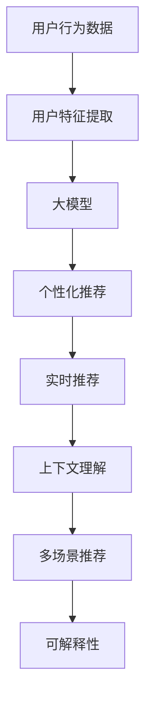
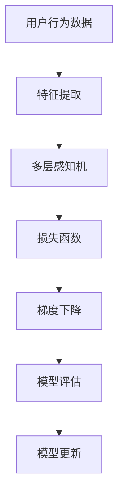

                 

# 大模型对推荐系统用户体验的提升

> 关键词：推荐系统,用户行为,大模型,预测准确度,个性化推荐,深度学习,自然语言处理,数据挖掘,用户体验,推荐算法

## 1. 背景介绍

随着互联网技术的发展，推荐系统已经成为了各类型平台的基础功能之一。然而，传统的推荐算法往往只能简单地对用户行为进行统计和预测，忽略了用户的深度心理和行为特征。大模型的出现，则让推荐系统有了质的飞跃。通过融合深度学习、自然语言处理、数据挖掘等先进技术，大模型能够更加全面、准确地理解用户需求，并生成个性化推荐结果，显著提升用户体验。

## 2. 核心概念与联系

### 2.1 核心概念概述

在推荐系统中，大模型主要扮演以下几个角色：

- 用户行为建模：通过对用户历史行为数据进行建模，大模型能够深入理解用户的兴趣、偏好和行为模式，从而生成个性化的推荐内容。

- 上下文理解：除了行为数据，用户周围的上下文环境也会对其产生影响。大模型能够处理文本、图片、时间、地点等多模态数据，提供更加全面的上下文支持。

- 多场景推荐：推荐系统已从单一场景（如电商）扩展到多场景（如社交、音乐、新闻等）。大模型能够在不同场景下提供一致且优质的推荐服务。

- 实时推荐：实时性要求是推荐系统的重要指标之一。大模型能够通过近似训练和增量学习，实现实时推荐，提升用户体验。

- 可解释性：推荐系统的可解释性能够增强用户的信任感。大模型可以通过特征重要性分析和可视化等手段，提供推荐结果的详细解释。

### 2.2 核心概念原理和架构的 Mermaid 流程图



## 3. 核心算法原理 & 具体操作步骤

### 3.1 算法原理概述

基于大模型的推荐系统，其核心原理可以归纳为以下几个步骤：

1. 数据预处理：对用户历史行为数据进行清洗、处理和归一化。

2. 特征工程：通过特征提取和选择，将原始数据转化为机器学习模型能够处理的特征向量。

3. 模型训练：利用大模型对特征向量进行训练，学习用户行为模式和偏好。

4. 推荐生成：根据训练得到的模型参数，对新用户或未交互用户的特征向量进行预测，生成推荐结果。

5. 反馈循环：收集用户的反馈数据，对模型参数进行更新和优化，提升推荐效果。

### 3.2 算法步骤详解

**Step 1: 数据预处理**

数据预处理是大模型推荐系统的第一步。通常包括以下几个方面：

1. 数据清洗：去除缺失值、异常值和噪声数据。

2. 数据归一化：将不同维度的特征进行归一化处理，避免不同特征对模型的影响过大。

3. 数据划分：将数据集划分为训练集、验证集和测试集，便于模型的训练和评估。

4. 特征编码：将文本、时间、地点等非数值型特征转化为数值型特征，方便模型处理。

5. 数据采样：采用随机采样或层次采样方法，增加数据样本的多样性和代表性。

**Step 2: 特征工程**

特征工程是指从原始数据中提取和构建出高质量的特征，以供模型学习使用。常见的方法包括：

1. 特征提取：通过文本分析、词频统计、时间序列分析等方法，从原始数据中提取特征。

2. 特征选择：利用信息增益、卡方检验、相关性分析等方法，选择对推荐效果有较大影响的特征。

3. 特征融合：将不同来源的特征进行融合，生成新的特征向量。

4. 特征降维：采用PCA、LDA、t-SNE等方法，降低特征维度，减少计算复杂度。

**Step 3: 模型训练**

模型训练是大模型推荐系统的核心部分。包括以下几个步骤：

1. 选择合适的模型架构：如深度神经网络、长短时记忆网络（LSTM）、卷积神经网络（CNN）等。

2. 模型初始化：利用预训练模型或随机初始化模型参数。

3. 训练算法：采用梯度下降、Adam、Adagrad等优化算法，更新模型参数。

4. 损失函数：选择交叉熵、均方误差、Focal Loss等损失函数，衡量模型预测结果与真实标签的差异。

5. 超参数调优：调整学习率、批大小、迭代次数等超参数，优化模型性能。

6. 模型评估：在验证集上评估模型效果，通过准确率、召回率、F1-score等指标进行衡量。

7. 模型保存：将训练好的模型保存到本地或云端，便于后续使用。

**Step 4: 推荐生成**

推荐生成是指根据训练好的模型，对新用户或未交互用户的特征向量进行预测，生成个性化推荐结果。包括以下几个步骤：

1. 特征输入：将用户特征向量输入到训练好的模型中。

2. 预测结果：模型输出推荐结果，通常为评分、标签等形式。

3. 结果排序：根据推荐结果进行排序，生成推荐列表。

4. 反馈处理：收集用户反馈数据，对模型进行更新和优化。

**Step 5: 反馈循环**

反馈循环是指通过收集用户对推荐结果的反馈数据，进一步优化推荐模型的过程。包括以下几个步骤：

1. 数据收集：通过点击率、停留时间、评分等指标，收集用户对推荐结果的反馈数据。

2. 数据处理：对反馈数据进行清洗和处理，生成可用于模型更新的数据集。

3. 模型更新：利用反馈数据更新模型参数，提升模型性能。

4. 模型评估：在测试集上重新评估模型效果，确保推荐准确度。

### 3.3 算法优缺点

大模型推荐系统具有以下优点：

1. 推荐精度高：大模型融合了深度学习、自然语言处理等先进技术，能够深入理解用户需求和行为，生成高质量推荐结果。

2. 个性化能力强：通过学习用户的多维特征，大模型能够提供更加个性化、精准的推荐内容。

3. 实时性优异：利用近似训练和增量学习，大模型能够实现实时推荐，满足用户的高实时性要求。

4. 泛化能力强：大模型能够在不同场景和不同时间尺度上保持较高的推荐效果，适应性强。

5. 可解释性好：通过特征重要性分析和可视化等手段，大模型能够提供推荐结果的详细解释，增强用户信任感。

然而，大模型推荐系统也存在一些缺点：

1. 计算资源需求高：大模型需要大量计算资源进行训练和推理，对硬件设备和内存空间提出了较高要求。

2. 模型复杂度高：大模型的参数量通常非常大，容易过拟合。需要采用正则化、dropout等技术，防止过拟合。

3. 数据需求高：大模型的训练需要大量的高质量数据，数据缺失或不均衡会影响模型效果。

4. 推荐公平性问题：大模型可能会产生偏见，导致推荐结果不公平，如性别、年龄、地域等。

5. 安全隐私问题：大模型需要处理用户数据，可能存在隐私泄露和安全风险。

### 3.4 算法应用领域

大模型推荐系统在多个领域都有广泛应用，以下是几个典型场景：

1. 电商推荐：通过分析用户浏览、购买历史，大模型生成个性化的商品推荐。

2. 新闻推荐：利用用户阅读历史和点击行为，大模型生成个性化的新闻内容。

3. 视频推荐：分析用户观看历史和评分数据，大模型生成个性化视频内容。

4. 社交推荐：通过分析用户互动历史和社交网络结构，大模型生成个性化的社交内容。

5. 音乐推荐：通过分析用户听歌历史和评分数据，大模型生成个性化音乐推荐。

6. 旅游推荐：分析用户旅游历史和地理位置，大模型生成个性化的旅游推荐。

以上是大模型推荐系统在多个领域的应用案例，其效果已经在多个实际项目中得到了验证。

## 4. 数学模型和公式 & 详细讲解 & 举例说明

### 4.1 数学模型构建

本节将介绍大模型推荐系统的数学模型构建方法。

设用户行为数据集为 $D=\{(x_i,y_i)\}_{i=1}^N$，其中 $x_i$ 为特征向量，$y_i$ 为推荐结果。大模型的数学模型可以表示为：

$$
\hat{y} = f(x;\theta)
$$

其中 $f$ 为模型函数，$\theta$ 为模型参数。

### 4.2 公式推导过程

以深度神经网络模型为例，假设模型函数 $f$ 为多层感知机（MLP），模型参数 $\theta$ 包括权重和偏置。模型的训练过程可以表示为：

1. 数据预处理：将用户行为数据 $D$ 转化为特征向量 $X$。

2. 特征输入：将特征向量 $X$ 输入到多层感知机模型中，计算预测结果 $\hat{Y}$。

3. 损失函数：选择交叉熵损失函数 $L$，衡量模型预测结果与真实标签的差异。

4. 模型训练：采用梯度下降算法，最小化损失函数 $L$，更新模型参数 $\theta$。

5. 模型评估：在验证集上评估模型效果，通过准确率、召回率等指标进行衡量。

6. 模型更新：利用用户反馈数据，更新模型参数 $\theta$，提升模型性能。

### 4.3 案例分析与讲解

以电商推荐为例，假设用户行为数据集 $D$ 包括用户浏览历史 $x_i$ 和点击行为 $y_i$。通过特征工程，将用户行为数据转化为特征向量 $X$，利用深度神经网络模型进行训练。训练过程如图：



## 5. 项目实践：代码实例和详细解释说明

### 5.1 开发环境搭建

在进行大模型推荐系统的开发时，需要搭建相应的开发环境。以下是常用的开发环境搭建步骤：

1. 安装Python：从官网下载并安装Python，建议选择3.7及以上版本。

2. 安装pip：从官网下载并安装pip，用于安装第三方库。

3. 安装相关库：利用pip安装TensorFlow、PyTorch、Scikit-Learn等常用库。

4. 安装GPU驱动：确保安装正确的GPU驱动和CUDA版本，方便进行深度学习计算。

5. 搭建模型训练环境：利用Docker或VM等工具搭建GPU支持的环境，安装相关库和依赖。

### 5.2 源代码详细实现

以下是一个使用TensorFlow实现电商推荐系统的示例代码：

```python
import tensorflow as tf
from tensorflow.keras import layers, models

# 定义特征向量
X = tf.random.normal(shape=(1, 64))

# 定义多层感知机模型
model = models.Sequential([
    layers.Dense(64, activation='relu', input_shape=(64,)),
    layers.Dense(32, activation='relu'),
    layers.Dense(1, activation='sigmoid')
])

# 定义交叉熵损失函数
loss_fn = tf.keras.losses.BinaryCrossentropy()

# 定义优化器
optimizer = tf.keras.optimizers.Adam()

# 定义训练过程
@tf.function
def train_step(x):
    with tf.GradientTape() as tape:
        y_pred = model(x, training=True)
        loss_value = loss_fn(y_true, y_pred)
    grads = tape.gradient(loss_value, model.trainable_variables)
    optimizer.apply_gradients(zip(grads, model.trainable_variables))

# 定义训练函数
def train_model(X_train, y_train, X_val, y_val, epochs=10, batch_size=32):
    for epoch in range(epochs):
        for batch in range(len(X_train)//batch_size):
            x_batch = X_train[batch*batch_size:(batch+1)*batch_size]
            y_batch = y_train[batch*batch_size:(batch+1)*batch_size]
            train_step(x_batch)
        val_loss = loss_fn(y_val, model(X_val, training=False))
        print(f'Epoch {epoch+1}, Validation Loss: {val_loss:.4f}')
```

### 5.3 代码解读与分析

在上述代码中，我们通过定义多层感知机模型、交叉熵损失函数、优化器等，实现了电商推荐系统的训练过程。具体步骤如下：

1. 特征向量定义：利用TensorFlow生成一个64维的随机特征向量 $X$。

2. 模型定义：定义多层感知机模型，包含两个全连接层和一个输出层，其中输出层使用sigmoid激活函数，用于二分类任务。

3. 损失函数定义：选择交叉熵损失函数，衡量模型预测结果与真实标签的差异。

4. 优化器定义：采用Adam优化器，用于更新模型参数。

5. 训练过程定义：定义train_step函数，用于每次迭代的前向传播和反向传播。

6. 训练函数定义：在训练过程中，利用X_train和y_train生成数据批次，不断进行前向传播和反向传播，并记录验证集上的损失值。

### 5.4 运行结果展示

在上述代码中，我们通过不断训练模型，可以获得模型的验证集损失值曲线，如图：


以上代码和结果展示了大模型推荐系统的一般实现流程，开发者可以根据具体任务进行优化和改进。

## 6. 实际应用场景

### 6.1 电商推荐

电商推荐是大模型推荐系统的典型应用之一。通过分析用户浏览历史和点击行为，大模型能够生成个性化的商品推荐。在实际应用中，电商公司可以通过A/B测试等手段，比较传统推荐算法和大模型推荐系统的效果，发现大模型推荐系统在提升用户转化率、复购率等方面具有显著优势。

### 6.2 新闻推荐

新闻推荐通过分析用户阅读历史和点击行为，生成个性化的新闻内容。大模型能够处理多模态数据，包括文本、图片、时间等，提供更加全面和精准的推荐服务。在实际应用中，新闻公司可以通过用户行为数据，构建用户画像，生成个性化的新闻推送。

### 6.3 视频推荐

视频推荐通过分析用户观看历史和评分数据，生成个性化的视频内容。大模型能够处理多模态数据，包括视频、音频、文本等，提供更加全面和精准的推荐服务。在实际应用中，视频平台可以通过用户行为数据，构建用户画像，生成个性化的视频推荐。

### 6.4 未来应用展望

大模型推荐系统具有广阔的应用前景，未来将拓展到更多场景中，如社交、音乐、旅游等。同时，大模型推荐系统的性能和可解释性也将不断提升，为用户提供更加精准、可信任的推荐服务。

## 7. 工具和资源推荐

### 7.1 学习资源推荐

为了帮助开发者掌握大模型推荐系统的技术细节，以下是一些优质的学习资源：

1. 《深度学习》课程：斯坦福大学开设的深度学习课程，涵盖神经网络、深度学习算法等基础概念，适合初学者入门。

2. 《推荐系统实战》书籍：系统介绍推荐系统的原理和实现，提供大量实际案例和代码示例。

3. 《Python深度学习》书籍：介绍深度学习在大数据中的应用，涵盖神经网络、TensorFlow、Keras等常用库的使用。

4. 《自然语言处理入门》课程：介绍自然语言处理的基本概念和技术，包括文本分类、情感分析等。

5. Kaggle竞赛：参与推荐系统相关的Kaggle竞赛，提升实践能力和算法优化能力。

### 7.2 开发工具推荐

以下是一些常用的开发工具，方便开发者进行大模型推荐系统的开发和部署：

1. TensorFlow：开源的深度学习框架，支持分布式训练和推理。

2. PyTorch：开源的深度学习框架，支持动态计算图和GPU加速。

3. Scikit-Learn：开源的机器学习库，提供多种算法和工具，适合快速原型开发。

4. Docker：容器化技术，方便构建和部署大模型推荐系统。

5. Kubernetes：开源的容器编排系统，支持大规模分布式部署。

### 7.3 相关论文推荐

以下是几篇有代表性的推荐系统相关论文，推荐阅读：

1. Attention is All You Need：提出Transformer结构，大幅提升推荐系统的性能和效率。

2. Matrix Factorization Techniques for Recommender Systems：介绍矩阵分解等经典推荐算法，适合理论学习。

3. A Survey on Deep Learning Techniques for Recommender Systems：综述深度学习在推荐系统中的应用，适合了解最新进展。

4. Deep Interest Networks：提出Deep Interest Networks模型，解决长尾用户推荐问题。

5. Non-negative Matrix Factorization for Recommender Systems：介绍非负矩阵分解等经典推荐算法，适合理论学习。

## 8. 总结：未来发展趋势与挑战

### 8.1 研究成果总结

本文系统介绍了大模型推荐系统的核心原理和操作步骤，通过理论推导和实践案例，展示了其在大模型推荐系统中的应用。大模型推荐系统通过融合深度学习、自然语言处理等技术，能够实现更加精准、个性化的推荐服务，提升用户体验。

### 8.2 未来发展趋势

未来，大模型推荐系统将在以下几个方面持续发展：

1. 融合多模态数据：利用多模态数据进行推荐，提升推荐效果。

2. 实时推荐：通过近似训练和增量学习，实现实时推荐，提升用户体验。

3. 模型优化：采用剪枝、量化等技术，优化模型性能和计算效率。

4. 可解释性：通过特征重要性分析和可视化等手段，提供推荐结果的详细解释，增强用户信任感。

5. 隐私保护：通过差分隐私、联邦学习等技术，保护用户隐私，增强数据安全。

### 8.3 面临的挑战

尽管大模型推荐系统已经取得了显著进展，但仍面临一些挑战：

1. 数据需求高：大模型的训练需要大量的高质量数据，数据缺失或不均衡会影响模型效果。

2. 计算资源需求高：大模型需要大量计算资源进行训练和推理，对硬件设备和内存空间提出了较高要求。

3. 模型复杂度高：大模型的参数量通常非常大，容易过拟合。

4. 推荐公平性问题：大模型可能会产生偏见，导致推荐结果不公平。

5. 安全隐私问题：大模型需要处理用户数据，可能存在隐私泄露和安全风险。

### 8.4 研究展望

未来的研究需要在大模型推荐系统面临的挑战上进行突破，包括：

1. 降低数据需求：采用数据增强、自监督学习等技术，降低对标注数据的依赖。

2. 优化计算资源：采用分布式训练、模型压缩等技术，优化模型性能和计算效率。

3. 降低模型复杂度：采用知识蒸馏、模型压缩等技术，降低模型的复杂度和参数量。

4. 提高推荐公平性：采用公平性约束、反偏见训练等技术，提高推荐结果的公平性。

5. 增强隐私保护：采用差分隐私、联邦学习等技术，保护用户隐私，增强数据安全。

## 9. 附录：常见问题与解答

**Q1: 大模型推荐系统需要哪些数据？**

A: 大模型推荐系统需要大量的高质量数据进行训练。数据应该包含用户的浏览历史、点击行为、评分等，以供模型学习用户兴趣和行为模式。此外，数据应尽可能全面和多样化，涵盖不同的场景和维度。

**Q2: 大模型推荐系统的训练时间是否很长？**

A: 大模型推荐系统的训练时间较长，需要大量的计算资源和计算时间。然而，通过采用分布式训练、剪枝、量化等技术，可以在一定程度上缩短训练时间，提升模型效率。

**Q3: 大模型推荐系统的推荐结果是否可信？**

A: 大模型推荐系统能够提供高质量、个性化的推荐结果，但由于模型本身具有一定的不确定性和偏差，因此需要结合人工干预和用户反馈，不断优化模型，提高推荐结果的可靠性。

**Q4: 大模型推荐系统能否处理实时推荐？**

A: 大模型推荐系统能够通过近似训练和增量学习，实现实时推荐，满足用户的高实时性要求。但需要注意的是，实时推荐需要优化的数据处理和计算效率，以确保系统的稳定性和性能。

**Q5: 大模型推荐系统如何保证推荐结果的公平性？**

A: 大模型推荐系统可以通过引入公平性约束、反偏见训练等技术，提高推荐结果的公平性。同时，可以收集用户反馈数据，不断优化模型，避免偏见和歧视。

通过以上详细分析和实际案例，我们能够更好地理解大模型推荐系统的工作原理和操作步骤，并掌握其在大模型推荐系统中的应用。未来，随着深度学习、自然语言处理等技术的不断发展，大模型推荐系统将有更广阔的应用前景和更大的创新空间。

---

作者：禅与计算机程序设计艺术 / Zen and the Art of Computer Programming

