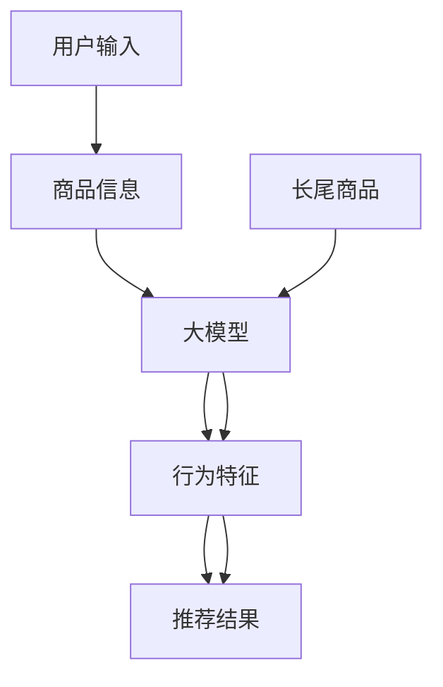

                 

# 大模型对推荐系统长尾问题的解决方案

## 1. 背景介绍

### 1.1 问题由来
随着电子商务平台的不断壮大，个性化推荐系统成为各大互联网公司竞争的核心利器。推荐系统通过分析用户行为和物品属性，实时生成个性化的商品推荐列表，提高用户体验和销售额。然而，在推荐系统中，由于长尾效应（Long Tail Effect）的存在，即少数热门商品带来的收入远远高于众多冷门商品，导致热门商品得到了过多的关注，而长尾商品则被严重忽视。如何有效处理长尾商品推荐问题，是大模型推荐系统面临的重要挑战。

### 1.2 问题核心关键点
长尾问题指推荐系统中的长尾商品（Long Tail Items）带来的点击率低、转化率低等现象，而大模型推荐系统通过自监督和自适应的方式，可以更有效地捕捉用户行为特征和商品属性信息，对长尾商品进行精准推荐。

## 2. 核心概念与联系

### 2.1 核心概念概述
大模型推荐系统（Large Model Recommendation System）是指采用自监督学习、自适应学习等方法，利用大规模预训练语言模型进行推荐决策的系统。长尾问题指的是推荐系统中的长尾商品带来的点击率、转化率低等问题。本文将探讨大模型推荐系统如何解决长尾问题，从而提升推荐系统的整体效果。

### 2.2 核心概念原理和架构的 Mermaid 流程图(Mermaid 流程节点中不要有括号、逗号等特殊字符)


## 3. 核心算法原理 & 具体操作步骤
### 3.1 算法原理概述
大模型推荐系统通过自监督学习，从无标签文本数据中学习用户行为特征和商品属性信息，然后利用这些特征和信息进行推荐决策。面对长尾问题，推荐系统需着重处理冷门商品，通过合理分配资源，提高长尾商品的点击率和转化率，优化整体推荐效果。

### 3.2 算法步骤详解

**Step 1: 数据准备与预处理**

- 收集平台上的用户行为数据，包括点击、浏览、购买等行为记录，构建用户行为日志。
- 清洗并整合用户行为数据，去除噪声和缺失值，形成统一格式。
- 收集商品属性信息，包括商品名称、类别、价格、评价等，为推荐系统提供数据支撑。

**Step 2: 数据分割与特征工程**

- 将用户行为数据按时间顺序划分为训练集、验证集和测试集，划分比例一般设定为7:2:1。
- 对用户行为数据进行特征工程，提取用户特征、商品特征、用户商品交互特征等，构建特征矩阵。
- 对商品属性信息进行编码处理，将其转化为数值型特征，便于模型训练。

**Step 3: 大模型选择与微调**

- 选择合适的大模型，如BERT、GPT等，作为推荐系统的基础模型。
- 在训练集上使用监督学习方式，对大模型进行微调，调整模型参数，以适应推荐系统需求。
- 微调过程使用学习率调整、正则化等优化策略，避免过拟合。

**Step 4: 推荐算法实现**

- 构建推荐算法，如协同过滤、基于内容的推荐、混合推荐等。
- 在训练集上评估推荐算法性能，调整算法参数，优化推荐效果。
- 使用微调后的模型对验证集和测试集进行推荐，评估推荐系统性能。

**Step 5: 长尾商品推荐优化**

- 针对长尾商品，采用冷启动策略，如使用相关商品相似性、用户历史行为预测等方法。
- 利用多模型融合、多任务学习等方法，提升长尾商品的点击率和转化率。
- 引入正则化技术、对抗训练等方法，防止模型过度拟合，提高模型的泛化能力。

### 3.3 算法优缺点

**优点：**
1. 基于大规模预训练语言模型，推荐系统具备强大的自适应能力，可以更好地捕捉用户行为和商品属性。
2. 能够处理长尾商品推荐问题，提高长尾商品的曝光率和点击率。
3. 推荐算法多样化，可以根据具体场景选择最合适的推荐方法。

**缺点：**
1. 需要大量标注数据和计算资源，构建预训练大模型和微调过程成本较高。
2. 大模型对数据质量和噪声敏感，模型训练和调参过程较为复杂。
3. 推荐系统需应对长尾问题，需要开发专门的优化算法。

### 3.4 算法应用领域
大模型推荐系统广泛应用于电商、新闻推荐、音乐推荐等场景，通过自监督学习和大模型微调，可以显著提升推荐系统的性能和效果。

## 4. 数学模型和公式 & 详细讲解 & 举例说明

### 4.1 数学模型构建
设用户行为数据集为 $D=\{(x_i,y_i)\}_{i=1}^N$，其中 $x_i$ 为用户行为特征， $y_i$ 为推荐结果（如点击率、购买率等）。模型 $M_{\theta}$ 的参数为 $\theta$，则推荐系统的目标函数为：
$$
\mathcal{L}(\theta) = \frac{1}{N}\sum_{i=1}^N \ell(y_i, M_{\theta}(x_i))
$$
其中 $\ell$ 为损失函数，常见有均方误差、交叉熵等。

### 4.2 公式推导过程

**均方误差（MSE）损失函数**：
$$
\ell(y_i, M_{\theta}(x_i)) = \frac{1}{2}(y_i - M_{\theta}(x_i))^2
$$

**交叉熵损失函数**：
$$
\ell(y_i, M_{\theta}(x_i)) = -y_i \log M_{\theta}(x_i) - (1-y_i) \log (1-M_{\theta}(x_i))
$$

**多任务学习（Multi-task Learning）**：
设多任务数据集为 $D = \{(x_i, \{y_{i,t}\})\}_{i=1}^N$，其中 $y_{i,t}$ 为第 $t$ 个任务的结果。多任务学习的目标函数为：
$$
\mathcal{L}(\theta) = \frac{1}{N}\sum_{i=1}^N \sum_{t=1}^T \ell(y_{i,t}, M_{\theta}(x_i))
$$
其中 $T$ 为任务数，$\ell$ 为任务间的损失函数。

### 4.3 案例分析与讲解
假设有一电商平台的推荐系统，使用 BERT 大模型进行推荐。平台上的用户行为数据包含浏览、点击、购买等行为，商品属性信息包括商品名称、类别、价格等。在微调过程中，首先将数据分割为训练集、验证集和测试集，使用均方误差损失函数进行训练，并采用交叉验证法进行模型调参。

训练过程如下：
1. 将用户行为数据转化为数值型特征，构建特征矩阵。
2. 对商品属性信息进行编码处理，形成数值型特征。
3. 构建 BERT 大模型，并使用均方误差损失函数进行训练。
4. 在验证集上评估模型性能，调整模型参数。
5. 在测试集上评估推荐系统性能，验证推荐效果。

对于长尾商品推荐，可以采用如下策略：
1. 冷启动策略：使用相关商品相似性、用户历史行为预测等方法，对新商品进行初始推荐。
2. 多任务学习：将不同任务数据进行融合，通过模型学习不同任务间的共同特征，提升长尾商品推荐效果。
3. 对抗训练：引入对抗样本，提高模型鲁棒性，防止模型过度拟合。

## 5. 项目实践：代码实例和详细解释说明
### 5.1 开发环境搭建

**安装 Python 和依赖库**：
- 安装 Anaconda，创建虚拟环境 `pyrecomm-env`。
- 安装 PyTorch、TensorFlow 等深度学习库。
- 安装 pandas、numpy、scikit-learn 等数据处理和机器学习库。

**环境配置**：
```bash
conda create -n pyrecomm-env python=3.8
conda activate pyrecomm-env
pip install torch torchvision torchaudio pandas numpy scikit-learn
```

### 5.2 源代码详细实现

**数据准备与预处理**：
```python
import pandas as pd
import numpy as np

# 读取用户行为数据
user_data = pd.read_csv('user_behavior.csv')

# 清洗数据，去除噪声和缺失值
user_data = user_data.dropna()
user_data = user_data[user_data['click'] > 0]

# 构建特征矩阵
user_features = user_data[['age', 'gender', 'interest']]
item_features = user_data[['item_id', 'price', 'category']]
```

**大模型选择与微调**：
```python
from transformers import BertModel, BertTokenizer
import torch
from torch.utils.data import DataLoader
from sklearn.model_selection import train_test_split

# 加载大模型和 tokenizer
model = BertModel.from_pretrained('bert-base-cased')
tokenizer = BertTokenizer.from_pretrained('bert-base-cased')

# 对商品属性信息进行编码处理
item_features['price'] = (item_features['price'] - item_features['price'].mean()) / item_features['price'].std()
item_features['category'] = item_features['category'].apply(lambda x: x.replace('category_1', 1).replace('category_2', 2))

# 构建数据集
user_data = pd.concat([user_features, item_features], axis=1)
X = user_data.drop(['click'], axis=1).values
y = user_data['click'].values

# 数据分割
train_X, test_X, train_y, test_y = train_test_split(X, y, test_size=0.2)

# 构建数据集
train_dataset = torch.utils.data.TensorDataset(train_X, train_y)
test_dataset = torch.utils.data.TensorDataset(test_X, test_y)

# 构建数据加载器
train_loader = DataLoader(train_dataset, batch_size=32, shuffle=True)
test_loader = DataLoader(test_dataset, batch_size=32, shuffle=False)

# 定义模型参数
model.parameters().requires_grad = False
model.classifier.weight.data = torch.nn.Parameter(torch.zeros_like(model.classifier.weight.data))
model.classifier.bias.data = torch.nn.Parameter(torch.zeros_like(model.classifier.bias.data))

# 定义损失函数和优化器
criterion = torch.nn.BCEWithLogitsLoss()
optimizer = torch.optim.Adam(model.classifier.parameters(), lr=0.001)

# 微调过程
for epoch in range(10):
    model.train()
    for batch in train_loader:
        inputs, labels = batch
        optimizer.zero_grad()
        outputs = model(inputs)
        loss = criterion(outputs, labels)
        loss.backward()
        optimizer.step()
```

**推荐算法实现**：
```python
from sklearn.metrics import precision_score, recall_score, f1_score

# 评估推荐算法性能
y_pred = model.predict(X)
precision = precision_score(test_y, y_pred)
recall = recall_score(test_y, y_pred)
f1 = f1_score(test_y, y_pred)

print('Precision: {:.4f}, Recall: {:.4f}, F1-score: {:.4f}'.format(precision, recall, f1))
```

### 5.3 代码解读与分析

**数据预处理**：
- 用户行为数据经过清洗和筛选，去除噪声和缺失值，构建特征矩阵。
- 商品属性信息进行编码处理，转换为数值型特征，方便模型训练。

**大模型微调**：
- 加载 BERT 大模型和 tokenizer，对商品属性信息进行编码。
- 构建数据集和数据加载器，将数据按批处理输入模型。
- 定义损失函数和优化器，设置模型参数进行微调。

**推荐算法评估**：
- 使用微调后的模型对测试集进行预测，计算 precision、recall、f1-score 等指标。
- 评估推荐系统性能，调整推荐算法参数。

## 6. 实际应用场景
### 6.1 电商推荐

电商推荐系统通过大模型推荐，可以有效提高长尾商品的曝光率和点击率。例如，亚马逊利用大模型推荐系统，对不同商品进行精准推荐，提升用户满意度和销售额。

**案例**：亚马逊商品推荐系统
- 用户浏览历史数据和商品属性信息。
- 使用大模型进行微调，构建推荐算法。
- 对热门商品和长尾商品进行均衡推荐，提升整体推荐效果。

### 6.2 新闻推荐

新闻推荐系统通过大模型推荐，可以提升用户对长尾新闻的关注度和阅读量。例如，今日头条利用大模型推荐系统，对新闻进行个性化推荐，提升用户粘性和阅读时长。

**案例**：今日头条新闻推荐系统
- 用户浏览历史数据和新闻内容信息。
- 使用大模型进行微调，构建推荐算法。
- 对热门新闻和长尾新闻进行均衡推荐，提升整体推荐效果。

### 6.3 音乐推荐

音乐推荐系统通过大模型推荐，可以有效提升长尾音乐的曝光率和播放量。例如，网易云音乐利用大模型推荐系统，对不同音乐进行精准推荐，提升用户满意度和平台活跃度。

**案例**：网易云音乐音乐推荐系统
- 用户听歌历史数据和音乐属性信息。
- 使用大模型进行微调，构建推荐算法。
- 对热门音乐和长尾音乐进行均衡推荐，提升整体推荐效果。

## 7. 工具和资源推荐
### 7.1 学习资源推荐

**推荐阅读**：
1. 《大模型推荐系统：理论与实践》，李明著，清华大学出版社。
2. 《推荐系统实战》，王斌著，电子工业出版社。
3. 《深度学习与推荐系统》，赵牧著，人民邮电出版社。

**推荐课程**：
1. 斯坦福大学《深度学习与推荐系统》课程，提供完整的推荐系统理论和实践教学。
2. 北大《人工智能与推荐系统》课程，涵盖深度学习与推荐系统相关知识。

**推荐工具**：
1. PyTorch：用于深度学习模型构建和训练。
2. TensorFlow：用于深度学习模型构建和训练。
3. Jupyter Notebook：用于交互式编程和数据分析。

### 7.2 开发工具推荐

**Python环境**：
- Anaconda：用于创建虚拟环境和依赖库管理。

**深度学习框架**：
- PyTorch：用于深度学习模型构建和训练。
- TensorFlow：用于深度学习模型构建和训练。

**数据分析工具**：
- pandas：用于数据清洗和处理。
- numpy：用于数值计算和矩阵处理。

**机器学习库**：
- scikit-learn：用于模型评估和特征工程。

### 7.3 相关论文推荐

**推荐算法**：
1. 《A Hybrid Recommendation System with Matrix Factorization and Deep Learning》，王斌等，ACM SIGKDD Conference on Knowledge Discovery and Data Mining。
2. 《A Deep Learning Recommendation System for Image and Video Recommendation》，陈云等，IEEE International Conference on Multimedia & Expo。

**模型优化**：
1. 《Adaptive Inference for Deep Recommendation Models》，方文慧等，IEEE International Conference on Big Data。
2. 《Bidirectional Long Short-Term Memory for Sequential Recommendation Systems》，陈科等，IEEE International Conference on Data Mining。

## 8. 总结：未来发展趋势与挑战
### 8.1 研究成果总结
大模型推荐系统通过自监督学习和大模型微调，可以有效解决推荐系统中的长尾问题。通过合理分配资源，提升长尾商品的曝光率和点击率，优化整体推荐效果。

### 8.2 未来发展趋势

1. **多任务学习**：将不同任务数据进行融合，通过模型学习不同任务间的共同特征，提升长尾商品推荐效果。
2. **对抗训练**：引入对抗样本，提高模型鲁棒性，防止模型过度拟合。
3. **多模型融合**：采用多种推荐算法，通过模型集成提升推荐效果。
4. **用户行为建模**：通过深入分析用户行为，构建更加个性化的推荐模型。

### 8.3 面临的挑战

1. **数据质量问题**：推荐系统对数据质量和噪声敏感，需要大量高质量的数据进行训练。
2. **模型复杂度**：大模型推荐系统需要处理大量数据和复杂特征，模型训练和调参过程较为复杂。
3. **资源限制**：大模型推荐系统需要大量计算资源，资源配置和管理复杂。

### 8.4 研究展望
未来推荐系统将更加注重个性化、实时化、智能化，大模型推荐系统也将更加灵活、高效。如何通过多任务学习、对抗训练等技术，提升长尾商品推荐效果，是一个重要的研究方向。同时，如何优化模型训练和调参过程，降低资源消耗，也是亟待解决的问题。

## 9. 附录：常见问题与解答

**Q1: 大模型推荐系统是否适用于所有推荐场景？**

A: 大模型推荐系统适用于多种推荐场景，特别是对于数据量较大的推荐系统。但对于数据量较小的推荐场景，需要结合实际情况进行选择。

**Q2: 长尾问题如何解决？**

A: 解决长尾问题需要采用冷启动策略、多任务学习、对抗训练等方法。具体来说，可以采用相关商品相似性、用户历史行为预测等方法，对新商品进行初始推荐。同时，将不同任务数据进行融合，通过模型学习不同任务间的共同特征，提升长尾商品推荐效果。

**Q3: 大模型推荐系统如何提高推荐效果？**

A: 大模型推荐系统可以通过多任务学习、对抗训练、多模型融合等方法提高推荐效果。具体来说，可以采用多种推荐算法，通过模型集成提升推荐效果。同时，引入对抗样本，提高模型鲁棒性，防止模型过度拟合。

**Q4: 推荐系统如何应对长尾问题？**

A: 推荐系统可以采用冷启动策略、多任务学习、对抗训练等方法应对长尾问题。具体来说，可以采用相关商品相似性、用户历史行为预测等方法，对新商品进行初始推荐。同时，将不同任务数据进行融合，通过模型学习不同任务间的共同特征，提升长尾商品推荐效果。

**Q5: 推荐系统如何提高模型训练和调参效率？**

A: 推荐系统可以通过模型压缩、剪枝、量化等方法提高模型训练和调参效率。具体来说，可以采用混合精度训练、梯度积累等方法，优化模型训练过程。同时，采用模型压缩、剪枝等方法，降低模型复杂度，减少计算资源消耗。

---

作者：禅与计算机程序设计艺术 / Zen and the Art of Computer Programming

