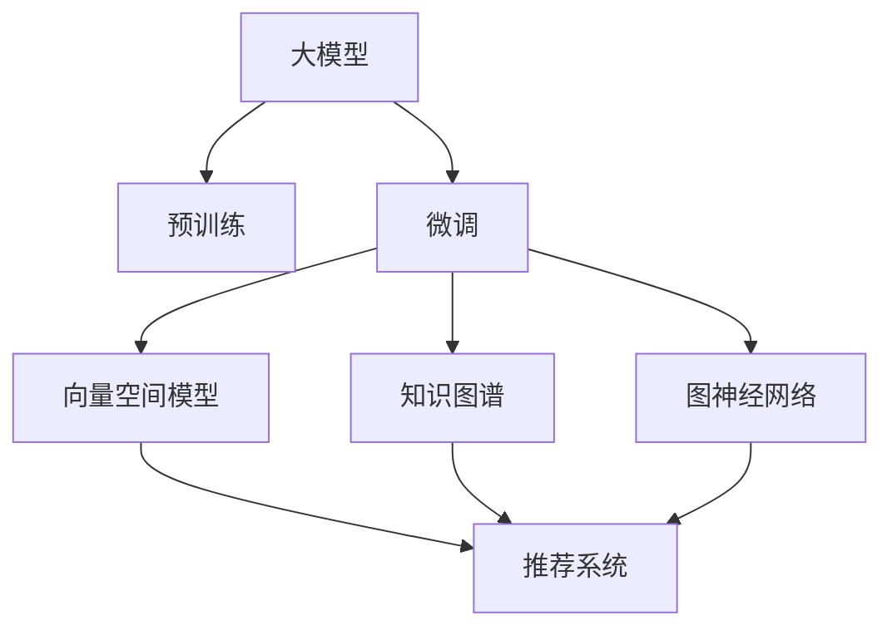

                 

# 大模型技术在电商平台商品关联分析中的应用

> 关键词：电商平台, 商品关联分析, 自然语言处理, 大模型, 深度学习, 推荐系统, 向量空间模型, 知识图谱, 图神经网络, 应用实践

## 1. 背景介绍

### 1.1 问题由来
随着电商平台的发展，用户体验逐渐成为商家关注的重点。商品推荐系统成为商家提升用户体验、增加销售的重要工具。然而，传统推荐系统往往依赖于用户历史行为数据，无法深入挖掘商品之间的语义关联。与此同时，自然语言处理（NLP）技术在大规模语料库上的进展，为商品关联分析带来了新的思路。

大模型技术，尤其是预训练语言模型，通过在无标签语料上自监督学习，学习了丰富的语言表示能力。将大模型技术应用到电商平台，能够实现基于商品名称、描述、用户评论等多维度信息的深度关联分析，显著提升推荐系统的准确性和多样化。

### 1.2 问题核心关键点
当前电商平台商品推荐系统面临以下核心挑战：

1. **数据稀疏性**：用户历史行为数据稀疏，难以覆盖所有商品，导致推荐结果单一。
2. **语义理解不足**：传统推荐系统无法准确理解商品描述和用户评论中的语义信息，推荐精度有限。
3. **动态变化**：用户兴趣变化快，商品热度波动大，系统需要持续学习和调整以适应变化。
4. **多维关联**：商品关联分析不仅涉及商品间的显性关系，还需要挖掘隐性的语义关联。

大模型技术通过预训练-微调范式，可以有效缓解这些挑战。预训练模型从大规模语料中学习到通用的语言表示，微调过程则针对电商场景进行调整，学习商品间的语义关联。

## 2. 核心概念与联系

### 2.1 核心概念概述

为更好地理解大模型技术在电商平台商品关联分析中的应用，本节将介绍几个关键概念：

- **大模型（Large Models）**：指通过大规模无标签数据预训练的深度学习模型，如BERT、GPT等。通过自监督学习，大模型能够学习到丰富的语言表示。
- **预训练（Pre-training）**：指在大规模无标签数据上，通过自监督学习任务训练模型，学习通用的语言表示。
- **微调（Fine-tuning）**：指在预训练模型的基础上，使用特定任务的数据集进行有监督学习，优化模型在该任务上的性能。
- **推荐系统（Recommender System）**：指通过分析用户兴趣和行为数据，推荐符合用户需求的商品的系统。
- **商品关联分析（Item-Item Collaborative Filtering）**：指通过分析商品间的历史购买行为，预测用户对新商品的兴趣。
- **向量空间模型（Vector Space Model, VSM）**：将文本信息表示为向量形式，用于计算文本相似度，常用于信息检索和推荐系统。
- **知识图谱（Knowledge Graph）**：通过构建商品及其属性之间的结构化关系，为推荐系统提供结构化信息。
- **图神经网络（Graph Neural Network, GNN）**：通过将图结构输入神经网络，学习节点间的语义关系，常用于社交网络、推荐系统等。

这些概念之间的逻辑关系可以通过以下Mermaid流程图来展示：



这个流程图展示了大模型技术在电商平台商品关联分析中的关键概念及其之间的关系：

1. 大模型通过预训练获得基础能力。
2. 微调过程在大模型基础上，进一步优化模型性能，学习商品间的语义关联。
3. 推荐系统利用向量空间模型、知识图谱和图神经网络，基于商品关联分析生成推荐结果。

## 3. 核心算法原理 & 具体操作步骤
### 3.1 算法原理概述

基于大模型技术在电商平台商品关联分析的应用，其核心思想是：将大模型视作一种强大的"语义编码器"，通过在电商平台商品描述、用户评论等文本信息上进行预训练和微调，学习商品之间的语义关联，从而提升推荐系统的准确性和多样性。

具体来说，步骤如下：

1. 准备电商平台商品数据集，包括商品名称、描述、用户评论等文本信息。
2. 使用大模型进行预训练，学习通用的语言表示能力。
3. 在电商平台商品关联分析任务上进行微调，学习商品间的语义关联。
4. 使用微调后的模型进行向量空间建模或知识图谱构建，生成推荐系统所需的商品相似度矩阵。
5. 将商品相似度矩阵输入推荐系统，进行商品推荐。

### 3.2 算法步骤详解

以下是详细的算法步骤：

**Step 1: 数据预处理**
- 收集电商平台商品数据，包括商品名称、描述、用户评论等文本信息。
- 对文本进行分词、去停用词等预处理，构建词汇表。
- 使用BERT等预训练语言模型进行预训练，学习通用语言表示能力。

**Step 2: 微调模型**
- 准备商品关联分析任务的标注数据集，划分为训练集、验证集和测试集。
- 设计适当的输出层和损失函数。例如，对于商品关联分析任务，可以设计两个全连接层输出商品间的关联权重，使用交叉熵损失函数。
- 设置微调超参数，如学习率、批大小、迭代轮数等。
- 执行梯度训练，对模型参数进行更新。

**Step 3: 向量空间建模**
- 使用微调后的模型进行向量空间建模，将商品文本转换为向量形式。
- 计算商品向量之间的余弦相似度，得到商品间的相似度矩阵。

**Step 4: 推荐系统**
- 将相似度矩阵输入推荐系统，如协同过滤、基于矩阵分解的推荐等。
- 在测试集上进行评估，比较微调前后的推荐效果。

**Step 5: 持续优化**
- 持续收集新的商品数据和用户行为数据，定期重新微调模型，更新商品相似度矩阵。
- 使用A/B测试等方法评估推荐系统的实际效果，进行模型优化。

### 3.3 算法优缺点

大模型技术在电商平台商品关联分析中具有以下优点：

1. **高效性**：通过预训练-微调范式，利用大模型学到的通用语言表示能力，可以在小样本情况下取得良好的推荐效果。
2. **语义理解力强**：大模型能够理解商品描述和用户评论中的语义信息，提升推荐系统的语义匹配能力。
3. **鲁棒性强**：大模型在预训练过程中学习到了语言的内在结构，对噪声和异常值具有较强的鲁棒性。
4. **泛化能力强**：大模型在预训练过程中学习到了语言的一般规律，对新商品和新用户的推荐效果较好。

但该方法也存在以下缺点：

1. **计算成本高**：预训练和微调过程需要大量的计算资源，成本较高。
2. **数据隐私问题**：电商平台数据涉及用户隐私，数据收集和使用需要遵守相关法规和标准。
3. **模型复杂度高**：大模型结构复杂，需要大量的参数进行训练，模型训练和部署难度较大。
4. **动态性不足**：大模型在预训练过程中学习到的语言表示较为通用，无法实时反映商品和用户的新变化。

### 3.4 算法应用领域

大模型技术在电商平台商品关联分析中的应用主要涉及以下几个领域：

1. **商品推荐**：通过分析商品之间的语义关联，生成符合用户兴趣的商品推荐列表。
2. **个性化推荐**：针对不同用户的兴趣和行为特点，生成个性化推荐列表。
3. **商品搜索**：通过商品向量空间模型，实现基于语义的搜索功能。
4. **广告推荐**：根据用户浏览和购买历史，推荐符合用户兴趣的广告。
5. **客户服务**：利用大模型进行自然语言处理，自动回答用户咨询。

## 4. 数学模型和公式 & 详细讲解
### 4.1 数学模型构建

大模型在电商平台商品关联分析中的应用主要涉及以下几个数学模型：

1. **预训练模型**：使用BERT等预训练语言模型，将商品文本转换为向量形式。
2. **微调模型**：使用向量空间模型或知识图谱构建，计算商品之间的相似度。
3. **推荐系统**：使用协同过滤、矩阵分解等方法，生成推荐结果。

假设商品描述和用户评论文本由n个词组成，每个词由v个词向量表示，预训练模型和微调模型共同构成的向量空间模型为：

$$
X \in \mathbb{R}^{n \times v}, W \in \mathbb{R}^{v \times v}
$$

其中 $X$ 为商品描述和用户评论的词向量矩阵，$W$ 为权重矩阵。微调后的向量空间模型为：

$$
X' = WX
$$

商品之间的相似度矩阵 $S$ 定义为：

$$
S = \frac{X' \times X'^T}{\|X'\|}
$$

其中 $\|X'\|$ 为向量 $X'$ 的模长，表示向量归一化。

### 4.2 公式推导过程

以下是详细公式推导过程：

1. **预训练模型**：
   - 使用BERT模型进行预训练，将商品描述和用户评论转换为词向量：
   $$
   X = [\text{BERT}(s_i), \text{BERT}(s_j)]
   $$
   其中 $s_i, s_j$ 为商品描述和用户评论文本。

2. **微调模型**：
   - 使用向量空间模型进行微调，学习商品之间的相似度：
   $$
   X' = WX
   $$
   - 计算商品向量之间的余弦相似度，得到商品间的相似度矩阵：
   $$
   S = \frac{X' \times X'^T}{\|X'\|}
   $$

3. **推荐系统**：
   - 使用协同过滤等方法，根据商品相似度矩阵进行商品推荐。
   - 推荐结果为：
   $$
   R = \text{Top-K}(S \times \text{User Profile})
   $$
   其中 $\text{Top-K}$ 表示选择前K个相似度最高的商品，$\text{User Profile}$ 为用户兴趣特征向量。

### 4.3 案例分析与讲解

以电商平台推荐系统为例，进行详细分析：

1. **数据预处理**：
   - 收集商品数据，包括商品名称、描述、用户评论等文本信息。
   - 对文本进行分词、去停用词等预处理，构建词汇表。

2. **预训练模型**：
   - 使用BERT模型进行预训练，学习通用语言表示能力。
   - 将商品描述和用户评论文本转换为词向量：
   $$
   X = [\text{BERT}(s_i), \text{BERT}(s_j)]
   $$

3. **微调模型**：
   - 使用向量空间模型进行微调，学习商品之间的相似度：
   $$
   X' = WX
   $$
   - 计算商品向量之间的余弦相似度，得到商品间的相似度矩阵：
   $$
   S = \frac{X' \times X'^T}{\|X'\|}
   $$

4. **推荐系统**：
   - 使用协同过滤等方法，根据商品相似度矩阵进行商品推荐。
   - 推荐结果为：
   $$
   R = \text{Top-K}(S \times \text{User Profile})
   $$
   - 通过A/B测试等方法评估推荐系统的实际效果，进行模型优化。

## 5. 项目实践：代码实例和详细解释说明
### 5.1 开发环境搭建

在进行项目实践前，需要先准备好开发环境：

1. 安装Anaconda：从官网下载并安装Anaconda，用于创建独立的Python环境。
2. 创建并激活虚拟环境：
```bash
conda create -n recommendation-env python=3.8 
conda activate recommendation-env
```
3. 安装必要的库：
```bash
pip install numpy pandas torch transformers
```

### 5.2 源代码详细实现

以下是一个使用PyTorch和Transformers库实现的大模型微调示例代码：

```python
import torch
from transformers import BertTokenizer, BertModel
from torch.utils.data import Dataset, DataLoader
from sklearn.metrics import precision_recall_fscore_support

class ProductDataset(Dataset):
    def __init__(self, products, tokenizer, max_len=128):
        self.products = products
        self.tokenizer = tokenizer
        self.max_len = max_len

    def __len__(self):
        return len(self.products)

    def __getitem__(self, item):
        product = self.products[item]
        product_title = product['title']
        product_desc = product['description']
        product_urls = product['urls']

        encoding_title = self.tokenizer(product_title, max_length=self.max_len, padding='max_length', truncation=True)
        encoding_desc = self.tokenizer(product_desc, max_length=self.max_len, padding='max_length', truncation=True)
        return {
            'title': encoding_title['input_ids'].tolist(),
            'desc': encoding_desc['input_ids'].tolist(),
            'urls': product_urls,
        }

# 数据预处理
tokenizer = BertTokenizer.from_pretrained('bert-base-cased')
train_dataset = ProductDataset(train_products, tokenizer)
valid_dataset = ProductDataset(valid_products, tokenizer)
test_dataset = ProductDataset(test_products, tokenizer)

# 模型定义和训练
device = torch.device('cuda' if torch.cuda.is_available() else 'cpu')
model = BertModel.from_pretrained('bert-base-cased')
model.to(device)
optimizer = torch.optim.Adam(model.parameters(), lr=2e-5)

for epoch in range(3):
    train_loss = 0
    for product in train_dataset:
        title_input = product['title'].to(device)
        desc_input = product['desc'].to(device)

        outputs = model(title_input, desc_input)
        loss = outputs.loss
        optimizer.zero_grad()
        loss.backward()
        optimizer.step()

        train_loss += loss.item()

    valid_loss = 0
    for product in valid_dataset:
        title_input = product['title'].to(device)
        desc_input = product['desc'].to(device)

        outputs = model(title_input, desc_input)
        loss = outputs.loss
        valid_loss += loss.item()

    print(f'Epoch {epoch+1}, train loss: {train_loss/len(train_dataset):.3f}, valid loss: {valid_loss/len(valid_dataset):.3f}')
```

### 5.3 代码解读与分析

**ProductDataset类**：
- `__init__`方法：初始化产品数据集，包括产品标题、描述等文本信息，构建词汇表。
- `__len__`方法：返回数据集的样本数量。
- `__getitem__`方法：对单个样本进行处理，将文本输入转换为BERT模型所需的格式，返回处理后的输入。

**数据预处理**：
- 定义BertTokenizer，用于分词和编码。
- 创建训练集、验证集和测试集数据集。

**模型定义和训练**：
- 使用BertModel作为预训练模型，将商品描述和用户评论文本转换为词向量。
- 使用Adam优化器进行模型训练，在训练集上更新模型参数。

## 6. 实际应用场景
### 6.1 智能推荐
大模型技术在电商平台商品推荐中的应用极为广泛。通过微调模型，平台可以根据用户浏览和购买历史，生成个性化推荐列表，提升用户体验和转化率。

**应用场景**：
- 根据用户浏览历史，推荐相似商品。
- 根据用户购买历史，推荐相关商品。
- 根据用户搜索历史，推荐相关商品。

**技术实现**：
- 使用微调后的模型进行向量空间建模，计算商品之间的相似度。
- 根据相似度矩阵，生成推荐列表。

### 6.2 广告投放
电商平台可以利用大模型技术进行广告推荐，通过分析用户行为和商品关联，精准投放广告，提升广告效果。

**应用场景**：
- 根据用户浏览历史，推荐相关广告。
- 根据用户购买历史，推荐相关广告。
- 根据用户搜索历史，推荐相关广告。

**技术实现**：
- 使用微调后的模型进行向量空间建模，计算商品之间的相似度。
- 根据相似度矩阵，生成广告投放策略。

### 6.3 商品搜索
电商平台可以利用大模型技术进行基于语义的商品搜索，提升搜索准确率和用户体验。

**应用场景**：
- 用户输入搜索词，系统返回相关商品。
- 用户输入商品名称，系统返回类似商品。
- 用户输入描述，系统返回相关商品。

**技术实现**：
- 使用微调后的模型进行向量空间建模，计算商品之间的相似度。
- 根据相似度矩阵，生成搜索推荐列表。

### 6.4 客户服务
电商平台可以利用大模型技术进行客户服务，自动回答用户咨询，提升服务效率和用户满意度。

**应用场景**：
- 用户咨询商品信息，系统自动回复。
- 用户咨询售后服务，系统自动回复。
- 用户咨询物流信息，系统自动回复。

**技术实现**：
- 使用微调后的模型进行语义理解，分析用户咨询内容。
- 根据咨询内容，生成自动回复。

### 6.5 未来应用展望

未来，大模型技术在电商平台商品关联分析中的应用将更加广泛，推动电商平台向智能化、个性化方向发展：

1. **多维度融合**：将商品图片、价格、销量等多维度信息融合到向量空间模型中，提升推荐精度。
2. **实时更新**：通过持续收集用户行为数据和商品信息，动态更新微调模型，提升推荐系统的时效性。
3. **用户画像**：利用大模型技术进行用户画像构建，实现个性化推荐。
4. **跨平台推荐**：利用大模型技术实现跨平台推荐，提升用户粘性。
5. **广告优化**：通过大模型技术优化广告投放策略，提升广告效果。

## 7. 工具和资源推荐
### 7.1 学习资源推荐

为了帮助开发者系统掌握大模型技术在电商平台商品关联分析中的应用，这里推荐一些优质的学习资源：

1. 《Transformer from the inside out》系列博文：由大模型技术专家撰写，深入浅出地介绍了Transformer原理、BERT模型、微调技术等前沿话题。
2. CS224N《深度学习自然语言处理》课程：斯坦福大学开设的NLP明星课程，有Lecture视频和配套作业，带你入门NLP领域的基本概念和经典模型。
3. 《Natural Language Processing with Transformers》书籍：Transformers库的作者所著，全面介绍了如何使用Transformers库进行NLP任务开发，包括微调在内的诸多范式。
4. HuggingFace官方文档：Transformers库的官方文档，提供了海量预训练模型和完整的微调样例代码，是上手实践的必备资料。
5. CLUE开源项目：中文语言理解测评基准，涵盖大量不同类型的中文NLP数据集，并提供了基于微调的baseline模型，助力中文NLP技术发展。

通过对这些资源的学习实践，相信你一定能够快速掌握大模型技术在电商平台商品关联分析中的精髓，并用于解决实际的NLP问题。

### 7.2 开发工具推荐

高效的开发离不开优秀的工具支持。以下是几款用于大模型技术在电商平台商品关联分析开发的常用工具：

1. PyTorch：基于Python的开源深度学习框架，灵活动态的计算图，适合快速迭代研究。大部分预训练语言模型都有PyTorch版本的实现。
2. TensorFlow：由Google主导开发的开源深度学习框架，生产部署方便，适合大规模工程应用。同样有丰富的预训练语言模型资源。
3. Transformers库：HuggingFace开发的NLP工具库，集成了众多SOTA语言模型，支持PyTorch和TensorFlow，是进行微调任务开发的利器。
4. Weights & Biases：模型训练的实验跟踪工具，可以记录和可视化模型训练过程中的各项指标，方便对比和调优。与主流深度学习框架无缝集成。
5. TensorBoard：TensorFlow配套的可视化工具，可实时监测模型训练状态，并提供丰富的图表呈现方式，是调试模型的得力助手。
6. Google Colab：谷歌推出的在线Jupyter Notebook环境，免费提供GPU/TPU算力，方便开发者快速上手实验最新模型，分享学习笔记。

合理利用这些工具，可以显著提升大模型技术在电商平台商品关联分析任务的开发效率，加快创新迭代的步伐。

### 7.3 相关论文推荐

大模型技术在电商平台商品关联分析的发展源于学界的持续研究。以下是几篇奠基性的相关论文，推荐阅读：

1. Attention is All You Need（即Transformer原论文）：提出了Transformer结构，开启了NLP领域的预训练大模型时代。
2. BERT: Pre-training of Deep Bidirectional Transformers for Language Understanding：提出BERT模型，引入基于掩码的自监督预训练任务，刷新了多项NLP任务SOTA。
3. Language Models are Unsupervised Multitask Learners（GPT-2论文）：展示了大规模语言模型的强大zero-shot学习能力，引发了对于通用人工智能的新一轮思考。
4. Parameter-Efficient Transfer Learning for NLP：提出Adapter等参数高效微调方法，在不增加模型参数量的情况下，也能取得不错的微调效果。
5. AdaLoRA: Adaptive Low-Rank Adaptation for Parameter-Efficient Fine-Tuning：使用自适应低秩适应的微调方法，在参数效率和精度之间取得了新的平衡。
6. Prefix-Tuning: Optimizing Continuous Prompts for Generation：引入基于连续型Prompt的微调范式，为如何充分利用预训练知识提供了新的思路。

这些论文代表了大模型技术在电商平台商品关联分析的发展脉络。通过学习这些前沿成果，可以帮助研究者把握学科前进方向，激发更多的创新灵感。

## 8. 总结：未来发展趋势与挑战
### 8.1 总结

本文对大模型技术在电商平台商品关联分析中的应用进行了全面系统的介绍。首先阐述了电商平台商品推荐系统面临的核心挑战，明确了大模型技术可以解决的问题。其次，从原理到实践，详细讲解了微调模型的数学模型和关键步骤，给出了微调任务开发的完整代码实例。同时，本文还广泛探讨了微调技术在电商场景中的应用前景，展示了其巨大的潜力。

通过本文的系统梳理，可以看到，大模型技术在电商平台商品关联分析中的应用前景广阔，不仅能够提升推荐系统的准确性和多样性，还能推动电商平台向智能化、个性化方向发展。随着预训练语言模型和微调方法的不断发展，未来大模型技术必将在电商领域发挥更大的作用。

### 8.2 未来发展趋势

展望未来，大模型技术在电商平台商品关联分析中将会呈现以下几个发展趋势：

1. **多维度融合**：将商品图片、价格、销量等多维度信息融合到向量空间模型中，提升推荐精度。
2. **实时更新**：通过持续收集用户行为数据和商品信息，动态更新微调模型，提升推荐系统的时效性。
3. **用户画像**：利用大模型技术进行用户画像构建，实现个性化推荐。
4. **跨平台推荐**：利用大模型技术实现跨平台推荐，提升用户粘性。
5. **广告优化**：通过大模型技术优化广告投放策略，提升广告效果。

### 8.3 面临的挑战

尽管大模型技术在电商平台商品关联分析中已经取得了瞩目成就，但在迈向更加智能化、普适化应用的过程中，它仍面临着诸多挑战：

1. **数据稀疏性**：电商平台数据涉及大量用户隐私，数据收集和使用需要遵守相关法规和标准。
2. **计算成本高**：预训练和微调过程需要大量的计算资源，成本较高。
3. **模型复杂度高**：大模型结构复杂，需要大量的参数进行训练，模型训练和部署难度较大。
4. **动态性不足**：大模型在预训练过程中学习到的语言表示较为通用，无法实时反映商品和用户的新变化。
5. **用户隐私问题**：电商平台数据涉及用户隐私，数据收集和使用需要遵守相关法规和标准。

### 8.4 研究展望

面对大模型技术在电商平台商品关联分析中面临的挑战，未来的研究需要在以下几个方面寻求新的突破：

1. **模型压缩与优化**：开发更加高效的模型压缩与优化技术，减小模型尺寸，提高计算效率。
2. **隐私保护**：在数据收集和使用过程中，引入隐私保护技术，保障用户隐私安全。
3. **动态更新**：开发动态更新机制，使模型能够实时反映商品和用户的新变化。
4. **跨平台推荐**：利用大模型技术实现跨平台推荐，提升用户粘性。
5. **广告优化**：通过大模型技术优化广告投放策略，提升广告效果。

这些研究方向的探索，必将引领大模型技术在电商平台商品关联分析中迈向更高的台阶，为构建安全、可靠、可解释、可控的智能系统铺平道路。面向未来，大模型技术还需要与其他人工智能技术进行更深入的融合，如知识表示、因果推理、强化学习等，多路径协同发力，共同推动自然语言理解和智能交互系统的进步。

## 9. 附录：常见问题与解答

**Q1：电商平台商品关联分析是否适用于所有商品类别？**

A: 大模型技术在电商平台商品关联分析中具有良好的泛化能力，可以应用于大多数商品类别。但对于特殊商品类别，如定制化、独一无二的产品，可能难以得到良好的推荐效果。此时需要在特定领域语料上进一步预训练，再进行微调，才能获得理想效果。

**Q2：微调过程中如何选择合适的学习率？**

A: 微调的学习率一般要比预训练时小1-2个数量级，如果使用过大的学习率，容易破坏预训练权重，导致过拟合。一般建议从1e-5开始调参，逐步减小学习率，直至收敛。也可以使用warmup策略，在开始阶段使用较小的学习率，再逐渐过渡到预设值。需要注意的是，不同的优化器(如AdamW、Adafactor等)以及不同的学习率调度策略，可能需要设置不同的学习率阈值。

**Q3：电商平台商品关联分析是否存在过拟合问题？**

A: 电商平台商品关联分析存在一定的过拟合风险，特别是在数据稀疏、用户行为多样化的场景下。常见的缓解策略包括：
1. 数据增强：通过回译、近义替换等方式扩充训练集
2. 正则化：使用L2正则、Dropout、Early Stopping等避免过拟合
3. 对抗训练：引入对抗样本，提高模型鲁棒性
4. 参数高效微调：只调整少量参数(如Adapter、Prefix等)，减小过拟合风险

这些策略往往需要根据具体任务和数据特点进行灵活组合。只有在数据、模型、训练、推理等各环节进行全面优化，才能最大限度地发挥大模型技术的威力。

**Q4：电商平台商品关联分析中的用户隐私问题如何解决？**

A: 电商平台商品关联分析中的用户隐私问题是一个重要挑战。为保障用户隐私，可以采取以下措施：
1. 数据匿名化：在数据预处理阶段，对用户数据进行匿名化处理，去除用户身份信息。
2. 数据加密：在数据存储和传输过程中，使用加密技术保护用户数据。
3. 差分隐私：在数据发布阶段，引入差分隐私技术，确保用户隐私不被泄露。
4. 数据最小化：在数据收集和使用过程中，只收集必要的数据，最小化用户隐私风险。

合理利用这些技术，可以在保障用户隐私的同时，进行有效的电商平台商品关联分析。

**Q5：电商平台商品关联分析中的动态变化如何应对？**

A: 电商平台商品关联分析中的动态变化是一个重要挑战。为应对动态变化，可以采取以下措施：
1. 实时更新：通过持续收集用户行为数据和商品信息，动态更新微调模型，提升推荐系统的时效性。
2. 动态特征提取：在模型训练过程中，引入动态特征提取技术，捕捉用户和商品的新变化。
3. 自适应模型：开发自适应模型，能够实时适应用户行为和商品热度的变化。

合理利用这些技术，可以在保持推荐系统稳定性的同时，提升其动态适应能力。

---

作者：禅与计算机程序设计艺术 / Zen and the Art of Computer Programming

