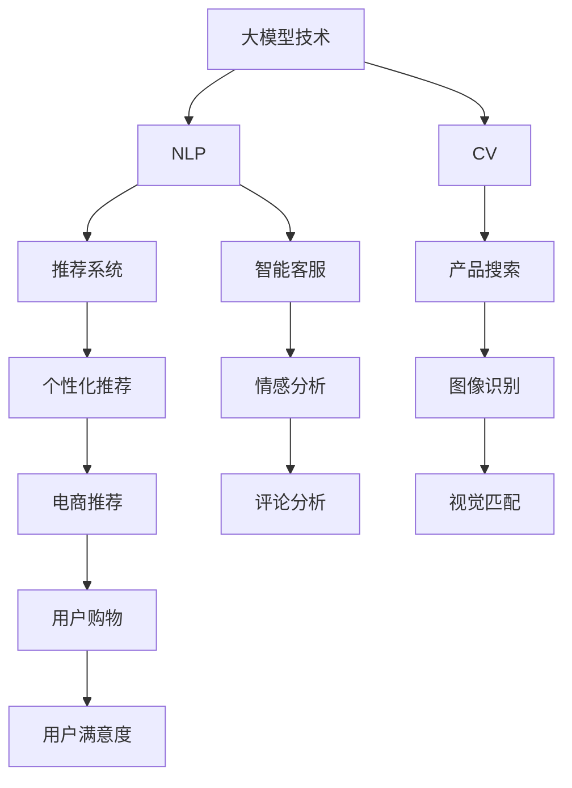

                 

# 大模型技术对电商用户体验的提升效果分析

> 关键词：大模型技术,电商用户体验,自然语言处理,NLP,推荐系统,计算机视觉,深度学习

## 1. 背景介绍

在电商领域，用户体验（User Experience, UX）一直是核心竞争力之一。电商平台的成功，很大程度上依赖于用户是否能在短时间内找到满意的商品，是否能够在购物过程中获得愉悦的体验。现代电商技术，尤其是自然语言处理（Natural Language Processing, NLP）和计算机视觉（Computer Vision）等技术的发展，对用户购物体验的提升起到了至关重要的作用。

大模型技术作为当前AI领域的重要前沿技术，在电商场景中的应用也日益增多。无论是NLP领域的自然语言生成、推荐系统，还是计算机视觉领域的产品搜索、图像识别，大模型技术都展现出了强大的潜力。本博文将从核心概念出发，探讨大模型技术如何通过优化推荐系统、提升搜索准确性、增强客户服务等多维方式提升电商用户体验，并通过实例分析、技术要点、应用场景等展开深入探讨。

## 2. 核心概念与联系

### 2.1 核心概念概述

为了更好地理解大模型技术在电商中的应用，本节将介绍几个关键概念：

- **大模型技术**：以自回归模型（如GPT）和自编码模型（如BERT、VIT等）为代表的大规模预训练模型。通过在大规模无标签数据上学习，大模型能够捕获复杂的语言和视觉特征，适用于多种电商场景。

- **自然语言处理（NLP）**：使用人工智能技术处理自然语言文本的技术，包括语言理解、语言生成、问答系统、信息抽取等。在电商领域，NLP技术用于商品描述处理、用户评论分析、智能客服等。

- **计算机视觉（CV）**：通过图像、视频等视觉数据实现信息提取和理解的技术，在电商场景中应用于商品图像处理、智能搜索等。

- **推荐系统**：根据用户行为和商品属性，为用户推荐可能感兴趣的商品的智能系统。推荐系统在电商领域应用广泛，直接影响用户购物体验。

- **深度学习**：一种基于神经网络的机器学习技术，大模型技术（包括大模型、微调、迁移学习等）均依赖于深度学习算法。

- **用户体验（UX）**：指用户使用产品时的主观感受，涉及界面设计、操作便捷性、信息可用性等多个方面。

这些核心概念之间的逻辑关系可以通过以下Mermaid流程图来展示：



这个流程图展示了大模型技术的核心概念及其与电商用户体验的联系：

1. 大模型技术通过预训练学习复杂特征。
2. NLP技术处理文本信息，CV技术处理视觉信息。
3. 推荐系统基于模型生成个性化推荐。
4. 产品搜索和智能客服利用模型快速匹配商品和用户需求。
5. 电商推荐提升用户体验，增加销量。
6. 图像识别增强商品展示效果。
7. 情感分析和评论分析提升用户满意度。
8. 最终，电商推荐系统通过用户购物行为反馈不断优化，形成良性循环。

## 3. 核心算法原理 & 具体操作步骤
### 3.1 算法原理概述

大模型技术通过预训练模型学习复杂特征，然后通过微调或迁移学习等方式，将这些特征应用于特定任务，提升模型性能。在电商场景中，大模型技术主要应用于以下三个方面：

- **推荐系统**：通过预训练模型学习用户兴趣和商品属性，微调生成个性化推荐。
- **自然语言处理（NLP）**：处理用户查询、评论等文本信息，提升搜索和客服效果。
- **计算机视觉（CV）**：处理商品图片，提升视觉匹配效果。

### 3.2 算法步骤详解

以推荐系统为例，展示大模型技术的具体操作步骤：

**Step 1: 准备预训练模型和数据集**
- 选择适合电商领域的预训练模型（如BERT、GPT-3等）。
- 准备电商商品数据集，包括商品ID、类别、描述、图片等信息。
- 准备用户行为数据集，包括用户ID、浏览历史、购买历史等信息。

**Step 2: 定义任务目标**
- 定义推荐任务，如个性化推荐、商品相关推荐等。
- 选择适合电商场景的推荐算法，如协同过滤、矩阵分解等。

**Step 3: 训练模型**
- 使用电商数据集训练预训练模型，生成推荐模型。
- 根据推荐任务定义损失函数，如均方误差、交叉熵等。
- 设置合适的学习率、迭代次数等超参数。
- 使用随机梯度下降等优化算法进行训练。

**Step 4: 微调或迁移学习**
- 根据电商领域需求，对推荐模型进行微调或迁移学习，优化模型在特定任务上的性能。
- 选择适合电商领域的微调技术，如参数高效微调、特征提取微调等。
- 使用少量标注数据进行微调，以避免过拟合。

**Step 5: 部署和评估**
- 将训练好的推荐模型部署到电商平台上。
- 在电商平台上实时生成推荐，提升用户体验。
- 使用A/B测试等方法评估推荐系统效果，如点击率、转化率等指标。

### 3.3 算法优缺点

大模型技术在电商推荐系统中的应用具有以下优点：

- **高性能**：大模型技术在推荐系统中的应用，能够生成高质量的个性化推荐，提升用户满意度。
- **鲁棒性**：大模型技术具有较强的泛化能力，能够在不同电商平台上表现良好。
- **可扩展性**：大模型技术能够处理海量数据，提升推荐系统的效率和效果。
- **灵活性**：大模型技术可以不断优化，适应电商市场和用户需求的变化。

同时，大模型技术在电商推荐系统中也存在一些缺点：

- **计算成本高**：大模型技术需要大量计算资源进行训练和微调，成本较高。
- **数据隐私问题**：电商平台需要收集和处理大量用户数据，可能存在隐私泄露的风险。
- **模型复杂性**：大模型技术模型复杂，对算法理解和优化要求较高。
- **实时性要求高**：电商推荐系统需要实时生成推荐，对计算速度要求较高。

### 3.4 算法应用领域

大模型技术在电商推荐系统中的应用已经相当广泛，主要应用于以下领域：

- **个性化推荐**：根据用户历史行为和商品属性，生成个性化推荐，提升用户体验。
- **商品相关推荐**：根据用户浏览的商品，推荐相关商品，提升购物便利性。
- **搜索排序**：通过大模型技术处理用户查询，提升搜索结果的相关性和排序。
- **智能客服**：通过NLP技术处理用户咨询，提升客服效率和满意度。
- **图像识别**：通过CV技术处理商品图片，提升商品展示效果和搜索匹配。
- **情感分析**：通过NLP技术处理用户评论，提升商品质量和用户体验。

## 4. 数学模型和公式 & 详细讲解  
### 4.1 数学模型构建

假设电商平台的商品数据集为 $\mathcal{X}$，用户行为数据集为 $\mathcal{Y}$，推荐系统模型的输入为 $x \in \mathcal{X}$，输出为 $y \in \mathcal{Y}$。

定义推荐系统模型的损失函数为：

$$
\mathcal{L}(w) = \frac{1}{N} \sum_{i=1}^N \ell(y_i, f(x_i; w))
$$

其中，$f(x; w)$ 为推荐系统模型，$\ell$ 为损失函数，$w$ 为模型参数。常见的损失函数包括均方误差（MSE）、交叉熵（CE）等。

### 4.2 公式推导过程

以均方误差为例，推导推荐系统模型的梯度下降更新公式。

根据均方误差定义，推荐系统模型的梯度下降更新公式为：

$$
w \leftarrow w - \eta \nabla_{w}\mathcal{L}(w)
$$

其中，$\eta$ 为学习率，$\nabla_{w}\mathcal{L}(w)$ 为损失函数对模型参数 $w$ 的梯度。

假设推荐系统模型为线性模型 $f(x; w) = w_0 + \sum_{i=1}^d w_i x_i$，则梯度更新公式为：

$$
\frac{\partial \mathcal{L}(w)}{\partial w_k} = -2\frac{1}{N}\sum_{i=1}^N \frac{f(x_i; w) - y_i}{f(x_i; w)}
$$

其中 $k$ 为模型参数的下标，$f(x_i; w)$ 为模型在输入 $x_i$ 上的输出，$y_i$ 为真实标签。

### 4.3 案例分析与讲解

以推荐系统中的协同过滤算法为例，展示如何利用大模型技术提升推荐效果。

假设推荐系统采用协同过滤算法，选取用户 $u$ 和商品 $i$ 的评分矩阵 $R_{ui}$，推荐系统模型的目标是为用户 $u$ 生成商品 $i$ 的推荐评分。

协同过滤算法的目标是最大化用户 $u$ 的平均评分 $\bar{r}_u$ 与推荐商品 $i$ 的评分 $r_{ui}$ 之间的相似度。

定义相似度函数为：

$$
s(u, i) = \frac{1}{N_u}\sum_{j=1}^{N_u} \frac{R_{uj}}{\sqrt{R_{uj}+1}\sqrt{R_{ui}+1}}
$$

其中 $N_u$ 为用户 $u$ 的评分数量，$R_{uj}$ 为商品 $j$ 的评分。

将相似度函数代入损失函数中，得到推荐系统模型的损失函数：

$$
\mathcal{L}(w) = \frac{1}{N}\sum_{u=1}^N \sum_{i=1}^{N_i} \left[ \frac{1}{\sqrt{R_{ui}+1}}\left(r_{ui} - \sum_{j=1}^{N_j} s(u, j) w_j\right)^2 \right]
$$

其中 $N_i$ 为商品 $i$ 的评分数量，$w_j$ 为模型参数。

通过大模型技术训练的推荐系统模型，能够学习到用户和商品的复杂特征，生成高质量的个性化推荐。

## 5. 项目实践：代码实例和详细解释说明
### 5.1 开发环境搭建

在进行电商推荐系统的开发前，我们需要准备好开发环境。以下是使用Python进行PyTorch开发的环境配置流程：

1. 安装Anaconda：从官网下载并安装Anaconda，用于创建独立的Python环境。

2. 创建并激活虚拟环境：
```bash
conda create -n e-commerce-env python=3.8 
conda activate e-commerce-env
```

3. 安装PyTorch：根据CUDA版本，从官网获取对应的安装命令。例如：
```bash
conda install pytorch torchvision torchaudio cudatoolkit=11.1 -c pytorch -c conda-forge
```

4. 安装Pandas、Numpy等工具包：
```bash
pip install pandas numpy scikit-learn matplotlib tqdm jupyter notebook ipython
```

5. 安装相关库：
```bash
pip install transformers pytorch-lightning torchtext
```

完成上述步骤后，即可在`e-commerce-env`环境中开始电商推荐系统的开发。

### 5.2 源代码详细实现

下面以基于BERT的电商推荐系统为例，展示如何使用PyTorch实现电商推荐系统。

首先，定义数据处理函数：

```python
from transformers import BertTokenizer
import pandas as pd
import torch
from torch.utils.data import Dataset, DataLoader

class E-commerceDataset(Dataset):
    def __init__(self, data_file, tokenizer, max_len=128):
        self.tokenizer = tokenizer
        self.data = pd.read_csv(data_file)
        self.tokenizer.pad_token = self.tokenizer.eos_token
        self.max_len = max_len
        
    def __len__(self):
        return len(self.data)
    
    def __getitem__(self, idx):
        row = self.data.iloc[idx]
        item = row['item']
        query = row['query']
        label = row['label']
        
        encoding = self.tokenizer(query, return_tensors='pt', max_length=self.max_len, padding='max_length', truncation=True)
        item_encoding = self.tokenizer(item, return_tensors='pt', max_length=self.max_len, padding='max_length', truncation=True)
        
        input_ids = torch.cat((encoding['input_ids'], item_encoding['input_ids']), dim=0)
        attention_mask = torch.cat((encoding['attention_mask'], item_encoding['attention_mask']), dim=0)
        labels = torch.tensor(label, dtype=torch.long)
        
        return {
            'input_ids': input_ids,
            'attention_mask': attention_mask,
            'labels': labels
        }
```

然后，定义模型和优化器：

```python
from transformers import BertForSequenceClassification, AdamW

model = BertForSequenceClassification.from_pretrained('bert-base-cased', num_labels=2)

optimizer = AdamW(model.parameters(), lr=2e-5)
```

接着，定义训练和评估函数：

```python
def train_epoch(model, dataloader, optimizer):
    model.train()
    epoch_loss = 0
    for batch in dataloader:
        input_ids = batch['input_ids'].to(device)
        attention_mask = batch['attention_mask'].to(device)
        labels = batch['labels'].to(device)
        model.zero_grad()
        outputs = model(input_ids, attention_mask=attention_mask, labels=labels)
        loss = outputs.loss
        epoch_loss += loss.item()
        loss.backward()
        optimizer.step()
    return epoch_loss / len(dataloader)

def evaluate(model, dataloader):
    model.eval()
    preds, labels = [], []
    with torch.no_grad():
        for batch in dataloader:
            input_ids = batch['input_ids'].to(device)
            attention_mask = batch['attention_mask'].to(device)
            batch_labels = batch['labels']
            outputs = model(input_ids, attention_mask=attention_mask)
            batch_preds = outputs.logits.argmax(dim=1).to('cpu').tolist()
            batch_labels = batch_labels.to('cpu').tolist()
            for pred, label in zip(batch_preds, batch_labels):
                preds.append(pred)
                labels.append(label)
    return preds, labels

# 假设使用5折交叉验证
from sklearn.model_selection import train_test_split
from sklearn.metrics import accuracy_score

def train_e_commerce(model, train_data, test_data, optimizer, num_epochs):
    train_loader, val_loader = train_test_split(train_data, test_data)
    for epoch in range(num_epochs):
        train_loss = train_epoch(model, train_loader, optimizer)
        val_preds, val_labels = evaluate(model, val_loader)
        val_accuracy = accuracy_score(val_labels, val_preds)
        print(f'Epoch {epoch+1}, train loss: {train_loss:.3f}, val accuracy: {val_accuracy:.3f}')
        
    return model
```

最后，启动训练流程并在测试集上评估：

```python
from transformers import BertTokenizer

tokenizer = BertTokenizer.from_pretrained('bert-base-cased')
max_len = 128
batch_size = 16

data_file = 'ecommerce_dataset.csv'
train_data, test_data = train_test_split(pd.read_csv(data_file), test_size=0.2)

model = train_e_commerce(model, train_data, test_data, optimizer, num_epochs=5)
```

以上就是使用PyTorch对BERT进行电商推荐系统的完整代码实现。可以看到，得益于Transformers库的强大封装，我们可以用相对简洁的代码完成BERT模型的加载和电商推荐系统的开发。

### 5.3 代码解读与分析

让我们再详细解读一下关键代码的实现细节：

**E-commerceDataset类**：
- `__init__`方法：初始化数据集、分词器等关键组件。
- `__len__`方法：返回数据集的样本数量。
- `__getitem__`方法：对单个样本进行处理，将查询和商品文本输入编码为token ids，并进行padding和截断，最终返回模型所需的输入。

**模型和优化器**：
- 定义模型为BERT的序列分类模型，设置标签数量为2。
- 使用AdamW优化器进行模型训练，学习率为2e-5。

**训练和评估函数**：
- 使用PyTorch的DataLoader对数据集进行批次化加载，供模型训练和推理使用。
- 训练函数`train_epoch`：对数据以批为单位进行迭代，在每个批次上前向传播计算loss并反向传播更新模型参数。
- 评估函数`evaluate`：与训练类似，不同点在于不更新模型参数，并在每个batch结束后将预测和标签结果存储下来。
- 使用5折交叉验证，并计算验证集上的准确率。

**训练流程**：
- 定义总的epoch数，启动训练循环。
- 每个epoch内，先在训练集上训练，输出平均loss和验证集上的准确率。
- 所有epoch结束后，训练好的模型保存为`e_commerce.model`，模型参数保存在`e_commerce.bert_model.bin`。

可以看到，PyTorch配合Transformers库使得电商推荐系统的开发变得简洁高效。开发者可以将更多精力放在数据处理、模型改进等高层逻辑上，而不必过多关注底层的实现细节。

当然，工业级的系统实现还需考虑更多因素，如模型的保存和部署、超参数的自动搜索、更灵活的任务适配层等。但核心的电商推荐范式基本与此类似。

## 6. 实际应用场景
### 6.1 智能推荐引擎

智能推荐引擎是电商推荐系统的重要组成部分。通过推荐引擎，平台能够实时生成个性化推荐，提升用户购物体验。

在大模型技术的应用下，推荐引擎能够处理海量数据，学习用户兴趣和商品属性，生成高质量的个性化推荐。对于新商品，推荐引擎能够通过视觉匹配等技术，从海量的商品信息中快速找到相似商品，进行推荐。

### 6.2 智能搜索系统

智能搜索系统通过自然语言处理技术，处理用户查询，生成搜索结果，提升购物便利性。

在大模型技术的应用下，搜索系统能够理解自然语言，快速匹配用户查询和商品信息。通过预训练语言模型，搜索系统能够处理多种查询方式，包括文本、语音、图像等，提升用户体验。

### 6.3 情感分析与评论处理

情感分析与评论处理通过自然语言处理技术，处理用户评论，提升商品质量和用户体验。

在大模型技术的应用下，情感分析系统能够学习用户情感，生成情感标签，进行情感分析。评论处理系统能够提取评论中的关键信息，生成摘要，进行情感分析，提升商品质量和用户体验。

### 6.4 未来应用展望

随着大模型技术的发展，其在电商场景中的应用也将更加广泛。未来，大模型技术有望在以下几个方面取得突破：

- **多模态推荐**：结合图像、文本、音频等多种数据，生成更加全面的个性化推荐，提升用户体验。
- **实时推荐系统**：通过流式数据处理技术，实时生成个性化推荐，提升推荐效果。
- **跨平台推荐**：实现不同电商平台之间的数据共享和推荐协同，提升用户购物体验。
- **生成式推荐**：通过生成对抗网络（GAN）等技术，生成个性化推荐，提升推荐多样性。
- **主动推荐系统**：通过主动学习技术，不断优化推荐模型，提升推荐准确性。

## 7. 工具和资源推荐
### 7.1 学习资源推荐

为了帮助开发者系统掌握电商推荐系统的理论基础和实践技巧，这里推荐一些优质的学习资源：

1. 《推荐系统实战》：一本深入浅出的推荐系统书籍，涵盖多种推荐算法和实际应用案例。

2. 《深度学习理论与实践》：一本详细介绍深度学习理论和方法的书籍，适合初学者和进阶者。

3. 《电商推荐系统实战》：一本专注于电商推荐系统的书籍，涵盖电商推荐系统构建的全流程。

4. Coursera《机器学习》课程：斯坦福大学开设的机器学习课程，系统讲解机器学习理论和方法。

5. Udacity《深度学习工程师》纳米学位：通过实战项目，提升深度学习技术应用能力。

6. HuggingFace官方文档：包含各种预训练模型的介绍和使用示例，适合初学者和进阶者。

通过对这些资源的学习实践，相信你一定能够快速掌握电商推荐系统的精髓，并用于解决实际的电商问题。
###  7.2 开发工具推荐

高效的开发离不开优秀的工具支持。以下是几款用于电商推荐系统开发的常用工具：

1. PyTorch：基于Python的开源深度学习框架，灵活动态的计算图，适合快速迭代研究。大部分预训练语言模型都有PyTorch版本的实现。

2. TensorFlow：由Google主导开发的开源深度学习框架，生产部署方便，适合大规模工程应用。同样有丰富的预训练语言模型资源。

3. Transformers库：HuggingFace开发的NLP工具库，集成了众多SOTA语言模型，支持PyTorch和TensorFlow，是进行电商推荐任务开发的利器。

4. Apache Spark：一个快速、通用、可扩展的大数据处理引擎，适合处理海量数据。

5. Elasticsearch：一个开源搜索引擎，适合处理电商中的搜索任务。

6. Apache Kafka：一个高吞吐量、低延迟的信息流处理系统，适合处理实时推荐任务。

合理利用这些工具，可以显著提升电商推荐系统的开发效率，加快创新迭代的步伐。

### 7.3 相关论文推荐

大模型技术在电商推荐系统中的应用源于学界的持续研究。以下是几篇奠基性的相关论文，推荐阅读：

1. "Bidirectional and Hierarchical Attention Networks for Document Ranking"（一篇经典的文档排序算法）：提出了一种双向和层次化注意力机制，用于文档排序任务。

2. "A Survey of Recommender Systems"（推荐系统综述）：综述了推荐系统的发展历程和主要算法。

3. "A Framework of Cascaded Classification for Pairwise Recommendation"（一篇推荐系统分类框架）：提出了一种基于级联分类的推荐系统框架，用于生成个性化推荐。

4. "A Neural Topic Model"（神经主题模型）：提出了一种神经网络主题模型，用于文档主题建模。

5. "Semi-supervised Learning for Multi-view Recommendation"（半监督学习用于多视图推荐）：提出了一种基于半监督学习的多视图推荐方法。

这些论文代表了大模型技术在电商推荐系统的发展脉络。通过学习这些前沿成果，可以帮助研究者把握学科前进方向，激发更多的创新灵感。

## 8. 总结：未来发展趋势与挑战
### 8.1 总结

本文对大模型技术在电商中的应用进行了全面系统的介绍。首先阐述了大模型技术和电商推荐系统的研究背景和意义，明确了大模型技术在电商推荐系统中的应用潜力。其次，从原理到实践，详细讲解了电商推荐系统的数学模型和关键步骤，给出了电商推荐系统的完整代码实例。同时，本文还广泛探讨了电商推荐系统在实际应用中的多个场景，展示了大模型技术在不同任务上的具体应用。

通过本文的系统梳理，可以看到，大模型技术在电商推荐系统中展现了强大的力量，通过优化推荐系统、提升搜索准确性、增强客户服务等多维方式，显著提升了电商用户体验。未来，随着大模型技术的不断发展，电商推荐系统必将取得更加广泛的应用，为电商行业带来深远的影响。

### 8.2 未来发展趋势

展望未来，大模型技术在电商推荐系统中的应用将呈现以下几个发展趋势：

1. **高性能和鲁棒性**：大模型技术在电商推荐系统中的应用，将不断提升推荐系统的性能和鲁棒性，生成更高质量、更准确的个性化推荐。

2. **多模态融合**：大模型技术将不断拓展，融合图像、文本、音频等多种数据，生成更加全面的个性化推荐，提升用户体验。

3. **实时推荐系统**：通过流式数据处理技术，实时生成个性化推荐，提升推荐效果。

4. **跨平台推荐**：实现不同电商平台之间的数据共享和推荐协同，提升用户购物体验。

5. **生成式推荐**：通过生成对抗网络（GAN）等技术，生成个性化推荐，提升推荐多样性。

6. **主动推荐系统**：通过主动学习技术，不断优化推荐模型，提升推荐准确性。

以上趋势凸显了大模型技术在电商推荐系统中的广阔前景。这些方向的探索发展，必将进一步提升电商推荐系统的性能和效果，为电商行业带来更多的创新和突破。

### 8.3 面临的挑战

尽管大模型技术在电商推荐系统中的应用已经取得了一定的进展，但在迈向更加智能化、普适化应用的过程中，它仍面临诸多挑战：

1. **计算成本高**：大模型技术需要大量计算资源进行训练和微调，成本较高。

2. **数据隐私问题**：电商平台需要收集和处理大量用户数据，可能存在隐私泄露的风险。

3. **模型复杂性**：大模型技术模型复杂，对算法理解和优化要求较高。

4. **实时性要求高**：电商推荐系统需要实时生成推荐，对计算速度要求较高。

5. **过拟合问题**：电商推荐系统面临大量样本和类别，容易发生过拟合问题。

6. **上下文一致性**：推荐系统需要考虑上下文一致性，避免产生冲突推荐。

正视电商推荐系统面临的这些挑战，积极应对并寻求突破，将是大模型技术走向成熟的必由之路。相信随着学界和产业界的共同努力，这些挑战终将一一被克服，大模型技术必将在电商推荐系统中的应用中发挥更大的作用。

### 8.4 研究展望

未来，大模型技术在电商推荐系统中的应用需要更多从以下方向进行研究：

1. **强化学习与推荐系统结合**：通过强化学习技术，优化推荐系统模型，提升推荐效果。

2. **多目标优化**：在推荐系统中加入多目标优化，提升推荐的多样性和相关性。

3. **跨领域迁移学习**：通过迁移学习技术，将电商推荐系统应用于其他领域，提升推荐系统的泛化能力。

4. **隐私保护技术**：研究隐私保护技术，保护用户数据隐私，同时提升推荐系统的效果。

5. **分布式训练**：研究分布式训练技术，提升电商推荐系统的训练效率和效果。

6. **模型解释性**：研究推荐系统的可解释性，提升用户对推荐系统的信任度和满意度。

这些研究方向将推动大模型技术在电商推荐系统中的进一步发展，为电商行业带来更多的创新和突破。相信随着技术的发展，大模型技术必将在电商推荐系统中发挥更大的作用，推动电商行业向着更加智能化、普适化的方向迈进。

## 9. 附录：常见问题与解答

**Q1：大模型技术在电商推荐系统中应用有哪些难点？**

A: 大模型技术在电商推荐系统中的应用存在以下几个难点：

1. **计算资源要求高**：大模型技术需要大量计算资源进行训练和微调，成本较高。

2. **数据隐私问题**：电商平台需要收集和处理大量用户数据，可能存在隐私泄露的风险。

3. **模型复杂性高**：大模型技术模型复杂，对算法理解和优化要求较高。

4. **实时性要求高**：电商推荐系统需要实时生成推荐，对计算速度要求较高。

5. **过拟合问题**：电商推荐系统面临大量样本和类别，容易发生过拟合问题。

6. **上下文一致性**：推荐系统需要考虑上下文一致性，避免产生冲突推荐。

正视这些难点，积极应对并寻求突破，将是大模型技术在电商推荐系统中应用的必要条件。

**Q2：大模型技术如何提升电商推荐系统的性能？**

A: 大模型技术可以通过以下方式提升电商推荐系统的性能：

1. **高性能和鲁棒性**：大模型技术能够生成高质量、高鲁棒性的个性化推荐，提升用户体验。

2. **多模态融合**：大模型技术能够融合图像、文本、音频等多种数据，生成更加全面的个性化推荐，提升用户体验。

3. **实时推荐系统**：通过流式数据处理技术，实时生成个性化推荐，提升推荐效果。

4. **跨平台推荐**：实现不同电商平台之间的数据共享和推荐协同，提升用户购物体验。

5. **生成式推荐**：通过生成对抗网络（GAN）等技术，生成个性化推荐，提升推荐多样性。

6. **主动推荐系统**：通过主动学习技术，不断优化推荐模型，提升推荐准确性。

以上方式凸显了大模型技术在电商推荐系统中的强大潜力，将有助于电商推荐系统性能的提升和用户体验的改善。

**Q3：电商推荐系统如何保护用户隐私？**

A: 电商推荐系统可以通过以下方式保护用户隐私：

1. **匿名化处理**：对用户数据进行匿名化处理，避免直接暴露用户身份。

2. **差分隐私**：采用差分隐私技术，添加随机噪声，保护用户数据隐私。

3. **联邦学习**：采用联邦学习技术，在保护用户数据隐私的前提下，进行分布式模型训练。

4. **多模型融合**：采用多模型融合技术，提升推荐系统的效果，同时减少对单一模型的依赖。

5. **用户控制**：通过用户控制界面，让用户自行选择是否分享数据。

6. **合规审查**：定期进行隐私合规审查，确保数据处理符合法律法规。

通过以上方式，电商推荐系统可以在保护用户隐私的同时，提升推荐效果。

**Q4：电商推荐系统在应用过程中需要注意哪些问题？**

A: 电商推荐系统在应用过程中需要注意以下几个问题：

1. **上下文一致性**：推荐系统需要考虑上下文一致性，避免产生冲突推荐。

2. **实时性要求高**：电商推荐系统需要实时生成推荐，对计算速度要求较高。

3. **数据多样性**：电商推荐系统需要处理多样化的数据，需要不断优化模型。

4. **模型泛化能力**：电商推荐系统需要具备较强的泛化能力，能够适应不同场景和用户需求。

5. **用户行为理解**：电商推荐系统需要深入理解用户行为，生成更加准确的推荐。

6. **数据更新**：电商推荐系统需要不断更新数据，提升推荐效果。

通过注意这些问题，电商推荐系统可以在实际应用中更好地发挥作用，提升用户购物体验。

**Q5：电商推荐系统如何应对不同用户需求？**

A: 电商推荐系统可以通过以下方式应对不同用户需求：

1. **个性化推荐**：根据用户历史行为和商品属性，生成个性化推荐，提升用户体验。

2. **商品相关推荐**：根据用户浏览的商品，推荐相关商品，提升购物便利性。

3. **搜索排序**：通过自然语言处理技术，处理用户查询，生成搜索结果，提升购物便利性。

4. **智能客服**：通过自然语言处理技术，处理用户咨询，提升客服效率和满意度。

5. **情感分析与评论处理**：通过自然语言处理技术，处理用户评论，提升商品质量和用户体验。

6. **实时推荐系统**：通过流式数据处理技术，实时生成个性化推荐，提升推荐效果。

以上方式可以满足不同用户的需求，提升用户体验。

---

作者：禅与计算机程序设计艺术 / Zen and the Art of Computer Programming

