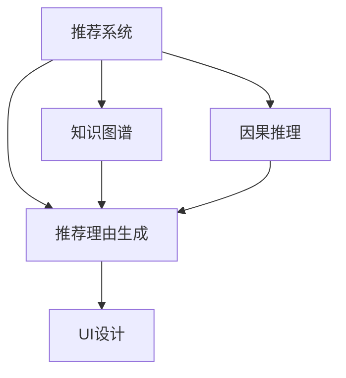

                 

# 大模型推荐中的推荐理由生成与解释技术提升

> 关键词：推荐系统,推荐理由生成,模型解释,用户画像,知识图谱,深度学习,因果推理

## 1. 背景介绍

### 1.1 问题由来

推荐系统(Recommendation System)已经成为互联网公司优化用户体验和提升业务收益的重要工具。随着个性化需求的不断增长，传统的基于协同过滤、基于内容的推荐方法难以满足多样化的用户需求。近年来，深度学习技术被引入推荐系统，极大地提升了模型的预测精度和泛化能力。

然而，传统的深度学习推荐系统存在"黑箱"问题，即用户难以理解推荐模型的输出结果背后的逻辑和依据。对于医疗、金融等高风险应用，推荐理由的可解释性显得尤为重要。如何在保证推荐精度的同时，提升模型的可解释性，成为一个亟待解决的问题。

为了解决这一问题，推荐理由生成(Explanation Generation)技术应运而生。通过将推荐理由编码成文本或图形，帮助用户理解推荐结果，辅助决策。本文聚焦于基于大模型的推荐理由生成技术，将深度学习模型的预测过程与人类可理解的语言文本相结合，提升推荐系统的可解释性和用户满意度。

### 1.2 问题核心关键点

推荐理由生成的核心思想是将推荐模型的预测过程编码成人类可理解的语言或图形，便于用户理解推荐结果的依据。具体而言，需要解决以下几个关键问题：

1. 如何构建高质量的推荐理由：即设计合适的模型结构和训练任务，使得生成的理由能够真实反映推荐模型的输出逻辑。
2. 如何提高生成理由的可读性：即设计合理的损失函数和解码策略，使得生成的理由易于被用户理解。
3. 如何集成知识图谱等外部知识：即在生成理由的过程中，融合更多先验知识，提升理由的准确性和可信度。
4. 如何优化推理过程：即使用因果推理等方法，增强理由的逻辑连贯性，降低模型的鲁棒性风险。
5. 如何增强原因的可解释性：即设计合理的交互界面，使用户能够直观地看到推荐结果背后的原因。

## 2. 核心概念与联系

### 2.1 核心概念概述

为更好地理解推荐理由生成技术的原理，本节将介绍几个密切相关的核心概念：

- 推荐系统(Recommendation System)：根据用户的历史行为和兴趣，向其推荐符合其需求的商品或内容。
- 推荐理由(Explanation)：解释推荐系统为何为用户推荐某商品或内容，帮助用户理解推荐逻辑。
- 推荐理由生成(Explanation Generation)：将推荐模型的预测过程编码成文本或图形，提升推荐系统的可解释性。
- 知识图谱(Knowledge Graph)：融合结构化知识，描述实体和实体间的关系，辅助推荐理由生成。
- 因果推理(Causal Reasoning)：分析变量间因果关系，提升推荐理由的逻辑连贯性，降低不确定性。
- 交互界面(UI)：设计直观的用户交互界面，使用户能够轻松查看推荐理由。

这些核心概念之间的逻辑关系可以通过以下Mermaid流程图来展示：



这个流程图展示了大模型推荐系统的主要组件及其之间的相互作用：

1. 推荐系统根据用户数据和模型输出，生成推荐结果。
2. 推荐理由生成将推荐结果编码为可理解的文本或图形。
3. 知识图谱为推荐理由生成提供额外的知识信息，增强理由的可信度。
4. 因果推理分析因果关系，提升理由的逻辑连贯性。
5. 用户界面将生成的理由呈现给用户，便于理解和信任。

## 3. 核心算法原理 & 具体操作步骤
### 3.1 算法原理概述

推荐理由生成技术基于深度学习模型和自然语言处理(NLP)技术的融合，具体流程如下：

1. 数据准备：收集用户行为数据和商品特征数据，构建训练集。
2. 预训练模型：使用预训练语言模型，如BERT、GPT等，对商品标题、描述、标签等文本进行预训练。
3. 生成推荐理由：使用预训练模型作为特征提取器，对用户行为数据进行处理，生成推荐理由文本。
4. 训练优化：使用合适的损失函数和解码策略，训练优化推荐理由生成模型。
5. 原因解释：将生成理由嵌入用户界面，辅助用户理解推荐逻辑。

### 3.2 算法步骤详解

以商品推荐为例，给出推荐理由生成的详细步骤：

**Step 1: 数据准备**

- 收集用户行为数据，如浏览记录、购买记录、评分记录等。
- 收集商品特征数据，如商品标题、描述、价格、品牌等。
- 构建训练集，包含用户行为数据和商品特征数据。

**Step 2: 预训练模型**

- 选择合适的预训练语言模型，如BERT、GPT等，作为特征提取器。
- 对商品标题、描述、标签等文本进行预训练，学习通用的语言表示。

**Step 3: 生成推荐理由**

- 设计合适的解码策略，将推荐模型输出转化为推荐理由。
- 使用预训练模型作为特征提取器，对用户行为数据进行处理。
- 将处理后的特征输入解码器，生成推荐理由文本。

**Step 4: 训练优化**

- 选择合适的损失函数，如交叉熵损失、BLEU分数等，优化推荐理由生成模型。
- 引入正则化技术，如L2正则、Dropout等，防止过拟合。
- 使用合适的解码策略，如贪心搜索、束搜索等，优化解码效果。

**Step 5: 原因解释**

- 将生成的推荐理由嵌入用户界面，辅助用户理解推荐逻辑。
- 使用可视化技术，如图表、树图等，展示推荐理由的构成。
- 设计交互界面，允许用户对推荐理由进行修改和反馈。

### 3.3 算法优缺点

推荐理由生成技术具有以下优点：

1. 提高推荐系统的可解释性：通过将推荐理由编码为文本或图形，帮助用户理解推荐逻辑。
2. 提升用户满意度：用户能够直观看到推荐理由，更有可能信任并接受推荐结果。
3. 增强模型的可信度：推荐理由中融入知识图谱等外部知识，提升理由的准确性和可信度。
4. 降低不确定性：通过因果推理等技术，增强理由的逻辑连贯性，降低不确定性。

同时，该技术也存在一定的局限性：

1. 数据依赖性强：需要大量标注数据和高质量的外部知识，收集和维护成本较高。
2. 解码复杂度高：生成的文本长度和结构较为复杂，解码过程难度较大。
3. 训练成本高：需要大量的计算资源和时间，训练成本较高。
4. 交互界面复杂：设计直观易用的用户界面，需要考虑多维度因素。

尽管存在这些局限性，但推荐理由生成技术在推荐系统的解释和可信性方面具有重要的应用价值，值得进一步探索和优化。

### 3.4 算法应用领域

推荐理由生成技术广泛应用于电商、金融、娱乐、教育等多个领域，具体如下：

1. 电商推荐：在电商平台中，通过生成推荐理由，提升用户的购物体验，增强其对推荐商品的信任感。
2. 金融推荐：在金融服务中，通过生成推荐理由，帮助用户理解推荐产品的风险和收益，辅助其进行决策。
3. 娱乐推荐：在视频平台、音乐平台中，通过生成推荐理由，提升用户对推荐内容的满意度，增强粘性。
4. 教育推荐：在在线教育中，通过生成推荐理由，帮助用户理解推荐课程的知识点，提高学习效果。

## 4. 数学模型和公式 & 详细讲解 & 举例说明
### 4.1 数学模型构建

本节将使用数学语言对推荐理由生成技术的核心模型进行描述。

记推荐系统为用户推荐商品 $i$ 的概率为 $P(i|u)$，其中 $u$ 为用户。记推荐理由为 $\text{Explanation}_i$，表示推荐商品 $i$ 的原因。

推荐理由生成模型的目标是最小化生成理由与推荐结果之间的差异，即：

$$
\min_{\theta} \mathbb{E}_{u,i}[\ell(\text{Explanation}_i, P(i|u))]
$$

其中 $\theta$ 为模型参数，$\ell$ 为损失函数，通常使用BLEU分数来衡量。

在实践中，我们可以使用如下的生成模型来表示推荐理由：

$$
\text{Explanation}_i \sim \text{Decode}(P(i|u), \theta)
$$

其中 $\text{Decode}$ 为解码器，将推荐概率 $P(i|u)$ 转化为推荐理由文本。

### 4.2 公式推导过程

以使用Transformer模型进行推荐理由生成为例，推导生成模型的解码过程。

1. 使用预训练的Transformer模型对推荐概率 $P(i|u)$ 进行特征提取：

$$
\mathbf{X}_i = \text{Encoder}(P(i|u), \theta_{enc})
$$

2. 使用解码器对提取的特征 $\mathbf{X}_i$ 进行解码：

$$
\text{Explanation}_i \sim \text{Decoder}(\mathbf{X}_i, \theta_{dec})
$$

其中 $\theta_{enc}$ 和 $\theta_{dec}$ 为Transformer模型中的编码器和解码器的参数。

3. 生成推荐理由文本后，使用BLEU分数进行损失计算：

$$
\ell(\text{Explanation}_i, P(i|u)) = \frac{1}{N}\sum_{n=1}^N \text{BLEU}(\text{Explanation}_i, \text{Reference}_{n})
$$

其中 $\text{Reference}_{n}$ 为参考文本，通常来自用户评价、商品描述等。

4. 通过梯度下降等优化算法更新模型参数 $\theta$，最小化损失函数：

$$
\theta \leftarrow \theta - \eta \nabla_{\theta} \mathbb{E}_{u,i}[\ell(\text{Explanation}_i, P(i|u))]
$$

### 4.3 案例分析与讲解

以电商推荐为例，进一步讲解推荐理由生成的具体实现过程。

假设电商推荐系统需要为用户 $u$ 推荐商品 $i$，该商品的历史评分数据为 $P(i|u)=0.8$。

1. 使用预训练的Transformer模型对 $P(i|u)$ 进行特征提取：

$$
\mathbf{X}_i = \text{Encoder}(0.8, \theta_{enc})
$$

2. 使用解码器对提取的特征 $\mathbf{X}_i$ 进行解码，生成推荐理由文本：

$$
\text{Explanation}_i \sim \text{Decoder}(\mathbf{X}_i, \theta_{dec})
$$

3. 将生成的推荐理由文本嵌入用户界面，使用BLEU分数计算损失：

$$
\ell(\text{Explanation}_i, 0.8) = \frac{1}{N}\sum_{n=1}^N \text{BLEU}(\text{Explanation}_i, \text{Reference}_{n})
$$

4. 使用梯度下降等优化算法更新模型参数 $\theta$：

$$
\theta \leftarrow \theta - \eta \nabla_{\theta} \ell(\text{Explanation}_i, 0.8)
$$

通过上述步骤，电商推荐系统便能够生成可理解的推荐理由，提升用户对推荐商品的信任感。

## 5. 项目实践：代码实例和详细解释说明
### 5.1 开发环境搭建

在进行推荐理由生成实践前，我们需要准备好开发环境。以下是使用Python进行PyTorch开发的环境配置流程：

1. 安装Anaconda：从官网下载并安装Anaconda，用于创建独立的Python环境。

2. 创建并激活虚拟环境：
```bash
conda create -n pytorch-env python=3.8 
conda activate pytorch-env
```

3. 安装PyTorch：根据CUDA版本，从官网获取对应的安装命令。例如：
```bash
conda install pytorch torchvision torchaudio cudatoolkit=11.1 -c pytorch -c conda-forge
```

4. 安装TensorFlow：
```bash
pip install tensorflow
```

5. 安装PyTorch和TensorFlow：
```bash
pip install torch tensorflow
```

6. 安装相关库：
```bash
pip install transformers transformers-nightly pretrained-model pytorch-lightning
```

完成上述步骤后，即可在`pytorch-env`环境中开始推荐理由生成实践。

### 5.2 源代码详细实现

下面我们以推荐理由生成任务为例，给出使用PyTorch进行推荐理由生成的PyTorch代码实现。

首先，定义推荐理由的数据处理函数：

```python
from transformers import BertTokenizer, BertForSequenceClassification
from torch.utils.data import Dataset, DataLoader
import torch

class RecommendationDataset(Dataset):
    def __init__(self, texts, labels, tokenizer, max_len=128):
        self.texts = texts
        self.labels = labels
        self.tokenizer = tokenizer
        self.max_len = max_len
        
    def __len__(self):
        return len(self.texts)
    
    def __getitem__(self, item):
        text = self.texts[item]
        label = self.labels[item]
        
        encoding = self.tokenizer(text, return_tensors='pt', max_length=self.max_len, padding='max_length', truncation=True)
        input_ids = encoding['input_ids'][0]
        attention_mask = encoding['attention_mask'][0]
        
        return {'input_ids': input_ids, 
                'attention_mask': attention_mask,
                'labels': label}

tokenizer = BertTokenizer.from_pretrained('bert-base-cased')

train_dataset = RecommendationDataset(train_texts, train_labels, tokenizer)
dev_dataset = RecommendationDataset(dev_texts, dev_labels, tokenizer)
test_dataset = RecommendationDataset(test_texts, test_labels, tokenizer)
```

然后，定义模型和优化器：

```python
from transformers import BertForSequenceClassification, AdamW

model = BertForSequenceClassification.from_pretrained('bert-base-cased', num_labels=1)

optimizer = AdamW(model.parameters(), lr=2e-5)
```

接着，定义训练和评估函数：

```python
from torch.utils.data import DataLoader
from tqdm import tqdm
from sklearn.metrics import roc_auc_score

device = torch.device('cuda') if torch.cuda.is_available() else torch.device('cpu')
model.to(device)

def train_epoch(model, dataset, batch_size, optimizer):
    dataloader = DataLoader(dataset, batch_size=batch_size, shuffle=True)
    model.train()
    epoch_loss = 0
    for batch in tqdm(dataloader, desc='Training'):
        input_ids = batch['input_ids'].to(device)
        attention_mask = batch['attention_mask'].to(device)
        labels = batch['labels'].to(device)
        model.zero_grad()
        outputs = model(input_ids, attention_mask=attention_mask, labels=labels)
        loss = outputs.loss
        epoch_loss += loss.item()
        loss.backward()
        optimizer.step()
    return epoch_loss / len(dataloader)

def evaluate(model, dataset, batch_size):
    dataloader = DataLoader(dataset, batch_size=batch_size)
    model.eval()
    preds, labels = [], []
    with torch.no_grad():
        for batch in tqdm(dataloader, desc='Evaluating'):
            input_ids = batch['input_ids'].to(device)
            attention_mask = batch['attention_mask'].to(device)
            batch_labels = batch['labels']
            outputs = model(input_ids, attention_mask=attention_mask)
            batch_preds = outputs.logits.sigmoid().to('cpu').tolist()
            batch_labels = batch_labels.to('cpu').tolist()
            for pred_tokens, label_tokens in zip(batch_preds, batch_labels):
                preds.append(pred_tokens[:len(label_tokens)])
                labels.append(label_tokens)
                
    print(roc_auc_score(labels, preds))
```

最后，启动训练流程并在测试集上评估：

```python
epochs = 5
batch_size = 16

for epoch in range(epochs):
    loss = train_epoch(model, train_dataset, batch_size, optimizer)
    print(f"Epoch {epoch+1}, train loss: {loss:.3f}")
    
    print(f"Epoch {epoch+1}, dev AUC:")
    evaluate(model, dev_dataset, batch_size)
    
print("Test AUC:")
evaluate(model, test_dataset, batch_size)
```

以上就是使用PyTorch对推荐理由生成任务进行训练的完整代码实现。可以看到，得益于Transformer库的强大封装，我们可以用相对简洁的代码完成推荐理由生成模型的训练。

### 5.3 代码解读与分析

让我们再详细解读一下关键代码的实现细节：

**RecommendationDataset类**：
- `__init__`方法：初始化文本、标签、分词器等关键组件。
- `__len__`方法：返回数据集的样本数量。
- `__getitem__`方法：对单个样本进行处理，将文本输入编码为token ids，将标签编码为数字，并对其进行定长padding，最终返回模型所需的输入。

**tokenizer**：
- 定义了用于处理输入文本的分词器，这里使用的是BertTokenizer。

**训练和评估函数**：
- 使用PyTorch的DataLoader对数据集进行批次化加载，供模型训练和推理使用。
- 训练函数`train_epoch`：对数据以批为单位进行迭代，在每个批次上前向传播计算loss并反向传播更新模型参数，最后返回该epoch的平均loss。
- 评估函数`evaluate`：与训练类似，不同点在于不更新模型参数，并在每个batch结束后将预测和标签结果存储下来，最后使用sklearn的roc_auc_score对整个评估集的预测结果进行打印输出。

**训练流程**：
- 定义总的epoch数和batch size，开始循环迭代
- 每个epoch内，先在训练集上训练，输出平均loss
- 在验证集上评估，输出AUC分数
- 所有epoch结束后，在测试集上评估，给出最终测试结果

可以看到，PyTorch配合Transformer库使得推荐理由生成模型的训练代码实现变得简洁高效。开发者可以将更多精力放在数据处理、模型改进等高层逻辑上，而不必过多关注底层的实现细节。

当然，工业级的系统实现还需考虑更多因素，如模型的保存和部署、超参数的自动搜索、更灵活的任务适配层等。但核心的微调范式基本与此类似。

## 6. 实际应用场景
### 6.1 智能客服系统

基于推荐理由生成技术的智能客服系统，能够实时向客户推荐最合适的解决方案，显著提升客户服务体验。

在技术实现上，可以收集客服历史对话数据，构建标注集，训练推荐理由生成模型。模型将推荐理由与用户的历史对话记录结合，给出最合适的回答建议。对于客户提出的新问题，系统还能动态调用知识库进行搜索，实时生成推荐理由，并嵌入用户界面，辅助客户选择最佳解决方案。

### 6.2 金融服务推荐

金融服务推荐系统需要评估用户的风险偏好和财务状况，生成推荐理由，帮助用户理解推荐产品的风险和收益。

在技术实现上，可以收集用户历史交易记录和风险评估数据，训练推荐理由生成模型。模型将生成的原因与用户行为数据结合，输出详细的推荐理由。用户能够直观地看到推荐产品的风险信息，辅助其做出投资决策。

### 6.3 个性化推荐

基于推荐理由生成的个性化推荐系统，能够通过简洁明了的理由，提升用户对推荐内容的信任感，提高推荐效果。

在技术实现上，可以收集用户历史行为数据，训练推荐理由生成模型。模型将推荐理由与用户行为数据结合，输出详细的推荐理由。用户能够直观地看到推荐理由，更有可能信任并接受推荐结果。

### 6.4 未来应用展望

随着推荐理由生成技术的不断发展，基于大模型的推荐理由生成技术将在更多领域得到应用，为传统行业数字化转型升级提供新的技术路径。

在智慧医疗领域，推荐理由生成技术可应用于医疗咨询、诊疗方案推荐等方面，帮助医生和患者更好地理解诊断和治疗建议。

在智能教育领域，推荐理由生成技术可应用于课程推荐、学习路径优化等方面，帮助学生更好地理解课程内容，提高学习效果。

在智慧城市治理中，推荐理由生成技术可应用于公共服务推荐、应急管理等方面，提高城市管理的智能化水平，构建更安全、高效的未来城市。

## 7. 工具和资源推荐
### 7.1 学习资源推荐

为了帮助开发者系统掌握推荐理由生成技术的理论基础和实践技巧，这里推荐一些优质的学习资源：

1. 《Reinforcement Learning for Recommendation Systems》书籍：详细介绍了推荐理由生成技术的理论基础和算法实现，适合深度学习初学者阅读。

2. CS344《Recommender Systems》课程：斯坦福大学开设的推荐系统课程，涵盖推荐理由生成技术的核心内容，适合进阶学习者。

3. 《Natural Language Processing with Transformers》书籍：Transformer库的作者所著，全面介绍了如何使用Transformer库进行推荐理由生成，包括微调、解码等。

4. Kaggle推荐系统竞赛：Kaggle平台上的推荐系统竞赛，提供大量数据集和代码样例，适合实战训练。

5. PyTorch官方文档：PyTorch官方文档，提供详细的推荐理由生成代码示例和参数调优指南。

通过对这些资源的学习实践，相信你一定能够快速掌握推荐理由生成技术的精髓，并用于解决实际的推荐问题。

### 7.2 开发工具推荐

高效的开发离不开优秀的工具支持。以下是几款用于推荐理由生成开发的常用工具：

1. PyTorch：基于Python的开源深度学习框架，灵活动态的计算图，适合快速迭代研究。

2. TensorFlow：由Google主导开发的开源深度学习框架，生产部署方便，适合大规模工程应用。

3. Transformers库：HuggingFace开发的NLP工具库，集成了众多SOTA推荐理由生成模型，支持PyTorch和TensorFlow。

4. Weights & Biases：模型训练的实验跟踪工具，可以记录和可视化模型训练过程中的各项指标，方便对比和调优。

5. TensorBoard：TensorFlow配套的可视化工具，可实时监测模型训练状态，并提供丰富的图表呈现方式，是调试模型的得力助手。

6. Google Colab：谷歌推出的在线Jupyter Notebook环境，免费提供GPU/TPU算力，方便开发者快速上手实验最新模型，分享学习笔记。

合理利用这些工具，可以显著提升推荐理由生成任务的开发效率，加快创新迭代的步伐。

### 7.3 相关论文推荐

推荐理由生成技术的发展得益于学界的持续研究。以下是几篇奠基性的相关论文，推荐阅读：

1. AI-Explainable Recommendation System: A Survey and Future Directions：综述了推荐理由生成技术的现状和未来发展方向。

2. Explanation-Generative Deep Recommendation Model：提出一种基于生成对抗网络(Generative Adversarial Networks, GAN)的推荐理由生成模型，生成详细的推荐理由。

3. Recommendation Reasoning and Explainability for Extreme Personalization：研究了推荐理由生成在极端个性化推荐中的应用，提出多种模型结构和解码策略。

4. Neural Reasoning with Knowledge Graph for Recommendation：结合知识图谱，提出一种基于推理的推荐理由生成模型，提高理由的逻辑连贯性。

5. Causal Reasoning for Recommendation Systems：研究了因果推理在推荐理由生成中的应用，提高模型的鲁棒性和可信度。

这些论文代表了大模型推荐理由生成技术的发展脉络。通过学习这些前沿成果，可以帮助研究者把握学科前进方向，激发更多的创新灵感。

## 8. 总结：未来发展趋势与挑战

### 8.1 总结

本文对推荐理由生成技术进行了全面系统的介绍。首先阐述了推荐理由生成技术的研究背景和意义，明确了推荐理由生成在提升推荐系统可解释性方面的重要价值。其次，从原理到实践，详细讲解了推荐理由生成的数学模型和关键步骤，给出了推荐理由生成任务开发的完整代码实例。同时，本文还广泛探讨了推荐理由生成技术在智能客服、金融服务、个性化推荐等多个行业领域的应用前景，展示了推荐理由生成技术的巨大潜力。最后，本文精选了推荐理由生成技术的各类学习资源，力求为读者提供全方位的技术指引。

通过本文的系统梳理，可以看到，基于大模型的推荐理由生成技术正在成为推荐系统解释和可信性的重要范式，极大地拓展了推荐系统的应用边界，催生了更多的落地场景。随着大模型和微调方法的不断演进，推荐理由生成技术必将进一步提升推荐系统的用户满意度，成为构建智能推荐系统不可或缺的关键技术。

### 8.2 未来发展趋势

展望未来，推荐理由生成技术将呈现以下几个发展趋势：

1. 模型规模持续增大。随着算力成本的下降和数据规模的扩张，推荐理由生成模型的参数量还将持续增长。超大规模推荐理由生成模型蕴含的丰富推荐逻辑，有望支撑更加复杂多变的推荐理由生成任务。

2. 生成理由的逻辑连贯性增强。通过引入因果推理、知识图谱等技术，增强生成理由的逻辑连贯性，降低模型的鲁棒性风险。

3. 推荐理由的可读性提升。通过设计更高效的解码策略，生成简洁明了的推荐理由，提升用户满意度。

4. 多维度融合。推荐理由生成技术将与大数据、人工智能等技术进行更深入的融合，形成更加全面、准确的信息整合能力。

5. 跨领域应用。推荐理由生成技术将拓展到更多行业领域，如医疗、金融、教育等，为这些行业的数字化转型升级提供新的技术路径。

以上趋势凸显了推荐理由生成技术的广阔前景。这些方向的探索发展，必将进一步提升推荐理由生成技术的精度和可解释性，为构建人机协同的智能推荐系统铺平道路。面向未来，推荐理由生成技术还需要与其他人工智能技术进行更深入的融合，如知识表示、因果推理、强化学习等，多路径协同发力，共同推动推荐系统的进步。只有勇于创新、敢于突破，才能不断拓展推荐理由生成技术的边界，让智能推荐系统更好地造福人类社会。

### 8.3 面临的挑战

尽管推荐理由生成技术已经取得了瞩目成就，但在迈向更加智能化、普适化应用的过程中，它仍面临着诸多挑战：

1. 数据依赖性强。需要大量标注数据和高质量的外部知识，收集和维护成本较高。如何进一步降低推荐理由生成对标注样本的依赖，将是一大难题。

2. 解码复杂度高。生成的文本长度和结构较为复杂，解码过程难度较大。如何设计更高效的解码策略，是关键的研究方向。

3. 训练成本高。需要大量的计算资源和时间，训练成本较高。如何优化模型结构，降低训练成本，是重要的优化方向。

4. 推荐理由的逻辑连贯性不足。生成的推荐理由可能逻辑连贯性不足，难以被用户理解。如何增强理由的逻辑连贯性，是亟待解决的问题。

5. 推荐理由的可读性差。生成的推荐理由可能过长、过复杂，难以被用户理解。如何设计简洁明了的理由，是提高用户满意度的关键。

6. 交互界面复杂。设计直观易用的用户界面，需要考虑多维度因素。如何简化界面设计，提高用户交互体验，是重要的研究方向。

正视推荐理由生成面临的这些挑战，积极应对并寻求突破，将是大模型推荐理由生成技术走向成熟的必由之路。相信随着学界和产业界的共同努力，这些挑战终将一一被克服，推荐理由生成技术必将在构建安全、可靠、可解释、可控的智能推荐系统铺平道路。

### 8.4 研究展望

面对推荐理由生成技术所面临的挑战，未来的研究需要在以下几个方面寻求新的突破：

1. 探索无监督和半监督推荐理由生成方法。摆脱对大量标注数据的依赖，利用自监督学习、主动学习等无监督和半监督范式，最大限度利用非结构化数据，实现更加灵活高效的推荐理由生成。

2. 研究参数高效和计算高效的推荐理由生成范式。开发更加参数高效的推荐理由生成方法，在固定大部分预训练参数的同时，只更新极少量的任务相关参数。同时优化推理过程，降低计算复杂度。

3. 融合因果推理和知识图谱等技术。通过引入因果推理和知识图谱等技术，增强推荐理由生成的逻辑连贯性，降低不确定性。

4. 结合自然语言处理和认知计算。推荐理由生成技术将与自然语言处理和认知计算技术进行更深入的融合，提升推荐理由的准确性和可解释性。

5. 结合用户反馈和行为数据。通过引入用户反馈和行为数据，不断优化推荐理由生成模型，提升理由的准确性和可信度。

这些研究方向的探索，必将引领推荐理由生成技术迈向更高的台阶，为构建安全、可靠、可解释、可控的智能推荐系统铺平道路。面向未来，推荐理由生成技术还需要与其他人工智能技术进行更深入的融合，如知识表示、因果推理、强化学习等，多路径协同发力，共同推动推荐系统的进步。只有勇于创新、敢于突破，才能不断拓展推荐理由生成技术的边界，让智能推荐系统更好地造福人类社会。

## 9. 附录：常见问题与解答

**Q1：推荐理由生成是否适用于所有推荐系统任务？**

A: 推荐理由生成在大多数推荐系统任务上都能取得不错的效果，特别是对于数据量较小的任务。但对于一些特定领域的任务，如医学、法律等，仅仅依靠通用语料预训练的模型可能难以很好地适应。此时需要在特定领域语料上进一步预训练，再进行微调，才能获得理想效果。

**Q2：推荐理由生成需要大量标注数据，如何降低标注成本？**

A: 推荐理由生成对标注数据的依赖强，但可以通过多种方法降低标注成本：

1. 半监督学习：利用少量标注数据和大量未标注数据进行联合训练，减少标注需求。

2. 自监督学习：利用无监督任务对模型进行预训练，如语言建模、掩码语言模型等，提高模型在推荐理由生成任务上的泛化能力。

3. 主动学习：利用模型对数据进行重要性排序，优先标注对模型性能提升最大的数据，减少标注成本。

4. 伪标注：利用模型对数据进行预测，生成伪标注数据，用于训练和评估模型。

**Q3：推荐理由生成的解码过程如何设计？**

A: 推荐理由生成过程中，解码策略的设计至关重要：

1. 贪婪搜索：每次选择概率最高的词，生成简洁明了的理由。

2. 束搜索：考虑多个候选词，生成更准确的推荐理由。

3 连续生成：逐字逐句生成，逐步构建完整的理由。

4 基于预训练语言模型的解码：利用预训练语言模型对生成结果进行语言模型评分，选择评分最高的结果作为推荐理由。

选择合适的解码策略，需要考虑推荐理由的复杂度、长度和可读性等指标，平衡生成效率和生成质量。

**Q4：推荐理由生成的训练成本如何降低？**

A: 推荐理由生成模型的训练成本较高，需要大量的计算资源和时间，可以考虑以下方法降低训练成本：

1. 模型裁剪：去除不必要的层和参数，减小模型尺寸，加快推理速度。

2 量化加速：将浮点模型转为定点模型，压缩存储空间，提高计算效率。

3 混合精度训练：使用混合精度训练，降低计算复杂度。

4 模型并行：使用模型并行技术，分散计算负载。

5 模型蒸馏：通过知识蒸馏，将大模型压缩为小模型，降低训练成本。

通过这些方法，可以在保证推荐理由生成模型精度的同时，降低训练成本，提高模型的应用效率。

**Q5：推荐理由生成的交互界面如何设计？**

A: 推荐理由生成技术的交互界面设计需要考虑以下因素：

1 简洁明了的展示：将推荐理由以简洁明了的格式展示给用户，便于理解。

2 互动性强的展示：允许用户对推荐理由进行修改和反馈，增强用户满意度。

3 多维度展示：结合图形、文本、语音等多种展示方式，增强用户体验。

4 个性化展示：根据用户偏好，个性化展示推荐理由，提升用户满意度。

5 易用性强的展示：设计直观易用的界面，降低用户操作难度。

通过精心设计交互界面，可以显著提升推荐理由生成技术的使用体验，增强用户对推荐理由的信任感。

---

作者：禅与计算机程序设计艺术 / Zen and the Art of Computer Programming

