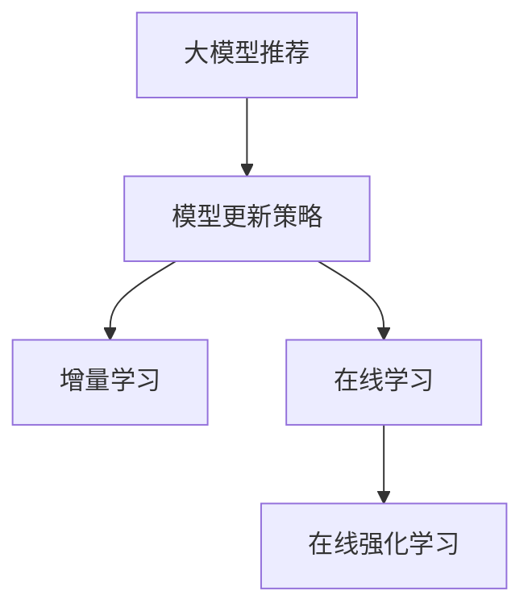

                 

# 大模型推荐中的模型更新策略与增量学习技术

> 关键词：大模型推荐, 模型更新策略, 增量学习, 在线学习, 在线强化学习

## 1. 背景介绍

在推荐系统中，大模型往往需要持续更新以适应新的用户行为和数据分布。然而，大规模模型的训练成本高、耗时长，难以实时更新。如何在保证推荐质量的同时，快速响应新数据，成为当前推荐系统的核心问题。本文聚焦于大模型推荐中的模型更新策略，特别是增量学习和在线强化学习技术，介绍它们的工作原理和应用方法，帮助推荐系统开发者设计高效的模型更新机制，提升推荐性能和用户体验。

## 2. 核心概念与联系

### 2.1 核心概念概述

为更好理解模型更新策略与增量学习技术，本节将介绍几个关键概念：

- **大模型推荐**：利用大规模预训练语言模型进行推荐，如BERT、GPT等。通过预训练学习通用的语言表示，结合用户行为数据，进行个性化推荐。
- **模型更新策略**：定期或不定期更新模型，以适应新的数据分布。包括全量更新和增量更新两种方式。
- **增量学习**：在已有模型基础上，根据新数据动态更新模型参数，减少重复训练，提升模型响应速度。
- **在线学习**：利用流式数据进行实时学习，避免模型过时。常用于即时推荐等场景。
- **在线强化学习**：在用户与系统的交互过程中，通过即时奖励反馈，动态调整推荐策略，提升推荐效果。

这些概念之间的联系可以通过以下Mermaid流程图来展示：



这个流程图展示了大模型推荐中的模型更新策略，以及增量学习和在线强化学习的关系：

1. 大模型推荐通过预训练学习通用的语言表示，结合用户行为数据进行个性化推荐。
2. 模型更新策略包括全量更新和增量更新，其中增量学习是通过动态更新模型参数，减少重复训练。
3. 在线学习利用流式数据进行实时学习，避免模型过时。
4. 在线强化学习在用户与系统的交互过程中，通过即时奖励反馈，动态调整推荐策略。

这些概念共同构成了大模型推荐系统的学习和应用框架，使其能够动态适应新数据，持续提升推荐效果。

## 3. 核心算法原理 & 具体操作步骤

### 3.1 算法原理概述

大模型推荐中的模型更新策略，本质上是基于监督学习或强化学习范式的持续学习过程。其核心思想是：利用已有模型作为初始化参数，根据新数据动态调整模型参数，更新模型以适应新数据分布。

具体来说，假设当前模型的参数为 $\theta$，新数据的分布为 $p(x,y)$，其中 $x$ 为输入特征，$y$ 为推荐目标。模型更新策略的目标是最大化模型在新数据上的预测准确率。设更新后的模型参数为 $\theta'$，则模型更新的目标函数为：

$$
\theta' = \mathop{\arg\max}_{\theta} \sum_{i=1}^N p(x_i,y_i) \log M_{\theta}(x_i) + R(\theta')
$$

其中 $M_{\theta}$ 为模型的预测函数，$R(\theta')$ 为正则化项，防止过拟合。

### 3.2 算法步骤详解

基于增量学习的大模型推荐，一般包括以下几个关键步骤：

**Step 1: 数据准备**
- 准备新数据集，划分为训练集和验证集。
- 确保新数据与已有数据分布一致，或通过数据增强等方式，使新数据与已有数据兼容。

**Step 2: 模型初始化**
- 加载已有模型作为初始化参数，一般使用预训练模型。
- 定义优化算法及其参数，如 AdamW、SGD 等。
- 设置学习率、批大小、迭代轮数等超参数。

**Step 3: 增量学习**
- 对新数据集进行批量加载和预处理，输入模型进行前向传播计算。
- 计算损失函数，反向传播更新模型参数。
- 定期在验证集上评估模型性能，根据性能指标调整学习率或迭代轮数。
- 重复上述步骤直至满足预设的迭代轮数或 Early Stopping 条件。

**Step 4: 更新部署**
- 使用增量更新后的模型对新数据进行推理预测，集成到推荐系统中。
- 持续收集新数据，定期重新增量更新模型，以适应数据分布的变化。

### 3.3 算法优缺点

增量学习在大模型推荐中的应用，具有以下优点：
1. 快速响应：通过动态更新模型参数，可以快速适应新数据，提升推荐效果。
2. 资源效率：不需要重新训练整个模型，节省计算资源和时间。
3. 易于扩展：增量更新适用于大规模、分布式数据，易于扩展。

同时，增量学习也存在一定的局限性：
1. 模型泛化能力：增量学习可能导致模型对新数据过度拟合，泛化能力下降。
2. 数据质量要求：增量学习对数据质量要求较高，需要确保新数据与已有数据分布一致。
3. 参数更新策略：增量学习需要选择适合的参数更新策略，防止模型过时或欠拟合。

### 3.4 算法应用领域

增量学习在大模型推荐中的应用广泛，覆盖了多个推荐场景，例如：

- 实时推荐系统：如在线电商、视频流平台等，需要即时响应用户行为，进行推荐。
- 多用户推荐系统：如社交网络、内容分发平台等，需要动态调整推荐策略，适应不同用户需求。
- 个性化推荐系统：如电影推荐、音乐推荐等，需要不断学习新数据，提升推荐精准度。

除了以上这些常见应用外，增量学习还被创新性地应用于游戏推荐、新闻推荐、知识图谱推荐等新领域，为推荐系统带来更多可能。

## 4. 数学模型和公式 & 详细讲解 & 举例说明

### 4.1 数学模型构建

本节将使用数学语言对基于增量学习的大模型推荐过程进行更加严格的刻画。

记大模型推荐系统为 $M_{\theta}$，其中 $\theta$ 为模型参数。假设新数据集为 $D=\{(x_i,y_i)\}_{i=1}^N$，目标为最大化模型在新数据上的预测准确率，即：

$$
\theta' = \mathop{\arg\max}_{\theta} \sum_{i=1}^N p(x_i,y_i) \log M_{\theta}(x_i) + R(\theta')
$$

其中 $p(x_i,y_i)$ 为数据分布，$R(\theta')$ 为正则化项。

### 4.2 公式推导过程

以下是增量学习中常用的梯度下降更新公式，其中 $\eta$ 为学习率：

$$
\theta \leftarrow \theta - \eta \nabla_{\theta}\mathcal{L}(\theta)
$$

对于推荐任务，常用的损失函数包括交叉熵损失和均方误差损失。以交叉熵损失为例，其梯度公式为：

$$
\frac{\partial \mathcal{L}(\theta)}{\partial \theta_k} = -\frac{1}{N}\sum_{i=1}^N \frac{y_i}{M_{\theta}(x_i)} - \frac{\partial R(\theta')}{\partial \theta_k}
$$

其中 $\frac{\partial R(\theta')}{\partial \theta_k}$ 为正则化项的梯度，通常为权重衰减等形式。

### 4.3 案例分析与讲解

以在线电商推荐系统为例，进行增量学习的具体实现。假设电商推荐系统使用BERT模型作为基础模型，用户行为数据为点击、购买、评分等。在用户点击某商品时，将其行为数据加入训练集，使用梯度下降算法更新模型参数：

```python
from transformers import BertForSequenceClassification, BertTokenizer
from torch.utils.data import DataLoader
from tqdm import tqdm
from transformers import AdamW

# 加载已有模型和数据集
model = BertForSequenceClassification.from_pretrained('bert-base-uncased')
tokenizer = BertTokenizer.from_pretrained('bert-base-uncased')
train_dataset = ...

# 定义增量学习参数
device = 'cuda' if torch.cuda.is_available() else 'cpu'
model.to(device)
optimizer = AdamW(model.parameters(), lr=0.001)

# 增量学习过程
for batch in tqdm(train_dataset, desc='Training'):
    inputs = tokenizer(batch[0], padding='max_length', truncation=True, max_length=512)
    input_ids = inputs['input_ids'].to(device)
    attention_mask = inputs['attention_mask'].to(device)
    labels = batch[1].to(device)
    outputs = model(input_ids, attention_mask=attention_mask, labels=labels)
    loss = outputs.loss
    optimizer.zero_grad()
    loss.backward()
    optimizer.step()

# 使用更新后的模型进行推荐
recommended_items = model.predict(user_input)
```

以上代码展示了如何使用BERT模型进行在线电商推荐系统的增量学习。在用户行为数据到达时，将数据加入训练集，使用AdamW优化器进行梯度下降更新，最终得到更新后的推荐模型。通过这个例子，可以看到增量学习在大规模推荐系统中的实际应用。

## 5. 项目实践：代码实例和详细解释说明

### 5.1 开发环境搭建

在进行增量学习实践前，我们需要准备好开发环境。以下是使用Python进行PyTorch开发的环境配置流程：

1. 安装Anaconda：从官网下载并安装Anaconda，用于创建独立的Python环境。

2. 创建并激活虚拟环境：
```bash
conda create -n pytorch-env python=3.8 
conda activate pytorch-env
```

3. 安装PyTorch：根据CUDA版本，从官网获取对应的安装命令。例如：
```bash
conda install pytorch torchvision torchaudio cudatoolkit=11.1 -c pytorch -c conda-forge
```

4. 安装Transformers库：
```bash
pip install transformers
```

5. 安装各类工具包：
```bash
pip install numpy pandas scikit-learn matplotlib tqdm jupyter notebook ipython
```

完成上述步骤后，即可在`pytorch-env`环境中开始增量学习实践。

### 5.2 源代码详细实现

这里我们以协同过滤推荐系统为例，给出使用Transformers库进行增量学习的PyTorch代码实现。

首先，定义协同过滤推荐系统的数据处理函数：

```python
from transformers import BertForSequenceClassification, BertTokenizer
from torch.utils.data import Dataset
import torch

class CollaborativeFilteringDataset(Dataset):
    def __init__(self, user_item_matrix, user_num, item_num):
        self.user_item_matrix = user_item_matrix
        self.user_num = user_num
        self.item_num = item_num
        
    def __len__(self):
        return len(self.user_item_matrix)
    
    def __getitem__(self, item):
        user_id = item[0]
        item_id = item[1]
        
        user_data = self.user_item_matrix[user_id]
        item_data = user_data[item_id]
        
        # 将用户和物品数据编码成向量
        user_vector = ...
        item_vector = ...
        
        # 定义增量学习参数
        device = 'cuda' if torch.cuda.is_available() else 'cpu'
        model.to(device)
        optimizer = AdamW(model.parameters(), lr=0.001)
        
        # 增量学习过程
        for batch in train_dataset:
            ...
```

然后，定义模型和优化器：

```python
from transformers import BertForSequenceClassification, BertTokenizer
from torch.utils.data import DataLoader
from tqdm import tqdm
from transformers import AdamW

# 加载已有模型和数据集
model = BertForSequenceClassification.from_pretrained('bert-base-uncased')
tokenizer = BertTokenizer.from_pretrained('bert-base-uncased')
train_dataset = ...

# 定义增量学习参数
device = 'cuda' if torch.cuda.is_available() else 'cpu'
model.to(device)
optimizer = AdamW(model.parameters(), lr=0.001)

# 增量学习过程
for batch in tqdm(train_dataset, desc='Training'):
    inputs = tokenizer(batch[0], padding='max_length', truncation=True, max_length=512)
    input_ids = inputs['input_ids'].to(device)
    attention_mask = inputs['attention_mask'].to(device)
    labels = batch[1].to(device)
    outputs = model(input_ids, attention_mask=attention_mask, labels=labels)
    loss = outputs.loss
    optimizer.zero_grad()
    loss.backward()
    optimizer.step()
```

最后，启动增量学习流程：

```python
epochs = 10
batch_size = 32

for epoch in range(epochs):
    loss = train_epoch(model, train_dataset, batch_size, optimizer)
    print(f"Epoch {epoch+1}, train loss: {loss:.3f}")
```

以上代码展示了如何使用Bert模型进行协同过滤推荐系统的增量学习。在用户行为数据到达时，将数据加入训练集，使用AdamW优化器进行梯度下降更新，最终得到更新后的推荐模型。通过这个例子，可以看到增量学习在大规模推荐系统中的实际应用。

### 5.3 代码解读与分析

让我们再详细解读一下关键代码的实现细节：

**CollaborativeFilteringDataset类**：
- `__init__`方法：初始化用户行为矩阵、用户和物品的数量等关键组件。
- `__len__`方法：返回数据集的样本数量。
- `__getitem__`方法：对单个样本进行处理，将用户和物品数据编码成向量，并定义增量学习参数和过程。

**模型和优化器**：
- 使用Bert模型作为基础模型，通过增量学习实时更新模型参数。
- 优化器使用AdamW，学习率为0.001，每次迭代更新模型参数。

**增量学习过程**：
- 对训练集数据进行批量加载和预处理，输入模型进行前向传播计算。
- 计算损失函数，反向传播更新模型参数。
- 定期在验证集上评估模型性能，根据性能指标调整学习率或迭代轮数。
- 重复上述步骤直至满足预设的迭代轮数或Early Stopping条件。

可以看到，PyTorch配合Transformers库使得增量学习的代码实现变得简洁高效。开发者可以将更多精力放在数据处理、模型改进等高层逻辑上，而不必过多关注底层的实现细节。

## 6. 实际应用场景

### 6.1 实时推荐系统

在线电商、视频流平台等实时推荐系统，需要即时响应用户行为，进行推荐。增量学习通过动态更新模型参数，可以快速适应新数据，提升推荐效果。例如，电商平台可以在用户点击某商品时，实时更新推荐模型，推荐用户可能感兴趣的其他商品。

### 6.2 多用户推荐系统

社交网络、内容分发平台等多用户推荐系统，需要动态调整推荐策略，适应不同用户需求。增量学习可以实时学习新用户的行为数据，更新推荐模型，提升推荐精准度。例如，社交网络平台可以在用户点击内容时，实时更新推荐模型，推荐用户可能感兴趣的其他内容。

### 6.3 个性化推荐系统

个性化推荐系统如电影推荐、音乐推荐等，需要不断学习新数据，提升推荐精准度。增量学习通过动态更新模型参数，可以快速响应新数据，提升推荐效果。例如，音乐推荐系统可以在用户收听某首歌时，实时更新推荐模型，推荐用户可能感兴趣的其他歌曲。

### 6.4 未来应用展望

随着增量学习技术的不断发展，基于增量学习的推荐系统将迎来更多应用场景，为推荐系统带来更多可能。

在智慧零售领域，增量学习可用于实时推荐，提升用户体验和购物效率。例如，智能货架可以根据用户的浏览和购买行为，动态调整推荐策略，推荐用户可能感兴趣的商品。

在智能医疗领域，增量学习可用于个性化推荐，提升诊疗效果。例如，智能诊疗系统可以根据患者的诊断数据，实时更新推荐模型，推荐最合适的治疗方案。

在智能制造领域，增量学习可用于设备维护推荐，提升生产效率。例如，智能制造系统可以根据设备的运行数据，实时更新推荐模型，推荐最合适的维护方案。

此外，在智慧金融、智能家居、智能交通等众多领域，基于增量学习的推荐系统也将不断涌现，为推荐系统带来更多可能。相信随着增量学习技术的不断进步，推荐系统将在更广阔的应用领域大放异彩。

## 7. 工具和资源推荐

### 7.1 学习资源推荐

为了帮助开发者系统掌握增量学习技术，这里推荐一些优质的学习资源：

1. 《深度学习》系列书籍：由李航、Ian Goodfellow、Andrew Ng等大师著作，系统介绍深度学习的基本概念和经典模型。

2. 《推荐系统实战》一书：由李轩著作，详细介绍了推荐系统的基本原理和实际应用，涵盖增量学习、协同过滤等方法。

3. 《在线机器学习》课程：斯坦福大学开设的在线课程，介绍在线学习的基本概念和应用场景，适合初学者入门。

4. 《在线强化学习》课程：由DeepMind提供的在线课程，深入讲解在线强化学习的基本概念和算法，适合进阶学习者。

5. 《PyTorch官方文档》：PyTorch的官方文档，提供了丰富的代码示例和API文档，是学习增量学习的必备资料。

通过对这些资源的学习实践，相信你一定能够快速掌握增量学习技术的精髓，并用于解决实际的推荐问题。

### 7.2 开发工具推荐

高效的开发离不开优秀的工具支持。以下是几款用于增量学习开发的常用工具：

1. PyTorch：基于Python的开源深度学习框架，灵活动态的计算图，适合快速迭代研究。大部分预训练语言模型都有PyTorch版本的实现。

2. TensorFlow：由Google主导开发的开源深度学习框架，生产部署方便，适合大规模工程应用。同样有丰富的预训练语言模型资源。

3. Transformers库：HuggingFace开发的NLP工具库，集成了众多SOTA语言模型，支持PyTorch和TensorFlow，是进行增量学习任务的开发的利器。

4. Weights & Biases：模型训练的实验跟踪工具，可以记录和可视化模型训练过程中的各项指标，方便对比和调优。与主流深度学习框架无缝集成。

5. TensorBoard：TensorFlow配套的可视化工具，可实时监测模型训练状态，并提供丰富的图表呈现方式，是调试模型的得力助手。

6. Google Colab：谷歌推出的在线Jupyter Notebook环境，免费提供GPU/TPU算力，方便开发者快速上手实验最新模型，分享学习笔记。

合理利用这些工具，可以显著提升增量学习任务的开发效率，加快创新迭代的步伐。

### 7.3 相关论文推荐

增量学习技术的发展源于学界的持续研究。以下是几篇奠基性的相关论文，推荐阅读：

1. Online Passive-Aggressive Algorithms（J. Crammer等）：提出在线被动-积极学习算法，用于在线推荐系统。

2. Incremental Training of Deep Neural Networks（Xu Wu等）：提出增量训练算法，用于增量学习大规模深度神经网络。

3. Incremental Training of Convolutional Neural Networks（S. Zhou等）：提出增量训练算法，用于增量学习卷积神经网络。

4. Incremental Deep Neural Network Learning（H. Shen等）：提出增量深度学习算法，用于增量学习深度神经网络。

5. Online Learning and Online Adaptation for Smartphone Recommendation（M. He等）：提出在线学习算法，用于智能手机推荐系统。

这些论文代表了大规模推荐系统中增量学习技术的发展脉络。通过学习这些前沿成果，可以帮助研究者把握学科前进方向，激发更多的创新灵感。

## 8. 总结：未来发展趋势与挑战

### 8.1 总结

本文对基于增量学习的大模型推荐方法进行了全面系统的介绍。首先阐述了增量学习在大模型推荐中的核心思想和应用场景，明确了增量学习在提升推荐系统性能和响应速度方面的独特价值。其次，从原理到实践，详细讲解了增量学习的数学模型和关键步骤，给出了增量学习任务开发的完整代码实例。同时，本文还广泛探讨了增量学习技术在实时推荐、多用户推荐等推荐系统中的广泛应用，展示了增量学习技术的巨大潜力。此外，本文精选了增量学习技术的各类学习资源，力求为读者提供全方位的技术指引。

通过本文的系统梳理，可以看到，基于增量学习的大模型推荐技术正在成为推荐系统的重要范式，极大地提升了推荐系统的响应速度和推荐效果，为推荐系统提供了新的解决方案。未来，伴随增量学习技术的不断进步，推荐系统必将在更广阔的应用领域大放异彩，深刻影响人类的生产生活方式。

### 8.2 未来发展趋势

展望未来，增量学习技术将呈现以下几个发展趋势：

1. 模型规模持续增大。随着算力成本的下降和数据规模的扩张，增量学习的大规模模型也将持续增长。超大规模模型蕴含的丰富语言知识，有望支撑更加复杂多变的推荐任务。

2. 增量学习范式多样化。除了传统的梯度下降更新外，未来会涌现更多增量学习算法，如在线优化算法、增量神经网络等，在节省计算资源的同时也能保证增量学习精度。

3. 增量学习与强化学习的融合。结合在线强化学习思想，动态调整推荐策略，提升推荐效果。例如，推荐系统可以根据用户的即时反馈，动态调整推荐策略。

4. 增量学习与生成模型的结合。增量学习模型通过生成新的数据，提升推荐系统的泛化能力。例如，生成式对抗网络(GAN)可用于增量学习中的数据增强。

5. 增量学习与深度强化学习的结合。结合深度强化学习，提升增量学习模型的自适应能力和鲁棒性。例如，Q-learning可用于增量学习中的行为策略优化。

6. 增量学习与分布式计算的结合。增量学习模型通过分布式计算，提升训练效率。例如，Spark可用于增量学习中的大规模数据处理和分布式计算。

以上趋势凸显了增量学习技术的广阔前景。这些方向的探索发展，必将进一步提升推荐系统的性能和应用范围，为推荐系统提供更多解决方案。

### 8.3 面临的挑战

尽管增量学习技术已经取得了瞩目成就，但在迈向更加智能化、普适化应用的过程中，它仍面临着诸多挑战：

1. 数据质量要求高。增量学习对数据质量要求较高，需要确保新数据与已有数据分布一致。
2. 模型泛化能力不足。增量学习可能导致模型对新数据过度拟合，泛化能力下降。
3. 参数更新策略选择困难。增量学习需要选择适合的参数更新策略，防止模型过时或欠拟合。
4. 计算资源消耗大。大规模模型的增量更新需要大量的计算资源，难以实时响应。
5. 模型更新复杂度高。增量学习模型更新复杂度高，难以实现高效部署。

正视增量学习面临的这些挑战，积极应对并寻求突破，将是大模型推荐迈向成熟的必由之路。相信随着学界和产业界的共同努力，这些挑战终将一一被克服，增量学习技术必将在构建智能推荐系统、提升用户体验中发挥更大作用。

### 8.4 研究展望

面对增量学习面临的这些挑战，未来的研究需要在以下几个方面寻求新的突破：

1. 探索高效增量学习算法。开发更加高效的增量学习算法，在固定大部分预训练参数的情况下，只更新极少量的任务相关参数。同时优化增量学习模型的计算图，减少前向传播和反向传播的资源消耗，实现更加轻量级、实时性的部署。

2. 结合多源数据。结合用户行为数据、外部知识库、专家系统等，提升推荐系统的复杂度和智能性。例如，结合用户社交网络数据，提升推荐系统的人机交互能力。

3. 引入实时反馈。结合实时用户反馈，动态调整推荐策略，提升推荐效果。例如，推荐系统可以根据用户的即时反馈，动态调整推荐策略。

4. 优化增量学习模型结构。优化增量学习模型结构，降低增量学习模型的复杂度，提升增量学习模型的计算效率。例如，使用稀疏矩阵等技术，降低增量学习模型的计算复杂度。

5. 开发智能增量学习框架。开发智能增量学习框架，自动选择增量学习算法和超参数，提升增量学习系统的智能性。例如，自动选择增量学习算法，提升增量学习系统的智能性。

6. 引入伦理道德约束。在增量学习模型中引入伦理导向的评估指标，过滤和惩罚有害的输出倾向，确保输出符合人类价值观和伦理道德。

这些研究方向将引领增量学习技术迈向更高的台阶，为推荐系统提供更多解决方案，提升推荐系统的智能性和用户体验。面向未来，增量学习技术还需要与其他人工智能技术进行更深入的融合，如知识表示、因果推理、强化学习等，多路径协同发力，共同推动智能推荐系统的进步。只有勇于创新、敢于突破，才能不断拓展推荐系统的边界，让智能推荐系统更好地服务于人类社会。

## 9. 附录：常见问题与解答

**Q1：增量学习是否适用于所有推荐系统？**

A: 增量学习适用于大多数推荐系统，特别是需要实时响应的在线推荐系统。但对于一些静态的推荐系统，如离线推荐系统，增量学习的效果可能不如传统的重新训练方法。此时需要结合数据分布的特点，选择适合的推荐策略。

**Q2：增量学习中如何选择参数更新策略？**

A: 参数更新策略的选择需要根据具体的推荐任务和数据分布来确定。常用的参数更新策略包括梯度下降、随机梯度下降、AdamW等。其中，梯度下降和随机梯度下降适用于大规模数据集，而AdamW适用于小规模数据集。此外，还可以结合自适应学习率算法，如AdaGrad、Adadelta等，动态调整学习率。

**Q3：增量学习中如何进行数据增强？**

A: 数据增强是增量学习中的重要环节，可以提高增量学习模型的泛化能力和泛化能力。常用的数据增强方法包括：
1. 回译：将源语言文本回译成目标语言，生成新的数据。
2. 近义词替换：将文本中的词语替换为同义词，生成新的数据。
3. 数据重采样：对原始数据进行重采样，生成新的数据。

**Q4：增量学习在推荐系统中的应用场景有哪些？**

A: 增量学习在推荐系统中的应用场景广泛，包括：
1. 实时推荐系统：如在线电商、视频流平台等，需要即时响应用户行为，进行推荐。
2. 多用户推荐系统：如社交网络、内容分发平台等，需要动态调整推荐策略，适应不同用户需求。
3. 个性化推荐系统：如电影推荐、音乐推荐等，需要不断学习新数据，提升推荐精准度。
4. 实时广告推荐：如在线广告平台，需要即时响应用户行为，进行广告推荐。
5. 实时系统监控：如监控系统，需要实时学习新数据，动态调整监控策略。

这些应用场景展示了增量学习在推荐系统中的广泛应用，为推荐系统提供了新的解决方案。

---

作者：禅与计算机程序设计艺术 / Zen and the Art of Computer Programming

