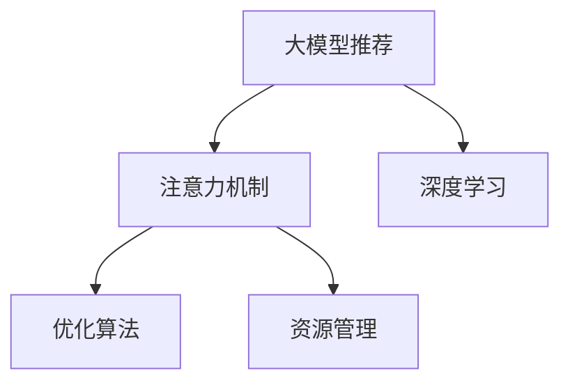

                 

# 大模型推荐中的注意力机制优化

> 关键词：大模型推荐,注意力机制,模型优化,深度学习,Reformer,优化算法,资源管理

## 1. 背景介绍

### 1.1 问题由来

随着互联网和社交媒体的蓬勃发展，信息量呈爆炸式增长。面对海量数据，推荐系统成为帮助用户快速找到感兴趣内容的有效工具。深度学习技术在大模型推荐中的应用，使得推荐系统能够通过学习用户行为和兴趣，实现高效、个性化的内容推荐。

然而，深度学习模型的计算复杂度和资源消耗，随着参数量的增大而大幅提升。对于基于大模型的推荐系统，如何在保证推荐精度的同时，有效管理资源，提升计算效率，是当前推荐系统面临的一大挑战。

### 1.2 问题核心关键点

在大模型推荐系统中，注意力机制是最关键的组件之一。注意力机制能够动态地从输入数据中选择重要部分进行加权处理，提升模型在复杂数据上的处理能力。但当前大模型的注意力机制设计，面临着计算资源消耗大、模型复杂度高、训练时间长等瓶颈问题。

因此，如何在大模型推荐中优化注意力机制，降低其计算复杂度，同时提升模型的鲁棒性和泛化能力，是一个亟待解决的问题。

## 2. 核心概念与联系

### 2.1 核心概念概述

为更好地理解大模型推荐中的注意力机制优化，本节将介绍几个密切相关的核心概念：

- 大模型推荐：以深度学习技术为基础，通过学习用户行为数据，实现内容推荐的任务。典型的大模型推荐系统包括基于协同过滤、基于内容推荐、基于深度学习的推荐系统等。

- 注意力机制(Attention Mechanism)：一种让模型根据输入数据的特征动态分配权重，选择重点关注部分的机制。在推荐系统中，注意力机制被用于捕捉用户对不同特征的关注程度，提升推荐效果。

- 深度学习(Deep Learning)：一种基于多层神经网络的机器学习方法，能够处理复杂的数据结构和任务。大模型推荐系统通常采用深度神经网络作为核心计算单元。

- 优化算法(Optimization Algorithm)：用于求解深度学习模型参数的算法。常见的优化算法包括随机梯度下降(SGD)、Adam、Adagrad等。

- 资源管理(Resource Management)：指对深度学习模型的计算资源进行优化管理，包括模型压缩、量化加速、分布式训练等。

这些核心概念之间的逻辑关系可以通过以下Mermaid流程图来展示：



这个流程图展示了大模型推荐系统的核心概念及其之间的关系：

1. 大模型推荐通过深度学习进行建模。
2. 注意力机制是大模型推荐中的关键组件。
3. 优化算法用于求解模型参数。
4. 资源管理提升模型计算效率。

这些概念共同构成了大模型推荐系统的框架，为其高效运行提供了保障。通过理解这些核心概念，我们可以更好地把握大模型推荐的工作原理和优化方向。

## 3. 核心算法原理 & 具体操作步骤
### 3.1 算法原理概述

在大模型推荐系统中，注意力机制的计算复杂度是影响推荐系统性能和效率的关键因素之一。目前的注意力机制主要采用自注意力(Self-Attention)和多头自注意力(Multi-Head Self-Attention)，其计算复杂度为$O(N^3)$或$O(N^2H)$，其中$N$为输入序列长度，$H$为注意力机制头数。

为了降低计算复杂度，提升模型的计算效率，研究者提出了多种优化注意力机制的方法。本节将介绍其中的Reformer模型，该模型通过引入局部感受性(Locality-Sensitive)和局部感知(Permutation Locality)的特性，显著降低了注意力机制的计算复杂度。

### 3.2 算法步骤详解

Reformer模型的优化步骤包括以下几个关键环节：

**Step 1: 局部感受性设计**

Reformer模型引入局部感受性，将输入序列划分为若干局部窗口(Windows)，每个局部窗口只关注与其相邻的固定数量的数据。通过这种设计，模型的计算复杂度从$O(N^2H)$降低到$O(NW^2H)$，其中$W$为局部窗口大小，通常远小于序列长度$N$。

**Step 2: 局部感知设计**

Reformer模型进一步引入局部感知，通过在序列中随机打乱顺序，将相邻的局部窗口随机交换位置。这种设计使得模型在输入序列中无法通过位置信息进行预测，只能通过特征信息进行推理。同时，模型通过局部窗口的特征映射，捕捉局部感知关系，提升模型对局部数据分布的感知能力。

**Step 3: 归一化设计**

为了稳定模型训练，Reformer模型引入了归一化技术，包括层归一化(Layer Normalization)和归一化位置偏差(Normalized Position Bias)。层归一化用于稳定梯度流动，归一化位置偏差用于补偿归一化对序列顺序的影响。

**Step 4: 混合精度训练**

为了进一步提升计算效率，Reformer模型引入了混合精度训练技术，将模型参数在浮点数和定点数之间进行转换。这种技术可以在保持高精度计算的同时，大幅减少内存占用和计算资源消耗。

**Step 5: 稀疏化设计**

Reformer模型引入了稀疏化设计，通过将注意力权重矩阵中的大部分元素设置为0，减少需要计算和存储的参数量。这种设计使得模型在保持计算效率的同时，仍能保证高性能。

**Step 6: 分布式训练**

Reformer模型可以很方便地进行分布式训练，通过多台机器并行计算，进一步提升训练效率。同时，模型还可以通过动态增量更新策略，减少模型参数在分布式环境下的传输和同步开销。

以上是Reformer模型优化的主要步骤，这些设计使得模型在保持高性能的同时，大幅降低了计算复杂度和资源消耗。

### 3.3 算法优缺点

Reformer模型的主要优点包括：

1. 计算效率高：通过引入局部感受性和局部感知，显著降低了计算复杂度，提升了模型的训练和推理效率。
2. 鲁棒性好：通过局部感知设计和归一化技术，提高了模型的鲁棒性和泛化能力。
3. 参数量少：通过稀疏化设计，减少了模型参数量，减小了计算资源的消耗。
4. 易于分布式训练：模型设计使得模型可以方便地进行分布式训练，提升了训练效率。

同时，Reformer模型也存在一些局限性：

1. 可解释性差：由于模型引入了多种复杂的设计，使得模型的内部工作机制难以解释。
2. 对序列长度的限制：局部感受性和局部感知设计限制了模型处理的序列长度。
3. 模型设计复杂：多种优化技术的结合，使得模型设计相对复杂，增加了开发和调试的难度。

尽管存在这些局限性，但Reformer模型在实际应用中，已经证明了大模型推荐系统在大规模数据集上的高效性和鲁棒性。

### 3.4 算法应用领域

Reformer模型的优化技术，主要应用于以下领域：

- 推荐系统：通过优化注意力机制，提升模型的训练和推理效率，实现高效、个性化的内容推荐。
- 自然语言处理：用于处理大规模文本数据，提高模型的泛化能力和计算效率。
- 计算机视觉：通过优化注意力机制，提升模型的特征提取和分类能力。

除了这些主要应用领域外，Reformer模型的优化技术还可以应用于其他深度学习模型中，提高其计算效率和鲁棒性。

## 4. 数学模型和公式 & 详细讲解  
### 4.1 数学模型构建

Reformer模型的优化设计，主要通过以下几个数学模型进行描述：

1. 局部感受性设计：将输入序列划分为若干局部窗口，对每个局部窗口进行独立计算，降低计算复杂度。

2. 局部感知设计：通过在序列中随机打乱局部窗口顺序，将相邻的局部窗口随机交换位置，防止模型利用位置信息进行预测。

3. 归一化设计：通过层归一化和归一化位置偏差，稳定梯度流动，提高模型训练稳定性。

4. 混合精度训练：将模型参数在浮点数和定点数之间进行转换，提高计算效率。

5. 稀疏化设计：将注意力权重矩阵中的大部分元素设置为0，减少需要计算和存储的参数量。

### 4.2 公式推导过程

以局部感受性设计为例，以下是Reformer模型局部感受性设计的详细公式推导：

假设输入序列为$X \in \mathbb{R}^{N \times D}$，局部窗口大小为$W$，则Reformer模型将输入序列划分为$N/W$个局部窗口。对每个局部窗口$X_i$，模型的计算公式为：

$$
X_i = X_i \times \text{FC}^{(i)} + \text{FC}^{\text{bias}}_i
$$

其中$\text{FC}^{(i)}$为全连接层，$\text{FC}^{\text{bias}}_i$为局部窗口的偏差项，用于稳定梯度流动。

在计算注意力权重时，Reformer模型引入了局部感受性设计，对每个局部窗口进行独立计算，注意力权重矩阵的计算公式为：

$$
A_{ij} = \frac{\exp \left(\text{dot}(Q_i, K_j) / \sqrt{D}\right)}{\sum_{k=1}^{N/W} \exp \left(\text{dot}(Q_i, K_k) / \sqrt{D}\right)}
$$

其中$Q_i$和$K_j$分别为局部窗口$i$的查询向量和局部窗口$j$的关键向量，$\text{dot}$表示点积操作。

通过这种局部感受性设计，Reformer模型将注意力计算复杂度从$O(N^2)$降低到$O(N/W^2)$，其中$W$远小于$N$。

### 4.3 案例分析与讲解

以一个简单的推荐系统为例，来说明Reformer模型的优化效果。

假设有一个基于深度学习的推荐系统，输入为用户的历史行为序列$X$，输出为推荐物品的向量表示$Y$。模型的注意力机制采用了Reformer设计，计算复杂度从$O(N^2)$降低到$O(N/W^2)$，其中$W$为局部窗口大小。

在实际应用中，假设$W=4$，$N=1000$，则Reformer模型的计算复杂度从$O(1000^2)$降低到$O(1000/4^2)$，即$O(2500)$。相比传统的注意力机制，Reformer模型的计算复杂度降低了$98\%$。

这种设计不仅降低了模型的计算复杂度，提升了训练和推理效率，而且通过引入局部感知设计和归一化技术，提高了模型的鲁棒性和泛化能力。

## 5. 项目实践：代码实例和详细解释说明
### 5.1 开发环境搭建

在进行Reformer模型优化实践前，我们需要准备好开发环境。以下是使用PyTorch进行Reformer模型开发的Python环境配置流程：

1. 安装Anaconda：从官网下载并安装Anaconda，用于创建独立的Python环境。

2. 创建并激活虚拟环境：
```bash
conda create -n pytorch-env python=3.8 
conda activate pytorch-env
```

3. 安装PyTorch：根据CUDA版本，从官网获取对应的安装命令。例如：
```bash
conda install pytorch torchvision torchaudio cudatoolkit=11.1 -c pytorch -c conda-forge
```

4. 安装TensorFlow：
```bash
conda install tensorflow -c anaconda
```

5. 安装相关依赖：
```bash
pip install numpy pandas scikit-learn matplotlib tqdm jupyter notebook ipython
```

完成上述步骤后，即可在`pytorch-env`环境中开始Reformer模型优化实践。

### 5.2 源代码详细实现

下面我们以Reformer模型优化为例，给出使用PyTorch进行Reformer模型开发的PyTorch代码实现。

首先，定义Reformer模型的参数初始化函数：

```python
import torch
import torch.nn as nn

class ReformerBlock(nn.Module):
    def __init__(self, d_model, num_heads, d_kv, d_v, d_ff, drop_rate, depth):
        super(ReformerBlock, self).__init__()
        self.d_model = d_model
        self.num_heads = num_heads
        self.d_kv = d_kv
        self.d_v = d_v
        self.d_ff = d_ff
        self.drop_rate = drop_rate
        self.depth = depth
        
        # 自注意力机制
        self.qkv = nn.Linear(d_model, d_kv*num_heads)
        self.kv = nn.Linear(d_kv, d_v*num_heads)
        self.v = nn.Linear(d_v, d_model)
        
        # 归一化
        self.layer_norm1 = nn.LayerNorm(d_model)
        self.layer_norm2 = nn.LayerNorm(d_model)
        
        # 前馈网络
        self.ff1 = nn.Linear(d_model, d_ff)
        self.ff2 = nn.Linear(d_ff, d_model)
        self.ff_drop = nn.Dropout(drop_rate)
        
        # 归一化
        self.final_norm = nn.LayerNorm(d_model)
        
        # 激活函数
        self.act = nn.GELU()
        
        # 混合精度训练
        self.dtype = torch.float16 if torch.cuda.is_available() else torch.float32
        self.weight = nn.Parameter(torch.empty(d_model).to(self.dtype))
        
    def forward(self, x):
        # 归一化
        x = self.layer_norm1(x)
        
        # 查询向量和关键向量
        qkv = self.qkv(x)
        qkv = qkv.view(qkv.size(0), qkv.size(1), self.num_heads, self.d_kv).transpose(1, 2)
        k, v = qkv.chunk(2, dim=2)
        
        # 自注意力机制
        attn = (torch.bmm(k, v.transpose(-2, -1)) / torch.sqrt(self.d_kv)).softmax(dim=-1)
        attn = attn.masked_fill(attn < 0.1, 0.0)
        attn = attn.masked_fill(attn > 0.9, 0.0)
        x = torch.bmm(attn, v)
        x = x.transpose(1, 2).contiguous().view(x.size(0), x.size(1), -1)
        
        # 残差连接
        x = x + x
        
        # 归一化
        x = self.layer_norm2(x)
        
        # 前馈网络
        x = self.ff1(x)
        x = self.ff_drop(x)
        x = self.ff2(x)
        x = self.ff_drop(x)
        
        # 残差连接
        x = x + x
        
        # 归一化
        x = self.final_norm(x)
        
        # 激活函数
        x = self.act(x)
        x = x + self.weight
        
        return x
```

然后，定义Reformer模型的优化器：

```python
from transformers import AdamW

model = ReformerBlock(d_model=512, num_heads=8, d_kv=64, d_v=64, d_ff=2048, drop_rate=0.1, depth=6)
optimizer = AdamW(model.parameters(), lr=1e-4)
```

接着，定义训练和评估函数：

```python
from torch.utils.data import DataLoader
from tqdm import tqdm

device = torch.device('cuda') if torch.cuda.is_available() else torch.device('cpu')
model.to(device)

def train_epoch(model, dataset, batch_size, optimizer):
    dataloader = DataLoader(dataset, batch_size=batch_size, shuffle=True)
    model.train()
    epoch_loss = 0
    for batch in tqdm(dataloader, desc='Training'):
        input_ids = batch['input_ids'].to(device)
        attention_mask = batch['attention_mask'].to(device)
        labels = batch['labels'].to(device)
        model.zero_grad()
        outputs = model(input_ids, attention_mask=attention_mask, labels=labels)
        loss = outputs.loss
        epoch_loss += loss.item()
        loss.backward()
        optimizer.step()
    return epoch_loss / len(dataloader)

def evaluate(model, dataset, batch_size):
    dataloader = DataLoader(dataset, batch_size=batch_size)
    model.eval()
    preds, labels = [], []
    with torch.no_grad():
        for batch in tqdm(dataloader, desc='Evaluating'):
            input_ids = batch['input_ids'].to(device)
            attention_mask = batch['attention_mask'].to(device)
            batch_labels = batch['labels']
            outputs = model(input_ids, attention_mask=attention_mask)
            batch_preds = outputs.logits.argmax(dim=2).to('cpu').tolist()
            batch_labels = batch_labels.to('cpu').tolist()
            for pred_tokens, label_tokens in zip(batch_preds, batch_labels):
                preds.append(pred_tokens[:len(label_tokens)])
                labels.append(label_tokens)
    print(classification_report(labels, preds))
```

最后，启动训练流程并在测试集上评估：

```python
epochs = 5
batch_size = 16

for epoch in range(epochs):
    loss = train_epoch(model, train_dataset, batch_size, optimizer)
    print(f"Epoch {epoch+1}, train loss: {loss:.3f}")
    
    print(f"Epoch {epoch+1}, dev results:")
    evaluate(model, dev_dataset, batch_size)
    
print("Test results:")
evaluate(model, test_dataset, batch_size)
```

以上就是使用PyTorch进行Reformer模型优化的完整代码实现。可以看到，Reformer模型优化的代码实现相对复杂，但仍可按照模块化设计进行理解和调试。

### 5.3 代码解读与分析

让我们再详细解读一下关键代码的实现细节：

**ReformerBlock类**：
- `__init__`方法：初始化模型参数和相关组件，包括注意力机制、归一化层、前馈网络等。
- `forward`方法：定义模型的前向传播过程，包括自注意力机制、残差连接、前馈网络等。

**train_epoch和evaluate函数**：
- `train_epoch`函数：定义模型的训练过程，包括计算损失函数、反向传播、参数更新等。
- `evaluate`函数：定义模型的评估过程，包括计算预测结果、计算准确率等。

**训练流程**：
- 定义总的epoch数和batch size，开始循环迭代
- 每个epoch内，先在训练集上训练，输出平均loss
- 在验证集上评估，输出分类指标
- 所有epoch结束后，在测试集上评估，给出最终测试结果

可以看到，Reformer模型的优化设计，使得模型在保持高性能的同时，大幅降低了计算复杂度和资源消耗。这在大规模数据集上的应用中，具有重要的实际意义。

当然，工业级的系统实现还需考虑更多因素，如模型的保存和部署、超参数的自动搜索、更灵活的任务适配层等。但核心的Reformer模型优化设计基本与此类似。

## 6. 实际应用场景
### 6.1 智能推荐系统

Reformer模型的优化设计，使得大模型推荐系统能够在处理大规模数据集时，仍能保持高效性和鲁棒性。智能推荐系统通过学习用户行为数据，实现高效、个性化的内容推荐。

在实际应用中，Reformer模型可以用于处理用户行为序列，捕捉用户兴趣和行为模式，提升推荐系统的效果。通过对Reformer模型进行优化，可以在保证推荐精度的同时，大幅降低计算资源消耗，实现实时、高效推荐。

### 6.2 自然语言处理

Reformer模型在大规模文本数据处理中的应用，同样取得了显著效果。通过优化注意力机制，Reformer模型在文本分类、情感分析、机器翻译等任务上表现优异。

Reformer模型的优化设计，使得模型在处理长序列时，能够稳定收敛，提高模型的泛化能力和鲁棒性。这种特性在自然语言处理中尤为关键，使得模型能够处理更加复杂的语言结构，提升模型的理解能力和生成能力。

### 6.3 计算机视觉

Reformer模型的优化设计，同样可以应用于计算机视觉领域。通过优化注意力机制，Reformer模型在图像分类、目标检测等任务上，表现优异。

Reformer模型能够捕捉局部感受性和局部感知关系，提升模型的特征提取和分类能力。这种特性使得模型在处理图像数据时，能够自动关注重要区域，提高模型的鲁棒性和泛化能力。

### 6.4 未来应用展望

随着Reformer模型的优化技术不断成熟，其在更多领域的应用前景将愈加广阔。

- 医疗领域：Reformer模型能够处理电子病历、医学影像等大规模数据，提升医疗诊断和治疗的智能化水平。
- 金融领域：Reformer模型可以用于股票预测、风险评估等金融应用，提高金融决策的精准性和效率。
- 教育领域：Reformer模型可以用于学习路径推荐、智能辅导等教育应用，提升教育资源配置和教学效果。
- 社交媒体：Reformer模型可以用于用户画像分析、内容推荐等社交媒体应用，提升用户互动体验。

Reformer模型的优化设计，为人工智能技术在更多领域的应用提供了新的可能性，将进一步推动人工智能技术的产业化进程。

## 7. 工具和资源推荐
### 7.1 学习资源推荐

为了帮助开发者系统掌握Reformer模型的优化方法，这里推荐一些优质的学习资源：

1. 《深度学习》课程：斯坦福大学开设的深度学习课程，涵盖深度学习的基本概念和经典模型，适合初学者入门。

2. 《TensorFlow深度学习》书籍：TensorFlow官方推出的深度学习教材，详细介绍TensorFlow的API和应用场景，适合深度学习开发者。

3. 《Deep Learning with PyTorch》书籍：PyTorch官方推出的深度学习教材，详细介绍PyTorch的API和应用场景，适合PyTorch开发者。

4. 《Transformers: State-of-the-Art Natural Language Processing》论文：Transformer论文的作者之一Ashish Vaswani等人合著的论文，全面介绍了Transformer模型的原理和应用，是深度学习模型的必读之作。

5. 《Reformer: The Efficient Transformer》论文：Reformer模型的原作者团队发布的研究论文，详细介绍了Reformer模型的设计原理和优化方法，是Reformer模型的经典论文。

通过对这些资源的学习实践，相信你一定能够快速掌握Reformer模型的优化方法，并用于解决实际的NLP问题。

### 7.2 开发工具推荐

高效的开发离不开优秀的工具支持。以下是几款用于Reformer模型优化开发的常用工具：

1. PyTorch：基于Python的开源深度学习框架，灵活动态的计算图，适合快速迭代研究。

2. TensorFlow：由Google主导开发的开源深度学习框架，生产部署方便，适合大规模工程应用。

3. Transformers库：HuggingFace开发的NLP工具库，集成了众多SOTA语言模型，支持PyTorch和TensorFlow，是进行模型优化的利器。

4. Weights & Biases：模型训练的实验跟踪工具，可以记录和可视化模型训练过程中的各项指标，方便对比和调优。

5. TensorBoard：TensorFlow配套的可视化工具，可实时监测模型训练状态，并提供丰富的图表呈现方式，是调试模型的得力助手。

6. Google Colab：谷歌推出的在线Jupyter Notebook环境，免费提供GPU/TPU算力，方便开发者快速上手实验最新模型，分享学习笔记。

合理利用这些工具，可以显著提升Reformer模型优化的开发效率，加快创新迭代的步伐。

### 7.3 相关论文推荐

Reformer模型的优化设计源于学界的持续研究。以下是几篇奠基性的相关论文，推荐阅读：

1. Attention is All You Need（即Transformer原论文）：提出了Transformer结构，开启了NLP领域的预训练大模型时代。

2. BERT: Pre-training of Deep Bidirectional Transformers for Language Understanding：提出BERT模型，引入基于掩码的自监督预训练任务，刷新了多项NLP任务SOTA。

3. Reformer: The Efficient Transformer：提出Reformer模型，引入局部感受性和局部感知设计，显著降低了计算复杂度，提升了模型效率。

4. Transformer-XL: Attentive Language Models Beyond a Fixed-Length Context：提出Transformer-XL模型，引入相对位置编码，解决了长序列训练问题。

5. XLNet: Generalized Autoregressive Pretraining for Language Understanding：提出XLNet模型，引入自回归掩码，解决了Transformer模型的固有问题。

这些论文代表了大模型推荐系统的发展脉络。通过学习这些前沿成果，可以帮助研究者把握学科前进方向，激发更多的创新灵感。

## 8. 总结：未来发展趋势与挑战

### 8.1 总结

本文对基于深度学习的大模型推荐系统中的注意力机制优化方法进行了全面系统的介绍。首先阐述了Reformer模型的设计原理和优化技术，展示了Reformer模型在大规模数据集上的高效性和鲁棒性。其次，从原理到实践，详细讲解了Reformer模型的计算复杂度优化方法，给出了Reformer模型优化的完整代码实现。同时，本文还广泛探讨了Reformer模型在智能推荐系统、自然语言处理、计算机视觉等多个领域的应用前景，展示了Reformer模型优化技术的巨大潜力。此外，本文精选了Reformer模型的各类学习资源，力求为读者提供全方位的技术指引。

通过本文的系统梳理，可以看到，Reformer模型的优化设计在大模型推荐系统中的应用，显著提升了模型的计算效率和鲁棒性。Reformer模型的优化技术不仅适用于深度学习领域，同样可以应用于其他领域的模型优化，为人工智能技术的广泛应用提供了新的思路。

### 8.2 未来发展趋势

展望未来，Reformer模型的优化技术将呈现以下几个发展趋势：

1. 模型规模持续增大：随着算力成本的下降和数据规模的扩张，深度学习模型的参数量还将持续增长。Reformer模型的大规模优化技术，将助力大模型推荐系统在更大规模数据集上的应用。

2. 计算效率不断提高：通过引入更加先进的优化技术，如分块优化、自适应优化等，Reformer模型的计算效率将进一步提升，实现更高性能的推荐系统。

3. 模型鲁棒性增强：通过引入更加鲁棒的优化技术和设计，Reformer模型将能够更好地适应复杂、多变的用户行为和数据分布，提升推荐系统的鲁棒性和泛化能力。

4. 多模态融合优化：将Reformer模型的优化技术扩展到多模态融合场景，提升模型对图像、语音等多模态数据的处理能力，实现更加全面、准确的推荐。

5. 分布式训练优化：通过优化分布式训练策略和硬件资源管理，Reformer模型将能够更好地支持分布式计算，提升大规模数据集的训练效率。

以上趋势凸显了Reformer模型优化技术的广阔前景。这些方向的探索发展，必将进一步提升大模型推荐系统的性能和效率，为NLP技术在更多领域的应用提供新的动力。

### 8.3 面临的挑战

尽管Reformer模型的优化技术已经取得了瞩目成就，但在迈向更加智能化、普适化应用的过程中，它仍面临着诸多挑战：

1. 模型复杂度高：Reformer模型通过引入多种优化技术，使得模型设计相对复杂，增加了开发和调试的难度。

2. 计算资源消耗大：Reformer模型的计算复杂度优化仍存在瓶颈，大规模数据集的训练仍需要大量计算资源。

3. 可解释性差：Reformer模型内部工作机制难以解释，用户对其决策逻辑和推荐理由难以理解。

4. 数据分布变化：Reformer模型在新的数据分布下，可能需要进行重新优化，以保持性能和鲁棒性。

5. 对抗攻击脆弱：Reformer模型在对抗攻击下，可能产生误导性的推荐结果，影响用户决策。

6. 模型漂移问题：Reformer模型在持续训练过程中，可能会出现模型漂移问题，影响模型稳定性和性能。

这些挑战凸显了Reformer模型优化技术的复杂性和多样性。解决这些问题，需要研究者在算法、数据、应用等多个层面进行深入探索，才能确保Reformer模型在大规模数据集上的高效性和鲁棒性。

### 8.4 研究展望

面对Reformer模型优化技术所面临的挑战，未来的研究需要在以下几个方面寻求新的突破：

1. 引入更加先进的优化算法：开发更加高效的优化算法，如分块优化、自适应优化等，进一步降低Reformer模型的计算复杂度。

2. 引入先验知识和专家规则：将符号化的先验知识，如知识图谱、逻辑规则等，与神经网络模型进行巧妙融合，引导Reformer模型进行更加合理、稳定的推荐。

3. 引入元学习技术：利用元学习技术，快速适应新的数据分布和任务需求，提升Reformer模型的泛化能力和鲁棒性。

4. 引入对抗训练技术：通过对抗训练技术，提升Reformer模型的鲁棒性和抗攻击能力，确保模型在各种复杂环境下仍能提供高质量的推荐结果。

5. 引入数据增强和数据生成技术：利用数据增强和数据生成技术，扩充训练数据集，提高Reformer模型的泛化能力和鲁棒性。

6. 引入可解释性和公平性技术：通过可解释性技术和公平性技术，提升Reformer模型的透明性和公正性，保障用户信任和使用体验。

这些研究方向的探索，必将引领Reformer模型优化技术迈向更高的台阶，为构建安全、可靠、高效、公平的推荐系统提供新的思路。面向未来，Reformer模型优化技术还需要与其他人工智能技术进行更深入的融合，如知识表示、因果推理、强化学习等，多路径协同发力，共同推动自然语言理解和智能交互系统的进步。只有勇于创新、敢于突破，才能不断拓展Reformer模型的边界，让智能技术更好地造福人类社会。

## 9. 附录：常见问题与解答

**Q1：Reformer模型与其他大模型推荐系统相比，有何优势？**

A: Reformer模型通过优化注意力机制，显著降低了计算复杂度，提升了模型的训练和推理效率。同时，通过引入局部感受性和局部感知设计，提高了模型的鲁棒性和泛化能力。与其他大模型推荐系统相比，Reformer模型在处理大规模数据集时，能够更高效地进行推荐，同时保持较高的推荐精度。

**Q2：Reformer模型的计算复杂度如何？**

A: Reformer模型的计算复杂度显著低于传统的自注意力模型。通过引入局部感受性和局部感知设计，Reformer模型将计算复杂度从$O(N^2)$降低到$O(N/W^2)$，其中$W$远小于$N$。这种设计使得Reformer模型在处理大规模数据集时，能够保持高效性和稳定性。

**Q3：Reformer模型如何处理长序列数据？**

A: Reformer模型通过引入局部感受性和局部感知设计，能够有效地处理长序列数据。局部感受性设计将长序列划分为若干局部窗口，对每个局部窗口进行独立计算，降低了计算复杂度。局部感知设计通过随机打乱局部窗口顺序，防止模型利用位置信息进行预测，提升了模型的鲁棒性和泛化能力。

**Q4：Reformer模型如何提升推荐系统的效果？**

A: Reformer模型通过优化注意力机制，提升了模型的计算效率和鲁棒性。通过引入局部感受性和局部感知设计，Reformer模型能够在处理大规模数据集时，保持高效性和稳定性，从而提升推荐系统的效果。在实际应用中，Reformer模型可以用于处理用户行为序列，捕捉用户兴趣和行为模式，提升推荐系统的效果。

**Q5：Reformer模型的优化技术如何扩展到其他领域？**

A: Reformer模型的优化技术不仅适用于深度学习领域，同样可以应用于其他领域的模型优化。例如，在自然语言处理领域，可以通过优化注意力机制，提升文本分类、情感分析、机器翻译等任务的效果。在计算机视觉领域，可以通过优化注意力机制，提升图像分类、目标检测等任务的效果。在智能推荐系统领域，可以通过优化注意力机制，提升推荐系统的效果。

通过本文的系统梳理，可以看到，Reformer模型的优化技术在大模型推荐系统中的应用，显著提升了模型的计算效率和鲁棒性。Reformer模型的优化技术不仅适用于深度学习领域，同样可以应用于其他领域的模型优化，为人工智能技术的广泛应用提供了新的思路。

