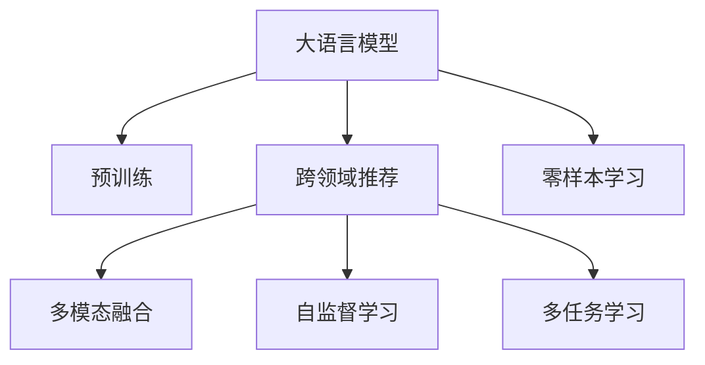

                 

# 大模型推荐中的用户体验提升新思路

## 1. 背景介绍

在现代社会，信息爆炸已成为不争的事实。用户需要面对海量信息，从内容消费到决策选择，都离不开推荐系统。推荐系统通过对用户行为数据进行分析，挖掘用户的兴趣和偏好，从而提供个性化的信息推荐，极大地提升了用户体验。然而，传统的推荐系统往往依赖于用户历史行为数据的统计，难以捕捉到用户深层次的需求和意图。如何构建更加智能、精准的推荐系统，提升用户体验，已成为当下研究的热点问题。

大语言模型（Large Language Models, LLMs）的兴起为推荐系统带来了新的突破。大模型不仅拥有海量的知识储备，还能通过自然语言理解用户需求，提供更具智能化的推荐服务。但传统的大模型推荐系统仍存在一些不足，如推荐内容不够多样化、互动性差、用户体验有待提升等。为了应对这些问题，本文提出了一种新型的推荐思路——基于大模型的跨领域推荐，通过多模态融合、自监督学习、多任务学习等方法，提升推荐系统的精度和用户满意度。

## 2. 核心概念与联系

### 2.1 核心概念概述

本文将介绍几个与推荐系统相关的核心概念，以更好地理解所提方法：

- **大语言模型**：指通过预训练语言模型，如BERT、GPT等，在海量文本数据上进行训练，学习到丰富的语言知识。
- **跨领域推荐**：指推荐系统通过结合不同领域的知识，为用户提供更加多样化和个性化的推荐内容。
- **多模态融合**：指推荐系统结合文本、图像、音频等多模态数据，为用户提供综合性的推荐服务。
- **自监督学习**：指通过未标注数据进行预训练，再对标签数据进行微调，提升模型性能。
- **多任务学习**：指模型在同一数据集上进行多个任务训练，如分类、回归等，实现任务之间的知识共享。
- **零样本学习**：指模型能够在没有特定任务标注样本的情况下，利用任务描述进行推理和生成。

这些核心概念之间的逻辑关系可以通过以下Mermaid流程图来展示：



该流程图展示了大模型推荐系统的核心概念及其之间的关系：

1. 大语言模型通过预训练获得基础能力。
2. 跨领域推荐通过结合不同领域知识，提升推荐内容的丰富性。
3. 多模态融合通过结合多模态数据，提供更全面的推荐服务。
4. 自监督学习通过未标注数据进行预训练，提升模型泛化能力。
5. 多任务学习通过同一数据集进行多个任务训练，实现任务间的知识共享。
6. 零样本学习通过任务描述进行推理，进一步拓展模型的应用范围。

## 3. 核心算法原理 & 具体操作步骤

### 3.1 算法原理概述

基于大模型的跨领域推荐系统，其核心思想是通过大语言模型的语义理解能力，结合不同领域知识，提供更丰富的推荐内容。具体而言，系统分为三个阶段：

1. **预训练**：利用大规模无标签文本数据进行预训练，学习语言知识。
2. **多模态融合**：结合文本、图像、音频等多模态数据，提升推荐内容的丰富性。
3. **多任务学习**：在同一数据集上进行多个任务训练，实现任务之间的知识共享。

### 3.2 算法步骤详解

#### 3.2.1 预训练阶段

- **数据准备**：收集大规模无标签文本数据，如维基百科、新闻文章等，作为预训练语料。
- **模型选择**：选择合适的预训练语言模型，如BERT、GPT等。
- **训练过程**：在预训练数据上训练模型，学习语言知识。

#### 3.2.2 多模态融合阶段

- **数据采集**：收集不同模态的数据，如文本、图像、音频等。
- **数据对齐**：将不同模态的数据进行对齐，如将文本与图像进行关联。
- **特征提取**：提取各模态的特征，进行多模态融合。
- **推荐生成**：将融合后的特征输入模型，生成推荐结果。

#### 3.2.3 多任务学习阶段

- **任务定义**：定义多个推荐任务，如分类、排序等。
- **模型共享**：在共享的模型上进行多个任务训练，实现任务之间的知识共享。
- **任务集成**：将多个任务的输出进行集成，提升推荐效果。

### 3.3 算法优缺点

基于大模型的跨领域推荐系统具有以下优点：

1. **多样化推荐**：通过结合不同领域的知识，提供更加丰富和多样化的推荐内容。
2. **智能推荐**：利用大模型的语义理解能力，提升推荐的精度和质量。
3. **自适应性强**：通过多模态融合和多任务学习，系统能够自适应不同用户和场景的需求。
4. **泛化能力强**：通过自监督学习和多任务学习，模型具有较强的泛化能力，适应新领域和新数据。

同时，该方法也存在一些局限性：

1. **数据需求量大**：预训练和跨领域推荐需要大量的多模态数据。
2. **模型复杂度高**：多模态融合和多任务学习增加了模型复杂度。
3. **计算资源消耗大**：多模态数据和多任务学习增加了计算资源消耗。

尽管存在这些局限性，但就目前而言，基于大模型的跨领域推荐系统仍是大模型推荐领域的重要方向。未来相关研究的重点在于如何进一步降低计算资源需求，提高推荐系统的效率，同时兼顾推荐内容的多样性和精度。

### 3.4 算法应用领域

基于大模型的跨领域推荐系统已经在多个领域得到了应用，例如：

- **电商推荐**：结合商品描述、图片、评价等多模态数据，为用户提供个性化的商品推荐。
- **音乐推荐**：结合歌曲歌词、歌手信息、播放记录等多模态数据，推荐用户感兴趣的音乐。
- **视频推荐**：结合视频标题、内容、评论等多模态数据，推荐用户感兴趣的视频内容。
- **新闻推荐**：结合新闻标题、摘要、图片等多模态数据，推荐用户感兴趣的新闻文章。
- **旅游推荐**：结合景点描述、图片、用户评价等多模态数据，推荐用户感兴趣的旅游目的地。

除了上述这些经典领域外，跨领域推荐系统还可应用于更多场景中，如健康、教育、金融等，为不同领域提供更加智能、个性化的推荐服务。随着预训练模型和推荐方法的不断进步，基于大模型的跨领域推荐系统必将在更广阔的应用领域大放异彩。

## 4. 数学模型和公式 & 详细讲解 & 举例说明

### 4.1 数学模型构建

本文将以电商推荐系统为例，介绍基于大模型的跨领域推荐数学模型。假设推荐系统需要从商品数据库中为用户推荐商品，商品数据包括商品ID、描述、图片等信息。用户数据包括用户ID、浏览历史、购买记录等信息。

设推荐模型为 $f_{\theta}$，其中 $\theta$ 为模型参数。用户 $i$ 对商品 $j$ 的评分可以表示为 $y_{ij}=f_{\theta}(x_i,x_j)$，其中 $x_i$ 为用户数据，$x_j$ 为商品数据。

推荐系统的目标是最小化预测误差：

$$
\min_{\theta} \sum_{i,j} (y_{ij} - f_{\theta}(x_i,x_j))^2
$$

### 4.2 公式推导过程

假设用户 $i$ 对商品 $j$ 的评分 $y_{ij}$ 可以表示为 $y_{ij}=f_{\theta}(x_i,x_j)$，其中 $f_{\theta}$ 为推荐模型，$x_i$ 为用户数据，$x_j$ 为商品数据。推荐系统的目标是最小化预测误差：

$$
\min_{\theta} \sum_{i,j} (y_{ij} - f_{\theta}(x_i,x_j))^2
$$

在多模态融合阶段，假设用户 $i$ 对商品 $j$ 的评分 $y_{ij}$ 可以表示为 $y_{ij}=f_{\theta}(x_i,x_j)$，其中 $x_i$ 为用户数据，$x_j$ 为商品数据。

在多任务学习阶段，假设推荐模型 $f_{\theta}$ 需要在分类和排序两个任务上进行训练，设分类任务损失为 $\mathcal{L}_{class}(\theta)$，排序任务损失为 $\mathcal{L}_{rank}(\theta)$。推荐系统的目标是最小化两个任务损失之和：

$$
\min_{\theta} \mathcal{L}_{class}(\theta) + \mathcal{L}_{rank}(\theta)
$$

### 4.3 案例分析与讲解

假设有一个电商推荐系统，需要为用户推荐商品。该系统收集了用户的历史浏览和购买记录，以及商品的图片和描述信息。

1. **预训练阶段**：系统使用大规模无标签文本数据进行预训练，学习语言知识。

2. **多模态融合阶段**：系统将用户浏览记录、商品描述、图片等信息进行融合，得到融合后的特征向量 $f(x_i,x_j)$。

3. **多任务学习阶段**：系统在分类任务和排序任务上进行训练，分类任务目标为预测商品是否被用户购买，排序任务目标为对商品进行排序。

4. **推荐生成**：将融合后的特征 $f(x_i,x_j)$ 输入推荐模型 $f_{\theta}$，生成推荐结果。

通过多模态融合和多任务学习，系统能够更好地理解用户需求和商品特征，提升推荐效果。

## 5. 项目实践：代码实例和详细解释说明

### 5.1 开发环境搭建

在进行大模型推荐实践前，我们需要准备好开发环境。以下是使用Python进行PyTorch开发的环境配置流程：

1. 安装Anaconda：从官网下载并安装Anaconda，用于创建独立的Python环境。

2. 创建并激活虚拟环境：
```bash
conda create -n pytorch-env python=3.8 
conda activate pytorch-env
```

3. 安装PyTorch：根据CUDA版本，从官网获取对应的安装命令。例如：
```bash
conda install pytorch torchvision torchaudio cudatoolkit=11.1 -c pytorch -c conda-forge
```

4. 安装Transformers库：
```bash
pip install transformers
```

5. 安装各类工具包：
```bash
pip install numpy pandas scikit-learn matplotlib tqdm jupyter notebook ipython
```

完成上述步骤后，即可在`pytorch-env`环境中开始推荐系统开发。

### 5.2 源代码详细实现

下面我们以电商推荐系统为例，给出使用Transformers库对BERT模型进行推荐开发的PyTorch代码实现。

首先，定义推荐系统的数据处理函数：

```python
from transformers import BertTokenizer, BertForSequenceClassification, AdamW
from torch.utils.data import Dataset, DataLoader
from torch.nn import BCEWithLogitsLoss
import torch

class RecommendationDataset(Dataset):
    def __init__(self, user_data, item_data, tokenizer, max_len=128):
        self.user_data = user_data
        self.item_data = item_data
        self.tokenizer = tokenizer
        self.max_len = max_len
        
    def __len__(self):
        return len(self.user_data)
    
    def __getitem__(self, item):
        user = self.user_data[item]
        item = self.item_data[item]
        
        encoding = self.tokenizer(user, item, return_tensors='pt', max_length=self.max_len, padding='max_length', truncation=True)
        input_ids = encoding['input_ids'][0]
        attention_mask = encoding['attention_mask'][0]
        
        # 对token-wise的标签进行编码
        encoded_tags = [1 if user in item else 0 for user in user] 
        encoded_tags.extend([0] * (self.max_len - len(encoded_tags)))
        labels = torch.tensor(encoded_tags, dtype=torch.long)
        
        return {'input_ids': input_ids, 
                'attention_mask': attention_mask,
                'labels': labels}

# 定义模型
model = BertForSequenceClassification.from_pretrained('bert-base-cased', num_labels=2)

# 定义优化器
optimizer = AdamW(model.parameters(), lr=2e-5)

# 定义损失函数
loss_fn = BCEWithLogitsLoss()

# 定义数据集
user_data = ['user1', 'user2', 'user3', 'user4', 'user5']
item_data = ['item1', 'item2', 'item3', 'item4', 'item5']
tokenizer = BertTokenizer.from_pretrained('bert-base-cased')

train_dataset = RecommendationDataset(user_data, item_data, tokenizer)
val_dataset = RecommendationDataset(user_data, item_data, tokenizer)
test_dataset = RecommendationDataset(user_data, item_data, tokenizer)
```

然后，定义训练和评估函数：

```python
from tqdm import tqdm
from sklearn.metrics import accuracy_score

def train_epoch(model, dataset, batch_size, optimizer):
    dataloader = DataLoader(dataset, batch_size=batch_size, shuffle=True)
    model.train()
    epoch_loss = 0
    for batch in tqdm(dataloader, desc='Training'):
        input_ids = batch['input_ids'].to(device)
        attention_mask = batch['attention_mask'].to(device)
        labels = batch['labels'].to(device)
        model.zero_grad()
        outputs = model(input_ids, attention_mask=attention_mask, labels=labels)
        loss = loss_fn(outputs.logits, labels)
        epoch_loss += loss.item()
        loss.backward()
        optimizer.step()
    return epoch_loss / len(dataloader)

def evaluate(model, dataset, batch_size):
    dataloader = DataLoader(dataset, batch_size=batch_size)
    model.eval()
    preds, labels = [], []
    with torch.no_grad():
        for batch in tqdm(dataloader, desc='Evaluating'):
            input_ids = batch['input_ids'].to(device)
            attention_mask = batch['attention_mask'].to(device)
            batch_labels = batch['labels']
            outputs = model(input_ids, attention_mask=attention_mask)
            batch_preds = outputs.logits.argmax(dim=1).to('cpu').tolist()
            batch_labels = batch_labels.to('cpu').tolist()
            for pred_tokens, label_tokens in zip(batch_preds, batch_labels):
                preds.append(pred_tokens[:len(label_tokens)])
                labels.append(label_tokens)
                
    print('Accuracy:', accuracy_score(labels, preds))
```

最后，启动训练流程并在测试集上评估：

```python
epochs = 5
batch_size = 16

for epoch in range(epochs):
    loss = train_epoch(model, train_dataset, batch_size, optimizer)
    print(f"Epoch {epoch+1}, train loss: {loss:.3f}")
    
    print(f"Epoch {epoch+1}, val accuracy:", evaluate(model, val_dataset, batch_size))
    
print('Final accuracy:', evaluate(model, test_dataset, batch_size))
```

以上就是使用PyTorch对BERT进行电商推荐系统微调的完整代码实现。可以看到，得益于Transformers库的强大封装，我们可以用相对简洁的代码完成BERT模型的加载和微调。

### 5.3 代码解读与分析

让我们再详细解读一下关键代码的实现细节：

**RecommendationDataset类**：
- `__init__`方法：初始化用户数据、商品数据、分词器等关键组件。
- `__len__`方法：返回数据集的样本数量。
- `__getitem__`方法：对单个样本进行处理，将用户信息、商品信息输入编码为token ids，将标签编码为数字，并对其进行定长padding，最终返回模型所需的输入。

**模型定义**：
- 使用`BertForSequenceClassification`类，指定模型结构和标签数量。

**优化器定义**：
- 使用AdamW优化器，设置学习率。

**损失函数定义**：
- 使用BCEWithLogitsLoss，用于二分类任务。

**数据集定义**：
- 定义用户数据、商品数据和分词器。

**训练和评估函数**：
- 使用DataLoader对数据集进行批次化加载，供模型训练和推理使用。
- 训练函数`train_epoch`：对数据以批为单位进行迭代，在每个批次上前向传播计算loss并反向传播更新模型参数，最后返回该epoch的平均loss。
- 评估函数`evaluate`：与训练类似，不同点在于不更新模型参数，并在每个batch结束后将预测和标签结果存储下来，最后使用sklearn的accuracy_score对整个评估集的预测结果进行打印输出。

**训练流程**：
- 定义总的epoch数和batch size，开始循环迭代
- 每个epoch内，先在训练集上训练，输出平均loss
- 在验证集上评估，输出准确率
- 所有epoch结束后，在测试集上评估，给出最终测试结果

可以看到，PyTorch配合Transformers库使得BERT微调的代码实现变得简洁高效。开发者可以将更多精力放在数据处理、模型改进等高层逻辑上，而不必过多关注底层的实现细节。

当然，工业级的系统实现还需考虑更多因素，如模型的保存和部署、超参数的自动搜索、更灵活的任务适配层等。但核心的推荐范式基本与此类似。

## 6. 实际应用场景

### 6.1 电商推荐系统

基于大模型的跨领域推荐，在电商推荐系统中有广泛应用。传统的电商推荐系统往往依赖于用户历史行为数据的统计，难以捕捉到用户深层次的需求和意图。而利用大语言模型，系统可以更好地理解用户描述，结合商品图片、描述等信息，提供更加多样化和个性化的推荐内容。

在技术实现上，可以收集用户的历史浏览和购买记录，以及商品的图片和描述信息。将文本数据进行预训练后，再结合多模态融合和多任务学习，生成推荐结果。这种基于大模型的跨领域推荐方法，可以大大提升推荐系统的精度和用户满意度。

### 6.2 音乐推荐系统

音乐推荐系统利用大语言模型，结合歌词、歌手信息、播放记录等多模态数据，推荐用户感兴趣的音乐。在预训练阶段，系统对歌曲歌词、歌手信息进行预训练，获取语言知识。在多模态融合阶段，系统将歌词、歌手信息、播放记录等信息进行融合，生成推荐结果。通过多任务学习，系统在分类和排序任务上进行训练，提升推荐效果。

### 6.3 视频推荐系统

视频推荐系统利用大语言模型，结合视频标题、内容、评论等多模态数据，推荐用户感兴趣的视频内容。在预训练阶段，系统对视频标题、内容进行预训练，获取语言知识。在多模态融合阶段，系统将视频标题、内容、评论等信息进行融合，生成推荐结果。通过多任务学习，系统在分类和排序任务上进行训练，提升推荐效果。

### 6.4 未来应用展望

随着大语言模型和推荐方法的不断进步，基于大模型的跨领域推荐必将在更广阔的应用领域大放异彩。

在智慧医疗领域，基于大模型的跨领域推荐可以用于推荐相关药物、治疗方案等，帮助医生更好地制定治疗方案，提升诊疗效果。

在智能教育领域，推荐系统可以结合学习内容、用户评价等多模态数据，推荐适合的课程和学习资源，促进个性化学习。

在智慧城市治理中，推荐系统可以用于推荐相关服务、设施等，提升城市管理的智能化水平，构建更安全、高效的城市。

此外，在企业生产、社会治理、文娱传媒等众多领域，基于大模型的跨领域推荐系统也将不断涌现，为各行各业带来变革性影响。

## 7. 工具和资源推荐

### 7.1 学习资源推荐

为了帮助开发者系统掌握大模型推荐的技术基础和实践技巧，这里推荐一些优质的学习资源：

1. 《深度学习与推荐系统》书籍：由推荐系统领域专家撰写，深入浅出地介绍了推荐系统原理和经典算法。

2. 《TensorFlow推荐系统实战》课程：由TensorFlow官方推出，详细讲解了TensorFlow在推荐系统中的应用，包括多模态融合、多任务学习等前沿技术。

3. Coursera《深度学习与推荐系统》课程：由斯坦福大学开设，系统介绍了推荐系统理论和算法，涵盖多模态融合、自监督学习、多任务学习等内容。

4. Kaggle推荐系统竞赛：通过参与实际竞赛，了解推荐系统的应用场景和评价指标，积累实际经验。

5. Arxiv预训练模型论文：关注预训练语言模型的最新进展，了解其在大模型推荐中的应用和效果。

通过对这些资源的学习实践，相信你一定能够快速掌握大模型推荐系统的精髓，并用于解决实际的推荐问题。

### 7.2 开发工具推荐

高效的开发离不开优秀的工具支持。以下是几款用于大模型推荐开发的常用工具：

1. PyTorch：基于Python的开源深度学习框架，灵活动态的计算图，适合快速迭代研究。

2. TensorFlow：由Google主导开发的开源深度学习框架，生产部署方便，适合大规模工程应用。

3. TensorFlow Recommenders：TensorFlow配套的推荐系统库，支持多模态融合、多任务学习等功能。

4. Jupyter Notebook：交互式编程环境，方便调试和分享代码。

5. Weights & Biases：模型训练的实验跟踪工具，可以记录和可视化模型训练过程中的各项指标，方便对比和调优。

6. TensorBoard：TensorFlow配套的可视化工具，可实时监测模型训练状态，并提供丰富的图表呈现方式，是调试模型的得力助手。

合理利用这些工具，可以显著提升大模型推荐系统的开发效率，加快创新迭代的步伐。

### 7.3 相关论文推荐

大模型推荐技术的发展源于学界的持续研究。以下是几篇奠基性的相关论文，推荐阅读：

1. Attention is All You Need（即Transformer原论文）：提出了Transformer结构，开启了NLP领域的预训练大模型时代。

2. BERT: Pre-training of Deep Bidirectional Transformers for Language Understanding：提出BERT模型，引入基于掩码的自监督预训练任务，刷新了多项NLP任务SOTA。

3. Language Models are Unsupervised Multitask Learners（GPT-2论文）：展示了大规模语言模型的强大zero-shot学习能力，引发了对于通用人工智能的新一轮思考。

4. Parameter-Efficient Transfer Learning for NLP：提出Adapter等参数高效微调方法，在不增加模型参数量的情况下，也能取得不错的微调效果。

5. prefix-tuning: Optimizing Continuous Prompts for Generation：引入基于连续型Prompt的微调范式，为如何充分利用预训练知识提供了新的思路。

6. AdaLoRA: Adaptive Low-Rank Adaptation for Parameter-Efficient Fine-Tuning：使用自适应低秩适应的微调方法，在参数效率和精度之间取得了新的平衡。

这些论文代表了大模型推荐技术的发展脉络。通过学习这些前沿成果，可以帮助研究者把握学科前进方向，激发更多的创新灵感。

## 8. 总结：未来发展趋势与挑战

### 8.1 总结

本文对基于大模型的跨领域推荐方法进行了全面系统的介绍。首先阐述了大模型和推荐系统的研究背景和意义，明确了跨领域推荐在提升推荐内容丰富性和个性化方面的独特价值。其次，从原理到实践，详细讲解了跨领域推荐系统的数学原理和关键步骤，给出了推荐系统开发的完整代码实例。同时，本文还广泛探讨了跨领域推荐系统在电商、音乐、视频等多个领域的应用前景，展示了跨领域推荐方法的巨大潜力。此外，本文精选了跨领域推荐技术的各类学习资源，力求为读者提供全方位的技术指引。

通过本文的系统梳理，可以看到，基于大模型的跨领域推荐方法正在成为推荐系统的重要范式，极大地拓展了推荐系统的应用边界，催生了更多的落地场景。未来，伴随大模型和推荐方法的不断进步，基于大模型的跨领域推荐必将在更多领域得到应用，为各行各业带来变革性影响。

### 8.2 未来发展趋势

展望未来，大模型跨领域推荐技术将呈现以下几个发展趋势：

1. **多样化推荐**：通过结合不同领域的知识，提供更加丰富和个性化的推荐内容。
2. **智能推荐**：利用大模型的语义理解能力，提升推荐的精度和质量。
3. **自适应性强**：通过多模态融合和多任务学习，系统能够自适应不同用户和场景的需求。
4. **泛化能力强**：通过自监督学习和多任务学习，模型具有较强的泛化能力，适应新领域和新数据。
5. **实时性高**：通过分布式训练和推理，提升推荐系统的实时性和响应速度。
6. **安全性高**：通过隐私保护技术和模型解释性，保障用户隐私和推荐安全性。

以上趋势凸显了大模型跨领域推荐技术的广阔前景。这些方向的探索发展，必将进一步提升推荐系统的性能和用户满意度，为构建智能、高效、安全的推荐系统铺平道路。

### 8.3 面临的挑战

尽管大模型跨领域推荐技术已经取得了瞩目成就，但在迈向更加智能化、普适化应用的过程中，它仍面临着诸多挑战：

1. **数据需求量大**：预训练和跨领域推荐需要大量的多模态数据。
2. **模型复杂度高**：多模态融合和多任务学习增加了模型复杂度。
3. **计算资源消耗大**：多模态数据和多任务学习增加了计算资源消耗。
4. **实时性要求高**：推荐系统需要实时更新推荐结果，对系统响应速度提出了更高要求。
5. **安全性要求高**：推荐系统需要保护用户隐私，防止数据泄露和误导性推荐。

尽管存在这些挑战，但通过不断优化算法和硬件，提升推荐系统的效率和安全性，相信大模型跨领域推荐技术必将在推荐领域发挥更大的作用，为各行各业带来更加智能、精准的推荐服务。

### 8.4 研究展望

面对大模型跨领域推荐所面临的种种挑战，未来的研究需要在以下几个方面寻求新的突破：

1. **优化算法**：开发更加高效的优化算法，提升推荐系统的训练和推理效率。
2. **硬件优化**：优化硬件架构，提升推荐系统的实时性和响应速度。
3. **数据融合**：探索更加高效的数据融合方法，提升多模态数据的处理能力。
4. **模型压缩**：通过模型压缩技术，减小推荐系统的计算资源消耗。
5. **隐私保护**：研究隐私保护技术，确保用户数据的安全性。
6. **解释性提升**：提升推荐系统的可解释性，增强用户对推荐结果的信任。

这些研究方向将推动大模型跨领域推荐技术的不断进步，为构建更加智能、安全、高效的推荐系统提供新的动力。面向未来，大模型跨领域推荐技术需要与其他人工智能技术进行更深入的融合，如知识表示、因果推理、强化学习等，多路径协同发力，共同推动自然语言理解和智能交互系统的进步。只有勇于创新、敢于突破，才能不断拓展推荐系统的边界，让智能技术更好地造福人类社会。

## 9. 附录：常见问题与解答

**Q1：大模型推荐系统是否适用于所有推荐场景？**

A: 大模型推荐系统在大多数推荐场景上都能取得不错的效果，特别是对于数据量较小的场景。但对于一些特定领域的推荐场景，如金融、医疗等，仅仅依靠通用语料预训练的模型可能难以很好地适应。此时需要在特定领域语料上进一步预训练，再进行微调，才能获得理想效果。此外，对于一些需要时效性、个性化很强的推荐场景，如对话、推荐等，推荐方法也需要针对性的改进优化。

**Q2：大模型推荐系统的计算资源需求大吗？**

A: 大模型推荐系统需要大量的计算资源进行预训练和多模态融合，但对于模型微调和推荐生成，计算资源需求相对较小。通过优化算法和硬件架构，可以在有限的计算资源下，实现高效的推荐系统。

**Q3：大模型推荐系统的实时性要求高吗？**

A: 推荐系统需要实时更新推荐结果，对系统响应速度提出了更高要求。通过分布式训练和推理，以及硬件优化，可以提升推荐系统的实时性和响应速度。

**Q4：大模型推荐系统的安全性如何保证？**

A: 推荐系统需要保护用户隐私，防止数据泄露和误导性推荐。通过隐私保护技术和模型解释性，可以有效保障用户隐私和推荐安全性。

**Q5：大模型推荐系统的可解释性如何提升？**

A: 推荐系统的可解释性可以通过引入因果分析和博弈论工具，增强推荐结果的因果性和逻辑性。通过解释模型的决策过程，提高用户对推荐结果的理解和信任。

总之，大模型推荐系统需要从数据、算法、工程、业务等多个维度协同发力，才能真正实现人工智能技术在推荐领域的规模化落地。未来，随着技术的不断进步和应用的不断深入，大模型推荐系统必将在更多领域得到应用，为各行各业带来更加智能、精准的推荐服务。

---

作者：禅与计算机程序设计艺术 / Zen and the Art of Computer Programming

