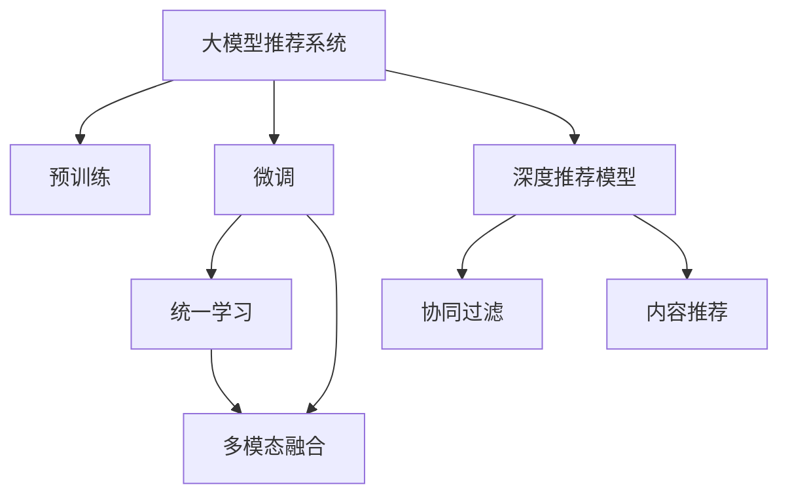

                 

# 大模型推荐系统未来：统一与融合

> 关键词：大模型推荐系统,推荐算法,统一学习,多模态融合,深度学习,推荐系统综述

## 1. 背景介绍

### 1.1 问题由来
推荐系统是现代互联网中极为重要的技术之一，用户通过推荐系统获取信息、娱乐、购物等，推荐系统在电商、社交媒体、新闻等众多场景中发挥着不可替代的作用。推荐算法已经从早期的基于协同过滤、基于内容的推荐，发展到今天基于深度学习的推荐系统。

深度学习推荐系统的崛起，离不开两个重要的技术突破：一是预训练模型的应用，二是深度推荐模型的不断发展。其中预训练模型通过在大规模无标签数据上预训练，学习通用的语言、视觉等特征表示，并通过微调适配不同推荐任务，取得了显著的推荐效果。大模型推荐系统利用预训练模型通用的特征表示，提升了推荐系统的精准性和泛化能力，为推荐系统打开了广阔的想象空间。

尽管预训练模型和大模型推荐系统取得了巨大的成功，但仍面临许多挑战。如何在大模型基础上进一步优化推荐算法？如何在大模型推荐系统中实现多模态融合？这些问题尚待解决。本文将系统梳理大模型推荐系统的核心概念，探究统一的推荐算法框架，分析多模态融合的最新进展，展望未来推荐系统的应用趋势。

### 1.2 问题核心关键点
大模型推荐系统通过在大规模无标签数据上进行预训练，学习通用的语义、视觉等特征表示，并结合下游推荐任务的少量标注数据进行微调，提升模型在推荐任务上的性能。相比于传统的推荐算法，大模型推荐系统具备以下核心特点：

- **统一特征表示**：利用预训练模型通用的特征表示，可以在不同的推荐任务间共享特征表示，提升推荐效果。
- **高效多模态融合**：预训练模型可以融合多种模态的数据，提供更全面的用户画像，提升推荐质量。
- **增量更新能力**：预训练模型可以在新数据上进行微调，持续提升推荐效果。

本文将围绕这些关键点展开讨论，从理论到实践，系统梳理大模型推荐系统的构建与优化方法。

## 2. 核心概念与联系

### 2.1 核心概念概述

为更好地理解大模型推荐系统，本文将介绍几个密切相关的核心概念：

- **大模型推荐系统**：利用预训练模型通用的特征表示，结合下游推荐任务的少量标注数据，通过微调提升推荐效果的技术。
- **预训练**：在大规模无标签数据上，通过自监督学习任务训练通用语言、视觉等特征表示的过程。
- **微调**：在预训练模型的基础上，结合下游推荐任务的少量标注数据，通过有监督学习优化推荐模型。
- **统一学习**：通过将不同模态的数据统一映射到预训练模型的特征空间，实现多模态特征的融合。
- **多模态融合**：将多种模态的数据融合到同一特征空间，提取更为全面的用户画像。
- **深度推荐模型**：利用深度学习技术，尤其是深度神经网络构建的推荐模型。
- **协同过滤**：基于用户-物品交互数据的推荐算法。
- **内容推荐**：基于物品属性数据的推荐算法。

这些核心概念之间的逻辑关系可以通过以下Mermaid流程图来展示：



这个流程图展示了大模型推荐系统的核心概念及其之间的关系：

1. 大模型推荐系统通过预训练获得基础能力。
2. 微调是对预训练模型进行任务特定的优化，可以结合多模态融合等方法提升推荐效果。
3. 统一学习将不同模态的数据映射到预训练模型的特征空间，实现多模态特征的融合。
4. 深度推荐模型是利用深度学习技术构建的推荐算法，包含了协同过滤、内容推荐等经典方法。

## 3. 核心算法原理 & 具体操作步骤
### 3.1 算法原理概述

大模型推荐系统的核心思想是通过预训练模型学习通用的特征表示，结合下游推荐任务的少量标注数据进行微调，从而提升推荐模型的精准性和泛化能力。

在具体实现上，大模型推荐系统分为以下几个关键步骤：

1. **预训练模型构建**：选择一种预训练模型，如BERT、GPT、ViT等，在大规模无标签数据上进行预训练。
2. **统一学习与多模态融合**：将不同模态的数据统一映射到预训练模型的特征空间，进行特征融合。
3. **微调推荐模型**：结合下游推荐任务的少量标注数据，通过有监督学习优化推荐模型。
4. **深度推荐算法融合**：将深度推荐算法与微调推荐模型结合，提升推荐效果。

### 3.2 算法步骤详解

#### 3.2.1 预训练模型构建

选择合适的预训练模型，如BERT、GPT等，在大规模无标签数据上进行预训练。预训练目标包括但不限于：

- 自回归语言模型：如GPT，通过预测下一个单词的序列来预训练语言模型。
- 自编码模型：如BERT，通过掩码语言模型、下一句预测等任务进行预训练。
- 视觉模型：如ViT，通过图像分类、目标检测等任务进行预训练。

预训练模型可以在大规模无标签数据上学习到丰富的特征表示，提升推荐系统的精准性。

#### 3.2.2 统一学习与多模态融合

在大模型推荐系统中，常采用统一学习将不同模态的数据映射到预训练模型的特征空间。例如，可以使用预训练语言模型学习用户和物品的语义表示，使用预训练视觉模型学习物品的视觉特征，通过拼接或融合的方式，构建更为全面的用户和物品画像。

多模态融合的具体方法包括：

- **拼接法**：直接将不同模态的特征拼接在一起，如语言和视觉特征拼接。
- **注意力机制**：通过注意力机制在不同模态特征间进行加权融合，提升融合效果。
- **多任务学习**：在预训练阶段同时学习多个任务，提升多模态特征的表征能力。

#### 3.2.3 微调推荐模型

微调推荐模型是利用预训练模型的通用特征表示，结合下游推荐任务的少量标注数据，进行有监督学习优化。微调的具体步骤如下：

1. **模型选择与适配**：选择合适的微调模型，如线性回归模型、深度神经网络等，并根据推荐任务类型设计适配层。
2. **数据准备**：准备推荐任务的数据集，将数据集划分为训练集、验证集和测试集。
3. **微调超参数设置**：选择合适的优化算法（如Adam、SGD等）、学习率、批大小、迭代轮数等。
4. **模型训练与评估**：将数据集分批次输入模型，进行前向传播和反向传播，计算损失函数。周期性在验证集上评估模型性能，决定是否触发Early Stopping。
5. **模型测试**：在测试集上评估微调后模型的性能，对比微调前后的精度提升。

#### 3.2.4 深度推荐算法融合

深度推荐算法是推荐系统中的经典方法，可以与微调推荐模型结合，提升推荐效果。常见的深度推荐算法包括：

- **协同过滤**：通过用户-物品交互数据学习用户和物品的隐式特征。
- **内容推荐**：基于物品属性数据，利用深度神经网络学习物品与用户之间的相似性。

深度推荐算法可以与微调推荐模型结合，构建更复杂的推荐模型，如基于联合学习的推荐模型、基于图神经网络的推荐模型等。

### 3.3 算法优缺点

大模型推荐系统具有以下优点：

- **精准性高**：利用预训练模型通用的特征表示，提升推荐系统的精准性。
- **泛化能力强**：预训练模型在多种模态数据上均能取得较好的效果，适应不同的推荐任务。
- **高效融合多模态数据**：利用预训练模型，可以高效融合不同模态的数据，构建全面的用户画像。

同时，该方法也存在一些局限性：

- **数据依赖度高**：微调推荐模型需要依赖下游推荐任务的少量标注数据，获取高质量标注数据成本较高。
- **计算资源消耗大**：预训练模型和深度推荐模型需要大量计算资源，部署成本高。
- **模型复杂度高**：深度推荐模型和微调推荐模型结构复杂，调试和优化难度大。

尽管存在这些局限性，但就目前而言，大模型推荐系统仍然是推荐系统领域的重要范式。未来相关研究的重点在于如何进一步降低数据依赖，提高推荐系统的实时性和效率，同时兼顾模型的可解释性和伦理安全性等因素。

### 3.4 算法应用领域

大模型推荐系统在多个领域得到了广泛应用，例如：

- **电商推荐**：利用预训练模型学习用户和物品的语义表示，结合协同过滤和内容推荐算法，提升用户购物体验。
- **内容推荐**：在新闻、视频、音乐等领域，利用预训练模型学习内容特征，结合用户画像，提供个性化的内容推荐。
- **广告推荐**：在广告推荐中，利用预训练模型学习广告和用户特征，结合协同过滤和内容推荐算法，提升广告投放效果。
- **社交推荐**：在社交网络中，利用预训练模型学习用户和物品的语义表示，结合用户行为数据，推荐相关的朋友和内容。
- **金融推荐**：在金融领域，利用预训练模型学习用户和金融产品的语义表示，结合用户行为数据，提供个性化的金融服务。

除了这些经典应用外，大模型推荐系统还被创新性地应用于更多场景中，如个性化广告投放、智能搜索、智能游戏等，为推荐系统带来了全新的突破。随着预训练模型和推荐方法的不断进步，相信推荐系统将在更广阔的应用领域大放异彩。

## 4. 数学模型和公式 & 详细讲解  
### 4.1 数学模型构建

在大模型推荐系统中，推荐模型通常由预训练模型和微调模型两部分组成。预训练模型作为特征提取器，微调模型作为目标函数。

记预训练模型为 $M_{\theta}$，其中 $\theta$ 为预训练得到的模型参数。记微调模型为 $F_{\phi}$，其中 $\phi$ 为微调得到的模型参数。

推荐系统的目标是最小化预测误差：

$$
\min_{\theta, \phi} \sum_{i=1}^N \ell(F_{\phi}(M_{\theta}(x_i)), y_i)
$$

其中 $x_i$ 为用户和物品特征的表示，$y_i$ 为推荐标签，$\ell$ 为推荐损失函数。

### 4.2 公式推导过程

以下以协同过滤推荐系统为例，推导推荐损失函数及其梯度的计算公式。

假设推荐系统由协同过滤模型 $F_{\phi}$ 和预训练模型 $M_{\theta}$ 组成。给定用户-物品矩阵 $X_{u \times i}$ 和物品-物品矩阵 $X_{i \times i}$，推荐系统预测用户对物品的评分：

$$
\hat{y}_{ui} = F_{\phi}(M_{\theta}(x_u, x_i))
$$

其中 $x_u$ 为用户特征，$x_i$ 为物品特征。

推荐系统的损失函数通常为均方误差损失：

$$
\ell = \frac{1}{N} \sum_{i=1}^N (\hat{y}_{ui} - y_i)^2
$$

对模型参数进行梯度下降优化，目标是最小化上述损失函数。根据链式法则，损失函数对预训练模型参数 $\theta$ 和微调模型参数 $\phi$ 的梯度分别为：

$$
\frac{\partial \ell}{\partial \theta} = -2\sum_{i=1}^N \frac{\partial \hat{y}_{ui}}{\partial \theta} \frac{\partial \hat{y}_{ui}}{\partial \phi} \frac{\partial \ell}{\partial \hat{y}_{ui}}
$$

$$
\frac{\partial \ell}{\partial \phi} = -2\sum_{i=1}^N \frac{\partial \hat{y}_{ui}}{\partial \phi} \frac{\partial \ell}{\partial \hat{y}_{ui}}
$$

其中 $\frac{\partial \hat{y}_{ui}}{\partial \theta}$ 和 $\frac{\partial \hat{y}_{ui}}{\partial \phi}$ 可通过反向传播算法高效计算。

### 4.3 案例分析与讲解

**协同过滤推荐系统**

协同过滤推荐系统是基于用户-物品交互数据的推荐算法。假设有一个电商平台，收集了用户对物品的评分数据，记为 $X_{u \times i}$。将用户特征和物品特征输入到预训练模型 $M_{\theta}$ 中，得到用户和物品的语义表示。将语义表示输入到微调模型 $F_{\phi}$ 中，得到预测评分 $\hat{y}_{ui}$。使用均方误差损失函数，计算预测评分与实际评分的差异，从而优化模型参数。

**基于内容推荐**

基于内容推荐的模型通常使用深度神经网络学习物品与用户之间的相似性。假设有一个新闻推荐系统，收集了新闻的类别、标题、摘要等信息。将新闻特征输入到预训练模型 $M_{\theta}$ 中，得到新闻的语义表示。将语义表示输入到微调模型 $F_{\phi}$ 中，得到预测评分 $\hat{y}_{ui}$。使用均方误差损失函数，计算预测评分与实际评分的差异，从而优化模型参数。

**多模态融合**

多模态融合是将不同模态的数据（如文本、图像、视频等）融合到同一特征空间，提取更为全面的用户画像。假设有一个视频推荐系统，收集了视频的标题、简介、时长等信息。将视频特征输入到预训练模型 $M_{\theta}$ 中，得到视频的语义表示。将视频的视觉特征输入到微调模型 $F_{\phi}$ 中，得到预测评分 $\hat{y}_{ui}$。使用均方误差损失函数，计算预测评分与实际评分的差异，从而优化模型参数。

## 5. 项目实践：代码实例和详细解释说明
### 5.1 开发环境搭建

在进行大模型推荐系统开发前，我们需要准备好开发环境。以下是使用Python进行TensorFlow开发的环境配置流程：

1. 安装Anaconda：从官网下载并安装Anaconda，用于创建独立的Python环境。

2. 创建并激活虚拟环境：
```bash
conda create -n tf-env python=3.8 
conda activate tf-env
```

3. 安装TensorFlow：根据CUDA版本，从官网获取对应的安装命令。例如：
```bash
conda install tensorflow -c pytorch -c conda-forge
```

4. 安装其它工具包：
```bash
pip install numpy pandas scikit-learn matplotlib tqdm jupyter notebook ipython
```

完成上述步骤后，即可在`tf-env`环境中开始推荐系统开发。

### 5.2 源代码详细实现

这里我们以协同过滤推荐系统为例，给出使用TensorFlow构建推荐系统的代码实现。

首先，定义协同过滤模型的损失函数：

```python
import tensorflow as tf

def build_recommender_loss(y_true, y_pred):
    loss = tf.keras.losses.mean_squared_error(y_true, y_pred)
    return loss
```

然后，定义协同过滤模型的微调过程：

```python
def train_recommender(model, train_data, test_data, epochs, batch_size):
    model.compile(optimizer='adam', loss=build_recommender_loss)
    model.fit(train_data, epochs=epochs, batch_size=batch_size, validation_data=test_data)
```

接下来，准备数据集并进行模型训练：

```python
# 数据准备
train_x = ...
train_y = ...
test_x = ...
test_y = ...

# 构建模型
model = tf.keras.Sequential([
    tf.keras.layers.Dense(64, activation='relu', input_shape=[n_features]),
    tf.keras.layers.Dense(1)
])

# 训练模型
train_recommender(model, (train_x, train_y), (test_x, test_y), epochs=10, batch_size=32)
```

最后，在测试集上评估模型性能：

```python
# 评估模型
test_loss = model.evaluate(test_x, test_y)
print(f'Test loss: {test_loss:.4f}')
```

以上就是使用TensorFlow进行协同过滤推荐系统微调的完整代码实现。可以看到，利用TensorFlow的高阶API，协同过滤推荐系统的构建和微调过程变得简洁高效。

### 5.3 代码解读与分析

让我们再详细解读一下关键代码的实现细节：

**build_recommender_loss函数**：
- 定义了协同过滤推荐系统的损失函数，使用均方误差损失函数计算预测评分与实际评分的差异。

**train_recommender函数**：
- 定义了协同过滤推荐模型的微调过程。首先编译模型，设置优化器和损失函数。然后使用fit方法进行模型训练，并在验证集上评估模型性能。

**数据准备**：
- 在实际应用中，需要收集用户-物品交互数据，并对其进行预处理，得到训练集和测试集。
- 使用Dense层构建协同过滤模型，其中第一层为全连接层，第二层为输出层。

**模型训练**：
- 使用TensorFlow的高阶API，调用fit方法进行模型训练。设置迭代轮数和批大小，并在验证集上评估模型性能。
- 使用evaluate方法在测试集上评估模型性能，输出测试损失。

可以看到，TensorFlow提供了丰富的工具和接口，可以方便地构建和微调推荐模型。开发者可以将更多精力放在模型设计和数据处理上，而不必过多关注底层实现细节。

当然，工业级的系统实现还需考虑更多因素，如模型的保存和部署、超参数的自动搜索、更灵活的任务适配层等。但核心的微调范式基本与此类似。

## 6. 实际应用场景
### 6.1 电商推荐

大模型推荐系统在电商推荐中表现优异。通过收集用户浏览、点击、购买等行为数据，利用预训练模型学习用户和物品的语义表示，结合协同过滤和内容推荐算法，提升推荐效果。例如，Amazon使用大模型推荐系统，通过分析用户浏览历史和物品属性，推荐用户可能感兴趣的商品。

### 6.2 内容推荐

在内容推荐中，利用预训练模型学习内容特征，结合用户画像，提供个性化的内容推荐。例如，YouTube使用大模型推荐系统，通过分析用户观看历史和视频标签，推荐用户可能感兴趣的视频内容。

### 6.3 社交推荐

在社交推荐中，利用预训练模型学习用户和物品的语义表示，结合用户行为数据，推荐相关的朋友和内容。例如，微信使用大模型推荐系统，通过分析用户好友关系和朋友圈内容，推荐用户可能感兴趣的朋友和文章。

### 6.4 金融推荐

在金融推荐中，利用预训练模型学习用户和金融产品的语义表示，结合用户行为数据，提供个性化的金融服务。例如，支付宝使用大模型推荐系统，通过分析用户消费行为和金融产品属性，推荐用户可能感兴趣的理财产品。

### 6.5 广告推荐

在广告推荐中，利用预训练模型学习广告和用户特征，结合协同过滤和内容推荐算法，提升广告投放效果。例如，Facebook使用大模型推荐系统，通过分析用户兴趣和广告内容，推荐用户可能感兴趣的广告。

## 7. 工具和资源推荐
### 7.1 学习资源推荐

为了帮助开发者系统掌握大模型推荐系统的理论基础和实践技巧，这里推荐一些优质的学习资源：

1. 《深度学习推荐系统》：由清华大学出版社出版的推荐系统经典书籍，详细介绍了推荐系统的基本概念、算法和优化方法。
2. 《TensorFlow实战深度学习》：由腾讯出品的深度学习实战书籍，介绍了TensorFlow的高级API和推荐系统的构建与优化。
3. CS229《机器学习》课程：斯坦福大学开设的机器学习课程，包含推荐系统的理论基础和算法实现。
4. Kaggle推荐系统竞赛：Kaggle平台上众多推荐系统竞赛，可实际参与推荐系统开发和优化。
5. 《Recommender Systems》：由Coursera平台上的推荐系统课程，介绍了推荐系统的多种算法和优化方法。

通过对这些资源的学习实践，相信你一定能够快速掌握大模型推荐系统的精髓，并用于解决实际的推荐问题。

### 7.2 开发工具推荐

高效的开发离不开优秀的工具支持。以下是几款用于大模型推荐系统开发的常用工具：

1. TensorFlow：由Google主导开发的开源深度学习框架，生产部署方便，适合大规模工程应用。
2. PyTorch：基于Python的开源深度学习框架，灵活动态的计算图，适合快速迭代研究。
3. HuggingFace Transformers库：提供了多种预训练语言模型和深度推荐算法，支持微调推荐模型。
4. Scikit-learn：Python上的机器学习库，提供了多种推荐算法和评估指标。
5. Apache Spark：开源的分布式计算框架，支持大规模数据处理和推荐系统开发。

合理利用这些工具，可以显著提升大模型推荐系统的开发效率，加快创新迭代的步伐。

### 7.3 相关论文推荐

大模型推荐系统的发展离不开学界的持续研究。以下是几篇奠基性的相关论文，推荐阅读：

1. Matrix Factorization Techniques for Recommender Systems：介绍了矩阵分解等推荐系统基本算法，奠定了推荐系统研究的基础。
2. Recommender Systems for Online Learning Applications：介绍了推荐系统在在线学习领域的应用，提供了丰富的实证分析。
3. Neural Collaborative Filtering：利用深度神经网络优化协同过滤算法，提升了推荐系统的效果。
4. Multi-view Tensor Factorization for Recommender Systems：将多模态数据融合到推荐系统中，提升了推荐效果。
5. Deep Unsupervised Feature Learning for Recommender Systems：利用无监督学习提升推荐系统的特征表示能力，提高了推荐效果。

这些论文代表了大模型推荐系统的发展脉络。通过学习这些前沿成果，可以帮助研究者把握学科前进方向，激发更多的创新灵感。

## 8. 总结：未来发展趋势与挑战

### 8.1 总结

本文对大模型推荐系统的核心概念、构建方法、优化策略进行了全面系统的介绍。从理论到实践，系统梳理了大模型推荐系统的构建与优化方法。通过本文的深入探讨，相信读者能够更好地理解大模型推荐系统的机制和优化方法，为实际应用提供理论支持。

### 8.2 未来发展趋势

展望未来，大模型推荐系统将呈现以下几个发展趋势：

1. **模型融合创新**：未来的推荐系统将更加注重模型的融合创新，通过融合多种算法、多种模态数据，构建更为全面、精准的推荐模型。
2. **实时推荐技术**：随着实时计算能力的提升，推荐系统将更加注重实时性，能够在用户交互过程中动态调整推荐策略。
3. **跨领域推荐**：未来的推荐系统将更加注重跨领域推荐，能够将不同领域的数据进行融合，提升推荐效果。
4. **个性化推荐**：个性化推荐将更加注重用户的个性化需求，能够根据用户行为和偏好，提供量身定制的推荐结果。
5. **多模态融合**：多模态融合技术将进一步发展，能够将文本、图像、视频等不同模态的数据进行融合，提升推荐效果。
6. **推荐系统泛化**：推荐系统将更加注重泛化能力，能够在不同场景、不同用户群体中取得良好的推荐效果。

以上趋势凸显了大模型推荐系统的广阔前景。这些方向的探索发展，必将进一步提升推荐系统的性能和应用范围，为推荐系统带来新的突破。

### 8.3 面临的挑战

尽管大模型推荐系统取得了显著的进展，但在迈向更加智能化、普适化应用的过程中，它仍面临许多挑战：

1. **数据依赖高**：微调推荐模型需要依赖下游推荐任务的少量标注数据，获取高质量标注数据的成本较高。
2. **计算资源消耗大**：预训练模型和深度推荐模型需要大量计算资源，部署成本高。
3. **模型复杂度高**：深度推荐模型和微调推荐模型结构复杂，调试和优化难度大。
4. **推荐准确性**：推荐系统需要保持高精度的推荐结果，避免推荐偏差。
5. **用户隐私保护**：推荐系统需要保护用户隐私，避免数据泄露和滥用。

正视推荐系统面临的这些挑战，积极应对并寻求突破，将是大模型推荐系统走向成熟的必由之路。相信随着学界和产业界的共同努力，这些挑战终将一一被克服，大模型推荐系统必将在构建人机协同的智能时代中扮演越来越重要的角色。

### 8.4 研究展望

面向未来，大模型推荐系统需要在以下几个方向进行深入研究：

1. **跨模态融合**：如何高效融合不同模态的数据，提升推荐系统的多模态融合能力。
2. **实时推荐**：如何在用户交互过程中动态调整推荐策略，提升推荐系统的实时性。
3. **推荐系统泛化**：如何提升推荐系统的泛化能力，使其能够在不同场景和用户群体中取得良好的推荐效果。
4. **模型优化**：如何进一步优化推荐模型，提升其推荐准确性和计算效率。
5. **用户隐私保护**：如何保护用户隐私，避免数据泄露和滥用。

这些研究方向的研究突破，必将进一步推动大模型推荐系统的发展，为推荐系统带来新的突破。只有勇于创新、敢于突破，才能不断拓展推荐系统的边界，让推荐系统更好地服务于用户。

## 9. 附录：常见问题与解答

**Q1：大模型推荐系统是否适用于所有推荐任务？**

A: 大模型推荐系统在大多数推荐任务上都能取得不错的效果，特别是对于数据量较小的任务。但对于一些特定领域的任务，如医学、法律等，仅仅依靠通用语料预训练的模型可能难以很好地适应。此时需要在特定领域语料上进一步预训练，再进行微调，才能获得理想效果。此外，对于一些需要时效性、个性化很强的任务，如对话、推荐等，微调方法也需要针对性的改进优化。

**Q2：微调过程中如何选择合适的学习率？**

A: 微调推荐模型的学习率一般要比预训练时小1-2个数量级，如果使用过大的学习率，容易破坏预训练权重，导致过拟合。一般建议从1e-5开始调参，逐步减小学习率，直至收敛。也可以使用warmup策略，在开始阶段使用较小的学习率，再逐渐过渡到预设值。需要注意的是，不同的优化器(如AdamW、Adafactor等)以及不同的学习率调度策略，可能需要设置不同的学习率阈值。

**Q3：推荐系统中的推荐算法有哪些？**

A: 推荐系统中的推荐算法主要分为以下几类：

1. 基于协同过滤的推荐算法：利用用户-物品交互数据，通过矩阵分解等方法，学习用户和物品的隐式特征。
2. 基于内容的推荐算法：利用物品属性数据，通过深度神经网络等方法，学习物品与用户之间的相似性。
3. 基于混合模型的推荐算法：结合协同过滤和内容推荐算法，提升推荐效果。
4. 基于深度学习的推荐算法：利用深度神经网络，学习用户和物品的隐式特征，提升推荐效果。
5. 基于知识图谱的推荐算法：利用知识图谱等结构化数据，提升推荐效果。

**Q4：推荐系统中的预训练模型有哪些？**

A: 推荐系统中的预训练模型主要分为以下几类：

1. 自回归语言模型：如GPT，通过预测下一个单词的序列来预训练语言模型。
2. 自编码模型：如BERT，通过掩码语言模型、下一句预测等任务进行预训练。
3. 视觉模型：如ViT，通过图像分类、目标检测等任务进行预训练。
4. 多模态模型：如BigBird，将文本、图像、音频等不同模态的数据融合到同一特征空间，提升推荐效果。

这些预训练模型均在大规模无标签数据上进行训练，学习到丰富的特征表示，可以用于推荐系统的微调优化。

**Q5：推荐系统的实时推荐技术有哪些？**

A: 推荐系统的实时推荐技术主要分为以下几类：

1. 滑动窗口推荐：基于用户最近的交互数据，动态调整推荐策略。
2. 增量更新推荐：通过在线学习算法，实时更新模型参数，提升推荐效果。
3. 模型重训练推荐：在新的用户行为数据到达时，重新训练推荐模型，提升推荐效果。
4. 带梯度更新的推荐：使用带梯度更新的在线学习算法，动态调整模型参数，提升推荐效果。
5. 增量矩阵分解推荐：使用增量矩阵分解算法，实时更新用户和物品的隐式特征，提升推荐效果。

这些实时推荐技术能够提升推荐系统的实时性，满足用户对实时推荐的需求。

---

作者：禅与计算机程序设计艺术 / Zen and the Art of Computer Programming

