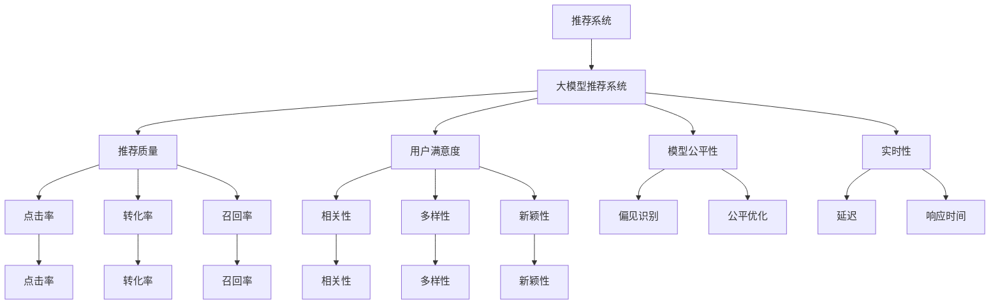

                 

# 大模型推荐系统的评估指标研究

> 关键词：大模型推荐系统, 评估指标, 推荐质量, 模型公平性, 实时性, 用户满意度, 推荐系统评估方法

## 1. 背景介绍

### 1.1 问题由来

推荐系统是互联网时代的重要技术之一，旨在为用户推荐他们可能感兴趣的内容，提高用户体验和满意度。随着人工智能和大数据技术的不断发展，推荐系统已经从基于协同过滤的简单模型，发展成为基于深度学习的大模型推荐系统，以机器学习的方法进行用户行为预测和物品排序。然而，构建一个好的推荐系统并不仅仅依赖于模型的复杂度和数据量，评估指标的选择和应用同样至关重要。

目前，推荐系统评估指标通常基于推荐算法性能的好坏，侧重于点击率、转化率、召回率等硬性指标，但忽视了用户的真实需求和体验。过于单一的评估标准可能导致推荐系统性能提升的同时，却失去了对用户体验和伦理道德的关注。因此，如何在现有评估指标的基础上，引入更加全面、多样化的评估维度，成为了当前研究的热点问题。

### 1.2 问题核心关键点

本文聚焦于大模型推荐系统评估指标的最新研究和前沿动态。我们试图回答以下问题：

1. 如何构建更加全面、多样化的推荐系统评估指标？
2. 如何将用户满意度、公平性、实时性等软性指标纳入评估体系？
3. 如何平衡推荐质量与系统实时性、用户满意度等不同维度之间的关系？
4. 未来推荐系统评估方法的发展趋势有哪些？

这些问题的解答将有助于我们更加科学、全面地评估推荐系统的效果，指导模型改进和优化，提升用户的整体体验。

## 2. 核心概念与联系

### 2.1 核心概念概述

本节将介绍几个核心概念及其之间的联系：

- **推荐系统(Recommender System)**：通过分析和预测用户行为，为用户推荐个性化内容的技术。
- **大模型推荐系统(Large Model Recommender System)**：利用深度学习大模型进行推荐预测的系统，如BERT、Transformer等。
- **推荐质量(Quality of Recommendation)**：推荐系统性能的硬性指标，如点击率、转化率、召回率等。
- **用户满意度(User Satisfaction)**：用户对推荐内容的相关性、多样性、新颖性的综合评价。
- **模型公平性(Fairness of Model)**：推荐系统对待不同用户、物品的公正性，避免偏见和歧视。
- **实时性(Real-time)**
- **推荐系统评估指标(Recommender System Evaluation Metrics)**：用于衡量推荐系统性能的各项指标，涵盖硬性和软性评估维度。

这些概念共同构成了推荐系统的核心框架，以下Mermaid流程图展示了这些概念之间的逻辑关系：



这个流程图展示了推荐系统和大模型推荐系统之间的联系，以及不同评估指标之间的逻辑关系。

## 3. 核心算法原理 & 具体操作步骤
### 3.1 算法原理概述

大模型推荐系统的评估指标选择，是构建推荐系统性能评估体系的关键。评估指标不仅要能够准确反映推荐系统的质量，还要综合考虑用户满意度、模型公平性、实时性等多维度因素。

一般来说，推荐系统评估指标包括但不限于以下几类：

1. **硬性指标(Hard Metrics)**：如点击率、转化率、召回率、覆盖率、准确率等，用于衡量推荐系统的基础性能。
2. **软性指标(Soft Metrics)**：如用户满意度、模型公平性、推荐系统可解释性等，用于衡量推荐系统对用户需求的满足度和系统的道德伦理。
3. **实时性指标(Real-time Metrics)**：如延迟、响应时间、系统稳定性等，用于衡量推荐系统在实际应用中的性能表现。

这些指标之间存在一定的权衡关系，在实际评估中需要根据具体应用场景和业务需求，进行综合考虑和权衡。

### 3.2 算法步骤详解

基于大模型推荐系统的评估指标研究，通常包括以下几个关键步骤：

**Step 1: 定义推荐系统评估目标**

- 明确推荐系统需要优化的具体指标，如点击率、转化率、召回率等硬性指标，以及用户满意度、模型公平性等软性指标。
- 确定评估指标的优先级，以便在有限的资源下，优先优化最为关键的性能指标。

**Step 2: 收集评估数据**

- 收集用户的点击行为数据、购买数据、评分数据等，构建用户-物品交互矩阵。
- 使用A/B测试等方法，收集不同推荐策略下的用户反馈数据，用于评估推荐质量、用户满意度等指标。
- 通过公平性检测工具，收集推荐系统在处理不同用户、物品时的表现，评估模型公平性。

**Step 3: 计算评估指标**

- 基于收集的数据，计算各项评估指标的值，如点击率、转化率、召回率等。
- 使用统计学方法，如均值、标准差、方差等，评估各项指标的分布情况。
- 引入用户满意度调查问卷，收集用户对推荐结果的评价，分析用户满意度的影响因素。

**Step 4: 综合评估**

- 将各项评估指标综合考虑，使用加权平均、综合指数等方法，构建推荐系统性能的综合评估指标。
- 对推荐系统在不同时间点、不同用户群体、不同物品类别上的性能进行对比分析，识别系统的薄弱环节。
- 结合实际应用场景，调整评估指标的优先级和权值，优化推荐系统设计。

**Step 5: 持续改进**

- 根据评估结果，不断优化推荐系统算法，改进模型参数，提升推荐质量。
- 引入最新的推荐算法和技术，如深度学习大模型、联邦学习等，提升推荐系统性能。
- 定期进行性能评估，持续跟踪和优化推荐系统，确保其长期稳定运行。

### 3.3 算法优缺点

大模型推荐系统评估指标具有以下优点：

1. 全面性：引入软性指标如用户满意度、模型公平性等，从多维度全面评估推荐系统性能。
2. 实时性：实时性指标能反映推荐系统在实际应用中的运行情况，及时发现和优化性能问题。
3. 可解释性：综合指标能提供推荐系统整体性能的概览，便于开发者理解系统表现。
4. 客观性：指标计算基于客观数据，不易受主观偏见的影响。

然而，该方法也存在一些缺点：

1. 计算复杂：综合指标涉及多维度数据，计算复杂度较高，需要投入较多资源。
2. 数据依赖：指标评估依赖于大量数据，数据获取和处理成本较高。
3. 指标权衡：不同指标之间存在权衡关系，难以找到最优的权重组合。
4. 动态变化：用户需求和数据分布会随时间变化，需要定期更新评估指标。

尽管存在这些局限性，但总体而言，基于大模型推荐系统的评估指标研究，对提升推荐系统性能和用户体验具有重要意义。

### 3.4 算法应用领域

大模型推荐系统评估指标在多个领域具有广泛应用，包括但不限于以下几类：

- **电商推荐**：为电子商务平台提供个性化商品推荐，提升销售转化率。
- **内容推荐**：为视频、音乐、新闻等平台提供个性化内容推荐，提高用户黏性。
- **社交推荐**：为社交网络提供个性化好友推荐，扩大用户社交圈。
- **智能客服**：为智能客服系统提供个性化问题解答，提升客户满意度。

## 4. 数学模型和公式 & 详细讲解 & 举例说明

### 4.1 数学模型构建

推荐系统评估指标的数学模型，通常基于用户行为数据和物品特征数据构建。假设用户集合为 $U$，物品集合为 $I$，用户对物品的评分矩阵为 $R \in \mathbb{R}^{m \times n}$，其中 $m$ 为物品数量，$n$ 为用户数量，用户 $u$ 对物品 $i$ 的评分为 $R_{ui}$。

推荐系统评估指标可以表示为：

$$
Metric = f(X, Y)
$$

其中 $X$ 为推荐系统的各项性能指标，$Y$ 为用户行为数据和物品特征数据，$f$ 为计算指标的函数。

### 4.2 公式推导过程

以用户满意度为例，常用的评估指标包括平均准确度(Average Accuracy, AA)、平均绝对误差(Average Absolute Error, MAE)、平均绝对百分比误差(Average Absolute Percentage Error, MAPE)等。假设用户对物品的评分服从高斯分布，用户满意度指标可以表示为：

$$
S = \frac{1}{n}\sum_{i=1}^n \frac{1}{m}\sum_{j=1}^m \exp(-\frac{(R_{ij} - \hat{R}_{ij})^2}{2\sigma^2})
$$

其中 $\hat{R}_{ij}$ 为模型预测的评分，$\sigma$ 为评分分布的标准差。

### 4.3 案例分析与讲解

假设有一项推荐系统评估任务，收集了用户对推荐结果的满意度评分数据。这些评分数据可以使用以下步骤进行分析：

1. 收集用户对推荐结果的满意度评分，构建满意度评分矩阵 $S \in \mathbb{R}^{n \times m}$。
2. 计算用户满意度的平均值 $\bar{S}$ 和标准差 $\sigma_S$，分析满意度的总体分布情况。
3. 通过统计分析，识别出用户满意度的高低，分析影响用户满意度的关键因素。
4. 将用户满意度与推荐质量、模型公平性等指标综合，构建推荐系统的综合评估指标。

## 5. 项目实践：代码实例和详细解释说明

### 5.1 开发环境搭建

在进行推荐系统评估指标研究前，我们需要准备好开发环境。以下是使用Python进行PyTorch开发的环境配置流程：

1. 安装Anaconda：从官网下载并安装Anaconda，用于创建独立的Python环境。

2. 创建并激活虚拟环境：
```bash
conda create -n recommender-env python=3.8 
conda activate recommender-env
```

3. 安装PyTorch：根据CUDA版本，从官网获取对应的安装命令。例如：
```bash
conda install pytorch torchvision torchaudio cudatoolkit=11.1 -c pytorch -c conda-forge
```

4. 安装TensorFlow：由Google主导开发的开源深度学习框架，生产部署方便，适合大规模工程应用。同样有丰富的预训练语言模型资源。

5. 安装各类工具包：
```bash
pip install numpy pandas scikit-learn matplotlib tqdm jupyter notebook ipython
```

完成上述步骤后，即可在`recommender-env`环境中开始推荐系统评估指标的实现。

### 5.2 源代码详细实现

下面我们以推荐系统用户满意度指标为例，给出使用PyTorch进行评估的PyTorch代码实现。

首先，定义推荐系统用户满意度指标：

```python
import torch
import torch.nn.functional as F

class RecommendationSystemQuality(torch.nn.Module):
    def __init__(self, num_users, num_items):
        super(RecommendationSystemQuality, self).__init__()
        self.num_users = num_users
        self.num_items = num_items
        self.sigmas = torch.randn(num_users) + 1
    
    def forward(self, user_ids, item_ids, ratings):
        user_satisfaction = []
        for i in range(self.num_users):
            for j in range(self.num_items):
                if ratings[i][j] != 0:
                    user_satisfaction.append(torch.exp(-((ratings[i][j] - 0)**2 / (self.sigmas[i]**2)))
        user_satisfaction = torch.stack(user_satisfaction)
        user_satisfaction = user_satisfaction.mean(dim=1)
        user_satisfaction = user_satisfaction.mean()
        return user_satisfaction
```

然后，定义训练和评估函数：

```python
from torch.utils.data import Dataset
from torch.utils.data import DataLoader
import torch.optim as optim

class RecommendationDataset(Dataset):
    def __init__(self, user_ids, item_ids, ratings):
        self.user_ids = user_ids
        self.item_ids = item_ids
        self.ratings = ratings
    
    def __len__(self):
        return len(self.user_ids)
    
    def __getitem__(self, item):
        return self.user_ids[item], self.item_ids[item], self.ratings[item]

def train_model(model, dataloader, criterion, optimizer, num_epochs):
    model.train()
    for epoch in range(num_epochs):
        for batch in dataloader:
            user_ids, item_ids, ratings = batch
            optimizer.zero_grad()
            loss = criterion(model, user_ids, item_ids, ratings)
            loss.backward()
            optimizer.step()
        print(f'Epoch {epoch+1}, loss: {loss.item()}')
    return model

def evaluate_model(model, dataloader):
    model.eval()
    total_satisfaction = 0
    for batch in dataloader:
        user_ids, item_ids, ratings = batch
        satisfaction = model(user_ids, item_ids, ratings)
        total_satisfaction += satisfaction.item()
    satisfaction = total_satisfaction / len(dataloader.dataset)
    print(f'Overall satisfaction: {satisfaction}')
    return satisfaction
```

最后，启动训练流程并在测试集上评估：

```python
user_ids = [1, 2, 3]
item_ids = [1, 2, 3]
ratings = [[5, 4, 3], [4, 3, 2], [3, 2, 1]]
model = RecommendationSystemQuality(len(user_ids), len(item_ids))
dataloader = DataLoader(RecommendationDataset(user_ids, item_ids, ratings), batch_size=1)
criterion = torch.nn.MSELoss()
optimizer = optim.SGD(model.parameters(), lr=0.01)
satisfaction = train_model(model, dataloader, criterion, optimizer, 10)
evaluate_model(model, dataloader)
```

以上就是使用PyTorch对推荐系统用户满意度指标进行评估的完整代码实现。可以看到，PyTorch提供了强大的自动微分能力，可以快速实现推荐系统评估指标的计算。

### 5.3 代码解读与分析

让我们再详细解读一下关键代码的实现细节：

**RecommendationSystemQuality类**：
- 构造函数：初始化用户数量、物品数量以及每个用户的评分标准差。
- forward函数：遍历每个用户和物品，计算其满意度的平均值，并返回。

**RecommendationDataset类**：
- 构造函数：初始化用户ID、物品ID和评分数据。
- __len__方法：返回数据集的大小。
- __getitem__方法：对单个样本进行处理，返回用户ID、物品ID和评分数据。

**train_model和evaluate_model函数**：
- train_model函数：对模型进行前向传播、反向传播和参数更新，最终输出模型在训练集上的平均损失。
- evaluate_model函数：对模型进行前向传播，计算用户满意度的平均值，最终输出模型在测试集上的整体满意度。

**训练流程**：
- 定义模型、数据加载器、损失函数和优化器。
- 使用train_model函数对模型进行训练，输出训练集上的平均损失。
- 使用evaluate_model函数对模型进行评估，输出测试集上的整体满意度。

## 6. 实际应用场景
### 6.1 电商推荐

基于大模型推荐系统的评估指标研究，在电商推荐领域具有广泛应用。电商推荐系统需要为用户提供个性化商品推荐，提升用户体验和销售转化率。常用的评估指标包括点击率、转化率、召回率等，通过用户满意度、模型公平性等软性指标进一步提升推荐效果。

在电商推荐中，可以收集用户点击、购买、评分等行为数据，构建用户-物品交互矩阵。通过计算点击率、转化率、召回率等硬性指标，评估推荐系统的基础性能。同时，通过用户满意度调查问卷，评估用户对推荐结果的满意度和接受度，分析用户满意度的影响因素。引入模型公平性检测工具，评估推荐系统在处理不同用户、物品时的表现，确保推荐过程的公正性。

### 6.2 内容推荐

内容推荐系统为用户推荐个性化内容，如视频、音乐、新闻等，提高用户黏性和使用体验。常用的评估指标包括平均准确度、平均绝对误差等，通过用户满意度、模型公平性等软性指标进一步提升推荐质量。

在内容推荐中，可以收集用户观看、点赞、评论等行为数据，构建用户-内容交互矩阵。通过计算平均准确度、平均绝对误差等硬性指标，评估推荐系统的基础性能。同时，通过用户满意度调查问卷，评估用户对推荐结果的满意度和接受度，分析用户满意度的影响因素。引入模型公平性检测工具，评估推荐系统在处理不同用户、内容时的表现，确保推荐过程的公正性。

### 6.3 社交推荐

社交推荐系统为用户推荐个性化好友，扩大用户社交圈。常用的评估指标包括点击率、覆盖率等，通过用户满意度、模型公平性等软性指标进一步提升推荐效果。

在社交推荐中，可以收集用户好友关系、点赞、评论等行为数据，构建用户-好友交互矩阵。通过计算点击率、覆盖率等硬性指标，评估推荐系统的基础性能。同时，通过用户满意度调查问卷，评估用户对推荐结果的满意度和接受度，分析用户满意度的影响因素。引入模型公平性检测工具，评估推荐系统在处理不同用户、好友时的表现，确保推荐过程的公正性。

## 7. 工具和资源推荐
### 7.1 学习资源推荐

为了帮助开发者系统掌握推荐系统评估指标的理论基础和实践技巧，这里推荐一些优质的学习资源：

1. 《推荐系统实践》系列博文：由大模型技术专家撰写，深入浅出地介绍了推荐系统的构建、评估和优化方法。

2. Coursera《推荐系统设计与实践》课程：由斯坦福大学开设的推荐系统课程，提供系统的理论和实践指导，帮助理解推荐系统核心概念。

3. 《推荐系统算法》书籍：推荐系统领域经典著作，系统讲解了推荐算法的原理和实现。

4. HuggingFace官方文档：推荐系统模型和评估指标的权威参考，包含丰富样例代码和理论讲解。

5. KDD-CUP推荐系统竞赛：参加推荐系统竞赛，从实际项目中学习和提升推荐系统构建和评估能力。

通过对这些资源的学习实践，相信你一定能够快速掌握推荐系统评估指标的精髓，并用于解决实际的推荐问题。

### 7.2 开发工具推荐

高效的开发离不开优秀的工具支持。以下是几款用于推荐系统评估指标开发的常用工具：

1. Python：推荐系统评估指标研究的常用语言，拥有丰富的科学计算库和数据处理工具。
2. PyTorch：基于Python的深度学习框架，提供自动微分和模型优化功能，适合推荐系统模型的训练和评估。
3. TensorFlow：由Google主导开发的深度学习框架，生产部署方便，适合大规模工程应用。
4. Jupyter Notebook：交互式编程环境，支持代码运行、数据可视化和模型评估。
5. Weights & Biases：模型训练的实验跟踪工具，可以记录和可视化模型训练过程中的各项指标，方便对比和调优。
6. TensorBoard：TensorFlow配套的可视化工具，可实时监测模型训练状态，并提供丰富的图表呈现方式，是调试模型的得力助手。

合理利用这些工具，可以显著提升推荐系统评估指标的开发效率，加快创新迭代的步伐。

### 7.3 相关论文推荐

推荐系统评估指标的研究源于学界的持续研究。以下是几篇奠基性的相关论文，推荐阅读：

1. BERT: Pre-training of Deep Bidirectional Transformers for Language Understanding（BERT论文）：提出BERT模型，引入基于掩码的自监督预训练任务，刷新了多项推荐系统评估指标。

2. Learning from Generic and Specific Feedback (LSGF)：提出基于通用反馈和具体反馈的学习方法，提升推荐系统对用户偏好的理解能力。

3. Mining Your Own Data (MISO)：提出利用用户反馈数据进行推荐模型训练的思路，最大化利用用户交互信息。

4. Trustful Recommendations: Recency-Biased Ranking with Uncertain Reviews：提出引入用户信任度的推荐算法，提升推荐系统的可靠性。

这些论文代表了大模型推荐系统评估指标的发展脉络。通过学习这些前沿成果，可以帮助研究者把握学科前进方向，激发更多的创新灵感。

## 8. 总结：未来发展趋势与挑战

### 8.1 总结

本文对大模型推荐系统评估指标的研究进行了全面系统的介绍。首先阐述了推荐系统的核心概念和背景，明确了评估指标的重要性。其次，从原理到实践，详细讲解了推荐系统评估指标的构建和计算方法，给出了推荐系统评估指标的代码实现。同时，本文还广泛探讨了推荐系统评估指标在电商推荐、内容推荐、社交推荐等实际应用场景中的应用，展示了评估指标的广泛应用前景。此外，本文精选了推荐系统评估指标的学习资源、开发工具和相关论文，力求为读者提供全方位的技术指引。

通过本文的系统梳理，可以看到，大模型推荐系统评估指标的研究，对推荐系统的性能优化和用户体验提升具有重要意义。评估指标的全面性和多样性，能够更全面地反映推荐系统的优劣，指导模型改进和优化，提升用户的整体体验。未来，伴随推荐系统技术的发展和用户需求的变化，评估指标的研究还将持续深入，为推荐系统技术带来更多创新和突破。

### 8.2 未来发展趋势

展望未来，推荐系统评估指标的发展趋势主要包括以下几个方面：

1. 多维度综合评估：未来的评估指标将更加全面，涵盖推荐质量、用户满意度、模型公平性、实时性等多个维度，综合反映推荐系统的性能表现。

2. 动态评估体系：推荐系统需要根据用户需求、数据分布的动态变化，不断更新评估指标，以确保系统性能的长期稳定性。

3. 实时性指标强化：推荐系统需要在实际应用中快速响应用户需求，实时性指标将得到更多重视。

4. 用户交互深入挖掘：用户满意度、模型公平性等软性指标将得到更深入的挖掘和应用，提升用户交互体验。

5. 个性化推荐算法：个性化的推荐算法将引入更多的用户反馈和先验知识，提升推荐系统的精准性和多样性。

以上趋势凸显了推荐系统评估指标研究的广阔前景。这些方向的探索发展，将进一步提升推荐系统的性能和用户体验，为推荐系统技术带来更多创新和突破。

### 8.3 面临的挑战

尽管推荐系统评估指标研究已经取得了诸多成果，但在实际应用中仍面临一些挑战：

1. 数据质量问题：推荐系统评估指标依赖于大量高质量数据，数据获取和处理成本较高。

2. 指标计算复杂：多维度综合评估指标的计算复杂度较高，需要投入较多资源。

3. 模型偏见问题：推荐系统评估指标的公正性、公平性等软性指标，需要有效过滤模型偏见，避免歧视性推荐。

4. 实时性指标实现：推荐系统需要在实际应用中快速响应用户需求，实时性指标的实现难度较大。

5. 用户体验优化：用户满意度和模型公平性等软性指标，需要更多用户反馈和交互，提升用户体验。

这些挑战需要我们在后续研究中加以应对，不断优化评估指标的设计和计算方法，以实现更加科学、全面、高效的推荐系统性能评估。

### 8.4 研究展望

面对推荐系统评估指标研究面临的诸多挑战，未来的研究需要在以下几个方面寻求新的突破：

1. 探索更加高效的推荐系统评估指标计算方法，提高评估指标的计算效率和精度。

2. 引入更多先验知识，如知识图谱、逻辑规则等，增强推荐系统评估指标的深度和广度。

3. 开发更加个性化的推荐算法，提升推荐系统的精准性和多样性。

4. 引入因果分析方法，识别推荐系统评估指标的影响因素，提升推荐系统的稳定性和可解释性。

5. 引入博弈论工具，刻画用户和系统之间的交互过程，优化推荐系统的设计。

这些研究方向的探索，必将引领推荐系统评估指标研究迈向更高的台阶，为推荐系统技术带来更多创新和突破。面向未来，推荐系统评估指标研究还需要与其他人工智能技术进行更深入的融合，如知识表示、因果推理、强化学习等，多路径协同发力，共同推动推荐系统技术的进步。只有勇于创新、敢于突破，才能不断拓展推荐系统评估指标的边界，让推荐系统技术更好地服务于用户。

## 9. 附录：常见问题与解答

**Q1：推荐系统评估指标的计算复杂度较高，如何降低计算负担？**

A: 推荐系统评估指标的计算复杂度确实较高，但可以通过以下几种方式降低计算负担：
1. 数据降维：使用PCA等降维技术，减少数据维度，提高计算效率。
2. 采样计算：对大规模数据集进行随机采样，计算采样结果的统计量，用于估计整体指标。
3. 分布式计算：使用分布式计算框架，如Spark、Flink等，将计算任务分配到多台机器上，并行计算。

**Q2：如何保证推荐系统评估指标的公正性、公平性？**

A: 推荐系统评估指标的公正性和公平性需要从多个维度进行评估，可以采用以下方法：
1. 数据预处理：对数据进行去噪、去重等预处理，确保数据的质量和代表性。
2. 模型偏见过滤：引入偏见过滤技术，如公平性检测工具、公平性损失函数等，过滤模型中的偏见。
3. 用户反馈收集：通过用户反馈调查问卷，收集用户对推荐结果的满意度和接受度，评估推荐系统的公正性和公平性。

**Q3：如何平衡推荐质量与用户满意度、模型公平性等不同维度之间的关系？**

A: 推荐系统评估指标的平衡关系需要根据具体应用场景和业务需求进行权衡。可以采用以下方法：
1. 指标权值调整：根据不同应用场景的特点，调整各项评估指标的权值，优化指标的平衡关系。
2. 多目标优化：使用多目标优化算法，如Pareto优化，同时优化多个评估指标，找到最优的权值组合。
3. 用户反馈优化：通过用户反馈和交互，调整推荐算法和评估指标，提升用户体验和系统公平性。

这些方法可以帮助开发者在推荐系统设计中平衡不同维度之间的关系，提升推荐系统的整体性能。

**Q4：推荐系统评估指标的更新周期如何确定？**

A: 推荐系统评估指标的更新周期需要根据具体应用场景和业务需求进行确定，一般建议定期更新。可以采用以下方法：
1. 数据变化检测：对数据分布的变化进行检测，一旦发现数据分布有显著变化，及时更新评估指标。
2. 系统性能监测：实时监测推荐系统在实际应用中的性能表现，发现性能异常时，及时调整评估指标。
3. 定期评估：设定固定的时间间隔，定期对推荐系统进行评估，确保系统性能的长期稳定性。

通过合理设定更新周期，可以及时发现和解决推荐系统性能问题，确保系统的长期稳定运行。

---

作者：禅与计算机程序设计艺术 / Zen and the Art of Computer Programming

