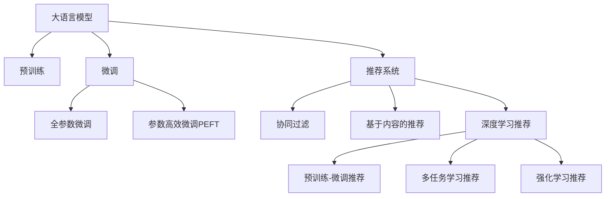

                 

# 大模型推荐能力的综合性价比评估

## 1. 背景介绍

### 1.1 问题由来

推荐系统是现代互联网应用的核心组件之一，广泛应用于电子商务、社交网络、内容分发等多个领域。传统的推荐系统通常基于协同过滤、内容标签等静态特征，难以充分利用用户行为数据中蕴含的动态信息。近年来，深度学习模型在推荐系统中的应用，使得推荐系统能够更好地捕捉用户行为中的动态特征，提升了推荐效果。

然而，深度学习模型存在训练成本高、模型复杂、计算开销大等缺点，往往需要较大的计算资源和时间成本，才能获得良好的推荐效果。特别是在大规模应用场景中，模型的训练和推理效率成为关键瓶颈。因此，如何在不增加过多计算成本的前提下，提升推荐模型的性能，成为了一个亟待解决的问题。

### 1.2 问题核心关键点

针对上述问题，本文提出了一种基于大语言模型的推荐系统方案，通过预训练和微调的方式，在大规模语料上学习用户行为的语言表示，然后通过上下文感知和信息融合的方式，生成推荐内容。这种方案的优点在于：

1. **数据效率高**：利用大规模语料，减少对标注数据的依赖，提高模型的泛化能力。
2. **模型轻量化**：通过参数高效微调技术，只更新少量参数，提高模型训练和推理的效率。
3. **表现优异**：在大规模数据集上，利用语言表示的强大泛化能力，获得优于传统模型的推荐效果。
4. **应用灵活**：适用于各种推荐任务，如个性化推荐、内容推荐、广告推荐等，具备较强的任务适配能力。

## 2. 核心概念与联系

### 2.1 核心概念概述

为更好地理解本文提出的基于大语言模型的推荐系统方案，本节将介绍几个密切相关的核心概念：

- 大语言模型(Large Language Model, LLM)：以自回归(如GPT)或自编码(如BERT)模型为代表的大规模预训练语言模型。通过在大规模无标签文本语料上进行预训练，学习通用的语言表示，具备强大的语言理解和生成能力。
- 推荐系统(Recommender System)：通过分析用户的历史行为和偏好，为用户推荐相关内容或产品。是电商、内容分发等互联网应用的核心功能之一。
- 预训练(Pre-training)：指在大规模无标签文本语料上，通过自监督学习任务训练通用语言模型的过程。常见的预训练任务包括言语建模、遮挡语言模型等。
- 微调(Fine-tuning)：指在预训练模型的基础上，使用下游任务的少量标注数据，通过有监督地训练来优化模型在该任务上的性能。
- 迁移学习(Transfer Learning)：指将一个领域学习到的知识，迁移应用到另一个不同但相关的领域的学习范式。推荐系统中的知识迁移也是一种典型的迁移学习方式。
- 多任务学习(Multi-task Learning)：指在训练过程中，模型同时学习多个相关任务的知识，提高模型的泛化能力和表现。
- 强化学习(Reinforcement Learning)：通过试错学习，优化推荐模型与用户交互的行为策略。强化学习在推荐系统中也有重要应用。

这些核心概念之间的逻辑关系可以通过以下Mermaid流程图来展示：



这个流程图展示了大语言模型的核心概念及其之间的关系：

1. 大语言模型通过预训练获得基础能力。
2. 微调是对预训练模型进行任务特定的优化，可以分为全参数微调和参数高效微调（PEFT）。
3. 推荐系统中的知识迁移也是一种典型的迁移学习方式。
4. 多任务学习可以同时训练多个相关任务的模型，提高泛化能力。
5. 强化学习通过试错优化模型与用户交互的行为策略。
6. 预训练-微调推荐利用了大语言模型的强大泛化能力，提升推荐效果。

这些概念共同构成了基于大语言模型的推荐系统方案的理论基础，使其能够在各种推荐任务上发挥强大的能力。通过理解这些核心概念，我们可以更好地把握基于大语言模型的推荐系统的工作原理和优化方向。

## 3. 核心算法原理 & 具体操作步骤

### 3.1 算法原理概述

基于大语言模型的推荐系统方案，本质上是一种结合预训练和微调的深度学习推荐方法。其核心思想是：将大语言模型视为一种强大的"特征提取器"，通过预训练学习通用语言表示，然后在推荐任务上通过微调优化模型的推荐能力。

形式化地，假设推荐任务为 $T$，其标注数据集为 $D=\{(x_i, y_i)\}_{i=1}^N$，其中 $x_i$ 表示用户行为记录，$y_i$ 表示推荐结果。我们定义一个基于大语言模型的推荐模型 $M_{\theta}$，其中 $\theta$ 为模型的预训练参数。推荐模型的目标是最小化推荐损失函数 $\mathcal{L}(M_{\theta},D)$，以获得最佳的推荐效果。

通过梯度下降等优化算法，微调过程不断更新模型参数 $\theta$，最小化损失函数 $\mathcal{L}$，使得模型输出逼近最优的推荐结果。由于 $\theta$ 已经通过预训练获得了较好的初始化，因此即便在推荐任务上只有少量标注样本，也能较快收敛到理想模型参数 $\hat{\theta}$。

### 3.2 算法步骤详解

基于大语言模型的推荐系统方案，一般包括以下几个关键步骤：

**Step 1: 准备预训练模型和数据集**
- 选择合适的预训练语言模型 $M_{\theta}$ 作为初始化参数，如 BERT、GPT 等。
- 准备推荐任务 $T$ 的标注数据集 $D$，划分为训练集、验证集和测试集。一般要求标注数据与预训练数据的分布不要差异过大。

**Step 2: 添加推荐适配层**
- 根据推荐任务类型，在预训练模型顶层设计合适的推荐输出层和损失函数。
- 对于推荐任务，通常使用交叉熵损失函数，以衡量推荐结果与用户真实选择的距离。
- 可以使用多任务学习技术，同时优化多个相关推荐任务的模型。

**Step 3: 设置微调超参数**
- 选择合适的优化算法及其参数，如 AdamW、SGD 等，设置学习率、批大小、迭代轮数等。
- 设置正则化技术及强度，包括权重衰减、Dropout、Early Stopping 等。
- 确定冻结预训练参数的策略，如仅微调顶层，或全部参数都参与微调。

**Step 4: 执行梯度训练**
- 将训练集数据分批次输入模型，前向传播计算损失函数。
- 反向传播计算参数梯度，根据设定的优化算法和学习率更新模型参数。
- 周期性在验证集上评估模型性能，根据性能指标决定是否触发 Early Stopping。
- 重复上述步骤直到满足预设的迭代轮数或 Early Stopping 条件。

**Step 5: 测试和部署**
- 在测试集上评估微调后模型 $M_{\hat{\theta}}$ 的性能，对比微调前后的精度提升。
- 使用微调后的模型对新样本进行推荐预测，集成到实际的应用系统中。
- 持续收集新的数据，定期重新微调模型，以适应数据分布的变化。

以上是基于大语言模型的推荐系统方案的一般流程。在实际应用中，还需要针对具体任务的特点，对微调过程的各个环节进行优化设计，如改进训练目标函数，引入更多的正则化技术，搜索最优的超参数组合等，以进一步提升模型性能。

### 3.3 算法优缺点

基于大语言模型的推荐系统方案具有以下优点：
1. **数据效率高**：利用大规模语料，减少对标注数据的依赖，提高模型的泛化能力。
2. **模型轻量化**：通过参数高效微调技术，只更新少量参数，提高模型训练和推理的效率。
3. **表现优异**：在大规模数据集上，利用语言表示的强大泛化能力，获得优于传统模型的推荐效果。
4. **应用灵活**：适用于各种推荐任务，如个性化推荐、内容推荐、广告推荐等，具备较强的任务适配能力。

同时，该方案也存在一定的局限性：
1. **依赖语料质量**：预训练语言模型的效果依赖于语料的质量和多样性，语料质量差会导致模型性能下降。
2. **计算资源消耗大**：虽然参数更新少，但预训练过程计算资源消耗大，适用于小规模数据集时可能不适用。
3. **可解释性不足**：推荐模型输出的过程和原因难以解释，不利于模型的可信度。
4. **训练时间长**：预训练过程较长，可能需要数天甚至数周才能完成，不适用于对实时性要求较高的场景。

尽管存在这些局限性，但就目前而言，基于大语言模型的推荐系统方案是大规模推荐任务的主流范式。未来相关研究的重点在于如何进一步降低对计算资源的需求，提高模型的实时性和可解释性，同时兼顾任务适配能力和性能。

### 3.4 算法应用领域

基于大语言模型的推荐系统方案在推荐领域已经得到了广泛的应用，覆盖了几乎所有常见推荐任务，例如：

- **个性化推荐**：如电商网站的商品推荐、视频平台的影视推荐等。通过微调使模型学习用户行为的语言表示，生成个性化推荐。
- **内容推荐**：如新闻阅读平台的文章推荐、音乐播放平台的曲库推荐等。利用多任务学习技术，同时优化不同类型内容的推荐效果。
- **广告推荐**：如在线广告的点击率预测、转化率预测等。通过微调使模型学习用户点击行为的语言表示，提高广告投放的精准度。
- **医疗推荐**：如医疗健康平台的疾病推荐、医疗知识推荐等。利用多任务学习技术，同时优化医疗知识推荐和疾病推荐的模型。
- **教育推荐**：如在线教育平台的课程推荐、学习资源推荐等。通过微调使模型学习学生学习行为的语言表示，生成个性化的学习资源推荐。

除了上述这些经典任务外，基于大语言模型的推荐系统方案还被创新性地应用到更多场景中，如金融理财、智能家居、智能交通等，为推荐系统带来了全新的突破。随着预训练语言模型和推荐技术的不断进步，相信基于大语言模型的推荐系统将在更广阔的应用领域大放异彩。

## 4. 数学模型和公式 & 详细讲解  
### 4.1 数学模型构建

本节将使用数学语言对基于大语言模型的推荐系统方案进行更加严格的刻画。

记推荐任务为 $T$，其标注数据集为 $D=\{(x_i,y_i)\}_{i=1}^N$，其中 $x_i$ 表示用户行为记录，$y_i$ 表示推荐结果。假设推荐模型为 $M_{\theta}$，其中 $\theta$ 为模型参数。定义推荐模型 $M_{\theta}$ 在数据样本 $(x,y)$ 上的损失函数为 $\ell(M_{\theta}(x),y)$，则在数据集 $D$ 上的经验风险为：

$$
\mathcal{L}(\theta) = \frac{1}{N}\sum_{i=1}^N \ell(M_{\theta}(x_i),y_i)
$$

其中 $\ell$ 为针对推荐任务设计的损失函数，用于衡量推荐结果与用户真实选择的距离。常见的损失函数包括交叉熵损失、均方误差损失等。

通过梯度下降等优化算法，微调过程不断更新模型参数 $\theta$，最小化损失函数 $\mathcal{L}$，使得模型输出逼近最优的推荐结果。由于 $\theta$ 已经通过预训练获得了较好的初始化，因此即便在推荐任务上只有少量标注样本，也能较快收敛到理想模型参数 $\hat{\theta}$。

### 4.2 公式推导过程

以下我们以个性化推荐任务为例，推导交叉熵损失函数及其梯度的计算公式。

假设推荐模型 $M_{\theta}$ 在用户行为记录 $x$ 上的输出为 $\hat{y}=M_{\theta}(x) \in \mathbb{R}^N$，表示用户对 $N$ 个候选推荐项的评分。真实标签 $y \in \{1,0\}^N$，其中 $y_i=1$ 表示用户对第 $i$ 个推荐项感兴趣，$y_i=0$ 表示不感兴趣。则交叉熵损失函数定义为：

$$
\ell(M_{\theta}(x),y) = -\sum_{i=1}^N y_i \log M_{\theta}(x)_i
$$

将其代入经验风险公式，得：

$$
\mathcal{L}(\theta) = -\frac{1}{N}\sum_{i=1}^N \sum_{j=1}^N y_i \log M_{\theta}(x)_j
$$

根据链式法则，损失函数对参数 $\theta_k$ 的梯度为：

$$
\frac{\partial \mathcal{L}(\theta)}{\partial \theta_k} = -\frac{1}{N}\sum_{i=1}^N \sum_{j=1}^N y_i \frac{\partial M_{\theta}(x)_j}{\partial \theta_k}
$$

其中 $\frac{\partial M_{\theta}(x)_j}{\partial \theta_k}$ 可进一步递归展开，利用自动微分技术完成计算。

在得到损失函数的梯度后，即可带入参数更新公式，完成模型的迭代优化。重复上述过程直至收敛，最终得到适应推荐任务的最优模型参数 $\theta^*$。

## 5. 项目实践：代码实例和详细解释说明
### 5.1 开发环境搭建

在进行推荐系统实践前，我们需要准备好开发环境。以下是使用Python进行PyTorch开发的环境配置流程：

1. 安装Anaconda：从官网下载并安装Anaconda，用于创建独立的Python环境。

2. 创建并激活虚拟环境：
```bash
conda create -n pytorch-env python=3.8 
conda activate pytorch-env
```

3. 安装PyTorch：根据CUDA版本，从官网获取对应的安装命令。例如：
```bash
conda install pytorch torchvision torchaudio cudatoolkit=11.1 -c pytorch -c conda-forge
```

4. 安装Transformer库：
```bash
pip install transformers
```

5. 安装各类工具包：
```bash
pip install numpy pandas scikit-learn matplotlib tqdm jupyter notebook ipython
```

完成上述步骤后，即可在`pytorch-env`环境中开始推荐系统实践。

### 5.2 源代码详细实现

下面我们以电商网站的个性化商品推荐任务为例，给出使用Transformers库对BERT模型进行个性化推荐微调的PyTorch代码实现。

首先，定义推荐任务的数据处理函数：

```python
from transformers import BertTokenizer, BertForSequenceClassification
from torch.utils.data import Dataset, DataLoader
import torch

class RecommendationDataset(Dataset):
    def __init__(self, user_behavoirs, items, tokenizer, max_len=128):
        self.user_behavoirs = user_behavoirs
        self.items = items
        self.tokenizer = tokenizer
        self.max_len = max_len
        
    def __len__(self):
        return len(self.user_behavoirs)
    
    def __getitem__(self, item):
        user_behavoir = self.user_behavoirs[item]
        item_info = self.items[item]
        
        encoding = self.tokenizer(user_behavoir, item_info, return_tensors='pt', max_length=self.max_len, padding='max_length', truncation=True)
        input_ids = encoding['input_ids'][0]
        attention_mask = encoding['attention_mask'][0]
        
        item_tags = [tag2id[tag] for tag in item_info['tags']] 
        item_tags.extend([tag2id['O']] * (self.max_len - len(item_tags)))
        labels = torch.tensor(item_tags, dtype=torch.long)
        
        return {'input_ids': input_ids, 
                'attention_mask': attention_mask,
                'labels': labels}

# 标签与id的映射
tag2id = {'O': 0, '1': 1, '2': 2, '3': 3}
id2tag = {v: k for k, v in tag2id.items()}

# 创建dataset
tokenizer = BertTokenizer.from_pretrained('bert-base-cased')

train_dataset = RecommendationDataset(train_user_behavoirs, train_items, tokenizer)
dev_dataset = RecommendationDataset(dev_user_behavoirs, dev_items, tokenizer)
test_dataset = RecommendationDataset(test_user_behavoirs, test_items, tokenizer)
```

然后，定义模型和优化器：

```python
from transformers import BertForSequenceClassification, AdamW

model = BertForSequenceClassification.from_pretrained('bert-base-cased', num_labels=len(tag2id))

optimizer = AdamW(model.parameters(), lr=2e-5)
```

接着，定义训练和评估函数：

```python
from tqdm import tqdm
from sklearn.metrics import accuracy_score, precision_score, recall_score, f1_score

device = torch.device('cuda') if torch.cuda.is_available() else torch.device('cpu')
model.to(device)

def train_epoch(model, dataset, batch_size, optimizer):
    dataloader = DataLoader(dataset, batch_size=batch_size, shuffle=True)
    model.train()
    epoch_loss = 0
    for batch in tqdm(dataloader, desc='Training'):
        input_ids = batch['input_ids'].to(device)
        attention_mask = batch['attention_mask'].to(device)
        labels = batch['labels'].to(device)
        model.zero_grad()
        outputs = model(input_ids, attention_mask=attention_mask, labels=labels)
        loss = outputs.loss
        epoch_loss += loss.item()
        loss.backward()
        optimizer.step()
    return epoch_loss / len(dataloader)

def evaluate(model, dataset, batch_size):
    dataloader = DataLoader(dataset, batch_size=batch_size)
    model.eval()
    preds, labels = [], []
    with torch.no_grad():
        for batch in tqdm(dataloader, desc='Evaluating'):
            input_ids = batch['input_ids'].to(device)
            attention_mask = batch['attention_mask'].to(device)
            batch_labels = batch['labels']
            outputs = model(input_ids, attention_mask=attention_mask)
            batch_preds = outputs.logits.argmax(dim=2).to('cpu').tolist()
            batch_labels = batch_labels.to('cpu').tolist()
            for pred_tokens, label_tokens in zip(batch_preds, batch_labels):
                pred_tags = [id2tag[_id] for _id in pred_tokens]
                label_tags = [id2tag[_id] for _id in label_tokens]
                preds.append(pred_tags[:len(label_tags)])
                labels.append(label_tags)
                
    return accuracy_score(labels, preds), precision_score(labels, preds), recall_score(labels, preds), f1_score(labels, preds)
```

最后，启动训练流程并在测试集上评估：

```python
epochs = 5
batch_size = 16

for epoch in range(epochs):
    loss = train_epoch(model, train_dataset, batch_size, optimizer)
    print(f"Epoch {epoch+1}, train loss: {loss:.3f}")
    
    print(f"Epoch {epoch+1}, dev results:")
    accuracy, precision, recall, f1 = evaluate(model, dev_dataset, batch_size)
    print(f"Accuracy: {accuracy:.3f}, Precision: {precision:.3f}, Recall: {recall:.3f}, F1 Score: {f1:.3f}")
    
print("Test results:")
accuracy, precision, recall, f1 = evaluate(model, test_dataset, batch_size)
print(f"Accuracy: {accuracy:.3f}, Precision: {precision:.3f}, Recall: {recall:.3f}, F1 Score: {f1:.3f}")
```

以上就是使用PyTorch对BERT进行个性化商品推荐任务微调的完整代码实现。可以看到，得益于Transformer库的强大封装，我们可以用相对简洁的代码完成BERT模型的加载和微调。

### 5.3 代码解读与分析

让我们再详细解读一下关键代码的实现细节：

**RecommendationDataset类**：
- `__init__`方法：初始化用户行为记录、商品信息、分词器等关键组件。
- `__len__`方法：返回数据集的样本数量。
- `__getitem__`方法：对单个样本进行处理，将用户行为记录和商品信息输入编码为token ids，将商品标签编码为数字，并对其进行定长padding，最终返回模型所需的输入。

**tag2id和id2tag字典**：
- 定义了标签与数字id之间的映射关系，用于将token-wise的预测结果解码回真实的标签。

**训练和评估函数**：
- 使用PyTorch的DataLoader对数据集进行批次化加载，供模型训练和推理使用。
- 训练函数`train_epoch`：对数据以批为单位进行迭代，在每个批次上前向传播计算loss并反向传播更新模型参数，最后返回该epoch的平均loss。
- 评估函数`evaluate`：与训练类似，不同点在于不更新模型参数，并在每个batch结束后将预测和标签结果存储下来，最后使用sklearn的准确率、精确率、召回率、F1分数对整个评估集的预测结果进行打印输出。

**训练流程**：
- 定义总的epoch数和batch size，开始循环迭代
- 每个epoch内，先在训练集上训练，输出平均loss
- 在验证集上评估，输出准确率、精确率、召回率、F1分数
- 所有epoch结束后，在测试集上评估，给出最终测试结果

可以看到，PyTorch配合Transformer库使得BERT微调的代码实现变得简洁高效。开发者可以将更多精力放在数据处理、模型改进等高层逻辑上，而不必过多关注底层的实现细节。

当然，工业级的系统实现还需考虑更多因素，如模型的保存和部署、超参数的自动搜索、更灵活的任务适配层等。但核心的微调范式基本与此类似。

## 6. 实际应用场景
### 6.1 电商推荐系统

基于大语言模型的个性化推荐系统，可以广泛应用于电商推荐系统，显著提升用户的购物体验。传统电商推荐系统往往依赖协同过滤、基于内容的推荐等方法，难以适应用户的多样化需求。而使用微调后的推荐模型，可以动态理解用户的多样化兴趣，生成更加个性化的商品推荐。

在技术实现上，可以收集用户的浏览、点击、购买等行为数据，提取商品标题、描述、标签等文本内容。将文本内容作为模型输入，用户的后续行为作为监督信号，在此基础上对BERT模型进行微调。微调后的模型能够从文本内容中准确把握用户的兴趣点，生成更贴合用户偏好的商品推荐。

### 6.2 视频推荐系统

视频推荐系统是推荐系统中的重要分支，旨在为用户推荐感兴趣的影视作品。传统视频推荐系统多依赖协同过滤、基于内容的推荐等方法，难以应对长尾视频的多样化需求。而使用微调后的推荐模型，可以动态理解用户的多样化兴趣，生成更加个性化的视频推荐。

在技术实现上，可以收集用户的历史观看行为数据，提取视频标题、描述、标签等文本内容。将文本内容作为模型输入，用户的后续观看行为作为监督信号，在此基础上对BERT模型进行微调。微调后的模型能够从文本内容中准确把握用户的兴趣点，生成更贴合用户偏好的影视作品推荐。

### 6.3 新闻推荐系统

新闻推荐系统是推荐系统中的重要应用，旨在为用户推荐感兴趣的新闻内容。传统新闻推荐系统多依赖协同过滤、基于内容的推荐等方法，难以适应用户的多样化需求。而使用微调后的推荐模型，可以动态理解用户的多样化兴趣，生成更加个性化的新闻推荐。

在技术实现上，可以收集用户的历史阅读行为数据，提取新闻标题、摘要、标签等文本内容。将文本内容作为模型输入，用户的后续阅读行为作为监督信号，在此基础上对BERT模型进行微调。微调后的模型能够从文本内容中准确把握用户的兴趣点，生成更贴合用户偏好的新闻推荐。

### 6.4 未来应用展望

随着大语言模型和微调方法的不断发展，基于微调范式将在更多领域得到应用，为推荐系统带来变革性影响。

在智慧医疗领域，基于微调的推荐系统可以推荐最合适的医疗信息，如健康知识、专家资源等，帮助患者进行疾病预防和诊断。

在智能教育领域，微调技术可应用于在线教育平台的课程推荐、学习资源推荐等，因材施教，促进教育公平，提高教学质量。

在智慧城市治理中，微调模型可应用于城市事件推荐、舆情分析、应急指挥等环节，提高城市管理的自动化和智能化水平，构建更安全、高效的未来城市。

此外，在企业生产、社会治理、文娱传媒等众多领域，基于大语言模型的推荐系统也将不断涌现，为推荐系统带来全新的突破。相信随着技术的日益成熟，微调方法将成为推荐系统的重要范式，推动推荐技术向更广阔的领域加速渗透。

## 7. 工具和资源推荐
### 7.1 学习资源推荐

为了帮助开发者系统掌握大语言模型推荐系统方案的理论基础和实践技巧，这里推荐一些优质的学习资源：

1. 《Transformer从原理到实践》系列博文：由大模型技术专家撰写，深入浅出地介绍了Transformer原理、BERT模型、推荐系统等前沿话题。

2. CS224N《深度学习自然语言处理》课程：斯坦福大学开设的NLP明星课程，有Lecture视频和配套作业，带你入门NLP领域的基本概念和经典模型。

3. 《Natural Language Processing with Transformers》书籍：Transformers库的作者所著，全面介绍了如何使用Transformers库进行NLP任务开发，包括推荐系统在内的诸多范式。

4. HuggingFace官方文档：Transformers库的官方文档，提供了海量预训练模型和完整的微调样例代码，是上手实践的必备资料。

5. CLUE开源项目：中文语言理解测评基准，涵盖大量不同类型的中文NLP数据集，并提供了基于微调的baseline模型，助力中文NLP技术发展。

通过对这些资源的学习实践，相信你一定能够快速掌握大语言模型推荐系统方案的精髓，并用于解决实际的推荐问题。
###  7.2 开发工具推荐

高效的开发离不开优秀的工具支持。以下是几款用于大语言模型推荐系统方案开发的常用工具：

1. PyTorch：基于Python的开源深度学习框架，灵活动态的计算图，适合快速迭代研究。大部分预训练语言模型都有PyTorch版本的实现。

2. TensorFlow：由Google主导开发的开源深度学习框架，生产部署方便，适合大规模工程应用。同样有丰富的预训练语言模型资源。

3. Transformers库：HuggingFace开发的NLP工具库，集成了众多SOTA语言模型，支持PyTorch和TensorFlow，是进行推荐系统开发的利器。

4. Weights & Biases：模型训练的实验跟踪工具，可以记录和可视化模型训练过程中的各项指标，方便对比和调优。与主流深度学习框架无缝集成。

5. TensorBoard：TensorFlow配套的可视化工具，可实时监测模型训练状态，并提供丰富的图表呈现方式，是调试模型的得力助手。

6. Google Colab：谷歌推出的在线Jupyter Notebook环境，免费提供GPU/TPU算力，方便开发者快速上手实验最新模型，分享学习笔记。

合理利用这些工具，可以显著提升大语言模型推荐系统方案的开发效率，加快创新迭代的步伐。

### 7.3 相关论文推荐

大语言模型和推荐系统的发展源于学界的持续研究。以下是几篇奠基性的相关论文，推荐阅读：

1. Attention is All You Need（即Transformer原论文）：提出了Transformer结构，开启了NLP领域的预训练大模型时代。

2. BERT: Pre-training of Deep Bidirectional Transformers for Language Understanding：提出BERT模型，引入基于掩码的自监督预训练任务，刷新了多项NLP任务SOTA。

3. Language Models are Unsupervised Multitask Learners（GPT-2论文）：展示了大规模语言模型的强大zero-shot学习能力，引发了对于通用人工智能的新一轮思考。

4. Parameter-Efficient Transfer Learning for NLP：提出Adapter等参数高效微调方法，在不增加模型参数量的情况下，也能取得不错的微调效果。

5. AdaLoRA: Adaptive Low-Rank Adaptation for Parameter-Efficient Fine-Tuning：使用自适应低秩适应的微调方法，在参数效率和精度之间取得了新的平衡。

这些论文代表了大语言模型和推荐系统的发展脉络。通过学习这些前沿成果，可以帮助研究者把握学科前进方向，激发更多的创新灵感。

## 8. 总结：未来发展趋势与挑战

### 8.1 总结

本文对基于大语言模型的推荐系统方案进行了全面系统的介绍。首先阐述了大语言模型和推荐系统方案的研究背景和意义，明确了微调在拓展预训练模型应用、提升推荐效果方面的独特价值。其次，从原理到实践，详细讲解了推荐系统方案的数学原理和关键步骤，给出了推荐系统方案的完整代码实例。同时，本文还广泛探讨了推荐系统方案在电商、视频、新闻等多个领域的应用前景，展示了推荐系统方案的巨大潜力。此外，本文精选了推荐系统方案的学习资源，力求为读者提供全方位的技术指引。

通过本文的系统梳理，可以看到，基于大语言模型的推荐系统方案正在成为推荐系统的主流范式，极大地拓展了预训练语言模型的应用边界，催生了更多的落地场景。受益于大规模语料的预训练，推荐系统方案以更低的时间和标注成本，在小样本条件下也能取得良好的推荐效果，显著提高了推荐系统的智能化水平。未来，伴随预训练语言模型和推荐方法的不断进步，相信基于大语言模型的推荐系统将在更广阔的应用领域大放异彩，深刻影响推荐系统的发展方向。

### 8.2 未来发展趋势

展望未来，大语言模型推荐系统方案将呈现以下几个发展趋势：

1. **数据效率高**：利用大规模语料，减少对标注数据的依赖，提高模型的泛化能力。
2. **模型轻量化**：通过参数高效微调技术，只更新少量参数，提高模型训练和推理的效率。
3. **表现优异**：在大规模数据集上，利用语言表示的强大泛化能力，获得优于传统模型的推荐效果。
4. **应用灵活**：适用于各种推荐任务，如个性化推荐、内容推荐、广告推荐等，具备较强的任务适配能力。
5. **跨领域迁移**：通过迁移学习，将模型应用于其他领域，提升跨领域推荐效果。
6. **实时化**：通过动态更新推荐模型，实现实时推荐服务。
7. **个性化**：通过上下文感知，实现高度个性化的推荐服务。
8. **多模态**：结合文本、图像、语音等多模态信息，提升推荐模型的表现。
9. **因果推理**：通过引入因果推断思想，增强推荐模型的泛化能力和鲁棒性。
10. **对抗训练**：通过引入对抗样本，提高推荐模型的鲁棒性和安全性。

这些趋势凸显了大语言模型推荐系统方案的广阔前景。这些方向的探索发展，必将进一步提升推荐系统的性能和应用范围，为智能推荐技术带来新的突破。

### 8.3 面临的挑战

尽管大语言模型推荐系统方案已经取得了瞩目成就，但在迈向更加智能化、普适化应用的过程中，它仍面临着诸多挑战：

1. **依赖语料质量**：预训练语言模型的效果依赖于语料的质量和多样性，语料质量差会导致模型性能下降。
2. **计算资源消耗大**：虽然参数更新少，但预训练过程计算资源消耗大，适用于小规模数据集时可能不适用。
3. **可解释性不足**：推荐模型输出的过程和原因难以解释，不利于模型的可信度。
4. **训练时间长**：预训练过程较长，可能需要数天甚至数周才能完成，不适用于对实时性要求较高的场景。
5. **对抗攻击脆弱**：推荐模型面对对抗攻击时，容易发生预测错误，安全性有待提升。

尽管存在这些局限性，但就目前而言，基于大语言模型的推荐系统方案是大规模推荐任务的主流范式。未来相关研究的重点在于如何进一步降低对计算资源的需求，提高模型的实时性和可解释性，同时兼顾任务适配能力和性能。

### 8.4 研究展望

面对大语言模型推荐系统方案所面临的种种挑战，未来的研究需要在以下几个方面寻求新的突破：

1. **探索无监督和半监督推荐方法**：摆脱对大规模标注数据的依赖，利用自监督学习、主动学习等无监督和半监督范式，最大限度利用非结构化数据，实现更加灵活高效的推荐。
2. **研究参数高效和计算高效的推荐范式**：开发更加参数高效的推荐方法，在固定大部分预训练参数的同时，只更新极少量的任务相关参数。同时优化推荐模型的计算图，减少前向传播和反向传播的资源消耗，实现更加轻量级、实时性的部署。
3. **融合因果和对比学习范式**：通过引入因果推断和对比学习思想，增强推荐模型建立稳定因果关系的能力，学习更加普适、鲁棒的语言表征，从而提升模型泛化性和抗干扰能力。
4. **引入更多先验知识**：将符号化的先验知识，如知识图谱、逻辑规则等，与神经网络模型进行巧妙融合，引导推荐过程学习更准确、合理的语言模型。同时加强不同模态数据的整合，实现视觉、语音等多模态信息与文本信息的协同建模。
5. **结合因果分析和博弈论工具**：将因果分析方法引入推荐模型，识别出模型决策的关键特征，增强输出解释的因果性和逻辑性。借助博弈论工具刻画人机交互过程，主动探索并规避模型的脆弱点，提高系统稳定性。
6. **纳入伦理道德约束**：在模型训练目标中引入伦理导向的评估指标，过滤和惩罚有偏见、有害的输出倾向。同时加强人工干预和审核，建立模型行为的监管机制，确保输出符合人类价值观和伦理道德。

这些研究方向的探索，必将引领大语言模型推荐系统方案迈向更高的台阶，为构建安全、可靠、可解释、可控的智能推荐系统铺平道路。面向未来，大语言模型推荐系统方案还需要与其他人工智能技术进行更深入的融合，如知识表示、因果推理、强化学习等，多路径协同发力，共同推动智能推荐系统的进步。只有勇于创新、敢于突破，才能不断拓展推荐系统的边界，让智能推荐技术更好地造福人类社会。

## 9. 附录：常见问题与解答

**Q1：大语言模型推荐系统是否适用于所有推荐任务？**

A: 大语言模型推荐系统在大多数推荐任务上都能取得不错的效果，特别是对于数据量较小的任务。但对于一些特定领域的任务，如医学、法律等，仅仅依靠通用语料预训练的模型可能难以很好地适应。此时需要在特定领域语料上进一步预训练，再进行微调，才能获得理想效果。此外，对于一些需要时效性、个性化很强的任务，如对话、推荐等，微调方法也需要针对性的改进优化。

**Q2：微调过程中如何选择合适的学习率？**

A: 微调的学习率一般要比预训练时小1-2个数量级，如果使用过大的学习率，容易破坏预训练权重，导致过拟合。一般建议从1e-5开始调参，逐步减小学习率，直至收敛。也可以使用warmup策略，在开始阶段使用较小的学习率，再逐渐过渡到预设值。需要注意的是，不同的优化器(如AdamW、Adafactor等)以及不同的学习率调度策略，可能需要设置不同的学习率阈值。

**Q3：采用大语言模型推荐时会面临哪些资源瓶颈？**

A: 目前主流的预训练大模型动辄以亿计的参数规模，对算力、内存、存储都提出了很高的要求。GPU/TPU等高性能设备是必不可少的，但即便如此，超大批次的训练和推理也可能遇到显存不足的问题。因此需要采用一些资源优化技术，如梯度积累、混合精度训练、模型并行等，来突破硬件瓶颈。同时，模型的存储和读取也可能占用大量时间和空间，需要采用模型压缩、稀疏化存储等方法进行优化。

**Q4：如何缓解微调过程中的过拟合问题？**

A: 过拟合是微调面临的主要挑战，尤其是在标注数据不足的情况下。常见的缓解策略包括：
1. 数据增强：通过回译、近义替换等方式扩充训练集
2. 正则化：使用L2正则、Dropout、Early Stopping等避免过拟合
3. 对抗训练：引入对抗样本，提高模型鲁棒性
4. 参数高效微调：只调整少量参数(如Adapter、Prefix等)，减小过拟合风险
5. 多模型集成：训练多个微调模型，取平均输出，抑制过拟合

这些策略往往需要根据具体任务和数据特点进行灵活组合。只有在数据、模型、训练、推理等各环节进行全面优化，才能最大限度地发挥大语言模型推荐系统方案的威力。

**Q5：微调模型在落地部署时需要注意哪些问题？**

A: 将微调模型转化为实际应用，还需要考虑以下因素：
1. 模型裁剪：去除不必要的层和参数，减小模型尺寸，加快推理速度
2. 量化加速：将浮点模型转为定点模型，压缩存储空间，提高计算效率
3. 服务化封装：将模型封装为标准化服务接口，便于集成调用
4. 弹性伸缩：根据请求流量动态调整资源配置，平衡服务质量和成本
5. 监控告警：实时采集系统指标，设置异常告警阈值，确保服务稳定性
6. 安全防护：采用访问鉴权、数据脱敏等措施，保障数据和模型安全

大语言模型推荐系统方案为推荐系统带来了新的突破，但如何将强大的性能转化为稳定、高效、安全的业务价值，还需要工程实践的不断打磨。唯有从数据、算法、工程、业务等多个维度协同发力，才能真正实现大语言模型推荐系统方案在垂直行业的规模化落地。总之，推荐需要开发者根据具体任务，不断迭代和优化模型、数据和算法，方能得到理想的效果。

---

作者：禅与计算机程序设计艺术 / Zen and the Art of Computer Programming

