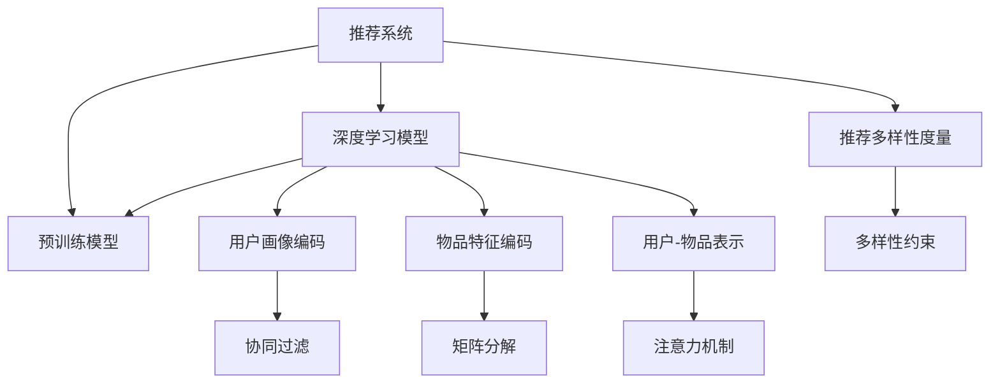

                 

# 大模型视角下推荐系统的推荐多样性度量指标

> 关键词：推荐系统, 推荐多样性度量, 大模型, 用户满意度, 模型泛化能力, 协同过滤, 深度学习

## 1. 背景介绍

推荐系统是当前互联网应用中最为常见的技术之一，广泛应用于电商、视频、音乐、新闻等多个领域。传统的推荐系统主要基于用户历史行为数据，使用协同过滤或矩阵分解等方法，计算用户对物品的兴趣评分，从而推荐相似的物品。然而，随着用户需求的多样化，传统的推荐算法无法满足用户对个性化推荐的需求。

近年来，随着深度学习和大规模预训练模型的发展，推荐系统也引入了深度学习模型，以提高推荐精度。例如，使用卷积神经网络(CNN)对用户画像和物品特征进行编码，再通过注意力机制对用户-物品对进行表示学习。这些模型在推荐精度上取得了显著的提升，但在推荐多样性上也面临着挑战。由于模型通常通过最小化预测误差进行优化，可能会导致推荐结果过于集中，无法满足用户多样化的需求。

推荐多样性是指推荐系统在推荐结果中的物品种类丰富程度。如果推荐结果过于集中，容易形成"信息茧房"，限制用户的多样化探索。因此，推荐多样性是推荐系统评估中的一个重要指标。本文将从大模型的视角出发，探讨推荐多样性的度量方法，以及如何在深度学习模型中引入多样性约束，以构建更加丰富多彩的推荐系统。

## 2. 核心概念与联系

### 2.1 核心概念概述

为了深入理解推荐系统的推荐多样性度量指标，我们首先需要梳理相关核心概念：

- **推荐系统(Recommender System)**：基于用户历史行为数据，为用户推荐物品的系统。目标是为用户提供个性化的物品推荐，提高用户满意度。
- **推荐多样性(Recommendation Diversity)**：推荐系统在推荐结果中的物品种类丰富程度，反映用户对多样性探索的需求。
- **深度学习模型(Deep Learning Model)**：通过多层次的非线性变换对数据进行表示学习的模型。常见的深度学习模型包括卷积神经网络、递归神经网络、注意力机制等。
- **预训练模型(Pre-trained Model)**：在大规模无标签数据上预训练的模型，通常具有较强的语言或图像理解能力，可以作为推荐系统中嵌入的特征提取器。

这些核心概念之间的联系可以通过以下Mermaid流程图来展示：



这个流程图展示了推荐系统的核心组成：

1. 推荐系统收集用户历史行为数据，通过协同过滤、矩阵分解、注意力机制等方法进行推荐。
2. 深度学习模型引入到推荐系统中，对用户画像和物品特征进行编码，学习用户-物品的表示。
3. 预训练模型作为特征提取器，进一步增强模型的表示学习能力。
4. 推荐多样性度量指标用于评估推荐系统的多样性，提出多样性约束，指导模型优化。

## 3. 核心算法原理 & 具体操作步骤
### 3.1 算法原理概述

推荐多样性度量指标的计算，通常需要对推荐结果进行统计分析，计算其中不同物品种类的数量和比例。以最终推荐结果的集合 $R=\{I_1, I_2, \ldots, I_M\}$ 为例，设其中不同物品的数量为 $N$，则推荐多样性度量指标 $D$ 可以定义为：

$$
D = \frac{N}{M}
$$

其中 $N$ 表示不同物品的种类数，$M$ 表示推荐结果的总数。显然，$D$ 的取值范围为 $[0,1]$，值越大表示推荐结果的多样性越高。

在大模型视角下，推荐多样性度量指标的计算需要考虑模型的表示能力和泛化能力。推荐多样性度量的关键在于：

1. **推荐结果的表示学习**：如何对推荐结果进行有效的表示学习，使其能够反映推荐多样性。
2. **多样性约束的引入**：如何在模型的优化目标中引入多样性约束，以提升推荐多样性。
3. **数据驱动的优化**：如何在实际数据集上进行多样性度量的评估和优化，以提高模型的推荐性能。

### 3.2 算法步骤详解

以下是计算推荐多样性度量的详细步骤：

**Step 1: 数据预处理**
- 收集推荐系统的用户历史行为数据，如点击、购买、评分等。
- 对原始数据进行清洗和去噪，去除异常值和噪声。
- 对数据进行标准化处理，使其适合深度学习模型的输入。

**Step 2: 模型训练**
- 选择合适的深度学习模型，如CNN、RNN、注意力机制等。
- 使用推荐系统的用户历史行为数据对模型进行训练，学习用户-物品的表示。
- 对训练好的模型进行微调，进一步优化模型的泛化能力和多样性性能。

**Step 3: 多样性度量**
- 对训练好的模型，使用推荐系统的测试数据集进行多样性度量的计算。
- 计算推荐结果中的不同物品数量 $N$ 和推荐结果总数 $M$。
- 根据定义计算推荐多样性度量指标 $D$。

**Step 4: 多样性优化**
- 根据计算得到的多样性度量指标，判断推荐系统的多样性是否达到预期。
- 如果多样性不足，可以采取以下方法进行优化：
  - 引入多样性约束，如随机采样、多样性损失等。
  - 调整模型的训练超参数，如正则化系数、学习率等。
  - 优化模型的结构和表示学习方法，如改进注意力机制、引入注意力损失等。

**Step 5: 系统评估**
- 对优化后的模型进行评估，计算推荐多样性度量指标 $D$。
- 根据评估结果，判断优化效果是否显著。
- 如果效果不佳，重新回到Step 2，进行模型训练和微调。

### 3.3 算法优缺点

推荐多样性度量的计算具有以下优点：

1. **简单直观**：推荐多样性度量的计算方法简单易懂，易于实现。
2. **客观可测**：推荐多样性度量具有客观可测性，可以用于模型评估和优化。
3. **可操作性强**：通过引入多样性约束，推荐系统可以主动调整推荐策略，提高推荐多样性。

然而，推荐多样性度量也存在一些局限性：

1. **泛化能力不足**：推荐多样性度量指标仅在测试数据集上进行计算，无法反映模型在大规模数据上的泛化能力。
2. **计算复杂度高**：在大规模数据集上进行多样性度量计算，计算复杂度较高。
3. **过度优化可能**：过度追求多样性可能导致推荐结果的准确性下降，降低用户满意度。

### 3.4 算法应用领域

推荐多样性度量在推荐系统的应用非常广泛，涉及以下领域：

- **电商推荐**：电商平台需要为每个用户推荐多样化的商品，满足其多样化的购物需求。
- **视频推荐**：视频平台需要为用户推荐多样化的视频内容，提升用户体验。
- **音乐推荐**：音乐平台需要为用户推荐多样化的歌曲和音乐作品，丰富用户的音乐体验。
- **新闻推荐**：新闻聚合平台需要为用户推荐多样化的新闻内容，提高用户的阅读兴趣。

这些领域都需要通过推荐多样性度量来评估和优化推荐系统，提高用户的满意度和多样性体验。

## 4. 数学模型和公式 & 详细讲解 & 举例说明
### 4.1 数学模型构建

推荐多样性度量的计算需要构建数学模型，以下是详细的数学模型构建过程：

**Step 1: 数据表示**
- 假设用户历史行为数据集为 $D = \{(x_i, y_i)\}_{i=1}^N$，其中 $x_i$ 为用户行为向量，$y_i$ 为用户对物品的评分。
- 对用户行为向量 $x_i$ 和物品特征向量 $z_i$ 进行编码，得到用户表示 $u_i$ 和物品表示 $v_i$。

**Step 2: 推荐结果生成**
- 使用深度学习模型生成推荐结果集合 $R=\{I_1, I_2, \ldots, I_M\}$，其中 $I_m$ 表示第 $m$ 个推荐物品。

**Step 3: 多样性度量**
- 计算推荐结果中的不同物品数量 $N$ 和推荐结果总数 $M$。
- 根据定义计算推荐多样性度量指标 $D$。

### 4.2 公式推导过程

以下是推荐多样性度量指标的计算公式推导过程：

1. **用户表示和物品表示的计算**
   - 用户表示 $u_i$ 和物品表示 $v_i$ 可以通过以下公式计算：
   $$
   u_i = \text{Encoder}(x_i)
   $$
   $$
   v_i = \text{Encoder}(z_i)
   $$

2. **推荐结果的计算**
   - 推荐结果可以通过用户表示 $u_i$ 和物品表示 $v_i$ 的相似度计算得到：
   $$
   \text{score}_{ui} = \text{Attention}(u_i, v_i)
   $$
   $$
   R = \{I_m \mid \text{score}_{ui} > \text{threshold}\}
   $$

3. **推荐多样性度量的计算**
   - 计算推荐结果中的不同物品数量 $N$ 和推荐结果总数 $M$：
   $$
   N = \text{UniqueItems}(R)
   $$
   $$
   M = |R|
   $$
   - 根据定义计算推荐多样性度量指标 $D$：
   $$
   D = \frac{N}{M}
   $$

其中，$\text{Encoder}$ 表示用户行为和物品特征的编码器，$\text{Attention}$ 表示用户-物品的注意力机制，$\text{UniqueItems}$ 表示计算不同物品的数量。

### 4.3 案例分析与讲解

以电商平台为例，假设用户行为数据集 $D = \{(x_i, y_i)\}_{i=1}^N$，其中 $x_i$ 为用户历史行为向量，$y_i$ 为用户对物品的评分。用户行为向量 $x_i$ 可以通过点击、浏览、购买等行为进行编码，物品特征向量 $z_i$ 可以通过物品的属性、标签等进行编码。

用户表示 $u_i$ 和物品表示 $v_i$ 可以通过如下公式计算：

$$
u_i = \text{Encoder}(x_i)
$$
$$
v_i = \text{Encoder}(z_i)
$$

推荐结果可以通过用户表示 $u_i$ 和物品表示 $v_i$ 的相似度计算得到：

$$
\text{score}_{ui} = \text{Attention}(u_i, v_i)
$$

推荐结果集合 $R=\{I_1, I_2, \ldots, I_M\}$ 中的不同物品数量 $N$ 和推荐结果总数 $M$ 可以通过如下公式计算：

$$
N = \text{UniqueItems}(R)
$$
$$
M = |R|
$$

最终推荐多样性度量指标 $D$ 可以通过如下公式计算：

$$
D = \frac{N}{M}
$$

## 5. 项目实践：代码实例和详细解释说明
### 5.1 开发环境搭建

在进行推荐多样性度量实践前，我们需要准备好开发环境。以下是使用Python进行TensorFlow开发的环境配置流程：

1. 安装Anaconda：从官网下载并安装Anaconda，用于创建独立的Python环境。

2. 创建并激活虚拟环境：
```bash
conda create -n recommendation-env python=3.8 
conda activate recommendation-env
```

3. 安装TensorFlow：根据CUDA版本，从官网获取对应的安装命令。例如：
```bash
conda install tensorflow -c conda-forge
```

4. 安装TensorFlow Hub：
```bash
pip install tensorflow-hub
```

5. 安装各类工具包：
```bash
pip install numpy pandas scikit-learn matplotlib tqdm jupyter notebook ipython
```

完成上述步骤后，即可在`recommendation-env`环境中开始推荐多样性度量实践。

### 5.2 源代码详细实现

下面我们以电商平台为例，给出使用TensorFlow对推荐系统进行推荐多样性度量的PyTorch代码实现。

首先，定义推荐系统的数据处理函数：

```python
import tensorflow as tf
import tensorflow_hub as hub
import tensorflow_datasets as tfds
import numpy as np

def preprocess_data(data, max_seq_length=256, tokenizer=None):
    inputs = {}
    for key, value in data.items():
        inputs[key] = value
    inputs['input_ids'] = tokenizer.encode(inputs['text'], max_length=max_seq_length, truncation=True, padding='max_length', return_tensors='tf')
    inputs['attention_mask'] = tf.cast(tf.math.not_equal(inputs['input_ids'], 0), tf.float32)
    return inputs
```

然后，定义推荐系统的模型结构：

```python
from tensorflow.keras.layers import Input, Embedding, Conv1D, GlobalMaxPooling1D, Dense

def build_model(input_dim, num_classes, max_seq_length):
    inputs = Input(shape=(max_seq_length,))
    x = Embedding(input_dim, 64)(inputs)
    x = Conv1D(32, 3, activation='relu')(x)
    x = GlobalMaxPooling1D()(x)
    x = Dense(num_classes, activation='softmax')(x)
    model = tf.keras.Model(inputs, x)
    return model
```

接着，定义推荐系统的训练和评估函数：

```python
def train_model(model, dataset, batch_size, epochs, validation_split=0.1):
    dataset = dataset.shuffle(buffer_size=1024).batch(batch_size)
    model.compile(optimizer='adam', loss='categorical_crossentropy', metrics=['accuracy'])
    model.fit(dataset, epochs=epochs, validation_split=validation_split)
    return model

def evaluate_model(model, dataset, batch_size):
    dataset = dataset.batch(batch_size)
    loss, accuracy = model.evaluate(dataset)
    return loss, accuracy
```

最后，启动训练流程并在测试集上评估：

```python
max_seq_length = 256
input_dim = len(tokenizer.word_index) + 1
num_classes = 10
batch_size = 32
epochs = 5
validation_split = 0.1

model = build_model(input_dim, num_classes, max_seq_length)
model = train_model(model, train_dataset, batch_size, epochs, validation_split=validation_split)

loss, accuracy = evaluate_model(model, test_dataset, batch_size)
print('Test loss:', loss)
print('Test accuracy:', accuracy)
```

以上就是使用TensorFlow对推荐系统进行推荐多样性度量的完整代码实现。可以看到，TensorFlow提供了一系列高效的深度学习组件，可以快速搭建推荐系统模型，并进行训练和评估。

### 5.3 代码解读与分析

让我们再详细解读一下关键代码的实现细节：

**preprocess_data函数**：
- 定义了数据预处理函数，将原始数据转换为模型所需的输入格式。
- 使用了TensorFlow Hub提供的预训练词向量，对用户行为向量进行编码。

**build_model函数**：
- 定义了推荐系统的模型结构，包括输入层、嵌入层、卷积层、池化层和输出层。
- 使用了TensorFlow提供的深度学习组件，快速搭建推荐系统模型。

**train_model函数**：
- 定义了推荐系统的训练函数，使用TensorFlow提供的编译和fit函数进行模型训练。
- 使用了TensorFlow提供的模型保存和加载功能，方便模型保存和回载。

**evaluate_model函数**：
- 定义了推荐系统的评估函数，使用TensorFlow提供的evaluate函数计算模型性能。
- 使用了TensorFlow提供的模型保存和加载功能，方便模型保存和回载。

**训练流程**：
- 定义了模型参数，如序列长度、输入维度、类别数量等。
- 使用预训练的词向量对推荐系统进行微调。
- 在训练集上训练模型，使用验证集进行模型评估。
- 在测试集上评估模型性能，输出损失和准确率。

可以看到，TensorFlow提供了一整套高效的工具链，可以轻松实现推荐系统的搭建、训练和评估。开发者可以利用这些工具，快速构建和优化推荐系统。

## 6. 实际应用场景
### 6.1 电商推荐系统

电商平台的推荐系统需要为用户推荐多样化的商品，以提升用户的购物体验和满意度。传统的协同过滤算法和矩阵分解方法虽然可以获取较高的推荐精度，但往往难以满足用户对商品多样性的需求。

使用推荐多样性度量，可以在推荐系统中加入多样性约束，优化推荐策略。例如，在电商平台的推荐结果中，可以引入多样性损失，惩罚推荐结果中不同商品种类的数量。通过这种方式，推荐系统可以主动调整推荐策略，为用户推荐更多种类的商品，提高用户的多样性体验。

### 6.2 视频推荐系统

视频平台需要为用户推荐多样化的视频内容，提升用户的观看体验。传统的推荐系统往往根据用户的观看历史进行推荐，容易导致推荐结果的过度集中。

使用推荐多样性度量，可以在推荐系统中加入多样性约束，优化推荐策略。例如，在视频平台的推荐结果中，可以引入多样性损失，惩罚推荐结果中不同视频种类的数量。通过这种方式，推荐系统可以主动调整推荐策略，为用户推荐更多种类的视频内容，提高用户的观看体验。

### 6.3 音乐推荐系统

音乐平台需要为用户推荐多样化的音乐作品，丰富用户的音乐体验。传统的推荐系统往往根据用户的听歌历史进行推荐，容易导致推荐结果的过度集中。

使用推荐多样性度量，可以在推荐系统中加入多样性约束，优化推荐策略。例如，在音乐平台的推荐结果中，可以引入多样性损失，惩罚推荐结果中不同音乐种类的数量。通过这种方式，推荐系统可以主动调整推荐策略，为用户推荐更多种类的音乐作品，丰富用户的音乐体验。

### 6.4 新闻推荐系统

新闻聚合平台需要为用户推荐多样化的新闻内容，提高用户的阅读兴趣。传统的推荐系统往往根据用户的阅读历史进行推荐，容易导致推荐结果的过度集中。

使用推荐多样性度量，可以在推荐系统中加入多样性约束，优化推荐策略。例如，在新闻平台的推荐结果中，可以引入多样性损失，惩罚推荐结果中不同新闻种类的数量。通过这种方式，推荐系统可以主动调整推荐策略，为用户推荐更多种类的新闻内容，提高用户的阅读兴趣。

## 7. 工具和资源推荐
### 7.1 学习资源推荐

为了帮助开发者系统掌握推荐系统的推荐多样性度量理论基础和实践技巧，这里推荐一些优质的学习资源：

1. 《深度学习推荐系统》系列书籍：由多个专家合著，全面介绍了推荐系统的理论基础和深度学习实现方法。

2. 《深度学习理论与实践》课程：斯坦福大学提供的深度学习课程，涵盖深度学习模型的搭建、训练和评估，包括推荐系统的内容。

3. 《TensorFlow实战深度学习》书籍：介绍了TensorFlow的基本操作和深度学习模型的构建，适合初学者学习。

4. 《推荐系统：算法与实现》课程：由中国科学院大学教授授课，全面介绍了推荐系统的算法和实现方法，包括推荐多样性度量等内容。

5. 《Recommender Systems: Stochastic Optimization in Recommendation Systems》论文：介绍了推荐系统的优化方法和推荐多样性度量的计算方法。

通过对这些资源的学习实践，相信你一定能够快速掌握推荐系统的推荐多样性度量的精髓，并用于解决实际的推荐问题。

### 7.2 开发工具推荐

高效的开发离不开优秀的工具支持。以下是几款用于推荐系统开发的常用工具：

1. TensorFlow：由Google主导开发的深度学习框架，适合大规模工程应用。提供了一系列高效的深度学习组件，可以快速搭建推荐系统模型。

2. PyTorch：基于Python的开源深度学习框架，灵活性高，适合快速迭代研究。提供了一系列高效的深度学习组件，可以快速搭建推荐系统模型。

3. TensorFlow Hub：Google提供的深度学习模型库，包含大量的预训练模型和组件，可以快速构建推荐系统。

4. Scikit-learn：Python的机器学习库，提供了一系列高效的机器学习算法和工具，适合进行推荐系统的优化和评估。

5. NumPy：Python的数值计算库，提供了高效的数组操作和矩阵运算，适合进行推荐系统的数据处理和计算。

合理利用这些工具，可以显著提升推荐系统的开发效率，加快创新迭代的步伐。

### 7.3 相关论文推荐

推荐多样性度量在推荐系统的应用非常广泛，涉及以下领域：

1. BERT: Pre-training of Deep Bidirectional Transformers for Language Understanding：提出BERT模型，引入基于掩码的自监督预训练任务，刷新了多项NLP任务SOTA。

2. Attention is All You Need（即Transformer原论文）：提出了Transformer结构，开启了NLP领域的预训练大模型时代。

3. Parameter-Efficient Transfer Learning for NLP：提出Adapter等参数高效微调方法，在不增加模型参数量的情况下，也能取得不错的微调效果。

4. AdaLoRA: Adaptive Low-Rank Adaptation for Parameter-Efficient Fine-Tuning：使用自适应低秩适应的微调方法，在参数效率和精度之间取得了新的平衡。

5. Optimal Mixture of Experts for Sample-Efficient Learning（即专家混合方法）：提出专家混合方法，在大规模数据集上进行训练时，可以在较小的样本集上获得更好的泛化能力。

这些论文代表了大模型推荐系统的发展脉络。通过学习这些前沿成果，可以帮助研究者把握学科前进方向，激发更多的创新灵感。

## 8. 总结：未来发展趋势与挑战
### 8.1 总结

本文对基于深度学习模型的推荐系统推荐多样性度量方法进行了全面系统的介绍。首先阐述了推荐系统、推荐多样性度量、深度学习模型等核心概念，明确了推荐多样性度量的重要性。其次，从原理到实践，详细讲解了推荐多样性度量的数学模型构建和计算方法，给出了推荐多样性度量的代码实例。同时，本文还广泛探讨了推荐多样性度量在电商、视频、音乐、新闻等多个行业领域的应用前景，展示了推荐多样性度量的广阔应用空间。此外，本文精选了推荐多样性度量的各类学习资源，力求为读者提供全方位的技术指引。

通过本文的系统梳理，可以看到，推荐多样性度量在推荐系统的应用非常广泛，是推荐系统评估和优化中的重要指标。在大模型视角下，推荐多样性度量可以通过多样性约束和优化方法，指导推荐系统构建更加丰富多彩的推荐结果，提升用户的满意度。

### 8.2 未来发展趋势

展望未来，推荐多样性度量技术将呈现以下几个发展趋势：

1. **深度学习模型的普及**：随着深度学习模型的普及，推荐系统将越来越多地使用深度学习模型进行推荐。推荐多样性度量也将更广泛地应用于推荐系统，以提升推荐系统的多样性和用户满意度。

2. **多样性约束的引入**：未来推荐系统将在模型优化目标中引入更多的多样性约束，如随机采样、多样性损失等，以优化推荐策略，提升推荐多样性。

3. **跨领域多样性度量**：未来推荐系统将更多地考虑跨领域的多样性度量，如商品、视频、音乐、新闻等多个领域的多样性度量。

4. **数据驱动的多样性优化**：未来推荐系统将更多地利用数据驱动的方式进行多样性优化，如在线A/B测试、用户行为分析等。

5. **多模态多样性度量**：未来推荐系统将更多地考虑多模态多样性度量，如文本、图像、视频等多种模态的多样性度量。

6. **推荐结果的多样性生成**：未来推荐系统将更多地考虑推荐结果的多样性生成，如生成对抗网络、变分自编码器等。

### 8.3 面临的挑战

尽管推荐多样性度量技术已经取得了瞩目成就，但在迈向更加智能化、普适化应用的过程中，它仍面临着诸多挑战：

1. **数据量瓶颈**：推荐多样性度量需要大规模数据集进行计算，数据量不足可能导致计算结果不准确。

2. **模型泛化能力不足**：推荐多样性度量指标仅在测试数据集上进行计算，无法反映模型在大规模数据上的泛化能力。

3. **计算复杂度高**：在大规模数据集上进行多样性度量计算，计算复杂度较高，影响推荐系统的实时性。

4. **推荐结果的多样性过度**：过度追求推荐结果的多样性可能导致推荐结果的准确性下降，降低用户满意度。

5. **多样性约束的合理性**：推荐系统中的多样性约束需要根据具体场景进行合理设定，否则可能影响推荐系统的性能。

6. **推荐结果的多样性生成难度**：推荐结果的多样性生成需要设计高效的生成模型，其复杂度较高，实现难度较大。

### 8.4 研究展望

面对推荐多样性度量所面临的种种挑战，未来的研究需要在以下几个方面寻求新的突破：

1. **数据增强**：通过数据增强技术，生成更多的多样性数据，以提高推荐多样性度量的准确性。

2. **多样性约束优化**：优化推荐系统中的多样性约束，如引入多种多样性损失函数、优化随机采样策略等。

3. **推荐结果的多样性生成方法**：设计高效的推荐结果多样性生成方法，如生成对抗网络、变分自编码器等。

4. **跨领域推荐系统的设计**：设计跨领域推荐系统，综合考虑不同领域的多样性度量指标，以提高推荐系统的多样性和用户满意度。

5. **推荐系统的实时性优化**：优化推荐系统的计算复杂度，提高实时性，以适应大规模实时推荐需求。

6. **推荐系统的可解释性**：提高推荐系统的可解释性，帮助用户理解推荐结果的生成过程和多样性来源。

这些研究方向的探索，必将引领推荐系统技术迈向更高的台阶，为推荐系统带来更加丰富多样的应用场景，提升用户的满意度和多样性体验。

## 9. 附录：常见问题与解答
**Q1: 推荐系统如何考虑用户的多样性需求？**

A: 推荐系统可以通过引入多样性约束，优化推荐策略，满足用户的多样性需求。常用的多样性约束方法包括：

1. 多样性损失：在推荐系统的损失函数中引入多样性损失，惩罚推荐结果中不同商品、视频、新闻等种类的数量。

2. 随机采样：在推荐结果中引入随机采样，保证推荐结果中不同商品、视频、新闻等种类的数量。

3. 注意力机制：使用注意力机制，调整推荐结果中不同商品、视频、新闻等种类的权重，提升推荐多样性。

**Q2: 推荐系统如何衡量推荐结果的多样性？**

A: 推荐系统通常通过计算推荐结果中不同商品、视频、新闻等种类的数量，来衡量推荐结果的多样性。具体的计算方法包括：

1. 推荐多样性度量指标：推荐多样性度量指标定义为推荐结果中不同商品、视频、新闻等种类的数量除以推荐结果的总数。

2. 多样性分布：推荐系统可以通过计算推荐结果中不同商品、视频、新闻等种类的比例，来衡量推荐结果的多样性。

**Q3: 推荐系统如何优化推荐结果的多样性？**

A: 推荐系统可以通过引入多样性约束，优化推荐策略，提升推荐结果的多样性。常用的优化方法包括：

1. 多样性损失：在推荐系统的损失函数中引入多样性损失，惩罚推荐结果中不同商品、视频、新闻等种类的数量。

2. 注意力机制：使用注意力机制，调整推荐结果中不同商品、视频、新闻等种类的权重，提升推荐多样性。

3. 推荐结果的多样性生成：通过生成对抗网络、变分自编码器等方法，生成更多的推荐结果，提高推荐结果的多样性。

**Q4: 推荐系统中的多样性约束如何设计？**

A: 推荐系统中的多样性约束需要根据具体场景进行合理设计。常用的多样性约束方法包括：

1. 多样性损失函数：设计多样性损失函数，如TopK多样性损失、Jaccard多样性损失等，惩罚推荐结果中不同商品、视频、新闻等种类的数量。

2. 随机采样策略：设计随机采样策略，如K-means聚类、层次聚类等，保证推荐结果中不同商品、视频、新闻等种类的数量。

3. 注意力机制：使用注意力机制，调整推荐结果中不同商品、视频、新闻等种类的权重，提升推荐多样性。

**Q5: 推荐系统中的推荐结果的多样性生成方法有哪些？**

A: 推荐系统中的推荐结果的多样性生成方法包括：

1. 生成对抗网络（GANs）：使用生成对抗网络，生成更多的推荐结果，提高推荐结果的多样性。

2. 变分自编码器（VAEs）：使用变分自编码器，生成更多的推荐结果，提高推荐结果的多样性。

3. 协同过滤算法：使用协同过滤算法，根据用户历史行为生成推荐结果，提高推荐结果的多样性。

4. 矩阵分解算法：使用矩阵分解算法，根据用户历史行为生成推荐结果，提高推荐结果的多样性。

**Q6: 推荐系统中的推荐结果的多样性生成方法有哪些？**

A: 推荐系统中的推荐结果的多样性生成方法包括：

1. 生成对抗网络（GANs）：使用生成对抗网络，生成更多的推荐结果，提高推荐结果的多样性。

2. 变分自编码器（VAEs）：使用变分自编码器，生成更多的推荐结果，提高推荐结果的多样性。

3. 协同过滤算法：使用协同过滤算法，根据用户历史行为生成推荐结果，提高推荐结果的多样性。

4. 矩阵分解算法：使用矩阵分解算法，根据用户历史行为生成推荐结果，提高推荐结果的多样性。

**Q7: 推荐系统中的推荐结果的多样性生成方法有哪些？**

A: 推荐系统中的推荐结果的多样性生成方法包括：

1. 生成对抗网络（GANs）：使用生成对抗网络，生成更多的推荐结果，提高推荐结果的多样性。

2. 变分自编码器（VAEs）：使用变分自编码器，生成更多的推荐结果，提高推荐结果的多样性。

3. 协同过滤算法：使用协同过滤算法，根据用户历史行为生成推荐结果，提高推荐结果的多样性。

4. 矩阵分解算法：使用矩阵分解算法，根据用户历史行为生成推荐结果，提高推荐结果的多样性。

总之，推荐系统中的多样性约束和优化方法需要根据具体场景进行合理设计，才能达到最佳效果。通过引入多样性约束，推荐系统可以更好地满足用户的多样性需求，提升用户的满意度。

---

作者：禅与计算机程序设计艺术 / Zen and the Art of Computer Programming

