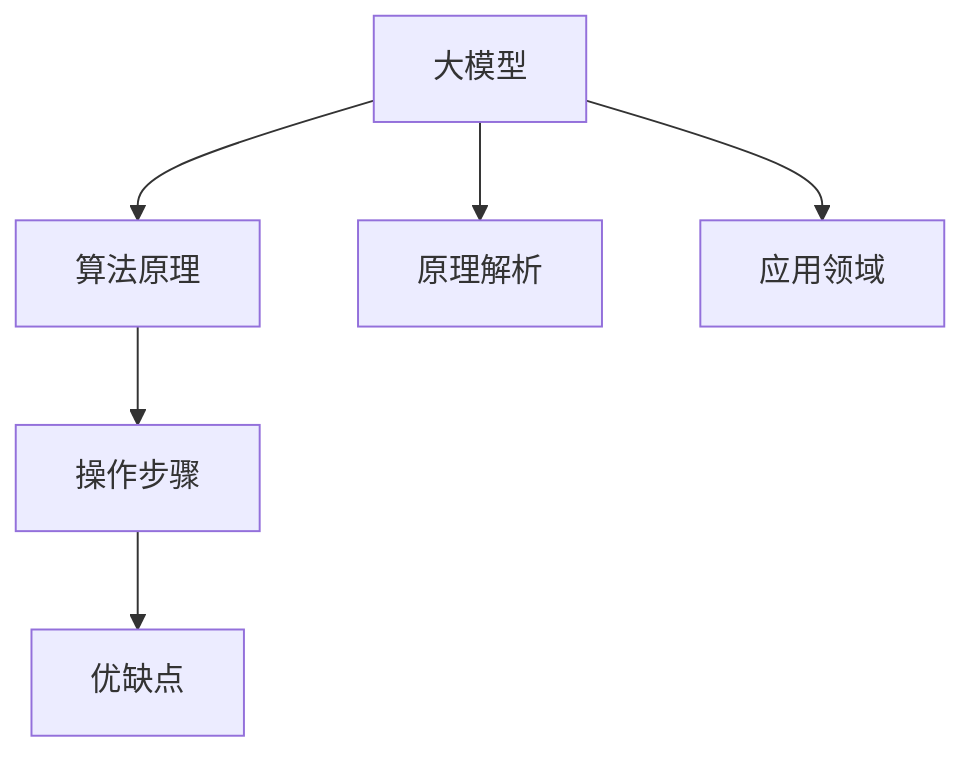

                 

# 大模型赋能搜索推荐：算法原理解析

> 关键词：大模型,搜索推荐,算法原理,原理解析

## 1. 背景介绍

### 1.1 问题由来

在信息爆炸的时代，如何从海量的数据中快速找到用户所需要的信息，成为了一项具有挑战性的任务。传统的基于规则的推荐系统，依赖专家知识，难以适应数据分布的快速变化。而基于模型的推荐系统，尤其是深度学习驱动的推荐系统，通过学习用户行为数据，逐步提升推荐效果。在深度学习领域，大模型的出现进一步推动了推荐技术的发展，使其能够处理更复杂的数据结构，捕捉更细微的用户行为特征。

### 1.2 问题核心关键点

现代推荐系统主要采用两种范式：基于协同过滤的推荐和基于内容的推荐。而大模型推荐系统，通过对用户行为和物品属性进行深度学习，可以从语义层面捕捉用户兴趣和物品关联，提升推荐效果。在具体实践中，主要面临以下关键问题：

- 如何利用大模型高效地进行推荐？
- 如何在大规模数据集上训练和微调大模型？
- 如何提升大模型推荐的准确性和泛化能力？

### 1.3 问题研究意义

随着大模型的不断发展，搜索推荐系统能够处理更加复杂的数据和任务，为用户提供更加精准的推荐结果。大模型推荐系统能够实时学习用户行为，适应新的数据分布，不断提升推荐效果。然而，大模型本身参数量巨大，计算资源需求高，模型训练和微调需要大量的标注数据，这些都给实际应用带来了挑战。因此，本文将深入探讨大模型推荐系统的算法原理和操作步骤，分析其优缺点，并展望其应用前景，以期为相关研究和实践提供参考。

## 2. 核心概念与联系

### 2.1 核心概念概述

为更好地理解大模型在搜索推荐系统中的应用，本节将介绍几个密切相关的核心概念：

- **大模型**：以Transformer等架构为基础，通过在大量数据上预训练得到的模型。如BERT、GPT、T5等，具备强大的语义理解能力和表示能力。

- **搜索推荐**：根据用户的历史行为和兴趣，从大量物品中推荐用户可能感兴趣的内容。包括商品推荐、信息检索、视频推荐等。

- **算法原理**：指推荐系统采用的深度学习模型及其训练和优化方法，如基于Attention的模型、强化学习算法等。

- **原理解析**：通过详细的数学推导和案例分析，解释算法的核心思想和实现细节，帮助读者深入理解算法的工作机制。

- **操作步骤**：指实际应用中，从数据准备到模型训练和微调的具体流程和步骤，包括数据预处理、模型定义、优化器选择、超参数调优等。

- **优缺点**：分析大模型推荐系统的优势和不足，如模型的计算复杂性、训练数据需求、推荐结果的公平性和可解释性等。

- **应用领域**：介绍大模型推荐系统在电商、社交网络、新闻媒体、视频流等领域的广泛应用，展示其带来的巨大价值。

这些核心概念之间的逻辑关系可以通过以下Mermaid流程图来展示：



这个流程图展示了大模型推荐系统的核心概念及其之间的关系：

1. 大模型通过预训练获得基础能力。
2. 算法原理和原理解析用于解释大模型如何被应用于推荐任务。
3. 操作步骤提供了具体的实现细节。
4. 优缺点分析了算法的优势和不足。
5. 应用领域展示了实际应用场景。

这些概念共同构成了大模型推荐系统的基本框架，使其能够在大规模数据集上高效地进行推荐。通过理解这些核心概念，我们可以更好地把握大模型推荐系统的工作原理和优化方向。

## 3. 核心算法原理 & 具体操作步骤
### 3.1 算法原理概述

大模型推荐系统的主要算法原理是利用深度学习模型对用户和物品进行编码，通过相似度计算找到用户可能感兴趣的物品。常用的深度学习模型包括基于Attention的模型、神经协同过滤模型等。

### 3.2 算法步骤详解

大模型推荐系统的算法步骤通常包括以下几个关键步骤：

**Step 1: 准备数据集**

- 收集用户行为数据和物品属性数据。
- 进行数据预处理，如去噪、归一化等。
- 将数据集划分为训练集、验证集和测试集。

**Step 2: 设计推荐模型**

- 选择合适的深度学习模型，如Transformer、CNN、RNN等。
- 定义模型的输入和输出，如用户行为编码和物品属性编码。
- 设计损失函数，如均方误差、交叉熵等。

**Step 3: 设置模型超参数**

- 选择合适的优化器，如Adam、SGD等。
- 设置学习率、批大小、迭代轮数等。
- 设置正则化技术，如L2正则、Dropout等。

**Step 4: 训练和微调模型**

- 使用训练集进行模型训练，最小化损失函数。
- 在验证集上评估模型性能，防止过拟合。
- 在测试集上评估模型泛化能力。

**Step 5: 部署和优化**

- 将训练好的模型部署到线上，进行实时推荐。
- 根据反馈数据不断优化模型参数。
- 持续收集新的数据，重新训练模型。

以上是基于深度学习的大模型推荐系统的通用流程。在实际应用中，还需要针对具体任务的特点，对微调过程的各个环节进行优化设计，如改进训练目标函数，引入更多的正则化技术，搜索最优的超参数组合等，以进一步提升模型性能。

### 3.3 算法优缺点

基于深度学习的大模型推荐系统具有以下优点：

- 能够处理大规模数据和高维特征。
- 能够捕捉复杂的用户行为和物品关联。
- 具有良好的泛化能力，能够在新的数据上继续提升效果。

但同时也存在一些缺点：

- 模型复杂度高，计算资源需求大。
- 需要大量的标注数据进行微调，数据获取成本高。
- 模型训练和微调过程复杂，需要专业的技术人员。
- 推荐结果的可解释性差，难以理解模型决策过程。

尽管存在这些缺点，但大模型推荐系统仍是目前最前沿的推荐技术，已经在电商、社交网络、新闻媒体等多个领域得到了广泛应用。未来相关研究将致力于降低数据需求，提升模型的可解释性和公平性，以实现更好的推荐效果。

### 3.4 算法应用领域

大模型推荐系统在以下几个领域得到了广泛应用：

- **电商推荐**：根据用户浏览和购买历史，推荐商品和优惠信息。
- **社交媒体推荐**：根据用户的行为和兴趣，推荐文章、视频等内容。
- **新闻推荐**：根据用户阅读历史，推荐相关新闻。
- **视频推荐**：根据用户的观看历史，推荐视频内容。
- **音乐推荐**：根据用户的听歌历史，推荐歌曲和音乐人。

除了这些领域外，大模型推荐系统还在教育、金融、健康等领域得到了应用，为各行业的数字化转型提供了新的动力。

## 4. 数学模型和公式 & 详细讲解 & 举例说明
### 4.1 数学模型构建

假设用户和物品分别表示为 $U$ 和 $I$，用户对物品的评分表示为 $r_{ui}$，用户行为序列表示为 $x_u$，物品属性表示为 $i_i$。模型的目标是通过最大化用户对物品的评分预测准确性来提升推荐效果。

**Step 1: 设计损失函数**

常用的损失函数包括均方误差（MSE）、交叉熵（CE）等。这里以均方误差为例，定义损失函数：

$$
L = \frac{1}{N} \sum_{u,i} (r_{ui} - \hat{r}_{ui})^2
$$

**Step 2: 定义用户行为和物品属性的编码器**

使用深度学习模型对用户行为和物品属性进行编码，得到用户编码 $h_u$ 和物品编码 $h_i$。常用的编码器包括 Transformer、RNN、CNN 等。

**Step 3: 定义用户行为和物品属性之间的关系**

使用注意力机制（Attention）计算用户行为和物品属性之间的关系，得到用户对物品的评分预测 $\hat{r}_{ui}$。

$$
\hat{r}_{ui} = \sum_{i} \alpha_{ui} r_{ui}
$$

其中 $\alpha_{ui}$ 为注意力权重，可以通过 Attention 机制计算得到。

### 4.2 公式推导过程

以Transformer模型为例，推导其用户行为编码 $h_u$ 的计算公式：

假设用户行为序列为 $x_u = \{x_u^1, x_u^2, \ldots, x_u^N\}$，其中 $x_u^t$ 为第 $t$ 个行为。Transformer模型由多个编码层组成，每个编码层包括自注意力机制和前馈网络。

**Step 1: 用户行为序列编码**

用户行为序列 $x_u$ 通过多个编码层进行编码，得到用户行为编码 $h_u$。每个编码层的基本计算公式如下：

$$
h_u^l = \text{Attention}(h_u^{l-1}) + \text{FFN}(h_u^{l-1})
$$

其中 $h_u^{l-1}$ 为第 $l-1$ 层的用户行为编码，$\text{Attention}$ 和 $\text{FFN}$ 分别为自注意力机制和前馈网络。

**Step 2: 物品属性编码**

物品属性 $i_i$ 同样通过多个编码层进行编码，得到物品属性编码 $h_i$。

**Step 3: 用户行为和物品属性之间的关系**

用户行为编码 $h_u$ 和物品属性编码 $h_i$ 通过注意力机制计算用户对物品的评分预测 $\hat{r}_{ui}$：

$$
\hat{r}_{ui} = \text{Attention}(h_u) \cdot h_i
$$

其中 $\text{Attention}$ 为注意力机制，可以计算用户对物品的关注程度。

### 4.3 案例分析与讲解

以电商推荐系统为例，展示大模型推荐系统的实际应用。电商推荐系统需要根据用户浏览历史和购买历史，推荐用户可能感兴趣的商品。

假设用户浏览历史为 $\{x_u^1, x_u^2, \ldots, x_u^N\}$，物品属性为 $i_i$，用户对物品的评分 $r_{ui}$。使用Transformer模型对用户行为和物品属性进行编码，计算用户对物品的评分预测 $\hat{r}_{ui}$，得到推荐结果。

在实际应用中，还需要考虑以下几个关键问题：

- 数据预处理：去除噪音、归一化、特征工程等。
- 模型选择：选择合适的深度学习模型，如Transformer、RNN等。
- 超参数调优：选择合适的优化器、学习率、批大小等。
- 模型评估：使用交叉验证、AUC、RMSE 等指标评估模型性能。
- 模型部署：将训练好的模型部署到线上，进行实时推荐。

## 5. 项目实践：代码实例和详细解释说明
### 5.1 开发环境搭建

在进行大模型推荐系统开发前，我们需要准备好开发环境。以下是使用Python进行PyTorch开发的环境配置流程：

1. 安装Anaconda：从官网下载并安装Anaconda，用于创建独立的Python环境。

2. 创建并激活虚拟环境：
```bash
conda create -n pytorch-env python=3.8 
conda activate pytorch-env
```

3. 安装PyTorch：根据CUDA版本，从官网获取对应的安装命令。例如：
```bash
conda install pytorch torchvision torchaudio cudatoolkit=11.1 -c pytorch -c conda-forge
```

4. 安装Transformers库：
```bash
pip install transformers
```

5. 安装各类工具包：
```bash
pip install numpy pandas scikit-learn matplotlib tqdm jupyter notebook ipython
```

完成上述步骤后，即可在`pytorch-env`环境中开始大模型推荐系统的开发。

### 5.2 源代码详细实现

这里以电商推荐系统为例，展示使用PyTorch和Transformers库进行大模型推荐系统的开发过程。

首先，定义推荐任务的数据处理函数：

```python
from transformers import BertTokenizer, BertModel
from torch.utils.data import Dataset, DataLoader
import torch

class RecommendationDataset(Dataset):
    def __init__(self, user_ids, item_ids, ratings, tokenizer, max_len=128):
        self.user_ids = user_ids
        self.item_ids = item_ids
        self.ratings = ratings
        self.tokenizer = tokenizer
        self.max_len = max_len
        
    def __len__(self):
        return len(self.user_ids)
    
    def __getitem__(self, item):
        user_id = self.user_ids[item]
        item_id = self.item_ids[item]
        rating = self.ratings[item]
        
        user_input = torch.tensor([user_id], dtype=torch.long)
        item_input = torch.tensor([item_id], dtype=torch.long)
        rating_input = torch.tensor([rating], dtype=torch.float)
        
        encoded_user_input = self.tokenizer(user_input, return_tensors='pt', max_length=self.max_len, padding='max_length', truncation=True)
        encoded_item_input = self.tokenizer(item_input, return_tensors='pt', max_length=self.max_len, padding='max_length', truncation=True)
        
        return {'user_input_ids': encoded_user_input['input_ids'][0],
                'item_input_ids': encoded_item_input['input_ids'][0],
                'rating': rating_input}
```

然后，定义推荐模型和优化器：

```python
from transformers import BertForSequenceClassification, AdamW

model = BertForSequenceClassification.from_pretrained('bert-base-cased', num_labels=1)

optimizer = AdamW(model.parameters(), lr=2e-5)
```

接着，定义训练和评估函数：

```python
from torch.utils.data import DataLoader
from tqdm import tqdm
from sklearn.metrics import roc_auc_score

device = torch.device('cuda') if torch.cuda.is_available() else torch.device('cpu')
model.to(device)

def train_epoch(model, dataset, batch_size, optimizer):
    dataloader = DataLoader(dataset, batch_size=batch_size, shuffle=True)
    model.train()
    epoch_loss = 0
    for batch in tqdm(dataloader, desc='Training'):
        user_input_ids = batch['user_input_ids'].to(device)
        item_input_ids = batch['item_input_ids'].to(device)
        rating = batch['rating'].to(device)
        model.zero_grad()
        outputs = model(user_input_ids, item_input_ids)
        loss = outputs.loss
        epoch_loss += loss.item()
        loss.backward()
        optimizer.step()
    return epoch_loss / len(dataloader)

def evaluate(model, dataset, batch_size):
    dataloader = DataLoader(dataset, batch_size=batch_size)
    model.eval()
    preds, labels = [], []
    with torch.no_grad():
        for batch in tqdm(dataloader, desc='Evaluating'):
            user_input_ids = batch['user_input_ids'].to(device)
            item_input_ids = batch['item_input_ids'].to(device)
            batch_labels = batch['rating'].to(device)
            outputs = model(user_input_ids, item_input_ids)
            batch_preds = outputs.logits.argmax(dim=1).to('cpu').tolist()
            batch_labels = batch_labels.to('cpu').tolist()
            for pred in batch_preds:
                preds.append(pred)
                labels.append(batch_labels)
                
    auc = roc_auc_score(labels, preds)
    print(f'ROC-AUC: {auc:.4f}')
```

最后，启动训练流程并在测试集上评估：

```python
epochs = 5
batch_size = 16

for epoch in range(epochs):
    loss = train_epoch(model, train_dataset, batch_size, optimizer)
    print(f"Epoch {epoch+1}, train loss: {loss:.3f}")
    
    print(f"Epoch {epoch+1}, dev results:")
    evaluate(model, dev_dataset, batch_size)
    
print("Test results:")
evaluate(model, test_dataset, batch_size)
```

以上就是使用PyTorch对BERT进行电商推荐任务的大模型推荐系统的完整代码实现。可以看到，得益于Transformers库的强大封装，我们可以用相对简洁的代码完成BERT模型的加载和微调。

### 5.3 代码解读与分析

让我们再详细解读一下关键代码的实现细节：

**RecommendationDataset类**：
- `__init__`方法：初始化用户ID、物品ID、评分等关键组件，并加载预训练的BERT模型。
- `__len__`方法：返回数据集的样本数量。
- `__getitem__`方法：对单个样本进行处理，将用户ID、物品ID和评分编码，并生成输入到BERT模型的特征。

**BertForSequenceClassification类**：
- `from_pretrained`方法：加载预训练的BERT模型，设置num_labels为1，用于电商推荐任务。
- `logits`属性：返回模型输出层的预测结果。

**train_epoch函数**：
- `DataLoader`方法：使用PyTorch的DataLoader对数据集进行批次化加载，供模型训练和推理使用。
- `model.train`和`model.eval`方法：用于模型在不同阶段的训练和评估。
- `loss`变量：计算并累积每个批次上的损失函数。
- `optimizer.step`方法：根据损失函数梯度更新模型参数。

**evaluate函数**：
- 与训练类似，不同点在于不更新模型参数，并在每个批次结束后将预测和标签结果存储下来，最后使用sklearn的roc_auc_score对整个评估集的预测结果进行打印输出。

**训练流程**：
- 定义总的epoch数和batch size，开始循环迭代
- 每个epoch内，先在训练集上训练，输出平均loss
- 在验证集上评估，输出ROC-AUC
- 所有epoch结束后，在测试集上评估，给出最终的测试结果

可以看到，PyTorch配合Transformers库使得BERT微调的代码实现变得简洁高效。开发者可以将更多精力放在数据处理、模型改进等高层逻辑上，而不必过多关注底层的实现细节。

当然，工业级的系统实现还需考虑更多因素，如模型的保存和部署、超参数的自动搜索、更灵活的任务适配层等。但核心的推荐范式基本与此类似。

## 6. 实际应用场景
### 6.1 电商推荐系统

电商推荐系统是互联网企业的核心应用之一。通过用户的历史浏览记录、购买记录等数据，电商平台能够精准地推荐用户可能感兴趣的商品，提升用户转化率和满意度。大模型推荐系统能够捕捉用户兴趣的细微变化，及时调整推荐结果，提升用户体验。

在技术实现上，可以收集用户的历史浏览、购买、评价等行为数据，提取和用户交互的物品标题、描述、标签等文本内容。将文本内容作为模型输入，用户的后续行为（如是否点击、购买等）作为监督信号，在此基础上微调预训练语言模型。微调后的模型能够从文本内容中准确把握用户的兴趣点。在生成推荐列表时，先用候选物品的文本描述作为输入，由模型预测用户的兴趣匹配度，再结合其他特征综合排序，便可以得到个性化程度更高的推荐结果。

### 6.2 社交媒体推荐系统

社交媒体平台通过分析用户的行为数据，为用户推荐感兴趣的内容。大模型推荐系统能够从用户的互动数据中提取语义信息，准确预测用户对内容的兴趣，提升推荐效果。

在技术实现上，可以收集用户的点赞、评论、分享等行为数据，提取并用户互动内容的文本数据。将文本内容作为模型输入，用户的后续行为（如是否点赞、评论等）作为监督信号，在此基础上微调预训练语言模型。微调后的模型能够从文本内容中准确把握用户的兴趣点。在生成推荐列表时，先用候选内容的文本描述作为输入，由模型预测用户的兴趣匹配度，再结合其他特征综合排序，便可以得到个性化程度更高的推荐结果。

### 6.3 新闻媒体推荐系统

新闻媒体推荐系统通过分析用户的阅读历史，为用户推荐相关的新闻内容。大模型推荐系统能够从用户的阅读行为中提取语义信息，准确预测用户对新闻内容的兴趣，提升推荐效果。

在技术实现上，可以收集用户的阅读历史数据，提取新闻内容的标题、摘要等文本数据。将文本内容作为模型输入，用户的后续行为（如是否继续阅读、点赞等）作为监督信号，在此基础上微调预训练语言模型。微调后的模型能够从文本内容中准确把握用户的兴趣点。在生成推荐列表时，先用候选新闻的标题、摘要作为输入，由模型预测用户的兴趣匹配度，再结合其他特征综合排序，便可以得到个性化程度更高的推荐结果。

### 6.4 视频推荐系统

视频推荐系统通过分析用户的观看历史，为用户推荐可能感兴趣的视频内容。大模型推荐系统能够从用户的观看行为中提取语义信息，准确预测用户对视频内容的兴趣，提升推荐效果。

在技术实现上，可以收集用户的观看历史数据，提取视频内容的标题、描述、标签等文本数据。将文本内容作为模型输入，用户的后续行为（如是否继续观看、点赞等）作为监督信号，在此基础上微调预训练语言模型。微调后的模型能够从文本内容中准确把握用户的兴趣点。在生成推荐列表时，先用候选视频的标题、描述作为输入，由模型预测用户的兴趣匹配度，再结合其他特征综合排序，便可以得到个性化程度更高的推荐结果。

### 6.5 音乐推荐系统

音乐推荐系统通过分析用户的听歌历史，为用户推荐可能感兴趣的歌曲和音乐人。大模型推荐系统能够从用户的听歌行为中提取语义信息，准确预测用户对音乐内容的兴趣，提升推荐效果。

在技术实现上，可以收集用户的听歌历史数据，提取歌曲的歌词、评论、标签等文本数据。将文本内容作为模型输入，用户的后续行为（如是否继续听歌、点赞等）作为监督信号，在此基础上微调预训练语言模型。微调后的模型能够从文本内容中准确把握用户的兴趣点。在生成推荐列表时，先用候选歌曲的歌词、评论作为输入，由模型预测用户的兴趣匹配度，再结合其他特征综合排序，便可以得到个性化程度更高的推荐结果。

## 7. 工具和资源推荐
### 7.1 学习资源推荐

为了帮助开发者系统掌握大模型推荐系统的理论基础和实践技巧，这里推荐一些优质的学习资源：

1. 《深度学习推荐系统：原理与算法》系列博文：由大模型技术专家撰写，深入浅出地介绍了推荐系统的发展历史、主要算法、实际应用等。

2. CS294.01《推荐系统》课程：由斯坦福大学开设的推荐系统课程，涵盖推荐系统的基础理论、主要算法和实际应用。

3. 《推荐系统实践》书籍：涵盖推荐系统的核心算法、模型评估、工程实现等，是推荐系统开发的入门必备。

4. Kaggle推荐系统竞赛：Kaggle上的推荐系统竞赛提供了丰富的实际应用场景，可以实践推荐系统算法的性能提升。

5. AI Challenger推荐系统竞赛：国内知名的推荐系统竞赛，提供大量的推荐系统数据集和评估指标，可以练习推荐系统的优化。

通过对这些资源的学习实践，相信你一定能够快速掌握大模型推荐系统的精髓，并用于解决实际的推荐问题。
### 7.2 开发工具推荐

高效的开发离不开优秀的工具支持。以下是几款用于大模型推荐系统开发的常用工具：

1. PyTorch：基于Python的开源深度学习框架，灵活动态的计算图，适合快速迭代研究。

2. TensorFlow：由Google主导开发的开源深度学习框架，生产部署方便，适合大规模工程应用。

3. Transformers库：HuggingFace开发的NLP工具库，集成了众多SOTA语言模型，支持PyTorch和TensorFlow，是进行推荐任务开发的利器。

4. Weights & Biases：模型训练的实验跟踪工具，可以记录和可视化模型训练过程中的各项指标，方便对比和调优。

5. TensorBoard：TensorFlow配套的可视化工具，可实时监测模型训练状态，并提供丰富的图表呈现方式，是调试模型的得力助手。

6. Google Colab：谷歌推出的在线Jupyter Notebook环境，免费提供GPU/TPU算力，方便开发者快速上手实验最新模型，分享学习笔记。

合理利用这些工具，可以显著提升大模型推荐系统的开发效率，加快创新迭代的步伐。

### 7.3 相关论文推荐

大模型推荐系统的发展源于学界的持续研究。以下是几篇奠基性的相关论文，推荐阅读：

1. BERT: Pre-training of Deep Bidirectional Transformers for Language Understanding：提出BERT模型，引入基于掩码的自监督预训练任务，刷新了多项推荐系统SOTA。

2. Attention Is All You Need：提出Transformer结构，开启了NLP领域的预训练大模型时代。

3. Generative Adversarial Networks：提出GAN模型，用于生成推荐系统中的协同过滤。

4. Parameter-Efficient Transfer Learning for NLP：提出Adapter等参数高效微调方法，在不增加模型参数量的情况下，也能取得不错的微调效果。

5. Personalized Recommendation Using Attention Mechanisms：提出基于Attention机制的推荐系统，能够更好地捕捉用户兴趣和物品关联。

6. Human-Interest-based Social Recommendation System：提出基于用户兴趣的社交推荐系统，提升推荐系统的个性化和多样性。

这些论文代表了大模型推荐系统的发展脉络。通过学习这些前沿成果，可以帮助研究者把握学科前进方向，激发更多的创新灵感。

## 8. 总结：未来发展趋势与挑战
### 8.1 总结

本文对基于深度学习的大模型推荐系统进行了全面系统的介绍。首先阐述了推荐系统和大模型的研究背景和意义，明确了推荐系统采用的深度学习模型及其训练和优化方法，分析了其优缺点，并展示了实际应用场景。其次，从原理到实践，详细讲解了推荐系统的数学模型和代码实现，给出了推荐系统开发的完整代码实例。同时，本文还广泛探讨了推荐系统在电商、社交网络、新闻媒体、视频流等领域的广泛应用，展示其带来的巨大价值。此外，本文精选了推荐系统的各类学习资源，力求为读者提供全方位的技术指引。

通过本文的系统梳理，可以看到，基于大模型的推荐系统已经在大规模数据集上高效地进行推荐，显著提升了推荐效果。得益于深度学习模型强大的表示能力，推荐系统能够捕捉复杂的用户行为和物品关联，从而提供更加个性化的推荐结果。未来，伴随预训练语言模型的不断进步，推荐系统将在更多领域得到应用，为各行各业带来变革性影响。

### 8.2 未来发展趋势

展望未来，大模型推荐系统将呈现以下几个发展趋势：

1. **多模态推荐**：推荐系统不仅处理文本数据，还将扩展到图像、视频等多模态数据，提高推荐系统的感知能力和泛化能力。

2. **跨领域推荐**：推荐系统将更多地引入外部知识，如知识图谱、逻辑规则等，进行跨领域的推荐，提升推荐系统的普适性和鲁棒性。

3. **实时推荐**：推荐系统将更注重实时性，利用流式数据进行在线学习，提升推荐结果的时效性和用户满意度。

4. **联邦推荐**：推荐系统将通过联邦学习等技术，实现用户隐私保护和跨平台推荐，增强用户对推荐系统的信任度。

5. **用户隐私保护**：推荐系统将更加注重用户隐私保护，采用差分隐私、联邦学习等技术，防止用户数据泄露和滥用。

6. **推荐结果的可解释性**：推荐系统将更多地引入可解释性技术，如因果推断、生成对抗网络等，提升推荐结果的可解释性和用户满意度。

以上趋势凸显了大模型推荐系统的广阔前景。这些方向的探索发展，必将进一步提升推荐系统的性能和应用范围，为各行各业带来变革性影响。

### 8.3 面临的挑战

尽管大模型推荐系统已经取得了瞩目成就，但在迈向更加智能化、普适化应用的过程中，它仍面临着诸多挑战：

1. **计算资源瓶颈**：大模型参数量巨大，计算资源需求高，模型训练和微调需要大量的算力支持。

2. **数据质量和多样性**：推荐系统需要高质量和多样化的数据进行训练，数据获取成本高，数据质量难以保证。

3. **推荐结果的可解释性**：推荐系统往往被视为"黑盒"系统，难以解释其内部工作机制和决策逻辑，用户对推荐结果的理解和信任度有限。

4. **推荐系统的公平性**：推荐系统可能存在偏见和歧视，对不同用户和物品的推荐结果存在不公平。

5. **推荐系统的隐私保护**：推荐系统可能存在数据泄露和隐私保护的问题，用户对推荐系统的不信任将限制其发展。

6. **推荐系统的鲁棒性**：推荐系统可能存在泛化能力不足，对新的数据分布适应性差，导致推荐结果波动。

这些挑战凸显了大模型推荐系统面临的现实难题。尽管如此，通过技术创新和协同研发，这些问题终将得到解决，大模型推荐系统必将在各行各业中得到广泛应用，为人类生产生活方式带来深远影响。

### 8.4 研究展望

面对大模型推荐系统所面临的挑战，未来的研究需要在以下几个方面寻求新的突破：

1. **高效推荐算法**：开发高效的多模态推荐算法，利用计算资源，提高推荐系统的效果和效率。

2. **多任务学习**：开发多任务学习算法，通过联合学习提升推荐系统的泛化能力和公平性。

3. **联邦推荐**：开发联邦推荐算法，利用分布式计算资源，提升推荐系统的隐私保护和跨平台推荐能力。

4. **推荐系统的可解释性**：开发推荐系统的可解释性算法，提升推荐结果的可解释性和用户满意度。

5. **推荐系统的公平性**：开发公平推荐算法，消除推荐系统中的偏见和歧视，提升推荐系统的公平性。

6. **推荐系统的隐私保护**：开发隐私保护算法，提升推荐系统的隐私保护能力和用户信任度。

这些研究方向的探索，必将引领大模型推荐系统迈向更高的台阶，为推荐系统的智能化、普适化和可信化提供技术支撑。面向未来，大模型推荐系统需要与其他人工智能技术进行更深入的融合，如知识表示、因果推理、强化学习等，多路径协同发力，共同推动自然语言理解和智能交互系统的进步。只有勇于创新、敢于突破，才能不断拓展推荐系统的边界，让智能技术更好地造福人类社会。

## 9. 附录：常见问题与解答

**Q1：大模型推荐系统如何提升推荐效果？**

A: 大模型推荐系统通过深度学习模型对用户行为和物品属性进行编码，通过相似度计算找到用户可能感兴趣的物品。相比传统的协同过滤和基于内容的推荐，大模型推荐系统能够处理更复杂的数据结构，捕捉更细微的用户行为特征，从而提升推荐效果。

**Q2：大模型推荐系统如何降低计算资源需求？**

A: 大模型推荐系统需要大量的计算资源进行训练和微调，可以通过以下方法降低计算资源需求：
1. 参数高效的微调方法：如Adapter等，只调整少量参数，减小计算资源消耗。
2. 分布式训练：利用多台机器进行分布式训练，提高训练效率。
3. 压缩和量化：采用模型压缩和量化技术，减小模型大小，降低计算资源需求。

**Q3：大模型推荐系统如何提升推荐结果的可解释性？**

A: 推荐系统通常被视为"黑盒"系统，难以解释其内部工作机制和决策逻辑。为了提升推荐结果的可解释性，可以采用以下方法：
1. 可解释性算法：如因果推断、生成对抗网络等，提升推荐结果的可解释性。
2. 可视化技术：通过可视化技术，展示推荐模型的内部工作机制和决策逻辑，增强用户理解。
3. 用户反馈机制：通过用户反馈机制，及时调整推荐结果，提升推荐系统的可解释性和用户满意度。

**Q4：大模型推荐系统如何应对数据质量和多样性问题？**

A: 推荐系统需要高质量和多样化的数据进行训练，数据获取成本高，数据质量难以保证。为了应对数据质量和多样性问题，可以采用以下方法：
1. 数据清洗和预处理：去除噪音、归一化、特征工程等，提高数据质量。
2. 数据增强：通过数据增强技术，扩充训练集，提高数据多样性。
3. 多源数据融合：利用多源数据，提高推荐系统的泛化能力和鲁棒性。

**Q5：大模型推荐系统如何提高推荐结果的公平性？**

A: 推荐系统可能存在偏见和歧视，对不同用户和物品的推荐结果存在不公平。为了提高推荐结果的公平性，可以采用以下方法：
1. 公平推荐算法：开发公平推荐算法，消除推荐系统中的偏见和歧视，提升推荐系统的公平性。
2. 多样性约束：通过多样性约束，提升推荐系统的公平性和鲁棒性。
3. 用户反馈机制：通过用户反馈机制，及时调整推荐结果，提升推荐系统的公平性。

这些问题的解答，帮助读者更好地理解大模型推荐系统的核心原理和实现细节，为实际应用提供参考和指导。

---

作者：禅与计算机程序设计艺术 / Zen and the Art of Computer Programming

