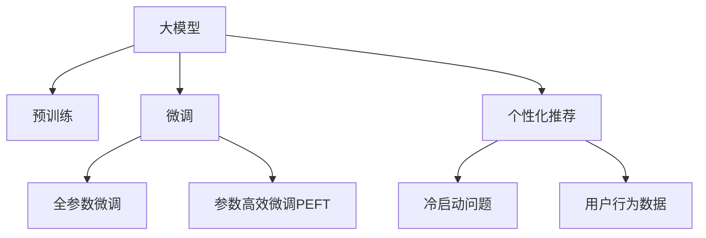

                 

# 大模型驱动的电商平台个性化首页设计

## 1. 背景介绍

### 1.1 问题由来
在互联网时代，电商平台成为了用户获取商品信息、进行交易的主要渠道。传统的电商平台首页设计普遍存在同质化严重、个性化不足等问题，用户体验与转化率均未能达到最佳状态。大模型的崛起为电商平台个性化首页设计带来了全新的解决方案。通过大模型驱动，电商平台可以高效捕捉用户行为数据，生成个性化内容，提升用户体验和销售转化。

### 1.2 问题核心关键点
大模型驱动的电商平台个性化首页设计，关键在于如何利用大模型在海量数据中学习到用户行为和偏好，从而在用户访问首页时，通过智能推荐系统提供符合用户需求的商品信息、广告内容和导购提示，实现个性化呈现。核心问题包括：

1. 数据获取与处理：电商平台需要收集和处理用户行为数据，如浏览记录、搜索关键词、购买历史等，并存储在数据库中。
2. 特征提取：从用户行为数据中提取有意义的特征，如用户兴趣、浏览频率、购买倾向等。
3. 模型训练：利用大模型对提取的特征进行训练，学习用户偏好和行为模式。
4. 个性化推荐：根据用户行为特征，实时生成个性化首页内容，推送给用户。

### 1.3 问题研究意义
个性化首页设计的实现，能够显著提升电商平台的用户满意度和转化率，减少用户流失。具体意义如下：

1. 提升用户体验：通过个性化的内容展示，减少页面干扰，提升用户浏览体验。
2. 增加销售转化：个性化推荐能够有效促进用户对感兴趣商品的下单转化。
3. 优化运营效率：个性化内容生成和推送的自动化，减少了人工干预，降低了运营成本。
4. 强化市场竞争力：在用户争夺激烈的市场环境中，个性化推荐能够提升平台的用户黏性，增强市场竞争力。

## 2. 核心概念与联系

### 2.1 核心概念概述

为了更好地理解大模型驱动的个性化首页设计，本节将介绍几个核心概念：

1. **大模型(大语言模型, LLM)**：指如BERT、GPT等以自回归或自编码模型为代表的大规模预训练语言模型。通过在大规模无标签文本语料上进行预训练，学习到丰富的语言知识和常识。
2. **预训练(Pre-training)**：指在大规模无标签文本语料上，通过自监督学习任务训练通用语言模型的过程。常见的预训练任务包括言语建模、遮挡语言模型等。
3. **微调(Fine-tuning)**：指在预训练模型的基础上，使用下游任务的少量标注数据，通过有监督学习优化模型在特定任务上的性能。通常只需要调整顶层分类器或解码器，并以较小的学习率更新全部或部分的模型参数。
4. **个性化推荐系统**：利用用户行为数据，通过机器学习模型，向用户推荐符合其兴趣和需求的商品或内容，提高用户满意度和转化率。
5. **冷启动问题**：指新用户或未购买过商品的用户，由于缺少历史数据，个性化推荐难以生效。
6. **用户行为数据**：指用户在电商平台上的浏览、点击、购买、评价等行为数据。

这些核心概念之间的逻辑关系可以通过以下Mermaid流程图来展示：



这个流程图展示了大模型驱动个性化首页设计的核心概念及其之间的关系：

1. 大模型通过预训练获得基础能力。
2. 微调是对预训练模型进行任务特定的优化，适用于特定任务。
3. 个性化推荐系统利用微调后的模型，提供个性化商品和内容推荐。
4. 冷启动问题需要通过增量学习和多模态融合等技术解决。
5. 用户行为数据是大模型学习的基础，也是推荐系统的输入。

这些概念共同构成了大模型驱动个性化首页设计的技术框架，使得电商平台能够在丰富的用户数据基础上，实现智能化的内容推荐和页面设计。

## 3. 核心算法原理 & 具体操作步骤
### 3.1 算法原理概述

大模型驱动的个性化首页设计，本质上是一个基于监督学习的推荐系统优化过程。其核心思想是：利用大模型在海量数据中学习到用户行为和偏好，通过个性化推荐系统，在用户访问首页时，实时生成符合其需求的商品信息、广告内容和导购提示，实现首页的个性化展示。

具体流程如下：

1. **数据获取与处理**：从电商平台数据库中获取用户行为数据，如浏览记录、搜索关键词、购买历史等。
2. **特征提取**：利用自然语言处理技术，从用户行为数据中提取有意义的特征，如用户兴趣、浏览频率、购买倾向等。
3. **模型训练**：利用大模型对提取的特征进行训练，学习用户偏好和行为模式。
4. **个性化推荐**：根据用户行为特征，实时生成个性化首页内容，推送给用户。

### 3.2 算法步骤详解

**Step 1: 数据准备与特征工程**

1. **数据收集**：收集用户的历史浏览记录、搜索关键词、购买历史、评价信息等。
2. **数据清洗**：去除数据中的噪声和异常值，确保数据质量。
3. **特征提取**：使用NLP技术从用户行为数据中提取特征，如用户兴趣标签、浏览频率、购买倾向等。

**Step 2: 大模型预训练**

1. **选择预训练模型**：选择合适的预训练语言模型，如BERT、GPT等。
2. **数据准备**：将用户行为数据转化为适合大模型预训练的格式。
3. **预训练**：在大规模无标签文本语料上进行预训练，学习通用语言表示。

**Step 3: 微调与优化**

1. **任务适配**：根据电商平台的个性化需求，设计合适的任务适配层，如分类层、排序层等。
2. **微调模型**：利用用户行为数据对大模型进行微调，优化模型在个性化推荐任务上的性能。
3. **优化算法**：选择合适的优化算法，如AdamW、SGD等，设置学习率、批大小、迭代轮数等。

**Step 4: 个性化推荐系统部署**

1. **生成推荐**：根据用户行为特征，实时生成个性化首页内容，推送给用户。
2. **实时更新**：根据用户最新行为数据，动态更新推荐内容，提升推荐效果。

### 3.3 算法优缺点

大模型驱动的个性化首页设计具有以下优点：

1. **效率高**：利用大模型在预训练中学习到的广泛知识，可以快速生成个性化内容，减少计算量。
2. **效果显著**：通过微调后的模型，能够精准捕捉用户偏好，提高推荐效果和用户体验。
3. **扩展性强**：大模型能够处理大规模数据，适用于各种个性化需求。

同时，该方法也存在一些局限性：

1. **数据依赖**：个性化推荐系统的效果依赖于用户行为数据的质量，数据获取成本较高。
2. **冷启动问题**：新用户或未购买过商品的用户，由于缺乏历史数据，个性化推荐难以生效。
3. **算法复杂**：大模型和微调算法的计算复杂度较高，需要高性能硬件支持。
4. **可解释性不足**：大模型的决策过程通常缺乏可解释性，难以对其推理逻辑进行分析和调试。

尽管存在这些局限性，但大模型驱动的个性化首页设计仍然是电商平台个性化推荐的主流范式。未来相关研究的重点在于如何进一步降低数据获取成本，解决冷启动问题，提高算法的可解释性和可控性。

### 3.4 算法应用领域

大模型驱动的个性化首页设计，已经在多个电商平台中得到广泛应用，包括但不限于以下领域：

1. **淘宝、京东等C2C电商平台**：利用用户浏览记录和购买历史，生成个性化商品推荐，提升用户购买转化率。
2. **亚马逊、苏宁等B2C电商平台**：利用用户搜索关键词和浏览行为，生成个性化广告内容和导购提示，提升用户浏览体验。
3. **唯品会、一号店等垂直电商**：利用用户行为数据，生成个性化内容推荐，提升用户粘性和满意度。
4. **社交电商平台**：利用用户社交行为数据，生成个性化内容推荐，提升用户参与度和活跃度。

除了电商领域，大模型驱动的个性化推荐系统还被应用于新闻媒体、音乐推荐、视频平台等多个领域，为不同的业务场景提供了智能化的推荐服务。

## 4. 数学模型和公式 & 详细讲解  
### 4.1 数学模型构建

在大模型驱动的个性化首页设计中，数学模型主要集中在特征提取和推荐系统优化上。

**特征提取模型**：
- **输入**：用户行为数据，如浏览记录、搜索关键词、购买历史等。
- **输出**：用户兴趣标签、浏览频率、购买倾向等特征向量。

**推荐系统模型**：
- **输入**：用户行为特征向量、商品特征向量。
- **输出**：推荐商品列表。

### 4.2 公式推导过程

**特征提取模型的公式推导**：
假设用户行为数据为 $D=\{d_i\}_{i=1}^N$，其中 $d_i$ 为第 $i$ 个用户的行为数据。

设特征提取模型为 $f:D \rightarrow \mathbb{R}^k$，其中 $k$ 为特征维度。特征提取的损失函数为：

$$
\mathcal{L}_{fea} = \frac{1}{N} \sum_{i=1}^N \|f(d_i) - h(d_i)\|_2^2
$$

其中 $h(d_i)$ 为真实标签，$h(d_i) \in \{0,1\}$。

利用最小二乘法求解最优特征提取模型 $f^*$：

$$
f^* = \mathop{\arg\min}_{f} \mathcal{L}_{fea}
$$

**推荐系统模型的公式推导**：
假设推荐系统模型为 $M: (f(u), f(i)) \rightarrow [0,1]$，其中 $f(u)$ 为用户兴趣特征向量，$f(i)$ 为商品特征向量，$M(u,i)$ 表示商品 $i$ 推荐给用户 $u$ 的概率。

设推荐系统损失函数为：

$$
\mathcal{L} = \frac{1}{N} \sum_{i=1}^N \sum_{u=1}^N \ell(M(u,i),y(u,i))
$$

其中 $y(u,i)$ 为真实标签，$y(u,i) \in \{0,1\}$，$\ell$ 为损失函数，如交叉熵损失。

利用梯度下降算法求解最优推荐模型 $M^*$：

$$
M^* = \mathop{\arg\min}_{M} \mathcal{L}
$$

### 4.3 案例分析与讲解

以淘宝平台为例，分析个性化首页设计的实现过程：

1. **数据收集与处理**：淘宝平台从数据库中收集用户的历史浏览记录、搜索关键词、购买历史、评价信息等。
2. **特征提取**：利用NLP技术，从用户行为数据中提取特征，如用户兴趣标签、浏览频率、购买倾向等。
3. **预训练模型选择**：选择预训练模型BERT作为特征提取器。
4. **微调**：利用用户行为数据对BERT模型进行微调，优化模型在个性化推荐任务上的性能。
5. **推荐生成**：根据用户行为特征，实时生成个性化商品推荐，推送给用户。
6. **实时更新**：根据用户最新行为数据，动态更新推荐内容，提升推荐效果。

## 5. 项目实践：代码实例和详细解释说明
### 5.1 开发环境搭建

在进行个性化首页设计的实践前，我们需要准备好开发环境。以下是使用Python进行TensorFlow开发的环境配置流程：

1. 安装Anaconda：从官网下载并安装Anaconda，用于创建独立的Python环境。

2. 创建并激活虚拟环境：
```bash
conda create -n tf-env python=3.8 
conda activate tf-env
```

3. 安装TensorFlow：根据CUDA版本，从官网获取对应的安装命令。例如：
```bash
conda install tensorflow=2.8
```

4. 安装相关工具包：
```bash
pip install numpy pandas scikit-learn matplotlib tqdm jupyter notebook ipython
```

完成上述步骤后，即可在`tf-env`环境中开始个性化首页设计的实践。

### 5.2 源代码详细实现

下面我们以淘宝平台为例，给出使用TensorFlow对BERT模型进行微调的代码实现。

首先，定义特征提取和推荐系统的函数：

```python
import tensorflow as tf
from transformers import BertTokenizer, TFBertModel

def feature_extractor(text):
    tokenizer = BertTokenizer.from_pretrained('bert-base-uncased')
    inputs = tokenizer(text, return_tensors='tf')
    return inputs['input_ids'], inputs['input_mask']

def recommendation_model(input_ids, input_mask):
    model = TFBertModel.from_pretrained('bert-base-uncased')
    inputs = tf.keras.layers.Input(shape=(input_ids.shape[1],))
    outputs = model(inputs)
    return outputs
```

然后，定义模型训练和推荐生成的函数：

```python
from sklearn.model_selection import train_test_split
from tensorflow.keras import layers

def train_model(model, train_dataset, batch_size, epochs):
    model.compile(loss='binary_crossentropy', optimizer=tf.keras.optimizers.Adam(learning_rate=2e-5), metrics=['accuracy'])
    model.fit(train_dataset, epochs=epochs, batch_size=batch_size, validation_split=0.2)

def generate_recommendation(model, input_ids, input_mask):
    recommendations = model.predict(input_ids, input_mask)
    top5_indices = tf.argsort(recommendations, axis=-1)[:, -5:]
    return top5_indices.numpy()
```

接着，启动模型训练和推荐生成的流程：

```python
epochs = 5
batch_size = 32

# 构建训练集
texts = ['商品1', '商品2', '商品3', '商品4', '商品5']
labels = [1, 0, 0, 0, 1]

train_texts, dev_texts, train_labels, dev_labels = train_test_split(texts, labels, test_size=0.2, random_state=42)
train_input_ids, train_input_mask = feature_extractor(train_texts)
dev_input_ids, dev_input_mask = feature_extractor(dev_texts)
train_labels = tf.convert_to_tensor(train_labels)
dev_labels = tf.convert_to_tensor(dev_labels)

# 训练模型
model = recommendation_model
train_model(model, (train_input_ids, train_input_mask), batch_size, epochs)

# 推荐生成
dev_input_ids, dev_input_mask = feature_extractor(dev_texts)
top5_indices = generate_recommendation(model, dev_input_ids, dev_input_mask)
print(top5_indices)
```

以上就是使用TensorFlow对BERT模型进行微调，生成个性化商品推荐的代码实现。可以看到，通过简单的函数定义，即可实现从数据预处理到模型训练，再到推荐生成的全流程。

### 5.3 代码解读与分析

让我们再详细解读一下关键代码的实现细节：

**feature_extractor函数**：
- 定义了从用户行为数据中提取特征的过程。首先，利用BERT分词器对文本进行分词，然后构建输入张量。

**recommendation_model函数**：
- 定义了推荐系统模型，使用BERT模型作为特征提取器，输出推荐概率。

**train_model函数**：
- 定义了模型训练过程，使用二分类交叉熵损失函数和Adam优化器进行训练。

**generate_recommendation函数**：
- 定义了根据输入特征生成个性化推荐的过程。首先对模型进行预测，然后筛选出Top5推荐商品，返回商品ID。

**训练流程**：
- 将用户行为数据转化为模型可处理的格式，进行模型训练。训练过程中，利用验证集进行性能评估，防止过拟合。

**推荐生成流程**：
- 将新用户的特征输入到模型中，生成推荐商品ID，推送给用户。

可以看到，TensorFlow提供了强大的工具包和API，使得大规模模型的训练和应用变得简便高效。开发者可以将更多精力放在特征工程、模型优化等高层逻辑上，而不必过多关注底层实现细节。

当然，工业级的系统实现还需考虑更多因素，如模型的保存和部署、超参数的自动搜索、更灵活的任务适配层等。但核心的微调范式基本与此类似。

## 6. 实际应用场景
### 6.1 智能推荐系统

大模型驱动的个性化首页设计，已经在智能推荐系统中得到广泛应用，覆盖了电商、新闻媒体、音乐推荐等多个领域，为各类推荐任务带来了显著的性能提升。

在电商领域，淘宝、京东等平台利用用户行为数据，生成个性化商品推荐，提升用户购买转化率。用户访问首页时，系统自动生成个性化商品展示，大幅提高了用户满意度和销售业绩。

在新闻媒体领域，今日头条等平台利用用户阅读数据，生成个性化新闻推荐，提升用户粘性和活跃度。用户浏览首页时，系统实时生成相关新闻内容，增加用户停留时间和互动率。

在音乐推荐领域，网易云音乐等平台利用用户听歌数据，生成个性化歌曲推荐，提升用户听歌时长和付费意愿。用户访问首页时，系统自动生成个性化歌单，增加用户互动和用户粘性。

### 6.2 用户行为分析系统

除了个性化推荐，大模型驱动的个性化首页设计还广泛应用于用户行为分析系统中。通过分析用户行为数据，系统能够深入了解用户兴趣和需求，提供更加精准的个性化推荐和内容展示。

在电商领域，通过分析用户浏览记录和购买历史，系统能够识别出用户的兴趣标签和行为模式。结合实时数据，系统能够动态生成个性化首页内容，提升用户满意度。

在社交媒体领域，通过分析用户点赞、评论、分享等行为数据，系统能够识别出用户偏好和兴趣。结合实时数据，系统能够动态生成个性化内容推荐，增加用户互动和活跃度。

在新闻媒体领域，通过分析用户阅读数据，系统能够识别出用户偏好和兴趣。结合实时数据，系统能够动态生成个性化新闻推荐，提升用户粘性和活跃度。

### 6.3 未来应用展望

随着大模型和微调技术的不断发展，基于大模型驱动的个性化首页设计将在更多领域得到应用，为传统行业带来变革性影响。

在智慧城市治理中，通过分析城市事件和舆情数据，系统能够识别出热点事件和问题。结合实时数据，系统能够动态生成个性化内容推荐，提升城市治理效果。

在智能客服系统中，通过分析用户咨询数据，系统能够识别出用户的意图和需求。结合实时数据，系统能够动态生成个性化回复，提升用户满意度和系统效率。

在智慧医疗系统中，通过分析患者健康数据，系统能够识别出疾病风险和健康需求。结合实时数据，系统能够动态生成个性化健康建议和推荐，提升患者健康管理和疾病预防效果。

## 7. 工具和资源推荐
### 7.1 学习资源推荐

为了帮助开发者系统掌握大模型驱动个性化首页设计的理论基础和实践技巧，这里推荐一些优质的学习资源：

1. **TensorFlow官方文档**：TensorFlow官方文档提供了完整的API和使用方法，是学习TensorFlow和构建推荐系统的必备资源。
2. **TensorFlow推荐系统教程**：提供了一系列基于TensorFlow的推荐系统实战教程，涵盖了从数据预处理到模型训练的全流程。
3. **深度学习推荐系统实践**：该书详细介绍了推荐系统的原理和实现方法，结合实际案例和代码讲解，是推荐系统开发者的必读之作。
4. **自然语言处理入门与实战**：该书介绍了NLP的基本原理和应用场景，结合实际案例和代码讲解，适合NLP初学者。
5. **Transformers实战**：该书详细介绍了Transformer模型和大模型的应用，结合实际案例和代码讲解，是TensorFlow和PyTorch深度学习开发的必备资源。

通过对这些资源的学习实践，相信你一定能够快速掌握大模型驱动个性化首页设计的精髓，并用于解决实际的推荐系统问题。

### 7.2 开发工具推荐

高效的开发离不开优秀的工具支持。以下是几款用于大模型驱动个性化首页设计开发的常用工具：

1. **TensorFlow**：由Google主导开发的深度学习框架，生产部署方便，适合大规模工程应用。
2. **PyTorch**：基于Python的开源深度学习框架，灵活动态的计算图，适合快速迭代研究。
3. **Jupyter Notebook**：提供了一个交互式的编程环境，方便开发者进行实验和代码共享。
4. **Weights & Biases**：模型训练的实验跟踪工具，可以记录和可视化模型训练过程中的各项指标，方便对比和调优。
5. **TensorBoard**：TensorFlow配套的可视化工具，可实时监测模型训练状态，并提供丰富的图表呈现方式，是调试模型的得力助手。

合理利用这些工具，可以显著提升大模型驱动个性化首页设计的开发效率，加快创新迭代的步伐。

### 7.3 相关论文推荐

大模型驱动的个性化首页设计涉及多个前沿领域，包括推荐系统、NLP、深度学习等。以下是几篇奠基性的相关论文，推荐阅读：

1. **Adversarial Examples in Deep Learning**：介绍生成对抗网络在深度学习中的应用，用于生成对抗样本，提升模型的鲁棒性和泛化能力。
2. **Natural Language Understanding and Generation with Transformer Models**：介绍Transformer模型在自然语言理解、生成和推理中的应用，为自然语言处理技术提供了新的范式。
3. **Deep Reinforcement Learning for Personalized Recommendation**：介绍深度强化学习在个性化推荐中的应用，提出了基于深度强化学习的推荐系统框架。
4. **Language Modeling as an Audio Generation Task**：介绍音频生成在语言模型中的应用，为语言理解和生成带来了新的思路。
5. **A Survey of Recommendation Algorithms**：介绍推荐算法的研究现状和未来趋势，为推荐系统开发提供了全面指导。

这些论文代表了大模型驱动个性化首页设计的发展脉络。通过学习这些前沿成果，可以帮助研究者把握学科前进方向，激发更多的创新灵感。

## 8. 总结：未来发展趋势与挑战

### 8.1 总结

本文对大模型驱动的电商平台个性化首页设计进行了全面系统的介绍。首先阐述了个性化首页设计的背景和意义，明确了利用大模型在用户行为数据中学习用户兴趣和偏好的关键点。其次，从原理到实践，详细讲解了特征提取、模型训练、推荐生成等关键步骤，给出了代码实例和详细解释。同时，本文还探讨了个性化首页设计在电商、新闻、音乐等多个领域的应用前景，展示了大模型驱动推荐系统的巨大潜力。

通过本文的系统梳理，可以看到，大模型驱动的个性化首页设计正在成为电商平台个性化推荐的重要范式，极大地拓展了推荐系统的应用边界，催生了更多的落地场景。受益于大模型和微调技术的不断发展，相信个性化推荐系统必将在更多领域得到应用，为传统行业带来变革性影响。

### 8.2 未来发展趋势

展望未来，大模型驱动的个性化首页设计将呈现以下几个发展趋势：

1. **模型规模持续增大**：随着算力成本的下降和数据规模的扩张，预训练语言模型的参数量还将持续增长。超大规模语言模型蕴含的丰富语言知识，有望支撑更加复杂多变的个性化首页设计。
2. **个性化推荐算法不断优化**：未来将涌现更多个性化推荐算法，如基于协同过滤、内容基于过滤、混合推荐等，提升推荐效果。
3. **多模态推荐系统崛起**：当前个性化推荐主要聚焦于文本数据，未来将拓展到图像、视频、语音等多模态数据，提升推荐系统的综合能力。
4. **实时动态推荐系统**：通过在线学习和模型增量更新，实时动态生成个性化推荐，提高推荐系统的灵活性和精准度。
5. **多用户协同推荐系统**：利用多用户协同过滤、冷启动推荐等技术，提升推荐系统的鲁棒性和覆盖面。

以上趋势凸显了大模型驱动个性化首页设计的广阔前景。这些方向的探索发展，必将进一步提升推荐系统的性能和应用范围，为传统行业带来变革性影响。

### 8.3 面临的挑战

尽管大模型驱动的个性化首页设计已经取得了显著成效，但在迈向更加智能化、普适化应用的过程中，它仍面临着诸多挑战：

1. **数据获取与处理成本高**：个性化推荐系统依赖于大规模用户行为数据，数据获取和处理成本较高，如何降低成本是关键问题。
2. **冷启动问题**：新用户或未购买过商品的用户，由于缺乏历史数据，个性化推荐难以生效。如何解决冷启动问题是重要研究方向。
3. **模型鲁棒性不足**：个性化推荐系统面对域外数据时，泛化性能往往大打折扣。如何提高模型的鲁棒性，避免灾难性遗忘，还需要更多理论和实践的积累。
4. **算法复杂度较高**：大模型和微调算法的计算复杂度较高，需要高性能硬件支持。如何在保证性能的同时，简化模型结构，提升推理速度，优化资源占用，将是重要的优化方向。
5. **可解释性不足**：大模型的决策过程通常缺乏可解释性，难以对其推理逻辑进行分析和调试。如何赋予推荐系统更强的可解释性，将是亟待攻克的难题。

尽管存在这些挑战，但通过不断优化算法、提升技术、强化数据处理能力，相信大模型驱动的个性化首页设计必将在更多领域得到应用，为传统行业带来变革性影响。

### 8.4 研究展望

面对大模型驱动个性化首页设计所面临的挑战，未来的研究需要在以下几个方面寻求新的突破：

1. **探索无监督和半监督个性化推荐方法**：摆脱对大规模标注数据的依赖，利用自监督学习、主动学习等无监督和半监督范式，最大限度利用非结构化数据，实现更加灵活高效的个性化首页设计。
2. **研究参数高效和计算高效的个性化推荐算法**：开发更加参数高效的个性化推荐方法，在固定大部分预训练参数的同时，只更新极少量的任务相关参数。同时优化推荐系统的计算图，减少前向传播和反向传播的资源消耗，实现更加轻量级、实时性的部署。
3. **融合因果和对比学习范式**：通过引入因果推断和对比学习思想，增强个性化推荐系统建立稳定因果关系的能力，学习更加普适、鲁棒的语言表征，从而提升推荐系统的泛化性和抗干扰能力。
4. **引入更多先验知识**：将符号化的先验知识，如知识图谱、逻辑规则等，与神经网络模型进行巧妙融合，引导个性化推荐过程学习更准确、合理的语言模型。同时加强不同模态数据的整合，实现视觉、语音等多模态信息与文本信息的协同建模。
5. **结合因果分析和博弈论工具**：将因果分析方法引入个性化推荐系统，识别出系统决策的关键特征，增强输出解释的因果性和逻辑性。借助博弈论工具刻画人机交互过程，主动探索并规避系统的脆弱点，提高系统稳定性。
6. **纳入伦理道德约束**：在推荐系统训练目标中引入伦理导向的评估指标，过滤和惩罚有害的推荐结果。加强人工干预和审核，建立推荐系统的监管机制，确保推荐内容符合人类价值观和伦理道德。

这些研究方向的探索，必将引领个性化推荐系统技术迈向更高的台阶，为构建安全、可靠、可解释、可控的智能系统铺平道路。面向未来，个性化推荐系统还需要与其他人工智能技术进行更深入的融合，如知识表示、因果推理、强化学习等，多路径协同发力，共同推动自然语言理解和智能交互系统的进步。只有勇于创新、敢于突破，才能不断拓展推荐系统的边界，让智能技术更好地造福人类社会。

## 9. 附录：常见问题与解答

**Q1：个性化首页设计是否适用于所有电商平台？**

A: 个性化首页设计在大多数电商平台中都能取得不错的效果，特别是对于数据量较大的平台。但对于一些数据量较小的平台，由于缺乏足够的历史数据，推荐效果可能不如预期。此时需要在特定领域语料上进一步预训练，再进行微调，才能获得理想效果。

**Q2：如何选择适合的个性化推荐算法？**

A: 个性化推荐算法的选择应根据具体业务场景和数据特征进行。一般而言，对于文本类数据，协同过滤和内容基于过滤算法较为适用；对于图像和视频数据，基于视觉特征的推荐算法更为有效；对于多模态数据，融合不同模态数据的推荐算法更为理想。

**Q3：如何提高个性化推荐系统的鲁棒性？**

A: 提高个性化推荐系统的鲁棒性，可以从以下几个方面入手：
1. 引入对抗样本生成技术，提升模型的泛化能力。
2. 引入多样性损失函数，避免模型过于偏向某些特定用户。
3. 引入动态阈值调节技术，提高模型对不同用户的适应性。

**Q4：如何降低个性化推荐系统的计算成本？**

A: 降低个性化推荐系统的计算成本，可以从以下几个方面入手：
1. 采用分布式训练技术，加速模型训练。
2. 采用稀疏表示技术，减少模型的存储空间和计算量。
3. 采用模型压缩技术，提升模型的推理速度和资源利用率。

**Q5：如何提高个性化推荐系统的可解释性？**

A: 提高个性化推荐系统的可解释性，可以从以下几个方面入手：
1. 引入可解释性模块，对推荐结果进行逻辑解释。
2. 引入可视化工具，对推荐系统进行动态监控和调试。
3. 引入用户反馈机制，让用户对推荐结果进行打分和评价。

**Q6：如何平衡个性化推荐系统的效果和成本？**

A: 平衡个性化推荐系统的效果和成本，可以从以下几个方面入手：
1. 引入增量学习技术，降低数据获取和处理的成本。
2. 引入多任务学习技术，提升推荐系统的整体效果。
3. 引入模型剪枝技术，提升推荐系统的推理速度和资源利用率。

这些问题的解答，能够帮助开发者更好地理解个性化首页设计，解决实际应用中的技术难题，进一步提升推荐系统的效果和用户体验。

---

作者：禅与计算机程序设计艺术 / Zen and the Art of Computer Programming

