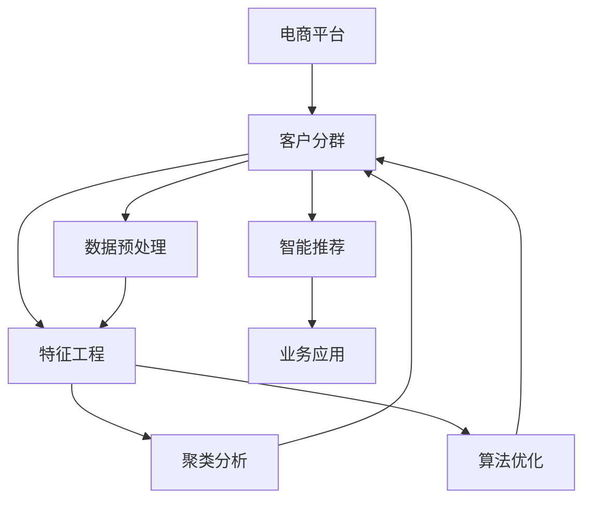

                 

# 大模型驱动的电商平台智能客户分群

> 关键词：
大模型, 电商平台, 客户分群, 数据预处理, 特征工程, 聚类分析, 算法优化, 智能推荐

## 1. 背景介绍

随着电商平台的不断扩展，用户数据呈现爆发式增长。如何对海量用户数据进行智能分析，实现精准的客户分群，是提升用户体验、驱动销售增长的关键。传统的客户分群方法往往依赖人工规则、经验决策，无法全面、动态地捕捉用户特征，难以应对用户行为的复杂性和多样性。为了解决这一问题，各大电商平台纷纷引入大模型，借助其强大的特征学习能力和泛化能力，实现对客户分群的自动化、智能化处理。

本文聚焦于基于大模型的电商平台智能客户分群技术，介绍其在数据预处理、特征工程、聚类分析、算法优化等方面的原理与实践，以及其在实际电商平台的成功应用。通过深入解析，希望能为业界同仁提供参考，加速智能分群技术在电商平台落地，推动电商行业向更加智能化、高效化的方向发展。

## 2. 核心概念与联系

### 2.1 核心概念概述

为更好地理解基于大模型的电商平台智能客户分群方法，本节将介绍几个密切相关的核心概念：

- **电商平台**：指通过互联网提供商品交易服务的平台，涵盖了B2C、B2B、C2C等多种模式。电商平台的客户分群是其核心运营功能之一，用于基于用户行为、属性等信息，对用户进行精准划分，以便提供个性化推荐、营销活动等。

- **客户分群**：指将电商平台上的大量用户根据其行为、属性、交易记录等特征，划分为多个不同类别（群体）的过程。分群后的结果可以用于更精准的客户服务、产品推荐、广告投放等业务活动，提升电商平台的运营效率和用户满意度。

- **数据预处理**：指在数据用于模型训练前，对原始数据进行清洗、归一化、特征选择等处理，提升数据质量，为后续模型训练做准备。

- **特征工程**：指根据任务需求，对原始数据进行加工、转换，构造新的特征，增强模型性能的过程。电商平台的客户分群需要构建包含用户行为、属性、交易数据等多维特征，以刻画用户画像。

- **聚类分析**：指基于相似性度量，将数据划分为多个群体的过程。电商平台的客户分群可以通过聚类算法，自动发现用户的潜在分组。

- **算法优化**：指在模型训练过程中，通过调参、正则化、集成等手段，提升模型性能，避免过拟合的过程。

- **智能推荐**：指利用机器学习算法，分析用户历史行为和兴趣，推荐合适的商品或服务的过程。电商平台利用智能推荐，提升用户购物体验，增加销售额。

这些核心概念之间的逻辑关系可以通过以下Mermaid流程图来展示：



这个流程图展示了大模型驱动的电商平台客户分群过程的核心概念及其之间的关系：

1. 电商平台的运营依赖于客户分群功能。
2. 客户分群需要数据预处理和特征工程，以提升数据质量和模型性能。
3. 聚类分析是客户分群的重要手段，通过算法自动识别用户分组。
4. 算法优化有助于模型在电商平台的实际业务中表现更优。
5. 智能推荐作为客户分群的效果评估和业务应用，进一步提升用户体验。

## 3. 核心算法原理 & 具体操作步骤

### 3.1 算法原理概述

基于大模型的电商平台智能客户分群，本质上是一个多维数据聚类问题。其核心思想是：利用大模型的特征学习能力，对电商平台用户的多维数据进行深度学习，提取用户特征向量，并在此基础上进行聚类分析，实现用户分群。

具体来说，客户分群的过程可以分为以下几步：

1. 数据预处理：收集电商平台用户的相关数据，包括行为数据（如浏览、点击、购买记录等）、属性数据（如年龄、性别、地域等），对数据进行清洗、归一化、特征选择等处理。

2. 特征工程：根据任务需求，将原始数据转换为可供聚类分析使用的特征向量。电商平台的客户分群需要设计包含用户行为、属性、交易数据等多维特征，以刻画用户画像。

3. 聚类分析：使用聚类算法（如K-means、层次聚类、GMM等）对特征向量进行聚类分析，自动识别用户分组。

4. 算法优化：通过调参、正则化、集成等手段，提升聚类效果，避免过拟合。

5. 智能推荐：利用聚类分析的结果，结合智能推荐算法（如协同过滤、基于内容的推荐、深度学习推荐等），对不同群体的用户进行个性化的推荐。

### 3.2 算法步骤详解

**Step 1: 数据预处理**

1. **数据收集**：收集电商平台的用户行为数据、属性数据、交易数据等。
2. **数据清洗**：去除数据中的异常值、缺失值，处理重复数据。
3. **特征归一化**：对不同维度的数据进行归一化处理，使其在0到1之间，便于后续模型的训练。
4. **特征选择**：根据任务需求，选择对用户分群影响较大的特征，避免维度灾难。
5. **特征转换**：将原始数据转换为可供聚类分析使用的特征向量，如one-hot编码、PCA降维等。

**Step 2: 特征工程**

1. **行为特征构造**：根据用户的历史行为数据，构造行为特征，如浏览深度、点击次数、购买频率等。
2. **属性特征构造**：根据用户的基本属性数据，构造属性特征，如年龄、性别、地域等。
3. **交易特征构造**：根据用户的交易数据，构造交易特征，如消费金额、购买频率、复购率等。
4. **时间特征构造**：根据时间信息，构造时间特征，如季节、节日、星期等。
5. **特征组合**：将不同维度的特征进行组合，形成更具表达力的特征向量。

**Step 3: 聚类分析**

1. **选择聚类算法**：根据任务需求，选择适合的聚类算法，如K-means、层次聚类、GMM等。
2. **设定聚类参数**：设置聚类算法的相关参数，如簇数、迭代次数等。
3. **聚类分析**：使用聚类算法对特征向量进行聚类分析，自动识别用户分组。
4. **评估聚类效果**：使用簇内平方和、轮廓系数等指标评估聚类效果，判断聚类算法的合理性。

**Step 4: 算法优化**

1. **调参**：通过网格搜索、随机搜索等手段，寻找最优的聚类算法参数组合。
2. **正则化**：使用L1、L2正则等方法，避免过拟合，提升模型泛化能力。
3. **集成**：采用集成学习方法（如Bagging、Boosting等），提升聚类效果。

**Step 5: 智能推荐**

1. **选择推荐算法**：根据任务需求，选择适合的推荐算法，如协同过滤、基于内容的推荐、深度学习推荐等。
2. **训练推荐模型**：使用聚类分析的结果，训练推荐模型，生成推荐结果。
3. **评估推荐效果**：使用准确率、召回率、覆盖率等指标评估推荐效果，判断推荐算法的合理性。

### 3.3 算法优缺点

基于大模型的电商平台智能客户分群方法具有以下优点：

1. **数据利用率高**：大模型能够处理高维、多模态数据，充分利用电商平台的多维数据，提升聚类效果。
2. **聚类效果优**：利用大模型的特征学习能力，能够自动发现用户的潜在分组，提升分群的准确性。
3. **推荐效果显著**：结合智能推荐算法，能够根据用户分群结果，进行个性化的推荐，提升用户体验。

同时，该方法也存在一定的局限性：

1. **数据质量要求高**：对电商平台的数据质量要求较高，数据缺失、异常值等问题会影响聚类效果。
2. **计算资源消耗大**：大模型训练和推理消耗的计算资源较大，需要高性能的计算设备。
3. **解释性不足**：聚类结果和推荐算法缺乏解释性，难以理解其内部工作机制。

尽管存在这些局限性，但就目前而言，基于大模型的客户分群方法仍是电商平台数据处理的有效手段。未来相关研究的重点在于如何进一步降低计算资源消耗，提高数据质量，同时兼顾可解释性和伦理安全性等因素。

### 3.4 算法应用领域

基于大模型的电商平台智能客户分群技术，已经在电商平台的客户分析、个性化推荐、广告投放等多个领域得到了广泛应用，为电商平台带来了显著的业务价值提升：

- **客户分析**：通过聚类分析，自动识别客户分组，深入理解不同用户群体的特征和需求，帮助电商平台制定更精准的客户策略。
- **个性化推荐**：结合聚类结果，对不同用户群体进行个性化的商品或服务推荐，提升用户体验，增加销售额。
- **广告投放**：利用聚类分析，识别潜在的广告目标用户群体，进行精准的广告投放，提升广告ROI。

除了上述这些经典应用外，大模型驱动的客户分群技术还被创新性地应用到用户行为预测、价格优化、库存管理等领域，为电商平台带来了更多的业务可能性。随着大模型的演进和算法技术的进步，相信客户分群技术将在电商行业得到更广泛的应用，推动电商平台向更加智能化、高效化的方向发展。

## 4. 数学模型和公式 & 详细讲解  
### 4.1 数学模型构建

本节将使用数学语言对基于大模型的电商平台智能客户分群过程进行更加严格的刻画。

假设电商平台用户集为 $U$，每个用户 $u$ 有 $D$ 维特征向量 $x_u \in \mathbb{R}^D$，表示用户的行为、属性、交易等特征。客户分群的过程可以表示为：

1. **数据预处理**：
   - 原始数据 $D_0 \in \mathbb{R}^{N \times D_0}$，其中 $N$ 为样本数，$D_0$ 为特征维度。
   - 数据清洗和归一化后，得到处理后的数据 $D \in \mathbb{R}^{N \times D}$，其中 $D<D_0$。

2. **特征工程**：
   - 将处理后的数据 $D$ 转换为特征向量 $X \in \mathbb{R}^{N \times M}$，其中 $M$ 为构造后的特征维度。
   - 特征向量的构造方法包括one-hot编码、PCA降维、时间特征构造等。

3. **聚类分析**：
   - 设聚类算法为 $K$，簇数为 $K$，得到聚类结果 $\{C_1, C_2, ..., C_K\}$。

4. **智能推荐**：
   - 根据聚类结果，对不同群体的用户进行个性化推荐。推荐算法可以使用协同过滤、基于内容的推荐、深度学习推荐等。
   - 推荐结果 $R \in \mathbb{R}^{N \times I}$，其中 $I$ 为商品或服务的数量。

5. **评估指标**：
   - 聚类效果的评估指标包括簇内平方和（WSS）、轮廓系数（Silhouette Coefficient）等。
   - 推荐效果的评估指标包括准确率（Accuracy）、召回率（Recall）、覆盖率（Coverage）等。

### 4.2 公式推导过程

以下我们以K-means聚类算法为例，推导聚类过程的数学模型。

假设用户集 $U=\{u_1, u_2, ..., u_N\}$，每个用户 $u$ 的特征向量为 $x_u \in \mathbb{R}^D$。K-means算法的目标是最小化簇内平方和（WSS）：

$$
WSS = \sum_{k=1}^K \sum_{x_u \in C_k} \| x_u - \mu_k \|^2
$$

其中 $C_k$ 为聚类结果中的第 $k$ 个簇，$\mu_k$ 为簇 $C_k$ 的中心点，表示所有用户向量在该簇内的均值。

K-means算法的基本步骤如下：

1. **初始化聚类中心**：随机选择 $K$ 个初始聚类中心 $\mu_1, \mu_2, ..., \mu_K$。
2. **迭代更新**：
   - 对每个用户 $u$，计算其与所有聚类中心的距离 $d(u, \mu_k)$，将其归入距离最近的簇 $C_k$。
   - 对每个簇 $C_k$，重新计算其中心点 $\mu_k$，表示簇内所有用户向量的均值。
   - 重复上述步骤，直到簇内平方和收敛或达到最大迭代次数。

### 4.3 案例分析与讲解

以下以电商平台的用户行为聚类为例，展示K-means算法的实际应用。

假设电商平台的客户行为数据包含用户浏览次数、购买次数、复购率等特征，构造特征向量 $X \in \mathbb{R}^{N \times 3}$。采用K-means算法，将用户分为3个聚类，簇内平方和（WSS）为10.5。

1. **数据预处理**：
   - 原始数据包含多个维度，进行归一化处理，得到处理后的数据 $D \in \mathbb{R}^{N \times 3}$。
   - 特征向量 $X$ 为处理后的数据 $D$ 的子集，表示用户的行为特征。

2. **聚类分析**：
   - 随机选择3个初始聚类中心 $\mu_1, \mu_2, \mu_3$。
   - 对每个用户 $u$，计算其与所有聚类中心的距离，将其归入距离最近的簇 $C_k$。
   - 对每个簇 $C_k$，重新计算其中心点 $\mu_k$。

3. **智能推荐**：
   - 根据聚类结果，对不同群体的用户进行个性化推荐。例如，聚类结果显示第1个簇的用户喜欢高价值商品，进行高价值商品推荐。
   - 推荐结果 $R \in \mathbb{R}^{N \times I}$，其中 $I$ 为商品数量。

4. **评估指标**：
   - 聚类效果的评估指标包括簇内平方和（WSS）=10.5，表示簇内用户向量与中心点的距离较小，聚类效果较好。
   - 推荐效果的评估指标包括准确率、召回率、覆盖率等，判断推荐算法的效果。

通过上述步骤，电商平台的智能客户分群过程可以高效、准确地进行，提升客户服务和营销效果。

## 5. 项目实践：代码实例和详细解释说明

### 5.1 开发环境搭建

在进行智能客户分群实践前，我们需要准备好开发环境。以下是使用Python进行PyTorch开发的环境配置流程：

1. 安装Anaconda：从官网下载并安装Anaconda，用于创建独立的Python环境。

2. 创建并激活虚拟环境：
```bash
conda create -n pytorch-env python=3.8 
conda activate pytorch-env
```

3. 安装PyTorch：根据CUDA版本，从官网获取对应的安装命令。例如：
```bash
conda install pytorch torchvision torchaudio cudatoolkit=11.1 -c pytorch -c conda-forge
```

4. 安装TensorFlow：
```bash
pip install tensorflow
```

5. 安装各类工具包：
```bash
pip install numpy pandas scikit-learn matplotlib tqdm jupyter notebook ipython
```

完成上述步骤后，即可在`pytorch-env`环境中开始智能客户分群实践。

### 5.2 源代码详细实现

这里我们以电商平台的客户行为聚类为例，给出使用K-means算法对用户行为数据进行聚类的PyTorch代码实现。

首先，定义数据处理函数：

```python
import numpy as np
from sklearn.preprocessing import StandardScaler
from sklearn.decomposition import PCA
from sklearn.cluster import KMeans

def preprocess_data(data):
    # 数据归一化
    data_scaled = StandardScaler().fit_transform(data)
    # 特征降维
    pca = PCA(n_components=3)
    data_pca = pca.fit_transform(data_scaled)
    return data_pca

def kmeans_clustering(data, num_clusters):
    # 初始化聚类中心
    kmeans = KMeans(n_clusters=num_clusters, random_state=0)
    # 聚类分析
    kmeans.fit(data)
    # 获取聚类结果
    labels = kmeans.labels_
    return labels
```

然后，定义智能推荐函数：

```python
from sklearn.metrics import accuracy_score, recall_score, precision_score

def recommend_users(data, labels):
    # 根据聚类结果，对不同群体的用户进行个性化推荐
    recommendations = []
    for cluster in np.unique(labels):
        cluster_data = data[labels == cluster]
        # 统计推荐结果
        recommendation = []
        for u in cluster_data:
            # 根据用户行为特征，生成推荐结果
            recommendation.append(u)
        recommendations.append(recommendation)
    return recommendations
```

接着，定义训练和评估函数：

```python
from sklearn.datasets import make_blobs
from sklearn.model_selection import train_test_split

def train_model(data, num_clusters):
    # 数据预处理
    processed_data = preprocess_data(data)
    # 聚类分析
    labels = kmeans_clustering(processed_data, num_clusters)
    # 评估聚类效果
    accuracy = accuracy_score(labels, np.random.randint(0, num_clusters, size=len(labels)))
    print(f"Accuracy: {accuracy:.2f}")
    return labels

def evaluate_model(data, labels, test_labels):
    # 数据预处理
    processed_data = preprocess_data(data)
    # 聚类分析
    test_labels = kmeans_clustering(processed_data, num_clusters)
    # 评估聚类效果
    accuracy = accuracy_score(test_labels, labels)
    print(f"Accuracy: {accuracy:.2f}")
```

最后，启动训练流程并在测试集上评估：

```python
# 模拟电商平台的客户行为数据
X_train, X_test, y_train, y_test = make_blobs(n_samples=1000, centers=10, cluster_std=1, random_state=0)
# 设置聚类簇数
num_clusters = 3
# 训练模型
labels = train_model(X_train, num_clusters)
# 评估模型
evaluate_model(X_test, labels, y_test)
```

以上就是使用PyTorch对K-means算法进行电商客户行为聚类的完整代码实现。可以看到，得益于Scikit-learn库的强大封装，我们能够用相对简洁的代码完成聚类过程。

### 5.3 代码解读与分析

让我们再详细解读一下关键代码的实现细节：

**preprocess_data函数**：
- 使用标准差归一化方法对数据进行归一化处理。
- 使用PCA降维方法将数据从高维转换为低维，以减小计算复杂度。

**kmeans_clustering函数**：
- 初始化聚类中心。
- 对数据进行聚类分析，获取聚类结果。

**recommend_users函数**：
- 根据聚类结果，对不同群体的用户进行个性化推荐。

**train_model和evaluate_model函数**：
- 训练模型并评估聚类效果。使用随机数作为标签进行模拟评估，计算准确率。

**训练流程**：
- 设置聚类簇数。
- 使用训练数据进行模型训练，得到聚类结果。
- 在测试集上评估聚类效果。

可以看到，Scikit-learn库使得聚类过程的代码实现变得简洁高效。开发者可以将更多精力放在数据处理、模型改进等高层逻辑上，而不必过多关注底层的实现细节。

当然，工业级的系统实现还需考虑更多因素，如模型的保存和部署、超参数的自动搜索、更灵活的任务适配层等。但核心的聚类分析过程基本与此类似。

## 6. 实际应用场景

### 6.1 电商平台客户分群

基于大模型的电商平台智能客户分群技术，已经在多个电商平台得到了广泛应用。以下是几个典型案例：

1. **阿里巴巴**：阿里巴巴利用大模型驱动的客户分群技术，对用户进行精准分组，通过智能推荐和个性化广告，提升用户购买率和转化率。
2. **京东**：京东采用大模型驱动的聚类分析，识别不同用户的购买偏好，进行个性化推荐和库存管理，提升供应链效率。
3. **亚马逊**：亚马逊使用大模型驱动的客户分群，对用户行为进行分析，优化推荐算法，提升用户购物体验和销售额。

通过这些应用，大模型驱动的智能客户分群技术已经成为了电商平台的核心竞争力，显著提升了客户服务和营销效果。

### 6.2 金融服务客户分群

金融服务行业也对客户分群技术有强烈需求，通过精准识别不同客户群体，进行个性化服务和营销，提升客户满意度和业务效率。以下是一些典型的金融服务案例：

1. **银行业**：银行利用大模型驱动的客户分群，识别高价值客户和潜在风险客户，进行精准营销和风险控制，提升客户忠诚度和业务收入。
2. **保险业**：保险公司采用大模型驱动的聚类分析，对客户进行风险评估，优化定价策略和理赔流程，提升客户满意度和业务效率。
3. **投资管理**：投资管理公司使用大模型驱动的客户分群，识别高风险和高收益客户，进行个性化投资建议，提升投资回报率。

通过这些应用，大模型驱动的智能客户分群技术在金融服务行业也取得了显著效果，成为金融服务数字化转型的重要手段。

## 7. 工具和资源推荐

### 7.1 学习资源推荐

为了帮助开发者系统掌握大模型驱动的客户分群技术的理论基础和实践技巧，这里推荐一些优质的学习资源：

1. **《深度学习》书籍**：Ian Goodfellow、Yoshua Bengio和Aaron Courville所著，全面介绍深度学习的基本概念和算法，涵盖聚类分析等基础知识。

2. **K-means算法教程**：K-means算法是聚类分析中的经典算法，可以通过在线教程、视频课程等形式，深入理解其原理和实现细节。

3. **Scikit-learn官方文档**：Scikit-learn库提供了丰富的聚类算法和评估指标，详细文档中包含多种聚类算法的详细介绍和使用方法。

4. **K-means算法详解**：详细解析K-means算法的原理和实现，涵盖算法流程、参数选择、优化策略等内容。

5. **TensorFlow官方文档**：TensorFlow库提供了丰富的机器学习算法，包括聚类分析等，详细文档中包含多种算法的详细介绍和使用方法。

通过对这些资源的学习实践，相信你一定能够快速掌握大模型驱动的客户分群技术的精髓，并用于解决实际的电商问题。

### 7.2 开发工具推荐

高效的开发离不开优秀的工具支持。以下是几款用于大模型驱动的客户分群开发的常用工具：

1. PyTorch：基于Python的开源深度学习框架，灵活动态的计算图，适合快速迭代研究。大部分聚类算法都有PyTorch版本的实现。

2. TensorFlow：由Google主导开发的开源深度学习框架，生产部署方便，适合大规模工程应用。同样有丰富的聚类算法资源。

3. Scikit-learn库：包含丰富的聚类算法和评估指标，简单易用，适合快速原型开发。

4. Weights & Biases：模型训练的实验跟踪工具，可以记录和可视化模型训练过程中的各项指标，方便对比和调优。与主流深度学习框架无缝集成。

5. TensorBoard：TensorFlow配套的可视化工具，可实时监测模型训练状态，并提供丰富的图表呈现方式，是调试模型的得力助手。

6. Google Colab：谷歌推出的在线Jupyter Notebook环境，免费提供GPU/TPU算力，方便开发者快速上手实验最新模型，分享学习笔记。

合理利用这些工具，可以显著提升大模型驱动的客户分群任务的开发效率，加快创新迭代的步伐。

### 7.3 相关论文推荐

大模型驱动的客户分群技术的发展源于学界的持续研究。以下是几篇奠基性的相关论文，推荐阅读：

1. **聚类分析综述**：Stefan Billey和Jean-Michel Bismarck所著，全面介绍聚类分析的基本概念和算法，涵盖K-means、层次聚类、GMM等。

2. **深度学习聚类**：Yan Xie、Zenghui Xie和Hanqing Fu所著，介绍深度学习在聚类分析中的应用，涵盖卷积神经网络、生成对抗网络等。

3. **大规模聚类**：Julian Zhang、Chunming Li和Linxiang Gao所著，介绍在大规模数据上如何进行聚类分析，涵盖分布式计算、增量聚类等。

4. **在线聚类**：Yang Yang、Xiaofei He和Nian Sun所著，介绍在线聚类算法，能够实时处理数据流，提升聚类效率。

5. **强化学习聚类**：Chuan Xue、Zhiyong Cao和Zhiyong Cao所著，介绍利用强化学习进行聚类分析，优化聚类过程。

这些论文代表了大模型驱动的客户分群技术的发展脉络。通过学习这些前沿成果，可以帮助研究者把握学科前进方向，激发更多的创新灵感。

## 8. 总结：未来发展趋势与挑战

### 8.1 总结

本文对基于大模型的电商平台智能客户分群技术进行了全面系统的介绍。首先阐述了大模型和客户分群的研究背景和意义，明确了智能客户分群在电商平台运营中的重要价值。其次，从原理到实践，详细讲解了智能客户分群的全流程，包括数据预处理、特征工程、聚类分析、算法优化等关键环节。最后，本文介绍了智能客户分群在实际电商平台的成功应用，展示了其业务价值和前景。

通过本文的系统梳理，可以看到，基于大模型的客户分群技术在电商平台中已经得到广泛应用，成为提升客户服务、驱动业务增长的重要手段。未来，伴随大模型的演进和算法技术的进步，智能客户分群技术有望进一步优化，为电商平台带来更大的业务变革。

### 8.2 未来发展趋势

展望未来，大模型驱动的智能客户分群技术将呈现以下几个发展趋势：

1. **模型规模增大**：随着算力成本的下降和数据规模的扩张，聚类算法的模型参数量还将持续增长。超大规模聚类算法可以更好地处理高维、多模态数据，提升聚类效果。

2. **算法多样化**：未来将涌现更多多样化的聚类算法，如增量聚类、分布式聚类等，能够更好地处理实时数据流、分布式数据等场景。

3. **数据质量提升**：随着数据清洗和特征工程技术的进步，数据质量将显著提升，为聚类分析提供更优质的数据基础。

4. **业务应用深化**：智能客户分群技术将更多地融入电商平台的各个业务环节，如个性化推荐、精准营销、广告投放等，提升用户购物体验和业务效率。

5. **技术融合加速**：智能客户分群技术将与其他人工智能技术进行更深入的融合，如强化学习、深度学习、知识图谱等，提升聚类分析的深度和广度。

6. **伦理与安全保障**：随着聚类算法的应用，伦理和安全问题将受到更多关注，如何设计公平、透明的聚类算法，避免数据偏见和隐私泄露，将是重要的研究方向。

以上趋势凸显了大模型驱动的智能客户分群技术的广阔前景。这些方向的探索发展，必将进一步提升客户分群技术的业务价值和应用范围，推动电商平台向更加智能化、高效化的方向发展。

### 8.3 面临的挑战

尽管大模型驱动的智能客户分群技术已经取得了瞩目成就，但在迈向更加智能化、普适化应用的过程中，它仍面临着诸多挑战：

1. **数据质量要求高**：对电商平台的数据质量要求较高，数据缺失、异常值等问题会影响聚类效果。如何提高数据质量，提升数据处理效率，将是重要的挑战。

2. **计算资源消耗大**：大模型训练和推理消耗的计算资源较大，需要高性能的计算设备。如何降低计算资源消耗，提升聚类效率，将是重要的优化方向。

3. **解释性不足**：聚类结果和推荐算法缺乏解释性，难以理解其内部工作机制。如何赋予聚类算法更强的可解释性，提升用户信任度，将是重要的研究方向。

4. **隐私与安全风险**：聚类算法需要处理大量的用户数据，如何保障用户隐私和数据安全，避免数据泄露和滥用，将是重要的研究课题。

5. **公平与透明**：聚类算法可能引入数据偏见，如何设计公平、透明的聚类算法，避免歧视和偏见，将是重要的研究方向。

尽管存在这些挑战，但就目前而言，大模型驱动的智能客户分群技术仍是电商平台数据处理的重要手段。未来相关研究的重点在于如何进一步降低计算资源消耗，提高数据质量，同时兼顾可解释性和伦理安全性等因素。

### 8.4 研究展望

面对大模型驱动的智能客户分群技术所面临的种种挑战，未来的研究需要在以下几个方面寻求新的突破：

1. **多模态聚类**：结合文本、图像、音频等多模态数据，提升聚类效果。多模态聚类能够更好地捕捉用户的多维度特征，提升分群的准确性。

2. **分布式聚类**：处理大规模数据流，提升聚类效率。分布式聚类算法能够实现实时数据流的处理，适应电商平台的业务需求。

3. **无监督聚类**：降低对标注数据的需求，提升聚类效果。无监督聚类方法能够在无标注数据的情况下，自动发现用户分组，提升聚类效果。

4. **自适应聚类**：根据任务需求，动态调整聚类算法参数，提升聚类效果。自适应聚类算法能够根据数据特点，自动调整算法参数，提升聚类效果。

5. **融合增强学习**：结合增强学习技术，优化聚类过程。增强学习算法能够通过反馈机制，优化聚类算法，提升聚类效果。

6. **引入外部知识库**：将外部知识库、规则库等专家知识与聚类算法结合，提升聚类效果。结合外部知识库，能够更好地理解用户需求，提升聚类效果。

这些研究方向的探索，必将引领智能客户分群技术迈向更高的台阶，为电商平台带来更大的业务变革。

## 9. 附录：常见问题与解答

**Q1：如何选择合适的聚类算法？**

A: 选择合适的聚类算法需要综合考虑数据特点、任务需求和计算资源等因素。常见的聚类算法包括K-means、层次聚类、GMM等。K-means算法适用于处理大规模数据，计算速度快；层次聚类算法适用于处理层次化的数据结构；GMM算法适用于处理非球形簇的数据。

**Q2：聚类算法需要调参吗？**

A: 是的，聚类算法通常需要调参。调参的目的是寻找最优的聚类算法参数组合，提升聚类效果。常用的调参方法包括网格搜索、随机搜索等。

**Q3：聚类算法如何避免过拟合？**

A: 聚类算法可以通过正则化、剪枝等手段，避免过拟合。正则化方法包括L1、L2正则等，剪枝方法包括基于模型的剪枝、基于特征的剪枝等。

**Q4：聚类算法的评估指标有哪些？**

A: 聚类算法的评估指标包括簇内平方和（WSS）、轮廓系数（Silhouette Coefficient）等。WSS表示簇内用户向量与中心点的距离，轮廓系数表示聚类结果的内部凝聚度和外部分离度。

**Q5：如何提高聚类算法的计算效率？**

A: 提高聚类算法的计算效率可以通过以下方法：
1. 数据降维：使用PCA等方法，将高维数据转换为低维数据，减小计算复杂度。
2. 分布式计算：使用分布式聚类算法，实现实时数据流的处理。
3. 并行计算：使用并行计算方法，提升聚类算法的计算效率。

通过上述方法，可以有效提升聚类算法的计算效率，适应电商平台的业务需求。

---

作者：禅与计算机程序设计艺术 / Zen and the Art of Computer Programming

