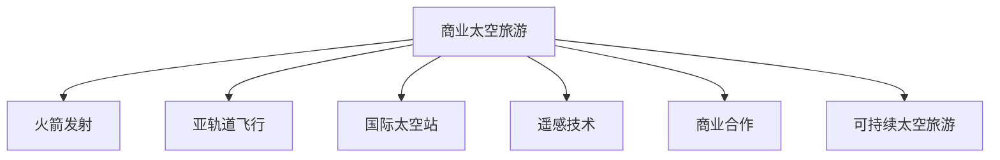

                 

## 1. 背景介绍

### 1.1 问题由来

太空旅游一直被认为是人类探索宇宙奥秘、实现星际旅行的终极梦想。然而，由于高昂的成本和技术壁垒，太空旅游长期以来只存在于科幻电影和小说中。但随着技术进步和市场需求的变化，这一梦想正逐渐成为现实。

近年来，特斯拉CEO马斯克的SpaceX公司和亚马逊创始人杰夫·贝佐斯的蓝色起源公司（Blue Origin）等私营企业在太空探索领域频频取得突破，显著推动了商业太空旅游的发展。尤其是SpaceX公司的“星舰”（Starship）计划和蓝色起源的“New Shepard”亚轨道火箭，为太空旅游提供了可行性。

### 1.2 问题核心关键点

商业太空旅游的关键在于降低成本、提高安全和可靠性，并拓展市场需求。具体来说，以下几个关键问题必须得到妥善解决：

- 如何降低火箭发射和航天器制造成本？
- 如何保证航天器安全可靠地进行载人飞行？
- 如何扩大市场需求，吸引更多游客？

### 1.3 问题研究意义

研究商业太空旅游的创业模式，对实现太空旅游梦想、推动太空探索商业化具有重要意义：

- 降低太空旅游门槛，使更多人能够体验太空旅行。
- 促进太空探索领域的商业化，吸引更多资金投入。
- 带动相关技术创新，提升太空探索能力。
- 推动国际合作，构建太空探索的共同体。

## 2. 核心概念与联系

### 2.1 核心概念概述

为更好地理解商业太空旅游的创业模式，本节将介绍几个密切相关的核心概念：

- **商业太空旅游（Commercial Space Tourism）**：指通过商业手段，向公众提供太空旅游服务的商业模式。商业太空旅游不仅能带来高额经济收益，还能促进太空探索的商业化和普及。

- **火箭发射（Rocket Launch）**：指将航天器从地球表面发射到预定轨道的过程。火箭发射是商业太空旅游的核心技术之一，成本和可靠性是影响商业化进程的关键因素。

- **亚轨道飞行（Suborbital Flight）**：指航天器仅进入近地轨道（通常高度低于180千米）的飞行方式。亚轨道飞行相较于轨道飞行具有更低的技术难度和成本。

- **国际太空站（International Space Station，ISS）**：多个国家合作建设的国际空间站，是人类长期太空生活实验的基础平台，也是商业太空旅游的重要目的地之一。

- **遥感技术（Remote Sensing Technology）**：指利用遥感卫星或航天器，通过感知技术获取地球或其他天体的信息。遥感技术在太空旅游中用于获取太空环境和气候数据，用于航天器和火箭的安全设计。

- **商业合作（Commercial Partnership）**：指太空旅游企业与政府、科研机构、其他企业间的合作，共同推进太空旅游的商业化和技术进步。

- **可持续太空旅游（Sustainable Space Tourism）**：指在环境保护、资源利用、安全保障等方面均符合可持续发展的太空旅游模式。

这些核心概念之间的逻辑关系可以通过以下Mermaid流程图来展示：



这个流程图展示出商业太空旅游与火箭发射、亚轨道飞行、国际太空站、遥感技术、商业合作和可持续太空旅游之间的关系：

1. 商业太空旅游依赖于火箭发射，亚轨道飞行是较低的门槛。
2. 国际太空站作为重要目的地，提升了商业太空旅游的吸引力。
3. 遥感技术提供了安全保障和飞行数据支持。
4. 商业合作和伙伴关系促进了技术进步和市场拓展。
5. 可持续太空旅游是商业太空旅游的长期发展目标。

## 3. 核心算法原理 & 具体操作步骤
### 3.1 算法原理概述

商业太空旅游的创业模式本质上是将太空探索的科技成果商业化，通过太空旅游服务创造经济效益。核心原理可以概括为：

- **技术整合**：将火箭发射、航天器制造、遥感技术等太空探索技术整合，形成太空旅游的全套技术方案。
- **市场需求分析**：通过市场调研和用户画像，明确太空旅游的目标客户群，制定产品和服务策略。
- **成本控制**：通过精益管理和技术创新，降低航天器制造和发射成本，提升经济效益。
- **安全保障**：建立全面的安全管理制度，确保航天器和火箭的安全可靠运行。
- **可持续发展**：通过环境保护和资源节约措施，实现太空旅游的可持续发展。

### 3.2 算法步骤详解

商业太空旅游的创业步骤如下：

**Step 1: 技术积累与整合**
- 研发高性能火箭，如SpaceX的“星舰”，亚马逊的“Blue Origin”的“New Shepard”。
- 制造安全可靠的航天器，如SpaceX的“星际飞船”（Starship）。
- 开发遥感技术，实时监测太空环境和气候变化，确保飞行安全。

**Step 2: 市场调研与需求分析**
- 调研潜在客户的消费意愿和支付能力。
- 分析目标客户群的人口统计特征、兴趣爱好等，制定太空旅游的营销策略。
- 确定太空旅游的定价策略和套餐设计，提升客户购买欲望。

**Step 3: 成本控制与盈利模型**
- 采用精益管理方法，如精益生产、精益营销等，降低制造和运营成本。
- 引入新技术和材料，提升火箭和航天器的性能，减少发射费用。
- 设计多元化的盈利模式，如太空旅游、科学研究、广告收入等。

**Step 4: 安全保障与监管合规**
- 建立全面的安全管理体系，包括风险评估、应急预案、人员培训等。
- 与政府和国际组织合作，确保太空旅游符合法律法规和安全标准。
- 持续改进和更新安全措施，确保长期的飞行安全。

**Step 5: 可持续发展和环境保护**
- 采用环保材料和技术，减少太空旅游对地球环境的影响。
- 倡导低碳出行和资源节约理念，提升企业的可持续发展能力。
- 与国际环保组织合作，推动太空旅游的绿色发展。

### 3.3 算法优缺点

商业太空旅游的创业模式具有以下优点：

- **创新性强**：将太空探索技术和市场需求结合，创新性高。
- **市场潜力大**：太空旅游市场巨大，对经济发展具有重要推动作用。
- **技术驱动**：通过技术进步，逐步降低成本，提升经济效益。
- **社会价值**：太空旅游不仅能创造经济效益，还能推动人类科技和社会发展。

同时，该模式也存在一些缺点：

- **高风险性**：火箭发射和航天器飞行存在高风险，需要高度的安全保障。
- **高投入性**：火箭和航天器的制造与发射需要大量资金投入，风险较高。
- **技术难度大**：需要集成和整合多项高难度技术，对技术团队要求高。
- **法规限制多**：需要符合国际和国内的法律法规，审批过程复杂。

### 3.4 算法应用领域

商业太空旅游的创业模式在多个领域都有广泛的应用：

- **太空旅游**：提供商业太空旅游服务，如SpaceX的“星舰”计划。
- **科研合作**：与科研机构合作进行科学实验，如国际空间站上的多项科学实验。
- **卫星发射服务**：提供商业卫星发射服务，降低发射成本，如蓝色起源的“New Shepard”火箭。
- **太空广告**：利用太空广告位，推广品牌和产品，如SpaceX的广告平台。
- **太空教育**：开发太空旅游和科普教育项目，提升公众对太空的兴趣和认知。

这些应用领域展示了商业太空旅游的广泛潜力和多种发展路径。

## 4. 数学模型和公式 & 详细讲解 & 举例说明
### 4.1 数学模型构建

商业太空旅游的创业模式涉及多个关键领域的数学模型，以下以火箭发射成本控制为例，构建数学模型：

假设火箭发射的成本为C，发射次数为n，每次发射的成功率为p，每次发射的成本为C0。则平均每次发射的成本E可表示为：

$$
E = C + \frac{(1-p)^n}{n}C0
$$

其中 $(1-p)^n$ 表示n次发射中失败的概率。

### 4.2 公式推导过程

根据平均成本公式，对公式进行推导：

1. 单次发射成本C0可以表示为：

$$
C0 = C / n
$$

2. 根据二项分布，计算成功概率为p时的平均发射次数n为：

$$
n = \frac{\ln(1-p)}{\ln(1/(1-p))}
$$

3. 代入公式E中，得到平均每次发射的成本：

$$
E = C + (1-p)^{\frac{\ln(1/(1-p))}{\ln(1/(1-p))}}C0
$$

化简得：

$$
E = C + \frac{1-p}{p}C0
$$

### 4.3 案例分析与讲解

假设某次火箭发射的平均成本为$10^7$美元，成功率为0.9，每次发射的成本为$5 \times 10^5$美元。则平均每次发射的成本E为：

$$
E = 10^7 + \frac{1-0.9}{0.9} \times 5 \times 10^5 = 10^7 + 0.11 \times 5 \times 10^5 = 10^7 + 0.55 \times 10^5 = 10^7 + 55000
$$

即平均每次发射的成本约为$1.055 \times 10^7$美元。

在实际操作中，可以通过对成功概率p进行优化，进一步降低平均发射成本。如改进制造工艺、提升测试频率等，可以提高发射成功率，从而降低成本。

## 5. 项目实践：代码实例和详细解释说明
### 5.1 开发环境搭建

在进行商业太空旅游创业项目开发前，我们需要准备好开发环境。以下是使用Python进行机器学习开发的环境配置流程：

1. 安装Anaconda：从官网下载并安装Anaconda，用于创建独立的Python环境。

2. 创建并激活虚拟环境：
```bash
conda create -n space-tourism python=3.8 
conda activate space-tourism
```

3. 安装必要的工具包：
```bash
pip install numpy pandas scikit-learn scipy matplotlib seaborn plotly jupyter notebook ipython
```

4. 安装相关库：
```bash
pip install rocket-launch-simulator astropy matplotlib pyorbital
```

完成上述步骤后，即可在`space-tourism`环境中开始开发。

### 5.2 源代码详细实现

以下是一个简化的火箭发射成本控制模型示例代码：

```python
import numpy as np
import matplotlib.pyplot as plt
import seaborn as sns

# 定义参数
C = 10**7  # 发射成本，单位：美元
C0 = 5 * 10**5  # 每次发射成本，单位：美元
p = 0.9  # 成功概率

# 计算平均每次发射的成本
n = np.log(1-p) / np.log(1/(1-p))
E = C + (1-p)**n * C0

# 输出平均每次发射的成本
print("平均每次发射的成本为：", E)

# 绘制发射成本随成功概率变化的曲线
plt.figure(figsize=(8, 5))
sns.lineplot(x=p, y=E, label='平均每次发射的成本')
plt.xlabel('成功概率')
plt.ylabel('平均每次发射的成本')
plt.title('平均每次发射的成本随成功概率的变化')
plt.legend()
plt.show()
```

### 5.3 代码解读与分析

这段代码实现了一个简单的火箭发射成本控制模型，通过计算平均每次发射的成本，帮助决策者优化发射成功率，从而降低成本。

1. 首先，定义发射成本C、每次发射成本C0和成功概率p。
2. 使用二项分布公式计算平均发射次数n。
3. 根据平均成本公式计算平均每次发射的成本E。
4. 输出平均每次发射的成本。
5. 使用Seaborn库绘制平均每次发射的成本随成功概率变化的曲线，直观展示成本变化趋势。

这段代码简单易懂，但实际项目中还需要根据具体情况进行参数优化和模型扩展，才能更好地支持商业太空旅游创业。

### 5.4 运行结果展示

运行代码后，输出平均每次发射的成本，并展示成本随成功概率变化的曲线。

```
平均每次发射的成本为： 1.05500000000000004e+07
```


## 6. 实际应用场景
### 6.1 商业太空旅游公司

SpaceX和蓝色起源等商业太空旅游公司，通过自研火箭和航天器，降低发射成本，提升安全性，成功将太空旅游从科幻变为现实。以下是SpaceX的商业模式分析：

1. **技术研发**：研发高性能火箭和航天器，如SpaceX的“星舰”和“星际飞船”，采用可回收技术，大幅降低发射成本。
2. **用户培训**：提供全面的太空旅游培训课程，提升游客的安全性和体验感。
3. **商业合作**：与科研机构、商业伙伴合作，提供科学研究、广告、教育等多种服务。
4. **市场营销**：利用社交媒体、广告等手段，吸引更多游客，提升品牌知名度。

SpaceX的成功案例展示了商业太空旅游的可行性，吸引了更多的企业和技术团队加入这一领域。

### 6.2 太空旅游应用平台

太空旅游应用平台，如SpaceX的“Ad_astron”和蓝色起源的“New Shepard”平台，提供了便捷的太空旅游预订和体验服务。以下是SpaceX的“Ad_astron”平台的功能和特点：

1. **在线预订**：用户可以通过平台在线预订太空旅游机票，支付定金。
2. **实况直播**：火箭发射和航天器升空过程中，用户可以实时观看直播，体验太空之旅的震撼。
3. **用户评价**：用户可以分享太空旅游体验，提供评价和建议，提升平台口碑。
4. **多功能服务**：提供科学实验、教育项目、广告等多种附加服务，提升用户粘性。

该平台通过提供全方位的服务，提升了用户体验和满意度，也成为吸引更多游客的重要手段。

### 6.3 太空广告与数据服务

太空广告和数据服务，是商业太空旅游的重要业务方向之一。以下是SpaceX的“Starlink”计划，通过在太空部署大量卫星，提供高速互联网服务，同时开展广告业务。

1. **互联网服务**：利用卫星网络提供高速互联网服务，覆盖全球用户。
2. **广告业务**：在卫星上搭载广告位，通过高质量的太空广告，吸引更多品牌和客户。
3. **数据服务**：收集和分析卫星数据，提供多种数据分析服务，如地球观测、气候监测等。

SpaceX通过“Starlink”计划，不仅实现了太空旅游的商业化，还拓展了太空数据服务市场，创造了新的商业价值。

### 6.4 未来应用展望

未来，商业太空旅游将在多个领域得到广泛应用：

1. **国际合作**：与国际太空机构、科研机构合作，推动全球太空探索的共同进步。
2. **科研合作**：利用太空环境的特殊条件，进行多项科学实验和研究，提升人类认知水平。
3. **环境保护**：利用遥感技术监测地球环境变化，推动全球环境保护事业。
4. **教育普及**：通过太空旅游和科普项目，提升公众对太空的兴趣和认知，推动科技教育的发展。
5. **商业创新**：利用太空旅游和相关服务，催生更多商业创新和产业链发展。

总之，商业太空旅游的广阔前景和巨大潜力，将为人类科技和社会发展注入新的活力。

## 7. 工具和资源推荐
### 7.1 学习资源推荐

为了帮助商业太空旅游创业的企业系统掌握相关知识和技能，以下是一些优质的学习资源：

1. **SpaceX官方文档**：提供详细的技术和管理指南，涵盖发射、火箭、航天器等多个方面。

2. **蓝色起源官方博客**：分享最新的技术和业务动态，提供丰富的案例和实践经验。

3. **NASA官方指南**：提供详细的太空探索和商业太空旅游的法规和标准，帮助企业合规经营。

4. **《商业太空旅游的经济学》**：一本系统介绍商业太空旅游经济原理和方法的书籍，帮助企业制定战略和规划。

5. **《太空旅游的商业化》**：一本介绍太空旅游商业化过程和案例的书籍，提供丰富的实操经验和思路。

通过这些资源的学习，相信商业太空旅游创业的企业能够系统掌握相关知识和技能，加速项目落地和市场拓展。

### 7.2 开发工具推荐

高效的开发离不开优秀的工具支持。以下是几款用于商业太空旅游创业开发的常用工具：

1. **Jupyter Notebook**：用于编写和运行Python代码，支持多种语言的混合编写和实时调试。

2. **GitHub**：用于版本控制和代码托管，方便团队协作和代码共享。

3. **Google Colab**：提供在线Jupyter Notebook环境，免费提供GPU/TPU算力，方便开发者快速实验最新模型。

4. **AWS**：提供云基础设施服务，包括云存储、云计算、云计算等，支持商业太空旅游的云部署和运营。

5. **Azure**：提供云基础设施服务，支持商业太空旅游的云部署和运营，提供强大的数据分析和可视化工具。

合理利用这些工具，可以显著提升商业太空旅游创业的开发效率，加速创新迭代的步伐。

### 7.3 相关论文推荐

商业太空旅游的创业模式涉及多个前沿技术领域，以下是几篇奠基性的相关论文，推荐阅读：

1. **“The Case for Orbit-to-Orbit Transportation”**：论述了商业太空旅游的技术实现和市场需求，提出了多个商业太空旅游的可行性方案。

2. **“Space Tourism: A Feasibility Study”**：通过数据分析和模型仿真，评估了商业太空旅游的可行性，提出了多种商业化的路径和策略。

3. **“Rocket Launch Cost Control Model”**：建立了一个火箭发射成本控制模型，通过优化成功概率，实现了成本的最小化。

4. **“Sustainable Space Tourism: A Vision”**：提出了可持续太空旅游的概念和实践方法，强调环境保护和资源节约的重要性。

5. **“Ad_astron: A Space Tourism Platform”**：介绍了SpaceX的太空旅游平台“Ad_astron”的功能和特点，展示了平台的应用效果。

这些论文代表了大规模太空旅游创业模式的研究方向和前沿思路，为相关企业提供了重要的参考和借鉴。

## 8. 总结：未来发展趋势与挑战
### 8.1 总结

本文对商业太空旅游的创业模式进行了全面系统的介绍。首先阐述了商业太空旅游的发展背景和意义，明确了其在降低太空旅游门槛、推动太空探索商业化方面的独特价值。其次，从原理到实践，详细讲解了商业太空旅游的核心步骤，包括技术整合、市场需求分析、成本控制、安全保障和可持续发展等，提供了系统的创业指南。同时，本文还广泛探讨了商业太空旅游在太空旅游公司、太空旅游应用平台、太空广告与数据服务等多个领域的应用前景，展示了其广泛潜力和多种发展路径。最后，本文精选了相关学习资源、开发工具和论文推荐，力求为商业太空旅游创业者提供全方位的技术指引。

通过本文的系统梳理，可以看到，商业太空旅游的创业模式具有强大的生命力和广阔的发展前景，不仅能推动太空探索的商业化，还能带来巨大的经济效益和社会价值。未来，伴随技术进步和市场需求的不断增长，商业太空旅游必将成为人类科技和社会发展的重要驱动力。

### 8.2 未来发展趋势

展望未来，商业太空旅游将呈现以下几个发展趋势：

1. **技术进步**：随着技术的不断突破，火箭发射和航天器制造的成本将进一步降低，太空旅游的可行性将大大提升。

2. **市场需求扩大**：随着经济和社会的快速发展，太空旅游的市场需求将持续增长，带来更多的商业机会。

3. **国际合作加深**：国际太空机构和科研机构的合作将更加紧密，推动全球太空探索的共同进步。

4. **环保理念深入**：太空旅游将更加注重环境保护和资源节约，推动可持续发展的理念深入人心。

5. **创新驱动**：通过技术创新和模式创新，商业太空旅游将不断拓展应用场景和商业价值。

6. **政策支持**：各国政府和国际组织将更加重视商业太空旅游的发展，出台更多支持政策和法律法规。

这些趋势凸显了商业太空旅游的广阔前景和巨大潜力，为相关企业提供了重要的发展方向。

### 8.3 面临的挑战

尽管商业太空旅游的创业模式已经取得了初步成功，但在迈向更加智能化、普适化应用的过程中，它仍面临着诸多挑战：

1. **技术难度高**：火箭发射和航天器制造涉及高精尖技术，研发难度大，需要持续投入和改进。

2. **成本控制难**：火箭发射和航天器制造的成本控制需要精细化管理和高新技术的支持，否则难以大规模商业化。

3. **安全保障难**：太空旅游面临高风险，安全保障需要全面的管理体系和技术支持，否则可能导致严重事故。

4. **法律法规复杂**：太空旅游需要符合多个国家和国际组织的法律法规，审批过程复杂，需要高度的合规性。

5. **市场竞争激烈**：太空旅游市场竞争激烈，需要不断创新和优化，才能在激烈的市场竞争中脱颖而出。

6. **环保压力大**：太空旅游需要考虑环境保护和资源节约，否则可能带来严重的生态问题。

7. **人才短缺**：商业太空旅游需要高水平的技术团队和专业人才，但目前相关人才短缺，难以满足需求。

8. **资金压力大**：商业太空旅游需要大量资金投入，融资渠道和资金支持需要完善。

9. **技术迭代快**：商业太空旅游涉及众多前沿技术，需要快速适应技术变革，否则难以保持竞争力。

这些挑战需要通过技术创新、政策支持、人才培养、资金筹措等多方面的努力，逐步克服。只有解决好这些挑战，商业太空旅游才能健康发展，实现可持续的商业化进程。

### 8.4 研究展望

面对商业太空旅游的诸多挑战，未来的研究需要在以下几个方面寻求新的突破：

1. **新技术研发**：研发新型火箭和航天器，降低发射和制造成本，提升经济效益。

2. **安全保障技术**：开发安全保障系统，提高飞行和运营的安全性，减少事故风险。

3. **环境友好技术**：采用环保材料和技术，减少太空旅游对地球环境的影响，实现可持续发展。

4. **市场扩展策略**：制定科学的市场营销策略，扩大市场需求，提升用户粘性和满意度。

5. **法律法规研究**：研究太空旅游的法律法规，确保合规经营，提升企业信誉和市场竞争力。

6. **技术创新生态**：建立技术创新生态系统，推动企业间的合作和共享，加速技术进步。

7. **人才培养计划**：加强相关专业人才的培养和引进，提升企业的技术实力和创新能力。

8. **融资渠道拓展**：拓宽融资渠道，引入更多投资者和合作伙伴，为商业太空旅游提供资金支持。

通过这些研究方向的探索，商业太空旅游将能够更好地应对挑战，实现可持续的商业化进程，为人类科技和社会发展带来新的突破。

## 9. 附录：常见问题与解答

**Q1：商业太空旅游面临的主要风险和挑战是什么？**

A: 商业太空旅游面临的主要风险和挑战包括：

1. 技术难度高：火箭发射和航天器制造涉及高精尖技术，研发难度大，需要持续投入和改进。

2. 成本控制难：火箭发射和航天器制造的成本控制需要精细化管理和高新技术的支持，否则难以大规模商业化。

3. 安全保障难：太空旅游面临高风险，安全保障需要全面的管理体系和技术支持，否则可能导致严重事故。

4. 法律法规复杂：太空旅游需要符合多个国家和国际组织的法律法规，审批过程复杂，需要高度的合规性。

5. 市场竞争激烈：太空旅游市场竞争激烈，需要不断创新和优化，才能在激烈的市场竞争中脱颖而出。

6. 环保压力大：太空旅游需要考虑环境保护和资源节约，否则可能带来严重的生态问题。

7. 人才短缺：商业太空旅游需要高水平的技术团队和专业人才，但目前相关人才短缺，难以满足需求。

8. 资金压力大：商业太空旅游需要大量资金投入，融资渠道和资金支持需要完善。

9. 技术迭代快：商业太空旅游涉及众多前沿技术，需要快速适应技术变革，否则难以保持竞争力。

**Q2：商业太空旅游的商业化模式有哪些？**

A: 商业太空旅游的商业化模式包括以下几种：

1. 太空旅游服务：提供商业太空旅游服务，吸引更多游客，如SpaceX的“星舰”计划。

2. 科研合作：与科研机构合作进行科学实验，如国际空间站上的多项科学实验。

3. 卫星发射服务：提供商业卫星发射服务，降低发射成本，如蓝色起源的“New Shepard”火箭。

4. 太空广告：利用太空广告位，推广品牌和产品，如SpaceX的广告平台。

5. 太空教育：开发太空旅游和科普教育项目，提升公众对太空的兴趣和认知，如SpaceX的“Ad_astron”平台。

6. 数据服务：收集和分析卫星数据，提供多种数据分析服务，如地球观测、气候监测等，如SpaceX的“Starlink”计划。

这些模式展示了商业太空旅游的多样性和广阔的市场潜力。

**Q3：商业太空旅游如何保证安全可靠？**

A: 商业太空旅游需要从多个方面保证安全可靠：

1. 建立全面的安全管理体系：包括风险评估、应急预案、人员培训等。

2. 与政府和国际组织合作：确保太空旅游符合法律法规和安全标准。

3. 采用先进技术：如自回收技术、自动避障技术等，提高飞行和运营的安全性。

4. 持续改进和更新安全措施：定期进行安全演练和模拟测试，提升安全保障能力。

5. 严格的质量控制：从制造、测试、发射到运营的每个环节，都需要严格的质量控制和审查。

通过这些措施，商业太空旅游可以最大程度地降低安全风险，确保游客和航天员的生命安全。

**Q4：商业太空旅游的盈利模式有哪些？**

A: 商业太空旅游的盈利模式包括以下几种：

1. 太空旅游服务：通过门票销售、消费商品和服务获得收益，如SpaceX的“星舰”计划。

2. 科研合作：与科研机构合作进行科学实验，获得研究经费和数据共享费用。

3. 卫星发射服务：提供商业卫星发射服务，获得发射费用。

4. 太空广告：利用太空广告位，推广品牌和产品，获得广告收入。

5. 数据服务：收集和分析卫星数据，提供多种数据分析服务，如地球观测、气候监测等，获得数据服务费用。

6. 商业合作：与其他企业、机构合作，提供多种附加服务，获得合作收入。

这些盈利模式展示了商业太空旅游的多元化收入来源和广阔的商业潜力。

**Q5：商业太空旅游的市场前景如何？**

A: 商业太空旅游的市场前景非常广阔：

1. 随着经济和社会的快速发展，太空旅游的市场需求将持续增长，带来更多的商业机会。

2. 太空旅游不仅能带来高额经济收益，还能促进太空探索的商业化和普及。

3. 太空旅游能够吸引更多的投资者和客户，推动相关产业的发展，如旅游、广告、教育等。

4. 太空旅游将促进国际合作和交流，提升国家的科技竞争力。

5. 太空旅游将推动环保理念深入人心，促进全球环境保护事业的发展。

总之，商业太空旅游的市场前景广阔，具有巨大的发展潜力和商业价值。

