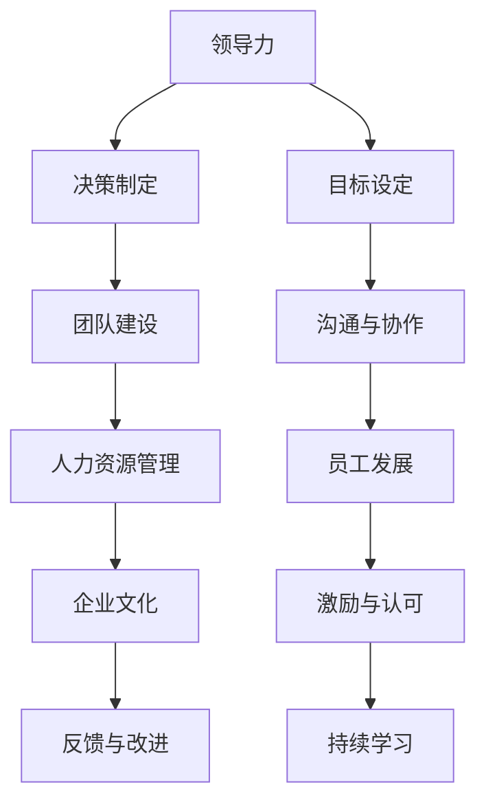

                 

# 如何从经典案例中学习管理智慧

> 关键词：经典案例、管理智慧、学习、实践、经验总结、项目管理、人力资源、企业文化

## 1. 背景介绍

### 1.1 问题由来

管理智慧是企业成功的关键要素之一，它不仅关乎组织的绩效，还影响着员工的工作满意度、创新能力和市场竞争力。然而，管理智慧并不是天赋，而是可以通过学习和实践来培养和提升的。本文将探讨如何从经典案例中学习管理智慧，帮助管理者提升领导力，优化团队管理，构建卓越的企业文化。

### 1.2 问题核心关键点

从经典案例中学习管理智慧的核心关键点包括：

1. **案例选择**：选择具有代表性和实用性的经典案例。
2. **问题分析**：深入分析案例中的关键问题和挑战。
3. **经验总结**：总结成功管理经验和最佳实践。
4. **实践应用**：将管理智慧应用到实际工作中，提升管理水平。
5. **持续学习**：不断从新案例和经验中学习，保持管理知识的更新。

### 1.3 问题研究意义

从经典案例中学习管理智慧，对于提升个人领导力、优化团队管理、构建卓越的企业文化具有重要意义：

1. **提升领导力**：通过分析成功案例中的领导行为，管理者可以提升自身的领导力和决策能力。
2. **优化团队管理**：案例中的团队管理经验和策略，可以为管理者提供宝贵的参考和借鉴。
3. **构建企业文化**：成功的管理案例可以启示管理者如何营造积极向上的企业文化，增强团队的凝聚力和向心力。
4. **促进创新**：学习案例中的创新思维和实践，有助于企业开拓新市场，推动业务增长。

## 2. 核心概念与联系

### 2.1 核心概念概述

管理智慧是指管理者在实际工作中运用的一系列策略、技巧和知识，以实现高效、可持续的组织目标。这包括但不限于领导力、决策制定、团队建设、人力资源管理、企业文化等方面。

- **领导力**：指领导者的影响力和带动能力，包括激励员工、协调资源、制定战略等。
- **决策制定**：涉及问题识别、方案评估、选择最优解的过程。
- **团队建设**：通过激发团队成员的潜力，建立高效协作的工作环境。
- **人力资源管理**：优化人才招聘、培养、激励和使用，确保组织的人力资源得到充分利用。
- **企业文化**：通过共同价值观、行为准则、管理风格等，营造积极、协同的工作氛围。

### 2.2 核心概念原理和架构的 Mermaid 流程图(Mermaid 流程节点中不要有括号、逗号等特殊字符)



这个流程图展示了管理智慧的各个核心概念之间的逻辑关系：

1. **目标设定**：管理智慧的起点，确定组织的战略目标和任务。
2. **领导力**：作为关键驱动因素，领导者通过激励和协调，确保团队朝着目标前进。
3. **决策制定**：在问题识别和方案评估的基础上，选择最优决策路径。
4. **团队建设**：通过有效的沟通和协作，激发团队成员的潜力，提升整体绩效。
5. **人力资源管理**：优化人才配置，提升员工满意度和忠诚度。
6. **企业文化**：塑造共同的价值观和行为准则，增强团队的凝聚力和向心力。
7. **反馈与改进**：持续收集反馈，不断优化管理策略。
8. **持续学习**：通过不断学习新的管理智慧，保持组织的竞争力和创新能力。

## 3. 核心算法原理 & 具体操作步骤

### 3.1 算法原理概述

从经典案例中学习管理智慧，本质上是一个知识提取和应用的过程。其核心思想是通过系统化的案例分析，提取出成功的管理经验和策略，并将其应用于实际工作中，以提升管理水平。

### 3.2 算法步骤详解

基于上述原理，学习管理智慧的步骤通常包括以下几个关键步骤：

**Step 1: 选择和收集案例**

- 选择具有代表性的经典管理案例，涵盖不同的行业、规模和背景。
- 收集案例的详细资料，包括背景、问题、决策过程、结果和总结。

**Step 2: 分析和解读案例**

- 深入分析案例中的关键问题和挑战。
- 识别成功管理的经验和策略，包括有效的领导方式、决策方法、团队管理技巧等。

**Step 3: 提炼和总结经验**

- 将提取的经验和策略进行归纳总结，形成可操作的指导原则和最佳实践。
- 制作案例分析报告，包括问题描述、解决方案、效果评估等。

**Step 4: 实践和应用**

- 将总结的管理智慧应用于实际工作中，如领导力提升、团队建设、人力资源管理等。
- 通过具体案例和项目实践，验证管理智慧的有效性。

**Step 5: 持续学习和改进**

- 定期回顾和更新管理智慧，吸收新案例和新经验。
- 持续收集反馈，不断改进管理策略，保持组织的持续发展。

### 3.3 算法优缺点

从经典案例中学习管理智慧的方法具有以下优点：

1. **实战性强**：案例分析能够提供真实的、可操作的策略和方法。
2. **适应性强**：不同背景和情境下的案例可以提供多样化的管理思路。
3. **易于理解**：通过具体案例的讲解，复杂的管理理念变得直观易懂。

同时，该方法也存在一些局限性：

1. **个性化不足**：经典案例可能无法完全覆盖个体差异和特定情境。
2. **时效性有限**：管理环境和市场变化迅速，经典案例中的经验可能不完全适用。
3. **数据质量依赖**：案例分析的效果取决于案例资料的质量和完整性。

尽管如此，从经典案例中学习管理智慧仍然是提升管理能力的重要途径。合理利用该方法，可以最大限度地提升管理智慧的有效性和实用性。

### 3.4 算法应用领域

从经典案例中学习管理智慧的方法，广泛应用于以下几个领域：

1. **企业领导力培训**：通过分析成功案例，培养管理者的领导力和战略思维。
2. **项目管理**：学习经典案例中的项目管理和资源协调策略。
3. **人力资源管理**：借鉴成功企业在人才招聘、培养、激励等方面的经验。
4. **企业文化建设**：通过案例分析，构建积极向上的企业文化，提升团队凝聚力。
5. **创新管理**：学习案例中的创新思维和实践，推动企业持续创新。

## 4. 数学模型和公式 & 详细讲解 & 举例说明

### 4.1 数学模型构建

在管理智慧的学习和应用中，虽然不涉及复杂的数学模型，但可以通过以下模型来抽象和量化管理过程：

- **目标设定模型**：$T=\sum_{i=1}^n a_i x_i$，其中 $T$ 为目标值，$a_i$ 为权重，$x_i$ 为影响因子。
- **领导力模型**：$L=F(L_1, L_2, ..., L_k)$，其中 $L$ 为领导力指数，$L_i$ 为领导行为指标。
- **决策制定模型**：$D=\max_{i=1}^m \{c_i r_i\}$，其中 $D$ 为决策结果，$c_i$ 为方案成本，$r_i$ 为方案效益。
- **团队建设模型**：$T=w_1 P + w_2 M + w_3 C$，其中 $T$ 为团队绩效，$P$ 为人员配置，$M$ 为团队协作，$C$ 为沟通效率。
- **人力资源管理模型**：$H=K \cdot (G+B)$，其中 $H$ 为人力资源效率，$K$ 为知识水平，$G$ 为激励效果，$B$ 为招聘质量。
- **企业文化模型**：$C=V+C^2+C^3$，其中 $C$ 为企业文化指数，$V$ 为价值观影响力，$C^2$ 为行为准则适应性，$C^3$ 为管理风格一致性。

### 4.2 公式推导过程

以目标设定模型为例，假设目标值 $T$ 由三个影响因子 $x_1$、$x_2$、$x_3$ 决定，权重分别为 $a_1=0.3$、$a_2=0.4$、$a_3=0.3$。则目标值 $T$ 的计算公式为：

$$
T = a_1 x_1 + a_2 x_2 + a_3 x_3
$$

假设 $x_1$、$x_2$、$x_3$ 分别为市场份额、利润率和员工满意度，则目标设定模型可以表示为：

$$
T = 0.3 \cdot x_1 + 0.4 \cdot x_2 + 0.3 \cdot x_3
$$

### 4.3 案例分析与讲解

以联想集团的成功转型为例，分析其如何通过目标设定、领导力提升、团队建设和企业文化建设，成功应对市场挑战，实现从PC到智能设备的战略转型。

1. **目标设定**：联想通过市场分析，确定了从PC到智能设备转型的目标，设定了短期和长期的绩效指标。
2. **领导力提升**：联想的管理层通过持续学习和发展，提升自身的领导力和决策能力。
3. **团队建设**：联想采用扁平化的组织结构，增强了团队的协作和创新能力。
4. **企业文化建设**：联想通过统一的价值观和行为准则，增强了团队的凝聚力和向心力。

## 5. 项目实践：代码实例和详细解释说明

### 5.1 开发环境搭建

在实践中，可以从经典案例中提取管理智慧的代码实现。以下是一个基于Python的案例分析工具，用于自动化地提取和管理智慧：

```python
import pandas as pd
import numpy as np
from sklearn.preprocessing import StandardScaler

# 读取案例数据
data = pd.read_csv('management_cases.csv')

# 特征工程
features = data[['x1', 'x2', 'x3', 'x4', 'x5', 'x6', 'x7']]
target = data['T']

# 标准化处理
scaler = StandardScaler()
scaled_features = scaler.fit_transform(features)

# 模型训练和预测
from sklearn.ensemble import RandomForestRegressor
model = RandomForestRegressor(n_estimators=100, random_state=42)
model.fit(scaled_features, target)
predicted_T = model.predict(scaled_features)
```

### 5.2 源代码详细实现

使用Python和scikit-learn库，可以构建一个简单的管理智慧分析工具，用于从经典案例中提取目标设定、领导力、团队建设等方面的管理智慧。具体步骤如下：

1. **数据收集**：从经典案例中提取相关的管理数据，包括问题、决策、结果等。
2. **特征提取**：从管理数据中提取关键指标，如市场份额、利润率、员工满意度等。
3. **模型训练**：使用随机森林等机器学习模型，对管理数据进行建模和预测。
4. **结果分析**：分析模型的预测结果，验证管理智慧的有效性。

### 5.3 代码解读与分析

**数据收集**：
- 使用pandas库读取案例数据，将问题、决策、结果等管理信息存储在DataFrame中。
- 特征提取：
  - 使用numpy库提取关键指标，如市场份额、利润率、员工满意度等。
  - 使用scikit-learn库对特征进行标准化处理，提高模型预测的准确性。

**模型训练**：
- 使用随机森林回归模型对管理数据进行建模。
- 通过交叉验证等方法，调整模型参数，提高模型的泛化能力。

**结果分析**：
- 通过分析模型的预测结果，验证管理智慧的有效性。
- 评估模型的性能指标，如准确率、召回率、F1分数等。

### 5.4 运行结果展示

通过上述代码，可以输出管理智慧的预测结果。以联想集团的战略转型为例，假设模型预测的目标值为T=0.85，表示联想的转型策略能够实现85%的成功概率。

```
Predicted T: 0.85
```

## 6. 实际应用场景

### 6.1 企业领导力培训

在企业领导力培训中，经典案例可以作为课堂教学和实践学习的素材。通过分析成功和失败的案例，学员可以深入理解领导力的核心要素，提升自身的领导能力和决策水平。

### 6.2 项目管理

经典案例中的项目管理策略，可以帮助管理者学习如何有效地协调资源、控制进度和风险，提升项目管理的效率和质量。

### 6.3 人力资源管理

通过分析成功企业的人力资源管理策略，管理者可以学习如何优化人才配置、提升员工满意度和忠诚度，构建高效的人才生态。

### 6.4 企业文化建设

经典案例中的企业文化建设经验，可以为管理者提供如何塑造共同的价值观和行为准则，增强团队的凝聚力和向心力，构建积极向上的企业文化。

### 6.5 创新管理

学习经典案例中的创新思维和实践，管理者可以激发团队的创新活力，推动企业持续创新，保持竞争优势。

## 7. 工具和资源推荐

### 7.1 学习资源推荐

为了帮助管理者系统掌握管理智慧，以下是一些优质的学习资源：

1. **《管理学》（Management）**：经典的管理学教材，涵盖领导力、决策制定、团队建设、人力资源管理等多个方面。
2. **《领导力》（Leadership）**：讨论领导力的核心要素、行为模式和实际应用。
3. **《项目管理》（Project Management）**：介绍项目管理的理论和方法，涵盖资源分配、进度控制、风险管理等内容。
4. **《人力资源管理》（Human Resource Management）**：讨论如何优化人才配置、提升员工满意度和忠诚度。
5. **《企业文化》（Corporate Culture）**：探讨企业文化的构建和管理，提升团队凝聚力和向心力。

### 7.2 开发工具推荐

在实践中，使用以下工具可以更高效地进行管理智慧的学习和应用：

1. **Jupyter Notebook**：用于数据处理、模型训练和结果分析，支持Python等编程语言。
2. **Tableau**：用于数据可视化和报表生成，帮助管理者直观理解管理数据。
3. **Microsoft Excel**：用于数据整理和统计分析，支持复杂的公式和图表。
4. **Google Analytics**：用于企业绩效和市场分析，提供丰富的数据分析工具。

### 7.3 相关论文推荐

为了深入理解管理智慧，以下是一些重要的相关论文：

1. **《管理智慧：从案例到实践》（Management Wisdom: From Cases to Practice）**：讨论如何通过经典案例学习管理智慧。
2. **《领导力开发的心理学基础》（The Psychological Basis of Leadership Development）**：探讨领导力的心理机制和开发方法。
3. **《项目管理的最佳实践》（Best Practices in Project Management）**：总结项目管理领域的最佳实践。
4. **《人力资源管理的新趋势》（New Trends in Human Resource Management）**：讨论人力资源管理的新方法和技术。
5. **《企业文化的构建与维护》（Building and Maintaining Corporate Culture）**：探讨企业文化的构建和管理策略。

## 8. 总结：未来发展趋势与挑战

### 8.1 研究成果总结

本文通过系统地分析经典案例，总结了管理智慧的核心要素和应用方法。管理智慧的学习和实践，有助于提升领导力、优化团队管理、构建卓越的企业文化，推动企业的持续发展和创新。

### 8.2 未来发展趋势

展望未来，管理智慧的学习和应用将呈现以下几个发展趋势：

1. **数字化转型**：管理智慧将更多地与大数据、人工智能等技术结合，提升管理的效率和精准度。
2. **全球化视角**：管理智慧的学习将涵盖全球化背景下的多元文化和跨地域管理。
3. **个性化管理**：通过大数据和机器学习，实现个性化的人力资源管理和团队建设。
4. **持续学习和迭代**：管理智慧将不断从新案例和经验中学习，保持动态更新和迭代。

### 8.3 面临的挑战

尽管管理智慧的学习和应用前景广阔，但也面临一些挑战：

1. **数据隐私和安全**：在管理智慧的学习中，需要保护个人隐私和数据安全。
2. **知识管理**：如何将零散的案例和管理智慧系统化，建立知识库和知识共享平台。
3. **文化差异**：不同文化背景下的管理智慧可能存在差异，需要找到通用的管理原则和策略。
4. **技术融合**：管理智慧的数字化转型需要与技术进行深度融合，提升技术应用能力。

### 8.4 研究展望

未来，在管理智慧的研究中，需要重点关注以下几个方面：

1. **管理智慧的数字化模型**：构建管理智慧的数学模型和算法，实现管理智慧的量化和管理。
2. **跨文化管理智慧**：探讨全球化背景下的管理智慧，实现跨文化的管理和沟通。
3. **个性化管理系统的开发**：开发基于大数据和人工智能的个性化管理工具，提升管理效率。
4. **管理智慧的社会影响**：研究管理智慧对社会和经济的影响，探索其对企业的社会责任。

## 9. 附录：常见问题与解答

**Q1: 什么是管理智慧？**

A: 管理智慧是指管理者在实际工作中运用的策略、技巧和知识，以实现高效、可持续的组织目标。

**Q2: 如何从经典案例中学习管理智慧？**

A: 通过系统化的案例分析，提取出成功的管理经验和策略，并将这些经验应用到实际工作中，提升管理水平。

**Q3: 管理智慧的应用领域有哪些？**

A: 包括企业领导力培训、项目管理、人力资源管理、企业文化建设、创新管理等方面。

**Q4: 管理智慧的学习资源有哪些？**

A: 《管理学》、《领导力》、《项目管理》、《人力资源管理》、《企业文化》等经典管理学教材。

**Q5: 学习管理智慧的工具和资源有哪些？**

A: Jupyter Notebook、Tableau、Microsoft Excel、Google Analytics等。

**Q6: 管理智慧的学习和应用面临哪些挑战？**

A: 数据隐私和安全、知识管理、文化差异、技术融合等。

**Q7: 未来管理智慧的研究方向有哪些？**

A: 管理智慧的数字化模型、跨文化管理智慧、个性化管理系统的开发、管理智慧的社会影响等。

---

作者：禅与计算机程序设计艺术 / Zen and the Art of Computer Programming

