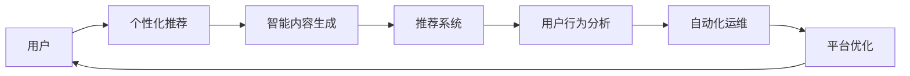

                 

# 如何利用AI技术提升知识付费效率

## 1. 背景介绍

在数字经济的浪潮下，知识付费逐渐成为获取优质内容的重要途径。据统计，全球知识付费市场规模已达数百亿美元，用户对知识内容的需求日益增长。然而，传统知识付费平台仍面临诸多挑战，如内容同质化严重、个性化推荐不足、用户体验不佳等。在此背景下，人工智能技术逐渐成为知识付费平台提升服务效率的关键手段。本文将探讨如何利用AI技术，从内容生成、用户推荐、个性化服务等多个维度提升知识付费平台的效率。

## 2. 核心概念与联系

### 2.1 核心概念概述

为更好地理解AI技术在知识付费中的应用，本节将介绍几个密切相关的核心概念：

- 知识付费(Knowledge Pay)：指消费者通过付费获取高质量知识内容的服务模式。常见的平台如得到、喜马拉雅、网易云课堂等，提供了众多课程、音频、电子书等付费内容。

- 推荐系统(Recommender System)：通过算法分析用户兴趣和行为，为用户推荐最相关、最感兴趣的内容。推荐系统是知识付费平台的核心竞争力之一。

- 个性化推荐(Personalized Recommendation)：针对用户个体，提供定制化的推荐服务，提升用户体验和内容满意度。

- 智能内容生成(Content Generation)：利用AI技术自动生成、优化内容，提高内容创作的效率和质量。

- 用户行为分析(Usage Analysis)：通过分析用户的行为数据，洞察用户需求和兴趣，指导推荐系统的优化和内容优化。

- 自动化运维(Automated Operations)：利用AI技术实现知识付费平台的自动部署、监控、优化，提升运营效率。

这些核心概念共同构成了AI在知识付费应用的基本框架，使得AI技术能够深入影响知识付费的各个环节。

### 2.2 核心概念原理和架构的 Mermaid 流程图(Mermaid 流程节点中不要有括号、逗号等特殊字符)



这个流程图展示了我前面提到的各个核心概念之间的逻辑关系：

1. 用户(A)首先进入个性化推荐(B)系统，获取推荐内容。
2. 推荐系统(D)依据智能内容生成(C)模块生成的优质内容，结合用户行为分析(E)模块分析的用户行为数据，为用户推荐最相关的内容。
3. 用户根据推荐内容进行消费，平台通过用户行为分析模块(E)收集数据，进一步优化推荐系统(D)和内容生成模块(C)。
4. 自动化运维(F)模块实时监控平台性能，及时优化算法，提升服务效率。

## 3. 核心算法原理 & 具体操作步骤

### 3.1 算法原理概述

基于AI技术提升知识付费效率的核心在于推荐系统。推荐系统通过分析用户行为和兴趣，为用户推荐最相关的内容。推荐算法可以分为基于协同过滤(CF)、基于内容的推荐(CB)、混合推荐等多种类型。

在知识付费场景下，推荐系统需要处理大量的用户行为数据，如阅读时长、收藏数、评论等，并从中提取用户兴趣特征。同时，需要与海量的课程、音频、电子书等知识内容进行匹配，生成个性化推荐结果。

### 3.2 算法步骤详解

以下是基于协同过滤的推荐系统的工作流程：

1. 数据预处理：收集用户行为数据，如阅读时长、收藏数、评论等，并进行预处理，去除噪声数据。

2. 用户画像构建：使用协同过滤算法，分析用户的历史行为，提取用户兴趣特征，构建用户画像。

3. 内容画像构建：对知识内容进行特征提取，如标签、关键词、类别等，构建内容画像。

4. 相似度计算：通过余弦相似度、皮尔逊相关系数等算法，计算用户画像和内容画像之间的相似度。

5. 推荐排序：根据相似度得分，对知识内容进行排序，选择用户最感兴趣的内容进行推荐。

### 3.3 算法优缺点

基于协同过滤的推荐算法具有以下优点：
1. 能够处理大规模数据，实时生成个性化推荐。
2. 算法原理简单，易于理解和实现。
3. 推荐结果稳定，对用户兴趣的预测准确度高。

同时，该算法也存在一定的局限性：
1. 新用户或少量交互用户无法提供足够的历史行为数据，无法进行准确的推荐。
2. 对长尾数据的推荐效果不佳，容易忽略用户对冷门课程的兴趣。
3. 对内容的关联性分析不够深入，推荐结果缺乏多样性。

### 3.4 算法应用领域

基于协同过滤的推荐系统广泛应用于知识付费平台，如喜马拉雅、得到、网易云课堂等。通过推荐系统，用户能够获得更个性化、更精准的知识推荐，提升平台的用户黏性和内容消费量。

## 4. 数学模型和公式 & 详细讲解 & 举例说明

### 4.1 数学模型构建

假设用户集合为 $U$，内容集合为 $I$，用户-内容评分矩阵为 $R \in \mathbb{R}^{N\times M}$，其中 $N$ 表示用户数量，$M$ 表示内容数量。用户 $u$ 对内容 $i$ 的评分记为 $R_{ui}$。

用户的隐向量表示为 $u_v \in \mathbb{R}^k$，内容的隐向量表示为 $i_v \in \mathbb{R}^k$，其中 $k$ 为特征维度。

推荐系统的目标是通过隐向量 $u_v$ 和 $i_v$，预测用户对未评分内容的评分，即求解矩阵 $R$。

### 4.2 公式推导过程

基于协同过滤的推荐系统通常使用矩阵分解算法，将用户-内容评分矩阵 $R$ 分解为用户隐向量 $U$ 和内容隐向量 $I$，即 $R \approx UV$。

其中 $U \in \mathbb{R}^{N \times k}, V \in \mathbb{R}^{M \times k}$，$k$ 为分解后的维度。

通过求解上述分解后的隐向量 $U$ 和 $V$，可以预测用户对未评分内容的评分。具体的计算公式为：

$$
R_{ui} = \hat{R}_{ui} = u_v^TI_v
$$

其中 $\hat{R}_{ui}$ 为预测评分。

### 4.3 案例分析与讲解

以喜马拉雅平台为例，假设用户 $u$ 对内容 $i$ 的评分向量为 $R_{ui}=[3.5, 4.2, 3.8]$。根据矩阵分解算法，可以将 $R_{ui}$ 分解为 $u_v = [1.0, 0.5, 0.3]$ 和 $i_v = [2.0, 1.2, 0.7]$。

当用户 $u$ 访问一个新内容 $j$，未评分时，可以通过计算 $R_{uj} = u_v^TI_j$ 得到其预测评分。例如，如果 $i_v$ 表示内容 $i$ 的隐向量，则有：

$$
R_{uj} = [1.0, 0.5, 0.3] \cdot [2.0, 1.2, 0.7] = 3.85
$$

根据此预测评分，喜马拉雅平台可以向用户 $u$ 推荐评分较高的内容。

## 5. 项目实践：代码实例和详细解释说明

### 5.1 开发环境搭建

在进行知识付费平台推荐系统的开发前，需要先搭建好开发环境。以下是使用Python进行TensorFlow开发的环境配置流程：

1. 安装Anaconda：从官网下载并安装Anaconda，用于创建独立的Python环境。

2. 创建并激活虚拟环境：
```bash
conda create -n tf-env python=3.8 
conda activate tf-env
```

3. 安装TensorFlow：根据CUDA版本，从官网获取对应的安装命令。例如：
```bash
conda install tensorflow=2.7-cu111 -c tf
```

4. 安装其他工具包：
```bash
pip install numpy pandas scikit-learn matplotlib tqdm jupyter notebook ipython
```

完成上述步骤后，即可在`tf-env`环境中开始推荐系统的开发。

### 5.2 源代码详细实现

下面以基于协同过滤的推荐系统为例，给出使用TensorFlow实现推荐系统的代码实现。

```python
import tensorflow as tf
import numpy as np
from tensorflow.keras.layers import Dense, Input, Embedding, dot
from tensorflow.keras.models import Model

# 构建用户隐向量
def build_user_vector(n_users, hidden_dim):
    return Embedding(input_dim=n_users, output_dim=hidden_dim, input_length=1)(Input(shape=(1,)))
    
# 构建内容隐向量
def build_content_vector(n_contents, hidden_dim):
    return Embedding(input_dim=n_contents, output_dim=hidden_dim, input_length=1)(Input(shape=(1,)))

# 构建推荐模型
def build_recommender(n_users, n_contents, hidden_dim):
    user_vector = build_user_vector(n_users, hidden_dim)
    content_vector = build_content_vector(n_contents, hidden_dim)
    
    user_content_interaction = dot([user_vector, content_vector], axes=(2,1))
    
    # 添加全连接层，输出预测评分
    output = Dense(1, activation='sigmoid')(user_content_interaction)
    
    model = Model(inputs=[user_vector, content_vector], outputs=output)
    return model

# 训练推荐模型
def train_model(model, n_users, n_contents, X, Y, batch_size=32, epochs=10):
    # 构建TensorFlow数据集
    train_dataset = tf.data.Dataset.from_tensor_slices((X, Y))
    train_dataset = train_dataset.shuffle(buffer_size=10000).batch(batch_size)
    
    # 定义优化器和损失函数
    optimizer = tf.keras.optimizers.Adam(learning_rate=0.001)
    loss_fn = tf.keras.losses.BinaryCrossentropy()
    
    # 编译模型
    model.compile(optimizer=optimizer, loss=loss_fn, metrics=['mse'])
    
    # 训练模型
    model.fit(train_dataset, epochs=epochs, validation_split=0.2)
    
    # 保存模型
    model.save('recommender_model.h5')
```

### 5.3 代码解读与分析

让我们再详细解读一下关键代码的实现细节：

**build_user_vector和build_content_vector函数**：
- 用于构建用户隐向量和内容隐向量，使用了Embedding层将用户和内容的编号转化为向量表示，输入长度为1，表示每个用户和内容只有单一的编号。

**build_recommender函数**：
- 通过Dot-product方式计算用户隐向量和内容隐向量之间的相似度，得到用户对内容的预测评分。
- 使用Dense层将相似度向量映射为单个评分值，并使用sigmoid激活函数确保输出值在0和1之间，模拟用户评分。

**train_model函数**：
- 将用户和内容的编号构建为TensorFlow数据集，使用Adam优化器进行模型训练。
- 定义了BinaryCrossentropy损失函数，用于二分类任务，适合推荐系统预测评分任务。

**训练流程**：
- 定义总的用户和内容数量，以及隐向量的维度。
- 定义训练数据集，并使用shuffle和batch操作进行数据预处理。
- 编译模型，定义优化器和损失函数，并使用训练数据集进行模型训练。
- 在训练过程中，每epoch计算一次验证集的平均误差，以便于监控模型性能。
- 训练完成后，保存模型以供后续使用。

## 6. 实际应用场景

### 6.1 在线教育平台推荐系统

在线教育平台如Coursera、edX等，提供了大量的课程内容，用户可以根据兴趣选择学习。然而，如此丰富的课程内容和选择，也带来了信息过载的问题。推荐系统可以解决这个问题，为用户推荐最相关的课程。

以Coursera为例，假设用户 $u$ 已经学习了Python编程课程。推荐系统可以根据用户的历史学习行为，推荐其他相关的课程，如数据科学、机器学习等，以便用户更系统地学习知识。

### 6.2 商业智能分析

商业智能分析中，公司需要定期对员工培训课程进行评估，以提升员工的技能水平。推荐系统可以根据员工的绩效表现，推荐合适的培训课程，提高培训的针对性和效果。

以某互联网公司为例，假设需要对某部门的工程师进行编程语言培训。推荐系统可以分析员工的绩效和代码质量，推荐适合的编程语言课程，以便员工学习新的技能。

### 6.3 健康医疗知识付费平台

健康医疗知识付费平台，如丁香园、好大夫在线等，提供了丰富的健康知识内容，帮助用户解决各种健康问题。推荐系统可以根据用户的历史查询记录，推荐相关的健康知识内容，以便用户更系统地了解健康知识。

以某健康医疗平台为例，假设用户 $u$ 经常查询高血压的相关知识。推荐系统可以推荐其他相关的高血压知识内容，如高血压饮食、高血压运动等，以便用户全面了解高血压的知识。

### 6.4 未来应用展望

随着AI技术的不断进步，推荐系统将具备更强大的推荐能力和更广泛的应用场景。未来，推荐系统不仅能够处理用户的历史行为数据，还能通过AI技术进一步挖掘用户的潜在兴趣，提升推荐效果。

在教育领域，推荐系统可以结合学生的学习进度和兴趣，提供个性化的学习路径，提高学习效率。在电商领域，推荐系统可以结合用户的购买行为和评价，推荐最合适的商品，提升用户体验。在医疗领域，推荐系统可以结合患者的健康数据，推荐个性化的治疗方案，提高医疗服务质量。

总之，基于AI技术的推荐系统将在各个行业领域中发挥越来越重要的作用，提升知识付费平台的用户体验和服务效率。

## 7. 工具和资源推荐

### 7.1 学习资源推荐

为了帮助开发者系统掌握AI在知识付费中的应用，这里推荐一些优质的学习资源：

1. 《推荐系统实战》系列博文：由推荐系统专家撰写，深入浅出地介绍了推荐系统的原理和实现方法。

2. 《推荐系统》课程：斯坦福大学开设的推荐系统课程，涵盖推荐系统理论和经典模型，适合深入学习推荐系统。

3. 《深度学习与推荐系统》书籍：介绍深度学习在推荐系统中的应用，涵盖协同过滤、矩阵分解等多种推荐算法。

4. Kaggle推荐系统竞赛：Kaggle社区定期举办推荐系统竞赛，提供大量数据集和模型代码，帮助开发者实战学习。

5. Arxiv推荐系统论文库：Arxiv数据库提供大量推荐系统相关论文，深入了解学术前沿，拓展思路。

通过对这些资源的学习实践，相信你一定能够掌握推荐系统的精髓，并用于解决实际的推荐问题。

### 7.2 开发工具推荐

高效的开发离不开优秀的工具支持。以下是几款用于推荐系统开发的常用工具：

1. TensorFlow：基于Python的开源深度学习框架，适合构建大规模推荐系统。

2. PyTorch：基于Python的开源深度学习框架，灵活高效，适合深度学习模型的开发。

3. Hadoop/Spark：分布式计算框架，适合处理大规模数据集，提升推荐系统的计算能力。

4. ElasticSearch：分布式搜索引擎，适合处理海量文本数据，提升推荐系统的检索效率。

5. Jupyter Notebook：交互式开发环境，适合快速迭代实验和模型调整。

6. Jenkins：持续集成工具，适合构建自动化测试和部署流程。

合理利用这些工具，可以显著提升推荐系统的开发效率，加快创新迭代的步伐。

### 7.3 相关论文推荐

推荐系统的发展源于学界的持续研究。以下是几篇奠基性的相关论文，推荐阅读：

1. The BellKor Algorithm for Learning Large-Scale Collaborative Filtering（Netflix Prize竞赛论文）：提出基于矩阵分解的协同过滤算法，解决了大规模推荐系统的问题。

2. Parallelizing Matrix Factorization with Mini-Batch Methods（Netflix Prize竞赛论文）：提出矩阵分解的并行计算方法，加速了矩阵分解算法的训练速度。

3. SimRank：A Link Prediction Framework Based on Similarity Between Nodes（SimRank算法）：提出了一种基于相似度的推荐算法，用于计算节点之间的相似度，并进行推荐。

4. Fast Matrix Factorization Techniques for Recommender Systems（Fast Matrix Factorization算法）：提出了一种高效的矩阵分解方法，能够在大规模数据集上快速训练推荐模型。

5. Matrix Factorization Techniques for Recommender Systems（SVD算法）：提出了奇异值分解算法，用于矩阵分解，得到了广泛的应用。

这些论文代表了大规模推荐系统的发展脉络。通过学习这些前沿成果，可以帮助研究者把握学科前进方向，激发更多的创新灵感。

## 8. 总结：未来发展趋势与挑战

### 8.1 总结

本文对AI技术在知识付费中的应用进行了全面系统的介绍。首先阐述了AI技术在知识付费平台推荐系统中的重要作用，明确了推荐系统在提高内容匹配度、提升用户体验等方面的核心价值。其次，从原理到实践，详细讲解了推荐系统的数学模型和关键步骤，给出了推荐系统开发的完整代码实例。同时，本文还探讨了推荐系统在多个行业领域的应用前景，展示了AI技术在不同场景下的广泛适用性。

通过本文的系统梳理，可以看到，AI技术在知识付费领域的应用前景广阔，为知识付费平台的推荐系统提供了强有力的技术支持。未来，伴随推荐算法的不断优化和模型结构的不断改进，知识付费平台的推荐系统必将成为用户获取知识内容的重要渠道。

### 8.2 未来发展趋势

展望未来，推荐系统将呈现以下几个发展趋势：

1. 模型多样性增加：除了基于协同过滤的推荐系统，未来将出现更多类型的推荐算法，如基于深度学习的推荐系统、基于图神经网络的推荐系统等。

2. 实时推荐系统普及：实时推荐系统能够即时响应用户行为，提供更加精准的推荐。未来的推荐系统将更加注重实时性，实现即时推荐。

3. 跨域推荐系统出现：推荐系统将不再局限于单一平台，而是跨平台、跨领域进行推荐，提升推荐效果。

4. 数据驱动推荐系统：推荐系统将更加注重对用户数据的分析和挖掘，通过数据驱动的方式提升推荐效果。

5. 强化推荐系统：推荐系统将结合强化学习思想，动态调整推荐策略，提升用户满意度和平台收益。

6. 分布式推荐系统：随着数据规模的不断增长，推荐系统将采用分布式计算方式，提升计算效率和模型效果。

以上趋势凸显了推荐系统未来的巨大发展潜力，推荐算法和模型结构的不断优化，将使得推荐系统更加智能和高效。

### 8.3 面临的挑战

尽管AI技术在推荐系统中取得了显著进展，但在迈向更加智能化、普适化应用的过程中，它仍面临诸多挑战：

1. 数据隐私问题：推荐系统需要大量的用户数据进行训练和优化，但数据隐私和安全问题亟待解决。如何在保护用户隐私的前提下，获取足够的推荐数据，是一个重要问题。

2. 算法公平性问题：推荐系统容易引入偏见，导致部分用户被忽略或误导。如何在保证算法公平性的同时，提升推荐效果，是一个重要课题。

3. 推荐结果可解释性问题：推荐系统的黑盒模型难以解释推荐结果，用户难以理解和信任推荐结果。如何提升推荐系统的可解释性，是推荐系统研究的重要方向。

4. 推荐系统鲁棒性问题：推荐系统容易受到恶意攻击和噪声数据的干扰，影响推荐结果的稳定性。如何提高推荐系统的鲁棒性，是一个亟待解决的问题。

5. 推荐系统实时性问题：随着用户交互的实时性要求提高，推荐系统需要在毫秒级的时间内生成推荐结果。如何在提升推荐速度的同时，保持推荐效果，是一个重要课题。

6. 推荐系统跨平台问题：推荐系统需要跨平台、跨领域进行推荐，如何保证跨平台的推荐效果一致性，是一个重要挑战。

这些挑战需要我们从算法、数据、工程等多个层面进行综合考虑，积极应对并寻求突破，才能使推荐系统更好地服务于知识付费平台，满足用户需求。

### 8.4 研究展望

面对推荐系统面临的诸多挑战，未来的研究需要在以下几个方面寻求新的突破：

1. 引入数据隐私保护技术：开发更加安全、高效的数据隐私保护算法，如差分隐私、联邦学习等，保护用户隐私，同时提高推荐效果。

2. 开发公平性算法：设计更加公平、透明的推荐算法，避免偏见和歧视，提升推荐系统的可信度。

3. 提高推荐系统的可解释性：结合因果分析和解释模型，提升推荐系统的可解释性，让用户理解和信任推荐结果。

4. 增强推荐系统的鲁棒性：引入对抗学习、鲁棒回归等方法，增强推荐系统的鲁棒性，避免恶意攻击和噪声数据的影响。

5. 提升推荐系统的实时性：优化模型结构和算法，提升推荐系统的计算效率，实现实时推荐。

6. 实现跨平台推荐系统：开发跨平台、跨领域的推荐系统，实现统一的用户画像和推荐策略，提升跨平台的推荐效果。

这些研究方向的探索，必将引领推荐系统技术迈向更高的台阶，为知识付费平台带来更好的用户体验和服务效率。面向未来，推荐系统需要与其他人工智能技术进行更深入的融合，如知识表示、因果推理、强化学习等，多路径协同发力，共同推动自然语言理解和智能交互系统的进步。只有勇于创新、敢于突破，才能不断拓展推荐系统的边界，让智能技术更好地造福人类社会。

## 9. 附录：常见问题与解答

**Q1：推荐系统如何保证数据隐私？**

A: 推荐系统需要大量的用户数据进行训练和优化，但数据隐私和安全问题亟待解决。以下是几种常用的数据隐私保护方法：

1. 差分隐私：通过添加噪声数据，使得单个用户的隐私信息难以被泄露。

2. 联邦学习：通过分布式计算，在本地设备上进行模型训练，只传输模型参数，保护用户数据隐私。

3. 数据匿名化：将用户的个人数据进行匿名化处理，保护用户隐私。

4. 数据加密：对用户数据进行加密存储，只有授权用户才能访问。

5. 数据分片：将用户数据分成多个片段，分别存储在不同设备上，只有授权用户才能访问。

这些方法可以有效保护用户隐私，同时保证推荐系统的训练效果。

**Q2：推荐系统如何实现实时推荐？**

A: 实时推荐系统需要快速响应用户行为，生成推荐结果。以下是几种常用的实时推荐方法：

1. 流数据处理：使用流数据处理框架，如Apache Kafka、Apache Flink等，实时处理用户行为数据，生成推荐结果。

2. 模型压缩：将推荐模型进行压缩，减小模型大小，加快推理速度。

3. 分布式计算：使用分布式计算框架，如Spark、Hadoop等，提升推荐系统的计算能力。

4. 增量训练：使用增量训练算法，实时更新推荐模型，保持推荐结果的实时性。

5. 缓存技术：使用缓存技术，如Redis、Memcached等，存储常用推荐结果，提升推荐速度。

这些方法可以显著提升推荐系统的实时性，实现即时推荐。

**Q3：推荐系统如何提高推荐结果的可解释性？**

A: 推荐系统的黑盒模型难以解释推荐结果，用户难以理解和信任推荐结果。以下是几种常用的推荐结果可解释方法：

1. 推荐规则透明化：将推荐系统的规则进行透明化处理，让用户理解推荐逻辑。

2. 推荐过程可视化：使用可视化工具，展示推荐系统的计算过程，让用户理解推荐过程。

3. 推荐结果解释：通过分析用户行为数据和内容特征，解释推荐结果，让用户理解推荐结果的来源。

4. 用户反馈收集：收集用户对推荐结果的反馈，优化推荐系统。

5. 推荐结果展示：通过推荐结果展示页面，展示推荐结果的来源和理由，让用户理解推荐结果。

这些方法可以有效提高推荐系统的可解释性，增强用户的信任感。

**Q4：推荐系统如何实现跨平台推荐？**

A: 推荐系统需要跨平台、跨领域进行推荐，如何保证跨平台的推荐效果一致性，是一个重要挑战。以下是几种常用的跨平台推荐方法：

1. 数据融合：将不同平台的推荐数据进行融合，统一用户画像和推荐策略。

2. 数据标准化：将不同平台的用户数据进行标准化处理，提升数据的兼容性。

3. 模型迁移：将在不同平台训练的推荐模型进行迁移，提升跨平台的推荐效果。

4. 数据共享：在保证数据隐私和安全的前提下，共享用户数据和推荐数据，提升跨平台的推荐效果。

5. 数据联邦：使用数据联邦技术，在保证数据隐私和安全的前提下，跨平台共享数据。

这些方法可以有效实现跨平台推荐，提升推荐效果。

总之，基于AI技术的推荐系统将在各个行业领域中发挥越来越重要的作用，提升知识付费平台的用户体验和服务效率。未来，伴随推荐算法的不断优化和模型结构的不断改进，推荐系统必将成为知识付费平台的重要技术支柱。

