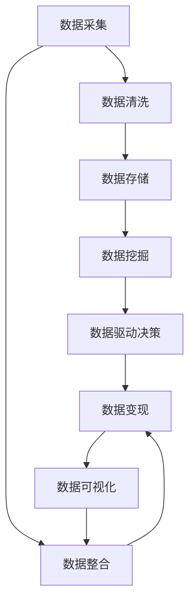

                 

# 如何利用技术能力进行数据变现

> 关键词：数据变现, 数据资产管理, 数据挖掘, 数据驱动决策, 大数据技术, 数据可视化

## 1. 背景介绍

在数字化时代，数据已成为最重要的企业资产之一。对于绝大多数企业而言，无论是传统行业还是新兴领域，数据都有巨大的价值。但如何识别、整合、分析并最终实现数据变现，仍是一个复杂且具挑战性的问题。在这一背景下，本文旨在探讨如何利用技术能力，通过数据变现实现企业价值的最大化。

本文将从以下几个核心问题展开：

1. **数据变现的概述**：明确数据变现的定义、价值和重要性。
2. **技术在数据变现中的角色**：介绍数据科学、人工智能、云计算等技术在数据变现中的应用。
3. **数据资产管理的策略**：详细阐述数据资产管理的策略和实践，包括数据采集、存储、清洗、分析等环节。
4. **数据驱动决策的实施**：探讨如何基于数据驱动企业决策，提升业务效率和竞争优势。
5. **数据变现的实际案例**：通过具体案例展示如何通过数据变现实现企业增长。
6. **技术工具和资源**：推荐各类数据变现所需的技术工具和资源，帮助读者快速上手。

## 2. 核心概念与联系

### 2.1 核心概念概述

为更好地理解数据变现，本文将介绍几个核心概念：

- **数据变现(Data Monetization)**：指通过将数据转化为有价值的服务、产品或洞察，实现其商业价值的最大化。
- **数据资产管理(Data Asset Management)**：涉及数据的识别、整合、存储和治理，以确保数据的安全、可靠和高效使用。
- **数据挖掘(Data Mining)**：利用算法和统计工具从数据中发现有价值的模式、趋势和关系。
- **数据驱动决策(Data-Driven Decision Making)**：基于数据分析和洞察结果，制定更科学、更有效的决策。
- **大数据技术(Big Data Technology)**：涉及数据的采集、存储、处理和分析等技术，支持大规模数据集的处理。
- **数据可视化(Data Visualization)**：通过图表、地图等图形化方式展现数据分析结果，直观传达信息。

这些概念之间的联系可通过以下Mermaid流程图来展示：



这个流程图展示了一个典型的数据变现流程：

1. 通过数据采集和整合，获得高质量的数据集。
2. 对数据进行清洗和存储，确保数据的完整性和可用性。
3. 使用数据挖掘技术，提取有价值的信息和模式。
4. 基于数据分析结果，进行数据驱动决策。
5. 将数据转化为有价值的服务、产品或洞察，实现数据变现。
6. 使用数据可视化工具，展示分析结果，增强数据变现的效果。

## 3. 核心算法原理 & 具体操作步骤

### 3.1 算法原理概述

数据变现的算法原理主要基于以下几个方面：

- **数据预处理**：包括数据清洗、归一化、降维等，以提升数据质量，为后续分析奠定基础。
- **机器学习与深度学习**：利用算法从数据中挖掘模式、趋势和关联，预测未来变化，提升决策效果。
- **云计算与大数据技术**：通过分布式计算、存储和处理技术，支持大规模数据的分析与实时决策。
- **数据驱动决策模型**：结合业务规则和算法结果，构建模型指导实际决策过程。
- **商业智能(BI)与数据可视化**：将分析结果以直观的方式展现，增强决策的可理解性和应用效果。

### 3.2 算法步骤详解

数据变现的具体操作步骤可以分为以下几个阶段：

1. **数据收集与整合**：
   - 通过API、爬虫等方式，收集业务相关的数据源，如客户信息、交易记录、社交媒体等。
   - 对收集到的数据进行整合，确保数据的完整性和一致性。

2. **数据清洗与预处理**：
   - 去除重复、缺失、异常的数据记录。
   - 对数据进行归一化、标准化、降维等预处理步骤，提升数据质量。

3. **数据挖掘与分析**：
   - 使用算法如聚类、分类、回归等，从数据中挖掘出有价值的模式和趋势。
   - 对分析结果进行验证和优化，确保分析结果的准确性和可靠性。

4. **模型构建与优化**：
   - 基于分析结果构建数据驱动的决策模型。
   - 使用机器学习和深度学习技术，对模型进行训练和优化。

5. **数据变现与商业化**：
   - 将分析结果转化为有价值的服务、产品或洞察，实现数据变现。
   - 使用数据可视化工具，将分析结果直观展示，增强决策效果。

### 3.3 算法优缺点

数据变现算法的主要优点包括：

- **高效性**：通过自动化数据分析，显著提升决策效率。
- **准确性**：利用算法挖掘出的模式和趋势，增强决策的科学性和可靠性。
- **可扩展性**：基于云计算技术，支持大规模数据处理和实时分析。

然而，数据变现算法也存在一些局限性：

- **数据质量依赖**：分析结果的准确性高度依赖于数据的质量和完整性。
- **算法复杂性**：复杂算法如深度学习、机器学习等，需要较高的技术和计算资源。
- **业务理解要求**：算法结果的解释和应用，需要深入的业务理解。

### 3.4 算法应用领域

数据变现算法广泛应用于以下几个领域：

- **客户关系管理**：通过分析客户数据，制定个性化的营销策略，提升客户满意度和忠诚度。
- **风险管理**：利用数据挖掘技术，识别潜在风险，制定风险控制策略。
- **供应链优化**：通过分析供应链数据，优化库存管理和物流安排，降低成本，提升效率。
- **金融服务**：基于客户交易数据，提供个性化的金融产品和服务，提升客户体验和收益。
- **市场分析**：通过分析市场数据，洞察市场趋势，指导企业决策和战略规划。

## 4. 数学模型和公式 & 详细讲解 & 举例说明

### 4.1 数学模型构建

本节将使用数学语言对数据变现过程进行更加严格的刻画。

假设收集到的一组数据集为 $D=\{(x_i,y_i)\}_{i=1}^N$，其中 $x_i$ 为输入特征，$y_i$ 为输出标签。数据变现的目标是找到一个函数 $f(x)$，使得 $f(x)$ 能够尽可能准确地映射输入 $x$ 到输出 $y$。

为了实现这一目标，我们通常采用如下的数学模型：

$$
\min_{f(x)} \sum_{i=1}^N \ell(f(x_i),y_i)
$$

其中 $\ell$ 为损失函数，用于衡量模型预测结果与真实标签之间的差异。常见的损失函数包括均方误差（MSE）、交叉熵（CE）等。

### 4.2 公式推导过程

以回归问题为例，推导最小二乘法的优化目标和求解步骤。

假设输入 $x_i$ 和输出 $y_i$ 之间的关系为 $y_i = f(x_i) + \epsilon_i$，其中 $\epsilon_i$ 为误差项，服从均值为0、方差为 $\sigma^2$ 的正态分布。

最小二乘法的目标是最小化预测值与真实值之间的平方误差：

$$
\min_{f(x)} \sum_{i=1}^N (y_i - f(x_i))^2
$$

其对应的最小二乘估计为：

$$
\hat{f}(x_i) = \sum_{i=1}^N \alpha_i x_i y_i / \sum_{i=1}^N \alpha_i x_i^2
$$

其中 $\alpha_i = \frac{1}{y_i^2} - \frac{\overline{y}^2}{\overline{x}^2}$，$\overline{y} = \frac{1}{N}\sum_{i=1}^N y_i$，$\overline{x} = \frac{1}{N}\sum_{i=1}^N x_i$。

### 4.3 案例分析与讲解

以银行业的信用评分为例，展示如何利用数据变现技术提升客户信用评估的准确性。

1. **数据收集与整合**：
   - 从银行内部系统、第三方信用评级机构等渠道，收集客户的信用记录、交易记录、社交媒体信息等。
   - 整合不同数据源，构建统一的数据集。

2. **数据清洗与预处理**：
   - 删除重复、缺失、异常的数据记录。
   - 对数据进行归一化、标准化，提升数据质量。

3. **数据挖掘与分析**：
   - 使用聚类算法，将客户分为不同的信用等级。
   - 使用逻辑回归算法，预测客户的违约概率。

4. **模型构建与优化**：
   - 构建信用评分模型，根据客户的历史数据和行为特征，预测其未来的信用风险。
   - 使用梯度下降等优化算法，训练和优化模型参数。

5. **数据变现与商业化**：
   - 根据信用评分结果，制定差异化的信贷政策。
   - 使用数据可视化工具，展示分析结果，增强决策效果。

## 5. 项目实践：代码实例和详细解释说明

### 5.1 开发环境搭建

在进行数据变现项目开发前，需要准备好开发环境。以下是使用Python进行PyTorch开发的环境配置流程：

1. 安装Anaconda：从官网下载并安装Anaconda，用于创建独立的Python环境。

2. 创建并激活虚拟环境：
```bash
conda create -n pytorch-env python=3.8 
conda activate pytorch-env
```

3. 安装PyTorch：根据CUDA版本，从官网获取对应的安装命令。例如：
```bash
conda install pytorch torchvision torchaudio cudatoolkit=11.1 -c pytorch -c conda-forge
```

4. 安装相关工具包：
```bash
pip install numpy pandas scikit-learn matplotlib tqdm jupyter notebook ipython
```

完成上述步骤后，即可在`pytorch-env`环境中开始数据变现项目的开发。

### 5.2 源代码详细实现

我们以客户信用评分为例，展示如何使用PyTorch构建和训练信用评分模型。

首先，定义数据集和模型类：

```python
import torch
from torch.utils.data import Dataset
from torch import nn

class CreditDataset(Dataset):
    def __init__(self, data, labels):
        self.data = data
        self.labels = labels
    
    def __len__(self):
        return len(self.data)
    
    def __getitem__(self, idx):
        return self.data[idx], self.labels[idx]

class CreditModel(nn.Module):
    def __init__(self, input_size, hidden_size, output_size):
        super(CreditModel, self).__init__()
        self.fc1 = nn.Linear(input_size, hidden_size)
        self.fc2 = nn.Linear(hidden_size, output_size)
    
    def forward(self, x):
        x = torch.relu(self.fc1(x))
        x = self.fc2(x)
        return x
```

然后，定义模型训练函数和评估函数：

```python
from torch import optimizer
from sklearn.metrics import accuracy_score
from tqdm import tqdm

def train_model(model, train_loader, optimizer, criterion, n_epochs):
    model.train()
    for epoch in range(n_epochs):
        for data, target in tqdm(train_loader):
            optimizer.zero_grad()
            output = model(data)
            loss = criterion(output, target)
            loss.backward()
            optimizer.step()
    return model

def evaluate_model(model, test_loader, criterion):
    model.eval()
    predictions, true_labels = [], []
    for data, target in test_loader:
        output = model(data)
        predictions.append(output.argmax(dim=1))
        true_labels.append(target)
    return accuracy_score(true_labels, predictions)
```

最后，启动训练流程并在测试集上评估：

```python
from sklearn.model_selection import train_test_split

# 假设 data 和 labels 已经准备好
train_data, test_data, train_labels, test_labels = train_test_split(data, labels, test_size=0.2, random_state=42)

train_loader = torch.utils.data.DataLoader(train_data, batch_size=32, shuffle=True)
test_loader = torch.utils.data.DataLoader(test_data, batch_size=32, shuffle=False)

input_size = train_data.shape[1]
hidden_size = 64
output_size = 1

model = CreditModel(input_size, hidden_size, output_size)
criterion = nn.BCELoss()
optimizer = optimizer.Adam(model.parameters(), lr=0.001)

n_epochs = 10

model = train_model(model, train_loader, optimizer, criterion, n_epochs)
accuracy = evaluate_model(model, test_loader, criterion)
print(f"Accuracy: {accuracy}")
```

以上就是使用PyTorch进行客户信用评分模型训练的完整代码实现。可以看到，PyTorch提供了丰富的深度学习组件和工具，使得模型构建和训练过程变得简洁高效。

### 5.3 代码解读与分析

让我们再详细解读一下关键代码的实现细节：

**CreditDataset类**：
- `__init__`方法：初始化数据集和标签。
- `__len__`方法：返回数据集的样本数量。
- `__getitem__`方法：对单个样本进行处理，返回模型所需的输入和标签。

**CreditModel类**：
- `__init__`方法：定义模型结构，包括两个全连接层。
- `forward`方法：前向传播计算，依次经过两个全连接层，并返回输出结果。

**train_model函数**：
- 循环迭代训练过程，使用Adam优化器更新模型参数，最小化损失函数。
- 在验证集上评估模型性能，返回训练后的模型。

**evaluate_model函数**：
- 评估模型在测试集上的准确率，返回准确率值。

**训练流程**：
- 定义模型参数，包括输入大小、隐藏层大小和输出大小。
- 创建模型、优化器和损失函数。
- 定义训练集和测试集的DataLoader，开始训练过程。
- 在训练集上进行梯度下降优化，并在测试集上评估模型准确率。

可以看到，PyTorch框架的灵活性和易用性，使得数据变现项目的开发变得非常便捷。开发者只需关注模型设计和训练过程，而无需过多关注底层实现细节。

## 6. 实际应用场景

### 6.1 银行业信用评分

在银行业中，客户信用评分是一个典型的数据变现应用场景。通过构建信用评分模型，银行可以更好地评估客户的信用风险，制定差异化的信贷政策，优化贷款审批流程，提高业务效率和风险控制能力。

具体而言，银行可以从不同渠道收集客户的信用记录、交易记录、社交媒体信息等，构建统一的数据集。使用数据挖掘技术，对数据进行预处理和特征工程，构建信用评分模型。最后，根据模型结果，制定个性化的贷款政策，提升客户满意度和业务收益。

### 6.2 电商平台的个性化推荐

电商平台通过分析用户行为数据，可以为用户推荐个性化的商品，提升用户体验和销售额。通过数据变现技术，电商平台可以更精准地理解用户需求，实现更有效的商品推荐。

具体来说，电商平台可以从用户浏览记录、购买历史、评价信息等渠道，收集用户数据。利用机器学习算法，对用户行为进行分析，构建推荐模型。根据模型结果，向用户推荐相关商品，并动态调整推荐策略，提升推荐效果。

### 6.3 健康医疗领域的个性化诊疗

在健康医疗领域，数据分析和建模技术可以帮助医生进行更准确的诊断和治疗。通过分析患者的病历数据、基因信息等，构建个性化诊疗模型，提高诊疗效果和患者满意度。

具体而言，医疗机构可以从电子病历系统、基因检测实验室等渠道，收集患者的健康数据。使用数据挖掘和机器学习技术，对数据进行预处理和建模，构建个性化诊疗模型。根据模型结果，制定个性化的诊疗方案，提升诊疗效果。

### 6.4 未来应用展望

随着数据变现技术的不断发展，未来将会有更多的新兴应用场景涌现。以下是几个可能的未来方向：

1. **智能制造与供应链优化**：通过数据分析，优化生产流程和供应链管理，提升企业效率和竞争力。
2. **智慧城市与公共服务**：利用城市数据，优化城市管理和公共服务，提升居民生活质量。
3. **金融风险管理**：通过分析市场数据，预测市场趋势，帮助金融机构制定风险管理策略。
4. **医疗健康与个性化治疗**：利用患者数据，构建个性化治疗方案，提升医疗效果和患者满意度。
5. **教育培训与个性化学习**：通过分析学生数据，提供个性化的学习建议，提升教育效果和学习体验。

## 7. 工具和资源推荐

### 7.1 学习资源推荐

为了帮助开发者系统掌握数据变现的理论基础和实践技巧，这里推荐一些优质的学习资源：

1. **《Python数据分析基础》系列书籍**：适合初学者快速入门Python数据分析，掌握基本的Numpy、Pandas等工具。
2. **《机器学习实战》书籍**：介绍机器学习算法的实现和应用，涵盖回归、分类、聚类等经典模型。
3. **Coursera的《数据科学导论》课程**：由知名数据科学家授课，涵盖数据科学的基础理论和实践应用。
4. **Kaggle竞赛平台**：提供各类数据分析和机器学习竞赛，锻炼实战能力。
5. **《TensorFlow实战》书籍**：介绍TensorFlow框架的实现和使用，适合深入学习和实践。

通过这些资源的学习，相信你一定能够系统掌握数据变现的技术和应用。

### 7.2 开发工具推荐

高效的开发离不开优秀的工具支持。以下是几款用于数据变现开发的常用工具：

1. **PyTorch**：基于Python的开源深度学习框架，支持分布式计算，灵活高效。
2. **TensorFlow**：由Google主导开发的开源深度学习框架，生产部署方便，适合大规模工程应用。
3. **H2O.ai**：提供集成化的数据科学平台，支持机器学习、深度学习等。
4. **Apache Spark**：分布式计算框架，支持大数据处理和分析。
5. **Jupyter Notebook**：交互式编程环境，支持Python、R等多种语言。

合理利用这些工具，可以显著提升数据变现项目的开发效率，加快创新迭代的步伐。

### 7.3 相关论文推荐

数据变现技术的发展源于学界的持续研究。以下是几篇奠基性的相关论文，推荐阅读：

1. **《机器学习：原理、算法与实现》**：周志华著，介绍机器学习的基本原理和实现方法。
2. **《深度学习》**：Ian Goodfellow等著，介绍深度学习的基本原理和应用。
3. **《数据挖掘：概念与技术》**：李航著，介绍数据挖掘的基本概念和技术。
4. **《大数据技术》**：黄志刚著，介绍大数据技术的基本原理和应用。
5. **《数据驱动决策：理论与实践》**：Sander van Vliet等著，介绍数据驱动决策的基本理论和实践应用。

这些论文代表了大数据技术和数据变现技术的发展脉络。通过学习这些前沿成果，可以帮助研究者把握学科前进方向，激发更多的创新灵感。

## 8. 总结：未来发展趋势与挑战

### 8.1 总结

本文对数据变现的算法原理和操作步骤进行了全面系统的介绍。首先阐述了数据变现的定义、价值和重要性。其次，从技术角度介绍了数据科学、人工智能、云计算等技术在数据变现中的应用。最后，通过实际案例展示了数据变现技术在银行业、电商、健康医疗等领域的广泛应用，展示了数据变现的巨大潜力。

通过本文的系统梳理，可以看到，数据变现技术在数字化时代扮演着越来越重要的角色。数据变现不仅能够提升企业的业务效率和竞争优势，还能推动社会的全面数字化转型。未来，随着数据资产的不断积累和技术的持续演进，数据变现技术必将成为企业数字化转型的重要手段。

### 8.2 未来发展趋势

展望未来，数据变现技术将呈现以下几个发展趋势：

1. **技术手段的智能化**：随着人工智能技术的不断发展，数据分析和建模将更加智能化、自动化。
2. **数据规模的扩大化**：随着物联网、云计算等技术的普及，数据的规模将不断扩大，数据变现的潜力将进一步释放。
3. **应用场景的多样化**：数据变现技术将在更多领域得到应用，如智慧制造、智慧城市、智能家居等，拓展数据变现的边界。
4. **数据隐私的保护**：随着数据泄露事件频发，数据隐私保护将成为数据变现的重要关注点。
5. **数据治理的规范化**：数据治理机制的完善，将使得数据变现更加规范、透明、可控。

以上趋势凸显了数据变现技术的广阔前景。这些方向的探索发展，必将进一步提升数据变现的效果和应用范围，为数字化时代的企业带来更大的商业价值。

### 8.3 面临的挑战

尽管数据变现技术已经取得了瞩目成就，但在迈向更加智能化、普适化应用的过程中，仍面临诸多挑战：

1. **数据隐私和安全**：随着数据泄露事件频发，数据隐私和安全问题亟待解决。如何在保护数据隐私的前提下，进行有效的数据变现，是一个重要的挑战。
2. **技术复杂性**：数据分析和建模技术复杂，需要高水平的数据科学家和工程师。如何在降低技术门槛的同时，提升数据变现的效果，是一个需要解决的问题。
3. **数据质量管理**：数据的质量和完整性直接影响数据分析的效果，如何在数据采集、清洗、处理等环节，提升数据质量，是一个亟待解决的挑战。
4. **业务理解**：数据变现的效果高度依赖于对业务场景的深入理解。如何在数据变现过程中，充分结合业务需求，提升数据分析的效果，是一个重要的挑战。
5. **数据治理机制**：数据治理机制的完善，将使得数据变现更加规范、透明、可控。如何在数据治理中平衡效率和合规性，是一个需要解决的问题。

### 8.4 研究展望

面对数据变现所面临的挑战，未来的研究需要在以下几个方面寻求新的突破：

1. **数据隐私保护技术**：开发高效、可靠的数据隐私保护技术，确保数据在流转过程中的安全性。
2. **自动化数据处理**：利用自动化技术，提升数据采集、清洗、处理等环节的效率和质量。
3. **智能化数据分析**：结合人工智能技术，提升数据分析的智能化、自动化水平，降低技术门槛。
4. **多模态数据融合**：将视觉、语音、文本等多模态数据进行整合，提升数据分析的效果和应用范围。
5. **跨领域数据变现**：将数据变现技术应用于更多领域，拓展数据变现的边界，提升企业的数字化转型能力。

这些研究方向将引领数据变现技术的进一步发展，推动数据变现技术的全面应用。相信随着技术的发展和应用的深入，数据变现必将在数字化时代发挥更大的价值。

## 9. 附录：常见问题与解答

**Q1：数据变现是否需要大量的数据？**

A: 数据变现的效果高度依赖于数据的质量和规模。通常情况下，数据规模越大，数据变现的效果越好。但在数据质量不高的情况下，即使数据规模很大，变现效果也可能不佳。因此，在数据变现过程中，需要综合考虑数据质量和数据规模，确保数据的高效利用。

**Q2：数据变现技术有哪些主要步骤？**

A: 数据变现技术的主要步骤包括数据采集、数据清洗、数据挖掘、模型构建和优化、数据变现与商业化等环节。其中数据清洗和数据挖掘是关键步骤，直接影响到后续模型构建和变现效果。

**Q3：数据变现过程中如何保护数据隐私？**

A: 数据隐私保护是数据变现过程中必须考虑的重要问题。常见的数据隐私保护技术包括数据脱敏、差分隐私、联邦学习等。这些技术可以帮助在保护数据隐私的前提下，进行有效的数据变现。

**Q4：数据变现技术的瓶颈在哪里？**

A: 数据变现技术的瓶颈主要在于数据质量、技术复杂性和业务理解。如果数据质量不高，即使技术再先进，也难以发挥出其真正的效果。同时，数据变现技术的复杂性也较高，需要高水平的数据科学家和工程师。此外，数据变现的效果高度依赖于对业务场景的深入理解，需要在数据分析过程中充分结合业务需求。

**Q5：如何提升数据变现的效果？**

A: 提升数据变现效果的关键在于提升数据质量和优化数据分析技术。在数据采集、清洗、处理等环节，需要严格把控数据质量，确保数据的完整性和准确性。在数据分析环节，需要选择合适的算法和模型，并结合业务需求进行优化。此外，数据可视化和商业化也是提升变现效果的重要环节，需要合理利用可视化工具和商业化策略，增强数据分析的效果和变现能力。

---

作者：禅与计算机程序设计艺术 / Zen and the Art of Computer Programming

