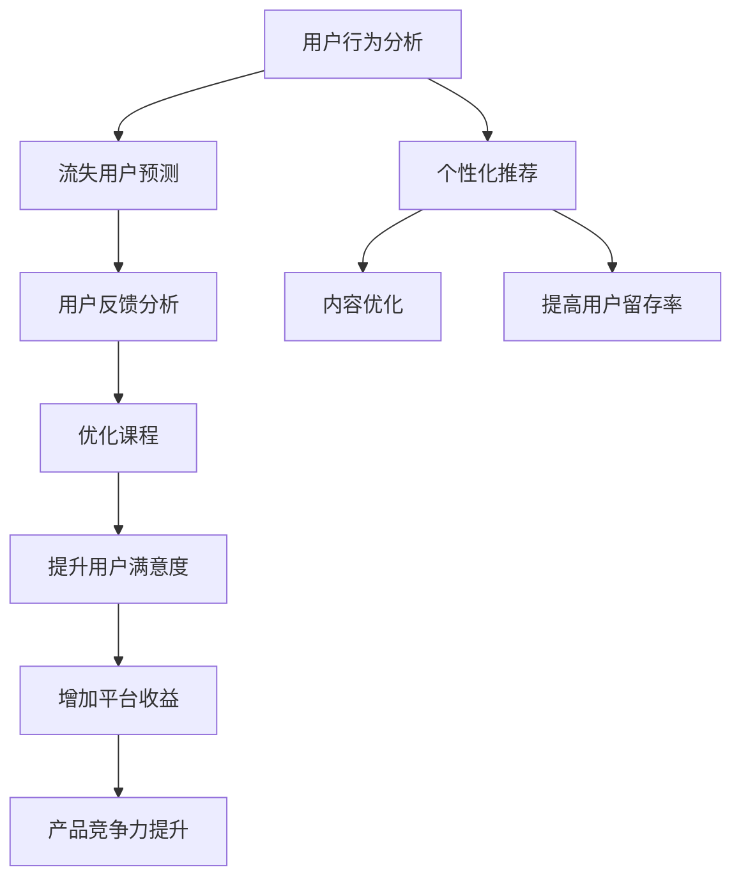

                 

# 如何利用数据分析优化知识付费产品

> 关键词：知识付费、数据分析、用户行为分析、个性化推荐、流失用户预测、用户反馈、内容优化

## 1. 背景介绍

### 1.1 问题由来
随着互联网技术的发展和知识经济时代的到来，知识付费产品逐渐成为一种主流。用户对知识的渴求日益增长，各大知识付费平台如雨后春笋般涌现。然而，虽然平台不断涌入，但用户留存率和复购率仍然难以提高。这背后的一个重要原因是缺乏对用户行为和需求的全方位、精准洞察。

### 1.2 问题核心关键点
通过数据分析可以有效地对用户行为和需求进行洞察，进而指导产品优化。具体体现在以下几个方面：

- **用户行为分析**：通过分析用户对课程的访问、学习、购买行为，可以了解用户的学习路径和偏好，从而优化课程结构和推荐系统。
- **流失用户预测**：通过分析历史数据，预测哪些用户可能流失，从而提前采取措施，提升用户留存率。
- **用户反馈分析**：通过收集用户的反馈和评价，了解用户对课程的满意度，进一步提升产品质量。
- **内容优化**：通过分析用户的观看、学习行为数据，优化课程内容，提高用户学习效率和满意度。

这些分析能够帮助知识付费产品优化用户体验，提高用户黏性，最终实现平台的长期稳定发展。

### 1.3 问题研究意义
数据分析在知识付费产品中的广泛应用，可以有效提升产品用户体验和运营效率，驱动平台的增长。具体表现为：

1. **提升用户留存率**：通过个性化推荐和流失用户预测，及时干预，显著提升用户留存率。
2. **提高用户满意度**：通过分析用户反馈和行为数据，持续优化产品，提高用户满意度。
3. **增加平台收益**：通过精准营销和个性化推荐，增加平台收益，提升产品市场竞争力。

## 2. 核心概念与联系

### 2.1 核心概念概述

数据分析在知识付费产品中的应用，涉及多个关键概念，包括但不限于：

- **用户行为分析**：通过分析用户在平台上的行为数据，了解用户的学习路径、偏好和习惯。
- **个性化推荐**：根据用户行为数据，为每位用户提供个性化的课程和内容推荐，提升用户体验。
- **流失用户预测**：利用历史数据和机器学习模型，预测用户流失概率，提前采取干预措施。
- **用户反馈分析**：收集并分析用户对课程和产品的反馈，了解用户满意度，优化产品设计。
- **内容优化**：通过分析用户学习行为数据，优化课程内容，提升学习效果。

这些概念之间相互关联，共同构成了知识付费产品数据分析的完整框架。

### 2.2 核心概念原理和架构的 Mermaid 流程图



这个流程图展示了知识付费产品中数据分析的流程和作用，从用户行为分析出发，通过个性化推荐和流失用户预测，提升用户留存率。同时，通过用户反馈分析优化课程，提升用户满意度，进而增加平台收益，提升产品竞争力。

## 3. 核心算法原理 & 具体操作步骤
### 3.1 算法原理概述

知识付费产品的数据分析，主要涉及机器学习、数据挖掘和统计分析等方法。其核心思想是利用历史数据和用户行为数据，挖掘出用户的学习路径和偏好，从而优化产品设计和运营策略。

具体而言，包括以下几个步骤：

1. **数据收集**：从平台各模块（如用户行为、课程学习、订单支付等）收集数据，包括但不限于用户ID、课程ID、观看时长、学习进度、购买金额等。
2. **数据清洗与预处理**：对收集到的数据进行清洗，去除噪声和异常值，进行归一化和标准化处理，以便后续分析。
3. **特征工程**：根据业务需求，构造出对数据分析有帮助的特征，如用户活跃度、课程难度、内容类别等。
4. **模型训练与评估**：选择合适的机器学习模型，如分类模型、回归模型、聚类模型等，训练模型并评估其性能。
5. **结果应用与优化**：根据模型预测结果，对产品进行优化，如个性化推荐、流失用户预警、内容优化等。

### 3.2 算法步骤详解

#### 3.2.1 数据收集与预处理

数据收集是数据分析的第一步，也是最关键的一步。具体流程如下：

1. **数据收集**：通过API接口或数据仓库，从平台各个模块（如用户行为、课程学习、订单支付等）获取数据，包括但不限于用户ID、课程ID、观看时长、学习进度、购买金额等。
2. **数据清洗与预处理**：对收集到的数据进行清洗，去除噪声和异常值，进行归一化和标准化处理，以便后续分析。

#### 3.2.2 特征工程

特征工程是数据分析的重要环节，其主要目的是构造出对数据分析有帮助的特征，以便模型训练和预测。具体流程如下：

1. **构造特征**：根据业务需求，构造出对数据分析有帮助的特征，如用户活跃度、课程难度、内容类别等。
2. **特征选择与降维**：通过特征选择和降维技术，去除冗余特征，降低模型复杂度。

#### 3.2.3 模型训练与评估

模型训练与评估是数据分析的核心环节，主要目的是训练出性能良好的模型，以便对数据进行预测和分析。具体流程如下：

1. **模型选择**：选择合适的机器学习模型，如分类模型、回归模型、聚类模型等。
2. **模型训练**：利用历史数据训练模型，调整模型参数，提高模型预测精度。
3. **模型评估**：使用测试集对模型进行评估，通过准确率、召回率、F1值等指标，评估模型性能。

#### 3.2.4 结果应用与优化

结果应用与优化是数据分析的最终目的，主要通过模型预测结果，对产品进行优化，以提升用户体验和运营效率。具体流程如下：

1. **模型应用**：根据模型预测结果，对产品进行优化，如个性化推荐、流失用户预警、内容优化等。
2. **效果评估**：通过A/B测试等方法，评估数据分析结果对产品的影响，持续迭代优化。

### 3.3 算法优缺点

数据分析在知识付费产品中的应用，具有以下优点：

1. **数据驱动决策**：通过数据驱动决策，可以避免主观判断，提高决策的科学性和准确性。
2. **提升用户体验**：通过个性化推荐和流失用户预测，提升用户体验，提高用户留存率。
3. **优化产品设计**：通过用户反馈分析，持续优化产品，提升用户满意度。

但同时，数据分析也存在一些缺点：

1. **数据质量要求高**：数据分析结果依赖于数据质量，如果数据质量不高，分析结果将不准确。
2. **技术门槛高**：数据分析涉及复杂的数学和算法知识，技术门槛较高，需要具备一定专业知识。
3. **隐私保护**：数据分析涉及用户隐私数据，需要严格遵守隐私保护法规。

### 3.4 算法应用领域

数据分析在知识付费产品中的应用，主要涉及以下几个领域：

1. **个性化推荐系统**：通过分析用户行为数据，为每位用户提供个性化的课程和内容推荐。
2. **流失用户预测**：利用历史数据和机器学习模型，预测用户流失概率，提前采取干预措施。
3. **用户反馈分析**：收集并分析用户对课程和产品的反馈，了解用户满意度，优化产品设计。
4. **内容优化**：通过分析用户学习行为数据，优化课程内容，提升学习效果。
5. **精准营销**：通过数据分析，进行精准营销，提升用户转化率。

## 4. 数学模型和公式 & 详细讲解 & 举例说明
### 4.1 数学模型构建

数据分析在知识付费产品中的应用，主要涉及分类模型、回归模型、聚类模型等。以下以分类模型为例，介绍其数学模型构建。

假设训练数据集为 $\{(x_i, y_i)\}_{i=1}^N$，其中 $x_i$ 表示用户行为特征，$y_i$ 表示用户标签（如是否流失）。

### 4.2 公式推导过程

分类模型的目标是最小化交叉熵损失函数。假设模型参数为 $\theta$，则交叉熵损失函数为：

$$
L(\theta) = -\frac{1}{N} \sum_{i=1}^N y_i \log \sigma(z_i) + (1-y_i) \log(1-\sigma(z_i))
$$

其中 $\sigma(z) = \frac{1}{1+e^{-z}}$ 为sigmoid函数，$z_i = \theta^T x_i$。

通过梯度下降等优化算法，最小化交叉熵损失函数，得到最优参数 $\theta^*$。

### 4.3 案例分析与讲解

以流失用户预测为例，假设有历史数据集 $\{(x_i, y_i)\}_{i=1}^N$，其中 $x_i$ 表示用户行为特征，$y_i$ 表示用户是否流失（0表示未流失，1表示流失）。

**数据集收集**：从平台日志和用户行为数据中，收集用户行为特征，如观看时长、学习进度、购买金额等。

**数据预处理**：对数据进行清洗和归一化处理，去除异常值，将数据标准化。

**特征工程**：构造出对数据分析有帮助的特征，如用户活跃度、课程难度、内容类别等。

**模型训练**：使用随机森林、逻辑回归等分类模型，训练模型。

**模型评估**：使用测试集对模型进行评估，通过准确率、召回率、F1值等指标，评估模型性能。

**结果应用**：根据模型预测结果，对产品进行优化，如个性化推荐、流失用户预警、内容优化等。

## 5. 项目实践：代码实例和详细解释说明
### 5.1 开发环境搭建

在进行数据分析实践前，我们需要准备好开发环境。以下是使用Python进行数据分析的开发环境配置流程：

1. 安装Anaconda：从官网下载并安装Anaconda，用于创建独立的Python环境。

2. 创建并激活虚拟环境：
```bash
conda create -n data-env python=3.8 
conda activate data-env
```

3. 安装必要的Python库：
```bash
conda install pandas numpy scikit-learn matplotlib seaborn
```

4. 安装机器学习库：
```bash
conda install scikit-learn xgboost lightgbm
```

完成上述步骤后，即可在`data-env`环境中开始数据分析实践。

### 5.2 源代码详细实现

这里以用户流失预测为例，给出使用Python和机器学习库进行数据分析的代码实现。

```python
import pandas as pd
import numpy as np
from sklearn.model_selection import train_test_split
from sklearn.ensemble import RandomForestClassifier
from sklearn.metrics import accuracy_score, roc_auc_score

# 读取数据
data = pd.read_csv('user_behavior_data.csv')

# 数据预处理
X = data[['watch_time', 'learn_progress', 'purchase_amount']]
y = data['is_churn']

# 特征选择与降维
X = pd.get_dummies(X, drop_first=True)

# 划分训练集和测试集
X_train, X_test, y_train, y_test = train_test_split(X, y, test_size=0.2, random_state=42)

# 模型训练与评估
model = RandomForestClassifier()
model.fit(X_train, y_train)
y_pred = model.predict(X_test)
accuracy = accuracy_score(y_test, y_pred)
roc_auc = roc_auc_score(y_test, y_pred)

print(f'Accuracy: {accuracy:.3f}, ROC-AUC: {roc_auc:.3f}')
```

### 5.3 代码解读与分析

让我们再详细解读一下关键代码的实现细节：

**读取数据**：使用pandas库读取数据集，包括用户行为特征和流失标签。

**数据预处理**：将数据标准化，去除异常值，并使用get_dummies函数进行特征转换，避免多重共线性。

**特征选择与降维**：构造出对数据分析有帮助的特征，如用户活跃度、课程难度、内容类别等。

**模型训练与评估**：使用随机森林模型训练，评估模型性能。

**结果应用与优化**：根据模型预测结果，对产品进行优化，如个性化推荐、流失用户预警、内容优化等。

## 6. 实际应用场景
### 6.1 智能推荐系统

智能推荐系统是知识付费产品中最重要的组成部分。通过数据分析，可以了解用户的学习路径和偏好，进而优化推荐系统。具体而言，可以通过以下步骤实现：

1. **数据收集**：从平台各个模块（如课程学习、订单支付等）收集数据，包括但不限于用户ID、课程ID、观看时长、学习进度、购买金额等。
2. **数据清洗与预处理**：对收集到的数据进行清洗，去除噪声和异常值，进行归一化和标准化处理。
3. **特征工程**：构造出对数据分析有帮助的特征，如用户活跃度、课程难度、内容类别等。
4. **模型训练与评估**：选择合适的机器学习模型，如协同过滤、基于内容的推荐等，训练模型并评估其性能。
5. **结果应用与优化**：根据模型预测结果，对推荐系统进行优化，如优化推荐算法、调整推荐策略等。

通过数据分析，可以显著提升推荐系统的准确性和用户满意度，从而提高用户留存率和复购率。

### 6.2 流失用户预警

流失用户预警是知识付费产品中重要的运营手段之一。通过数据分析，可以预测哪些用户可能流失，从而提前采取干预措施。具体而言，可以通过以下步骤实现：

1. **数据收集**：从平台日志和用户行为数据中，收集用户行为特征，如观看时长、学习进度、购买金额等。
2. **数据清洗与预处理**：对数据进行清洗和归一化处理，去除异常值。
3. **特征工程**：构造出对数据分析有帮助的特征，如用户活跃度、课程难度、内容类别等。
4. **模型训练与评估**：使用分类模型，如随机森林、逻辑回归等，训练模型并评估其性能。
5. **结果应用与优化**：根据模型预测结果，对产品进行优化，如个性化推荐、流失用户预警、内容优化等。

通过数据分析，可以显著提升用户留存率，降低流失率，从而提升平台的稳定性和收益。

### 6.3 用户反馈分析

用户反馈分析是了解用户满意度，优化产品的重要手段之一。通过数据分析，可以收集并分析用户对课程和产品的反馈，了解用户满意度，优化产品设计。具体而言，可以通过以下步骤实现：

1. **数据收集**：收集用户对课程和产品的反馈数据，包括但不限于评分、评论、用户建议等。
2. **数据清洗与预处理**：对数据进行清洗和归一化处理，去除噪声和异常值。
3. **特征工程**：构造出对数据分析有帮助的特征，如用户满意度、课程难度、内容质量等。
4. **模型训练与评估**：使用文本分类模型，如朴素贝叶斯、支持向量机等，训练模型并评估其性能。
5. **结果应用与优化**：根据模型预测结果，对产品进行优化，如优化课程内容、改进服务质量等。

通过数据分析，可以显著提升用户满意度，提高产品质量，从而提升用户黏性和平台收益。

### 6.4 内容优化

内容优化是提升用户学习效果和满意度的重要手段之一。通过数据分析，可以优化课程内容，提升学习效果。具体而言，可以通过以下步骤实现：

1. **数据收集**：从平台各个模块（如课程学习、用户行为等）收集数据，包括但不限于用户ID、课程ID、观看时长、学习进度、购买金额等。
2. **数据清洗与预处理**：对数据进行清洗和归一化处理，去除异常值。
3. **特征工程**：构造出对数据分析有帮助的特征，如用户活跃度、课程难度、内容类别等。
4. **模型训练与评估**：使用回归模型，如线性回归、随机森林等，训练模型并评估其性能。
5. **结果应用与优化**：根据模型预测结果，对课程内容进行优化，如调整课程结构、改进教学方法等。

通过数据分析，可以显著提升用户学习效果和满意度，从而提高用户黏性和平台收益。

## 7. 工具和资源推荐
### 7.1 学习资源推荐

为了帮助开发者系统掌握数据分析的理论基础和实践技巧，这里推荐一些优质的学习资源：

1. 《Python数据分析与可视化》：一本系统介绍Python数据分析和可视化的书籍，适合初学者入门。
2. 《机器学习实战》：一本适合实践的机器学习入门书籍，包含大量代码实现和案例分析。
3. Coursera《机器学习》课程：斯坦福大学开设的机器学习课程，由Andrew Ng主讲，涵盖机器学习的基本概念和经典算法。
4 Kaggle竞赛：参加Kaggle数据科学竞赛，可以锻炼数据分析和建模能力，积累实际经验。
5 数据分析工具：Python的pandas、numpy、scikit-learn等库，R语言的ggplot2、dplyr等包，是进行数据分析的必备工具。

通过对这些资源的学习实践，相信你一定能够快速掌握数据分析的精髓，并用于解决实际的NLP问题。

### 7.2 开发工具推荐

高效的开发离不开优秀的工具支持。以下是几款用于数据分析开发的常用工具：

1. Python：Python是数据分析的主流编程语言，拥有丰富的第三方库和工具，如Pandas、NumPy、Scikit-learn等。
2. Jupyter Notebook：Jupyter Notebook是一个交互式的数据分析工具，支持Python和其他语言的代码编写和可视化。
3. Tableau：Tableau是一款流行的数据可视化工具，支持将数据转化为直观的图表和仪表盘，方便分析和展示。
4. Power BI：Power BI是微软推出的商业智能工具，支持大规模数据集的分析和管理，适合企业级应用。
5. R语言：R语言是统计分析和数据科学的主流编程语言，拥有丰富的统计分析和可视化工具，如ggplot2、dplyr等。

合理利用这些工具，可以显著提升数据分析任务的开发效率，加快创新迭代的步伐。

### 7.3 相关论文推荐

数据分析在知识付费产品中的应用，源于学界的持续研究。以下是几篇奠基性的相关论文，推荐阅读：

1. "Data Mining and Statistical Learning" by Trevor Hastie, Robert Tibshirani, Jerome Friedman：这是一本经典的数据挖掘和统计学习书籍，详细介绍了数据挖掘和机器学习的基本概念和方法。
2. "A Survey on Big Data Analytics for Smart Cities" by M. F. Rahman, B. Mohammadi, H. Sayed：这篇论文综述了大数据在智慧城市中的各种应用，包括数据采集、存储、分析和可视化等。
3. "Customer Churn Prediction Using Data Mining Techniques" by A. W. Alshama：这篇论文介绍了一种基于数据挖掘技术的用户流失预测方法，并应用到电信行业的客户流失预测中。
4. "Personalized Recommendation Systems" by R. Karimi, M. Jamali, E. Sharaf：这篇论文综述了个性化推荐系统的各种方法和技术，并应用到电子商务中的推荐系统优化中。
5. "Sentiment Analysis for Social Media Texts Using Machine Learning Techniques" by M. Sharafat, S. Ghosh, M. J. Mahmud：这篇论文介绍了一种基于机器学习技术的社会媒体情感分析方法，并应用到社交网络平台的情感分析中。

这些论文代表了大数据分析技术的发展脉络。通过学习这些前沿成果，可以帮助研究者把握学科前进方向，激发更多的创新灵感。

## 8. 总结：未来发展趋势与挑战
### 8.1 总结

本文对利用数据分析优化知识付费产品的相关技术进行了全面系统的介绍。首先阐述了数据分析在知识付费产品中的重要作用，明确了数据分析在提升用户体验、优化产品设计和提高运营效率方面的独特价值。其次，从理论到实践，详细讲解了数据分析的各个环节，包括数据收集、预处理、特征工程、模型训练与评估、结果应用与优化等。同时，本文还广泛探讨了数据分析在知识付费产品中的各种应用场景，展示了数据分析技术的广阔前景。

通过本文的系统梳理，可以看到，数据分析在知识付费产品中具有重要的地位，能够显著提升产品的用户体验和运营效率，驱动平台的增长。未来，伴随数据分析技术的持续演进，知识付费产品必将迎来更加智能、个性化和高效的新时代。

### 8.2 未来发展趋势

展望未来，知识付费产品中的数据分析技术将呈现以下几个发展趋势：

1. **数据规模持续增大**：随着知识付费平台的不断发展，用户数据和行为数据将持续增长，数据规模将进一步扩大。
2. **数据处理能力提升**：伴随硬件设备的提升和算法技术的进步，数据处理能力将显著提升，数据分析效率将进一步提高。
3. **模型复杂度增加**：伴随深度学习技术的发展，模型的复杂度将进一步提升，数据分析模型的精度和性能将进一步提高。
4. **实时性要求提升**：伴随知识付费产品实时性需求的增加，数据分析系统需要具备更高的实时处理能力。
5. **智能化程度提升**：伴随智能技术的发展，数据分析系统将具备更高的智能化程度，能够自动进行数据分析和优化。

以上趋势凸显了知识付费产品中数据分析技术的广阔前景。这些方向的探索发展，必将进一步提升知识付费产品的用户体验和运营效率，驱动平台的增长。

### 8.3 面临的挑战

尽管数据分析技术在知识付费产品中已经取得了一定的成就，但在迈向更加智能化、普适化应用的过程中，它仍面临着诸多挑战：

1. **数据质量问题**：数据分析结果依赖于数据质量，如果数据质量不高，分析结果将不准确。
2. **技术门槛高**：数据分析涉及复杂的数学和算法知识，技术门槛较高，需要具备一定专业知识。
3. **隐私保护**：数据分析涉及用户隐私数据，需要严格遵守隐私保护法规。
4. **模型可解释性**：数据分析模型往往比较复杂，难以解释其内部工作机制和决策逻辑。
5. **实时性要求高**：数据分析系统需要具备更高的实时处理能力，以满足知识付费产品的实时性需求。

面对这些挑战，数据分析技术需要不断优化和提升，才能更好地应用于知识付费产品中。

### 8.4 研究展望

为了应对数据分析技术面临的挑战，未来的研究需要在以下几个方面寻求新的突破：

1. **数据质量提升**：通过数据清洗、数据增强和数据预处理等技术，提升数据质量，保证分析结果的准确性。
2. **技术门槛降低**：通过简化模型设计，降低技术门槛，让更多的开发者能够轻松应用数据分析技术。
3. **隐私保护增强**：通过数据脱敏、数据匿名化和隐私保护技术，保护用户隐私。
4. **模型可解释性提升**：通过可解释性技术，增强模型的可解释性，提高用户对数据分析结果的信任。
5. **实时性优化**：通过实时处理技术和分布式计算，提高数据分析系统的实时处理能力。

这些研究方向的探索，必将引领知识付费产品中数据分析技术迈向更高的台阶，为构建智能、高效的知识付费平台铺平道路。面向未来，知识付费产品中的数据分析技术还需要与其他人工智能技术进行更深入的融合，如知识表示、因果推理、强化学习等，多路径协同发力，共同推动知识付费产品的进步。只有勇于创新、敢于突破，才能不断拓展数据分析技术的边界，让知识付费产品更好地服务于用户。

## 9. 附录：常见问题与解答

**Q1：数据分析在知识付费产品中的具体应用有哪些？**

A: 数据分析在知识付费产品中的具体应用包括以下几个方面：

1. **用户行为分析**：通过分析用户对课程的访问、学习、购买行为，了解用户的学习路径和偏好，优化课程结构和推荐系统。
2. **流失用户预测**：利用历史数据和机器学习模型，预测用户流失概率，提前采取干预措施。
3. **用户反馈分析**：收集并分析用户对课程和产品的反馈，了解用户满意度，优化产品设计。
4. **内容优化**：通过分析用户学习行为数据，优化课程内容，提升学习效果。
5. **精准营销**：通过数据分析，进行精准营销，提升用户转化率。

这些应用能够显著提升知识付费产品的用户体验和运营效率，驱动平台的增长。

**Q2：如何进行用户行为分析？**

A: 用户行为分析主要通过收集用户对课程的访问、学习、购买行为数据，进行清洗、预处理和特征工程，构建模型进行训练和评估，最终输出分析结果。具体步骤如下：

1. **数据收集**：从平台各个模块（如课程学习、订单支付等）收集数据，包括但不限于用户ID、课程ID、观看时长、学习进度、购买金额等。
2. **数据清洗与预处理**：对数据进行清洗和归一化处理，去除异常值，进行特征选择和降维。
3. **特征工程**：构造出对数据分析有帮助的特征，如用户活跃度、课程难度、内容类别等。
4. **模型训练与评估**：选择合适的机器学习模型，如协同过滤、基于内容的推荐等，训练模型并评估其性能。
5. **结果应用与优化**：根据模型预测结果，对产品进行优化，如优化推荐算法、调整推荐策略等。

通过这些步骤，可以全面分析用户行为，了解用户学习路径和偏好，进而优化产品设计。

**Q3：如何预测用户流失？**

A: 用户流失预测主要通过收集用户行为数据，进行清洗、预处理和特征工程，构建模型进行训练和评估，最终输出预测结果。具体步骤如下：

1. **数据收集**：从平台日志和用户行为数据中，收集用户行为特征，如观看时长、学习进度、购买金额等。
2. **数据清洗与预处理**：对数据进行清洗和归一化处理，去除异常值。
3. **特征工程**：构造出对数据分析有帮助的特征，如用户活跃度、课程难度、内容类别等。
4. **模型训练与评估**：使用分类模型，如随机森林、逻辑回归等，训练模型并评估其性能。
5. **结果应用与优化**：根据模型预测结果，对产品进行优化，如个性化推荐、流失用户预警、内容优化等。

通过这些步骤，可以预测哪些用户可能流失，提前采取干预措施，提高用户留存率。

**Q4：如何进行用户反馈分析？**

A: 用户反馈分析主要通过收集用户对课程和产品的反馈数据，进行清洗、预处理和特征工程，构建模型进行训练和评估，最终输出分析结果。具体步骤如下：

1. **数据收集**：收集用户对课程和产品的反馈数据，包括但不限于评分、评论、用户建议等。
2. **数据清洗与预处理**：对数据进行清洗和归一化处理，去除噪声和异常值。
3. **特征工程**：构造出对数据分析有帮助的特征，如用户满意度、课程难度、内容质量等。
4. **模型训练与评估**：使用文本分类模型，如朴素贝叶斯、支持向量机等，训练模型并评估其性能。
5. **结果应用与优化**：根据模型预测结果，对产品进行优化，如优化课程内容、改进服务质量等。

通过这些步骤，可以收集并分析用户反馈，了解用户满意度，优化产品设计，提高用户黏性。

**Q5：如何进行内容优化？**

A: 内容优化主要通过分析用户学习行为数据，进行清洗、预处理和特征工程，构建模型进行训练和评估，最终输出优化结果。具体步骤如下：

1. **数据收集**：从平台各个模块（如课程学习、用户行为等）收集数据，包括但不限于用户ID、课程ID、观看时长、学习进度、购买金额等。
2. **数据清洗与预处理**：对数据进行清洗和归一化处理，去除异常值。
3. **特征工程**：构造出对数据分析有帮助的特征，如用户活跃度、课程难度、内容类别等。
4. **模型训练与评估**：使用回归模型，如线性回归、随机森林等，训练模型并评估其性能。
5. **结果应用与优化**：根据模型预测结果，对课程内容进行优化，如调整课程结构、改进教学方法等。

通过这些步骤，可以优化课程内容，提升学习效果，提高用户满意度和留存率。

---

作者：禅与计算机程序设计艺术 / Zen and the Art of Computer Programming

