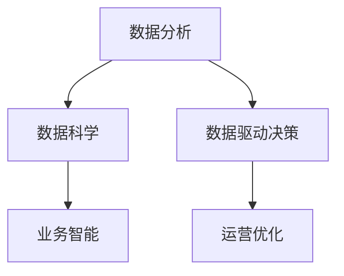

                 

# 如何利用数据分析指导运营决策

> 关键词：数据分析, 数据科学, 数据驱动决策, 运营优化, 业务智能

## 1. 背景介绍

### 1.1 问题由来

随着信息化和数字化的深入，企业运营管理越来越依赖于数据驱动的决策方式。但随着数据量的激增和复杂度的提升，传统的数据处理方式已难以满足需求。企业亟需一种高效、可靠、科学的数据分析方法，以指导运营决策。

### 1.2 问题核心关键点

数据分析在运营决策中的关键点包括：

- 数据的获取与处理。需要从多个渠道采集结构化和非结构化数据，进行清洗和预处理，确保数据质量。
- 分析模型的构建。基于数据特征构建适合的分析模型，如回归分析、分类分析、聚类分析等。
- 决策支持与执行。将分析结果应用于运营决策，并监测执行效果，形成闭环反馈。
- 数据驱动文化。建立数据驱动的企业文化，提升员工的数据分析能力和决策素质。

这些问题直接影响数据分析的效果和业务价值，本文将从这些问题入手，全面解析如何利用数据分析指导运营决策。

## 2. 核心概念与联系

### 2.1 核心概念概述

为更好地理解数据分析在运营决策中的应用，本节将介绍几个核心概念：

- 数据分析(Analytic Data)：对数据进行收集、处理、分析和报告的过程。通过分析，揭示数据的价值和规律，指导决策。

- 数据科学(Data Science)：通过统计学、机器学习、数据挖掘等方法，从数据中提取知识，进行数据驱动的决策。

- 数据驱动决策(Data-Driven Decision Making)：基于数据分析和建模结果，进行客观、理性的决策过程。

- 业务智能(Business Intelligence, BI)：将数据分析工具、技术及应用与企业的战略目标相结合，支持企业决策的解决方案。

- 运营优化(Operational Optimization)：通过数据分析与优化模型，提升企业的运营效率和质量，降低成本。

这些概念之间的关系可以通过以下Mermaid流程图来展示：



该流程图展示了数据分析在决策中的作用过程：数据科学提供了数据分析的方法和模型，业务智能将数据分析与企业目标结合，最终通过运营优化实现业务提升。

## 3. 核心算法原理 & 具体操作步骤
### 3.1 算法原理概述

数据分析指导运营决策的基本原理可以概括为：

1. **数据采集与清洗**：从各种渠道获取数据，并进行预处理，确保数据的质量和完整性。
2. **数据分析与建模**：基于数据特征构建合适的分析模型，分析数据的分布、关联和趋势。
3. **结果应用与评估**：将分析结果应用于运营决策，并通过后续执行情况评估模型的有效性。
4. **持续改进**：根据执行结果的反馈，不断优化模型和分析方法，提升决策效果。

### 3.2 算法步骤详解

数据分析指导运营决策的一般步骤包括：

**Step 1: 数据采集与清洗**

- **数据源**：从企业内部系统（如ERP、CRM、ERMS等）、外部渠道（如社交媒体、天气预报等）获取数据。
- **数据清洗**：处理缺失值、异常值、重复值，并进行数据格式转换，确保数据的一致性和完整性。

**Step 2: 数据分析与建模**

- **数据探索**：通过描述性统计和数据可视化，了解数据的基本特征和分布。
- **特征工程**：提取和构造关键特征，增强模型的表现力。
- **模型选择与训练**：根据问题类型选择合适的分析模型（回归、分类、聚类等），使用训练数据进行模型训练。

**Step 3: 结果应用与评估**

- **决策制定**：基于模型预测结果，制定具体的运营决策。
- **执行跟踪**：对决策执行过程进行监控，收集反馈数据。
- **结果评估**：评估决策效果，识别偏差和局限性，进行改进。

**Step 4: 持续改进**

- **反馈循环**：根据执行效果反馈，持续优化模型和分析方法。
- **知识积累**：将每次分析结果进行记录，形成知识库，供后续决策参考。

### 3.3 算法优缺点

数据分析指导运营决策的主要优点包括：

1. **客观决策**：基于数据的客观分析，减少人为偏见，提升决策的客观性和科学性。
2. **高效性**：通过自动化分析工具，加快决策速度，缩短决策周期。
3. **可解释性**：数据分析结果具有可解释性，方便理解和传递。
4. **决策透明**：所有决策过程透明，便于追溯和审计。

但同时也存在一些缺点：

1. **数据质量依赖**：分析结果的准确性高度依赖于数据质量，数据偏差可能影响决策。
2. **模型局限性**：模型可能存在过拟合或欠拟合，需要进行适当的模型验证。
3. **技术门槛**：需要专业的数据分析和建模技术，对人员素质要求较高。
4. **成本较高**：初期投入大，需要购买软件和硬件设备，培训人员。

### 3.4 算法应用领域

数据分析在运营决策中的应用领域非常广泛，包括但不限于：

- 客户关系管理：通过分析客户行为数据，提升客户满意度和忠诚度。
- 产品研发：通过市场数据分析，指导产品设计、开发和迭代。
- 供应链优化：通过物流数据分析，优化库存管理和物流规划。
- 金融风险控制：通过信用数据分析，评估贷款风险，制定风控策略。
- 营销策略优化：通过销售数据分析，优化营销渠道和活动效果。

## 4. 数学模型和公式 & 详细讲解 & 举例说明
### 4.1 数学模型构建

数据分析的数学模型主要包括：

- **回归模型**：用于预测数值型目标变量，如线性回归、多元回归、岭回归等。
- **分类模型**：用于预测离散型目标变量，如逻辑回归、支持向量机、随机森林等。
- **聚类模型**：用于将数据分成不同的群组，如K-Means、层次聚类等。

### 4.2 公式推导过程

以线性回归模型为例，推导其公式：

设 $y$ 为因变量，$x_1, x_2, ..., x_n$ 为自变量，$\beta_0, \beta_1, ..., \beta_n$ 为模型参数。

线性回归模型的目标是最小化预测值与实际值之间的平方误差，即：

$$
\min_{\beta_0,\beta_1,...,\beta_n} \sum_{i=1}^n (y_i - (\beta_0 + \beta_1x_{i1} + ... + \beta_nx_{in}))^2
$$

通过求导并令导数为0，可以解出最优的参数：

$$
\hat{\beta_k} = \frac{\sum_{i=1}^n (x_{ik} - \bar{x_k})(y_i - \bar{y})}{\sum_{i=1}^n (x_{ik} - \bar{x_k})^2}, k = 0, 1, ..., n
$$

其中 $\bar{x_k}$ 和 $\bar{y}$ 分别为 $x_k$ 和 $y$ 的均值。

### 4.3 案例分析与讲解

**案例：客户流失预测**

某电商网站通过数据分析预测客户流失，以减少流失率，提升用户留存率。

**Step 1: 数据采集**

从网站后台系统收集客户的购买记录、访问记录、评价记录等数据，作为预测变量。

**Step 2: 数据分析与建模**

- **数据探索**：通过可视化工具，如Tableau、Power BI等，分析客户流失数据的分布和关联。
- **特征工程**：提取购买频率、访问时长、评价评分等关键特征，构建特征集。
- **模型选择与训练**：使用线性回归模型，将客户流失标签作为目标变量，历史数据作为训练集，训练预测模型。

**Step 3: 结果应用与评估**

- **决策制定**：根据预测结果，制定个性化营销策略，对流失客户进行挽留。
- **执行跟踪**：通过网站日志数据，监控营销策略的执行效果。
- **结果评估**：分析挽留策略的效果，优化预测模型和营销策略。

**Step 4: 持续改进**

- **反馈循环**：根据客户反应和策略效果，不断优化预测模型和营销策略。
- **知识积累**：将每次分析结果和策略效果进行记录，形成知识库，供后续决策参考。

## 5. 项目实践：代码实例和详细解释说明
### 5.1 开发环境搭建

在进行数据分析项目实践前，我们需要准备好开发环境。以下是使用Python进行数据分析开发的常见环境配置流程：

1. 安装Anaconda：从官网下载并安装Anaconda，用于创建独立的Python环境。

2. 创建并激活虚拟环境：
```bash
conda create -n analytics-env python=3.8 
conda activate analytics-env
```

3. 安装必要的Python库：
```bash
pip install pandas numpy matplotlib seaborn statsmodels scikit-learn
```

4. 安装数据分析工具：
```bash
pip install jupyter notebook jupyterlab
```

5. 安装可视化工具：
```bash
pip install plotly matplotlib interactive
```

完成上述步骤后，即可在`analytics-env`环境中开始数据分析实践。

### 5.2 源代码详细实现

下面以客户流失预测为例，给出使用Python进行数据分析和建模的代码实现。

```python
import pandas as pd
import numpy as np
import matplotlib.pyplot as plt
import seaborn as sns
from statsmodels.stats.correlation import weightedtau
from sklearn.model_selection import train_test_split
from sklearn.linear_model import LinearRegression
from sklearn.metrics import mean_squared_error, mean_absolute_error

# 数据加载
data = pd.read_csv('customer_churn.csv')

# 数据清洗
data = data.dropna(subset=['purchases', 'avg_order_value', 'days_since_last_order'])
data = data.drop_duplicates(subset=['customer_id', 'order_id'])

# 数据探索
sns.pairplot(data, hue='Churn', palette='Set2')
plt.show()

# 特征工程
X = data[['purchases', 'avg_order_value', 'days_since_last_order']]
y = data['Churn']

# 模型训练
X_train, X_test, y_train, y_test = train_test_split(X, y, test_size=0.2, random_state=42)
model = LinearRegression()
model.fit(X_train, y_train)

# 模型评估
y_pred = model.predict(X_test)
mse = mean_squared_error(y_test, y_pred)
mae = mean_absolute_error(y_test, y_pred)
print(f"Mean Squared Error: {mse:.2f}")
print(f"Mean Absolute Error: {mae:.2f}")

# 预测结果展示
plt.scatter(y_test, y_pred)
plt.xlabel('Actual')
plt.ylabel('Predicted')
plt.show()
```

### 5.3 代码解读与分析

让我们再详细解读一下关键代码的实现细节：

**数据加载**

```python
data = pd.read_csv('customer_churn.csv')
```

从CSV文件中读取数据，使用pandas库进行数据管理。

**数据清洗**

```python
data = data.dropna(subset=['purchases', 'avg_order_value', 'days_since_last_order'])
data = data.drop_duplicates(subset=['customer_id', 'order_id'])
```

对数据进行缺失值处理和去重操作，确保数据的一致性和完整性。

**数据探索**

```python
sns.pairplot(data, hue='Churn', palette='Set2')
plt.show()
```

通过可视化工具进行数据探索，帮助理解数据的基本特征和分布。

**特征工程**

```python
X = data[['purchases', 'avg_order_value', 'days_since_last_order']]
y = data['Churn']
```

提取关键特征，构建特征集和目标变量，为模型训练做准备。

**模型训练**

```python
X_train, X_test, y_train, y_test = train_test_split(X, y, test_size=0.2, random_state=42)
model = LinearRegression()
model.fit(X_train, y_train)
```

将数据集划分为训练集和测试集，使用线性回归模型进行训练。

**模型评估**

```python
y_pred = model.predict(X_test)
mse = mean_squared_error(y_test, y_pred)
mae = mean_absolute_error(y_test, y_pred)
print(f"Mean Squared Error: {mse:.2f}")
print(f"Mean Absolute Error: {mae:.2f}")
```

计算模型预测结果的均方误差和绝对误差，评估模型性能。

**预测结果展示**

```python
plt.scatter(y_test, y_pred)
plt.xlabel('Actual')
plt.ylabel('Predicted')
plt.show()
```

通过散点图展示模型预测结果，直观感受预测效果。

## 6. 实际应用场景
### 6.1 客户关系管理

数据分析在客户关系管理中具有重要应用，通过客户行为数据分析，可以预测客户流失、提升客户忠诚度。

**实际应用**：
- **流失预测**：通过客户购买频率、消费金额、访问时长等数据，预测客户流失风险，制定针对性的挽留策略。
- **忠诚度提升**：分析客户满意度和忠诚度指标，发现满意度提升的措施，优化客户服务流程。

**案例**：
某电商公司通过客户流失预测，识别高流失风险客户，并通过个性化推荐、优惠活动等方式进行挽留，提升了客户留存率。

### 6.2 产品研发

数据分析可以帮助企业更好地理解市场需求，指导产品设计和迭代。

**实际应用**：
- **需求分析**：通过市场调研数据和用户反馈，分析产品需求，识别市场趋势。
- **产品优化**：基于用户使用数据，优化产品功能和服务，提升用户体验。

**案例**：
某汽车公司通过用户行为数据分析，发现用户对某款车型的偏好和改进建议，优化了产品设计和性能，提升了市场份额。

### 6.3 供应链优化

数据分析在供应链管理中具有重要应用，通过物流和库存数据分析，可以优化供应链运营，降低成本。

**实际应用**：
- **库存管理**：通过销售和库存数据，优化库存水平，避免过多或缺货情况。
- **物流规划**：分析运输和配送数据，优化物流路线和配送频率，降低运输成本。

**案例**：
某物流公司通过库存数据分析，优化了库存管理策略，减少了缺货和库存积压，提升了运营效率。

### 6.4 金融风险控制

数据分析在金融风险控制中具有重要应用，通过信用数据分析，评估贷款风险，制定风控策略。

**实际应用**：
- **信用评分**：通过客户信用记录和行为数据，评估客户信用风险，制定信贷策略。
- **风险预警**：分析交易数据和市场动态，预警潜在的金融风险，采取预防措施。

**案例**：
某银行通过信用数据分析，提高了信用评分准确性，减少了不良贷款率，降低了金融风险。

## 7. 工具和资源推荐
### 7.1 学习资源推荐

为了帮助开发者系统掌握数据分析的理论基础和实践技巧，这里推荐一些优质的学习资源：

1. 《Python数据分析实战》系列书籍：全面介绍数据分析的理论与实践，涵盖数据处理、可视化和建模等环节。

2. Coursera《数据科学专项课程》：由多所知名大学开设的课程，覆盖数据科学的基本概念和技术，适合初学者和进阶者。

3. Kaggle《数据分析竞赛》：参加Kaggle数据分析竞赛，通过实际项目提升数据分析能力，了解行业应用案例。

4. GitHub《数据分析项目》：收集了大量数据分析项目，提供丰富的代码和文档，供开发者学习和参考。

5. Udacity《数据科学纳米学位》：提供数据科学的全方位学习路径，涵盖数据处理、机器学习、深度学习等内容。

通过对这些资源的学习实践，相信你一定能够快速掌握数据分析的精髓，并用于解决实际的运营问题。
###  7.2 开发工具推荐

高效的开发离不开优秀的工具支持。以下是几款用于数据分析开发的常用工具：

1. Python：作为数据分析的主流语言，Python拥有丰富的库和工具，如Pandas、NumPy、Scikit-learn等。

2. R语言：与Python并列的数据分析工具，R语言在统计分析方面具有强大的能力，适合处理复杂的数据分析任务。

3. Jupyter Notebook：数据科学家常用的交互式编程工具，支持多语言代码和可视化展示。

4. Tableau：强大的数据可视化工具，支持多种数据源，适合快速生成数据报告。

5. Power BI：微软推出的商业智能工具，集成可视化、数据清洗和分析功能，适合企业级的BI应用。

6. Apache Spark：基于分布式计算的框架，适合处理大规模数据，支持多种数据源和分析算法。

合理利用这些工具，可以显著提升数据分析的效率和效果，加快创新迭代的步伐。

### 7.3 相关论文推荐

数据分析在运营决策中的应用源于学界的持续研究。以下是几篇奠基性的相关论文，推荐阅读：

1. 《Business Analytics: Concepts, Data, and Tools》：对业务分析的概念、技术和工具进行系统介绍，适合入门学习。

2. 《Predictive Analytics: The Power to Predict Future Performance》：介绍预测分析的技术和方法，提升数据驱动决策的能力。

3. 《The Data Science Handbook》：涵盖数据科学的基本理论和实践，适合综合学习。

4. 《Machine Learning Yearning》：深度学习领域的经典著作，提供实际项目中的数据分析和建模技巧。

5. 《Advances in Data Mining and Statistical Learning》：大数据和统计学习领域的最新研究成果，提升数据分析的深度和广度。

这些论文代表了大数据分析的应用趋势和研究方向，通过学习这些前沿成果，可以帮助研究者把握学科前进方向，激发更多的创新灵感。

## 8. 总结：未来发展趋势与挑战
### 8.1 总结

本文对数据分析在运营决策中的应用进行了全面系统的介绍。首先阐述了数据分析在决策中的重要性，明确了数据分析的流程和关键步骤。其次，从数据采集、清洗、探索、建模到结果应用与评估，详细讲解了数据分析的每一步操作。同时，本文还广泛探讨了数据分析在多个领域的应用场景，展示了数据分析的广泛应用和巨大潜力。最后，本文精选了数据分析的学习资源和工具，力求为读者提供全方位的技术指引。

通过本文的系统梳理，可以看到，数据分析在运营决策中扮演着越来越重要的角色，极大地提升了企业决策的科学性和客观性。数据分析不仅有助于优化运营过程，还能挖掘深层次的业务洞察，为企业的战略制定和市场预测提供坚实的数据基础。未来，伴随数据分析技术的不断演进，企业将能更好地利用数据驱动决策，实现业务的持续优化和创新。

### 8.2 未来发展趋势

数据分析在运营决策中的未来发展趋势包括：

1. **数据平台化**：建立统一的数据中台，实现数据的高效管理和共享，提升数据使用的便捷性和效率。

2. **智能化分析**：引入人工智能技术，如深度学习、自然语言处理等，提升数据分析的深度和广度，挖掘更多的业务洞察。

3. **实时分析**：通过大数据和实时计算技术，实现数据的实时分析，支持快速决策和响应。

4. **自动化分析**：引入自动化工具和流程，自动化数据清洗、特征工程和建模过程，提升分析效率。

5. **可视化分析**：通过数据可视化工具，直观展示数据分析结果，方便业务人员理解和使用。

6. **多模态分析**：将不同模态的数据（如文本、图像、视频等）进行融合分析，提升数据全面性。

这些趋势凸显了数据分析技术的不断进步和演进，必将进一步提升数据分析在运营决策中的应用价值。

### 8.3 面临的挑战

数据分析在运营决策中也面临诸多挑战：

1. **数据质量**：数据质量不高、缺失值和异常值较多，影响分析结果的准确性。

2. **技术门槛**：数据分析需要较高的技术门槛，需要专业的技能和工具。

3. **数据孤岛**：不同系统和部门的数据孤岛现象，影响数据的统一管理和共享。

4. **隐私和安全**：数据安全和隐私保护成为重要问题，需要加强数据保护措施。

5. **模型复杂性**：模型复杂性高，解释性差，难以理解和解释模型结果。

6. **人机协作**：数据驱动决策需要跨部门协作，不同角色之间的沟通和协作存在障碍。

### 8.4 研究展望

面对数据分析在运营决策中面临的挑战，未来的研究方向包括：

1. **数据治理**：建立统一的数据治理框架，提升数据质量和可用性。

2. **模型可解释性**：提升模型的可解释性，增强决策的透明度和可信度。

3. **多模态融合**：探索多模态数据的融合方法，提升数据分析的全面性。

4. **自动化和智能化**：引入自动化和智能化技术，提升数据分析的效率和准确性。

5. **隐私保护**：研究隐私保护技术，保障数据安全和隐私。

6. **人机协作**：探索人机协作的方法，提升数据驱动决策的效率和效果。

这些研究方向的探索，必将推动数据分析技术的不断进步，为企业的运营决策提供更强大的数据支持。

## 9. 附录：常见问题与解答

**Q1: 数据分析在运营决策中的重要性体现在哪里？**

A: 数据分析在运营决策中的重要性体现在以下几个方面：

1. **客观性**：数据分析基于数据驱动，减少了主观偏见，提升了决策的客观性和科学性。
2. **精度**：数据分析通过精确的数学模型，提升了预测和决策的准确性。
3. **效率**：数据分析自动化了决策过程，缩短了决策周期。
4. **透明性**：数据分析结果可追溯、可解释，增强了决策的透明度和可信度。

**Q2: 如何保证数据分析的质量？**

A: 保证数据分析的质量需要从以下几个方面入手：

1. **数据清洗**：对数据进行预处理，处理缺失值、异常值、重复值等。
2. **数据验证**：对数据进行验证，检查数据的一致性和完整性。
3. **数据监控**：对数据进行实时监控，及时发现和处理数据异常。
4. **数据治理**：建立统一的数据治理框架，确保数据的高质量和一致性。

**Q3: 如何提升数据分析的自动化水平？**

A: 提升数据分析的自动化水平需要从以下几个方面入手：

1. **自动化工具**：引入自动化工具和流程，如数据清洗、特征工程和建模。
2. **自动化算法**：采用自动化算法，如机器学习和深度学习，提升分析效率。
3. **自动化平台**：建立自动化的数据分析平台，实现数据的集中管理和共享。
4. **自动化报告**：自动化生成数据报告，提升数据分析结果的可视化效果。

**Q4: 数据分析在企业中的应用案例有哪些？**

A: 数据分析在企业中的应用案例包括但不限于：

1. **客户关系管理**：通过数据分析，预测客户流失风险，提升客户满意度。
2. **产品研发**：通过市场数据分析，指导产品设计和迭代。
3. **供应链优化**：通过数据分析，优化库存管理和物流规划，降低运营成本。
4. **金融风险控制**：通过数据分析，评估贷款风险，制定风控策略。
5. **营销策略优化**：通过数据分析，优化营销渠道和活动效果，提升营销ROI。

**Q5: 数据分析的未来发展方向有哪些？**

A: 数据分析的未来发展方向包括：

1. **数据平台化**：建立统一的数据中台，实现数据的高效管理和共享。
2. **智能化分析**：引入人工智能技术，提升数据分析的深度和广度。
3. **实时分析**：通过大数据和实时计算技术，实现数据的实时分析。
4. **自动化分析**：引入自动化工具和流程，提升分析效率。
5. **可视化分析**：通过数据可视化工具，直观展示数据分析结果。
6. **多模态分析**：将不同模态的数据进行融合分析。

**Q6: 数据分析在企业中面临的挑战有哪些？**

A: 数据分析在企业中面临的挑战包括：

1. **数据质量**：数据质量不高，影响分析结果的准确性。
2. **技术门槛**：需要专业的技能和工具。
3. **数据孤岛**：不同系统和部门的数据孤岛现象。
4. **隐私和安全**：数据安全和隐私保护问题。
5. **模型复杂性**：模型复杂性高，难以理解和解释。
6. **人机协作**：跨部门协作存在障碍。

---

作者：禅与计算机程序设计艺术 / Zen and the Art of Computer Programming

