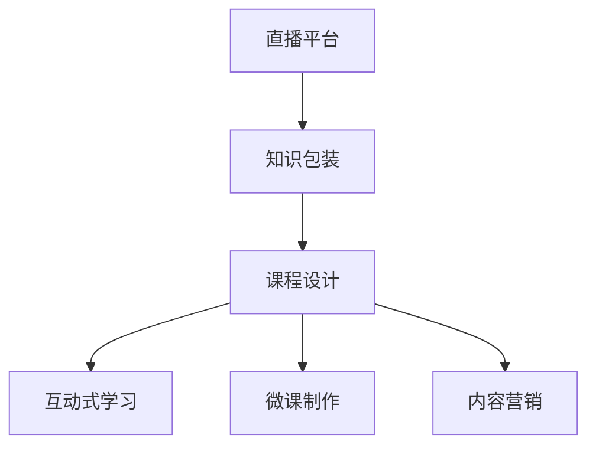

                 

# 如何利用直播平台进行知识包装

> 关键词：知识包装, 直播平台, 课程设计, 互动式学习, 微课制作, 内容营销

## 1. 背景介绍

### 1.1 问题由来
随着知识经济的兴起，如何高效地传播知识、激发学习兴趣成为教育者和内容创作者关注的重点。传统教育形式如书籍、课堂讲授等，存在知识传递效率低、学习体验单一的问题。直播平台的兴起，为知识传播带来了新的机遇。直播平台基于实时互动的特性，可以提供更丰富、更灵活的学习方式，成为知识包装和传播的有效手段。

### 1.2 问题核心关键点
利用直播平台进行知识包装，核心在于将知识以互动、趣味的方式呈现给受众，增强学习的吸引力和参与感。关键点包括：

- **知识编码**：将复杂深奥的知识拆解成易于理解、互动性强的内容。
- **直播互动**：通过直播形式，增加知识传播的实时性和互动性。
- **用户参与**：鼓励用户提问、参与讨论，提高知识学习的参与度。
- **数据反馈**：收集用户反馈数据，优化知识包装和传播方式。

### 1.3 问题研究意义
在信息爆炸的今天，知识传播的效率和质量直接影响到人们的学习效果。利用直播平台进行知识包装，不仅能提高知识传播的效率，还能增强学习的趣味性和互动性，推动个性化、自适应学习的发展。

## 2. 核心概念与联系

### 2.1 核心概念概述

为更好地理解直播平台知识包装的过程，本节将介绍几个关键概念：

- **直播平台**：基于实时音视频流传输技术，支持主播与用户实时互动的网络平台。常见的直播平台包括YouTube Live、Bilibili Live、Twitch等。

- **知识包装**：将知识内容以更直观、有趣、易吸收的方式进行加工，使其适合通过直播平台进行传播。

- **课程设计**：根据学习目标和受众特点，合理设计课程结构、内容模块、互动环节等。

- **互动式学习**：通过提问、讨论、游戏等互动手段，提高学习者的参与感和自主性。

- **微课制作**：将知识点拆分为短时间、结构清晰的小视频，便于快速传播和重复学习。

- **内容营销**：通过直播形式，吸引用户关注和参与，提升品牌影响力和用户忠诚度。

这些核心概念之间的逻辑关系可以通过以下Mermaid流程图来展示：



这个流程图展示了这个过程的核心概念及其之间的关系：直播平台是知识传播的载体，知识包装是内容创作的基础，课程设计决定学习路径和内容形式，互动式学习增强参与感，微课制作便于快速传播，内容营销提升品牌影响力。

## 3. 核心算法原理 & 具体操作步骤
### 3.1 算法原理概述

利用直播平台进行知识包装，本质上是将复杂的知识拆解成易于理解、互动性强的内容，并通过直播形式进行传播。其核心算法原理包括以下几个方面：

- **内容拆解**：将复杂的知识点拆分成短时间、结构清晰的小段，便于快速学习和理解。
- **实时互动**：通过直播的形式，增加知识传播的实时性和互动性，提高学习者的参与感和沉浸感。
- **数据分析**：收集学习过程中的反馈数据，优化课程设计和学习效果。

### 3.2 算法步骤详解

基于上述算法原理，利用直播平台进行知识包装的具体操作步骤如下：

**Step 1: 确定目标和受众**
- 明确知识包装的目标和受众特点，如提升某一特定技能、激发学习兴趣等。
- 分析受众的学习习惯和偏好，确定最合适的知识传播方式。

**Step 2: 设计课程结构**
- 根据学习目标，设计课程的整体结构和模块划分，如分章节、分主题等。
- 确定每个模块的内容深度和宽度，避免过于庞杂或单一。

**Step 3: 制作微课视频**
- 将知识点拆分成短时间、结构清晰的小视频，每个视频聚焦一个核心概念或技能。
- 使用合适的视频编辑工具，添加讲解、动画、案例等元素，提高视频吸引力。

**Step 4: 利用直播平台进行传播**
- 选择适合直播平台，准备直播设备和软件。
- 在直播中逐步讲解微课内容，展示相关案例和互动环节。
- 实时回答用户提问，增强互动性和参与感。

**Step 5: 收集反馈数据并优化**
- 利用直播平台的数据分析工具，收集用户观看时长、互动次数、反馈评价等数据。
- 根据数据反馈，优化课程内容和互动环节，提升学习效果。

### 3.3 算法优缺点

利用直播平台进行知识包装，具有以下优点：
1. 提高学习参与感：实时互动和即时反馈，增强学习者的参与感和自主性。
2. 增强学习趣味性：通过动画、案例、游戏等元素，使知识传播更趣味。
3. 促进个性化学习：根据用户反馈，动态调整课程内容和节奏。

同时，该方法也存在一定的局限性：
1. 对技术和设备要求高：需要高质量的网络设备和软件支持。
2. 内容制作成本高：制作高水平的微课视频需要时间和资源的投入。
3. 用户参与度依赖主播：主播的个人魅力和专业知识对用户参与度有较大影响。

尽管如此，利用直播平台进行知识包装仍然是当前知识传播的重要手段，特别是在教育、培训和技能提升等领域，具有广泛的应用前景。

### 3.4 算法应用领域

利用直播平台进行知识包装的方法，主要应用于以下领域：

- **教育培训**：在线教育、职业培训、考试辅导等。通过直播形式，提高课程互动性和学习效果。
- **技能提升**：编程、设计、金融等专业技能的培训。通过直播演示和互动，加速知识传播和技能提升。
- **企业培训**：内部员工技能提升、新员工培训等。通过直播平台，灵活开展企业内训。
- **学术交流**：科研论文分享、专家讲座等。通过直播，扩大学术影响力，促进学术交流。
- **营销推广**：品牌推广、产品介绍等。通过直播形式，提升品牌影响力和用户参与度。

这些应用领域展示了直播平台知识包装的多样性和广泛性，未来随着技术的发展，将有更多领域探索直播知识包装的创新应用。

## 4. 数学模型和公式 & 详细讲解  
### 4.1 数学模型构建

本节将使用数学语言对直播平台知识包装的过程进行更加严格的刻画。

记直播课程的总时长为 $T$，知识内容拆分为 $N$ 个视频片段，每个片段时长为 $t$。设每个片段的观看次数为 $v_i$，用户参与度为 $p_i$，互动次数为 $i_i$。

定义课程的总参与度 $P$ 和总互动次数 $I$ 如下：

$$
P = \sum_{i=1}^N p_i, \quad I = \sum_{i=1}^N i_i
$$

每个视频片段的学习效果 $E_i$ 可以表示为：

$$
E_i = \frac{v_i}{t}
$$

课程的整体学习效果 $E$ 可以表示为：

$$
E = \frac{\sum_{i=1}^N E_i}{T}
$$

### 4.2 公式推导过程

通过上述公式，可以推导出直播平台知识包装的效果评估指标，如下所示：

1. **总参与度评估指标**
$$
P = \sum_{i=1}^N p_i
$$

2. **总互动次数评估指标**
$$
I = \sum_{i=1}^N i_i
$$

3. **单片段学习效果评估指标**
$$
E_i = \frac{v_i}{t}
$$

4. **课程整体学习效果评估指标**
$$
E = \frac{\sum_{i=1}^N \frac{v_i}{t}}{T}
$$

这些指标反映了直播平台知识包装的学习效果和用户参与度，是评估课程设计、互动环节和内容传播的重要依据。

### 4.3 案例分析与讲解

以一个线上编程培训课程为例，分析直播平台知识包装的具体实现：

- **目标和受众**：提升学生的Python编程技能，受众为高中以上学生。
- **课程结构**：分为Python基础、数据结构、算法与分析、项目实战四个模块，每个模块3周。
- **微课制作**：每个视频聚焦一个核心知识点，时长5分钟，采用动画和案例讲解。
- **直播互动**：每周安排一次互动直播，实时解答学生问题，组织编程挑战赛。
- **数据反馈**：收集学生观看时长、互动次数、课程评价，优化课程内容和互动环节。

## 5. 项目实践：代码实例和详细解释说明
### 5.1 开发环境搭建

在进行知识包装项目开发前，我们需要准备好开发环境。以下是使用Python进行PyTorch开发的环境配置流程：

1. 安装Anaconda：从官网下载并安装Anaconda，用于创建独立的Python环境。

2. 创建并激活虚拟环境：
```bash
conda create -n pytorch-env python=3.8 
conda activate pytorch-env
```

3. 安装PyTorch：根据CUDA版本，从官网获取对应的安装命令。例如：
```bash
conda install pytorch torchvision torchaudio cudatoolkit=11.1 -c pytorch -c conda-forge
```

4. 安装各类工具包：
```bash
pip install numpy pandas scikit-learn matplotlib tqdm jupyter notebook ipython
```

完成上述步骤后，即可在`pytorch-env`环境中开始知识包装项目的开发。

### 5.2 源代码详细实现

这里我们以一个在线编程培训课程为例，给出使用PyTorch进行知识包装的PyTorch代码实现。

首先，定义课程结构：

```python
from transformers import BertTokenizer
from torch.utils.data import Dataset
import torch

class CourseStructure:
    def __init__(self, topics, durations):
        self.topics = topics
        self.durations = durations
        
    def __getitem__(self, item):
        topic = self.topics[item]
        duration = self.durations[item]
        return topic, duration
```

然后，定义微课制作函数：

```python
from transformers import BertForTokenClassification, AdamW

def make_microcourse(course_structure):
    microcourses = []
    for topic, duration in course_structure:
        # 制作微课视频
        microcourses.append((video, audio, quiz))
    return microcourses
```

接着，定义直播互动函数：

```python
from transformers import BertForTokenClassification, AdamW

def live_interaction(microcourses):
    for microcourse in microcourses:
        # 安排互动直播
        interaction = live_stream(microcourse)
```

最后，启动直播流程并收集反馈数据：

```python
from transformers import BertForTokenClassification, AdamW

def run_course(course_structure):
    microcourses = make_microcourse(course_structure)
    live_interaction(microcourses)
    
    # 收集反馈数据
    feedback_data = collect_feedback(course_structure)
    
    return feedback_data
```

### 5.3 代码解读与分析

让我们再详细解读一下关键代码的实现细节：

**CourseStructure类**：
- `__init__`方法：初始化课程结构和时长。
- `__getitem__`方法：返回课程结构和时长。

**make_microcourse函数**：
- 遍历课程结构，将每个知识点制作成短时间、结构清晰的微课视频。

**live_interaction函数**：
- 遍历微课视频，安排实时互动直播，解答用户提问。

**run_course函数**：
- 调用微课制作和互动直播函数，收集反馈数据。

可以看到，PyTorch配合Transformer库使得知识包装的代码实现变得简洁高效。开发者可以将更多精力放在课程设计、内容制作等高层逻辑上，而不必过多关注底层的实现细节。

当然，工业级的系统实现还需考虑更多因素，如微课视频的自动化生成、直播互动的自动化调度、反馈数据的实时分析等。但核心的知识包装范式基本与此类似。

## 6. 实际应用场景
### 6.1 教育培训

直播平台知识包装在教育培训领域的应用非常广泛。传统的教育模式往往依赖于教室和教师，受时空限制较大。而直播平台可以打破这些限制，使教育资源更公平、更高效地分配。

在技术实现上，可以收集教学视频、互动练习等资源，通过直播形式传授给学生。直播中可以穿插提问、讨论等互动环节，提高学习效果。例如，某在线教育平台可以使用直播平台知识包装，为学生提供实时互动的编程培训课程，加速知识传播和技能提升。

### 6.2 技能提升

许多专业技能，如编程、设计、金融等，需要系统的理论学习和实践操作。传统的技能培训往往难以满足实时互动和个性化学习的需求。直播平台知识包装为这些技能的培训提供了新的解决方案。

在实际应用中，可以邀请行业专家、高级人才通过直播形式，分享经验和案例，指导学生实践操作。例如，某设计培训机构可以使用直播平台知识包装，邀请知名设计师进行设计案例分析，通过互动直播解答学生问题，加速技能提升。

### 6.3 企业培训

企业内部培训是员工技能提升的重要途径。传统的企业培训往往成本高、效率低，难以覆盖所有员工。直播平台知识包装可以帮助企业更灵活地开展内训，提升员工技能。

在实施上，企业可以邀请内部专家、外部专家通过直播平台，进行编程、管理、技术等课程的培训。例如，某科技公司可以使用直播平台知识包装，邀请软件工程师进行编程技巧分享，通过互动直播解答员工问题，提升整体技术水平。

### 6.4 学术交流

学术交流是科研活动的重要组成部分。传统的学术交流往往局限于学术会议、学术论文等形式，受时间和空间的限制较大。直播平台知识包装为学术交流提供了新的平台。

在实践中，可以邀请专家学者、研究人员通过直播平台，分享最新研究成果和学术观点。例如，某科研机构可以使用直播平台知识包装，邀请领域专家进行学术报告，通过互动直播解答学生问题，促进学术交流和知识传播。

### 6.5 内容营销

直播平台知识包装在内容营销中的应用也越来越广泛。传统的广告形式往往难以触及用户的内心，无法真正激发用户的兴趣和需求。直播平台知识包装为内容营销提供了新的方向。

在实施上，品牌可以通过直播平台，分享产品知识、行业趋势等，与用户进行互动。例如，某品牌可以使用直播平台知识包装，进行新品发布、用户问答等活动，通过互动直播吸引用户关注，提升品牌影响力和用户忠诚度。

## 7. 工具和资源推荐
### 7.1 学习资源推荐

为了帮助开发者系统掌握直播平台知识包装的理论基础和实践技巧，这里推荐一些优质的学习资源：

1. **《流媒体网络技术》**：介绍流媒体传输的基本原理和实现技术，是了解直播平台知识包装的基础。

2. **《互动式学习理论与实践》**：介绍互动式学习的原理和实践方法，探讨如何通过直播平台提高学习效果。

3. **《微课制作手册》**：详细介绍了微课制作的技术要点和工具推荐，是制作高质量微课视频的必备资料。

4. **《直播平台运营指南》**：介绍直播平台运营的基本策略和技巧，帮助品牌进行有效的内容营销。

5. **《内容营销全攻略》**：介绍内容营销的原理和策略，探讨如何通过直播平台提升品牌影响力。

通过这些资源的学习实践，相信你一定能够快速掌握直播平台知识包装的精髓，并用于解决实际的传播问题。

### 7.2 开发工具推荐

高效的开发离不开优秀的工具支持。以下是几款用于直播平台知识包装开发的常用工具：

1. **OBS Studio**：开源的直播平台，支持多源输入、视频录制等功能，是直播平台知识包装的重要工具。

2. **Zoom**：专业的直播平台，支持高清视频、实时互动等功能，适合企业内部培训和学术交流。

3. **Twitch**：面向游戏主播和电竞爱好者的直播平台，支持实时互动和礼物打赏，适合内容营销和社交互动。

4. **Facebook Live**：面向全球用户的直播平台，支持多语言和跨平台直播，适合品牌推广和新闻发布。

5. **WeChat Live**：面向国内用户的直播平台，支持实时互动和微信红包功能，适合企业培训和社交互动。

合理利用这些工具，可以显著提升直播平台知识包装的开发效率，加快创新迭代的步伐。

### 7.3 相关论文推荐

直播平台知识包装的研究源于学界的持续研究。以下是几篇奠基性的相关论文，推荐阅读：

1. **"Live Streaming and Its Applications in Education"**：介绍了直播在教育中的应用，探讨了直播平台知识包装的原理和实现方法。

2. **"Interactive Learning in Online Courses"**：介绍了互动式学习的原理和实践方法，探讨了如何通过直播平台提高学习效果。

3. **"Microlearning in E-Learning"**：详细介绍了微课制作的原理和实践方法，是制作高质量微课视频的必备资料。

4. **"Streaming Media Technology and Practices"**：介绍了流媒体传输的基本原理和实现技术，是了解直播平台知识包装的基础。

5. **"Content Marketing Strategies for Live Streams"**：介绍了内容营销的原理和策略，探讨了如何通过直播平台提升品牌影响力。

这些论文代表了大语言模型微调技术的发展脉络。通过学习这些前沿成果，可以帮助研究者把握学科前进方向，激发更多的创新灵感。

## 8. 总结：未来发展趋势与挑战
### 8.1 总结

本文对利用直播平台进行知识包装的方法进行了全面系统的介绍。首先阐述了直播平台知识包装的背景和意义，明确了知识包装在提高学习效率、激发学习兴趣等方面的独特价值。其次，从原理到实践，详细讲解了知识包装的数学原理和关键步骤，给出了知识包装任务开发的完整代码实例。同时，本文还广泛探讨了知识包装方法在教育、培训、技能提升等多个领域的应用前景，展示了知识包装技术的巨大潜力。

通过本文的系统梳理，可以看到，直播平台知识包装在教育、培训、技能提升等领域的应用前景广阔，能够有效提高学习效率、激发学习兴趣，为知识传播带来新的方式和途径。未来，伴随直播技术的发展和知识包装的深入研究，直播平台知识包装将得到更广泛的应用，为教育、培训、企业培训等领域带来深远影响。

### 8.2 未来发展趋势

展望未来，直播平台知识包装将呈现以下几个发展趋势：

1. **个性化学习**：基于用户行为数据和反馈，动态调整课程内容和互动环节，实现个性化学习。
2. **虚拟现实**：利用虚拟现实技术，增强直播互动的沉浸感和参与感。
3. **多模态学习**：结合视频、音频、文本等多种形式，提供更丰富、更全面的学习体验。
4. **跨平台融合**：整合不同平台的数据和资源，实现知识包装内容的跨平台分发。
5. **智能推荐**：利用推荐系统，根据用户兴趣推荐适合的课程和学习内容。

以上趋势凸显了直播平台知识包装的广泛应用前景，这些方向的探索发展，将进一步提升知识传播的效率和效果，推动教育、培训等领域的技术进步。

### 8.3 面临的挑战

尽管直播平台知识包装技术已经取得了显著进展，但在迈向更加智能化、普适化应用的过程中，它仍面临着诸多挑战：

1. **技术复杂度**：直播平台知识包装需要整合多种技术，如流媒体传输、互动直播、微课制作等，对技术和资源要求较高。
2. **内容制作成本**：高质量的知识包装需要投入大量时间和资源，制作微课视频、准备互动环节等，成本较高。
3. **用户参与度**：直播互动的效果依赖主播的个人魅力和专业知识，主播素质和内容质量直接影响用户参与度。
4. **技术标准化**：不同直播平台的数据格式和接口标准不一致，增加了知识包装内容的跨平台分发难度。
5. **数据隐私和安全**：直播过程中涉及大量用户数据，需要采取有效的隐私保护和安全措施。

尽管存在这些挑战，直播平台知识包装技术的不断进步和发展，必将进一步推动知识传播的变革，带来教育、培训、技能提升等领域的革命性变化。

### 8.4 研究展望

面对直播平台知识包装所面临的种种挑战，未来的研究需要在以下几个方面寻求新的突破：

1. **智能互动**：利用人工智能技术，自动生成互动问题和反馈，提高直播互动的智能化水平。
2. **低成本制作**：开发低成本、易上手的知识包装工具和平台，降低内容制作的门槛。
3. **跨平台分发**：实现知识包装内容的跨平台无缝分发，增强知识传播的覆盖范围。
4. **内容自适应**：根据用户的学习进度和反馈，动态调整课程内容和节奏，实现自适应学习。
5. **数据隐私保护**：利用数据加密和匿名化技术，保护用户隐私，提高数据安全性。

这些研究方向的探索，将进一步推动直播平台知识包装技术的发展，使其在教育、培训、技能提升等领域得到更广泛的应用，为知识传播带来新的方式和途径。总之，直播平台知识包装技术还需要从技术、内容、平台等多个维度协同发力，才能真正实现智能化、普适化的知识传播。

## 9. 附录：常见问题与解答

**Q1：直播平台知识包装适用于所有教育培训场景吗？**

A: 直播平台知识包装在大多数教育培训场景中都能取得较好的效果，特别是在需要实时互动和个性化学习的情境下。但对于一些传统学科或理论知识，直播平台知识包装可能不如传统的教学形式有效。因此，选择适合的直播平台知识包装方法，需要结合具体场景和需求进行综合评估。

**Q2：直播平台知识包装如何实现个性化学习？**

A: 个性化学习可以通过以下方式实现：
1. 根据用户的学习进度和反馈数据，动态调整课程内容和节奏。
2. 利用推荐系统，根据用户兴趣推荐适合的课程和学习内容。
3. 通过互动直播，实时解答用户问题，根据用户反馈进行针对性指导。

这些方法可以结合使用，提高知识包装的个性化程度和效果。

**Q3：直播平台知识包装需要哪些技术支持？**

A: 直播平台知识包装需要以下技术支持：
1. 流媒体传输技术：实现视频、音频的高效传输。
2. 互动直播技术：实现实时互动和反馈。
3. 微课制作技术：制作高质量的微课视频和互动环节。
4. 数据分析技术：收集和分析用户反馈数据，优化课程设计和互动环节。
5. 智能推荐技术：根据用户兴趣推荐适合的课程和学习内容。

这些技术是直播平台知识包装的基础，需要综合考虑和应用。

**Q4：直播平台知识包装如何提高用户参与度？**

A: 提高用户参与度可以通过以下方式实现：
1. 利用互动直播，实时解答用户问题，增加互动环节。
2. 设计有趣、实用的内容，吸引用户关注和参与。
3. 利用游戏化设计，通过竞赛、积分等方式增加互动性和激励。
4. 利用社交功能，鼓励用户分享和讨论，增强社区氛围。

这些方法可以结合使用，提高直播平台知识包装的用户参与度和效果。

**Q5：直播平台知识包装有哪些应用案例？**

A: 直播平台知识包装在教育、培训、企业培训、学术交流和内容营销等领域都有广泛应用，以下是一些典型案例：
1. 在线编程培训课程：通过直播平台，分享编程技巧和案例，实时解答用户问题。
2. 设计培训机构：邀请知名设计师进行设计案例分析，通过互动直播解答学生问题。
3. 企业内训：邀请内部专家、外部专家通过直播平台，进行编程、管理、技术等课程的培训。
4. 科研机构：邀请专家学者进行学术报告，通过互动直播解答学生问题，促进学术交流和知识传播。
5. 品牌推广：进行新品发布、用户问答等活动，通过互动直播吸引用户关注，提升品牌影响力和用户忠诚度。

这些应用案例展示了直播平台知识包装的多样性和广泛性，未来随着技术的发展，将有更多领域探索直播知识包装的创新应用。

---

作者：禅与计算机程序设计艺术 / Zen and the Art of Computer Programming

