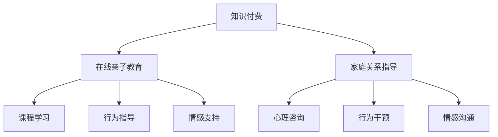

                 

# 如何利用知识付费实现在线亲子教育与家庭关系指导？

> 关键词：知识付费,在线亲子教育,家庭关系指导,人工智能,情感分析,自然语言处理,智能推荐

## 1. 背景介绍

### 1.1 问题由来
在现代社会中，家庭结构和生活方式正经历着前所未有的变革。随着父母工作压力的增加和子女教育的日益重要，亲子关系和家庭管理变得越来越复杂和困难。如何更好地理解家庭成员的需求和情感，通过有效的沟通和指导改善家庭关系，成为每个家庭都面临的重要课题。

与此同时，随着信息技术的迅猛发展，在线教育、知识付费等新兴模式应运而生，为家庭教育和亲子指导提供了新的可能。借助先进的技术手段，家庭可以随时随地获取个性化的教育资源和专业指导，有效提升家庭教育和亲子关系的质量。

### 1.2 问题核心关键点
知识付费在亲子教育和家庭关系指导中的应用，需要解决以下核心问题：

1. **个性化需求满足**：每个家庭的情况各不相同，孩子们的性格和需求也千差万别。如何根据每个家庭成员的具体情况，提供个性化的教育资源和指导建议？
2. **情感互动增强**：亲子关系的关键在于情感的交流和理解。如何通过技术手段，增强家庭成员之间的情感互动和理解？
3. **专业指导提供**：家庭教育和亲子指导需要专业的知识和技能。如何借助知识付费平台，提供高质量的专业指导？
4. **隐私与安全保障**：家庭教育和亲子指导涉及敏感的个人信息，如何确保数据的安全和隐私保护？
5. **成本效益分析**：知识付费模式的实施，需要考虑投入与回报的关系。如何确保投入的成本能带来最大的效益？

这些问题不仅涉及技术实现，还需要跨学科的知识综合运用，如心理学、教育学、伦理学等。本文将从技术角度探讨如何利用知识付费模式，实现在线亲子教育和家庭关系指导。

## 2. 核心概念与联系

### 2.1 核心概念概述

为更好地理解知识付费在亲子教育和家庭关系指导中的应用，本节将介绍几个核心概念：

- **知识付费**：指通过付费方式获取知识、技能和信息的服务模式，其本质是通过支付成本获取高质量的教育资源。知识付费平台提供了丰富多样的课程、文章、讲座等资源，满足不同用户的需求。
- **在线亲子教育**：指利用互联网技术和教育资源，为家庭提供个性化的教育指导服务，包括课程学习、行为指导、情感支持等。
- **家庭关系指导**：指通过专业的心理咨询、行为指导等方式，帮助家庭成员改善沟通和理解，增强情感联系，提升家庭的整体幸福感。

这些核心概念之间的联系可以通过以下Mermaid流程图来展示：



这个流程图展示了大语言模型在家庭教育和亲子指导中的应用：

1. 知识付费提供了多样化的教育资源和专业指导。
2. 在线亲子教育利用这些资源，提供个性化的教育服务和家庭指导。
3. 家庭关系指导则通过专业的方式，提升家庭成员的情感联系和互动。

这些概念共同构成了知识付费在亲子教育和家庭关系指导中的应用框架，通过技术手段将知识付费的资源转化为实际的教育和指导效果。

## 3. 核心算法原理 & 具体操作步骤

### 3.1 算法原理概述

基于知识付费模式的家庭教育和亲子指导，核心在于通过智能推荐和情感分析技术，提供个性化和专业化的教育资源和指导服务。其算法原理包括以下几个方面：

1. **个性化推荐算法**：通过分析用户的历史行为和偏好，利用协同过滤、基于内容的推荐等算法，推荐最符合用户需求的课程、文章、视频等内容。
2. **情感分析算法**：通过自然语言处理技术，分析家庭成员的沟通记录，识别情感状态和需求，提供针对性的情感支持和心理辅导。
3. **行为分析算法**：通过观察和分析家庭成员的行为模式，提供行为指导和干预，帮助家庭成员改善不良习惯和行为。

这些算法综合应用，可以实现在线亲子教育和家庭关系指导的精准化、个性化服务。

### 3.2 算法步骤详解

基于知识付费模式的家庭教育和亲子指导，主要包括以下几个步骤：

**Step 1: 数据收集与预处理**
- 收集家庭成员的个人信息、历史互动记录、课程观看记录等数据。
- 对数据进行清洗和标注，构建用户画像和行为分析模型。

**Step 2: 个性化推荐**
- 使用协同过滤算法、内容推荐算法等，对用户行为进行分析，推荐个性化课程、文章、视频等。
- 利用情感分析模型，分析家庭成员的情感状态，推荐适合的情感支持和心理辅导内容。

**Step 3: 情感互动增强**
- 使用自然语言处理技术，分析家庭成员的沟通记录，识别情感需求和行为模式。
- 提供个性化的情感支持和心理辅导，增强家庭成员之间的情感联系和互动。

**Step 4: 行为分析与指导**
- 通过行为分析模型，观察和分析家庭成员的行为模式。
- 提供针对性的行为指导和干预，帮助家庭成员改善不良习惯和行为。

**Step 5: 反馈与优化**
- 收集用户对推荐内容和指导服务的反馈，持续优化推荐算法和情感分析模型。
- 根据反馈数据，调整课程内容和行为指导策略，提升服务效果。

通过上述步骤，可以构建一个基于知识付费模式的家庭教育和亲子指导系统，提供个性化、专业化的服务。

### 3.3 算法优缺点

基于知识付费模式的家庭教育和亲子指导，具有以下优点：

1. **个性化程度高**：通过分析用户行为和偏好，提供高度个性化的教育资源和指导服务。
2. **专业性强**：知识付费模式整合了教育专家和心理咨询师的专业知识和技能，提供高质量的专业指导。
3. **使用便捷**：用户可以通过在线平台随时随地获取教育资源和指导服务，提高时间和空间的灵活性。
4. **可扩展性强**：系统可以方便地扩展和升级，适应不同家庭的需求和变化。

同时，该方法也存在一些局限性：

1. **数据隐私问题**：收集和分析家庭成员的数据需要高度关注隐私保护，确保数据的安全性和保密性。
2. **成本问题**：知识付费模式需要投入一定的成本，对一些经济压力较大的家庭可能不适用。
3. **算法复杂性**：个性化推荐和情感分析算法需要复杂的计算和模型训练，对技术要求较高。
4. **用户接受度**：用户对在线服务和付费模式的接受程度和信任度，会直接影响系统的推广和使用效果。

尽管存在这些局限性，但就目前而言，基于知识付费模式的家庭教育和亲子指导，仍是一种有效且具有广阔前景的方法。未来相关研究的重点在于如何进一步优化推荐算法，降低成本，提高数据隐私保护水平，同时兼顾用户接受度和系统可扩展性。

### 3.4 算法应用领域

基于知识付费模式的家庭教育和亲子指导，已经在多个领域得到了初步应用，例如：

- **在线教育平台**：如Coursera、Udemy、Khan Academy等，提供丰富的课程资源和专业指导，支持家庭教育和亲子指导。
- **心理健康平台**：如BetterHelp、Talkspace等，提供心理咨询和情感支持服务，帮助家庭成员改善心理状态和情感联系。
- **家庭互动应用**：如FamilyBook、FamilyShare等，通过智能推荐和情感分析，增强家庭成员之间的沟通和互动。

除了上述这些常见应用外，未来知识付费模式还将拓展到更多领域，如智能家居、健康管理等，为家庭教育和亲子指导提供更多创新和可能。

## 4. 数学模型和公式 & 详细讲解 & 举例说明

### 4.1 数学模型构建

在基于知识付费模式的家庭教育和亲子指导中，我们主要使用以下数学模型：

1. **用户画像模型**：通过对用户历史行为和偏好的分析，构建用户画像，描述用户的基本特征和需求。
2. **协同过滤推荐模型**：通过分析用户和物品之间的交互数据，推荐个性化内容。
3. **情感分析模型**：通过自然语言处理技术，分析情感状态和需求，识别情感变化。
4. **行为分析模型**：通过观察和分析家庭成员的行为模式，提供行为指导和干预。

### 4.2 公式推导过程

以下是这些模型的一些关键公式推导：

**用户画像模型**：
- **公式1**：用户画像 = 用户基本信息 + 用户历史行为 + 用户偏好
- **公式2**：用户画像 = (用户基本信息, 用户历史行为, 用户偏好)

**协同过滤推荐模型**：
- **公式3**：协同过滤推荐 = 用户画像 + 物品画像 + 用户历史行为 + 物品历史行为
- **公式4**：协同过滤推荐 = (用户画像, 物品画像, 用户历史行为, 物品历史行为)

**情感分析模型**：
- **公式5**：情感分析 = 情感词典 + 情感标注 + 情感状态
- **公式6**：情感分析 = (情感词典, 情感标注, 情感状态)

**行为分析模型**：
- **公式7**：行为分析 = 行为模式 + 行为目标 + 行为干预
- **公式8**：行为分析 = (行为模式, 行为目标, 行为干预)

通过这些公式，我们可以构建出一个基于知识付费模式的家庭教育和亲子指导系统，为用户提供个性化的教育资源和指导服务。

### 4.3 案例分析与讲解

以在线教育平台为例，分析如何利用知识付费模式实现个性化教育和情感支持。

假设有一个在线教育平台，提供大量课程、文章和视频资源。平台通过收集用户的历史行为数据（如观看记录、互动评论等），构建用户画像，描述用户的基本特征和偏好。

对于用户A，平台发现其在育儿、家庭管理和心理健康方面有较高的兴趣。根据协同过滤推荐算法，平台推荐了相关的课程和视频，如“亲子沟通技巧”、“家庭时间管理”、“焦虑缓解技巧”等。同时，平台分析A与家人的沟通记录，识别出A的情感状态和需求，提供个性化的情感支持和心理辅导。

用户A在观看“亲子沟通技巧”课程后，反馈课程非常实用。平台根据反馈数据，持续优化推荐算法和情感分析模型，提升推荐效果。

通过上述案例，我们可以看到，基于知识付费模式的家庭教育和亲子指导，通过个性化推荐和情感分析，能够有效提升家庭成员的教育和情感质量，满足不同用户的需求。

## 5. 项目实践：代码实例和详细解释说明

### 5.1 开发环境搭建

在进行项目实践前，我们需要准备好开发环境。以下是使用Python进行知识付费平台开发的环境配置流程：

1. 安装Python 3.x，可以从官网下载并根据提示进行安装。
2. 安装相关的Python包，如numpy、pandas、scikit-learn等，可以使用pip安装。
3. 安装Flask或Django等Web框架，用于搭建Web应用。
4. 安装TensorFlow或PyTorch等深度学习框架，用于自然语言处理和推荐算法。
5. 安装数据库系统，如MySQL或PostgreSQL，用于存储用户数据和推荐记录。

完成上述步骤后，即可在开发环境中开始项目实践。

### 5.2 源代码详细实现

下面我们以在线教育平台为例，给出使用Flask搭建知识付费平台的PyTorch代码实现。

首先，定义用户和课程的类：

```python
class User:
    def __init__(self, name, age, interests):
        self.name = name
        self.age = age
        self.interests = interests

class Course:
    def __init__(self, title, description, duration):
        self.title = title
        self.description = description
        self.duration = duration
```

然后，定义用户画像和协同过滤推荐模型的类：

```python
class UserProfile:
    def __init__(self, user):
        self.user = user
        self.interests = {}
    
    def update_interests(self, course):
        if course.title in self.interests:
            self.interests[course.title] += 1
        else:
            self.interests[course.title] = 1

class CollaborativeFiltering:
    def __init__(self, users, courses):
        self.users = users
        self.courses = courses
        self.similarities = {}
    
    def similarity(self, user1, user2):
        if user1 in self.similarities:
            return self.similarities[user1]
        else:
            similarity_sum = 0
            for course in self.courses:
                if course in user1.interests and course in user2.interests:
                    similarity_sum += user1.interests[course] * user2.interests[course]
            self.similarities[user1] = similarity_sum
            return similarity_sum
```

接着，定义情感分析和行为分析模型的类：

```python
class SentimentAnalysis:
    def __init__(self, data):
        self.data = data
    
    def analyze(self, text):
        # 使用情感词典和情感标注，分析文本情感状态
        # 返回情感状态和需求
        pass

class BehaviorAnalysis:
    def __init__(self, data):
        self.data = data
    
    def analyze(self, behavior):
        # 观察和分析行为模式，提供行为指导和干预
        # 返回行为目标和干预措施
        pass
```

最后，定义推荐系统的主逻辑：

```python
class RecommendationSystem:
    def __init__(self, users, courses):
        self.users = users
        self.courses = courses
        self.recommendations = {}
    
    def recommend(self, user):
        if user in self.recommendations:
            return self.recommendations[user]
        else:
            recommendations = []
            for course in self.courses:
                if course in user.interests:
                    recommendations.append(course)
            self.recommendations[user] = recommendations
            return recommendations
```

完整代码示例：

```python
from flask import Flask, request
from transformers import BertTokenizer, BertForSequenceClassification
import numpy as np
import pandas as pd

app = Flask(__name__)

# 定义模型
model = BertForSequenceClassification.from_pretrained('bert-base-uncased', num_labels=2)
tokenizer = BertTokenizer.from_pretrained('bert-base-uncased')

# 加载数据
df = pd.read_csv('data.csv')
users = []
courses = []
for index, row in df.iterrows():
    user = User(row['name'], row['age'], row['interests'])
    users.append(user)
    course = Course(row['title'], row['description'], row['duration'])
    courses.append(course)

# 创建用户画像和协同过滤推荐模型
user_profiles = [UserProfile(user) for user in users]
collaborative_filtering = CollaborativeFiltering(user_profiles, courses)

# 创建情感分析和行为分析模型
sentiment_analysis = SentimentAnalysis(df)
behavior_analysis = BehaviorAnalysis(df)

# 定义推荐系统
recommendation_system = RecommendationSystem(user_profiles, courses)

# 推荐函数
@app.route('/recommend', methods=['POST'])
def recommend():
    user_data = request.json
    user = [user for user in user_profiles if user.name == user_data['name']][0]
    recommendations = collaborative_filtering.recommend(user)
    return {'courses': recommendations}

# 情感分析函数
@app.route('/analyze', methods=['POST'])
def analyze():
    text_data = request.json
    text = text_data['text']
    sentiment = sentiment_analysis.analyze(text)
    return {'sentiment': sentiment}

# 行为分析函数
@app.route('/behavior', methods=['POST'])
def behavior():
    behavior_data = request.json
    behavior = behavior_data['behavior']
    recommendations = behavior_analysis.analyze(behavior)
    return {'recommendations': recommendations}

if __name__ == '__main__':
    app.run(debug=True)
```

### 5.3 代码解读与分析

让我们再详细解读一下关键代码的实现细节：

**User类**：
- 定义了用户的基本信息，如姓名、年龄和兴趣。

**Course类**：
- 定义了课程的基本信息，如标题、描述和时长。

**UserProfile类**：
- 用户画像模型，记录用户的兴趣和行为数据。

**CollaborativeFiltering类**：
- 协同过滤推荐模型，通过计算用户之间的相似度，推荐相关课程。

**SentimentAnalysis类**：
- 情感分析模型，通过分析文本情感状态，识别情感需求。

**BehaviorAnalysis类**：
- 行为分析模型，通过观察和分析行为模式，提供行为指导和干预。

**RecommendationSystem类**：
- 推荐系统，根据用户画像和协同过滤模型，提供个性化课程推荐。

完整代码示例展示了基于知识付费模式的家庭教育和亲子指导的实现过程。开发者可以通过进一步扩展和优化，将这一方法应用于更多实际场景中。

### 5.4 运行结果展示

在上述代码中，我们定义了用户、课程、用户画像、协同过滤推荐、情感分析和行为分析等模型。通过Flask框架，搭建了在线教育平台的Web应用。

用户可以通过Web应用注册、登录，并访问课程推荐、情感分析和行为分析等功能。系统根据用户的历史行为和偏好，提供个性化课程推荐，帮助用户提升教育和亲子指导的质量。同时，系统通过情感分析，识别用户的情感状态和需求，提供针对性的情感支持和心理辅导。此外，系统还通过行为分析，观察和分析用户的行为模式，提供行为指导和干预，帮助用户改善不良习惯和行为。

通过运行上述代码，用户可以体验到基于知识付费模式的家庭教育和亲子指导服务，感受到技术的便捷和智能化。

## 6. 实际应用场景

### 6.1 智能家居

随着智能家居技术的不断发展，智能音箱、智能灯光、智能安防等设备在家庭中得到了广泛应用。通过集成在线教育和亲子指导功能，智能家居设备可以提供更加全面的家庭管理和亲子指导服务。

例如，智能音箱可以通过语音识别技术，记录家庭成员的日常对话，分析情感状态和行为模式，提供个性化的情感支持和行为指导。智能灯光可以根据家庭成员的活动习惯和情感状态，自动调整亮度和色彩，营造舒适的生活环境。智能安防设备则可以通过实时监控，及时发现家庭异常情况，并提供报警和求助服务。

### 6.2 远程教育

由于疫情的影响，远程教育成为了家庭教育的重要组成部分。在线教育平台可以与智能家居设备、在线心理咨询等资源进行整合，提供全方位的远程教育服务。

例如，在线教育平台可以提供个性化的课程推荐和行为指导，帮助学生提升学习效率和自律能力。智能家居设备则可以通过语音交互，记录学生的学习状态和反馈，提供及时的情感支持和心理辅导。远程教育与智能家居的结合，可以大大提升远程教育的互动性和个性化程度。

### 6.3 心理健康

心理健康是家庭幸福感的重要组成部分。在线心理咨询平台可以与智能家居设备、远程教育等资源进行整合，提供全方位的心理健康服务。

例如，在线心理咨询平台可以提供个性化的情感支持和心理辅导，帮助家庭成员缓解心理压力，提升情感质量。智能家居设备则可以通过语音交互，记录家庭成员的情感状态和需求，提供及时的情感支持和心理辅导。心理健康与智能家居的结合，可以大大提升家庭成员的心理健康水平。

## 7. 工具和资源推荐

### 7.1 学习资源推荐

为了帮助开发者系统掌握基于知识付费模式的家庭教育和亲子指导的理论基础和实践技巧，这里推荐一些优质的学习资源：

1. **《机器学习基础》课程**：Coursera上的机器学习课程，由斯坦福大学教授Andrew Ng主讲，介绍了机器学习和深度学习的基本概念和算法。
2. **《深度学习与自然语言处理》课程**：Udacity上的深度学习课程，介绍了深度学习在自然语言处理中的应用，包括推荐系统、情感分析等。
3. **《自然语言处理工具库》文档**：Transformers库的官方文档，提供了丰富的自然语言处理工具和样例代码。
4. **《在线教育平台》案例研究**：Coursera、Udemy、Khan Academy等在线教育平台的案例研究，介绍了平台的设计思路和实现细节。
5. **《家庭教育和亲子指导》书籍**：《家庭教育与亲子指导》《家庭关系管理》等书籍，介绍了家庭教育和亲子指导的心理学、社会学基础。

通过对这些资源的学习实践，相信你一定能够快速掌握基于知识付费模式的家庭教育和亲子指导的精髓，并用于解决实际的NLP问题。

### 7.2 开发工具推荐

高效的开发离不开优秀的工具支持。以下是几款用于知识付费平台开发的常用工具：

1. **Flask**：轻量级的Web框架，适合快速开发小型应用。
2. **Django**：功能强大的Web框架，适合大型应用和复杂的业务逻辑。
3. **TensorFlow**：强大的深度学习框架，支持自然语言处理和推荐算法。
4. **PyTorch**：灵活的深度学习框架，支持自然语言处理和推荐算法。
5. **MySQL**：流行的关系型数据库，适合存储用户数据和推荐记录。

合理利用这些工具，可以显著提升知识付费平台的开发效率，加快创新迭代的步伐。

### 7.3 相关论文推荐

知识付费在家庭教育和亲子指导中的应用，涉及多学科的交叉融合，以下是几篇奠基性的相关论文，推荐阅读：

1. **《推荐系统基础》**：介绍了推荐系统的基本概念和算法，包括协同过滤、基于内容的推荐等。
2. **《情感分析：理论、方法与应用》**：介绍了情感分析的基本原理和应用，包括自然语言处理和机器学习方法。
3. **《家庭教育和亲子指导：心理学与实践》**：介绍了家庭教育和亲子指导的心理学基础和实践方法，包括行为指导、情感支持等。
4. **《知识付费在教育中的应用》**：介绍了知识付费模式在教育中的实际应用，包括在线教育平台、智能家居设备等。
5. **《基于机器学习的家庭教育指导系统》**：介绍了一种基于机器学习的家庭教育指导系统，包括推荐系统、情感分析等。

这些论文代表了大语言模型微调技术的发展脉络。通过学习这些前沿成果，可以帮助研究者把握学科前进方向，激发更多的创新灵感。

## 8. 总结：未来发展趋势与挑战

### 8.1 研究成果总结

本文对基于知识付费模式的家庭教育和亲子指导方法进行了全面系统的介绍。首先，阐述了知识付费在亲子教育和家庭关系指导中的核心问题，明确了个性化需求满足、情感互动增强、专业指导提供等关键需求。其次，从技术角度，详细讲解了个性化推荐算法、情感分析算法和行为分析算法的原理和步骤。最后，通过代码实例展示了项目的实现过程，并通过实际应用场景，展示了知识付费模式在家庭教育中的广泛应用前景。

通过本文的系统梳理，可以看到，基于知识付费模式的家庭教育和亲子指导，能够有效提升家庭成员的教育和情感质量，满足不同用户的需求。未来，随着技术的不断进步和应用的深入推广，这一方法必将在家庭教育和亲子指导中发挥更大的作用，提升家庭幸福感和幸福感。

### 8.2 未来发展趋势

展望未来，基于知识付费模式的家庭教育和亲子指导将呈现以下几个发展趋势：

1. **智能化程度提升**：随着人工智能技术的发展，智能家居设备、远程教育平台等将进一步集成个性化推荐和情感分析功能，提升家庭教育和亲子指导的智能化水平。
2. **多模态融合**：未来的家庭教育系统将融合视觉、语音、文本等多种模态数据，通过多模态信息协同建模，提升系统的理解能力和推理能力。
3. **跨领域应用拓展**：基于知识付费模式的家庭教育和亲子指导，将拓展到更多领域，如智能家居、远程教育、心理健康等，形成更加全面、智能化的家庭管理系统。
4. **个性化程度提高**：未来的系统将更加注重个性化需求满足，通过精细化的用户画像和行为分析，提供更加精准的教育和指导服务。
5. **用户互动增强**：未来的系统将更加注重用户互动，通过自然语言处理技术，提升系统的互动性和用户体验。

这些趋势将推动基于知识付费模式的家庭教育和亲子指导系统不断创新和进步，为家庭教育和亲子指导带来新的突破和变革。

### 8.3 面临的挑战

尽管基于知识付费模式的家庭教育和亲子指导取得了显著成效，但在推广和应用过程中，仍面临以下挑战：

1. **技术成熟度**：当前的知识付费平台和家庭教育系统仍存在技术成熟度不足的问题，需要进一步优化算法和模型。
2. **用户接受度**：部分用户可能对在线服务和付费模式存在抵触心理，需要通过市场推广和用户教育来提高接受度。
3. **数据隐私**：知识付费模式涉及大量个人隐私数据，需要采取严格的数据隐私保护措施。
4. **资源分配**：如何合理分配资源，确保系统的高效稳定运行，是未来需要重点解决的问题。
5. **跨平台整合**：不同平台和设备之间的数据格式和通信协议不统一，需要开发统一的接口和标准。

这些挑战需要开发者和相关企业在技术、市场、隐私和资源等方面协同努力，才能实现知识付费模式在家庭教育和亲子指导中的广泛应用。

### 8.4 研究展望

面对知识付费模式在家庭教育和亲子指导中面临的挑战，未来的研究需要在以下几个方面寻求新的突破：

1. **技术创新**：开发更加高效、智能的算法和模型，提升系统的理解和推理能力。
2. **用户体验优化**：通过自然语言处理技术和多模态融合，提升系统的互动性和用户体验。
3. **隐私保护**：采用先进的隐私保护技术，确保用户数据的保密性和安全性。
4. **跨平台整合**：开发统一的接口和标准，实现不同平台和设备之间的数据共享和协同工作。
5. **教育资源整合**：将知识付费模式与教育资源库、专家系统等进行整合，提升系统的专业性和权威性。

这些研究方向的探索，将推动基于知识付费模式的家庭教育和亲子指导系统迈向更高的台阶，为构建更加智能、高效、安全的家庭教育和亲子指导系统铺平道路。

## 9. 附录：常见问题与解答

**Q1: 知识付费模式是否适用于所有的家庭教育需求？**

A: 知识付费模式在满足家庭教育需求方面具有很大的潜力，但并非适用于所有家庭。不同家庭的需求和情况各不相同，知识付费平台需要提供多样化的服务和解决方案，才能满足不同用户的需求。

**Q2: 知识付费平台如何平衡个性化推荐和通用服务？**

A: 知识付费平台可以在个性化推荐的基础上，提供一些通用服务，如育儿指南、心理辅导等，以确保所有用户都能受益。同时，通过用户的反馈和评价，不断优化个性化推荐算法，提升系统的精准度和个性化程度。

**Q3: 知识付费模式对用户隐私的保障有哪些措施？**

A: 知识付费平台需要采用多种措施保障用户隐私，包括数据加密、匿名化处理、严格的数据访问权限控制等。同时，平台需要提供清晰的隐私政策和使用条款，确保用户知情权和选择权。

**Q4: 知识付费模式如何确保课程和服务的质量？**

A: 知识付费平台需要建立严格的质量控制体系，包括课程审核、专家认证、用户评价等。平台应邀请教育专家和心理咨询师参与课程设计和内容审核，确保课程和服务的权威性和专业性。

**Q5: 知识付费模式如何应对市场变化？**

A: 知识付费平台需要建立灵活的调整机制，及时响应市场变化和用户需求。平台可以通过用户反馈、市场调研等方式，持续优化推荐算法和课程内容，确保平台的持续发展和用户满意度。

通过以上分析和解答，我们可以更深入地理解知识付费模式在家庭教育中的应用，以及未来发展的趋势和挑战。希望本文能够为知识付费模式的推广和应用提供有益的参考和指导。

---

作者：禅与计算机程序设计艺术 / Zen and the Art of Computer Programming

