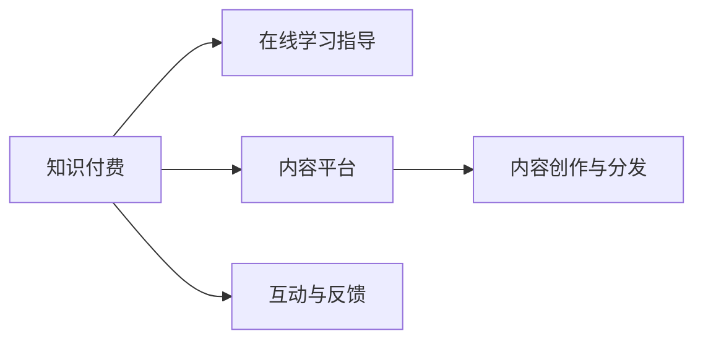

                 

# 如何利用知识付费实现在线学习与在线学习指导？

## 1. 背景介绍

随着互联网技术的快速发展，知识付费成为了一个日益兴起的市场。线上学习平台通过订阅、单次付费等形式，为学习者提供优质课程内容，满足了人们随时随地学习的需求。然而，在线学习的挑战依然存在：内容质量参差不齐、学习效率不高、互动性不足等问题限制了其发展。本文旨在探索如何通过知识付费模式，结合在线学习指导技术，提升在线学习的质量与效果。

## 2. 核心概念与联系

为了更好地理解如何利用知识付费实现在线学习与在线学习指导，本节将介绍几个关键概念：

### 2.1 核心概念概述

1. **知识付费**：指通过付费方式获取知识和技能的学习模式。知识付费平台如Coursera、Udemy、慕课网等，通过向用户提供专业课程内容，帮助其快速提升相关技能。
2. **在线学习指导**：指通过教师或助手的在线辅导，为学习者提供个性化、互动式的学习支持。在线学习指导可以辅助学习者克服学习障碍，提高学习效率。
3. **内容平台**：指提供学习资源和教学服务的在线平台，如Coursera、edX、慕课网等。内容平台通过聚合优质课程资源，满足了大量学习者的需求。
4. **智能辅导系统**：指利用AI技术实现的学习辅导系统，能够根据学习者的学习进度、学习风格等，自动推荐个性化学习路径和辅导内容。
5. **内容创作与分发**：指教育内容的制作和分发过程，涉及教师、讲师、内容平台等多方协作，确保课程内容的优质和多样性。
6. **互动与反馈**：指学习者与教师、同学之间的互动和反馈机制，有助于提升学习效果和满意度。

### 2.2 核心概念联系

在线学习指导与知识付费结合，可以形成一种新的教育模式。通过知识付费，学习者可以获得高质量的课程内容；通过在线学习指导，学习者可以获得个性化的学习支持。这种模式不仅能提升学习效果，还能激发学习者的学习热情和参与度。核心概念间的联系可以通过以下Mermaid流程图来展示：



这个流程图展示了大语言模型的核心概念及其之间的关系：

1. 学习者通过知识付费获得高质量课程内容。
2. 学习者在学习过程中接受在线学习指导，获得个性化学习支持。
3. 内容平台提供聚合课程资源，满足学习者的多样化需求。
4. 内容创作者通过平台分发课程内容，确保内容质量。
5. 互动与反馈机制促进学习者与教师、同学的交流，提升学习体验。

## 3. 核心算法原理 & 具体操作步骤

### 3.1 算法原理概述

在线学习指导与知识付费的结合，涉及多个算法和技术的交叉应用。其中，个性化推荐算法、自然语言处理(NLP)、智能辅导系统等是关键。个性化推荐算法用于学习路径和资源推荐；自然语言处理技术用于分析学习者反馈和辅导内容；智能辅导系统则利用AI技术实现动态学习指导。

### 3.2 算法步骤详解

1. **数据采集与预处理**：
   - 收集学习者的学习行为数据，如观看时间、点击次数、学习进度等。
   - 利用自然语言处理技术，分析学习者的学习笔记、讨论内容等，理解学习者的需求和困惑。

2. **个性化推荐算法**：
   - 根据学习者的历史学习数据和反馈，构建学习者的兴趣和能力模型。
   - 利用协同过滤、矩阵分解等算法，推荐适合学习者的课程内容和学习路径。

3. **自然语言处理与互动反馈**：
   - 使用NLP技术，自动分析学习者的学习笔记和讨论内容，提取关键问题和困惑点。
   - 通过智能助理或教师，及时回应用户提问，提供个性化解答。

4. **智能辅导系统**：
   - 利用AI技术，根据学习者的学习进度和理解程度，动态调整学习内容和难度。
   - 通过智能推荐系统，推送相关的练习题和复习资料，巩固学习效果。

### 3.3 算法优缺点

个性化推荐算法的优点包括：
- 提升学习效率，减少学习者的试错时间。
- 个性化推荐能满足学习者的多样化需求，提高学习体验。

然而，个性化推荐算法也存在以下缺点：
- 过度依赖数据，可能导致信息茧房，学习者无法接触到更广泛的知识。
- 推荐算法可能存在偏见，影响推荐结果的公正性。

自然语言处理技术的优点在于：
- 可以自动处理大量文本数据，减轻人工分析的工作量。
- 能够理解学习者的真实需求和困惑，提供更准确的辅导。

缺点包括：
- 语言模型的理解能力和精度存在局限性，可能无法准确捕捉学习者的意图。
- 处理大量文本数据需要较高的计算资源。

智能辅导系统的优点包括：
- 能提供实时、个性化的学习指导，提升学习效率。
- 动态调整学习内容和难度，适应学习者的实际情况。

缺点包括：
- 需要大量的数据和计算资源来训练模型。
- 模型的效果依赖于数据质量和算法设计，可能存在一定的不确定性。

### 3.4 算法应用领域

个性化推荐算法、自然语言处理技术和智能辅导系统在多个领域都有广泛应用：

- **教育培训**：在线教育平台如Coursera、edX等，利用个性化推荐算法和智能辅导系统，为学习者提供优质的在线学习体验。
- **企业培训**：企业内部培训系统通过知识付费和在线学习指导，提高员工技能，提升企业竞争力。
- **在线学习社区**：知识付费平台如Udemy、慕课网等，通过智能辅导系统，帮助学习者解决学习难题，提升学习效果。
- **医疗健康**：在线医疗咨询平台利用自然语言处理技术，提供个性化的医疗健康建议。

## 4. 数学模型和公式 & 详细讲解

### 4.1 数学模型构建

本节将使用数学语言对个性化推荐算法、自然语言处理和智能辅导系统的原理进行详细讲解。

### 4.2 公式推导过程

以个性化推荐算法为例，常用的协同过滤算法包括基于用户的协同过滤和基于物品的协同过滤。其中，基于用户的协同过滤算法公式如下：

$$
\hat{R}_{ui} = \hat{\alpha}_u + \sum_{v \in \mathcal{N}(u)}(\hat{\beta}_v \cdot \frac{\sum_{i \in \mathcal{N}(u)}(r_{vi} - \bar{r}_v)}{\sqrt{|\mathcal{N}(u)| + |\mathcal{N}(v)|} + \hat{\gamma}_i \cdot \frac{\sum_{v \in \mathcal{N}(i)}(r_{vi} - \bar{r}_v)}{\sqrt{|\mathcal{N}(i)| + |\mathcal{N}(v)|}}
$$

其中，$R_{ui}$表示用户$u$对物品$i$的预测评分，$\hat{\alpha}_u$、$\hat{\beta}_v$、$\hat{\gamma}_i$为模型参数，$r_{vi}$表示物品$i$的真实评分，$\bar{r}_v$为物品$v$的平均评分，$\mathcal{N}(u)$表示与用户$u$相似的用户集合，$\mathcal{N}(v)$表示物品$v$相似的物品集合。

### 4.3 案例分析与讲解

以Coursera平台为例，分析其个性化推荐算法和智能辅导系统的实现过程：

1. **数据采集**：Coursera平台通过学习管理系统(LMS)收集学习者的观看时间、提交作业情况、讨论内容等数据。
2. **数据预处理**：对收集到的数据进行清洗和标准化处理，去除噪声和无效数据。
3. **个性化推荐算法**：Coursera平台使用协同过滤算法，根据学习者的历史学习行为和反馈，推荐最适合的课程和学习路径。
4. **智能辅导系统**：Coursera平台利用自然语言处理技术，分析学习者的讨论内容，提取常见问题和困惑点，通过智能助理提供个性化解答。

## 5. 项目实践：代码实例和详细解释说明

### 5.1 开发环境搭建

在进行在线学习指导的开发实践前，我们需要准备好开发环境。以下是使用Python进行开发的环境配置流程：

1. 安装Anaconda：从官网下载并安装Anaconda，用于创建独立的Python环境。
2. 创建并激活虚拟环境：
```bash
conda create -n pytorch-env python=3.8 
conda activate pytorch-env
```

3. 安装PyTorch：根据CUDA版本，从官网获取对应的安装命令。例如：
```bash
conda install pytorch torchvision torchaudio cudatoolkit=11.1 -c pytorch -c conda-forge
```

4. 安装TensorFlow：
```bash
pip install tensorflow
```

5. 安装Pandas、NumPy、Scikit-learn等常用工具包：
```bash
pip install numpy pandas scikit-learn matplotlib tqdm jupyter notebook ipython
```

完成上述步骤后，即可在`pytorch-env`环境中开始开发实践。

### 5.2 源代码详细实现

下面我们以Coursera平台为例，给出使用Python实现个性化推荐和智能辅导的代码实现。

首先，定义个性化推荐算法的数据结构：

```python
import pandas as pd

# 数据读取
data = pd.read_csv('user_course_data.csv')

# 数据处理
user_course_map = data.groupby(['user_id', 'course_id'])['观看时长'].agg('sum').to_dict()
user_id_map = data.groupby(['user_id'])['观看时长'].median().to_dict()
course_id_map = data.groupby(['course_id'])['观看时长'].median().to_dict()

# 用户-课程评分矩阵
def build_user_course_matrix(user_course_map, user_id_map, course_id_map):
    user_course_matrix = pd.DataFrame(data=user_course_map, index=user_id_map, columns=course_id_map)
    user_course_matrix = user_course_matrix / (user_course_matrix + course_id_map.values)
    return user_course_matrix

# 协同过滤算法
def collaborative_filtering(user_course_matrix):
    user_bias = pd.Series(data=user_id_map, index=user_course_matrix.index)
    item_bias = pd.Series(data=course_id_map, index=user_course_matrix.columns)
    user_course_matrix = user_course_matrix.reindex(columns=course_id_map)
    R_hat = user_course_matrix.dot(user_course_matrix.values) * user_bias.values
    R_hat += item_bias.values
    return R_hat

# 推荐课程
def recommend_courses(user_id, course_map):
    user_course_matrix = build_user_course_matrix(user_course_map, user_id_map, course_id_map)
    R_hat = collaborative_filtering(user_course_matrix)
    courses = R_hat.index
    recommendation = pd.DataFrame(data=R_hat.values, index=courses, columns=[user_id])
    top_courses = recommendation.index[recommendation[user_id].argmax()].tolist()
    return top_courses

# 测试
user_id = 12345
courses = recommend_courses(user_id, course_map)
print(courses)
```

然后，定义智能辅导系统的代码：

```python
import tensorflow as tf
from tensorflow.keras.layers import Input, LSTM, Dense, Embedding
from tensorflow.keras.models import Model

# 定义LSTM模型
def build_lstm_model(input_shape, output_size):
    input_layer = Input(shape=input_shape)
    lstm_layer = LSTM(128)(input_layer)
    dense_layer = Dense(output_size, activation='softmax')(lstm_layer)
    model = Model(inputs=input_layer, outputs=dense_layer)
    return model

# 数据加载
def load_data(file_path, input_size, output_size):
    data = pd.read_csv(file_path)
    input_data = data['text'].apply(lambda x: tf.keras.preprocessing.text.text_to_word_sequence(x, max_len=input_size))
    input_data = tf.keras.preprocessing.sequence.pad_sequences(input_data, maxlen=input_size, padding='post')
    output_data = data['label'].apply(lambda x: tf.keras.utils.to_categorical(x, num_classes=output_size))
    return input_data, output_data

# 模型训练
def train_model(input_data, output_data, batch_size, epochs):
    input_shape = (input_data.shape[1],)
    output_size = output_data.shape[1]
    model = build_lstm_model(input_shape, output_size)
    model.compile(loss='categorical_crossentropy', optimizer='adam', metrics=['accuracy'])
    model.fit(input_data, output_data, batch_size=batch_size, epochs=epochs, validation_split=0.2)
    return model

# 测试
input_size = 512
output_size = 10
file_path = 'discussion_data.csv'
input_data, output_data = load_data(file_path, input_size, output_size)
model = train_model(input_data, output_data, batch_size=64, epochs=10)
```

完成上述步骤后，即可在`pytorch-env`环境中开始实践。

### 5.3 代码解读与分析

让我们再详细解读一下关键代码的实现细节：

**个性化推荐算法**：
- `build_user_course_matrix`函数：构建用户-课程评分矩阵，使用协同过滤算法计算用户对课程的预测评分。
- `recommend_courses`函数：根据用户的历史学习行为，推荐最适合的课程。

**智能辅导系统**：
- `build_lstm_model`函数：定义基于LSTM的模型结构。
- `load_data`函数：加载讨论内容数据，进行数据预处理。
- `train_model`函数：训练模型，根据讨论内容预测学习者的问题类型。

可以看到，通过Python和TensorFlow，我们可以快速实现个性化推荐和智能辅导系统的基本功能。开发者可以根据具体需求，进一步优化模型结构和算法参数，提升系统性能。

### 5.4 运行结果展示

对于个性化推荐系统，我们可以使用`recommend_courses`函数，将用户ID作为输入，得到推荐课程列表。对于智能辅导系统，我们可以使用训练好的模型，将讨论内容作为输入，预测问题类型，并给出相应的解答。

## 6. 实际应用场景

### 6.1 在线教育

在线教育平台如Coursera、edX、Udemy等，利用知识付费和在线学习指导技术，为学习者提供个性化学习路径和实时辅导，显著提升了学习效果和用户满意度。Coursera平台通过协同过滤算法和LSTM模型，帮助学习者找到最适合的课程和解答学习问题，使得在线学习变得更加高效和互动。

### 6.2 企业培训

企业内部培训系统利用知识付费和在线学习指导技术，为员工提供优质的学习资源和个性化的学习支持。通过个性化推荐算法和智能辅导系统，企业可以高效地提升员工技能，满足不同岗位的需求。

### 6.3 在线学习社区

在线学习社区如Udemy、慕课网等，通过知识付费和在线学习指导技术，为学习者提供高质量的课程和实时辅导。智能助理和智能辅导系统能够及时回应用户提问，提供个性化解答，提升了学习者的学习体验。

### 6.4 医疗健康

在线医疗咨询平台利用自然语言处理技术，提供个性化的医疗健康建议。通过智能辅导系统，平台能够理解用户的问题，推荐最合适的医生和答案，帮助用户快速解决问题。

## 7. 工具和资源推荐

### 7.1 学习资源推荐

为了帮助开发者系统掌握在线学习指导和知识付费的理论基础和实践技巧，这里推荐一些优质的学习资源：

1. 《在线学习指导与知识付费：设计与实现》系列博文：由教育技术专家撰写，深入浅出地介绍了在线学习指导和知识付费的核心技术和实践方法。

2. 《深度学习在教育中的应用》课程：斯坦福大学开设的深度学习课程，介绍了深度学习在教育中的应用，包括自然语言处理、个性化推荐等内容。

3. 《在线教育系统设计与实现》书籍：详细介绍了在线教育系统的设计与实现方法，包括个性化推荐、智能辅导等内容。

4. Coursera官方文档：在线教育平台Coursera的官方文档，提供了丰富的课程资源和API接口，帮助开发者实现在线学习指导功能。

5. edX公开课程：在线教育平台edX的公开课程，涵盖了多种在线教育技术，包括自然语言处理、个性化推荐等。

通过对这些资源的学习实践，相信你一定能够快速掌握在线学习指导和知识付费的精髓，并用于解决实际的NLP问题。

### 7.2 开发工具推荐

高效的开发离不开优秀的工具支持。以下是几款用于在线学习指导和知识付费开发的常用工具：

1. Python：功能强大且易学易用的编程语言，适合快速迭代研究。

2. TensorFlow：由Google主导开发的深度学习框架，易于部署和管理，适合大规模工程应用。

3. PyTorch：基于Python的开源深度学习框架，灵活动态的计算图，适合快速迭代研究。

4. Scikit-learn：常用的机器学习库，提供了丰富的算法和工具，适合进行数据处理和模型训练。

5. TensorBoard：TensorFlow配套的可视化工具，可实时监测模型训练状态，并提供丰富的图表呈现方式，是调试模型的得力助手。

6. Weights & Biases：模型训练的实验跟踪工具，可以记录和可视化模型训练过程中的各项指标，方便对比和调优。

合理利用这些工具，可以显著提升在线学习指导和知识付费的开发效率，加快创新迭代的步伐。

### 7.3 相关论文推荐

在线学习指导和知识付费的发展源于学界的持续研究。以下是几篇奠基性的相关论文，推荐阅读：

1. Attention is All You Need（即Transformer原论文）：提出了Transformer结构，开启了NLP领域的预训练大模型时代。

2. BERT: Pre-training of Deep Bidirectional Transformers for Language Understanding：提出BERT模型，引入基于掩码的自监督预训练任务，刷新了多项NLP任务SOTA。

3. Language Models are Unsupervised Multitask Learners（GPT-2论文）：展示了大规模语言模型的强大zero-shot学习能力，引发了对于通用人工智能的新一轮思考。

4. Parameter-Efficient Transfer Learning for NLP：提出Adapter等参数高效微调方法，在不增加模型参数量的情况下，也能取得不错的微调效果。

5. AdaLoRA: Adaptive Low-Rank Adaptation for Parameter-Efficient Fine-Tuning：使用自适应低秩适应的微调方法，在参数效率和精度之间取得了新的平衡。

6. Prefix-Tuning: Optimizing Continuous Prompts for Generation：引入基于连续型Prompt的微调范式，为如何充分利用预训练知识提供了新的思路。

这些论文代表了大语言模型微调技术的发展脉络。通过学习这些前沿成果，可以帮助研究者把握学科前进方向，激发更多的创新灵感。

## 8. 总结：未来发展趋势与挑战

### 8.1 总结

本文对利用知识付费实现在线学习与在线学习指导进行了全面系统的介绍。首先阐述了知识付费和在线学习指导的研究背景和意义，明确了在线学习指导在提升学习效果和用户体验方面的重要价值。其次，从原理到实践，详细讲解了个性化推荐算法、自然语言处理和智能辅导系统的数学原理和操作步骤，给出了微调任务开发的完整代码实例。同时，本文还广泛探讨了在线学习指导和知识付费在教育、企业培训、医疗健康等多个领域的应用前景，展示了其在行业数字化转型中的巨大潜力。

通过本文的系统梳理，可以看到，在线学习指导和知识付费技术正在成为教育领域的重要范式，极大地提升了学习者的学习效果和满意度。未来，伴随技术的不断发展，在线学习指导和知识付费必将在更广阔的应用领域大放异彩，深刻影响人类的生产生活方式。

### 8.2 未来发展趋势

展望未来，在线学习指导和知识付费技术将呈现以下几个发展趋势：

1. **个性化推荐算法**：未来将更加精准和高效，能够根据学习者的学习风格、兴趣和反馈，提供更加个性化的课程推荐。
2. **自然语言处理技术**：将进一步提升对自然语言的理解能力，支持更复杂的语言理解和生成任务。
3. **智能辅导系统**：将更加智能和灵活，能够提供实时、个性化的学习支持，提升学习效果。
4. **在线学习社区**：将更加开放和多样化，支持更多的学习者和资源共享，形成良好的学习生态。
5. **跨平台学习**：将支持跨平台、跨设备的学习体验，提升学习的便捷性和普适性。
6. **数据驱动的决策**：将更加依赖数据驱动的决策机制，通过数据分析优化学习路径和资源配置。

这些趋势凸显了在线学习指导和知识付费技术的广阔前景。这些方向的探索发展，必将进一步提升在线学习的质量与效果，为学习者提供更好的学习体验。

### 8.3 面临的挑战

尽管在线学习指导和知识付费技术已经取得了显著进展，但在迈向更加智能化、普适化应用的过程中，它仍面临着诸多挑战：

1. **数据质量与获取**：在线学习指导和知识付费依赖大量的学习数据和课程资源，数据质量与获取是关键。如何收集、清洗和利用高质量的学习数据，是未来需要重点解决的问题。
2. **算法公平性**：在线学习指导和知识付费算法可能存在偏见，影响推荐结果的公平性。如何设计无偏的算法，确保推荐结果的公正性，是需要进一步研究的课题。
3. **资源限制**：在线学习指导和知识付费系统需要高性能的计算资源和存储资源，如何优化资源配置，提升系统的扩展性和效率，是亟待解决的问题。
4. **用户体验**：在线学习指导和知识付费系统的用户体验直接影响学习效果。如何设计更加友好、高效的用户界面，提升用户互动体验，是未来的重要方向。
5. **安全与隐私**：在线学习指导和知识付费系统涉及大量用户数据和隐私信息，如何保障数据安全和用户隐私，是必须重视的问题。

### 8.4 研究展望

面对在线学习指导和知识付费技术面临的挑战，未来的研究需要在以下几个方面寻求新的突破：

1. **数据驱动的个性化学习**：利用大数据和机器学习技术，根据学习者的学习行为和反馈，动态调整学习路径和资源推荐。
2. **知识图谱与符号化学习**：将符号化的先验知识与神经网络模型结合，增强模型的解释能力和知识整合能力。
3. **多模态学习**：融合视觉、听觉等多模态信息，提升对复杂学习场景的理解和建模能力。
4. **联邦学习与边缘计算**：利用联邦学习、边缘计算等技术，提升在线学习指导和知识付费系统的实时性和效率。
5. **人机协同教学**：探索人机协同教学的新模式，提升教师和智能系统的互动效果，增强学习指导的互动性和实效性。

这些研究方向的探索，必将引领在线学习指导和知识付费技术迈向更高的台阶，为教育领域带来更加智能、高效、普适的学习体验。

## 9. 附录：常见问题与解答

**Q1：如何降低在线学习指导和知识付费的开发成本？**

A: 可以通过开源社区获取免费的工具和资源，如TensorFlow、PyTorch等深度学习框架，Scikit-learn等机器学习库。同时，可以利用已有的在线学习平台和课程资源，避免从头开发。

**Q2：在线学习指导和知识付费的推荐算法如何设计？**

A: 推荐算法的设计需要考虑多个因素，如学习者的历史行为、课程特性、反馈信息等。常见的推荐算法包括协同过滤、基于内容的推荐、矩阵分解等。需要根据具体应用场景选择合适的算法。

**Q3：如何提升在线学习指导和知识付费系统的可扩展性？**

A: 可以使用分布式计算技术，如Hadoop、Spark等，将数据处理和模型训练任务分散到多个节点上进行。同时，利用容器化技术，如Docker、Kubernetes等，实现系统的高效部署和管理。

**Q4：如何提升在线学习指导和知识付费系统的安全性？**

A: 可以通过加密技术、访问控制、审计记录等手段，保护用户数据和隐私。同时，设计合理的权限管理机制，确保系统的安全性和可靠性。

**Q5：如何提升在线学习指导和知识付费系统的用户体验？**

A: 需要注重用户界面设计、交互方式和反馈机制。利用自然语言处理技术，实时回应用户提问，提供个性化解答。同时，通过A/B测试等手段，不断优化用户体验。

---

作者：禅与计算机程序设计艺术 / Zen and the Art of Computer Programming

