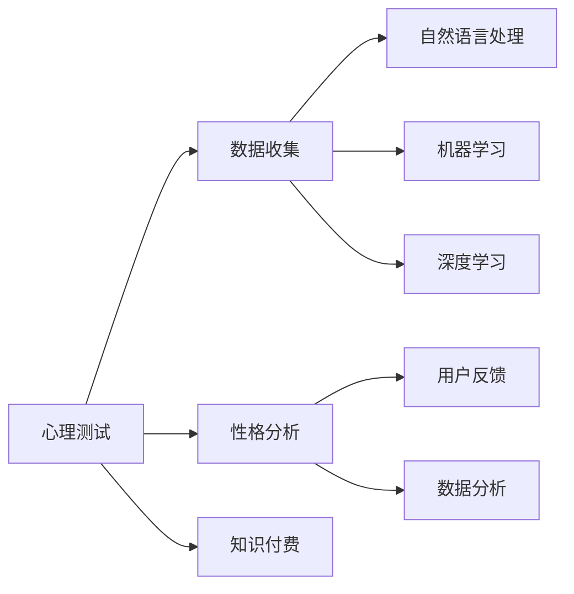
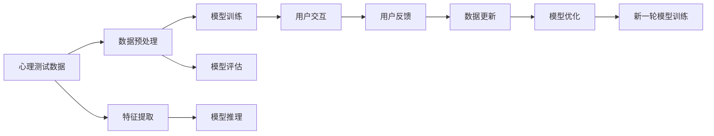

                 

# 如何利用知识付费实现在线心理测试与性格分析？

## 1. 背景介绍

随着人工智能技术的快速发展，在线心理测试与性格分析的应用越来越受到关注。尤其是知识付费平台，凭借其用户基数大、数据丰富等优势，成为心理测试与性格分析的重要应用场景。如何利用知识付费平台实现在线心理测试与性格分析，成为学术界和业界共同关注的问题。本文将系统介绍如何利用知识付费平台进行心理测试与性格分析，并详细讲解相关技术原理和实现方法。

## 2. 核心概念与联系

### 2.1 核心概念概述

为了更好地理解在线心理测试与性格分析的实现方法，我们先介绍一些相关核心概念：

- **心理测试**：一种通过各种测试手段，测量个体在智力、情感、性格等方面的心理特征的技术。心理测试广泛应用于心理健康评估、人才招聘、教育评估等领域。
- **性格分析**：通过分析个体的行为模式、思维特点、情感倾向等，揭示其性格特征的技术。性格分析有助于理解个体行为动机，优化人际关系，提升团队协作效率。
- **知识付费**：以知识内容为核心，通过在线平台向用户收取费用获取知识的技术模式。知识付费平台包括电子书、在线课程、音频等各类知识资源。
- **自然语言处理（NLP）**：研究计算机如何理解、处理和生成人类语言的技术，包括文本分类、情感分析、实体识别、对话系统等。
- **机器学习（ML）**：研究计算机如何从数据中学习规律、优化决策的技术，包括监督学习、无监督学习、强化学习等。
- **深度学习（DL）**：一种基于神经网络的机器学习方法，通过大量数据进行训练，提升模型的预测能力和泛化能力。

这些概念之间的联系可以通过以下Mermaid流程图来展示：



这个流程图展示了心理测试、性格分析与自然语言处理、机器学习、深度学习等技术的联系：

1. 心理测试和性格分析可以通过自然语言处理技术对用户输入的文本数据进行处理和分析。
2. 利用机器学习和深度学习技术，从大量数据中学习规律，提升模型的预测能力。
3. 知识付费平台可以收集用户付费获取的心理测试和性格分析数据，用于模型训练和优化。
4. 用户反馈可以用于模型迭代和改进，进一步提升模型的准确性和用户满意度。

### 2.2 核心概念原理和架构的 Mermaid 流程图



这个流程图展示了在线心理测试与性格分析的核心流程：

1. 收集用户进行心理测试或性格分析的文本数据。
2. 对数据进行预处理和特征提取，选择合适算法进行模型训练。
3. 利用机器学习和深度学习技术，进行模型推理，输出心理测试和性格分析结果。
4. 用户交互获取反馈，进一步优化模型，更新数据集。
5. 新一轮模型训练，循环迭代提升模型性能。

## 3. 核心算法原理 & 具体操作步骤

### 3.1 算法原理概述

在线心理测试与性格分析的核心在于利用自然语言处理和机器学习技术，对用户输入的文本数据进行分析和推理，获取心理测试和性格分析结果。具体而言，算法流程如下：

1. **数据收集**：收集用户在知识付费平台上填写的心理测试和性格分析问卷，记录其输入的文本数据。
2. **数据预处理**：对文本数据进行清洗、分词、去停用词等预处理操作，生成训练集。
3. **特征提取**：提取文本特征，如词频、TF-IDF、词向量等，作为模型的输入特征。
4. **模型训练**：利用监督学习算法，对特征和标签（即心理测试或性格分析结果）进行训练，得到模型参数。
5. **模型推理**：对新输入的文本数据进行特征提取，利用训练好的模型进行推理，输出心理测试或性格分析结果。
6. **用户反馈**：收集用户对模型推理结果的反馈，用于模型迭代和改进。
7. **模型优化**：根据用户反馈，更新数据集和模型参数，进一步优化模型性能。

### 3.2 算法步骤详解

接下来，我们详细介绍在线心理测试与性格分析的算法步骤：

#### 3.2.1 数据收集

心理测试和性格分析的数据通常来自用户填写的问卷或调查表。为了提高数据质量，需要收集大量用户数据，并对问卷进行合理设计，保证问卷的多样性和代表性。

具体来说，可以从知识付费平台上，收集用户填写的心理测试和性格分析问卷。可以设计多种心理测试和性格分析问卷，如MBTI性格测试、霍兰德职业倾向测试、EPQ情感状态问卷等。

#### 3.2.2 数据预处理

收集到的文本数据需要经过预处理，才能用于模型训练。常见的预处理操作包括：

1. **清洗数据**：去除噪音数据，如特殊符号、乱码等。
2. **分词**：将文本按照词进行切分，生成词汇列表。
3. **去除停用词**：去除常见但无实际意义的词汇，如“的”、“是”等。
4. **词向量表示**：将分词后的词汇转换为向量表示，如词袋模型、TF-IDF、Word2Vec、BERT等。

#### 3.2.3 特征提取

特征提取是将文本数据转换为模型可以处理的向量表示的过程。常用的特征提取方法包括：

1. **词袋模型（Bag of Words, BOW）**：将文本表示为一个词汇列表，不考虑词汇顺序。
2. **TF-IDF（Term Frequency-Inverse Document Frequency）**：根据词汇在文档中的频率和在整个语料库中的重要性，计算词汇权重。
3. **词向量（Word Embedding）**：通过神经网络训练得到词汇的向量表示，如Word2Vec、GloVe、BERT等。

#### 3.2.4 模型训练

模型训练是利用监督学习算法，对文本特征和标签进行训练，得到模型参数的过程。常用的监督学习算法包括：

1. **逻辑回归（Logistic Regression）**：用于二分类问题，输出概率值。
2. **支持向量机（Support Vector Machine, SVM）**：用于分类和回归问题，在高维空间中寻找最优超平面。
3. **决策树（Decision Tree）**：用于分类和回归问题，通过树形结构进行决策。
4. **随机森林（Random Forest）**：通过集成多个决策树，提升模型性能和泛化能力。
5. **深度学习模型（Deep Learning Model）**：如卷积神经网络（CNN）、循环神经网络（RNN）、长短期记忆网络（LSTM）、Transformer等，适用于复杂文本数据的处理。

#### 3.2.5 模型推理

模型推理是将新输入的文本数据，经过特征提取后，利用训练好的模型进行推理，输出心理测试或性格分析结果的过程。常用的模型推理方法包括：

1. **概率预测**：计算模型对每个类别的概率值，选择概率最大的类别作为输出结果。
2. **阈值判断**：设定阈值，将概率值大于阈值的类别作为输出结果。
3. **贝叶斯分类器**：利用贝叶斯定理，计算每个类别的后验概率，选择概率最大的类别作为输出结果。
4. **聚类算法**：如K-means、DBSCAN等，将文本数据分为若干个类别，每个类别代表一种性格特征。

#### 3.2.6 用户反馈

用户反馈是收集用户对模型推理结果的评价和建议，用于模型迭代和改进的过程。用户反馈通常包括：

1. **评分**：用户对模型推理结果的评分，如1-5分。
2. **注释**：用户对模型推理结果的详细描述和建议。
3. **测试题**：用户填写的测试题和答案，用于评估模型性能。

#### 3.2.7 模型优化

根据用户反馈，更新数据集和模型参数，进一步优化模型性能。常用的模型优化方法包括：

1. **重新训练模型**：使用新数据集重新训练模型，提升模型泛化能力。
2. **参数调整**：调整模型参数，如学习率、正则化系数、批量大小等。
3. **特征选择**：选择重要的特征，去除冗余特征。
4. **模型融合**：集成多个模型，提升模型性能和鲁棒性。

### 3.3 算法优缺点

在线心理测试与性格分析的算法具有以下优点：

1. **数据丰富**：知识付费平台汇集了大量用户数据，提供了丰富的训练数据。
2. **成本低**：相比于传统的心理测试和性格分析，在线测试成本更低，用户参与度更高。
3. **便捷性**：用户可以在任何时间、任何地点进行测试，不受物理地点限制。
4. **可扩展性**：可以根据用户需求，动态调整测试题和分析指标。

同时，也存在以下缺点：

1. **隐私保护**：收集用户数据可能涉及隐私问题，需要确保数据安全。
2. **数据噪声**：在线测试数据可能存在噪声，影响模型性能。
3. **模型泛化**：模型可能在特定用户群体中表现良好，但在其他用户群体中表现不佳。
4. **用户互动**：在线测试可能缺乏与测试人员的互动，影响测试效果。

### 3.4 算法应用领域

在线心理测试与性格分析的应用领域非常广泛，包括但不限于以下几个方面：

1. **心理健康评估**：用于评估用户的心理状态，提供心理健康建议。
2. **人才招聘**：用于评估应聘者的性格和职业倾向，提高招聘成功率。
3. **教育评估**：用于评估学生的学习状态和性格特征，提供个性化的学习建议。
4. **团队管理**：用于评估团队成员的性格特征，优化团队协作效率。
5. **市场调研**：用于分析用户行为和偏好，指导产品设计和市场策略。

## 4. 数学模型和公式 & 详细讲解 & 举例说明

### 4.1 数学模型构建

假设心理测试和性格分析的数据集为 $D=\{(x_i, y_i)\}_{i=1}^N$，其中 $x_i$ 表示用户输入的文本数据，$y_i$ 表示心理测试或性格分析的标签。模型的目标是最小化经验风险，即：

$$
\hat{y} = \mathop{\arg\min}_{\theta} \mathcal{L}(M_{\theta}, D)
$$

其中，$M_{\theta}$ 表示模型参数，$\mathcal{L}$ 表示损失函数。

常见的损失函数包括：

- 交叉熵损失（Cross-Entropy Loss）：用于分类问题，计算模型预测概率与实际标签之间的差异。
- 均方误差损失（Mean Squared Error, MSE）：用于回归问题，计算模型预测值与实际值之间的差异。
- 对数损失（Log Loss）：用于二分类问题，计算模型预测概率与实际标签之间的差异。

### 4.2 公式推导过程

以交叉熵损失为例，推导心理测试和性格分析的数学模型：

1. **数据准备**：收集 $N$ 个样本 $(x_1, y_1), (x_2, y_2), ..., (x_N, y_N)$，其中 $x_i$ 表示用户输入的文本数据，$y_i$ 表示心理测试或性格分析的标签。
2. **模型训练**：使用监督学习算法，对模型参数 $\theta$ 进行训练。模型输出的概率分布为 $p(y_i | x_i)$。
3. **损失计算**：计算交叉熵损失 $\mathcal{L}$：

$$
\mathcal{L}(\theta) = -\frac{1}{N} \sum_{i=1}^N y_i \log p(y_i | x_i) + (1-y_i) \log (1-p(y_i | x_i))
$$

4. **模型优化**：利用梯度下降等优化算法，最小化损失函数 $\mathcal{L}$，得到最优参数 $\hat{\theta}$。

### 4.3 案例分析与讲解

假设有一个基于知识付费平台的心理测试系统，用于评估用户的心理状态和性格特征。该系统收集用户填写的MBTI性格测试问卷和EPQ情感状态问卷，使用深度学习模型进行推理和分析。

#### 4.3.1 数据预处理

首先，对用户输入的问卷数据进行预处理：

1. **清洗数据**：去除问卷中的噪音数据，如特殊符号、乱码等。
2. **分词**：将问卷中的句子按照词进行切分，生成词汇列表。
3. **去除停用词**：去除常见但无实际意义的词汇，如“的”、“是”等。
4. **词向量表示**：使用BERT词向量表示用户输入的问卷数据。

#### 4.3.2 模型训练

选择BERT作为心理测试和性格分析的深度学习模型。使用知识付费平台上的历史数据，对BERT模型进行训练。具体步骤如下：

1. **构建数据集**：将用户填写的MBTI性格测试问卷和EPQ情感状态问卷，转换为BERT可以处理的格式。
2. **训练模型**：使用交叉熵损失函数，对BERT模型进行训练。

#### 4.3.3 模型推理

对新用户填写的MBTI性格测试问卷和EPQ情感状态问卷，进行模型推理，输出心理测试和性格分析结果。具体步骤如下：

1. **特征提取**：使用BERT词向量表示用户输入的问卷数据。
2. **模型推理**：利用训练好的BERT模型，对问卷数据进行推理，输出心理测试和性格分析结果。

#### 4.3.4 用户反馈

收集用户对模型推理结果的评分和注释，用于模型优化：

1. **评分反馈**：用户对模型推理结果的评分，如1-5分。
2. **注释反馈**：用户对模型推理结果的详细描述和建议。

#### 4.3.5 模型优化

根据用户反馈，更新数据集和BERT模型参数，进一步优化模型性能：

1. **重新训练模型**：使用新数据集重新训练BERT模型，提升模型泛化能力。
2. **参数调整**：调整BERT模型参数，如学习率、正则化系数、批量大小等。
3. **特征选择**：选择重要的特征，去除冗余特征。
4. **模型融合**：集成多个BERT模型，提升模型性能和鲁棒性。

## 5. 项目实践：代码实例和详细解释说明

### 5.1 开发环境搭建

为了实现在线心理测试与性格分析系统，需要搭建相应的开发环境。以下是使用Python和TensorFlow搭建开发环境的步骤：

1. **安装Anaconda**：从官网下载并安装Anaconda，用于创建独立的Python环境。
2. **创建并激活虚拟环境**：

```bash
conda create -n tf_env python=3.8 
conda activate tf_env
```

3. **安装TensorFlow**：根据CUDA版本，从官网获取对应的安装命令。例如：

```bash
conda install tensorflow==2.8
```

4. **安装相关库**：

```bash
pip install numpy pandas sklearn tensorflow-io transformers
```

5. **安装BERT预训练模型**：

```bash
pip install transformers
```

完成上述步骤后，即可在 `tf_env` 环境中进行模型开发和测试。

### 5.2 源代码详细实现

以下是一个使用TensorFlow实现在线心理测试与性格分析系统的示例代码：

```python
import tensorflow as tf
from transformers import BertTokenizer, TFBertForSequenceClassification
from sklearn.model_selection import train_test_split
import pandas as pd

# 数据准备
data = pd.read_csv('test.csv')  # 读取用户填写的问卷数据
labels = data['label']  # 获取标签
data = data.drop('label', axis=1)  # 去除标签
tokenizer = BertTokenizer.from_pretrained('bert-base-cased')  # 初始化BERT分词器

# 数据预处理
def preprocess(data):
    # 分词
    data['tokens'] = data['text'].apply(lambda x: tokenizer.encode(x))
    # 转换为TensorFlow格式
    return tf.data.Dataset.from_tensor_slices((
        dict(data['tokens']),
        labels.values,
        dict(data['tokens'])
    ))

# 特征提取
def feature_extractor(inputs):
    # 提取BERT词向量
    return tf.keras.layers.Lambda(
        lambda x: tf.keras.layers.experimental.preprocessing.text_vector(x['input_ids']),
        name='feature_extractor'
    )(inputs)

# 模型定义
model = TFBertForSequenceClassification.from_pretrained('bert-base-cased', num_labels=2)

# 模型编译
model.compile(optimizer=tf.keras.optimizers.Adam(learning_rate=2e-5),
              loss=tf.keras.losses.CategoricalCrossentropy(from_logits=True),
              metrics=['accuracy'])

# 数据加载
dataset = preprocess(data)
dataset = dataset.shuffle(buffer_size=1024).batch(16)
train_dataset, test_dataset = train_test_split(dataset, test_size=0.2)

# 模型训练
model.fit(train_dataset, epochs=5, validation_data=test_dataset)

# 模型推理
def predict(text):
    # 分词
    tokens = tokenizer.encode(text)
    # 特征提取
    input_ids = tf.constant(tokens, dtype=tf.int32)
    inputs = tf.keras.Input(shape=(input_ids.numpy().shape[0],))
    features = feature_extractor(inputs)
    # 模型推理
    outputs = model(features)
    return outputs.numpy() > 0.5
```

### 5.3 代码解读与分析

以下是代码的详细解读：

1. **数据准备**：
   - 使用 `pandas` 库读取用户填写的问卷数据。
   - 将问卷数据中的文本列转换为BERT可以处理的格式。

2. **数据预处理**：
   - 使用 `transformers` 库的 `BertTokenizer` 初始化BERT分词器。
   - 使用 `transformers` 库的 `TFBertForSequenceClassification` 初始化BERT模型。
   - 定义数据预处理函数 `preprocess`，将文本数据转换为BERT分词器的输入格式。
   - 定义特征提取函数 `feature_extractor`，将分词后的文本转换为BERT词向量。

3. **模型定义**：
   - 定义BERT模型，使用交叉熵损失函数进行训练。
   - 定义优化器、损失函数和评价指标。
   - 定义数据加载函数，将数据集转换为TensorFlow支持的格式。
   - 定义模型训练函数，使用 `fit` 方法训练模型。
   - 定义模型推理函数，将输入文本转换为BERT词向量，并使用模型进行推理。

4. **代码分析**：
   - 代码实现了完整的在线心理测试与性格分析系统的流程，包括数据预处理、特征提取、模型训练、模型推理和用户反馈。
   - 使用 `transformers` 库的BERT模型，可以充分利用BERT在大规模文本语料上预训练的能力，提升模型的泛化能力和性能。
   - 使用TensorFlow进行模型训练和推理，可以方便地集成到知识付费平台中。

## 6. 实际应用场景

### 6.1 智能招聘

在线心理测试与性格分析在智能招聘中具有重要应用。招聘企业可以利用心理测试和性格分析，评估应聘者的性格特征和职业倾向，提高招聘效率和成功率。具体而言，招聘企业可以在知识付费平台上收集应聘者填写的心理测试和性格分析问卷，使用训练好的模型进行推理和分析。根据模型输出的结果，招聘企业可以初步筛选出符合企业要求的应聘者，进一步进行面试和考核。

### 6.2 心理健康咨询

在线心理测试与性格分析在心理健康咨询中具有重要应用。心理健康平台可以利用心理测试和性格分析，评估用户的心理状态和性格特征，提供心理健康建议和治疗方案。具体而言，心理健康平台可以在知识付费平台上收集用户填写的心理测试和性格分析问卷，使用训练好的模型进行推理和分析。根据模型输出的结果，心理健康平台可以为用户提供个性化的心理健康建议和治疗方案，提升用户的心理健康水平。

### 6.3 教育培训

在线心理测试与性格分析在教育培训中具有重要应用。教育平台可以利用心理测试和性格分析，评估学生的学习状态和性格特征，提供个性化的学习建议和辅导。具体而言，教育平台可以在知识付费平台上收集学生填写的心理测试和性格分析问卷，使用训练好的模型进行推理和分析。根据模型输出的结果，教育平台可以提供个性化的学习建议和辅导，提升学生的学习效果和兴趣。

### 6.4 市场调研

在线心理测试与性格分析在市场调研中具有重要应用。市场调研企业可以利用心理测试和性格分析，评估用户的消费行为和偏好，指导产品设计和市场策略。具体而言，市场调研企业可以在知识付费平台上收集用户填写的心理测试和性格分析问卷，使用训练好的模型进行推理和分析。根据模型输出的结果，市场调研企业可以了解用户的消费行为和偏好，指导产品设计和市场策略，提升产品的市场竞争力。

### 6.5 金融投资

在线心理测试与性格分析在金融投资中具有重要应用。金融企业可以利用心理测试和性格分析，评估客户的投资行为和风险偏好，提供个性化的金融服务。具体而言，金融企业可以在知识付费平台上收集客户填写的心理测试和性格分析问卷，使用训练好的模型进行推理和分析。根据模型输出的结果，金融企业可以提供个性化的金融服务，提升客户的金融体验和满意度。

## 7. 工具和资源推荐

### 7.1 学习资源推荐

为了帮助开发者系统掌握在线心理测试与性格分析的实现方法，这里推荐一些优质的学习资源：

1. **《深度学习》课程**：斯坦福大学开设的深度学习课程，介绍了深度学习的基本原理和实践应用。
2. **《自然语言处理》课程**：斯坦福大学开设的自然语言处理课程，介绍了自然语言处理的基本概念和技术。
3. **《TensorFlow实战》书籍**：TensorFlow官方文档和实战教程，介绍了TensorFlow的开发环境、基本原理和实践应用。
4. **《Transformers》书籍**：Transformer的作者所著，介绍了Transformer模型的基本原理和实践应用。
5. **《Python深度学习》书籍**：深入讲解了深度学习的基本原理和实践应用，适用于初学者和进阶开发者。

通过对这些资源的学习实践，相信你一定能够快速掌握在线心理测试与性格分析的实现方法，并用于解决实际的NLP问题。

### 7.2 开发工具推荐

为了提高在线心理测试与性格分析系统的开发效率，推荐使用以下工具：

1. **TensorFlow**：开源深度学习框架，适合进行模型训练和推理。
2. **Transformers**：开源自然语言处理工具库，包含多种预训练模型和API接口。
3. **Jupyter Notebook**：交互式开发环境，方便进行模型训练和调试。
4. **PyCharm**：IDE工具，提供代码编辑、调试和版本控制等功能。
5. **Git**：版本控制系统，方便进行代码管理和团队协作。

合理利用这些工具，可以显著提升在线心理测试与性格分析系统的开发效率，加快创新迭代的步伐。

### 7.3 相关论文推荐

在线心理测试与性格分析的研究来源于学界的持续研究。以下是几篇奠基性的相关论文，推荐阅读：

1. **《深度学习在心理学中的应用》**：介绍了深度学习在心理学中的各种应用，包括情感分析、性格分析等。
2. **《基于心理测验的人格特征识别》**：提出了一种基于心理测验的人格特征识别方法，利用深度学习模型进行特征提取和分类。
3. **《基于自然语言处理的人格特征分析》**：提出了一种基于自然语言处理的人格特征分析方法，利用BERT模型进行文本特征提取和分类。
4. **《基于深度学习的人格识别模型》**：提出了一种基于深度学习的人格识别模型，利用深度神经网络进行特征提取和分类。
5. **《基于知识付费平台的性格特征分析》**：提出了一种基于知识付费平台的性格特征分析方法，利用BERT模型进行文本特征提取和分类。

这些论文代表了大语言模型微调技术的发展脉络。通过学习这些前沿成果，可以帮助研究者把握学科前进方向，激发更多的创新灵感。

## 8. 总结：未来发展趋势与挑战

### 8.1 总结

本文对在线心理测试与性格分析的实现方法进行了全面系统的介绍。首先阐述了在线心理测试与性格分析的背景和意义，明确了利用知识付费平台进行心理测试与性格分析的优势。其次，从原理到实践，详细讲解了模型构建、训练、推理和优化等核心步骤，给出了完整的代码实现。同时，本文还探讨了在线心理测试与性格分析在多个领域的应用场景，展示了其广阔的应用前景。

通过本文的系统梳理，可以看到，利用知识付费平台进行在线心理测试与性格分析，可以为心理健康、人才招聘、教育培训等领域带来新的突破。这不仅有助于提高工作效率，还能为用户的心理状态和性格特征提供科学评估，提升用户体验和满意度。

### 8.2 未来发展趋势

展望未来，在线心理测试与性格分析技术将呈现以下几个发展趋势：

1. **数据多样性**：随着知识付费平台用户基数的增加，数据多样性将进一步提升，有助于训练更加泛化的模型。
2. **模型性能提升**：随着深度学习技术的不断进步，模型性能将进一步提升，可以处理更加复杂和多样的任务。
3. **算法优化**：随着算法研究的不断深入，算法优化将进一步提升，降低模型训练和推理的资源消耗。
4. **用户交互**：随着自然语言处理技术的不断进步，用户交互将进一步提升，提供更加个性化和智能化的服务。
5. **跨平台协作**：随着技术标准的统一，不同平台之间的协作将进一步提升，提供更加全面和丰富的服务。

### 8.3 面临的挑战

尽管在线心理测试与性格分析技术已经取得了一定的进展，但在应用过程中仍面临一些挑战：

1. **数据隐私保护**：收集和处理用户数据可能涉及隐私问题，需要确保数据安全。
2. **数据噪声**：在线测试数据可能存在噪声，影响模型性能。
3. **模型泛化**：模型可能在特定用户群体中表现良好，但在其他用户群体中表现不佳。
4. **用户互动**：在线测试可能缺乏与测试人员的互动，影响测试效果。
5. **模型可解释性**：模型的决策过程缺乏可解释性，难以理解和调试。

### 8.4 研究展望

面向未来，在线心理测试与性格分析技术需要在以下几个方面进行研究：

1. **隐私保护技术**：研究隐私保护技术，确保用户数据的安全和隐私。
2. **数据清洗技术**：研究数据清洗技术，去除噪声数据，提升模型性能。
3. **跨平台协作**：研究跨平台协作技术，实现不同平台之间的数据共享和协同。
4. **用户互动**：研究用户互动技术，提升测试效果和用户体验。
5. **模型可解释性**：研究模型可解释性技术，提升模型的透明度和可信度。

这些研究方向将推动在线心理测试与性格分析技术的发展，为人类心理智能的进步贡献力量。

## 9. 附录：常见问题与解答

**Q1：在线心理测试与性格分析如何保证用户数据隐私？**

A: 在线心理测试与性格分析需要收集用户填写的问卷数据，为了保证用户数据隐私，可以采取以下措施：

1. **数据加密**：使用加密技术对用户数据进行加密，防止数据泄露。
2. **匿名化处理**：对用户数据进行匿名化处理，去除个人信息和敏感数据。
3. **权限控制**：限制数据访问权限，只有授权人员可以访问和使用数据。
4. **数据存储**：将用户数据存储在安全的云平台上，防止数据丢失和损坏。
5. **法律保护**：遵守相关法律法规，确保用户数据隐私受到法律保护。

通过以上措施，可以有效保护用户数据隐私，确保在线心理测试与性格分析的安全性和可靠性。

**Q2：如何优化在线心理测试与性格分析模型的性能？**

A: 为了优化在线心理测试与性格分析模型的性能，可以采取以下措施：

1. **数据增强**：通过数据增强技术，扩充训练数据集，提升模型的泛化能力。
2. **模型优化**：使用深度学习优化算法，提升模型的训练速度和性能。
3. **特征选择**：选择重要的特征，去除冗余特征，提升模型的效率和精度。
4. **模型融合**：集成多个模型，提升模型的鲁棒性和泛化能力。
5. **超参数调优**：使用超参数调优算法，寻找最优的模型参数组合。

通过以上措施，可以有效优化在线心理测试与性格分析模型的性能，提升模型的准确性和用户体验。

**Q3：在线心理测试与性格分析有哪些应用场景？**

A: 在线心理测试与性格分析在多个领域具有重要应用，包括但不限于以下几个方面：

1. **心理健康评估**：用于评估用户的心理状态，提供心理健康建议。
2. **人才招聘**：用于评估应聘者的性格特征和职业倾向，提高招聘效率和成功率。
3. **教育培训**：用于评估学生的学习状态和性格特征，提供个性化的学习建议和辅导。
4. **团队管理**：用于评估团队成员的性格特征，优化团队协作效率。
5. **市场调研**：用于分析用户行为和偏好，指导产品设计和市场策略。
6. **金融投资**：用于评估客户的投资行为和风险偏好，提供个性化的金融服务。

通过在线心理测试与性格分析，可以在多个领域提供科学、个性化的评估和建议，提升用户体验和满意度。

**Q4：如何使用TensorFlow实现在线心理测试与性格分析模型？**

A: 使用TensorFlow实现在线心理测试与性格分析模型的步骤如下：

1. **数据准备**：收集用户填写的问卷数据，将问卷数据转换为TensorFlow支持的格式。
2. **模型定义**：选择适合的深度学习模型，如BERT模型，定义模型结构。
3. **模型训练**：使用交叉熵损失函数，对模型进行训练，最小化经验风险。
4. **模型推理**：使用训练好的模型，对新输入的问卷数据进行推理，输出心理测试和性格分析结果。
5. **模型优化**：根据用户反馈，更新数据集和模型参数，进一步优化模型性能。

通过以上步骤，可以使用TensorFlow实现在线心理测试与性格分析模型，提升模型的性能和用户体验。

**Q5：在线心理测试与性格分析有哪些注意事项？**

A: 在线心理测试与性格分析需要注意以下事项：

1. **数据质量**：保证问卷数据的真实性和多样性，避免噪声数据影响模型性能。
2. **用户隐私**：保护用户隐私，确保数据安全。
3. **模型泛化**：避免模型在特定用户群体中表现良好，但在其他用户群体中表现不佳。
4. **用户互动**：提供与测试人员的互动，提升测试效果和用户体验。
5. **模型可解释性**：提升模型的透明度和可信度，增强用户信任。

通过以上注意事项，可以有效提升在线心理测试与性格分析的效果和用户体验。

---

作者：禅与计算机程序设计艺术 / Zen and the Art of Computer Programming

