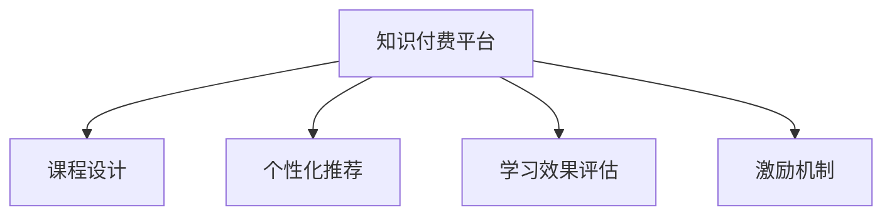

                 

# 如何利用知识付费实现在线教育与培训？

## 1. 背景介绍

### 1.1 问题由来

随着互联网的普及和信息技术的迅猛发展，在线教育与培训逐渐成为教育领域的重要趋势。传统的线下教育模式受到时间和空间的限制，无法满足现代人对知识获取的灵活性和便利性需求。同时，随着知识更新速度的加快，终身学习和自我提升的观念也日益深入人心，催生了对灵活、自主、高效学习方式的需求。

知识付费作为一种新兴的学习模式，通过付费订阅、购买课程等方式，为在线教育与培训提供了新的商业模式。知识付费不仅打破了时间和空间的限制，也使得优质教育资源能够更广泛地传播，满足了不同用户的学习需求。

### 1.2 问题核心关键点

知识付费平台的核心在于如何高效组织和传播优质教育资源，同时激发用户的付费意愿和持续学习动力。其核心包括以下几个方面：

- **课程设计**：根据用户的学习需求和兴趣，设计科学合理的课程内容。
- **用户体验**：优化课程界面和交互设计，提升用户的学习体验。
- **学习效果评估**：利用智能推荐和数据分析技术，帮助用户找到适合自己的学习路径，提升学习效果。
- **激励机制**：通过积分、勋章、社交分享等方式，激发用户的学习热情和互动交流。

### 1.3 问题研究意义

研究如何利用知识付费实现在线教育与培训，对于推动教育资源的公平获取、提高教育质量和效率，具有重要意义：

- **降低学习成本**：知识付费模式可以降低线下教育的学费、交通等成本，使更多人有机会接受优质教育。
- **提升学习效果**：通过智能推荐和个性化服务，帮助用户找到适合自己的学习内容和路径，提高学习效率。
- **激发学习热情**：多样化的激励机制和互动交流，可以提升用户的参与度和持续学习的动力。
- **促进教育创新**：知识付费模式打破了传统教育体系，激发了教育创新和教育资源的再分配。

## 2. 核心概念与联系

### 2.1 核心概念概述

为更好地理解知识付费平台的运作机制，本节将介绍几个关键概念：

- **知识付费平台**：利用互联网技术，通过付费订阅、购买课程等方式，提供优质教育资源的在线教育与培训平台。
- **课程设计**：根据用户的学习需求和兴趣，设计科学合理的课程内容，包括视频、文字、互动练习等多种形式。
- **个性化推荐**：利用机器学习和数据分析技术，为每个用户推荐最适合的课程内容和学习路径。
- **学习效果评估**：通过用户的学习行为数据，分析评估用户的学习效果和满意度，不断优化课程设计和服务。
- **激励机制**：通过积分、勋章、社交分享等方式，激励用户积极参与学习和互动交流。

这些核心概念之间的逻辑关系可以通过以下Mermaid流程图来展示：



这个流程图展示的知识付费平台的核心概念及其之间的关系：

1. 平台通过课程设计提供优质教育资源。
2. 利用个性化推荐系统，为用户推荐适合的课程内容和学习路径。
3. 通过学习效果评估，优化课程内容和个性化服务。
4. 通过激励机制，激发用户的持续学习动力。

这些概念共同构成了知识付费平台的运作框架，使其能够高效组织和传播优质教育资源，同时提升用户的学习体验和效果。

## 3. 核心算法原理 & 具体操作步骤
### 3.1 算法原理概述

知识付费平台的核心算法涉及多个方面，包括课程推荐、用户行为分析、学习效果评估等。其核心思想是利用机器学习和数据分析技术，为用户提供个性化的教育服务。

以课程推荐算法为例，假设用户的历史行为数据为 $H=\{x_1, x_2, ..., x_n\}$，其中 $x_i$ 表示用户在学习某个课程 $C_i$ 时的操作行为（如观看时长、完成测试、参与讨论等）。课程 $C_j$ 的属性特征为 $F=\{f_1, f_2, ..., f_m\}$，其中 $f_i$ 表示课程的难度、时长、评价等。课程推荐的目标是为用户 $U$ 推荐最匹配的课程 $C$，可以通过以下步骤实现：

1. 收集用户的历史行为数据 $H$ 和课程的属性特征 $F$。
2. 对用户行为和课程特征进行向量化表示，构建特征向量。
3. 使用相似度计算方法（如余弦相似度、欧几里得距离等），计算用户与课程之间的相似度。
4. 根据相似度排序，推荐最匹配的课程 $C$。

### 3.2 算法步骤详解

知识付费平台的课程推荐算法主要分为以下几个步骤：

**Step 1: 数据收集与预处理**
- 收集用户的学习行为数据，包括观看时长、完成测试、参与讨论等。
- 收集课程的属性特征，如课程难度、时长、评价等。
- 对用户行为和课程特征进行向量化处理，构建特征向量。

**Step 2: 相似度计算**
- 使用相似度计算方法（如余弦相似度、欧几里得距离等），计算用户与课程之间的相似度。
- 对相似度结果进行归一化处理，计算用户对每门课程的兴趣度。

**Step 3: 排序推荐**
- 根据用户对每门课程的兴趣度，对课程进行排序，推荐最匹配的课程。
- 可以引入排序算法（如Top-k排序），限制推荐的课程数量。

**Step 4: 用户反馈与优化**
- 收集用户对推荐课程的反馈数据，包括是否满意、是否观看完课程等。
- 利用用户反馈数据，不断优化推荐算法，提升推荐精度。

### 3.3 算法优缺点

知识付费平台的课程推荐算法具有以下优点：

1. **个性化推荐**：能够根据用户的历史行为和兴趣，提供个性化的课程推荐，提升用户的学习效果。
2. **高效性**：通过相似度计算和排序推荐，可以快速找到最匹配的课程，提升推荐效率。
3. **可扩展性**：算法可以适用于大规模数据集，支持数以万计的课程推荐。

同时，该算法也存在以下局限性：

1. **数据依赖性**：算法的效果依赖于用户行为数据的完整性和准确性，数据质量对推荐结果有较大影响。
2. **泛化能力有限**：课程推荐算法通常依赖于历史数据，对于新用户和冷门课程的推荐效果可能较差。
3. **模型复杂性**：高维度的特征向量和复杂的相似度计算方法，需要较高的计算资源和算法复杂度。

尽管存在这些局限性，但知识付费平台的课程推荐算法仍是目前最主流和有效的推荐方法之一，广泛应用于各大知识付费平台。未来相关研究重点在于如何进一步降低数据依赖，提高推荐算法的泛化能力和鲁棒性，同时兼顾计算效率和模型复杂度。

### 3.4 算法应用领域

知识付费平台的课程推荐算法已经在多个领域得到了应用，例如：

- 在线教育：如Coursera、Udemy等平台，根据用户的学习行为和兴趣，推荐适合的课程和视频。
- 企业培训：如网易云课堂、慕课网等平台，根据企业员工的学习需求和兴趣，推荐适合的培训课程和模块。
- 知识传播：如得到、知乎live等平台，根据用户的学习兴趣和偏好，推荐适合的书籍、文章和讲座。

除了这些常见应用外，知识付费平台的推荐算法也被创新性地应用到更多场景中，如个性化阅读、个性化理财、个性化健身等，为各类垂直领域提供智能化解决方案。

## 4. 数学模型和公式 & 详细讲解 & 举例说明
### 4.1 数学模型构建

知识付费平台的课程推荐算法涉及多个数学模型，包括相似度计算、用户行为建模等。这里以余弦相似度为例，构建推荐模型。

假设用户的历史行为数据为 $H=\{x_1, x_2, ..., x_n\}$，其中 $x_i$ 表示用户在学习某个课程 $C_i$ 时的操作行为（如观看时长、完成测试、参与讨论等）。课程 $C_j$ 的属性特征为 $F=\{f_1, f_2, ..., f_m\}$，其中 $f_i$ 表示课程的难度、时长、评价等。课程推荐的目标是为用户 $U$ 推荐最匹配的课程 $C$，可以通过以下数学模型实现：

$$
\text{similarity}(U, C_j) = \frac{\sum_{i=1}^{n} \omega_i \cdot x_i \cdot f_i}{\sqrt{\sum_{i=1}^{n} \omega_i \cdot x_i^2} \cdot \sqrt{\sum_{i=1}^{m} f_i^2}}
$$

其中 $\omega_i$ 为特征权重，用于调整不同特征对推荐结果的影响。

### 4.2 公式推导过程

余弦相似度的推导过程如下：

设用户的历史行为数据为 $H=\{x_1, x_2, ..., x_n\}$，课程 $C_j$ 的属性特征为 $F=\{f_1, f_2, ..., f_m\}$。将用户和课程的特征向量化表示为：

$$
\vec{x} = \begin{bmatrix} x_1 \\ x_2 \\ \vdots \\ x_n \end{bmatrix}, \vec{f} = \begin{bmatrix} f_1 \\ f_2 \\ \vdots \\ f_m \end{bmatrix}
$$

则用户与课程的余弦相似度为：

$$
\text{similarity}(U, C_j) = \frac{\vec{x} \cdot \vec{f}}{||\vec{x}|| \cdot ||\vec{f}||}
$$

其中 $\cdot$ 表示向量的点乘运算，$||.||$ 表示向量的模长。

### 4.3 案例分析与讲解

假设用户 $U$ 在课程 $C_1$ 上观看了30分钟，在课程 $C_2$ 上完成了所有测试，但在课程 $C_3$ 上只参与了一次讨论。课程 $C_1$ 的难度为0.7，时长为1小时，评价为4.5分。课程 $C_2$ 的难度为0.9，时长为2小时，评价为5.0分。课程 $C_3$ 的难度为0.5，时长为0.5小时，评价为3.0分。用户对不同课程的特征权重为 $\omega_1=0.5, \omega_2=0.3, \omega_3=0.2$。

根据上述公式，计算用户 $U$ 与课程 $C_1, C_2, C_3$ 的余弦相似度如下：

$$
\text{similarity}(U, C_1) = \frac{30 \times 0.7 + 0 \times 0.9 + 1 \times 0.5}{\sqrt{30^2 \times 0.7^2 + 0^2 \times 0.9^2 + 1^2 \times 0.5^2} \cdot \sqrt{0.7^2 + 0.9^2 + 0.5^2}} = 0.84
$$

$$
\text{similarity}(U, C_2) = \frac{0 \times 0.7 + 5 \times 0.9 + 0 \times 0.5}{\sqrt{0^2 \times 0.7^2 + 5^2 \times 0.9^2 + 0^2 \times 0.5^2} \cdot \sqrt{0.7^2 + 0.9^2 + 0.5^2}} = 0.66
$$

$$
\text{similarity}(U, C_3) = \frac{0 \times 0.7 + 0 \times 0.9 + 1 \times 0.5}{\sqrt{0^2 \times 0.7^2 + 0^2 \times 0.9^2 + 1^2 \times 0.5^2} \cdot \sqrt{0.7^2 + 0.9^2 + 0.5^2}} = 0.28
$$

根据相似度结果，课程 $C_1$ 与用户 $U$ 最匹配，应优先推荐。

## 5. 项目实践：代码实例和详细解释说明
### 5.1 开发环境搭建

在进行知识付费平台推荐系统的开发前，我们需要准备好开发环境。以下是使用Python进行推荐系统开发的常见环境配置流程：

1. 安装Anaconda：从官网下载并安装Anaconda，用于创建独立的Python环境。

2. 创建并激活虚拟环境：
```bash
conda create -n recommendation-env python=3.8 
conda activate recommendation-env
```

3. 安装必要的Python库和工具包：
```bash
pip install numpy pandas scikit-learn scipy jupyter notebook
```

4. 安装推荐系统相关的Python库：
```bash
pip install scipy librosa pyspark nltk
```

5. 安装分布式计算环境：
```bash
pip install hadoop-hdfs hdfscli
```

完成上述步骤后，即可在`recommendation-env`环境中开始推荐系统开发。

### 5.2 源代码详细实现

下面以推荐算法为例，给出推荐系统的Python代码实现。

首先，定义推荐算法类 `RecommendationAlgorithm`：

```python
import numpy as np
from sklearn.metrics.pairwise import cosine_similarity

class RecommendationAlgorithm:
    def __init__(self, data, feature_weights):
        self.data = data
        self.feature_weights = feature_weights
        self.similarity_matrix = None
    
    def fit(self):
        # 构建特征矩阵
        features = np.array([self.data[x] for x in self.feature_weights])
        feature_matrix = features.T
        
        # 计算相似度矩阵
        self.similarity_matrix = cosine_similarity(feature_matrix, feature_matrix)
    
    def recommend(self, user, top_n=10):
        similarity_scores = np.dot(self.similarity_matrix[user], self.feature_weights)
        sorted_indices = np.argsort(similarity_scores)[::-1]
        recommended_items = sorted_indices[:top_n]
        return recommended_items
```

然后，定义推荐系统类 `RecommendationSystem`：

```python
from recommendation_algorithm import RecommendationAlgorithm

class RecommendationSystem:
    def __init__(self, data, feature_weights):
        self.data = data
        self.feature_weights = feature_weights
        self.recommendation_algorithm = None
    
    def fit(self):
        self.recommendation_algorithm = RecommendationAlgorithm(self.data, self.feature_weights)
        self.recommendation_algorithm.fit()
    
    def recommend(self, user, top_n=10):
        if self.recommendation_algorithm is None:
            raise Exception("Recommendation algorithm has not been fitted yet.")
        return self.recommendation_algorithm.recommend(user, top_n)
```

最后，定义推荐系统使用示例：

```python
data = {
    'user1': {'course1': 30, 'course2': 5, 'course3': 1},
    'user2': {'course2': 5, 'course3': 1, 'course4': 1},
    # 其他用户数据...
}

feature_weights = {'course1': 0.5, 'course2': 0.3, 'course3': 0.2}

recommendation_system = RecommendationSystem(data, feature_weights)
recommendation_system.fit()
recommendations = recommendation_system.recommend('user1', top_n=3)
print(recommendations)
```

以上就是推荐系统的完整代码实现。通过这些代码，你可以快速构建一个基本的推荐系统，并根据具体数据和特征进行微调优化。

### 5.3 代码解读与分析

让我们再详细解读一下关键代码的实现细节：

**RecommendationAlgorithm类**：
- `__init__`方法：初始化数据和特征权重，计算相似度矩阵。
- `fit`方法：构建特征矩阵，计算相似度矩阵。
- `recommend`方法：根据相似度矩阵推荐用户最感兴趣的课程。

**RecommendationSystem类**：
- `__init__`方法：初始化数据和特征权重，实例化推荐算法。
- `fit`方法：实例化推荐算法，并训练其模型。
- `recommend`方法：调用推荐算法，获取推荐结果。

**推荐系统使用示例**：
- 定义用户和课程数据。
- 定义特征权重，用于调整不同特征对推荐结果的影响。
- 创建推荐系统，训练模型，推荐课程。

## 6. 实际应用场景
### 6.1 在线教育平台

在线教育平台可以利用知识付费模式，提供个性化的课程推荐服务，帮助学生高效学习。例如，Coursera和Udemy等平台，可以根据学生的学习行为和兴趣，推荐适合的课程和视频，提升学习效果。

### 6.2 企业培训系统

企业培训系统可以通过知识付费模式，为员工提供定制化的培训课程和模块。例如，网易课堂和慕课网等平台，可以根据员工的学习需求和兴趣，推荐适合的培训课程和模块，提升培训效果。

### 6.3 知识传播平台

知识传播平台可以利用知识付费模式，为用户提供丰富的知识资源。例如，得到和知乎live等平台，可以根据用户的学习兴趣和偏好，推荐适合的书籍、文章和讲座，满足用户的知识需求。

### 6.4 未来应用展望

随着知识付费平台的不断发展和完善，未来的应用场景将更加广泛，涵盖更多领域和行业。以下是几个未来的应用方向：

- **个性化健康指导**：知识付费平台可以为用户提供个性化的健康指导和营养建议，根据用户的身体数据和生活习惯，推荐适合的饮食和运动计划。
- **个性化理财服务**：知识付费平台可以为用户提供个性化的理财建议，根据用户的财务状况和投资偏好，推荐适合的理财产品和投资策略。
- **个性化健身指导**：知识付费平台可以为用户提供个性化的健身指导和训练计划，根据用户的身体数据和运动习惯，推荐适合的健身课程和训练计划。
- **个性化旅游规划**：知识付费平台可以为用户提供个性化的旅游规划和行程建议，根据用户的旅行偏好和兴趣，推荐适合的旅游线路和目的地。

这些应用方向展示了知识付费平台的巨大潜力和应用前景，未来将有更多的行业和企业将其应用于实践。

## 7. 工具和资源推荐
### 7.1 学习资源推荐

为了帮助开发者系统掌握知识付费平台的理论和实践，这里推荐一些优质的学习资源：

1. 《机器学习实战》系列书籍：由斯坦福大学李飞飞教授等人撰写，深入浅出地介绍了机器学习的基础知识和应用场景，适合初学者入门。
2. 《推荐系统实战》课程：由复旦大学郑宇教授讲授，系统讲解了推荐系统的理论基础和实现方法，适合进阶学习。
3. 《Python数据科学手册》书籍：由Jake VanderPlas撰写，全面介绍了Python在数据科学中的应用，包括数据处理、可视化、机器学习等。
4. Coursera《Machine Learning》课程：由斯坦福大学Andrew Ng教授讲授，涵盖机器学习的基础知识和常用算法，适合深入学习。
5. Kaggle：数据科学和机器学习竞赛平台，提供大量真实数据集和比赛，适合实践训练和经验积累。

通过这些资源的学习实践，相信你一定能够快速掌握知识付费平台的理论基础和实践技巧，并用于解决实际问题。

### 7.2 开发工具推荐

高效的开发离不开优秀的工具支持。以下是几款用于知识付费平台开发的常用工具：

1. Jupyter Notebook：开源的交互式开发环境，支持Python、R等多种语言，方便代码调试和版本控制。
2. PyTorch：基于Python的开源深度学习框架，灵活的计算图和高效的GPU加速，适合构建复杂的推荐系统。
3. TensorFlow：由Google主导开发的开源深度学习框架，支持分布式计算和GPU加速，适合大规模工程应用。
4. Apache Spark：分布式计算框架，支持大规模数据处理和机器学习任务，适合推荐系统的高并发和大数据需求。
5. Dask：基于Python的分布式计算框架，适合大数据集和计算密集型任务，与Scikit-Learn等机器学习库无缝集成。

合理利用这些工具，可以显著提升知识付费平台的开发效率，加快创新迭代的步伐。

### 7.3 相关论文推荐

知识付费平台的推荐技术涉及多个前沿研究方向，以下是几篇奠基性的相关论文，推荐阅读：

1. Collaborative Filtering for Implicit Feedback Datasets（隐式反馈数据的协同过滤）：提出了基于协同过滤的推荐算法，用于处理用户评分数据。
2. Recommender Systems with Matrix Factorization Techniques（基于矩阵分解技术的推荐系统）：介绍了矩阵分解技术在推荐系统中的应用，用于处理稀疏数据和推荐精度提升。
3. Deep Neural Networks for Playing Atari Games（深度神经网络用于玩Atari游戏）：展示了深度学习在推荐系统中的应用，用于处理非结构化数据和推荐精度提升。
4. Feature-based Recommendation Systems：介绍了基于特征的推荐系统，用于处理用户行为数据和推荐精度提升。
5. Multi-view recommendation systems（多视图推荐系统）：介绍了多视图数据融合技术在推荐系统中的应用，用于处理多样化的数据源和推荐精度提升。

这些论文代表了大规模推荐系统的理论进展和技术突破，对于知识付费平台的研究和开发具有重要参考价值。

## 8. 总结：未来发展趋势与挑战
### 8.1 总结

本文对知识付费平台进行全面系统的介绍。首先阐述了知识付费模式在在线教育与培训中的重要性和应用前景，明确了课程推荐算法在平台中的核心作用。其次，从原理到实践，详细讲解了推荐算法的数学模型和关键步骤，给出了推荐系统开发的完整代码实例。同时，本文还广泛探讨了推荐算法在在线教育、企业培训、知识传播等多个行业领域的应用前景，展示了推荐算法的巨大潜力和应用范围。此外，本文精选了推荐算法的各类学习资源，力求为读者提供全方位的技术指引。

通过本文的系统梳理，可以看到，知识付费平台正成为教育领域的重要趋势，利用推荐算法为用户推荐优质的教育资源，极大地提升了教育资源的获取效率和学习效果。推荐算法的不断发展和优化，将使知识付费平台更好地服务于用户，促进教育资源的公平获取和知识传播。

### 8.2 未来发展趋势

展望未来，知识付费平台的推荐算法将呈现以下几个发展趋势：

1. **个性化推荐**：利用深度学习和大数据分析技术，为用户提供更加个性化、精准的课程推荐，提升学习效果和用户满意度。
2. **多视图融合**：引入多视图数据融合技术，整合用户行为数据、社交网络数据、情感数据等，构建更加全面、准确的推荐模型。
3. **在线实时推荐**：引入在线学习行为数据和实时推荐技术，提升推荐的实时性和动态性，增强用户体验。
4. **模型集成和优化**：引入模型集成和优化技术，如Stacking、Boosting等，提升推荐系统的整体精度和鲁棒性。
5. **推荐算法泛化**：引入推荐算法的泛化技术，如对抗学习、半监督学习等，提升推荐系统的泛化能力和鲁棒性。
6. **推荐系统可解释性**：引入推荐系统的可解释性技术，如可解释深度学习、因果推断等，增强用户对推荐结果的理解和信任。

这些趋势凸显了知识付费平台的推荐算法的广阔前景。这些方向的探索发展，将进一步提升推荐系统的性能和用户满意度，为知识付费平台带来更加广阔的发展空间。

### 8.3 面临的挑战

尽管知识付费平台的推荐算法已经取得了显著成果，但在迈向更加智能化、普适化应用的过程中，仍面临诸多挑战：

1. **数据隐私和安全**：知识付费平台需要处理大量的用户数据，如何保护用户隐私和数据安全，是重要的研究课题。
2. **数据质量和完备性**：推荐算法的精度依赖于数据的质量和完备性，如何获取和处理高质量的数据，是推荐算法应用的瓶颈。
3. **推荐算法的公平性**：推荐算法可能会产生数据偏见，导致不同用户和课程的推荐不公平，如何消除算法偏见，是重要的研究方向。
4. **推荐算法的鲁棒性**：推荐算法需要具备一定的鲁棒性，避免在数据分布变化或新用户加入时性能下降，如何提高算法的鲁棒性，是重要的研究方向。
5. **推荐算法的实时性**：知识付费平台需要实时推荐课程，如何优化推荐算法的计算速度，提高实时性，是重要的研究方向。
6. **推荐算法的可解释性**：推荐算法需要具备一定的可解释性，帮助用户理解推荐结果的依据，如何增强算法的可解释性，是重要的研究方向。

正视知识付费平台推荐算法面临的这些挑战，积极应对并寻求突破，将是大规模推荐系统迈向成熟的重要路径。相信随着学界和产业界的共同努力，这些挑战终将一一被克服，推荐系统必将在知识付费平台中发挥更加重要的作用。

### 8.4 研究展望

面向未来，知识付费平台的推荐算法需要在以下几个方面寻求新的突破：

1. **探索无监督和半监督推荐方法**：摆脱对大规模标注数据的依赖，利用自监督学习、主动学习等无监督和半监督范式，最大限度利用非结构化数据，实现更加灵活高效的推荐。
2. **研究参数高效和计算高效的推荐范式**：开发更加参数高效的推荐方法，在固定大部分预训练参数的同时，只更新极少量的任务相关参数。同时优化推荐系统的计算图，减少前向传播和反向传播的资源消耗，实现更加轻量级、实时性的部署。
3. **引入因果分析和博弈论工具**：将因果分析方法引入推荐系统，识别出推荐过程中的关键特征，增强推荐结果的因果性和逻辑性。借助博弈论工具刻画人机交互过程，主动探索并规避推荐系统的脆弱点，提高系统稳定性。
4. **纳入伦理道德约束**：在推荐系统训练目标中引入伦理导向的评估指标，过滤和惩罚有偏见、有害的推荐结果，确保推荐系统的公平性、透明性和安全性。
5. **结合知识图谱和外部知识库**：将知识图谱、逻辑规则等专家知识与推荐系统进行融合，引导推荐过程学习更准确、合理的推荐规则，提升推荐系统的精度和可解释性。

这些研究方向的探索，必将引领推荐系统技术迈向更高的台阶，为知识付费平台提供更加智能、公正、可解释的推荐服务，推动教育资源的公平获取和知识传播。面向未来，知识付费平台推荐算法还需要与其他人工智能技术进行更深入的融合，如知识表示、因果推理、强化学习等，多路径协同发力，共同推动知识付费平台的创新发展。只有勇于创新、敢于突破，才能不断拓展推荐系统的边界，让知识付费平台更好地服务于用户，推动教育资源的公平获取和知识传播。

## 9. 附录：常见问题与解答

**Q1：知识付费平台如何提高课程推荐精度？**

A: 提高课程推荐精度可以从以下几个方面入手：
1. **数据质量**：确保数据的质量和完备性，包括用户行为数据的准确性和课程属性的丰富性。
2. **特征工程**：利用特征工程技术，提取和选择对推荐结果有影响的特征，构建更加全面、准确的特征向量。
3. **模型优化**：采用先进的推荐算法，如基于深度学习的协同过滤、基于矩阵分解的推荐系统等，优化推荐模型的精度。
4. **实时学习**：引入在线学习机制，不断更新推荐模型，提升推荐算法的实时性和动态性。

**Q2：如何优化推荐算法的计算效率？**

A: 优化推荐算法的计算效率可以从以下几个方面入手：
1. **特征压缩**：采用特征压缩技术，如主成分分析、特征选择等，减少特征向量的维度，降低计算复杂度。
2. **模型并行**：采用模型并行技术，如分布式训练、GPU加速等，提高推荐模型的计算效率。
3. **在线计算**：引入在线计算技术，如增量学习和增量更新，减少计算资源的消耗，提高推荐系统的实时性。
4. **缓存优化**：利用缓存技术，如LRU缓存、分布式缓存等，减少计算资源的重复计算，提高推荐系统的响应速度。

**Q3：推荐算法如何应对新用户的加入？**

A: 推荐算法应对新用户的加入可以从以下几个方面入手：
1. **冷启动策略**：引入冷启动策略，如基于内容的推荐、基于模型的推荐等，帮助新用户找到适合的课程。
2. **数据采集**：通过数据采集和行为记录，收集新用户的历史行为数据，构建特征向量，提升推荐精度。
3. **用户反馈**：引入用户反馈机制，通过用户对推荐结果的反馈，不断优化推荐模型，提升推荐效果。
4. **模型更新**：引入在线学习机制，不断更新推荐模型，适应新用户的兴趣和需求。

**Q4：推荐系统如何提高用户参与度？**

A: 提高用户参与度可以从以下几个方面入手：
1. **互动设计**：设计互动性强的推荐界面，如交互式课程推荐、社交评论等，增强用户的参与感。
2. **个性化推荐**：利用个性化推荐技术，推荐用户感兴趣和适合的课程，提升学习体验。
3. **激励机制**：引入激励机制，如积分、勋章、社交分享等，激励用户积极参与学习和互动交流。
4. **用户反馈**：引入用户反馈机制，收集用户对推荐结果的反馈，不断优化推荐模型，提升推荐效果。

**Q5：推荐系统如何保护用户隐私？**

A: 推荐系统保护用户隐私可以从以下几个方面入手：
1. **数据匿名化**：对用户数据进行匿名化处理，去除个人身份信息，保护用户隐私。
2. **数据加密**：采用数据加密技术，如SSL/TLS、AES等，保护用户数据在传输和存储过程中的安全性。
3. **访问控制**：采用访问控制技术，如权限管理、身份验证等，限制对用户数据的访问和使用。
4. **数据脱敏**：对敏感数据进行脱敏处理，如数据模糊化、数据掩码等，保护用户隐私。

通过这些常见问题的解答，相信你对知识付费平台的推荐系统有了更全面的理解，并能够在实际开发中灵活应用和优化推荐算法。

---

作者：禅与计算机程序设计艺术 / Zen and the Art of Computer Programming

