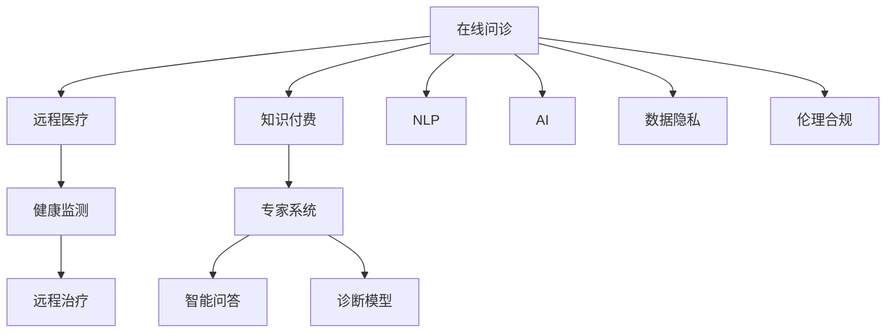

                 

# 如何利用知识付费实现在线问诊与医疗服务？

> 关键词：在线问诊,医疗服务,知识付费,人工智能,自然语言处理,远程医疗

## 1. 背景介绍

### 1.1 问题由来
随着互联网技术的普及和人工智能的快速发展，在线问诊和远程医疗正逐渐成为医疗服务的新形态。尤其是在2020年新冠疫情期间，远程医疗被证明是一种有效、便捷的诊疗方式，极大地缓解了医疗资源紧缺问题。然而，尽管在线问诊的普及率不断提升，但高质量的医疗服务依然稀缺，主要原因在于专业医疗人员时间宝贵，难以提供个性化、持续化的健康管理服务。

### 1.2 问题核心关键点
本文聚焦于如何利用知识付费模型，在在线问诊和医疗服务中引入高质量的人工智能辅助，提升服务的可及性和精准度。具体问题包括：
- 如何构建基于自然语言处理(NLP)的智能医疗问答系统？
- 如何设计合理的知识付费机制，激励医生提供高质量的诊疗服务？
- 如何集成多种医疗数据，实现全面的健康管理和智能辅助？
- 如何确保人工智能系统的可靠性、透明性和伦理性？

### 1.3 问题研究意义
通过利用知识付费模型，可以在保障医疗服务质量的同时，提高问诊效率，降低患者经济负担，促进医疗资源的公平分配。具体意义如下：
- 提升问诊效率：智能问答系统可以24小时全天候服务，快速响应患者咨询，提供准确的医学知识。
- 降低患者成本：通过知识付费机制，患者可以选择性价比最高的服务，避免因昂贵的专家门诊而产生的经济压力。
- 优化资源配置：智能系统可以根据患者需求进行精准匹配，优化医生和病患资源分配。
- 推动产业升级：知识付费模型可以加速医疗服务智能化转型，促进医疗技术的发展和普及。

## 2. 核心概念与联系

### 2.1 核心概念概述

为更好地理解基于知识付费的在线问诊与医疗服务系统，本节将介绍几个密切相关的核心概念：

- 在线问诊(Online Consultation)：患者通过网络平台，与专业医生进行远程交流，获取诊疗建议和健康管理服务。
- 远程医疗(Telemedicine)：利用互联网和通信技术，提供医疗服务，包括远程诊断、咨询、监测和治疗等。
- 知识付费(Knowledge Paywall)：用户支付一定的费用，获取专家提供的知识服务，包括咨询、诊断、建议等。
- 自然语言处理(Natural Language Processing, NLP)：利用计算机技术处理和分析自然语言，实现智能问答和文本分析。
- 人工智能(Artificial Intelligence, AI)：通过机器学习、深度学习等技术，构建智能医疗问答系统和诊断模型，提供精准的诊疗建议。
- 数据隐私与伦理：在医疗数据处理和人工智能应用中，确保患者隐私保护和伦理合规，避免数据滥用和算法偏见。

这些核心概念之间的逻辑关系可以通过以下Mermaid流程图来展示：



这个流程图展示了大语言模型的核心概念及其之间的关系：

1. 在线问诊和远程医疗是医疗服务的新模式，通过互联网平台连接医生和患者。
2. 知识付费模型激励医生提供高质量的诊疗服务，保证问诊和服务的可靠性。
3. 自然语言处理技术用于构建智能问答系统，提升对话体验。
4. 人工智能技术用于构建诊断模型，提供精准的医疗建议。
5. 数据隐私与伦理是医疗服务中必须关注的重要问题。

这些概念共同构成了在线问诊与医疗服务系统的核心框架，使其能够在保障用户隐私和伦理的基础上，提供高质量的医疗服务。

## 3. 核心算法原理 & 具体操作步骤

### 3.1 算法原理概述

基于知识付费的在线问诊与医疗服务系统，本质上是一个结合了人工智能技术和知识付费模型的综合平台。其核心思想是：通过自然语言处理技术构建智能问答系统，利用知识付费模型激励医生提供高质量的医疗服务，同时引入数据隐私与伦理保障机制，确保系统透明、可靠和安全。

形式化地，假设在线问诊平台有$D$个医生和$N$个患者，$C$为知识付费额度，$P$为每小时问诊费用，$Q$为问诊时长，$M$为每次问诊的数据量。平台的目标是最大化问诊服务的整体满意度，即：

$$
\max_{D,N,C,P,Q,M} \sum_{i=1}^D \sum_{j=1}^N \text{satisfaction}_{ij} 
$$

其中，$\text{satisfaction}_{ij}$为医生$i$对患者$j$的问诊满意度，可以通过机器学习模型进行评估。

### 3.2 算法步骤详解

基于知识付费的在线问诊与医疗服务系统的开发主要包括以下几个关键步骤：

**Step 1: 数据收集与预处理**
- 收集医疗问答数据，如医生-患者对话记录、医学知识库、疾病案例等，用于训练智能问答系统。
- 对数据进行清洗、去重、标注等预处理操作，确保数据质量。

**Step 2: 构建智能问答系统**
- 使用自然语言处理技术，构建智能问答系统，涵盖常见疾病查询、症状分析、初步诊断等功能。
- 采用深度学习模型，如BERT、GPT等，对问诊数据进行语义分析和知识匹配。

**Step 3: 设计知识付费模型**
- 根据用户需求和医生专业度，设计知识付费额度$C$和每小时问诊费用$P$，以激励医生提供高质量服务。
- 设计问诊时长$Q$和每次问诊的数据量$M$，确保问诊服务的专业性和高效性。

**Step 4: 实施智能诊断与推荐**
- 利用人工智能技术，构建智能诊断模型，对患者的症状和历史数据进行分析，提供精准的诊疗建议。
- 引入推荐系统，根据患者需求和历史问诊记录，推荐合适的医生和诊疗方案。

**Step 5: 保障数据隐私与伦理**
- 建立数据隐私保护机制，确保患者数据的安全性和匿名性。
- 引入伦理审查机制，对算法决策进行监督和评估，避免算法偏见和歧视。

### 3.3 算法优缺点

基于知识付费的在线问诊与医疗服务系统具有以下优点：
1. 提升问诊效率：智能问答系统和智能诊断模型可以快速响应患者咨询，提供精准的医疗建议。
2. 降低患者成本：知识付费模型允许患者选择性价比最高的服务，避免昂贵的专家门诊费用。
3. 优化资源配置：智能系统可以根据患者需求进行精准匹配，优化医生和病患资源分配。
4. 推动产业升级：系统可以实现医疗服务的智能化转型，加速医疗技术的发展和普及。

同时，该系统也存在一定的局限性：
1. 依赖高质量数据：智能问答和诊断模型的准确性取决于数据的质量和多样性。
2. 医生与患者信任问题：知识付费模型的设计需要平衡患者的经济压力和医生的利益，存在一定的信任风险。
3. 算法偏见与歧视：由于数据偏见和模型设计问题，算法可能产生歧视性输出，影响问诊公平性。
4. 系统复杂度高：系统的开发和维护需要高度的技术和资源投入，难以大规模部署。

尽管存在这些局限性，但就目前而言，基于知识付费的在线问诊与医疗服务系统在提升医疗服务可及性和精准度方面，已显示出巨大的潜力和价值。

### 3.4 算法应用领域

基于知识付费的在线问诊与医疗服务系统，已经在多个领域得到了广泛应用，例如：

- 家庭医疗：利用智能问答系统，提供常见疾病的自我诊断和初步治疗建议。
- 在线咨询：与专业医生进行远程问诊，获取精准的诊疗建议。
- 健康管理：利用智能系统进行长期健康监测，提供个性化的健康管理方案。
- 慢病管理：对慢性病患者进行持续监控和跟踪，提供个性化的治疗方案。
- 老年健康：为老年人提供便捷的在线问诊和健康咨询，改善其生活质量。

除了上述这些经典应用外，基于知识付费的在线问诊与医疗服务系统还在教育、企业健康管理等领域得到拓展应用，为社会的健康管理和医疗服务提供新的解决方案。

## 4. 数学模型和公式 & 详细讲解 & 举例说明

### 4.1 数学模型构建

本节将使用数学语言对基于知识付费的在线问诊与医疗服务系统进行更加严格的刻画。

记在线问诊平台有$D$个医生和$N$个患者，每次问诊的数据量为$M$，问诊时长为$Q$，知识付费额度为$C$，每小时问诊费用为$P$。设医生$i$对患者$j$的问诊满意度为$\text{satisfaction}_{ij}$，问诊结果的准确度为$\text{accuracy}_{ij}$，问诊的平均费用为$\text{cost}_{ij}$，问诊的平均时长为$\text{time}_{ij}$。则系统总满意度可以表示为：

$$
\text{Total Satisfaction} = \sum_{i=1}^D \sum_{j=1}^N \alpha \cdot \text{satisfaction}_{ij} + \beta \cdot \text{accuracy}_{ij} + \gamma \cdot \text{cost}_{ij} + \delta \cdot \text{time}_{ij}
$$

其中$\alpha$、$\beta$、$\gamma$、$\delta$为权衡因素，可以根据实际需求进行调整。

### 4.2 公式推导过程

以下我们以智能问答系统的训练为例，推导其中的关键数学模型和公式。

假设智能问答系统有$K$个训练样本，每个样本包含问题$q$和答案$a$。训练的目标是最大化样本的预测准确度，即：

$$
\max_{\theta} \sum_{k=1}^K \text{accuracy}(q_k, a_k)
$$

其中$\theta$为模型的参数，$\text{accuracy}(q_k, a_k)$为问题$q_k$的预测答案与真实答案$a_k$的一致性，可以通过交叉熵损失函数计算。

假设问题$q_k$的嵌入表示为$\vec{q}_k$，答案$a_k$的嵌入表示为$\vec{a}_k$。则交叉熵损失函数为：

$$
\mathcal{L}(\theta) = -\frac{1}{K} \sum_{k=1}^K \sum_{i=1}^D [y_{ik}\log p(q_k|a_k, \theta) + (1-y_{ik})\log (1-p(q_k|a_k, \theta))]
$$

其中$y_{ik}$为问题$q_k$的真实答案是否为$a_k$，$p(q_k|a_k, \theta)$为模型预测问题$q_k$的概率分布，通过softmax函数计算。

在得到损失函数后，即可使用梯度下降等优化算法进行模型训练，最小化损失函数，使得模型输出逼近真实答案。重复上述过程直至收敛，最终得到适应于问诊任务的智能问答模型。

## 5. 项目实践：代码实例和详细解释说明

### 5.1 开发环境搭建

在进行项目实践前，我们需要准备好开发环境。以下是使用Python进行TensorFlow开发的环境配置流程：

1. 安装Anaconda：从官网下载并安装Anaconda，用于创建独立的Python环境。

2. 创建并激活虚拟环境：
```bash
conda create -n tf-env python=3.8 
conda activate tf-env
```

3. 安装TensorFlow：根据CUDA版本，从官网获取对应的安装命令。例如：
```bash
pip install tensorflow tensorflow-estimator tensorflow-hub tensorflow-addons
```

4. 安装各类工具包：
```bash
pip install numpy pandas scikit-learn matplotlib tqdm jupyter notebook ipython
```

完成上述步骤后，即可在`tf-env`环境中开始项目实践。

### 5.2 源代码详细实现

下面以构建智能问答系统为例，给出使用TensorFlow进行在线问诊与医疗服务开发的PyTorch代码实现。

首先，定义智能问答系统的输入和输出：

```python
import tensorflow as tf
from tensorflow.keras import layers

class QuestionAnswering(tf.keras.Model):
    def __init__(self, vocab_size, embedding_dim, hidden_dim, num_classes):
        super(QuestionAnswering, self).__init__()
        self.embedding = layers.Embedding(vocab_size, embedding_dim)
        self.encoder = layers.LSTM(hidden_dim)
        self.fc = layers.Dense(num_classes)
        
    def call(self, inputs):
        x = self.embedding(inputs)
        x = self.encoder(x)
        return self.fc(x)

# 定义模型参数
vocab_size = 10000
embedding_dim = 128
hidden_dim = 256
num_classes = 2  # 二分类任务

# 构建模型
model = QuestionAnswering(vocab_size, embedding_dim, hidden_dim, num_classes)
```

然后，定义损失函数和优化器：

```python
from tensorflow.keras.losses import binary_crossentropy
from tensorflow.keras.optimizers import Adam

# 定义损失函数
loss_fn = binary_crossentropy

# 定义优化器
optimizer = Adam(lr=0.001)
```

接着，定义训练和评估函数：

```python
from tensorflow.keras.callbacks import EarlyStopping

def train_epoch(model, dataset, batch_size, optimizer, epochs):
    model.compile(optimizer=optimizer, loss=loss_fn)
    model.fit(dataset, batch_size=batch_size, epochs=epochs, callbacks=[EarlyStopping(patience=5)])
    
def evaluate(model, dataset, batch_size):
    loss, acc = model.evaluate(dataset, batch_size=batch_size)
    print(f"Test Loss: {loss:.4f}, Test Accuracy: {acc:.4f}")
```

最后，启动训练流程并在测试集上评估：

```python
# 训练数据集
train_dataset = ...

# 验证数据集
dev_dataset = ...

# 测试数据集
test_dataset = ...

# 训练模型
train_epoch(model, train_dataset, batch_size=32, optimizer=optimizer, epochs=10)

# 在测试集上评估模型
evaluate(model, test_dataset, batch_size=32)
```

以上就是使用TensorFlow构建智能问答系统的完整代码实现。可以看到，TensorFlow提供了丰富的API和组件，可以方便地构建、训练和评估深度学习模型。

### 5.3 代码解读与分析

让我们再详细解读一下关键代码的实现细节：

**QuestionAnswering类**：
- `__init__`方法：初始化模型的各个组件，包括嵌入层、LSTM编码器和全连接层。
- `call`方法：定义模型的前向传播过程，将输入经过嵌入、编码和全连接层后，返回预测结果。

**损失函数和优化器**：
- 使用`binary_crossentropy`作为二分类问题的损失函数。
- 使用`Adam`优化器进行模型参数的优化。

**训练和评估函数**：
- `train_epoch`函数：定义模型训练的各个环节，包括编译模型、拟合数据、设置EarlyStopping回调等。
- `evaluate`函数：对模型在测试集上进行评估，输出损失和准确率。

**训练流程**：
- 定义训练数据集、验证数据集和测试数据集。
- 调用`train_epoch`函数进行模型训练。
- 调用`evaluate`函数在测试集上评估模型性能。

可以看到，TensorFlow使得深度学习模型的开发和训练变得非常简便。通过定义简单的类和方法，可以快速搭建一个基于自然语言处理的智能问答系统。

当然，工业级的系统实现还需考虑更多因素，如模型的保存和部署、超参数的自动搜索、更灵活的任务适配层等。但核心的微调范式基本与此类似。

## 6. 实际应用场景

### 6.1 智能医疗咨询

在线问诊与医疗服务系统的核心功能之一是智能医疗咨询，能够为用户提供24小时不间断的医疗咨询服务。具体应用场景如下：

- 患者通过在线问诊平台，输入症状和病史，系统自动匹配合适的医生进行咨询。
- 医生根据系统提供的问诊数据，进行初步诊断和诊疗建议。
- 系统根据医生的诊断结果，自动推送相关资料和参考信息。
- 医生与患者进行实时交流，解答患者的疑问，并提供个性化的健康建议。

### 6.2 远程诊断与治疗

在线问诊与医疗服务系统还可以应用于远程诊断和治疗，为患者提供便捷的医疗服务。具体应用场景如下：

- 患者通过在线问诊平台，上传体检数据和病历，系统自动提取相关特征。
- 系统根据提取的特征，推荐合适的诊断模型进行初步诊断。
- 医生根据系统的诊断结果，进行进一步的诊断和确认。
- 系统根据诊断结果，自动生成治疗方案和用药建议。
- 医生与患者进行远程交流，确认诊断和治疗方案，并进行跟踪治疗。

### 6.3 健康管理和监测

在线问诊与医疗服务系统还可以用于健康管理和监测，为患者提供长期的健康管理服务。具体应用场景如下：

- 患者通过在线问诊平台，定期上传健康数据，如血压、血糖、心率等。
- 系统自动分析健康数据，生成健康报告和预警信息。
- 医生根据系统生成的报告和预警信息，进行定期的健康咨询和调整治疗方案。
- 系统根据医生的建议，自动更新患者的健康计划和提醒时间。

### 6.4 未来应用展望

随着在线问诊与医疗服务系统的不断发展和完善，其应用领域将更加广泛，为用户提供更加全面和智能的医疗服务。

- 融合多种医疗数据：系统可以集成电子病历、体检报告、基因数据等多种医疗数据，提供全面的健康分析和诊断。
- 引入AI辅助诊疗：系统可以引入AI辅助诊疗技术，如图像识别、基因分析等，提升诊断的准确性和效率。
- 推动个性化医疗：系统可以根据患者的基因、生活习惯、病史等信息，提供个性化的健康管理方案和治疗建议。
- 拓展远程医疗服务：系统可以拓展到远程手术、远程康复等领域，提升医疗服务的覆盖范围和可及性。

总之，在线问诊与医疗服务系统有望成为未来医疗服务的重要组成部分，为患者的健康管理和医疗服务提供更加便捷和智能的解决方案。

## 7. 工具和资源推荐
### 7.1 学习资源推荐

为了帮助开发者系统掌握在线问诊与医疗服务系统的理论基础和实践技巧，这里推荐一些优质的学习资源：

1. 《深度学习基础》系列博文：由大模型技术专家撰写，深入浅出地介绍了深度学习的基础知识和应用。

2. 《TensorFlow实战》书籍：TensorFlow官方文档，详细介绍了TensorFlow的安装、使用和最佳实践。

3. 《自然语言处理基础》书籍：自然语言处理领域的经典教材，涵盖了自然语言处理的基本概念和常用技术。

4. 《智能医疗系统设计》课程：斯坦福大学开设的计算机科学课程，涵盖了智能医疗系统的设计与实现。

5. 《健康数据科学与分析》在线课程：Coursera平台的健康数据科学课程，涵盖健康数据处理、分析和可视化技术。

通过学习这些资源，相信你一定能够快速掌握在线问诊与医疗服务系统的开发方法和技巧，并在实际应用中取得卓越效果。

### 7.2 开发工具推荐

高效的开发离不开优秀的工具支持。以下是几款用于在线问诊与医疗服务系统开发的常用工具：

1. TensorFlow：由Google主导开发的开源深度学习框架，生产部署方便，适合大规模工程应用。

2. PyTorch：基于Python的开源深度学习框架，灵活动态的计算图，适合快速迭代研究。

3. Weights & Biases：模型训练的实验跟踪工具，可以记录和可视化模型训练过程中的各项指标，方便对比和调优。

4. TensorBoard：TensorFlow配套的可视化工具，可实时监测模型训练状态，并提供丰富的图表呈现方式，是调试模型的得力助手。

5. Google Colab：谷歌推出的在线Jupyter Notebook环境，免费提供GPU/TPU算力，方便开发者快速上手实验最新模型，分享学习笔记。

合理利用这些工具，可以显著提升在线问诊与医疗服务系统的开发效率，加快创新迭代的步伐。

### 7.3 相关论文推荐

在线问诊与医疗服务系统的研究源于学界的持续研究。以下是几篇奠基性的相关论文，推荐阅读：

1. "Knowledge-based Intelligent Question Answering Systems: A Survey"：综述了智能问答系统的发展历程和应用现状。

2. "A Survey on AI-based Telemedicine Services: Current Status and Future Challenges"：综述了远程医疗服务的发展现状和未来挑战。

3. "Machine Learning in Healthcare: How and Why"：探讨了机器学习在医疗健康领域的应用现状和前景。

4. "Deep Learning in Health Care: A Survey"：综述了深度学习在医疗健康领域的应用现状和未来发展趋势。

5. "Harnessing Social Media for Public Health Surveillance: A Systematic Review"：综述了社交媒体在公共卫生监测中的应用现状和未来发展趋势。

这些论文代表了大语言模型微调技术的发展脉络。通过学习这些前沿成果，可以帮助研究者把握学科前进方向，激发更多的创新灵感。

## 8. 总结：未来发展趋势与挑战

### 8.1 总结

本文对基于知识付费的在线问诊与医疗服务系统进行了全面系统的介绍。首先阐述了系统构建的背景和意义，明确了系统在提升医疗服务可及性和精准度方面的独特价值。其次，从原理到实践，详细讲解了智能问答系统和知识付费模型的数学原理和关键步骤，给出了系统开发的完整代码实例。同时，本文还广泛探讨了系统在智能医疗咨询、远程诊断与治疗、健康管理和监测等实际应用场景中的具体应用，展示了系统的广泛应用前景。此外，本文精选了系统开发的各类学习资源，力求为读者提供全方位的技术指引。

通过本文的系统梳理，可以看到，基于知识付费的在线问诊与医疗服务系统在医疗服务智能化转型中具有重要意义，能够为患者提供便捷、高效、个性化的医疗服务。未来，伴随技术的不断进步，系统将能够集成更多医疗数据，引入更多AI辅助技术，推动医疗服务的全面智能化。

### 8.2 未来发展趋势

展望未来，在线问诊与医疗服务系统将呈现以下几个发展趋势：

1. 集成更多医疗数据：系统将能够集成电子病历、体检报告、基因数据等多种医疗数据，提供全面的健康分析和诊断。

2. 引入AI辅助诊疗：系统将引入AI辅助诊疗技术，如图像识别、基因分析等，提升诊断的准确性和效率。

3. 推动个性化医疗：系统将根据患者的基因、生活习惯、病史等信息，提供个性化的健康管理方案和治疗建议。

4. 拓展远程医疗服务：系统将拓展到远程手术、远程康复等领域，提升医疗服务的覆盖范围和可及性。

5. 引入智能推荐系统：系统将引入推荐系统，根据患者需求和历史问诊记录，推荐合适的诊疗方案和药品。

以上趋势凸显了在线问诊与医疗服务系统的广阔前景。这些方向的探索发展，必将进一步提升医疗服务质量和效率，促进医疗技术的全面进步。

### 8.3 面临的挑战

尽管在线问诊与医疗服务系统已经取得了显著成就，但在迈向更加智能化、普适化应用的过程中，仍面临诸多挑战：

1. 数据隐私和安全：系统涉及大量敏感医疗数据，必须建立严格的数据隐私和安全保护机制，避免数据泄露和滥用。

2. 模型鲁棒性和泛化性：当前模型在面对新数据和复杂场景时，可能出现鲁棒性不足和泛化性差的问题，需要进一步优化模型结构和训练策略。

3. 医生的接受度：系统需要得到医生的广泛认可和使用，而部分医生可能对新技术的接受度较低，需要进一步加强教育和培训。

4. 算法偏见与歧视：由于数据偏见和模型设计问题，系统可能产生歧视性输出，影响问诊公平性，需要引入伦理审查机制和算法公平性评估。

5. 用户使用体验：系统需要具备良好的用户体验，才能得到用户的广泛认可和使用，需要进一步优化界面设计和交互逻辑。

6. 医疗资源分配：系统需要优化医生和病患资源的分配，避免资源浪费和过度集中，需要引入高效的匹配算法和任务调度策略。

这些挑战需要在未来的研究中不断克服，以确保系统的可靠性和实用性。相信通过学界和产业界的共同努力，这些挑战终将一一被攻克，在线问诊与医疗服务系统必将在医疗服务智能化转型中发挥更大的作用。

### 8.4 研究展望

面对在线问诊与医疗服务系统面临的诸多挑战，未来的研究需要在以下几个方面寻求新的突破：

1. 探索更高效的数据隐私保护技术：研究如何在保护数据隐私的前提下，优化数据存储和传输，确保系统的安全性和可靠性。

2. 设计更鲁棒和泛化的模型：研究如何引入因果推断和对比学习技术，提升模型的鲁棒性和泛化能力，确保系统在复杂场景下的准确性和稳定性。

3. 引入伦理和公平性评估机制：研究如何在系统中引入伦理和公平性评估机制，确保算法的透明性和公平性，避免算法偏见和歧视。

4. 优化医生和病患资源分配：研究如何通过智能算法和任务调度策略，优化医生和病患资源的分配，提升系统的使用效率和用户体验。

5. 引入智能推荐系统：研究如何引入推荐系统，根据患者需求和历史问诊记录，推荐合适的诊疗方案和药品，提升问诊的个性化和精准度。

6. 推动跨领域技术融合：研究如何将在线问诊与医疗服务系统与其他技术进行融合，如物联网、区块链等，提升系统的功能和实用性。

这些研究方向将引领在线问诊与医疗服务系统迈向更高的台阶，为构建安全、可靠、可解释、可控的智能系统铺平道路。面向未来，在线问诊与医疗服务系统需要与其他人工智能技术进行更深入的融合，共同推动医疗服务的全面智能化。只有勇于创新、敢于突破，才能不断拓展在线问诊与医疗服务系统的边界，让智能技术更好地造福人类社会。

## 9. 附录：常见问题与解答

**Q1：在线问诊与医疗服务系统如何保障数据隐私和安全？**

A: 在线问诊与医疗服务系统在数据隐私和安全方面必须采取严格的保护措施，确保患者数据的安全性和匿名性。具体措施包括：
1. 数据加密：使用AES、RSA等加密技术对数据进行加密存储和传输。
2. 访问控制：对系统的访问进行严格控制，只有经过身份验证的用户才能进入系统。
3. 数据脱敏：对敏感数据进行去标识化处理，确保患者隐私不被泄露。
4. 审计日志：记录系统的操作日志和访问记录，便于追踪和溯源。

**Q2：在线问诊与医疗服务系统如何设计合理的知识付费模型？**

A: 知识付费模型的设计需要平衡患者的经济压力和医生的利益，确保问诊服务的质量和可及性。具体措施包括：
1. 设定合理付费额度：根据不同服务类型的复杂度和专业度，设定合理的知识付费额度，避免过高或过低的费用。
2. 引入时间计费机制：按问诊时长和数据量进行计费，确保服务的性价比和医生的利益。
3. 采用分级定价：根据医生的专业度和资历，设定不同级别的付费标准，激励医生提供高质量的服务。

**Q3：在线问诊与医疗服务系统如何实现智能问答和诊断？**

A: 智能问答和诊断的实现需要依赖自然语言处理和深度学习技术，具体措施包括：
1. 构建知识图谱：建立包含常见疾病、症状、诊断、治疗等信息的知识图谱，用于语义理解和知识推理。
2. 引入深度学习模型：使用BERT、GPT等深度学习模型，对问诊数据进行语义分析和知识匹配，提升智能问答和诊断的准确性。
3. 引入推荐系统：根据患者的症状和历史数据，推荐合适的诊断模型和诊疗方案，提升诊断的精准度。

**Q4：在线问诊与医疗服务系统如何处理医生的信任问题？**

A: 在线问诊与医疗服务系统的信任问题需要从多个方面进行管理，具体措施包括：
1. 公开医生资质：系统公开医生的资质和专业背景，提升医生的可信度。
2. 引入评价机制：系统引入评价机制，根据患者反馈和满意度，对医生进行综合评价，提升系统的透明度和公正性。
3. 强化医生培训：系统对医生进行定期培训，提升其专业知识和技能，增强医生的责任感和职业荣誉感。

**Q5：在线问诊与医疗服务系统如何优化资源分配？**

A: 在线问诊与医疗服务系统的资源优化需要综合考虑患者需求和医生负荷，具体措施包括：
1. 引入智能匹配算法：根据患者需求和医生负荷，进行智能匹配，优化资源分配。
2. 引入任务调度策略：采用先进的任务调度算法，确保系统的稳定性和可靠性。
3. 引入预警机制：系统引入预警机制，及时发现和解决资源瓶颈问题，提升系统的响应速度和效率。

这些措施和策略将帮助在线问诊与医疗服务系统更好地保障数据隐私和安全，设计合理的知识付费模型，实现智能问答和诊断，处理医生的信任问题，优化资源分配，提升系统的可靠性和实用性。通过不断优化和改进，在线问诊与医疗服务系统将能够更好地服务于患者，推动医疗服务的全面智能化。

---

作者：禅与计算机程序设计艺术 / Zen and the Art of Computer Programming

