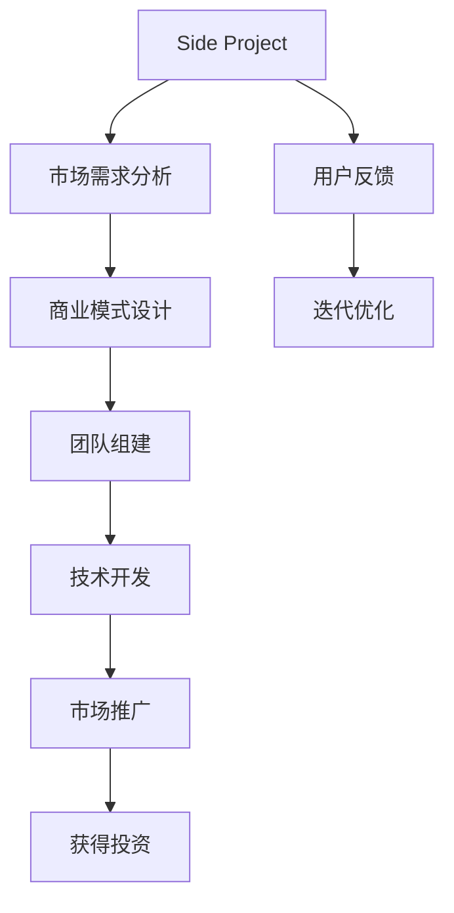

                 

# 如何将Side Project转化为估值上亿的创业公司

在这个充满机遇与挑战的时代，许多有抱负的创业者都在努力将自己的Side Project（即非主要工作中的业余项目）转变为估值上亿的创业公司。本文将详细探讨这一过程，帮助创业者们掌握将Side Project成功转化的关键步骤和策略。

## 1. 背景介绍

### 1.1 问题由来
随着互联网和技术的快速发展，越来越多的人有了将业余兴趣和技能转化为商业机会的想法。然而，许多创业者往往忽视了从Side Project到商业公司的转型过程，导致项目无法成功落地。

### 1.2 问题核心关键点
成功将Side Project转化为创业公司的关键点在于：
- **清晰的市场需求**：明确项目可以解决的核心问题。
- **可行的商业模式**：设计能够产生收入的商业模式。
- **强大的技术基础**：拥有强大的技术支持和技术储备。
- **高效的团队协作**：打造一个高效的创业团队。
- **持续的资金支持**：保证项目的持续发展和扩展。

## 2. 核心概念与联系

### 2.1 核心概念概述

- **Side Project**：指创业者在非主要工作之外的业余项目，通常由个人兴趣和爱好驱动。
- **创业公司**：指通过解决某个市场需求，提供产品或服务的商业实体。
- **转型过程**：指将Side Project逐步转变为创业公司的过程，包括市场需求分析、商业模式设计、团队组建和技术开发等环节。

这些核心概念之间的逻辑关系可以通过以下Mermaid流程图来展示：



这个流程图展示了从Side Project到创业公司的基本流程：

1. 明确市场需求。
2. 设计商业模式。
3. 组建团队。
4. 进行技术开发。
5. 推广产品。
6. 获取投资。
7. 根据用户反馈迭代优化。

## 3. 核心算法原理 & 具体操作步骤
### 3.1 算法原理概述

将Side Project转化为创业公司的过程，本质上是一个复杂的多阶段优化问题。其核心思想是：
1. **市场驱动**：基于市场需求，设计产品和服务。
2. **技术驱动**：利用技术优势，提高产品竞争力。
3. **团队驱动**：组建高效的创业团队，确保项目高效推进。
4. **投资驱动**：通过融资获得资金支持，加速项目发展。

### 3.2 算法步骤详解

1. **市场需求分析**
    - **步骤1**：调查市场，收集用户反馈，确定项目的核心问题和市场需求。
    - **步骤2**：通过市场调研和用户访谈，验证需求的真实性和市场规模。

2. **商业模式设计**
    - **步骤1**：根据市场需求，设计能够产生收入的商业模式，如订阅制、广告、销售等。
    - **步骤2**：进行商业模式验证，确保其可行性和盈利潜力。

3. **团队组建**
    - **步骤1**：招募具有相关技能和经验的人才，形成核心团队。
    - **步骤2**：明确团队成员的角色和职责，确保高效协作。

4. **技术开发**
    - **步骤1**：选择合适的技术栈，进行产品开发。
    - **步骤2**：根据市场需求和技术趋势，进行持续的技术迭代和优化。

5. **市场推广**
    - **步骤1**：制定推广策略，选择合适的渠道进行市场推广。
    - **步骤2**：根据市场反馈，不断调整推广策略。

6. **获得投资**
    - **步骤1**：准备商业计划书，寻找潜在的投资方。
    - **步骤2**：与投资者进行谈判，获得资金支持。

### 3.3 算法优缺点

**优点**：
- **资源整合**：Side Project往往已经有一定的资源积累和技术基础，可以快速整合，形成有竞争力的产品。
- **风险低**：从小规模项目逐步扩展，降低了创业失败的风险。

**缺点**：
- **市场验证难度大**：Side Project通常缺乏市场验证，需要大量时间和资源进行市场调研。
- **资金短缺**：项目初期往往缺乏足够的资金支持，难以快速扩展。

### 3.4 算法应用领域

将Side Project转化为创业公司的方法，广泛应用于各类初创企业的成长过程中。例如：

- **软件应用**：通过技术开发解决特定问题，吸引用户付费或广告收入。
- **在线服务**：提供有价值的信息服务，如内容平台、工具服务等。
- **电子商务**：利用技术优势，提供独特的产品或服务，如跨境电商、B2B平台等。

## 4. 数学模型和公式 & 详细讲解 & 举例说明

### 4.1 数学模型构建

假设Side Project产品为 $P$，市场需求为 $D$，技术实力为 $T$，团队能力为 $E$，获得投资为 $I$，市场推广效果为 $M$。

定义以下变量：
- $R$：Side Project的市场需求满足度。
- $C$：商业模式的可行性。
- $L$：团队协作效率。
- $F$：技术开发效率。
- $P$：市场推广效果。

则市场满足度 $R$ 可以表示为：
$$
R = D \times C \times L \times F \times P
$$

### 4.2 公式推导过程

1. **市场需求分析**：
    $$
    D = \frac{\sum_{i} U_i}{U_{total}}
    $$
    其中 $U_i$ 为第 $i$ 个用户的需求量，$U_{total}$ 为市场总需求量。

2. **商业模式设计**：
    $$
    C = \frac{I}{O}
    $$
    其中 $I$ 为预期收入，$O$ 为预期支出。

3. **团队组建**：
    $$
    L = \sum_{i} E_i \times \alpha_i
    $$
    其中 $E_i$ 为第 $i$ 个团队成员的能力，$\alpha_i$ 为团队协作权重。

4. **技术开发**：
    $$
    F = \frac{T}{T_{total}}
    $$
    其中 $T$ 为技术总实力，$T_{total}$ 为行业技术总实力。

5. **市场推广**：
    $$
    P = M \times \beta
    $$
    其中 $M$ 为市场推广投入，$\beta$ 为市场推广效果系数。

### 4.3 案例分析与讲解

假设某Side Project是一款在线教育平台，市场需求为 $D=10000$，技术实力为 $T=90$，团队能力为 $E=80$，获得投资为 $I=1000000$，市场推广效果为 $M=0.2$。

通过计算，得到市场需求满足度 $R = 10000 \times C \times L \times F \times P$。

1. **市场需求分析**：
    - 市场调研发现，用户需求量 $U_i$ 为1000，市场总需求量 $U_{total}$ 为10000。
    - 需求满足度 $D = \frac{1000}{10000} = 0.1$。

2. **商业模式设计**：
    - 预期收入 $I=1000000$，预期支出 $O=500000$。
    - 商业模式可行性 $C = \frac{1000000}{500000} = 2$。

3. **团队组建**：
    - 团队成员能力 $E_i$ 为80，团队协作权重 $\alpha_i$ 为0.8。
    - 团队协作效率 $L = 80 \times 0.8 = 64$。

4. **技术开发**：
    - 技术总实力 $T=90$，行业技术总实力 $T_{total}=100$。
    - 技术开发效率 $F = \frac{90}{100} = 0.9$。

5. **市场推广**：
    - 市场推广投入 $M=0.2$。
    - 市场推广效果系数 $\beta=1.5$。
    - 市场推广效果 $P = 0.2 \times 1.5 = 0.3$。

最终计算得到市场满足度 $R = 10000 \times 2 \times 64 \times 0.9 \times 0.3 = 28800$。

## 5. 项目实践：代码实例和详细解释说明
### 5.1 开发环境搭建

1. **安装开发工具**：
    - 安装Python，推荐使用Anaconda或Miniconda。
    - 安装Docker和Git，用于版本控制和远程协作。
    - 安装IDE，如PyCharm、Visual Studio Code等。

2. **环境配置**：
    - 设置虚拟环境，安装依赖库，如Flask、Django、TensorFlow等。
    - 配置数据库，如MySQL、PostgreSQL等，进行数据存储。
    - 配置版本控制，如Git，进行代码管理和协作。

### 5.2 源代码详细实现

**示例1：在线教育平台**

```python
from flask import Flask, request, jsonify

app = Flask(__name__)

@app.route('/get_course', methods=['GET'])
def get_course():
    # 从数据库获取课程信息
    course_id = request.args.get('id')
    course_data = get_course_data_from_db(course_id)
    
    # 返回课程信息
    return jsonify(course_data)

if __name__ == '__main__':
    app.run(debug=True)
```

**示例2：电子商务平台**

```python
from django.http import HttpResponse
from django.shortcuts import render

def product_detail(request, product_id):
    # 从数据库获取产品信息
    product_data = get_product_data_from_db(product_id)
    
    # 渲染产品详情页面
    return render(request, 'product_detail.html', {'product': product_data})
```

### 5.3 代码解读与分析

**示例1代码解读**：
- `Flask` 用于搭建简单的Web服务，`request` 用于处理HTTP请求。
- `get_course_data_from_db` 函数从数据库中获取课程信息。
- `jsonify` 用于将Python对象转换为JSON格式，方便客户端处理。

**示例2代码解读**：
- `Django` 用于搭建完整的Web应用，`request` 用于处理HTTP请求。
- `get_product_data_from_db` 函数从数据库中获取产品信息。
- `render` 用于渲染模板，显示产品详情页面。

## 6. 实际应用场景

### 6.1 智能家居系统

基于Side Project的智能家居系统，可以提供更便捷、智能的家居管理服务。例如，通过接入智能设备和传感器，用户可以远程控制家中的灯光、温湿度等，实现自动化管理。

### 6.2 健康医疗平台

利用Side Project开发的健康医疗平台，可以为用户提供健康咨询、在线问诊、健康数据监测等服务。通过数据分析，平台可以提供个性化的健康建议和疾病预防方案。

### 6.3 金融科技

基于Side Project的金融科技产品，可以为用户提供实时理财、智能投顾、风险管理等服务。通过大数据分析，平台可以提供个性化的投资建议和风险控制方案。

### 6.4 未来应用展望

未来，Side Project转化为创业公司的趋势将更加明显。随着技术进步和市场需求的变化，更多的创业者将通过技术创新解决现实问题，创造出新的商业机会。

## 7. 工具和资源推荐
### 7.1 学习资源推荐

1. **在线课程**：如Coursera、edX、Udacity等平台上的计算机科学和创业课程，帮助创业者学习相关知识和技能。
2. **书籍推荐**：《创业维艰》、《精益创业》等书籍，提供创业过程中的实用技巧和经验分享。
3. **创业社区**：如Y Combinator、Techstars等创业孵化器，提供资金、资源和人脉支持。

### 7.2 开发工具推荐

1. **开发框架**：如Flask、Django、Node.js等，搭建Web应用和服务。
2. **数据库管理**：如MySQL、PostgreSQL、MongoDB等，进行数据存储和管理。
3. **版本控制**：如Git，进行代码版本管理和协作。

### 7.3 相关论文推荐

1. **《创业型科技公司的组织特征研究》**：研究创业型科技公司的组织特征和管理策略，为创业者提供参考。
2. **《从Side Project到创业公司：关键成功因素分析》**：分析Side Project转化为创业公司的关键成功因素，为创业者提供指导。
3. **《技术创业的核心竞争力》**：探讨技术创业的核心竞争力，为创业者提供技术和管理建议。

## 8. 总结：未来发展趋势与挑战

### 8.1 研究成果总结

本文系统探讨了Side Project转化为创业公司的过程，详细介绍了市场需求分析、商业模式设计、团队组建、技术开发、市场推广等关键步骤。通过数学模型和公式推导，展示了每个步骤的重要性和影响因素。

### 8.2 未来发展趋势

1. **技术驱动**：未来的创业公司将更加依赖技术创新，提升产品竞争力。
2. **数据驱动**：通过大数据分析，提供更加精准的产品和服务。
3. **用户驱动**：更加注重用户体验和需求，快速迭代优化产品。

### 8.3 面临的挑战

1. **市场竞争**：市场竞争激烈，创业者需要不断创新和优化产品。
2. **资金短缺**：初创企业往往面临资金短缺的问题，需要多渠道融资。
3. **团队管理**：如何高效管理团队，保持团队协作和创新活力，是创业者面临的重要挑战。

### 8.4 研究展望

未来，Side Project转化为创业公司的研究将更加深入和系统。结合更多实证研究，为创业者提供更全面的指导和支持，推动更多的创新创业项目落地。

## 9. 附录：常见问题与解答

**Q1: Side Project如何转型为创业公司？**

A: Side Project转型为创业公司的关键在于市场需求、商业模式、技术实力和团队能力。首先，进行市场调研，确定市场需求；其次，设计可行的商业模式；然后，组建高效的团队，进行技术开发；最后，进行市场推广，获取投资支持。

**Q2: Side Project面临的主要挑战是什么？**

A: Side Project转型为创业公司面临的主要挑战包括市场竞争、资金短缺、团队管理和技术迭代。创业者需要不断优化产品和服务，提升竞争力；同时，需要通过融资和资源整合，确保项目持续发展。

**Q3: 如何选择适合的商业模式？**

A: 选择适合的商业模式需要结合市场需求、团队优势和资源条件。如订阅制适用于需要持续收入的SaaS产品，广告模式适用于流量大的平台，销售模式适用于商品交易平台等。

**Q4: 如何高效管理团队？**

A: 高效的团队管理需要明确角色和职责，建立良好的沟通机制，进行定期反馈和评估，激励团队成员。同时，需要关注团队协作和创新能力，确保团队持续成长和创新。

**Q5: 如何进行市场推广？**

A: 市场推广需要制定详细的推广计划，选择合适的渠道和工具，进行数据分析和优化。同时，需要不断测试和迭代推广策略，确保推广效果最大化。

---

作者：禅与计算机程序设计艺术 / Zen and the Art of Computer Programming

