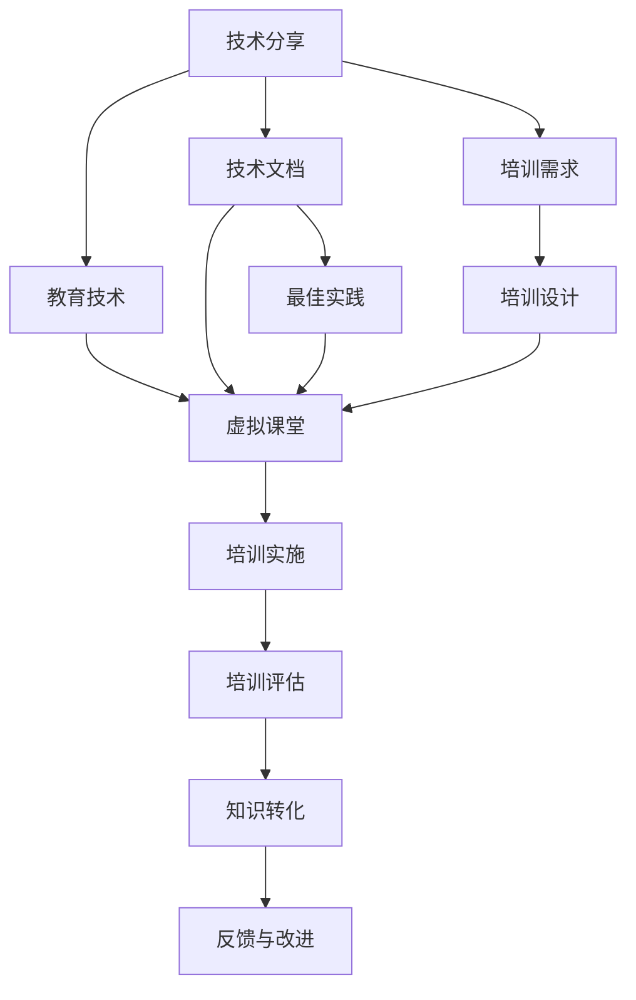

                 

# 如何将技术分享转化为企业技术培训

> 关键词：技术分享,企业培训,知识传递,教育技术,技术文档,最佳实践,虚拟课堂

## 1. 背景介绍

### 1.1 问题由来
在当下快速发展的技术环境中，技术的持续进步对企业的生存与发展至关重要。企业必须不断地将新技术、新方法和新工具引入到其核心业务中，以保持竞争力。然而，技术的快速迭代给企业带来了知识传递和员工技能提升的巨大挑战。传统的人才培养方式往往滞后于技术发展的速度，难以跟上变化的节奏。

在此背景下，企业亟需找到一种高效、灵活且经济的方式来进行技术分享，将最新的技术知识转化为企业内部的培训内容，从而提升员工的技术能力和业务水平。

### 1.2 问题核心关键点
技术分享与企业培训的核心关键点包括：
1. 如何高效、系统地收集和整理技术知识。
2. 如何将技术知识与企业实际业务场景相结合。
3. 如何通过有效的培训方式，将技术知识传递给员工。
4. 如何评估培训效果，确保知识转化。
5. 如何持续更新培训内容，保持知识的最新性。

这些关键点涵盖了技术分享与企业培训的全过程，从内容获取到培训实施再到效果评估，每一个环节都需要精心设计和执行。

## 2. 核心概念与联系

### 2.1 核心概念概述

为了更好地理解如何将技术分享转化为企业技术培训，首先需要介绍一些核心概念：

- **技术分享**：指通过各种途径（如会议、研讨会、博客、视频等）将最新的技术知识和经验传递给他人的过程。技术分享是技术知识传播的重要方式之一，有助于技术的快速传播和应用。

- **企业培训**：指企业为了提升员工技能，为其提供系统的、有组织的培训活动。企业培训是企业人力资源管理的重要组成部分，是提升员工素质和业务能力的关键手段。

- **知识传递**：指将信息、技能和经验从一个主体传递到另一个主体的过程。知识传递是教育培训的核心，旨在帮助学习者掌握新的知识和技能。

- **教育技术(EdTech)**：指利用信息技术手段辅助教育培训的领域。教育技术包括但不限于在线课程、虚拟教室、学习管理系统、智能辅导系统等。

- **技术文档**：指详细描述技术原理、使用方法、维护技巧等技术细节的文档。技术文档是技术知识的重要载体，是技术分享的重要形式之一。

- **最佳实践**：指在特定情境下，经过验证并被证明是最有效的方法和策略。最佳实践是技术分享和培训中的重要参考，能够指导员工如何正确地应用技术。

- **虚拟课堂**：指利用虚拟现实、增强现实等技术，为学习者提供沉浸式学习体验的在线课堂。虚拟课堂可以模拟真实课堂环境，提升学习效果。

### 2.2 核心概念原理和架构的 Mermaid 流程图(Mermaid 流程节点中不要有括号、逗号等特殊字符)



这个流程图展示了技术分享、技术文档、教育技术、虚拟课堂、最佳实践、培训需求、培训设计、培训实施、培训评估、知识转化、反馈与改进等核心概念之间的联系。

## 3. 核心算法原理 & 具体操作步骤

### 3.1 算法原理概述

将技术分享转化为企业技术培训的过程，可以视为一种有组织的知识传递过程。其核心原理是：通过系统的培训设计和有效的技术文档、最佳实践和虚拟课堂等教育技术手段，将技术知识转化为员工的技能。这一过程包括以下几个关键步骤：

1. **技术分享**：收集和整理最新的技术知识。
2. **知识整合**：将技术知识与企业业务场景结合，形成系统化的培训内容。
3. **培训实施**：通过虚拟课堂等教育技术手段，将培训内容传递给员工。
4. **效果评估**：评估培训效果，确保知识转化。
5. **反馈与改进**：根据培训反馈进行持续改进，更新培训内容。

### 3.2 算法步骤详解

#### 3.2.1 技术收集与整理

1. **技术收集**：通过技术会议、技术论坛、专业博客、技术报告等多种渠道，收集最新的技术知识。

2. **技术文档编写**：将收集到的技术知识编写成详细的技术文档，包括技术原理、使用方法、最佳实践等。

#### 3.2.2 知识整合与培训设计

1. **需求分析**：了解企业业务和技术需求，确定培训目标和内容。

2. **内容设计**：将技术文档、最佳实践等转化为培训课程内容，设计课程结构。

3. **资源准备**：准备虚拟教室、在线课程平台、学习管理系统等教育技术资源。

#### 3.2.3 培训实施

1. **虚拟课堂搭建**：利用虚拟现实、增强现实等技术，搭建虚拟教室，模拟真实课堂环境。

2. **课程实施**：在虚拟课堂上实施培训课程，通过讲解、演示、互动等多种方式传递知识。

3. **学习管理**：使用学习管理系统，记录学习者的学习进度和反馈，进行个性化辅导。

#### 3.2.4 效果评估与知识转化

1. **培训评估**：通过在线测试、项目作业、课堂反馈等方式评估培训效果。

2. **知识转化**：将培训内容与实际业务场景结合，通过项目实践、知识分享等方式促进知识转化。

#### 3.2.5 反馈与改进

1. **反馈收集**：收集学习者的培训反馈，分析培训效果。

2. **内容更新**：根据反馈结果，更新培训内容和教育技术资源。

3. **持续改进**：建立持续改进机制，确保培训内容与技术发展的同步性。

### 3.3 算法优缺点

#### 3.3.1 优点

1. **系统性**：通过系统化的培训设计，确保培训内容全面、深入，能够满足企业实际需求。

2. **灵活性**：利用教育技术手段，可以灵活地调整培训时间和地点，提高培训的便利性和参与度。

3. **成本效益**：相比于传统的线下培训，虚拟课堂等教育技术手段可以显著降低培训成本，提高资源利用率。

4. **效果显著**：通过系统化的培训设计和有效的评估机制，确保知识能够有效转化，提升员工技能。

#### 3.3.2 缺点

1. **技术门槛**：教育技术手段的引入需要一定的技术投入，对技术团队的要求较高。

2. **内容更新难度**：技术快速迭代，培训内容需要持续更新，工作量较大。

3. **互动性不足**：虚拟课堂等技术手段可能缺乏面对面互动，影响学习效果。

4. **培训效果难评估**：知识转化效果的评估较为复杂，难以量化。

### 3.4 算法应用领域

技术分享与企业培训的范式在多个领域得到广泛应用，包括但不限于：

- **IT行业**：软件开发、系统架构、网络安全等领域，新技术层出不穷，企业培训需求迫切。

- **制造业**：自动化、机器人技术、工业互联网等领域的知识更新迅速，需要快速传递新技术。

- **金融行业**：区块链、大数据、人工智能等新技术的应用，对金融从业人员的技术要求日益提高。

- **教育行业**：在线教育、智慧教育等领域的知识传递，需要高效、灵活的培训方式。

## 4. 数学模型和公式 & 详细讲解 & 举例说明

### 4.1 数学模型构建

为了更精确地描述技术分享与企业培训的过程，我们可以构建一个简单的数学模型。假设企业有 $N$ 名员工，技术分享和培训过程分为 $M$ 个阶段，每个阶段持续时间为 $T$，知识传递效率为 $E$，员工知识掌握度为 $K$，则总知识转化时间 $T_{\text{total}}$ 可以表示为：

$$
T_{\text{total}} = M \times T \times E
$$

其中 $M$ 为培训阶段数，$T$ 为每个阶段持续时间，$E$ 为知识传递效率，$K$ 为员工知识掌握度。

### 4.2 公式推导过程

假设企业通过 $N$ 次技术分享活动，每次分享的知识量为 $X$，员工通过培训后知识掌握度提升为 $K'$，则总知识量 $X_{\text{total}}$ 可以表示为：

$$
X_{\text{total}} = N \times X
$$

其中 $N$ 为技术分享次数，$X$ 为每次分享的知识量。

### 4.3 案例分析与讲解

假设企业进行了 $M=5$ 个阶段的培训，每个阶段持续时间为 $T=2$ 天，知识传递效率为 $E=0.8$，员工知识掌握度提升为 $K'=0.9$，则总知识转化时间 $T_{\text{total}}$ 和总知识量 $X_{\text{total}}$ 分别为：

$$
T_{\text{total}} = 5 \times 2 \times 0.8 = 8 \text{天}
$$

$$
X_{\text{total}} = 5 \times X
$$

假设每次技术分享的知识量为 $X=100$，则总知识量为 $X_{\text{total}} = 5 \times 100 = 500$。

通过这个简单的数学模型，我们可以初步评估技术分享和培训的效果，为后续的实践提供理论依据。

## 5. 项目实践：代码实例和详细解释说明

### 5.1 开发环境搭建

为了实现技术分享与企业培训的自动化，我们需要搭建一个开发环境。以下是基于 Python 和 Flask 的开发环境搭建流程：

1. **安装 Python 和 Flask**：确保 Python 版本为 3.7 及以上，通过 pip 安装 Flask。

2. **开发环境搭建**：使用 Flask 搭建一个简单的 web 服务，用于管理技术分享和培训资源。

3. **数据库配置**：配置数据库连接信息，存储技术分享、培训内容、员工学习记录等数据。

### 5.2 源代码详细实现

以下是一个简单的 Flask 应用程序，用于管理技术分享和培训资源：

```python
from flask import Flask, render_template, request
from flask_sqlalchemy import SQLAlchemy
from datetime import datetime

app = Flask(__name__)
app.config['SQLALCHEMY_DATABASE_URI'] = 'sqlite:///database.db'
db = SQLAlchemy(app)

class TechnologyShare(db.Model):
    id = db.Column(db.Integer, primary_key=True)
    title = db.Column(db.String(100))
    content = db.Column(db.Text)
    date = db.Column(db.DateTime, default=datetime.utcnow)

class TrainingCourse(db.Model):
    id = db.Column(db.Integer, primary_key=True)
    title = db.Column(db.String(100))
    content = db.Column(db.Text)
    date = db.Column(db.DateTime, default=datetime.utcnow)

@app.route('/')
def index():
    technology_shares = TechnologyShare.query.all()
    training_courses = TrainingCourse.query.all()
    return render_template('index.html', technology_shares=technology_shares, training_courses=training_courses)

@app.route('/share', methods=['POST'])
def share_tech():
    title = request.form.get('title')
    content = request.form.get('content')
    new_share = TechnologyShare(title=title, content=content)
    db.session.add(new_share)
    db.session.commit()
    return 'Technology share created'

@app.route('/course', methods=['POST'])
def create_course():
    title = request.form.get('title')
    content = request.form.get('content')
    new_course = TrainingCourse(title=title, content=content)
    db.session.add(new_course)
    db.session.commit()
    return 'Training course created'
```

### 5.3 代码解读与分析

以上代码展示了如何通过 Flask 实现技术分享和培训资源的创建和管理。具体功能包括：

- 创建技术分享记录
- 创建培训课程记录
- 查询和展示技术分享和培训资源

代码中使用了 SQLAlchemy 库来管理数据库，确保数据存储和查询的高效性。通过 Flask 的模板引擎，可以将数据动态展示在网页上，方便用户查看和管理。

### 5.4 运行结果展示

启动 Flask 应用后，可以在浏览器中访问 http://localhost:5000 查看技术分享和培训资源的列表。用户可以通过表单提交功能创建新的技术分享和培训资源，系统会将这些信息存储在数据库中，并在网页上实时展示。

## 6. 实际应用场景

### 6.1 智能制造技术分享

在智能制造领域，企业需要不断引入先进的自动化、机器人技术。通过技术分享和培训，企业可以快速掌握新技术，提升生产效率和产品质量。

具体应用场景包括：
- 定期举办智能制造技术分享会，邀请行业专家介绍最新技术。
- 通过在线课程平台，提供自动化、机器人技术培训课程。
- 利用虚拟教室，进行远程技术演示和互动。

### 6.2 金融科技知识普及

金融科技领域新技术层出不穷，如区块链、大数据、人工智能等。企业需要快速提升金融科技知识，以应对市场变化。

具体应用场景包括：
- 通过技术分享会，介绍区块链、大数据、人工智能等最新技术。
- 利用在线教育平台，提供金融科技知识课程。
- 组织专家讲座，邀请知名金融机构的技术专家分享经验。

### 6.3 医疗健康技术培训

医疗健康领域新技术的引入，如远程医疗、智能诊断等，能够显著提升医疗服务的质量和效率。

具体应用场景包括：
- 通过技术分享会，介绍远程医疗、智能诊断等最新技术。
- 利用在线课程平台，提供医疗健康技术培训课程。
- 组织专家讲座，邀请医疗专家分享最新研究成果。

### 6.4 未来应用展望

随着技术分享与企业培训范式的不断演进，未来将呈现以下几个趋势：

1. **自动化技术**：利用人工智能、机器学习等自动化技术，实现技术分享和培训的自动化管理。

2. **个性化学习**：根据员工的学习情况和反馈，提供个性化的学习路径和资源。

3. **混合式学习**：结合线上和线下培训方式，提供更加灵活和多样化的学习体验。

4. **沉浸式体验**：利用虚拟现实、增强现实等技术，提供沉浸式的学习体验，提升学习效果。

5. **跨领域应用**：将技术分享与企业培训范式推广到更多领域，提升各行业的技术水平和创新能力。

## 7. 工具和资源推荐

### 7.1 学习资源推荐

为了帮助企业掌握技术分享与企业培训的精髓，这里推荐一些优质的学习资源：

1. **Coursera**：提供丰富的在线课程，涵盖信息技术、金融科技、医疗健康等多个领域。

2. **edX**：提供大量开源课程和专业认证，帮助企业提升员工技能。

3. **Udacity**：提供高质量的在线纳米学位课程，聚焦于技能提升和职业发展。

4. **Khan Academy**：提供免费的教育资源，涵盖基础科学、数学、编程等多个领域。

5. **edTech Podcast**：专注于教育技术领域的播客，提供最新的教育技术和趋势分析。

### 7.2 开发工具推荐

为了实现技术分享与企业培训的自动化，这里推荐一些开发工具：

1. **Flask**：轻量级 Web 框架，适合快速搭建技术分享和培训平台。

2. **SQLAlchemy**：Python ORM 库，支持多种数据库，用于管理培训资源和用户数据。

3. **Jupyter Notebook**：交互式编程环境，适合数据探索和模型训练。

4. **Kaggle**：数据科学竞赛平台，提供丰富的数据集和模型资源。

5. **Tableau**：数据可视化工具，帮助企业理解培训数据和效果。

### 7.3 相关论文推荐

为了深入了解技术分享与企业培训的研究进展，这里推荐一些相关的论文：

1. **"The Future of Education Technology"**：探讨教育技术的发展趋势和应用前景。

2. **"Technology Transfer and Its Impact on Business Innovation"**：研究技术转移对企业创新的影响。

3. **"Training and Development in the Digital Age"**：分析数字化时代下的企业培训需求和策略。

4. **"The Role of Virtual Reality in Training and Development"**：探讨虚拟现实技术在培训中的应用。

5. **"Educational Technology in the 21st Century"**：回顾教育技术在21世纪的进展和挑战。

## 8. 总结：未来发展趋势与挑战

### 8.1 总结

本文对如何将技术分享转化为企业技术培训的过程进行了系统的介绍。通过详细的算法原理和操作步骤，展示了如何利用教育技术手段，将最新的技术知识转化为员工的技能。同时，我们分析了该范式在多个领域的应用场景，并为未来的发展提供了方向性建议。

通过本文的系统梳理，可以看到，技术分享与企业培训的范式正成为企业人力资源管理的重要工具，为员工技能提升和知识传递提供了新的途径。未来，随着教育技术的不断发展，企业将能够更加高效地进行技术传递和培训，提升组织的核心竞争力。

### 8.2 未来发展趋势

展望未来，技术分享与企业培训的范式将呈现以下几个发展趋势：

1. **自动化与智能化**：利用人工智能、机器学习等自动化技术，实现技术分享和培训的自动化管理。

2. **个性化与定制化**：根据员工的学习情况和反馈，提供个性化的学习路径和资源，提升学习效果。

3. **跨领域应用**：将技术分享与企业培训范式推广到更多领域，提升各行业的技术水平和创新能力。

4. **混合式学习**：结合线上和线下培训方式，提供更加灵活和多样化的学习体验。

5. **沉浸式体验**：利用虚拟现实、增强现实等技术，提供沉浸式的学习体验，提升学习效果。

### 8.3 面临的挑战

尽管技术分享与企业培训范式在企业中的应用前景广阔，但在实践过程中仍面临诸多挑战：

1. **技术门槛**：教育技术手段的引入需要一定的技术投入，对技术团队的要求较高。

2. **内容更新难度**：技术快速迭代，培训内容需要持续更新，工作量较大。

3. **互动性不足**：虚拟课堂等技术手段可能缺乏面对面互动，影响学习效果。

4. **培训效果难评估**：知识转化效果的评估较为复杂，难以量化。

5. **资源投入**：教育技术手段的引入需要较高的资源投入，企业需要考虑成本效益。

### 8.4 研究展望

未来，研究者需要在以下几个方面进行深入探索：

1. **自动化技术的应用**：研究如何利用自动化技术，提高技术分享和培训的效率和效果。

2. **个性化学习的设计**：探索个性化学习路径和资源的设计方法，提升学习效果。

3. **混合式学习的实施**：研究线上和线下培训方式的结合，提供更加灵活的学习体验。

4. **沉浸式体验的实现**：研究虚拟现实、增强现实等技术的应用，提升学习效果。

5. **效果评估的改进**：研究知识转化效果的评估方法，提高培训效果的可量化性。

6. **跨领域应用的推广**：研究技术分享与企业培训范式在更多领域的应用，提升各行业的技术水平和创新能力。

通过这些研究方向的探索，相信技术分享与企业培训范式将进一步成熟，为企业的技术传递和培训提供更加高效、灵活和多样化的解决方案。

## 9. 附录：常见问题与解答

**Q1：技术分享与企业培训的范式是否适用于所有企业？**

A: 技术分享与企业培训的范式适用于绝大多数企业，特别是技术密集型、创新型企业。对于传统行业，也可以根据具体情况进行适应性改造。

**Q2：技术分享和培训如何保证知识转化？**

A: 通过系统化的培训设计、有效的评估机制和持续的反馈改进，可以有效保证知识转化。同时，结合虚拟课堂等教育技术手段，提升学习效果。

**Q3：如何平衡技术分享与企业业务需求？**

A: 通过需求分析，明确培训目标和内容，确保技术分享与企业业务需求的紧密结合。利用教育技术手段，灵活调整培训时间和地点，提高培训的便利性和参与度。

**Q4：技术分享和培训的成本如何控制？**

A: 利用在线课程平台和虚拟教室等教育技术手段，可以显著降低培训成本。同时，结合混合式学习方式，提高资源利用率，降低培训成本。

**Q5：如何衡量技术分享和培训的效果？**

A: 通过在线测试、项目作业、课堂反馈等方式，评估培训效果。结合学习管理系统，记录学习者的学习进度和反馈，进行个性化辅导。

**Q6：技术分享和培训的实施难点在哪里？**

A: 技术分享和培训的实施难点在于技术门槛和内容更新难度。企业需要具备一定的技术能力，并持续更新培训内容，以满足技术发展的要求。

通过以上问题和解答，希望能够更好地帮助企业理解技术分享与企业培训的范式，并解决在实践过程中可能遇到的问题。相信通过不断的探索和改进，技术分享与企业培训将更加高效、灵活，为企业的技术传递和员工技能提升提供坚实的基础。

---

作者：禅与计算机程序设计艺术 / Zen and the Art of Computer Programming

