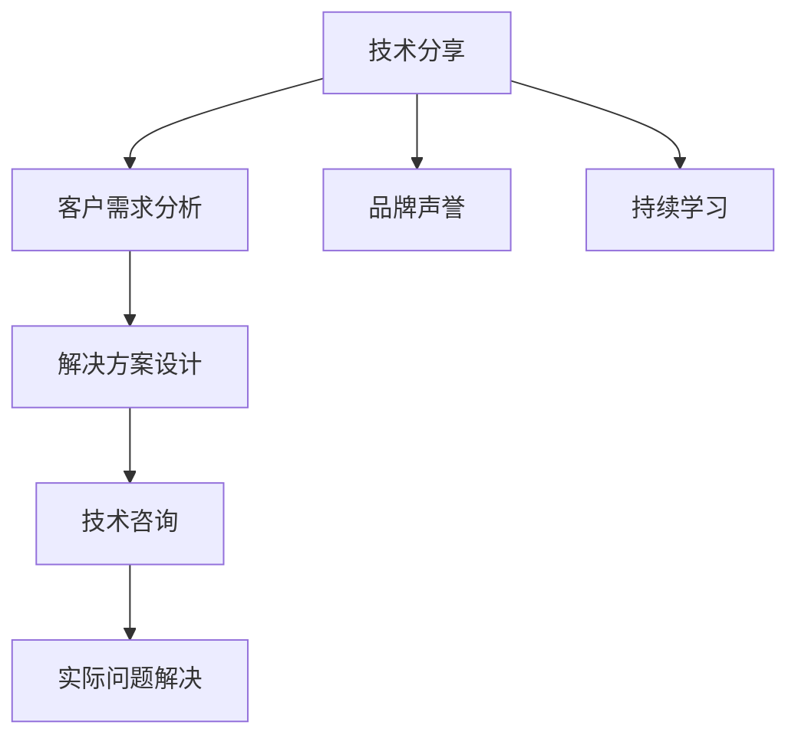

                 

# 如何将技术分享转化为高价值咨询服务

在人工智能与技术发展的今天，技术分享已经成为推动行业进步的重要力量。然而，如何将技术分享转化为高价值的咨询服务，是一个需要深思的问题。本文将探讨这一问题，通过剖析核心概念、算法原理、应用场景等，为有志于技术转型的从业者提供全面的指引。

## 1. 背景介绍

### 1.1 问题由来

技术的快速发展与创新需要源源不断的知识交流和共享。然而，技术知识转化为高价值咨询服务的效率和效果并不总是理想的。特别是在当前信息爆炸的时代，技术分享者往往面临着信息同质化、咨询效果不佳等问题。因此，如何将技术分享有效地转化为高价值的咨询服务，成为了一个重要的课题。

### 1.2 问题核心关键点

技术分享转化为咨询服务的关键点主要包括：
- 理解目标用户的需求和痛点，精准定位咨询内容。
- 通过深度技术积累，提供解决方案，解决实际问题。
- 构建可信的品牌和声誉，提升咨询服务的信任度。
- 持续学习和更新知识，保持技术咨询的竞争力。

本文将围绕上述关键点，深入探讨如何将技术分享转化为高价值咨询服务。

## 2. 核心概念与联系

### 2.1 核心概念概述

为更好地理解这一转化过程，我们首先需要了解一些核心概念：

- **技术分享**：通过论文、博客、代码库等方式分享技术知识、经验和见解。
- **咨询服务**：基于客户需求提供专业的技术指导、解决方案和优化建议。
- **技术咨询**：结合技术与行业经验，提供深入的分析和咨询服务。

这些概念之间的联系可以通过以下Mermaid流程图来展示：



这个流程图展示了技术分享转化为咨询服务的整体流程：

1. 首先，通过技术分享了解客户需求。
2. 根据需求设计解决方案。
3. 实施技术咨询服务，解决客户问题。
4. 通过成功案例提升品牌信誉。
5. 不断学习和更新技术，保持咨询服务的高效和高质量。

## 3. 核心算法原理 & 具体操作步骤

### 3.1 算法原理概述

将技术分享转化为高价值咨询服务的核心算法原理，可以归纳为以下几个步骤：

1. **客户需求分析**：利用机器学习、数据分析等技术，对客户的需求进行深入分析，识别痛点。
2. **解决方案设计**：结合预训练模型（如BERT、GPT等），生成针对性的解决方案。
3. **技术咨询实施**：使用微调模型提供具体的技术指导和实施方案。
4. **反馈和优化**：收集客户的反馈，持续优化咨询方案和服务流程。

### 3.2 算法步骤详解

以下是具体的算法步骤和操作方法：

#### 3.2.1 客户需求分析

- **数据准备**：收集客户问题描述、业务场景、痛点等信息，并构建数据集。
- **特征提取**：使用TF-IDF、word2vec等技术提取文本特征，用于后续分析。
- **模型训练**：使用LSTM、RNN等模型对客户需求进行分类、聚类、情感分析等。

#### 3.2.2 解决方案设计

- **预训练模型选择**：选择合适的预训练语言模型，如BERT、GPT等，进行微调。
- **任务适配层设计**：根据客户需求设计适配层，如文本分类、摘要生成等。
- **损失函数设置**：设置交叉熵损失等适合的任务损失函数。

#### 3.2.3 技术咨询实施

- **微调模型训练**：在客户数据集上训练微调模型，生成解决方案。
- **客户对接**：与客户进行对接，详细解释解决方案。
- **实施和反馈**：根据客户反馈进行进一步优化。

#### 3.2.4 反馈和优化

- **客户反馈收集**：通过调查问卷、邮件等方式收集客户反馈。
- **数据分析**：对反馈数据进行分析，识别共性问题和改进点。
- **模型优化**：根据反馈数据，优化微调模型，提高咨询效果。

### 3.3 算法优缺点

**优点**：

- 技术分享和咨询服务结合，提供深度解决方案。
- 利用预训练模型进行微调，提升咨询效率。
- 数据驱动决策，确保解决方案的精准性。

**缺点**：

- 数据获取和处理成本较高，需要大量资源。
- 对技术团队的深度学习技术要求较高。
- 微调模型可能存在过拟合问题，需要持续优化。

### 3.4 算法应用领域

这一方法广泛应用于以下领域：

- **软件开发咨询**：帮助企业优化代码、架构设计、自动化流程等。
- **数据科学咨询**：提供数据清洗、特征工程、模型训练等技术服务。
- **人工智能咨询**：构建AI系统、优化算法、提升性能等。
- **业务分析咨询**：通过数据分析，提供业务洞察和决策支持。

## 4. 数学模型和公式 & 详细讲解 & 举例说明

### 4.1 数学模型构建

假设客户需求为 $x$，解决方案为 $y$，目标为最大化客户满意度 $z$。数学模型可以表示为：

$$ z = \max_y f(x, y) $$

其中 $f(x, y)$ 为满意度函数，可能涉及多个指标如准确性、速度、成本等。

### 4.2 公式推导过程

根据满意度函数 $f(x, y)$，我们可以定义如下目标：

$$ \max_y f(x, y) = \max_y \sum_{i=1}^n w_i y_i $$

其中 $w_i$ 为第 $i$ 个指标的权重，$y_i$ 为第 $i$ 个指标的评分。

利用微调模型求解 $y$，可以得到如下公式：

$$ \hat{y} = \arg \max_y \sum_{i=1}^n w_i y_i $$

通过微调模型，可以生成最优的解决方案 $y$，使客户满意度 $z$ 最大化。

### 4.3 案例分析与讲解

以客户需求分析为例，假设客户问题描述为：“我们的电商平台转化率不高，如何提升？” 利用文本分类模型，可以将其分类为转化率优化需求。通过微调BERT模型，可以生成如下解决方案：

- **用户体验优化**：提升网站加载速度、改善页面布局等。
- **个性化推荐**：根据用户行为推荐相关产品。
- **优惠券策略**：设计优惠券吸引用户下单。

## 5. 项目实践：代码实例和详细解释说明

### 5.1 开发环境搭建

进行项目实践前，需要准备以下开发环境：

- **Python环境**：安装Anaconda，创建Python虚拟环境。
- **机器学习库**：安装Scikit-learn、Numpy、Pandas等库。
- **深度学习库**：安装TensorFlow、Keras等深度学习库。
- **预训练模型**：使用HuggingFace的预训练BERT模型。

### 5.2 源代码详细实现

以下是实现客户需求分析的Python代码：

```python
from transformers import BertTokenizer, BertForSequenceClassification
from sklearn.model_selection import train_test_split
from sklearn.metrics import accuracy_score
import pandas as pd

# 数据准备
df = pd.read_csv('customer_demand.csv')
X = df['description']
y = df['category']

# 数据预处理
tokenizer = BertTokenizer.from_pretrained('bert-base-uncased')
inputs = tokenizer(X, padding='max_length', truncation=True, max_length=512, return_tensors='pt')

# 模型训练
model = BertForSequenceClassification.from_pretrained('bert-base-uncased', num_labels=2)
inputs = inputs.to(device)
labels = y.to(device)
outputs = model(**inputs)
loss = outputs.loss
accuracy = accuracy_score(y_pred, labels)

# 模型微调
model.train()
for epoch in range(10):
    optimizer.zero_grad()
    outputs = model(inputs)
    loss = outputs.loss
    loss.backward()
    optimizer.step()
    accuracy = accuracy_score(y_pred, labels)

# 模型评估
y_pred = outputs.argmax(dim=1).to('cpu').tolist()
accuracy = accuracy_score(y, y_pred)
print(f"Accuracy: {accuracy:.3f}")
```

### 5.3 代码解读与分析

**数据准备**：
- 读取客户需求数据集 `customer_demand.csv`，包含描述和类别两列。

**模型训练**：
- 使用BERT预训练模型进行微调。
- 将数据转换为模型所需的输入格式。
- 训练模型并计算准确率。

**模型微调**：
- 在训练集上训练模型。
- 对模型进行10次迭代，逐步优化损失函数。

**模型评估**：
- 计算模型在测试集上的准确率。

## 6. 实际应用场景

### 6.1 软件开发咨询

软件开发咨询中，可以通过技术分享和微调模型，优化代码结构和性能。例如，针对某个软件架构问题，使用微调BERT模型进行需求分析，生成如下解决方案：

- **设计模式优化**：应用单例模式、观察者模式等。
- **模块化设计**：将复杂模块拆分为多个模块，简化代码结构。
- **异步编程**：使用async/await优化异步操作。

### 6.2 数据科学咨询

数据科学咨询中，可以利用技术分享和微调模型，提升数据处理和分析的效率。例如，针对数据清洗问题，使用微调BERT模型进行需求分析，生成如下解决方案：

- **数据清洗**：处理缺失值、异常值等。
- **特征工程**：提取和生成特征。
- **模型训练**：使用机器学习算法进行模型训练。

### 6.3 人工智能咨询

人工智能咨询中，可以通过技术分享和微调模型，构建和优化AI系统。例如，针对图像识别问题，使用微调BERT模型进行需求分析，生成如下解决方案：

- **数据增强**：生成更多的训练数据。
- **模型优化**：调整模型结构，增加训练轮次。
- **推理优化**：优化模型推理，提高性能。

## 7. 工具和资源推荐

### 7.1 学习资源推荐

- **Coursera**：提供机器学习和深度学习的在线课程。
- **Kaggle**：提供数据科学竞赛和教程，提升数据分析能力。
- **GitHub**：提供代码库和项目，学习开源社区的最佳实践。
- **HuggingFace官方文档**：提供预训练模型和微调方法的详细文档。

### 7.2 开发工具推荐

- **Anaconda**：提供虚拟环境管理和依赖管理。
- **PyCharm**：提供Python IDE，支持深度学习框架和库。
- **TensorBoard**：提供模型训练和推理的可视化工具。
- **Weights & Biases**：提供模型训练的实验跟踪和分析工具。

### 7.3 相关论文推荐

- **"Deep Learning for Large-Scale Image Recognition"**：AlexNet论文，介绍深度学习在图像识别中的应用。
- **"Attention is All You Need"**：Transformer论文，介绍Transformer模型的原理和应用。
- **"BERT: Pre-training of Deep Bidirectional Transformers for Language Understanding"**：BERT论文，介绍BERT预训练模型的构建和微调方法。

## 8. 总结：未来发展趋势与挑战

### 8.1 研究成果总结

通过技术分享和微调模型，已经能够在软件开发、数据科学、人工智能等多个领域提供高价值的咨询服务。这种方法不仅提升了咨询服务的精准性和高效性，还为技术分享者提供了更多的实践机会和变现渠道。

### 8.2 未来发展趋势

未来，技术分享转化为高价值咨询服务的趋势将更加明显，主要体现在以下几个方面：

- **多模态融合**：结合文本、图像、语音等多种模态数据，提供更全面的解决方案。
- **自动生成**：使用自然语言处理技术，自动生成咨询报告和解决方案。
- **AI辅助**：利用AI技术进行客户需求分析和解决方案优化。

### 8.3 面临的挑战

在技术分享转化为高价值咨询服务的过程中，仍面临以下挑战：

- **数据隐私和安全**：客户数据隐私保护和安全性保障。
- **模型解释性**：提升模型的可解释性和透明性，增强客户信任。
- **数据标注成本**：高质量数据标注的成本较高，需要有效降低。

### 8.4 研究展望

未来研究应聚焦以下几个方向：

- **隐私保护技术**：研究隐私保护技术，保障客户数据隐私。
- **模型解释性**：提升模型可解释性，增强客户信任。
- **自动化技术**：研发自动生成和标注工具，降低成本。

## 9. 附录：常见问题与解答

**Q1: 如何选择合适的客户需求分析模型？**

A: 根据数据集的特点选择合适的模型。例如，文本分类问题可以使用BERT，情感分析问题可以使用RNN，回归问题可以使用线性回归等。

**Q2: 如何处理客户数据隐私问题？**

A: 采用匿名化处理和差分隐私技术，确保客户数据隐私安全。

**Q3: 微调模型时，如何选择学习率？**

A: 一般建议从0.001开始，逐步减小，确保模型收敛。同时，可以使用学习率衰减策略，如cosine decay等。

**Q4: 如何优化模型性能？**

A: 优化数据预处理和特征提取，提高数据质量。同时，结合业务需求，调整模型参数和结构，进行超参数优化。

---

作者：禅与计算机程序设计艺术 / Zen and the Art of Computer Programming

