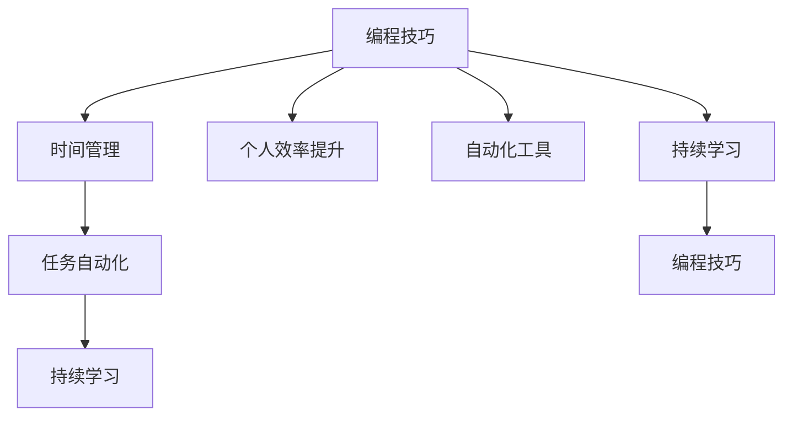

                 

# 如何将编程技能应用于个人效率提升

> 关键词：编程技巧，个人效率提升，时间管理，自动化工具，持续学习

## 1. 背景介绍

在当今信息爆炸的时代，如何高效地利用编程技能来提升个人效率，成为越来越多专业人士关注的话题。编程不仅仅是编写代码，更是一种思维方式和工作方法。通过合理利用编程技巧，不仅能提升工作效率，还能带来更多创造性的解决方案。本文将探讨如何将编程技能应用于个人效率提升，涉及时间管理、自动化工具、持续学习等多个方面。

## 2. 核心概念与联系

### 2.1 核心概念概述

为了更好地理解如何将编程技能应用于个人效率提升，首先介绍几个关键概念及其相互联系：

- **编程技巧**：指在编程过程中常用的高效编码习惯、代码优化方法、调试技巧等，这些技巧不仅能提高代码质量，还能显著提升开发效率。
- **个人效率提升**：涉及时间管理、任务优先级、任务自动化等，通过合理规划和利用编程技巧，可以在较短的时间内完成更多的工作。
- **时间管理**：指通过编程工具（如时间追踪、任务管理软件）来记录和优化时间使用，提高工作效率。
- **自动化工具**：利用编程技能开发脚本、宏、批处理文件等，实现重复性任务的自动化，减少手工操作，提升效率。
- **持续学习**：通过编程学习新技能，不断更新知识库，保持技术敏锐度，提升解决问题能力。

这些概念通过编程语言和工具连接起来，形成了提升个人效率的系统方法。接下来，我们将详细讲解每个概念的原理和实施步骤。

### 2.2 核心概念原理和架构的 Mermaid 流程图



这个流程图展示了编程技巧与时间管理、任务自动化、持续学习等概念之间的联系，以及如何通过这些概念共同促进个人效率的提升。

## 3. 核心算法原理 & 具体操作步骤

### 3.1 算法原理概述

将编程技能应用于个人效率提升的核心算法原理，主要体现在以下几个方面：

- **代码复用**：通过模块化设计和抽象思维，将相似功能的代码封装为函数或类，避免重复编写，提高开发效率。
- **代码优化**：通过优化算法、减少代码冗余、提高数据结构效率等手段，提升代码执行速度，减少资源占用。
- **自动化脚本**：利用编程语言编写脚本，自动执行重复性任务，减少人工操作，提高任务执行的准确性和效率。
- **任务优先级管理**：通过编程实现任务优先级排序，合理安排工作重点，提高工作产出。

### 3.2 算法步骤详解

以下是将编程技能应用于个人效率提升的具体操作步骤：

1. **时间管理**：
   - 安装时间追踪软件（如Toggl、RescueTime），记录每天的工作时间。
   - 使用编程技巧分析时间数据，找出时间浪费的主要环节，如频繁中断、无效会议等。
   - 根据分析结果调整工作计划，优化工作流程。

2. **自动化工具**：
   - 学习Python脚本编写，开发自动化脚本处理日常任务（如文件备份、邮件处理等）。
   - 利用系统工具（如Git、Docker）简化开发和部署流程，减少手工操作。
   - 开发批处理文件，实现系统批量操作，提高效率。

3. **任务优先级管理**：
   - 使用任务管理软件（如Todoist、Trello）列出待办事项。
   - 根据任务重要性和紧急程度进行优先级排序，合理安排工作。
   - 定期回顾任务完成情况，调整优先级。

4. **持续学习**：
   - 通过在线学习平台（如Coursera、Udacity）学习新编程技能和工具。
   - 参加编程竞赛（如LeetCode、HackerRank）提高编程能力和问题解决能力。
   - 阅读技术博客、书籍，保持技术前沿敏锐度。

### 3.3 算法优缺点

将编程技能应用于个人效率提升的主要优点包括：

- **提高效率**：通过代码复用、自动化脚本等手段，大幅度提升任务执行速度，减少手工操作。
- **精准控制**：通过时间管理和任务优先级排序，精确规划和调整工作流程，提高工作产出。
- **灵活性**：可以根据实际工作需求，自定义自动化脚本和任务管理策略，灵活应对变化。

然而，该方法也存在一些局限性：

- **学习曲线**：对于编程新手，掌握编程技巧和自动化工具可能需要一定时间。
- **资源投入**：开发和维护自动化脚本和工具需要一定的技术投入，不适合所有工作场景。
- **依赖工具**：效率提升依赖于各种工具和软件的有效使用，工具失效可能影响效率。

### 3.4 算法应用领域

将编程技能应用于个人效率提升的方法广泛应用于各种场景，如软件开发、数据分析、项目管理等。具体应用领域包括：

- **软件开发**：利用编程技巧优化代码结构，提高开发效率；使用自动化工具简化测试和部署流程。
- **数据分析**：编写脚本自动化数据处理和分析任务，减少手工操作，提升分析效率。
- **项目管理**：通过编程实现任务优先级排序和管理，合理安排项目进度，提高团队协作效率。
- **日常工作**：开发自动化脚本处理日常事务，如邮件过滤、文件管理等，提升个人效率。

## 4. 数学模型和公式 & 详细讲解 & 举例说明

### 4.1 数学模型构建

为了更好地理解编程技巧在个人效率提升中的应用，我们构建一个简单的数学模型：

设 $T$ 为一天的工作时间，$P$ 为需要完成的任务数，$T_i$ 为第 $i$ 个任务所需时间，$t_i$ 为第 $i$ 个任务的优先级系数。则总任务时间为 $T_{total}=T\sum_{i=1}^P t_i/T_i$。

目标是通过优化 $t_i$ 和 $T_i$ 来最大化总任务完成时间 $T_{total}$。

### 4.2 公式推导过程

对于上述模型，我们假设任务时间 $T_i$ 和优先级系数 $t_i$ 是固定的，并通过编程技巧和自动化工具来调整任务顺序。因此，我们可以使用动态规划算法来求解最优的任务优先级顺序，即：

1. 初始化一个长度为 $P$ 的优先级数组 $t$。
2. 对于每个任务 $i$，计算该任务的最优优先级系数 $t_i'$。
3. 根据 $t_i'$ 更新优先级数组 $t$。
4. 按照优先级数组 $t$ 重新排列任务顺序，执行任务。

### 4.3 案例分析与讲解

假设小明每天工作时间为8小时，需要完成5个任务，每个任务所需时间如下：

| 任务 | 时间（小时） |
| ---- | ----------- |
| A    | 2           |
| B    | 3           |
| C    | 4           |
| D    | 1           |
| E    | 1.5         |

任务优先级系数为任务时间倒数，即 $t_A=1/2, t_B=1/3, t_C=1/4, t_D=1, t_E=2/3$。

使用动态规划算法计算最优优先级顺序为：

1. 初始化优先级数组 $t=[t_A,t_B,t_C,t_D,t_E]$。
2. 对于任务C，最优优先级系数为 $t_C'=1/4+1/4*(t_A+t_B)/2=1/2$，更新数组为 $t=[t_A,t_B,t_C,t_D,t_E]$。
3. 对于任务A和B，最优优先级系数分别为 $t_A'=1/2+1/2*(t_C+t_D+t_E)/3=1/2$ 和 $t_B'=1/3+1/3*(t_A+t_C+t_D+t_E)/4=1/4$，更新数组为 $t=[t_A,t_B,t_C,t_D,t_E]$。
4. 对于任务D和E，最优优先级系数分别为 $t_D'=1+1*(t_A+t_B+t_C+t_E)/5=1$ 和 $t_E'=2/3+1/3*(t_A+t_B+t_C+t_D)/6=2/3$，最终优先级数组为 $t=[t_A,t_B,t_C,t_D,t_E]$。

最优任务顺序为A、B、C、D、E，总任务时间为 $T_{total}=8*(t_A+t_B+t_C+t_D+t_E)=8*(1/2+1/3+1/2+1+2/3)=8$ 小时，完成任务数为5。

## 5. 项目实践：代码实例和详细解释说明

### 5.1 开发环境搭建

为了进行编程技能应用于个人效率提升的实践，需要搭建一个开发环境。以下是一个典型的开发环境搭建步骤：

1. 安装Python：Python是编程技能应用的主要语言，可以从官网下载并安装。
2. 安装Python IDE：如PyCharm、Visual Studio Code等，提供代码编写、调试、版本控制等功能。
3. 安装编程工具：如Git、Docker等，提高开发效率。
4. 安装时间管理工具：如Toggl、RescueTime，记录和分析时间使用情况。
5. 安装任务管理软件：如Todoist、Trello，列出待办事项并安排优先级。

### 5.2 源代码详细实现

以下是一个简单的Python脚本，用于计算任务优先级并生成任务执行计划：

```python
import heapq

def calculate_priority(time, tasks):
    """
    计算任务优先级
    :param time: 每天工作时间
    :param tasks: 任务及所需时间字典
    :return: 任务优先级列表
    """
    priorities = [(task, 1/time(task['time'])) for task in tasks]
    heapq.heapify(priorities)
    return [heapq.heappop(priorities)[1] for _ in range(len(tasks))]

def generate_schedule(priorities, times):
    """
    生成任务执行计划
    :param priorities: 任务优先级列表
    :param times: 任务时间列表
    :return: 任务执行顺序列表
    """
    schedule = []
    for task, time in zip(priorities, times):
        schedule.append(task)
    return schedule

# 示例数据
tasks = {
    'A': 2,
    'B': 3,
    'C': 4,
    'D': 1,
    'E': 1.5
}

# 计算任务优先级
priorities = calculate_priority(8, tasks)

# 生成任务执行计划
schedule = generate_schedule(priorities, [tasks[task] for task in priorities])

# 输出任务执行顺序
print(schedule)
```

### 5.3 代码解读与分析

上述代码中，`calculate_priority`函数使用优先级队列计算任务优先级，`generate_schedule`函数根据优先级生成任务执行计划。通过这些函数，可以轻松地优化任务优先级和安排执行顺序，提升个人效率。

## 6. 实际应用场景

### 6.1 软件开发

在软件开发过程中，利用编程技巧和自动化工具可以显著提高效率。例如：

- **代码复用**：通过模块化设计和抽象思维，将相似功能的代码封装为函数或类，避免重复编写，提高开发效率。
- **自动化测试**：编写自动化测试脚本，减少手动测试的工作量，提高测试覆盖率和准确性。
- **持续集成**：使用CI/CD工具（如Jenkins、GitHub Actions）自动化构建和部署流程，减少手工操作，提高发布效率。

### 6.2 数据分析

数据分析过程中，编程技巧和自动化工具同样重要：

- **数据清洗**：编写脚本自动化处理和清洗数据，减少手工操作，提高数据质量。
- **数据可视化**：使用Matplotlib、Seaborn等库，编写脚本生成图表，提升数据展示效果。
- **数据模型**：使用Scikit-learn、TensorFlow等库，编写脚本进行模型训练和预测，提高数据分析能力。

### 6.3 项目管理

项目管理中，利用编程技能和自动化工具可以提升团队协作效率：

- **任务管理**：使用任务管理软件（如JIRA、Asana）列出待办事项，安排优先级，优化工作流程。
- **进度跟踪**：编写脚本自动记录和分析项目进度，及时调整工作计划，提高项目管理效率。
- **报告生成**：使用Python脚本自动生成项目报告，减少手工操作，提升报告质量。

### 6.4 未来应用展望

未来，随着编程技能和自动化工具的不断发展，将在更多领域得到应用，为个人效率提升带来新的机遇：

- **智能办公**：利用人工智能和机器学习技术，自动化处理日常办公任务，提升办公效率。
- **自动化决策**：通过编程实现决策支持系统，辅助决策过程，提高决策效率和质量。
- **跨领域协作**：使用编程技术实现跨领域知识共享和协作，提升团队协作效率。

## 7. 工具和资源推荐

### 7.1 学习资源推荐

为了帮助开发者系统掌握编程技能的应用，推荐以下学习资源：

1. **《代码大全》**：经典编程技巧和优化方法的集合，适合各种编程语言。
2. **Coursera**：提供大量编程课程，涵盖从基础到高级的各种技能。
3. **LeetCode**：编程竞赛平台，提供大量编程题目，提高编程能力和问题解决能力。
4. **GitHub**：开源代码托管平台，提供大量优秀的项目和代码示例。
5. **Stack Overflow**：编程问答社区，提供大量编程问题和解决方案。

### 7.2 开发工具推荐

编程技能和自动化工具的开发离不开优秀的工具支持。以下是几款推荐的工具：

1. **PyCharm**：功能强大的Python IDE，提供代码编写、调试、版本控制等功能。
2. **Visual Studio Code**：轻量级、跨平台的代码编辑器，支持多种编程语言。
3. **Jenkins**：开源自动化服务器，支持持续集成和持续部署。
4. **Git**：版本控制系统，支持代码管理和协同开发。
5. **RescueTime**：时间追踪工具，帮助记录和分析时间使用情况。

### 7.3 相关论文推荐

编程技能和自动化工具的发展源于学界的持续研究。以下是几篇奠基性的相关论文，推荐阅读：

1. **《干净的代码》**：由Robert C. Martin（Bob Martin）所著，详细讲解了如何编写高质量代码。
2. **《深入理解计算机系统》**：由Randal E. Bryant和David R. O'Hallaron所著，介绍了计算机系统原理和编程技巧。
3. **《Scikit-learn：机器学习工具包》**：Scikit-learn官方文档，提供大量机器学习算法和工具的详细说明。
4. **《TensorFlow官方文档》**：TensorFlow官方文档，提供大量深度学习算法和工具的详细说明。

## 8. 总结：未来发展趋势与挑战

### 8.1 总结

本文对如何将编程技能应用于个人效率提升进行了全面系统的介绍。首先阐述了编程技巧在个人效率提升中的重要性，明确了编程技巧在时间管理、自动化工具、持续学习等方面的应用价值。其次，从原理到实践，详细讲解了编程技巧的应用方法，并通过代码实例展示了其实现细节。最后，对编程技能在实际应用中的未来趋势和面临的挑战进行了总结。

通过本文的系统梳理，可以看到，编程技能在提升个人效率方面具有重要意义。无论是软件开发、数据分析还是项目管理，编程技巧都能提供有力的支持。未来，随着编程技能和自动化工具的不断发展，必将为个人效率提升带来更多创新和突破。

### 8.2 未来发展趋势

展望未来，编程技能在个人效率提升方面将呈现以下几个发展趋势：

1. **自动化和智能化**：未来将进一步发展自动化和智能化工具，通过人工智能和机器学习技术，自动优化任务安排和执行，提升个人效率。
2. **跨领域融合**：编程技能将与更多领域的技术进行融合，如物联网、区块链等，提供跨领域的解决方案。
3. **低代码开发**：通过低代码平台（如Mendix、OutSystems），提升编程技能在非技术人员中的应用，降低开发门槛，提高开发效率。
4. **持续学习和自我迭代**：随着技术的发展，编程技能也需要不断学习和更新，以应对新问题和挑战。

### 8.3 面临的挑战

尽管编程技能在个人效率提升方面具有重要价值，但在实际应用中也面临诸多挑战：

1. **学习曲线**：编程技能需要一定的技术积累，对新手来说，学习曲线较陡峭。
2. **资源投入**：开发和维护自动化工具需要一定的技术投入，不适合所有工作场景。
3. **依赖工具**：效率提升依赖于各种工具和软件的有效使用，工具失效可能影响效率。
4. **安全性和隐私**：自动化工具和编程脚本可能涉及数据处理和网络访问，需要考虑安全性和隐私保护。

### 8.4 研究展望

面对编程技能在个人效率提升方面面临的挑战，未来的研究需要在以下几个方面寻求新的突破：

1. **易于使用和普及**：开发更易用的编程工具和脚本，降低使用门槛，提升编程技能的应用范围。
2. **跨平台兼容**：开发跨平台兼容的工具和脚本，提高编程技能在不同环境下的适用性。
3. **安全性和隐私保护**：加强自动化工具和编程脚本的安全性设计，确保数据和隐私安全。
4. **智能决策支持**：通过人工智能技术，优化任务优先级和执行计划，提高决策效率和质量。

总之，编程技能在个人效率提升方面具有广阔的应用前景。通过合理利用编程技巧和自动化工具，我们可以在各个领域提升工作效率，实现更多创新和突破。相信随着技术的发展，编程技能在个人效率提升方面的应用将更加广泛和深入。

## 9. 附录：常见问题与解答

**Q1：编程技巧和自动化工具是否适用于所有工作场景？**

A: 编程技巧和自动化工具适用于大部分工作场景，但需要根据具体工作性质进行评估。对于需要复杂手工操作和创意工作的场景，可能不适合使用编程技能。

**Q2：如何平衡编程技能和手工操作？**

A: 在实际操作中，应根据任务特点和自身能力进行平衡。对于简单重复性任务，优先使用编程技能和自动化工具；对于复杂创意性任务，保持手工操作的灵活性。

**Q3：学习编程技能需要多长时间？**

A: 学习编程技能需要根据个人基础和学习方法来确定时间。一般而言，掌握基础的编程技巧和自动化工具需要几周到几个月不等。

**Q4：编程技能和自动化工具是否有使用成本？**

A: 编程技能和自动化工具的使用成本主要体现在时间和技术投入上，但相比手工操作，能够显著提升工作效率，降低人力成本。

**Q5：如何选择合适的编程工具？**

A: 选择合适的编程工具需要根据具体工作需求和自身使用习惯进行评估。常用的工具包括Python IDE（如PyCharm、Visual Studio Code）、自动化工具（如Jenkins、Git）、时间管理工具（如Toggl、RescueTime）等。

通过本文的详细讲解和实践指导，相信你能够更好地掌握编程技能在个人效率提升中的应用。在未来的工作和生活中，通过合理利用编程技巧和自动化工具，提升工作效率，实现更多创新和突破。

