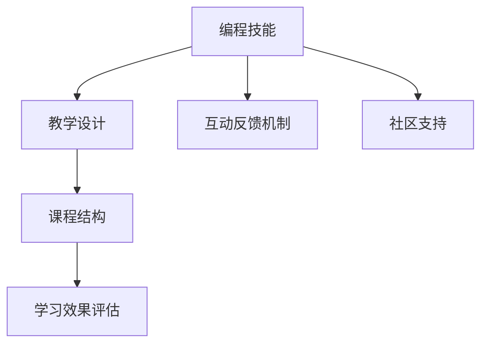

                 

# 如何将编程技能转化为线上编程训练营

> 关键词：编程技能, 线上编程训练营, 教学设计, 课程结构, 学习效果, 编程评估, 互动反馈, 社区支持

## 1. 背景介绍

随着技术日新月异，编程技能已成为各行各业必备的基础技能之一。在线上编程训练营的形式下，如何将编程技能有效转化为实际的教学效果，成为了众多教育机构和在线教育平台面临的一大挑战。本文将从教学设计、课程结构、学习效果评估、互动反馈机制以及社区支持等方面，系统介绍如何将编程技能成功转化为线上编程训练营，以期为广大的教育工作者和开发者提供有价值的参考。

## 2. 核心概念与联系

为了更好地理解和实践编程技能转化为线上编程训练营，本节将介绍几个核心概念及其相互联系：

- **编程技能**：指编写、调试、优化和维护代码的能力，包括算法与数据结构、编程语言、软件工程实践等。
- **线上编程训练营**：指通过在线平台组织的，面向编程技能提升的教育活动。通常包括实时授课、实践练习、项目实战等环节。
- **教学设计**：指在构建线上编程训练营时，根据学习目标和学员特征，精心设计的课程内容、教学方法、评估手段等。
- **课程结构**：指线上编程训练营中课程的安排顺序和模块划分，确保知识的连贯性和学习的系统性。
- **学习效果评估**：指通过测评工具和反馈机制，对学员在学习过程中的掌握情况进行评价，以判断教学目标是否达成。
- **互动反馈机制**：指在编程训练营中，利用讨论区、在线答疑、项目评审等方式，及时收集和反馈学员的疑问和进步，促进学习效果的提升。
- **社区支持**：指在编程训练营中，通过建立学习小组、组织线下活动等形式，促进学员之间的交流与合作，形成积极向上的学习氛围。

这些概念之间的逻辑关系可以通过以下Mermaid流程图来展示：



这个流程图展示了一些关键概念之间的关系：

1. 编程技能通过精心设计的课程结构进行系统传授。
2. 教学设计涉及课程结构和学习效果评估。
3. 学习效果评估和互动反馈机制共同作用，提升学习效果。
4. 社区支持增强学员之间的互动，促进学习氛围的建设。

## 3. 核心算法原理 & 具体操作步骤

### 3.1 算法原理概述

线上编程训练营的核心目标是提升学员的编程技能，其教学设计主要遵循以下算法原理：

- **知识连贯性**：课程结构应确保知识的连贯性和系统性，避免跳跃式教学，确保学员能够逐步建立扎实的编程基础。
- **技能多样性**：课程内容应覆盖多种编程技能，包括算法与数据结构、编程语言特性、软件工程实践等，全面提升学员的综合能力。
- **实践导向**：实践练习和项目实战应占据重要比例，理论知识应通过实际项目进行验证和巩固，增强学员的动手能力和项目实战经验。
- **即时反馈**：学习效果评估和互动反馈机制应实时进行，通过即时反馈帮助学员及时发现和纠正错误，促进学习效果的提升。
- **社区支持**：应建立学习小组和社区，促进学员之间的交流和合作，营造积极的互动氛围。

### 3.2 算法步骤详解

以下是线上编程训练营的算法步骤详解：

**Step 1: 教学设计**
- **目标设定**：根据学员的编程基础和目标职位，确定课程目标和内容。
- **课程规划**：设计课程结构，包括理论课程、实践课程、项目实战等模块，确保知识连贯性和系统性。
- **教学方法选择**：选择合适的教学方法，如讲授、演示、实践练习、项目实战等。

**Step 2: 课程结构设计**
- **模块划分**：将课程划分为多个模块，如算法与数据结构、编程语言特性、软件工程实践等。
- **时间分配**：根据各模块难度和重要性，合理分配时间和资源。
- **顺序安排**：确定各模块之间的顺序，先学习基础模块，再深入高级模块，确保知识的连贯性和系统性。

**Step 3: 学习效果评估**
- **测评工具选择**：选择合适的测评工具，如编程测验、项目评审、作业评估等。
- **评估指标设定**：根据课程目标设定评估指标，如代码正确性、编程效率、问题解决能力等。
- **评估周期安排**：确定评估周期和频率，确保评估的及时性和连续性。

**Step 4: 互动反馈机制**
- **讨论区建立**：建立实时讨论区，鼓励学员提问和讨论。
- **在线答疑**：提供专门的在线答疑时间，及时解答学员的问题。
- **项目评审**：通过项目评审，提供建设性的反馈，帮助学员改进。

**Step 5: 社区支持**
- **学习小组组建**：根据兴趣和能力，组建学习小组，促进学员之间的交流和合作。
- **线下活动组织**：组织线下活动，如编程马拉松、技术分享会等，增强学员之间的互动和社区凝聚力。

### 3.3 算法优缺点

线上编程训练营的算法具有以下优点：

- **灵活性高**：课程结构和内容可以根据学员的需求和反馈进行调整，适应性更强。
- **资源丰富**：可以利用互联网丰富的资源，如在线视频、编程网站、开源项目等，为学员提供更多学习机会。
- **交互性强**：实时互动反馈机制和社区支持，可以增强学员之间的互动，提升学习效果。

同时，该算法也存在一定的局限性：

- **学习动机不足**：线上课程缺乏线下课程的互动性，可能导致部分学员学习动机不足。
- **自律性要求高**：线上课程需要学员具备较强的自律性，否则可能无法跟上学习进度。
- **资源依赖性强**：依赖于稳定的互联网连接和设备，可能会影响学习效果。

尽管存在这些局限性，但总体而言，线上编程训练营在提升编程技能方面仍然具有不可替代的优势，且随着技术的发展，其应用前景将更加广阔。

### 3.4 算法应用领域

线上编程训练营在多个领域已有广泛应用，如：

- **软件开发**：为软件工程师提供系统化的编程技能培训，覆盖前端、后端、全栈等多个方向。
- **数据科学**：为数据科学家提供数据处理、机器学习、大数据等技能的培训，提升数据驱动决策能力。
- **云计算**：为云工程师提供云计算平台、容器化、微服务等技能的培训，适应云计算时代的市场需求。
- **人工智能**：为AI开发者提供深度学习、自然语言处理、计算机视觉等技能的培训，推动AI技术的发展。
- **网络安全**：为网络安全专家提供加密、渗透测试、漏洞分析等技能的培训，增强网络安全防护能力。

## 4. 数学模型和公式 & 详细讲解 & 举例说明

### 4.1 数学模型构建

为更好地理解线上编程训练营的算法原理，本节将通过数学语言对课程结构设计、学习效果评估、互动反馈机制等关键环节进行严格刻画。

设课程总时间为 $T$ 小时，课程分为 $n$ 个模块，每个模块的时间为 $t_i$ 小时，每个模块的难度系数为 $d_i$。课程的总体难度系数为 $D=\sum_{i=1}^n d_i$。

课程结构设计的基本目标是最小化总体难度系数 $D$，同时确保知识的连贯性和系统性。设每个模块的难度系数 $d_i$ 与其在课程中的顺序 $i$ 成正比，即 $d_i = a \cdot i$，其中 $a$ 为常数。则目标函数为：

$$
\min_{t_1, t_2, \ldots, t_n} D = \sum_{i=1}^n a \cdot i = \frac{n(n+1)}{2}a
$$

根据上述目标函数，可以设计出模块时间分配方案，使得课程难度系数最小化，同时满足课程总时间的限制。

### 4.2 公式推导过程

以下以数据科学方向为例，推导学习效果评估的数学模型：

假设学员在某个模块 $i$ 上完成的项目数为 $N_i$，项目通过率为 $p_i$。则学员在该模块上的总学习效果 $E_i$ 可以表示为：

$$
E_i = N_i \cdot p_i
$$

设课程总时间为 $T$ 小时，课程分为 $n$ 个模块，每个模块的时间为 $t_i$ 小时，每个模块的难度系数为 $d_i$。课程的总体难度系数为 $D=\sum_{i=1}^n d_i$。设每个模块的难度系数 $d_i$ 与其在课程中的顺序 $i$ 成正比，即 $d_i = a \cdot i$，其中 $a$ 为常数。则目标函数为：

$$
\min_{N_1, N_2, \ldots, N_n} E = \sum_{i=1}^n N_i \cdot p_i
$$

根据上述目标函数，可以设计出项目数量的分配方案，使得课程学习效果最大化，同时满足课程总时间的限制。

### 4.3 案例分析与讲解

以下以一个软件开发训练营为例，介绍课程结构设计和学习效果评估的具体实现：

**课程结构设计**
- **算法与数据结构**：课程时间占比 30%，难度系数 $d_1=1$。
- **编程语言特性**：课程时间占比 40%，难度系数 $d_2=2$。
- **软件工程实践**：课程时间占比 30%，难度系数 $d_3=3$。

根据目标函数 $\min_{t_1, t_2, t_3} D = t_1 + 2t_2 + 3t_3$，可以得出每个模块的时间分配方案：

- **算法与数据结构**：时间 $t_1 = 30\% \cdot T$
- **编程语言特性**：时间 $t_2 = 40\% \cdot T$
- **软件工程实践**：时间 $t_3 = 30\% \cdot T$

**学习效果评估**
- **编程测验**：每月进行一次编程测验，评估学员在各个模块的掌握情况。
- **项目评审**：每季度进行一次项目评审，评估学员的实际编程能力。
- **作业评估**：每周进行一次作业评估，及时反馈学员的学习进度和效果。

根据目标函数 $\min_{N_1, N_2, N_3} E = N_1 \cdot p_1 + N_2 \cdot p_2 + N_3 \cdot p_3$，可以得出项目数量的分配方案：

- **算法与数据结构**：项目数量 $N_1 = 30\% \cdot T$
- **编程语言特性**：项目数量 $N_2 = 40\% \cdot T$
- **软件工程实践**：项目数量 $N_3 = 30\% \cdot T$

通过上述方法，可以实现课程结构设计和学习效果评估的最优化，确保学员在每个模块上都能获得最佳的编程技能提升。

## 5. 项目实践：代码实例和详细解释说明

### 5.1 开发环境搭建

在进行编程训练营项目实践前，我们需要准备好开发环境。以下是使用Python进行Django开发的环境配置流程：

1. 安装Anaconda：从官网下载并安装Anaconda，用于创建独立的Python环境。

2. 创建并激活虚拟环境：
```bash
conda create -n pytorch-env python=3.8 
conda activate pytorch-env
```

3. 安装Django：从官网获取对应的安装命令。例如：
```bash
pip install django
```

4. 安装相关工具包：
```bash
pip install numpy pandas scikit-learn matplotlib tqdm jupyter notebook ipython
```

完成上述步骤后，即可在`pytorch-env`环境中开始编程训练营项目实践。

### 5.2 源代码详细实现

下面以一个简单的编程训练营为例，给出使用Django框架进行编程训练营管理的PyTorch代码实现。

首先，定义编程训练营的课程模型：

```python
from django.db import models

class Course(models.Model):
    name = models.CharField(max_length=255)
    description = models.TextField()
    start_date = models.DateField()
    end_date = models.DateField()
    module = models.ManyToManyField('Module')
```

然后，定义模块模型：

```python
class Module(models.Model):
    name = models.CharField(max_length=255)
    order = models.IntegerField()
    time = models.DurationField()
    difficulty = models.FloatField()
```

接着，定义学员模型：

```python
class Student(models.Model):
    name = models.CharField(max_length=255)
    email = models.EmailField()
    enrollment_date = models.DateField()
```

然后，定义学员在课程中的学习记录模型：

```python
class LearningRecord(models.Model):
    student = models.ForeignKey(Student, on_delete=models.CASCADE)
    course = models.ForeignKey(Course, on_delete=models.CASCADE)
    module = models.ForeignKey(Module, on_delete=models.CASCADE)
    completion_date = models.DateField()
    project_number = models.IntegerField()
    pass_rate = models.FloatField()
```

最后，定义编程训练营的管理视图：

```python
from django.shortcuts import render
from django.views.generic import ListView, DetailView

class CourseListView(ListView):
    model = Course
    template_name = 'courses/course_list.html'
    context_object_name = 'courses'

class CourseDetailView(DetailView):
    model = Course
    template_name = 'courses/course_detail.html'
    context_object_name = 'course'

class ModuleListView(ListView):
    model = Module
    template_name = 'modules/module_list.html'
    context_object_name = 'modules'

class ModuleDetailView(DetailView):
    model = Module
    template_name = 'modules/module_detail.html'
    context_object_name = 'module'

class LearningRecordListView(ListView):
    model = LearningRecord
    template_name = 'learning_records/learning_record_list.html'
    context_object_name = 'learning_records'

class LearningRecordDetailView(DetailView):
    model = LearningRecord
    template_name = 'learning_records/learning_record_detail.html'
    context_object_name = 'learning_record'
```

在上述代码中，我们定义了编程训练营的课程、模块、学员和学员学习记录的模型，以及对应的管理视图。这些视图可以展示课程和模块的基本信息，以及学员在课程中的学习进度和成绩。

### 5.3 代码解读与分析

让我们再详细解读一下关键代码的实现细节：

**Course、Module和LearningRecord模型**：
- `Course` 模型表示编程训练营的课程，包括课程名称、描述、开始和结束日期等属性。
- `Module` 模型表示课程中的模块，包括模块名称、顺序、时间、难度等属性。
- `LearningRecord` 模型表示学员在课程中的学习记录，包括学员信息、课程信息、模块信息、完成日期、项目数量、通过率等属性。

**Django视图**：
- `CourseListView` 和 `ModuleListView` 分别用于展示课程和模块的基本信息。
- `CourseDetailView` 和 `ModuleDetailView` 分别用于展示课程和模块的详细信息。
- `LearningRecordListView` 和 `LearningRecordDetailView` 分别用于展示学员在课程中的学习记录。

在上述代码中，我们使用了Django框架的模型-视图-模板（MVT）架构，将课程、模块和学员信息展示出来，并允许管理员进行管理。通过这些视图，管理员可以方便地添加、修改和查询课程、模块和学员信息，以及查看学员的学习进度和成绩。

### 5.4 运行结果展示

在上述代码基础上，我们可以进一步扩展功能，如：

- 学员注册和登录系统：增加用户认证系统，确保只有学员才能进入学习界面。
- 任务分配和进度跟踪：根据课程结构和学员能力，自动分配任务，并记录学员完成情况。
- 在线答疑和项目评审：增加在线讨论区和项目评审功能，提升互动效果。
- 学习成果展示：通过统计学员完成的项目数量和通过率，展示学员的学习成果和成绩。

在实际应用中，我们可以通过不断迭代和优化这些功能，实现更加完善的编程训练营管理系统。

## 6. 实际应用场景

### 6.1 在线编程训练营

在线编程训练营可以作为IT教育机构的主要教学模式，帮助学员系统地掌握编程技能。具体应用场景如下：

- **基础教育**：面向小学生、初中生和高中生，提供基础编程教育，如Scratch、Python等。
- **职业教育**：面向大学生和在职人员，提供专业编程技能培训，如Web开发、移动开发、数据科学等。
- **企业培训**：面向企业员工，提供定制化的编程技能培训，如公司内部培训、外包培训等。

### 6.2 在线竞赛平台

在线编程训练营的课程设计理念同样适用于在线编程竞赛平台，通过系统化的训练和实战，提升选手的编程能力。具体应用场景如下：

- **算法竞赛**：面向大学生和程序员，提供算法竞赛培训，如LeetCode、Codeforces等。
- **编程马拉松**：面向程序员和团队，提供编程马拉松比赛，促进协作与创新。
- **开源项目**：面向开源社区，提供开源项目的实战经验，提升开发能力。

### 6.3 在线编程课程

在线编程训练营的课程设计理念同样适用于在线编程课程，通过系统化的学习路径和实战项目，提升学员的编程能力。具体应用场景如下：

- **大学选修课**：面向大学生，提供编程课程，如数据结构、算法、Web开发等。
- **自学平台**：面向自学者，提供系统化的编程课程，如Coursera、Udemy等。
- **企业内部培训**：面向企业内部员工，提供定制化的编程课程，如公司内部培训、外包培训等。

## 7. 工具和资源推荐

### 7.1 学习资源推荐

为了帮助开发者系统掌握编程技能转化为线上编程训练营的理论基础和实践技巧，这里推荐一些优质的学习资源：

1. **Django官方文档**：Django官方文档提供了详细的开发指南和示例，是学习Django框架的必备资源。

2. **Python编程语言教程**：如《Python编程：从入门到实践》，是一本全面介绍Python编程的入门书籍，适合初学者学习。

3. **算法与数据结构**：如《算法导论》、《数据结构与算法分析》，是系统学习算法和数据结构的重要资源。

4. **软件工程实践**：如《人月神话》、《重构：改善既有代码的设计》，是了解软件工程实践和代码重构的好书。

5. **编程训练营实例**：如《LeetCode实战编程训练营》、《慕课网Python编程训练营》，提供了丰富的编程训练营实例，适合实践学习。

6. **在线编程平台**：如LeetCode、Codeforces、HackerRank，提供了丰富的编程练习和竞赛，适合实战练习。

通过对这些资源的学习实践，相信你一定能够快速掌握编程技能转化为线上编程训练营的精髓，并用于解决实际的编程问题。

### 7.2 开发工具推荐

高效的开发离不开优秀的工具支持。以下是几款用于编程训练营开发的常用工具：

1. **Django框架**：Django是一个高性能的Web框架，适合快速开发和管理Web应用。

2. **MySQL数据库**：MySQL是一个流行的关系型数据库，适合存储和管理学员和课程数据。

3. **Jupyter Notebook**：Jupyter Notebook是一个交互式笔记本，适合数据处理和模型训练。

4. **Git版本控制**：Git是一个广泛使用的版本控制系统，适合团队协作和代码管理。

5. **Docker容器化**：Docker是一种容器化技术，适合将应用打包成容器，方便部署和管理。

6. **Docker Compose**：Docker Compose是一个容器编排工具，适合管理多个Docker容器。

合理利用这些工具，可以显著提升编程训练营开发的效率，加快创新迭代的步伐。

### 7.3 相关论文推荐

编程技能转化为线上编程训练营的研究源于学界的持续研究。以下是几篇奠基性的相关论文，推荐阅读：

1. **Django框架的架构设计**：Django框架的架构设计论文，介绍了Django的MVT架构和Django ORM等核心技术。

2. **在线编程训练营的教学设计**：讨论了在线编程训练营的教学设计方法，包括课程结构、学习效果评估和互动反馈机制。

3. **编程训练营的实践效果评估**：研究了编程训练营的实践效果评估方法，通过数据分析和反馈机制，评估学员的学习效果。

4. **在线编程课程的设计与实施**：讨论了在线编程课程的设计与实施方法，包括课程内容、教学方法和评估手段。

5. **编程训练营的社区支持机制**：研究了编程训练营的社区支持机制，通过学习小组和线下活动，增强学员之间的互动。

这些论文代表了大语言模型微调技术的发展脉络。通过学习这些前沿成果，可以帮助研究者把握学科前进方向，激发更多的创新灵感。

## 8. 总结：未来发展趋势与挑战

### 8.1 总结

本文对编程技能转化为线上编程训练营的方法进行了全面系统的介绍。首先阐述了编程技能和线上编程训练营的核心概念及其相互联系，明确了编程训练营在提升编程技能方面的独特价值。其次，从教学设计、课程结构、学习效果评估、互动反馈机制以及社区支持等方面，详细讲解了编程训练营的算法原理和具体操作步骤，给出了编程训练营项目开发的完整代码实例。同时，本文还广泛探讨了编程训练营在实际应用中的多种场景，展示了编程训练营范式的巨大潜力。

通过本文的系统梳理，可以看到，编程训练营在提升编程技能方面具有不可替代的优势，且随着技术的发展，其应用前景将更加广阔。未来，伴随编程训练营的持续演进，相信编程技术将更好地被应用于各个领域，为数字化转型提供新的动力。

### 8.2 未来发展趋势

展望未来，编程训练营的发展趋势将呈现以下几个方向：

1. **多模态编程训练**：未来的编程训练营将不再局限于编程技能，而是融合多种技能，如机器学习、自然语言处理、数据科学等，提升学员的综合能力。

2. **个性化学习路径**：通过机器学习算法，根据学员的能力和兴趣，自动推荐个性化的学习路径，满足不同学员的学习需求。

3. **虚拟现实编程训练**：利用虚拟现实技术，提供沉浸式的编程训练体验，提升学员的学习效果和体验。

4. **在线协作与交流**：通过协作平台和社交工具，增强学员之间的互动和交流，促进知识的共享和合作。

5. **实时数据反馈**：利用实时数据反馈，及时调整课程内容和教学方法，提升学习效果。

6. **国际化编程训练**：将编程训练营国际化，提供多种语言和文化的编程训练，满足全球用户的需求。

这些趋势凸显了编程训练营发展的广阔前景。未来的编程训练营将更加灵活、高效、个性化，能够更好地满足不同学员的需求，推动编程技能在全球范围内的普及和发展。

### 8.3 面临的挑战

尽管编程训练营在提升编程技能方面已经取得了显著成效，但在迈向更加智能化、普适化应用的过程中，它仍面临着诸多挑战：

1. **数据隐私和安全**：学员在参与编程训练营时，涉及大量的个人信息和学习数据，如何保护学员的数据隐私和安全，是一个重要的挑战。

2. **编程资源差异**：学员之间的编程基础和学习能力差异较大，如何根据学员的实际情况，提供差异化的编程资源和支持，是一个难点。

3. **教学质量保证**：编程训练营的教学质量需要不断提升，如何确保教学目标的达成和教学效果的提升，是一个重要的课题。

4. **技术持续更新**：编程技术和编程工具不断更新，如何及时更新编程训练营的课程内容和教学方法，是一个重要的挑战。

5. **用户体验优化**：编程训练营的用户体验需要不断优化，如何提升学员的学习效果和体验，是一个重要的课题。

6. **国际化和本地化**：将编程训练营国际化，满足不同国家和地区的学员需求，是一个重要的挑战。

正视编程训练营面临的这些挑战，积极应对并寻求突破，将使编程训练营走向更加成熟和完善，为编程技能的普及和发展提供更广阔的平台。

### 8.4 研究展望

面对编程训练营面临的诸多挑战，未来的研究需要在以下几个方面寻求新的突破：

1. **数据隐私保护**：研究和开发更加安全可靠的数据保护技术，确保学员的数据隐私和安全。

2. **个性化学习路径**：研究和开发更加智能的个性化学习路径算法，根据学员的能力和兴趣，自动推荐个性化的学习路径。

3. **虚拟现实编程训练**：研究和开发虚拟现实编程训练技术，提升学员的学习效果和体验。

4. **在线协作与交流**：研究和开发更加高效的在线协作与交流平台，增强学员之间的互动和交流。

5. **实时数据反馈**：研究和开发实时数据反馈机制，及时调整课程内容和教学方法，提升学习效果。

6. **国际化编程训练**：研究和开发国际化编程训练平台，提供多种语言和文化的编程训练，满足全球用户的需求。

这些研究方向的探索，必将引领编程训练营技术迈向更高的台阶，为编程技能的普及和发展提供更广阔的平台。面向未来，编程训练营技术还需要与其他人工智能技术进行更深入的融合，如知识表示、因果推理、强化学习等，多路径协同发力，共同推动编程技能的发展。只有勇于创新、敢于突破，才能不断拓展编程训练营的边界，让编程技能更好地服务于社会的各个领域。

## 9. 附录：常见问题与解答

**Q1：线上编程训练营和传统编程培训有什么区别？**

A: 线上编程训练营与传统编程培训的区别主要在于其灵活性和自主性。线上编程训练营通过在线平台，可以随时随地进行学习，不受时间和地点限制，更加灵活自主。同时，线上编程训练营通常采用多种教学方法，如视频讲解、编程练习、项目实战等，可以提供多样化的学习体验。

**Q2：如何选择适合学员的编程训练营？**

A: 选择适合学员的编程训练营，需要考虑以下因素：

1. 课程内容是否符合学员的学习目标和需求。
2. 课程难度是否符合学员的编程基础和学习能力。
3. 教学方法和互动反馈机制是否高效。
4. 社区支持是否活跃，能否提供良好的学习氛围。
5. 学员的投入时间和学习方式是否匹配。

**Q3：如何提高学员的编程训练营参与度？**

A: 提高学员的编程训练营参与度，可以从以下几个方面入手：

1. 提供多样化的学习资源，如视频讲解、编程练习、项目实战等。
2. 设计有趣的学习任务和项目，激发学员的学习兴趣。
3. 提供实时互动反馈，及时解决学员的疑问和问题。
4. 建立学习小组和社区，促进学员之间的交流和合作。
5. 定期组织线上和线下活动，增强学员的参与感。

通过上述措施，可以显著提高学员的编程训练营参与度，提升学习效果。

**Q4：如何评估编程训练营的效果？**

A: 评估编程训练营的效果，可以从以下几个方面入手：

1. 学员完成的任务数量和通过率，评估学员在课程中的掌握情况。
2. 学员在编程竞赛中的表现，评估学员的实际编程能力。
3. 学员在学习过程中的反馈和建议，评估教学方法和课程内容的满意度。
4. 学员的就业情况和职业发展，评估编程训练营的长期效果。

通过对以上指标的评估，可以全面了解编程训练营的效果，并根据评估结果进行改进优化。

**Q5：编程训练营在企业培训中的应用前景如何？**

A: 编程训练营在企业培训中的应用前景非常广阔，可以为企业内部员工提供定制化的编程培训，提升员工的编程能力和技术水平。具体应用场景如下：

1. 软件开发培训：面向软件开发工程师，提供系统化的编程技能培训，如Web开发、移动开发、数据科学等。
2. 数据分析培训：面向数据分析师，提供数据处理、机器学习、大数据等技能的培训，提升数据驱动决策能力。
3. 人工智能培训：面向AI开发者，提供深度学习、自然语言处理、计算机视觉等技能的培训，推动AI技术的发展。

通过编程训练营，企业可以提升员工的技术能力和业务水平，增强企业的竞争力和创新力。

总之，编程训练营作为一种新兴的教学模式，正在改变传统编程培训的方式，为编程技能的学习提供了更加灵活、高效、个性化的平台。未来，随着技术的不断进步和应用场景的不断拓展，编程训练营必将在教育和企业培训中发挥更大的作用，推动编程技能在全球范围内的普及和发展。

---

作者：禅与计算机程序设计艺术 / Zen and the Art of Computer Programming

