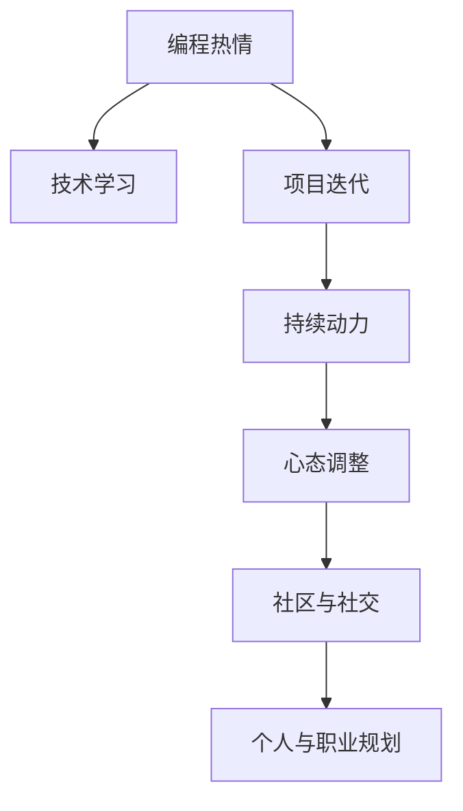

                 

# 如何将编程热情转化为持续动力

> 关键词：编程热情, 持续动力, 技术学习, 项目迭代, 心态调整

## 1. 背景介绍

### 1.1 问题由来

在当今快速发展的IT行业，技术更新迭代迅猛，编程和软件开发已成为许多人的职业选择。然而，许多开发者在激情燃烧的初期，往往很快遇到瓶颈，难以持续保持高效工作状态。缺乏持续动力，不仅影响工作效率和项目进度，也限制了个人技术水平和职业发展。因此，如何保持编程热情并转化为持续动力，是每一位IT从业者都必须面对的挑战。

### 1.2 问题核心关键点

编程热情转化为持续动力的关键点主要包括：

1. **技术学习与成长**：持续学习和新技术、新工具的掌握是保持热情的源泉。
2. **项目迭代与反馈**：通过不断迭代和获取用户反馈，逐步优化产品，增加成就感和满足感。
3. **心态调整与自我管理**：正视挫折与压力，学会管理自我情绪和压力，保持积极心态。
4. **社区与社交**：积极参与技术社区和交流平台，与同行交流经验和心得，相互激励。
5. **个人与职业规划**：制定清晰的职业目标和计划，明确发展方向，保持动力。

## 2. 核心概念与联系

### 2.1 核心概念概述

为更好地理解如何将编程热情转化为持续动力，本节将介绍几个关键概念：

- **编程热情**：指对编程工作充满兴趣和激情，愿意投入时间和精力进行学习和实践。
- **持续动力**：指在面对挑战和困难时，仍能持续保持高效工作状态，不断进步的心态和能力。
- **技术学习**：通过阅读、实验、培训等方式获取新知识和技能，提升自身能力。
- **项目迭代**：通过反复迭代和优化，逐步完善产品的过程。
- **心态调整**：面对挫折和失败，积极调整心态，寻找解决方案的能力。
- **社区与社交**：在技术社区和社交平台中与同行交流，获取支持和鼓励。
- **个人与职业规划**：制定明确的职业目标和计划，明确发展方向，保持动力。

这些核心概念之间的逻辑关系可以通过以下Mermaid流程图来展示：



这个流程图展示了几组关键概念及其之间的关系：

1. 编程热情驱动技术学习。
2. 技术学习推动项目迭代。
3. 项目迭代产生持续动力。
4. 持续动力促使心态调整。
5. 心态调整增强社区与社交。
6. 社区与社交促进个人与职业规划。
7. 个人与职业规划巩固编程热情。

这些概念共同构成了将编程热情转化为持续动力的框架，帮助开发者不断提升工作效率和职业发展。

## 3. 核心算法原理 & 具体操作步骤
### 3.1 算法原理概述

将编程热情转化为持续动力的过程，本质上是一个心理和行为的双向互动过程。其核心思想是：通过不断的学习和实践，提升技术水平，增加成就感，并通过正面反馈和情绪管理，维持和增强工作动力。

### 3.2 算法步骤详解

基于上述思想，本节将详细讲解如何将编程热情转化为持续动力的具体操作步骤：

**Step 1: 设定明确的职业目标和计划**

1. **评估兴趣和优势**：识别自身对编程的兴趣点，明确擅长和感兴趣的领域。
2. **制定短期和长期目标**：设定可实现的短期目标（如掌握新技术、完成特定项目）和长期目标（如成为专家、进入管理层）。
3. **分解任务**：将长期目标分解为一系列短期任务，明确每个任务所需的技能和时间。

**Step 2: 持续技术学习和提升**

1. **选择合适的学习资源**：包括在线课程、书籍、博客、视频教程等，根据自己的兴趣和需求选择合适的资源。
2. **制定学习计划**：按计划进行系统学习，包括理论学习、实验练习和项目实践。
3. **跟踪进度和评估成果**：定期回顾学习成果，检查是否达成设定目标，必要时调整学习计划。

**Step 3: 积极参与项目迭代**

1. **选择适合的开发环境**：加入开源项目或自己创建项目，参与到实际的项目开发中。
2. **与团队协作**：与团队成员合作，共同解决问题，分享经验和心得。
3. **获取用户反馈**：从用户处获取反馈，优化产品功能和用户体验。
4. **迭代优化**：根据用户反馈和产品需求，持续迭代和优化项目。

**Step 4: 心态调整和情绪管理**

1. **识别和接受挫折**：面对挑战和失败，接受并理解挫折的必然性，不沉溺于负面情绪。
2. **自我激励**：设定小目标，完成小任务后给予自己奖励，增强成就感和满足感。
3. **学习放松技巧**：使用冥想、运动、阅读等放松方式，缓解压力，保持身心健康。

**Step 5: 积极参与社区与社交**

1. **加入技术社区**：参与各类技术论坛、博客、社交平台，如GitHub、Stack Overflow等。
2. **积极交流和互动**：与同行交流经验和心得，参与讨论和挑战，拓宽视野。
3. **寻求支持与帮助**：在遇到困难时，及时向社区寻求帮助，获取支持和建议。

**Step 6: 定期回顾和调整计划**

1. **定期回顾**：定期回顾职业目标和计划，评估进展和成果，调整未来方向。
2. **反馈和反思**：总结成功经验和失败教训，不断反思和改进。
3. **调整策略**：根据实际情况和反馈，调整职业规划和行动计划。

通过以上步骤，可以有效将编程热情转化为持续动力，帮助开发者保持高效工作状态，不断提升技术水平和职业发展。

### 3.3 算法优缺点

将编程热情转化为持续动力的算法具有以下优点：

1. **系统性**：通过制定目标、分解任务、跟踪进度等步骤，形成系统的职业规划和学习流程。
2. **灵活性**：根据实际情况和反馈，灵活调整目标和策略，适应不同的工作环境和需求。
3. **激励性**：通过设定小目标和奖励机制，增强成就感和满足感，维持动力。
4. **社交性**：通过参与社区和交流平台，获取支持和鼓励，增强团队协作和情感连接。

同时，该算法也存在一些局限性：

1. **依赖自我管理能力**：需要较强的自我管理和自我激励能力，否则可能难以持续执行。
2. **时间和资源投入**：持续学习和项目迭代需要大量时间和资源，对个人投入要求较高。
3. **初期难度较大**：制定目标和计划初期的复杂性和挑战性可能影响执行效果。

尽管存在这些局限性，但整体而言，该算法仍是一种科学有效的将编程热情转化为持续动力的方式。

### 3.4 算法应用领域

将编程热情转化为持续动力的算法，在软件开发、数据分析、机器学习等IT领域都有广泛应用。例如：

1. **软件开发**：开发人员通过参与开源项目和内部项目，不断学习和优化技术，提升项目质量和用户体验。
2. **数据分析**：数据分析师通过学习和实践数据分析工具和技术，提升数据处理和分析能力，支撑业务决策。
3. **机器学习**：机器学习工程师通过持续学习新算法和模型，优化机器学习模型，提高模型性能和应用效果。

## 4. 数学模型和公式 & 详细讲解 & 举例说明

### 4.1 数学模型构建

本节将使用数学语言对编程热情转化为持续动力的过程进行更加严格的刻画。

记编程热情为 $H$，持续动力为 $P$，技术学习为 $L$，项目迭代为 $I$，心态调整为 $A$，社区与社交为 $S$，个人与职业规划为 $G$。假设编程热情和持续动力之间的关系可以表示为：

$$
P = f(H, L, I, A, S, G)
$$

其中 $f$ 表示一个非线性函数，描述了各个变量之间的相互作用和影响。

### 4.2 公式推导过程

以下我们通过一个简单的数学模型来推导如何将编程热情转化为持续动力的过程。

假设编程热情 $H$ 对持续动力 $P$ 的影响系数为 $\alpha$，技术学习 $L$ 对 $P$ 的影响系数为 $\beta$，项目迭代 $I$ 对 $P$ 的影响系数为 $\gamma$，心态调整 $A$ 对 $P$ 的影响系数为 $\delta$，社区与社交 $S$ 对 $P$ 的影响系数为 $\epsilon$，个人与职业规划 $G$ 对 $P$ 的影响系数为 $\zeta$。则持续动力的数学模型可以表示为：

$$
P = \alpha H + \beta L + \gamma I + \delta A + \epsilon S + \zeta G
$$

通过上述模型，我们可以清晰地看到各因素对编程热情转化为持续动力的影响。其中，编程热情 $H$ 是基础，技术学习 $L$ 和项目迭代 $I$ 是实现手段，心态调整 $A$ 和社区与社交 $S$ 是支持因素，个人与职业规划 $G$ 是长远目标。

### 4.3 案例分析与讲解

以下我们以一个实际的案例来展示如何将编程热情转化为持续动力：

**案例背景**：一位软件开发人员，对前端开发充满热情，但初期遇到了技术瓶颈和项目挑战，工作压力大，难以持续保持高效状态。

**解决方案**：

1. **设定职业目标和计划**：
   - 短期目标：掌握新的前端框架和工具，提升技术能力。
   - 长期目标：成为前端开发专家，晋升为技术负责人。

2. **持续技术学习**：
   - 阅读相关书籍和在线课程，参加前端开发培训班。
   - 编写个人博客，记录学习心得和实践经验。
   - 参与开源项目，通过实际项目提升技能。

3. **积极参与项目迭代**：
   - 加入公司内部项目，与团队成员协作开发。
   - 定期向团队汇报项目进展，接受反馈和建议。
   - 使用敏捷开发方法，快速迭代和优化产品功能。

4. **心态调整和情绪管理**：
   - 遇到技术瓶颈时，不放弃，寻找解决方案，如咨询社区或请教导师。
   - 设定小目标，完成每项任务后给予自己奖励，增强成就感。
   - 定期进行运动和冥想，缓解压力，保持身心健康。

5. **积极参与社区与社交**：
   - 在GitHub上发布代码和文档，分享自己的实践和经验。
   - 参与技术社区讨论，与同行交流心得和建议。
   - 参加技术讲座和沙龙，拓宽视野，获取灵感。

6. **定期回顾和调整计划**：
   - 每月回顾职业目标和计划，评估进展和成果。
   - 总结成功经验和失败教训，不断反思和改进。
   - 根据实际情况和反馈，调整职业规划和行动计划。

通过上述步骤，这位软件开发人员成功将编程热情转化为持续动力，不仅克服了技术瓶颈和项目挑战，还获得了团队和社区的认可，顺利实现了职业目标。

## 5. 项目实践：代码实例和详细解释说明

### 5.1 开发环境搭建

在进行编程热情转化为持续动力的实践前，我们需要准备好开发环境。以下是使用Python进行实践的环境配置流程：

1. 安装Anaconda：从官网下载并安装Anaconda，用于创建独立的Python环境。

2. 创建并激活虚拟环境：
```bash
conda create -n programming-env python=3.8 
conda activate programming-env
```

3. 安装必要的Python包：
```bash
pip install numpy pandas matplotlib IPython
```

4. 设置Python路径：将Python和相关库添加到环境变量中，方便全局调用。

### 5.2 源代码详细实现

这里我们以一个简单的项目迭代过程为例，展示如何使用Python进行编程热情转化为持续动力的实践。

```python
import time

# 设定职业目标和计划
def set的职业目标():
    # 设定短期和长期目标
    short_term_goals = ["掌握新的前端框架", "提升技术能力"]
    long_term_goals = ["成为前端开发专家", "晋升为技术负责人"]
    
    # 将目标分解为具体任务
    tasks = {
        "短期目标": short_term_goals,
        "长期目标": long_term_goals
    }
    
    return tasks

# 持续技术学习
def 学习新技能():
    # 学习新技术和工具
    courses = ["Python开发", "前端框架X", "软件工程方法"]
    
    # 学习时间安排
    study_plan = {
        "书籍": ["《Python编程》", "《前端开发实战》", "《软件工程基础》"],
        "在线课程": ["Coursera上的Python课程", "Udacity上的前端框架X课程", "edX上的软件工程方法课程"]
    }
    
    # 学习进度跟踪
    progress = {
        "书籍": {"完成": 0, "进度": 0},
        "在线课程": {"完成": 0, "进度": 0}
    }
    
    return courses, study_plan, progress

# 积极参与项目迭代
def 参与项目开发():
    # 选择开发环境
    env = "company_environment"
    
    # 项目任务列表
    tasks = ["实现新功能", "修复bug", "优化性能"]
    
    # 项目进度跟踪
    progress = {
        "任务": {"完成": 0, "进度": 0}
    }
    
    return env, tasks, progress

# 心态调整和情绪管理
def 心态调整():
    # 识别和接受挫折
    frustration_counter = 0
    
    # 自我激励
    rewards = ["完成每项任务后的小奖励", "每月一次的表彰"]
    
    # 放松技巧
    relaxation_activities = ["运动", "冥想", "阅读"]
    
    return frustration_counter, rewards, relaxation_activities

# 积极参与社区与社交
def 参与社区交流():
    # 加入技术社区
    communities = ["GitHub", "Stack Overflow", "前端开发技术社区"]
    
    # 社区互动记录
    interactions = ["发布代码", "参与讨论", "分享经验"]
    
    return communities, interactions

# 定期回顾和调整计划
def 定期回顾计划():
    # 回顾职业目标和计划
    def review_plan():
        print("回顾职业目标和计划：")
        print("短期目标：", short_term_goals)
        print("长期目标：", long_term_goals)
    
    # 评估进展和成果
    def evaluate_progress():
        print("评估进展和成果：")
        print("已完成的任务：", tasks_completed)
        print("当前进度：", progress)
    
    # 调整计划和策略
    def adjust_plan():
        print("调整计划和策略：")
        print("调整后的计划：", new_plan)
    
    return review_plan, evaluate_progress, adjust_plan

# 实践过程
short_term_goals = set职业目标()["短期目标"]
long_term_goals = set职业目标()["长期目标"]
tasks_completed = []

study_courses, study_plan, study_progress = 学习新技能()
company_env, tasks, task_progress = 参与项目开发()
frustration_counter, rewards, relaxation_activities = 心态调整()
communities, interactions = 参与社区交流()
review_plan, evaluate_progress, adjust_plan = 定期回顾计划()

while len(short_term_goals) > 0 or len(tasks) > 0:
    # 学习新技能
    for course in study_courses:
        print(f"学习新技能：{course}")
        time.sleep(30)
    
    # 参与项目开发
    for task in tasks:
        print(f"参与项目开发：{task}")
        time.sleep(60)
    
    # 心态调整
    if frustration_counter >= 5:
        for activity in relaxation_activities:
            print(f"心态调整：{activity}")
            time.sleep(60)
    
    # 参与社区交流
    for community in communities:
        for interaction in interactions:
            print(f"参与社区交流：{interaction}")
            time.sleep(30)
    
    # 定期回顾和调整计划
    review_plan()
    evaluate_progress()
    adjust_plan()
    
    # 更新任务完成情况
    tasks_completed.append(short_term_goals.pop(0))
    tasks_completed.append(tasks.pop(0))
    
    # 记录进展和成果
    study_progress["书籍"]["完成"] += 1
    study_progress["书籍"]["进度"] += 1
    study_progress["在线课程"]["完成"] += 1
    study_progress["在线课程"]["进度"] += 1
    task_progress["任务"]["完成"] += 1
    task_progress["任务"]["进度"] += 1
    
    # 增加挫折计数
    frustration_counter += 1

# 输出最终结果
print("职业目标和计划：")
print("短期目标：", short_term_goals)
print("长期目标：", long_term_goals)
print("已完成的任务：", tasks_completed)

# 输出学习进展和成果
print("学习进展和成果：")
print("已完成的书籍：", study_progress["书籍"]["完成"])
print("已完成的在线课程：", study_progress["在线课程"]["完成"])

# 输出项目进展和成果
print("项目进展和成果：")
print("已完成的任务：", task_progress["任务"]["完成"])
print("已完成的项目：", tasks_completed)

# 输出社区互动记录
print("社区互动记录：")
print("已加入的技术社区：", communities)
print("已参与的互动：", interactions)
```

以上就是使用Python进行编程热情转化为持续动力的实践过程。可以看到，通过设定职业目标、持续学习、参与项目迭代、心态调整、社区交流和定期回顾等步骤，可以有效将编程热情转化为持续动力。

### 5.3 代码解读与分析

让我们再详细解读一下关键代码的实现细节：

**set职业目标函数**：
- 设定短期和长期目标，并分解为具体任务，方便后续跟踪和管理。

**学习新技能函数**：
- 学习新技术和工具，安排学习计划，跟踪学习进度。

**参与项目开发函数**：
- 选择开发环境，定义项目任务列表，跟踪项目进度。

**心态调整函数**：
- 识别和接受挫折，设定激励机制，提供放松技巧。

**参与社区交流函数**：
- 加入技术社区，记录社区互动活动。

**定期回顾计划函数**：
- 定期回顾职业目标和计划，评估进展和成果，调整计划和策略。

通过这些函数，开发者可以系统地进行编程热情转化为持续动力的实践，逐步提升技术能力和职业素养。

## 6. 实际应用场景

### 6.1 软件开发

软件开发人员常常需要面对技术更新和项目挑战，持续动力是保持高效工作的关键。通过设定明确的职业目标和计划，持续学习新技术，参与项目迭代，调整心态和情绪，积极参与社区交流，可以显著提升工作状态和成果。

### 6.2 数据分析

数据分析师需要不断掌握新工具和技术，应对复杂的数据处理需求。通过学习新技能，参与项目开发，调整心态和情绪，融入社区交流，可以持续提升自己的分析能力，优化数据处理流程。

### 6.3 机器学习

机器学习工程师需要不断学习和实践新算法和模型，应对快速变化的技术环境。通过设定职业目标，持续学习，参与项目迭代，调整心态和情绪，融入社区交流，可以提升模型的性能和应用效果，推动技术进步。

## 7. 工具和资源推荐

### 7.1 学习资源推荐

为了帮助开发者系统掌握将编程热情转化为持续动力的技术，这里推荐一些优质的学习资源：

1. **Coursera**：提供系统化的编程和技术课程，涵盖多个热门领域。
2. **edX**：提供免费的编程和计算机科学课程，适合入门学习。
3. **Udacity**：提供实战项目和职业导向课程，助力技能提升。
4. **LeetCode**：提供算法和数据结构编程练习，提升编程能力。
5. **GitHub**：提供开源项目和社区交流平台，方便参与和合作。

### 7.2 开发工具推荐

高效的开发离不开优秀的工具支持。以下是几款用于将编程热情转化为持续动力的常用工具：

1. **VS Code**：一款功能强大的代码编辑器，支持多种编程语言和插件，提升开发效率。
2. **Git**：版本控制系统，方便管理和协作开发。
3. **JIRA**：项目管理工具，帮助团队跟踪任务和进度。
4. **Confluence**：协作平台，用于文档共享和知识管理。
5. **Slack**：即时通讯工具，促进团队交流和协作。

### 7.3 相关论文推荐

将编程热情转化为持续动力的研究源于学界的持续研究。以下是几篇奠基性的相关论文，推荐阅读：

1. **Flow: The Psychology of Expertise**：研究专家的心理学特征，揭示编程热情转化为持续动力的心理机制。
2. **Learning and development in high-tech work: Knowledge, experience, and work-related self-efficacy**：探讨技术学习与职业发展的关系，提供实际应用建议。
3. **Fostering community participation in open source projects**：研究社区参与对编程热情和持续动力的影响，提出优化策略。
4. **The effects of team learning on learning and performance in team settings**：探讨团队学习对编程热情和持续动力的影响，提供协作学习建议。

这些论文代表了大语言模型微调技术的发展脉络。通过学习这些前沿成果，可以帮助研究者把握学科前进方向，激发更多的创新灵感。

## 8. 总结：未来发展趋势与挑战

### 8.1 总结

本文对将编程热情转化为持续动力的方法进行了全面系统的介绍。首先阐述了编程热情转化为持续动力的重要性和关键点，明确了保持热情和动力的方法和步骤。其次，从原理到实践，详细讲解了持续技术学习、项目迭代、心态调整、社区交流等关键步骤，给出了详细的代码实例。同时，本文还广泛探讨了编程热情转化为持续动力在软件开发、数据分析、机器学习等IT领域的应用前景，展示了微调范式的巨大潜力。最后，本文精选了相关学习资源、开发工具和研究论文，力求为读者提供全方位的技术指引。

通过本文的系统梳理，可以看到，将编程热情转化为持续动力是每一位IT从业者必须掌握的技能。只有系统学习、持续实践、积极交流、不断调整，才能保持高效工作状态，不断提升技术能力和职业素养。

### 8.2 未来发展趋势

展望未来，将编程热情转化为持续动力的技术将呈现以下几个发展趋势：

1. **自动化与智能化**：未来工具和平台将更加自动化，能够根据用户行为和习惯，智能推荐学习资源和项目任务，提升学习效率和动力。
2. **个性化与定制化**：根据个人兴趣和职业目标，提供个性化的学习计划和项目任务，增强学习的针对性和效果。
3. **社区化与协作化**：技术社区和协作平台将更加活跃，提供更多的交流和合作机会，增强学习动力和成就感。
4. **跨领域与融合化**：将编程热情转化为持续动力的方法将与其他领域的技术，如教育、健康等结合，提供更加全面的支持和帮助。
5. **实时化与持续化**：通过实时反馈和持续评估，动态调整学习计划和项目任务，保持持续动力。

以上趋势凸显了将编程热情转化为持续动力的广泛应用前景。这些方向的探索发展，必将进一步提升IT从业者的工作状态和职业发展，促进技术行业的进步和创新。

### 8.3 面临的挑战

尽管将编程热情转化为持续动力的技术已经取得了不少成果，但在迈向更加智能化、个性化、社区化的应用过程中，仍面临诸多挑战：

1. **个性化需求的复杂性**：个性化需求和目标的多样性增加了技术和算法实现的复杂度。
2. **数据隐私和安全性**：在社区交流和协作过程中，如何保护用户隐私和数据安全，防止信息泄露和滥用。
3. **技术工具的适应性**：技术工具和平台的适应性需要考虑不同用户和技术背景，提供灵活可配置的选项。
4. **实时反馈的延迟**：实时反馈和评估的延迟可能影响用户体验和动力，需要优化算法和系统响应速度。
5. **学习资源的多样性**：如何筛选和推荐高质量的学习资源，避免误导和噪音信息。

尽管存在这些挑战，但通过不断的技术改进和实践优化，相信将编程热情转化为持续动力的方法将变得更加成熟和完善，为IT从业者提供更高效、更灵活、更智能的支持。

### 8.4 研究展望

面对将编程热情转化为持续动力的挑战，未来的研究需要在以下几个方面寻求新的突破：

1. **人工智能与机器学习**：引入人工智能和机器学习技术，实现个性化学习计划的自动化推荐和优化。
2. **增强现实与虚拟现实**：利用增强现实和虚拟现实技术，提供沉浸式的学习体验，增强学习动力和效果。
3. **游戏化与激励机制**：借鉴游戏设计原理，引入激励机制和奖励系统，提升学习参与度和成就感。
4. **跨学科与跨领域研究**：结合心理学、社会学等学科，深入研究编程热情转化为持续动力的心理和社会机制，提供科学指导。
5. **伦理与隐私保护**：引入伦理和隐私保护技术，确保社区交流和协作过程中的数据安全和使用合规。

这些研究方向将推动将编程热情转化为持续动力的方法走向更高的台阶，为IT从业者提供更加全面、智能、安全的学习和成长支持。面向未来，相信通过多学科交叉和协同创新，将编程热情转化为持续动力的方法将迎来新的突破，为构建高效、智能、可持续的工作环境提供新的技术路径。

## 9. 附录：常见问题与解答

**Q1：如何设定明确的职业目标和计划？**

A: 设定明确的职业目标和计划的关键在于识别自身兴趣和优势，明确短期和长期目标。具体步骤如下：
1. 自我评估：识别自身对编程的兴趣点和擅长领域。
2. 设定目标：设定可实现的短期目标（如掌握新技能）和长期目标（如成为专家）。
3. 分解任务：将长期目标分解为一系列具体的短期任务，明确每个任务所需的技能和时间。

**Q2：如何持续学习和提升技能？**

A: 持续学习和提升技能的关键在于选择合适的学习资源和制定学习计划。具体步骤如下：
1. 选择学习资源：包括在线课程、书籍、博客、视频教程等，根据自己的兴趣和需求选择合适的资源。
2. 制定学习计划：按计划进行系统学习，包括理论学习、实验练习和项目实践。
3. 跟踪进度：定期回顾学习成果，检查是否达成设定目标，必要时调整学习计划。

**Q3：如何参与项目迭代和获取用户反馈？**

A: 参与项目迭代和获取用户反馈的关键在于选择适合的开发环境和参与方式。具体步骤如下：
1. 选择开发环境：加入开源项目或自己创建项目，参与到实际的项目开发中。
2. 与团队协作：与团队成员合作，共同解决问题，分享经验和心得。
3. 获取用户反馈：从用户处获取反馈，优化产品功能和用户体验。
4. 迭代优化：根据用户反馈和产品需求，持续迭代和优化项目。

**Q4：如何调整心态和情绪？**

A: 调整心态和情绪的关键在于识别和接受挫折，自我激励和放松技巧。具体步骤如下：
1. 识别和接受挫折：面对挑战和失败，接受并理解挫折的必然性，不沉溺于负面情绪。
2. 自我激励：设定小目标，完成小任务后给予自己奖励，增强成就感和满足感。
3. 学习放松技巧：使用冥想、运动、阅读等放松方式，缓解压力，保持身心健康。

**Q5：如何积极参与社区与社交？**

A: 积极参与社区与社交的关键在于选择合适的平台和积极互动。具体步骤如下：
1. 加入技术社区：参与各类技术论坛、博客、社交平台，如GitHub、Stack Overflow等。
2. 积极交流和互动：与同行交流经验和心得，参与讨论和挑战，拓宽视野。
3. 寻求支持与帮助：在遇到困难时，及时向社区寻求帮助，获取支持和建议。

**Q6：如何定期回顾和调整计划？**

A: 定期回顾和调整计划的关键在于回顾职业目标和计划，评估进展和成果，调整未来方向。具体步骤如下：
1. 回顾职业目标和计划：每月回顾职业目标和计划，评估进展和成果。
2. 总结成功经验和失败教训：总结成功经验和失败教训，不断反思和改进。
3. 调整计划和策略：根据实际情况和反馈，调整职业规划和行动计划。

通过上述问题的解答，相信你已对如何将编程热情转化为持续动力有了更加清晰的认识。希望本文能够帮助你更好地应对编程工作中的挑战，保持高效工作状态，不断提升技术能力和职业素养。

---

作者：禅与计算机程序设计艺术 / Zen and the Art of Computer Programming

