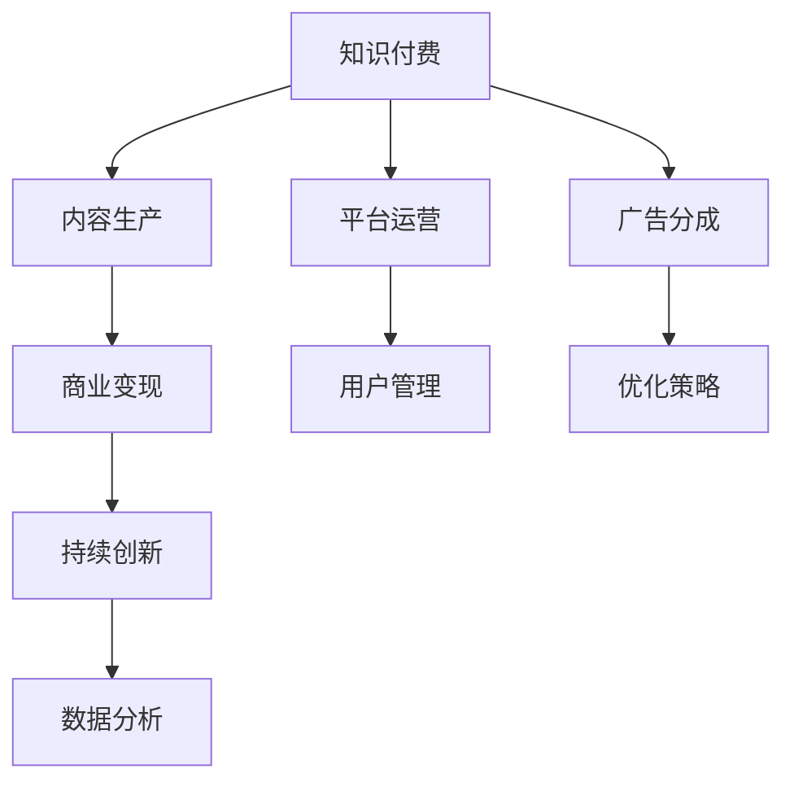

                 

# 如何打造个人知识付费商业帝国

## 1. 背景介绍

在数字化时代，知识和信息的重要性日益凸显，而如何有效获取和利用这些信息，成为个人和企业的核心竞争力所在。知识付费的兴起，正是顺应了这一趋势，通过付费模式为高质量的内容提供者提供激励，同时为用户带来更为专业、权威的知识获取渠道。个人知识付费商业帝国的打造，不仅是商业模式的创新，更是对知识传播和消费方式的一次深刻变革。

### 1.1 问题由来

近年来，随着移动互联网的普及和内容生产技术的进步，知识付费市场迅速发展。用户对于个性化、专业化的知识需求不断增长，各类知识付费平台应运而生，如得到、喜马拉雅、知乎上线教育等，形成了一个庞大的知识付费生态。个人知识付费商业帝国的概念，就是在这一背景下提出的，旨在通过构建个人的知识付费品牌，实现知识传播与商业变现的有机结合。

### 1.2 问题核心关键点

个人知识付费商业帝国的核心在于，将个人的专业知识、技能和经验，转化为具有市场价值的知识产品和服务。其关键点包括：

- **内容质量**：高质量的内容是知识付费的基础，内容的深度、广度和实用性直接影响用户的订阅和支付意愿。
- **渠道建设**：选择合适的知识付费平台，利用社交媒体、个人博客等渠道进行内容推广。
- **商业变现**：通过订阅费、课程销售、广告分成等方式实现商业变现，打造可持续的商业模式。
- **用户互动**：与用户建立互动，了解用户需求，提升用户满意度，增强品牌忠诚度。
- **持续创新**：不断更新内容，保持新鲜感，适应市场变化，与时俱进。

### 1.3 问题研究意义

打造个人知识付费商业帝国，不仅能够提升个人品牌影响力，实现知识变现，还能推动知识传播，助力社会进步。通过系统化、专业化的知识传播，能够更好地促进知识的普及和应用，推动社会认知的进步和创新能力的提升。

## 2. 核心概念与联系

### 2.1 核心概念概述

构建个人知识付费商业帝国，涉及多个核心概念和概念之间的关系：

- **知识付费**：通过付费模式获取高质量的知识内容和服务。
- **内容生产**：生成具有教育意义、实用价值的内容，如文章、视频、音频等。
- **平台运营**：选择合适的知识付费平台，进行内容管理和推广。
- **商业变现**：通过订阅费、课程销售、广告分成等方式实现盈利。
- **用户管理**：与用户建立互动，了解需求，提升满意度。
- **持续创新**：不断更新内容，适应市场变化，保持竞争力。

这些概念通过逻辑连接，形成了一个完整的知识付费商业模式闭环。

### 2.2 核心概念原理和架构的 Mermaid 流程图



这个流程图展示了知识付费商业帝国的基本架构，各环节相互依存、相互促进，共同构成了一个有机整体。

## 3. 核心算法原理 & 具体操作步骤

### 3.1 算法原理概述

个人知识付费商业帝国的核心算法原理，涉及内容推荐、用户行为分析、个性化推荐等多个方面。其核心在于：

- **内容推荐**：通过分析用户的历史行为数据，推荐符合用户兴趣和需求的内容，提高用户满意度和订阅率。
- **用户行为分析**：利用机器学习算法分析用户行为数据，了解用户偏好，优化内容生产和推广策略。
- **个性化推荐**：基于用户画像，提供定制化的内容推荐，提升用户体验，增加用户粘性。

### 3.2 算法步骤详解

个人知识付费商业帝国的构建，主要包括以下几个关键步骤：

**Step 1: 准备知识内容**
- 确定个人专长和兴趣领域，生成符合市场需求的内容。
- 选择内容形式，如文章、视频、音频等，根据受众偏好选择合适的发布平台。

**Step 2: 选择合适的知识付费平台**
- 评估各大知识付费平台的用户基础、功能特点、运营模式等，选择最适合的平台进行内容发布。
- 与平台合作，签订内容合作协议，明确权益和义务。

**Step 3: 进行内容推广**
- 利用社交媒体、个人博客、邮件列表等渠道进行内容推广。
- 与同领域专家合作，互推内容，扩大受众群体。
- 参与知识付费平台的专题活动、论坛讨论，提升曝光率。

**Step 4: 实现商业变现**
- 设置合理的订阅费和课程价格，根据市场需求进行定价策略调整。
- 开发内容产品，如电子书、在线课程、视频讲座等，提供多样化的内容形式。
- 引入广告分成机制，通过平台广告收益增加收入来源。

**Step 5: 与用户互动**
- 建立社区，鼓励用户评论、点赞、分享，提升用户互动率。
- 定期进行问卷调查，了解用户需求，优化内容生产和推广策略。
- 提供专属客服，解答用户疑问，提升用户满意度。

**Step 6: 持续创新**
- 关注行业动态，及时更新内容，保持内容的新鲜感和实用性。
- 引入新知识领域，拓展内容范围，提升市场竞争力。
- 利用大数据和人工智能技术，提升内容生产和推荐的精准度。

### 3.3 算法优缺点

个人知识付费商业帝国构建方法具有以下优点：

- **高效传播**：利用知识付费平台的高曝光率和高效推广机制，快速传播内容，扩大受众群体。
- **灵活变现**：通过多种商业变现模式，实现多元化的收入来源，降低风险。
- **精准推荐**：利用数据分析和机器学习技术，提供个性化推荐，提升用户体验和满意度。
- **持续创新**：通过持续更新内容和引入新知识领域，保持品牌活力和市场竞争力。

同时，该方法也存在以下局限性：

- **内容制作成本高**：高质量内容的创作需要大量时间和精力，对个人的时间和精力要求较高。
- **平台依赖性强**：平台运营的成功与否，直接影响到内容传播和商业变现的效果。
- **市场竞争激烈**：知识付费市场竞争激烈，内容同质化现象严重，需要不断创新和差异化。
- **用户互动难度大**：大规模互动管理需要专业团队和技术支持，难以通过个人力量实现。

尽管存在这些局限性，但个人知识付费商业帝国仍是大势所趋，其高效传播、灵活变现和精准推荐的优势，使其成为知识创作者获取市场认可和变现的重要途径。

### 3.4 算法应用领域

个人知识付费商业帝国构建方法，广泛应用于以下几个领域：

- **教育培训**：如在线教育平台、编程培训、语言学习等，通过课程销售和订阅费实现盈利。
- **健康医疗**：如健康咨询、饮食指导、心理辅导等，通过专业课程和个性化咨询实现变现。
- **职场发展**：如职业技能培训、职业规划咨询、职场软技能提升等，通过课程和咨询服务获取收益。
- **创意艺术**：如绘画、写作、音乐等，通过版权销售、作品展示和定制化服务实现收入。
- **生活方式**：如时尚穿搭、家居设计、旅行攻略等，通过内容销售和商业合作实现变现。

以上领域只是个人知识付费商业帝国构建的一部分，随着市场的不断发展和用户需求的持续增长，未来将有更多领域涌现出成功的知识付费商业帝国。

## 4. 数学模型和公式 & 详细讲解 & 举例说明

### 4.1 数学模型构建

个人知识付费商业帝国的构建，可以通过构建数学模型来进行优化和量化。以内容推荐为例，可以建立一个基于协同过滤和深度学习的推荐系统，通过用户行为数据和内容特征，计算用户与内容之间的相似度，生成推荐列表。

### 4.2 公式推导过程

假设用户集合为 $U$，内容集合为 $I$，用户对内容的评分矩阵为 $R \in \mathbb{R}^{n \times m}$，其中 $n$ 为用户数，$m$ 为内容数，$R_{ij}$ 表示用户 $i$ 对内容 $j$ 的评分。内容特征向量为 $F_j \in \mathbb{R}^d$，其中 $d$ 为特征维度。用户特征向量为 $G_i \in \mathbb{R}^d$。

协同过滤推荐模型的公式为：
$$
\hat{R}_{ij} = \frac{\sum_{k=1}^d w_k F_{jk} G_{ik}}{\sqrt{\sum_{k=1}^d w_k F_{jk}^2 + \epsilon} \sqrt{\sum_{k=1}^d w_k G_{ik}^2 + \epsilon}}
$$
其中 $w_k$ 为权重，$\epsilon$ 为正则化项。

深度学习推荐模型的公式为：
$$
\hat{R}_{ij} = \sigma(\text{MLP}([G_i, F_j]))
$$
其中 $\sigma$ 为激活函数，MLP 为多层感知机。

### 4.3 案例分析与讲解

以在线教育平台的课程推荐为例，利用协同过滤推荐模型，根据用户过往的评分数据和内容特征，计算用户与课程之间的相似度，生成推荐列表。具体步骤如下：

1. 收集用户对课程的评分数据，构建用户-课程评分矩阵 $R$。
2. 对用户和课程分别进行特征提取，生成特征向量 $G_i$ 和 $F_j$。
3. 根据协同过滤推荐模型公式计算用户与课程的相似度，生成推荐列表 $\hat{R}$。
4. 根据推荐列表展示给用户，鼓励用户点击和购买，更新评分数据，继续优化推荐模型。

## 5. 项目实践：代码实例和详细解释说明

### 5.1 开发环境搭建

要实现个人知识付费商业帝国构建的算法，需要以下开发环境：

- **Python**：作为主要编程语言，支持科学计算和数据处理。
- **Pandas**：用于数据处理和分析，支持大规模数据集的处理。
- **NumPy**：用于数值计算和矩阵运算，支持高效的数值运算。
- **Scikit-learn**：用于机器学习算法的实现，支持各种经典机器学习模型的实现。
- **TensorFlow** 或 **PyTorch**：用于深度学习模型的构建和训练。

### 5.2 源代码详细实现

以下是一个基于协同过滤推荐模型的示例代码，展示如何实现用户和内容的相似度计算和推荐列表生成：

```python
import numpy as np
import pandas as pd

# 构造用户-课程评分矩阵
R = np.array([[5, 3, 1],
              [1, 4, 2],
              [2, 3, 5]])

# 构造用户和课程的特征向量
G = np.array([[0.5, 0.3, 0.2],
              [0.2, 0.4, 0.4],
              [0.3, 0.2, 0.5]])
F = np.array([[0.4, 0.3, 0.3],
              [0.2, 0.5, 0.3],
              [0.3, 0.4, 0.3]])

# 计算用户与课程的相似度
w = np.array([1, 1, 1])
epsilon = 1e-9

similarity_matrix = np.dot(G, F.T) / np.sqrt(np.dot(G**2, w) + epsilon) * np.sqrt(np.dot(F**2, w) + epsilon)

# 生成推荐列表
top_n = 2
recommendations = np.argsort(similarity_matrix, axis=1)[::-1].T[:top_n]

# 输出推荐结果
print("推荐列表：")
for i in range(R.shape[0]):
    print(f"用户{i+1}的推荐课程：")
    for j in recommendations[i]:
        print(f"课程{j+1}")
```

### 5.3 代码解读与分析

上述代码实现了基于协同过滤推荐模型的推荐系统，其主要步骤如下：

1. **构造评分矩阵**：定义用户对课程的评分数据。
2. **构造特征向量**：定义用户和课程的特征向量。
3. **计算相似度**：根据协同过滤推荐模型公式计算用户与课程的相似度。
4. **生成推荐列表**：根据相似度生成推荐列表。
5. **输出推荐结果**：展示推荐列表，方便用户查看和选择。

## 6. 实际应用场景

### 6.1 智能教育

个人知识付费商业帝国在智能教育领域有着广阔的应用前景。通过在线课程、直播讲座、视频教程等多种形式，为学生提供高质量的教育资源，解决传统教育资源不足的问题。个人知识付费平台可以根据学生的学习数据，推荐符合其兴趣和需求的课程，提升学习效果。同时，平台还可以通过课程销售和广告分成等方式实现商业变现。

### 6.2 健康医疗

在健康医疗领域，个人知识付费商业帝国可以提供健康咨询、饮食指导、心理辅导等服务，帮助用户提升健康水平。通过线上课程和个性化咨询，用户可以获取专业化的健康知识，制定个性化的健康计划。平台可以通过课程销售、咨询服务收费等方式实现商业变现，同时也能够增加健康领域的知识传播和普及。

### 6.3 职场发展

职场发展的知识付费平台，可以为职场人士提供职业技能培训、职业规划咨询、职场软技能提升等服务。通过专家分享、在线课程、实战案例等多种形式，帮助用户提升职业技能，应对职场挑战。平台可以通过课程销售、职业咨询收费等方式实现商业变现，同时也能够促进职场人士的职业发展。

### 6.4 未来应用展望

随着技术的不断进步和市场的进一步拓展，个人知识付费商业帝国在更多领域将得到应用，推动知识传播和商业变现的有机结合。未来，个人知识付费商业帝国不仅能够提升个人品牌影响力，还能为各行各业提供高质量的知识资源，推动社会进步和经济发展。

## 7. 工具和资源推荐

### 7.1 学习资源推荐

为了帮助开发者系统掌握个人知识付费商业帝国的构建方法，以下是一些优质的学习资源：

- **《知识付费的商业模型与运营》系列博文**：由知识付费领域专家撰写，深入浅出地介绍了知识付费的商业模式、运营策略和营销手段。
- **Coursera《数字营销》课程**：斯坦福大学开设的在线课程，涵盖数字营销的各个方面，帮助开发者了解知识付费平台的市场推广和运营技巧。
- **《从0到1构建知识付费平台》书籍**：详细介绍了如何从零开始构建知识付费平台，包括平台搭建、内容生产、用户管理等多个方面。
- **Udemy《知识付费平台的成功案例》课程**：通过分析多个成功的知识付费平台案例，帮助开发者学习借鉴成功的经验和方法。
- **微信读书《知识付费的未来》》书籍**：探讨知识付费的未来趋势和市场机遇，为开发者提供前瞻性的思路和建议。

### 7.2 开发工具推荐

构建个人知识付费商业帝国需要多方面的技术支持，以下是一些推荐的开发工具：

- **WordPress**：搭建个人博客网站，方便内容发布和用户互动。
- **Google Analytics**：分析用户行为数据，了解用户偏好和互动情况。
- **AdSense**：通过Google Adsense进行广告收益分成，增加收入来源。
- **YouTube**：发布视频课程，扩大受众群体，增加平台曝光率。
- **Slack**：与用户建立互动，解答疑问，提升用户满意度。

### 7.3 相关论文推荐

个人知识付费商业帝国的构建，涉及多个领域的知识和技能，以下是几篇奠基性的相关论文，推荐阅读：

- **《知识付费平台的市场分析和用户行为研究》**：分析知识付费平台的市场前景和用户行为模式，提出优化策略。
- **《基于协同过滤的推荐系统研究》**：探讨协同过滤推荐算法的实现和优化方法，提升推荐效果。
- **《智能教育平台的用户画像和个性化推荐》**：研究智能教育平台的个性化推荐技术，提升用户体验。
- **《知识付费平台的内容生产和运营策略》**：探讨知识付费平台的内容生产和运营策略，提升平台的用户吸引力和留存率。
- **《知识付费平台的商业变现模式研究》**：分析知识付费平台的商业变现模式，提出多元化的收入来源。

## 8. 总结：未来发展趋势与挑战

### 8.1 研究成果总结

个人知识付费商业帝国构建方法，已经在多个领域得到了广泛应用，取得了显著的成效。其核心在于高质量内容的生产和精准的推荐算法，提升了用户的体验和满意度，同时也实现了商业变现的目标。未来，随着技术的不断进步和市场的进一步拓展，个人知识付费商业帝国将迎来更多的机遇和挑战。

### 8.2 未来发展趋势

1. **内容多样化**：未来的个人知识付费商业帝国将提供更多形式的内容，如视频、音频、直播等，满足用户的不同需求。
2. **技术融合**：将人工智能、大数据、区块链等前沿技术引入个人知识付费平台，提升平台的智能化水平和安全性。
3. **国际化**：通过多语言支持和国际化布局，拓展全球市场，提升平台的国际影响力。
4. **社区化**：建立用户社区，增强用户互动和粘性，提升平台的活跃度和用户满意度。
5. **个性化**：利用大数据和机器学习技术，实现高度个性化的内容推荐和用户管理，提升用户体验。

### 8.3 面临的挑战

尽管个人知识付费商业帝国前景广阔，但在实际运营中仍面临诸多挑战：

1. **内容制作成本高**：高质量内容的创作需要大量时间和精力，对内容创作者的技术和经验要求较高。
2. **平台依赖性强**：平台运营的成功与否，直接影响到内容传播和商业变现的效果。
3. **市场竞争激烈**：知识付费市场竞争激烈，内容同质化现象严重，需要不断创新和差异化。
4. **用户互动难度大**：大规模互动管理需要专业团队和技术支持，难以通过个人力量实现。
5. **用户信任度低**：用户对知识付费平台的信任度不高，平台需要采取多种措施提高用户信任。

### 8.4 研究展望

面对个人知识付费商业帝国构建所面临的挑战，未来的研究需要在以下几个方面寻求新的突破：

1. **内容自动化生成**：利用自然语言生成技术，自动生成高质量内容，降低内容制作成本。
2. **平台智能化运营**：引入人工智能技术，优化平台运营策略，提升用户体验和平台收益。
3. **社区化管理**：建立社区化管理机制，增强用户互动，提升平台粘性。
4. **多平台联动**：通过多平台联动，提升用户覆盖面和平台曝光率，增加用户粘性。
5. **技术创新**：持续引入前沿技术，提升平台的技术水平和竞争力。

这些研究方向的探索，必将引领个人知识付费商业帝国迈向更高的台阶，为知识创作者提供更加广阔的发展空间，为用户带来更加丰富和个性化的知识体验。

## 9. 附录：常见问题与解答

**Q1: 如何提升个人知识付费平台的吸引力？**

A: 提升平台吸引力，需要从多个方面入手：

1. **高质量内容**：不断提升内容的深度和广度，满足用户的实际需求。
2. **个性化推荐**：利用机器学习算法，提供个性化的内容推荐，提升用户体验。
3. **互动社区**：建立用户社区，增强用户互动和粘性，提升平台活跃度。
4. **品牌建设**：打造品牌形象，增强用户信任和品牌忠诚度。
5. **活动策划**：定期举办线上活动，吸引用户参与，提升平台曝光率。

**Q2: 如何选择适合自己的知识付费平台？**

A: 选择适合自己的知识付费平台，需要考虑以下几个因素：

1. **平台用户基础**：选择用户基础广泛、活跃度高的平台，有助于内容传播和用户互动。
2. **平台功能特点**：选择功能丰富、支持多种内容形式的平台，提升用户体验和平台收益。
3. **平台商业模式**：选择适合自己的商业模式，如订阅费、课程销售、广告分成等，实现商业变现。
4. **平台支持力度**：选择支持力度大、服务质量高的平台，提升内容生产和运营效率。
5. **平台扩展性**：选择扩展性强、支持多平台联动的平台，提升用户覆盖面和平台曝光率。

**Q3: 如何提升用户互动率？**

A: 提升用户互动率，可以从以下几个方面入手：

1. **互动形式多样**：提供多种互动形式，如评论、点赞、分享等，提升用户参与度。
2. **实时反馈**：及时回复用户评论和留言，增强用户互动体验。
3. **用户社区建设**：建立用户社区，增强用户粘性，提升平台活跃度。
4. **内容质量提升**：不断提升内容的深度和广度，满足用户的实际需求。
5. **活动策划**：定期举办线上活动，吸引用户参与，提升平台曝光率。

**Q4: 如何优化商业变现策略？**

A: 优化商业变现策略，需要从以下几个方面入手：

1. **定价策略**：根据市场需求和用户支付意愿，合理定价，提升商业变现效果。
2. **多元化收入**：通过课程销售、广告分成、会员服务等多元化收入来源，降低风险。
3. **精准营销**：利用数据分析和机器学习技术，精准定位目标用户，提升营销效果。
4. **合作推广**：与同领域专家、品牌进行合作推广，扩大用户群体。
5. **用户数据分析**：通过用户行为数据分析，优化商业变现策略，提升平台收益。

**Q5: 如何提升平台安全性？**

A: 提升平台安全性，需要从以下几个方面入手：

1. **数据加密**：采用数据加密技术，保护用户数据安全。
2. **身份验证**：采用多因素身份验证，防止账号被盗用。
3. **内容审核**：严格审核内容，防止有害信息传播。
4. **用户反馈**：建立用户反馈机制，及时处理用户举报和投诉。
5. **法律合规**：遵守法律法规，保护用户权益，增强用户信任。

---

作者：禅与计算机程序设计艺术 / Zen and the Art of Computer Programming

