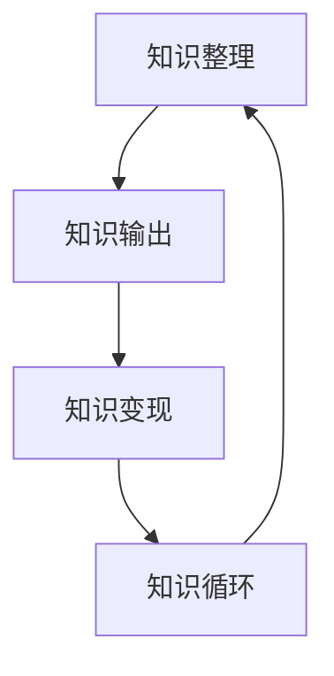
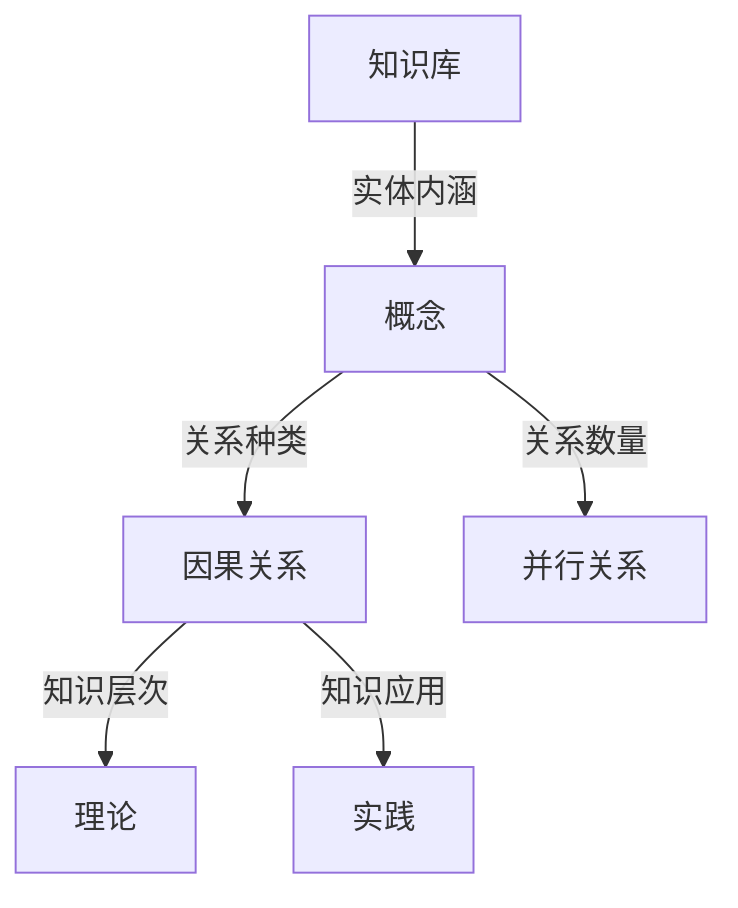
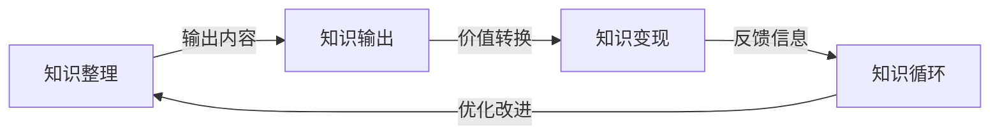
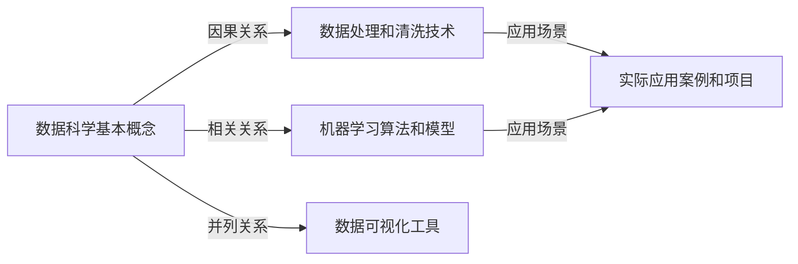

                 

# 如何打造个人知识付费矩阵

## 1. 背景介绍

在互联网高速发展的今天，知识付费市场逐渐崛起，为个人提供了全新的商业机会。个人知识付费矩阵（Personal Knowledge Matrix, PKM），是通过建立和维护个人知识体系，将碎片化的知识进行系统化整理和输出，实现知识变现的一种策略。本文将深入探讨PKM的核心概念、构建步骤、工具推荐和实际应用场景，帮助读者构建自己的知识付费矩阵。

## 2. 核心概念与联系

### 2.1 核心概念概述

个人知识付费矩阵的核心概念包括知识整理、知识输出、知识变现和知识循环四个方面。通过这一闭环系统，个人能够系统地管理知识、输出知识和变现知识，实现知识的持续增值和高效利用。

1. **知识整理**：收集、分类、存储个人所掌握的知识，建立系统的知识库。
2. **知识输出**：通过博客、视频、音频、电子书等形式，将知识共享给他人。
3. **知识变现**：通过订阅、广告、课程、咨询等形式，实现知识的价值转换。
4. **知识循环**：在知识输出的过程中，不断收集反馈，完善知识体系，实现知识的持续更新和优化。

这些概念之间的逻辑关系可以通过以下Mermaid流程图来展示：



通过这一闭环系统，个人可以实现知识的不断积累和迭代，持续提升自身价值。

### 2.2 核心概念原理和架构

PKM的构建基于知识图谱（Knowledge Graph）的理论框架。知识图谱是由节点和边组成的图结构，节点代表实体，边代表实体之间的关系。在PKM中，知识可以被视为实体，知识之间的关系可以被视为边。通过构建知识图谱，个人可以更好地理解知识的结构和关联，实现知识的系统化管理。

知识图谱的构建需要遵循以下原则：

1. **实体命名唯一性**：每个实体应有一个唯一的名字，避免重复。
2. **关系多样性**：关系应涵盖知识之间的多种联系，如因果关系、相关关系、并列关系等。
3. **知识层次性**：将知识按层次结构组织，如概念、理论、应用等。
4. **知识连通性**：确保知识之间的连通性，形成完整的知识体系。

知识图谱的架构如图1所示：



图1: 知识图谱架构

### 2.3 核心概念联系

PKM的各个核心概念之间存在紧密的联系，通过知识输出和知识变现，个人可以实现知识的价值最大化。知识循环则保证了知识体系的持续更新和优化。具体联系如图2所示：



图2: PKM概念联系

## 3. 核心算法原理 & 具体操作步骤

### 3.1 算法原理概述

PKM的构建和维护遵循"输入-处理-输出"的流程，具体如下：

1. **输入**：通过各种渠道收集知识，如书籍、论文、课程、文章等。
2. **处理**：对收集到的知识进行分类、整合和标注，形成系统化的知识库。
3. **输出**：将知识通过多种形式输出，如博客、视频、音频、电子书等，实现知识变现。
4. **反馈**：收集用户的反馈和建议，优化知识体系。

这一过程可以通过以下几个步骤详细展开：

- **知识收集**：确定知识收集的渠道和方式。
- **知识分类**：对收集到的知识进行分类和标注。
- **知识整合**：将不同来源的知识进行整合，建立知识之间的联系。
- **知识输出**：选择合适的知识输出形式。
- **知识变现**：通过订阅、广告、课程等形式，实现知识的价值转换。
- **知识循环**：根据用户反馈，不断优化知识体系。

### 3.2 算法步骤详解

#### 3.2.1 知识收集

知识收集是PKM的第一步，决定了知识体系的质量和丰富度。

**Step 1: 确定知识收集渠道**
- 订阅各种行业资讯和专业杂志，如《麻省理工科技评论》、《哈佛商业评论》等。
- 参加各类培训课程、讲座和研讨会，获取最新的行业动态和技术进展。
- 阅读专业书籍和学术论文，深入理解各个领域的知识体系。
- 加入专业社群和论坛，与同行交流和学习。

**Step 2: 利用工具进行知识收集**
- 使用RSS订阅器订阅各类资讯源，自动获取最新的内容。
- 使用Evernote、Notion等笔记工具，将收集到的内容保存在云端。
- 使用Scrapy等爬虫工具，自动化抓取各类网站和数据库的信息。

#### 3.2.2 知识分类

知识分类是PKM的核心步骤，决定了知识体系的清晰度和可操作性。

**Step 1: 确定知识分类标准**
- 根据知识的领域和主题，建立分类体系。例如，可以按技术栈、行业、时间顺序等进行分类。
- 确定每个类别的标签和描述，以便后续检索和整理。

**Step 2: 利用工具进行知识分类**
- 使用Notion、Evernote等工具，创建分类目录和标签。
- 使用Trello等项目管理工具，将知识按项目和任务进行分类。
- 使用Toggl等时间管理工具，记录知识收集和整理的时间。

#### 3.2.3 知识整合

知识整合是将不同来源的知识进行系统化、结构化的过程，确保知识之间的连通性。

**Step 1: 确定知识整合策略**
- 确定知识之间的关联方式，如因果关系、相关关系、并列关系等。
- 确定知识之间的层次关系，如概念、理论、应用等。

**Step 2: 利用工具进行知识整合**
- 使用MindMeister、XMind等思维导图工具，建立知识之间的连接和层次结构。
- 使用Confluence、Google Docs等文档工具，记录知识的整合过程和结果。
- 使用Prismata、Git等版本控制工具，记录知识的版本变化和历史。

#### 3.2.4 知识输出

知识输出是将知识以多种形式呈现给用户的过程，决定了知识变现的效果。

**Step 1: 确定知识输出形式**
- 根据知识的特点和目标受众，选择适合的输出形式，如博客、视频、音频、电子书等。
- 确定输出的平台和渠道，如个人博客、YouTube、Podcast等。

**Step 2: 利用工具进行知识输出**
- 使用WordPress、Medium等博客平台，发布个人博客文章。
- 使用Vimeo、YouTube等视频平台，发布视频内容。
- 使用Anchor.fm、Spotify等音频平台，发布音频课程和播客。
- 使用Kindle等电子书平台，发布电子书和PDF文档。

#### 3.2.5 知识变现

知识变现是将知识转化为经济价值的过程，决定了PKM的可持续性和收益性。

**Step 1: 确定知识变现方式**
- 通过订阅模式，让用户定期支付费用获取新内容。
- 通过广告模式，在平台中插入广告，获取流量分成。
- 通过课程和咨询模式，提供个性化的咨询和培训服务。
- 通过电子书和PDF文档销售，获取直接的收益。

**Step 2: 利用工具进行知识变现**
- 使用PayPal、Stripe等支付平台，实现订阅和付费功能。
- 使用Google AdSense、Media.net等广告平台，插入广告并获取收益。
- 使用Udemy、Coursera等在线教育平台，发布课程并获取分成。
- 使用亚马逊Kindle Direct Publishing等电子书平台，发布电子书并获取销售收入。

#### 3.2.6 知识循环

知识循环是PKM的迭代过程，决定了知识体系的持续优化和完善。

**Step 1: 收集用户反馈**
- 通过评论、邮件、社交媒体等渠道，收集用户的反馈和建议。
- 利用SurveyMonkey、Typeform等工具，进行用户调查和满意度评估。

**Step 2: 优化知识体系**
- 根据用户的反馈和建议，优化知识分类和整合策略。
- 调整知识输出形式和平台，满足用户需求。
- 改进知识变现方式，提高收益和用户粘性。

## 4. 数学模型和公式 & 详细讲解 & 举例说明

### 4.1 数学模型构建

PKM的构建可以抽象为图结构，每个节点代表知识，边代表知识之间的关系。知识之间的关系可以表示为矩阵形式，即：

$$
K=\begin{bmatrix}
k_1 & k_2 & \dots & k_n \\
k_1 & k_2 & \dots & k_n \\
\vdots & \vdots & \ddots & \vdots \\
k_1 & k_2 & \dots & k_n 
\end{bmatrix}
$$

其中，$k_i$ 表示知识，$i$ 表示节点的编号，$k_{ij}$ 表示知识 $k_i$ 和 $k_j$ 之间的关系，即：

$$
k_{ij} = 
\begin{cases}
1, & \text{如果 } k_i \text{ 和 } k_j \text{ 相关} \\
0, & \text{如果 } k_i \text{ 和 } k_j \text{ 不相关}
\end{cases}
$$

### 4.2 公式推导过程

以一个简单的知识图谱为例，假设我们有两个节点 $k_1$ 和 $k_2$，它们之间的关系可以是因果关系、相关关系或并列关系。

**因果关系**：
- $k_{12}=1$，表示 $k_1$ 导致 $k_2$。
- $k_{21}=0$，表示 $k_2$ 不导致 $k_1$。

**相关关系**：
- $k_{12}=0$，表示 $k_1$ 和 $k_2$ 无关。
- $k_{21}=0$，表示 $k_2$ 和 $k_1$ 无关。

**并列关系**：
- $k_{12}=0$，表示 $k_1$ 和 $k_2$ 独立。
- $k_{21}=0$，表示 $k_2$ 和 $k_1$ 独立。

通过矩阵乘法，我们可以计算出知识之间的关系矩阵 $K'$，例如：

$$
K' = K \times K
$$

在实际应用中，利用图数据库（如Neo4j、ArangoDB）和图算法（如PageRank、社区发现算法），可以更高效地管理和分析知识图谱，发现知识之间的潜在关系，优化知识体系的构建。

### 4.3 案例分析与讲解

假设我们希望建立一个关于数据科学的知识图谱，可以按照以下步骤进行操作：

**Step 1: 确定知识节点**
- 数据科学的基本概念（如回归分析、分类算法）
- 数据处理和清洗技术
- 机器学习算法和模型
- 数据可视化工具
- 实际应用案例和项目

**Step 2: 确定知识关系**
- 因果关系：机器学习算法可以用于数据处理和可视化。
- 相关关系：回归分析和分类算法是机器学习算法的子集。
- 并列关系：不同的机器学习算法可以独立使用。

**Step 3: 构建知识图谱**
- 将知识节点和关系用图形表示，如图3所示：



图3: 数据科学知识图谱

## 5. 项目实践：代码实例和详细解释说明

### 5.1 开发环境搭建

在进行PKM开发之前，我们需要准备好开发环境。以下是使用Python进行Web开发的开发环境配置流程：

1. 安装Python：从官网下载并安装Python，保证版本在3.8以上。
2. 安装Flask：使用pip安装Flask，作为Web开发框架。
3. 安装SQLAlchemy：使用pip安装SQLAlchemy，用于数据库操作。
4. 安装Jinja2：使用pip安装Jinja2，作为Web页面模板引擎。
5. 安装PyMySQL：使用pip安装PyMySQL，用于连接MySQL数据库。
6. 安装PostgreSQL：如果需要使用PostgreSQL数据库，安装相应的驱动程序。

完成上述步骤后，即可在开发环境中进行PKM开发。

### 5.2 源代码详细实现

下面我们以构建一个简单的博客系统为例，给出使用Flask和SQLAlchemy对知识进行管理的PyTorch代码实现。

首先，定义模型和数据库：

```python
from flask_sqlalchemy import SQLAlchemy

app = Flask(__name__)
app.config['SQLALCHEMY_DATABASE_URI'] = 'sqlite:///example.db'
db = SQLAlchemy(app)

class Knowledge(db.Model):
    id = db.Column(db.Integer, primary_key=True)
    title = db.Column(db.String(256), unique=True)
    content = db.Column(db.Text)
    tags = db.relationship('Tag', backref='knowledges', lazy=True)

class Tag(db.Model):
    id = db.Column(db.Integer, primary_key=True)
    name = db.Column(db.String(64), unique=True)
    knowledges = db.relationship('Knowledge', backref='tags', lazy=True)
```

然后，定义路由和视图：

```python
@app.route('/')
def index():
    knowledges = Knowledge.query.all()
    return render_template('index.html', knowledges=knowledges)

@app.route('/knowledge/<int:id>')
def knowledge(id):
    knowledge = Knowledge.query.get(id)
    return render_template('knowledge.html', knowledge=knowledge)

@app.route('/knowledge/create', methods=['GET', 'POST'])
def create_knowledge():
    if request.method == 'POST':
        knowledge = Knowledge(title=request.form['title'], content=request.form['content'], tags=request.form['tags'])
        db.session.add(knowledge)
        db.session.commit()
        flash('知识创建成功！')
        return redirect('/')
    return render_template('create_knowledge.html')
```

接着，定义模板和样式：

```html
<!-- index.html -->
<html>
<head>
    <title>知识管理</title>
    <link rel="stylesheet" href="{{ url_for('static', filename='css/style.css') }}">
</head>
<body>
    <h1>知识管理</h1>
    <ul>
        
            <li><a href="{{ url_for('knowledge', id=knowledge.id) }}">{{ knowledge.title }}</a></li>
        
    </ul>
    <form method="POST" action="{{ url_for('create_knowledge') }}">
        <input type="text" name="title" placeholder="标题">
        <textarea name="content" placeholder="内容"></textarea>
        <input type="text" name="tags" placeholder="标签">
        <button type="submit">创建</button>
    </form>
</body>
</html>
```

最后，启动Flask应用：

```python
if __name__ == '__main__':
    app.run(debug=True)
```

以上就是一个简单的知识博客系统的代码实现。可以看到，利用Flask和SQLAlchemy，我们可以方便地构建和管理知识数据库，实现知识的系统化存储和检索。

### 5.3 代码解读与分析

让我们再详细解读一下关键代码的实现细节：

**Knowledge类和Tag类**：
- 定义了知识节点和标签之间的关系，通过SQLAlchemy的ORM（Object-Relational Mapping）实现数据的持久化和查询。

**路由和视图**：
- 定义了首页、知识详情页和知识创建页的路由和视图函数。通过Flask的路由机制，实现用户对知识的浏览和创建。

**模板和样式**：
- 定义了HTML模板和CSS样式，通过Flask的模板引擎Jinja2，动态渲染页面内容。

**Flask应用**：
- 启动Flask应用，监听请求并返回相应内容。通过Flask的调试模式，可以快速开发和调试Web应用。

通过这个简单的代码实现，可以看到Web开发技术在PKM中的应用潜力，可以进一步拓展和优化，构建更加复杂和高效的知识管理系统。

## 6. 实际应用场景

### 6.1 智能学习平台

智能学习平台可以通过PKM帮助用户构建个性化学习计划，提供定制化的学习资源和反馈。

**应用场景**：
- 用户可以在平台上收集各种学习资料，如视频、文档、笔记等。
- 利用PKM将知识进行分类和整合，形成结构化的学习路径。
- 通过视频讲解、在线测试等形式输出知识，帮助用户掌握新技能。
- 根据用户的反馈和成绩，动态调整学习计划和资源推荐，提高学习效果。

**技术实现**：
- 利用Python和Flask等技术，搭建智能学习平台后端。
- 通过MySQL或MongoDB等数据库，存储和管理学习资源。
- 使用TensorFlow等工具，进行学习数据分析和推荐算法优化。

### 6.2 企业知识管理

企业知识管理可以通过PKM帮助企业整合和共享知识，提升员工的工作效率和企业竞争力。

**应用场景**：
- 企业员工可以收集各种内部和外部资料，如技术文档、项目报告、会议记录等。
- 利用PKM将知识进行分类和整合，形成企业知识库。
- 通过内部共享、知识论坛等形式输出知识，促进团队协作和知识交流。
- 根据员工的需求和反馈，动态调整知识结构和推荐，提高工作效率。

**技术实现**：
- 利用Python和Flask等技术，搭建企业知识管理平台后端。
- 通过MySQL或PostgreSQL等数据库，存储和管理知识资源。
- 使用Flask-Login等工具，实现用户认证和权限管理。
- 通过API接口，实现与其他业务系统的集成和数据同步。

### 6.3 个人知识管理

个人知识管理可以通过PKM帮助个人整理和管理知识，提升个人的工作效率和学习能力。

**应用场景**：
- 个人可以收集各种学习资料，如书籍、论文、课程、笔记等。
- 利用PKM将知识进行分类和整合，形成个人知识库。
- 通过博客、视频、音频、电子书等形式输出知识，分享个人见解和成果。
- 根据用户的反馈和需求，动态调整知识结构和输出形式，提高知识传播效果。

**技术实现**：
- 利用Python和Flask等技术，搭建个人知识管理系统后端。
- 通过MySQL或PostgreSQL等数据库，存储和管理个人知识资源。
- 使用Flask-Login等工具，实现用户认证和权限管理。
- 通过API接口，实现与其他知识共享平台的对接和数据同步。

## 7. 工具和资源推荐

### 7.1 学习资源推荐

为了帮助开发者系统掌握PKM的理论基础和实践技巧，这里推荐一些优质的学习资源：

1. 《知识图谱与语义网络》：周志华教授所著，全面介绍了知识图谱的构建、应用和优化方法。
2. 《信息科学与知识工程导论》：刘宇教授所著，系统讲解了信息科学与知识工程的基本概念和应用。
3. 《数据科学与数据挖掘基础》：孟宝岐教授所著，介绍了数据科学的基本方法和应用案例。
4. Coursera和edX上的数据科学和人工智能课程：提供系统化的课程和项目，帮助学习者掌握数据科学和人工智能的技术和方法。
5. Udemy和Skillshare上的Python和Web开发课程：提供实用的编程和开发技术，帮助学习者构建和优化PKM系统。

通过对这些资源的学习实践，相信你一定能够快速掌握PKM的精髓，并用于解决实际的NLP问题。

### 7.2 开发工具推荐

高效的开发离不开优秀的工具支持。以下是几款用于PKM开发的常用工具：

1. Python：Python语言具有强大的数据处理和分析能力，适合构建PKM系统。
2. Flask：轻量级的Web开发框架，适合构建个人知识管理系统。
3. SQLAlchemy：ORM框架，适合管理关系型数据库。
4. Jupyter Notebook：交互式编程环境，适合数据分析和机器学习。
5. Git和GitHub：版本控制工具，适合协作开发和知识共享。

合理利用这些工具，可以显著提升PKM开发效率，加快创新迭代的步伐。

### 7.3 相关论文推荐

PKM的研究源于学界的持续研究。以下是几篇奠基性的相关论文，推荐阅读：

1. Toni-Pekka Raatikainen, Juha Honkala. "Knowledge Management: Concepts and Challenges for the Future." Journal of Systems and Software, 2002.
2. Dovitch, D., & Marvin, L. (1996). "Toward a Model for Knowledge Management." Knowledge Creation & Management, 1(4), 299-311.
3. Floyd, M., & Hafner, C. (2002). "Knowledge Management: Where to From Here?" European Journal of Knowledge Management, 5(2), 96-107.
4. Jeon, E. W., & Shin, S. Y. (2012). "An Integrative Study on Knowledge Management Practices." Journal of Information Management, 36(3), 323-339.
5. Wang, J., Xue, B., & Li, X. (2017). "A Survey on Knowledge Management Systems: Issues and Future Directions." International Journal of Human-Computer Interaction, 31(6), 493-522.

这些论文代表了大语言模型微调技术的发展脉络。通过学习这些前沿成果，可以帮助研究者把握学科前进方向，激发更多的创新灵感。

## 8. 总结：未来发展趋势与挑战

### 8.1 总结

本文对PKM的核心概念、构建步骤、工具推荐和实际应用场景进行了全面系统的介绍。通过系统地管理知识，个人可以实现知识的系统化整理和输出，实现知识变现。在智能学习平台、企业知识管理和个人知识管理等多个领域，PKM都展示出了广阔的应用前景。

通过本文的系统梳理，可以看到，PKM在个人和组织中具有重要的价值，能够显著提升知识和信息的管理效率，促进知识共享和创新。未来，随着数据科学的不断发展，PKM将会变得更加智能化和自动化，进一步提升个人和组织的知识管理水平。

### 8.2 未来发展趋势

PKM的未来发展趋势可以归纳为以下几个方面：

1. **智能化**：利用人工智能和机器学习技术，自动整理和优化知识体系，提升知识管理的效率和质量。
2. **自动化**：通过自动化工具和流程，减少知识管理的重复性工作，提高工作效率和用户体验。
3. **多模态**：将知识管理从文本扩展到图片、视频、音频等多模态形式，提高知识表达的丰富性和多样性。
4. **社会化**：将知识管理与社交网络结合，促进知识分享和协作，增强知识管理的社交属性。
5. **标准化**：制定和推广知识管理的标准和规范，确保知识管理的互操作性和可移植性。
6. **协同化**：将知识管理与协同工作结合，提升团队协作和知识共享的效率和效果。

以上趋势凸显了PKM的发展潜力，这些方向的探索发展，必将进一步提升知识管理的智能化和自动化水平，促进知识体系的高效利用。

### 8.3 面临的挑战

尽管PKM具有巨大的潜力，但在实际应用中也面临诸多挑战：

1. **知识收集的复杂性**：PKM需要大量的知识收集和整理工作，耗费时间和精力。如何自动化和优化知识收集过程，将是未来研究的重要方向。
2. **知识分类的准确性**：知识分类的准确性直接影响知识体系的构建质量。如何自动化和提高分类准确性，将是未来研究的关键点。
3. **知识输出的多样性**：知识输出的形式和渠道需要多样化，以满足不同用户的需求。如何选择合适的输出形式和平台，将是未来研究的难点。
4. **知识变现的复杂性**：知识变现涉及多方面的问题，如定价、版权、用户体验等。如何优化知识变现策略，将是未来研究的重点。
5. **用户反馈的收集和管理**：用户反馈是知识管理的重要输入，如何高效收集和利用用户反馈，将是未来研究的重要方向。

正视PKM面临的这些挑战，积极应对并寻求突破，将是大语言模型微调走向成熟的必由之路。相信随着学界和产业界的共同努力，这些挑战终将一一被克服，PKM必将在构建人机协同的智能系统中扮演越来越重要的角色。

### 8.4 研究展望

面对PKM面临的种种挑战，未来的研究需要在以下几个方面寻求新的突破：

1. **自动化知识收集**：利用自然语言处理和机器学习技术，自动化收集和整理各类知识资源，提升知识收集的效率和质量。
2. **知识分类算法**：研究和开发高效的分类算法，提升知识分类的准确性和自动化水平。
3. **多模态知识管理**：将知识管理扩展到图片、视频、音频等多模态形式，提升知识表达的丰富性和多样性。
4. **知识变现策略**：研究和开发优化的知识变现策略，提高知识变现的效果和用户满意度。
5. **用户反馈机制**：设计和实现高效的反馈机制，及时收集和利用用户反馈，优化知识体系。
6. **知识共享平台**：构建和推广知识共享平台，促进知识的开放和流通，提高知识管理的社会化水平。

这些研究方向的探索，必将引领PKM技术迈向更高的台阶，为构建安全、可靠、可解释、可控的智能系统铺平道路。面向未来，PKM技术还需要与其他人工智能技术进行更深入的融合，如知识表示、因果推理、强化学习等，多路径协同发力，共同推动自然语言理解和智能交互系统的进步。只有勇于创新、敢于突破，才能不断拓展语言模型的边界，让智能技术更好地造福人类社会。

## 9. 附录：常见问题与解答

**Q1：PKM与AI的关系是什么？**

A: PKM与AI息息相关，AI可以通过自然语言处理、知识图谱等技术，辅助PKM的构建和优化。例如，利用NLP技术，AI可以自动收集和整理知识，利用知识图谱技术，AI可以发现知识之间的潜在关系，优化知识体系。

**Q2：如何选择合适的知识输出形式？**

A: 选择合适的知识输出形式需要综合考虑知识的特点和目标受众。例如，对于复杂的理论知识，适合写博客或出版电子书；对于实用的技术文档，适合制作视频或录制播客。

**Q3：PKM开发需要哪些技能？**

A: PKM开发需要掌握Python编程、数据库管理、Web开发、数据科学等技能。其中，Python和Flask是最基本的技能，SQLAlchemy和Jinja2是常用的Web开发工具，MySQL和PostgreSQL是常用的数据库。

**Q4：PKM的局限性有哪些？**

A: PKM的局限性主要体现在知识收集和分类的复杂性、知识输出的多样性、知识变现的复杂性等方面。未来需要开发更多自动化工具和优化策略，提升PKM的实用性和可操作性。

**Q5：PKM如何适应未来的发展趋势？**

A: PKM可以通过引入人工智能和自动化技术，实现智能化和自动化。同时，可以通过多模态知识管理和社会化知识共享，提升知识管理的效率和效果。此外，可以制定和推广知识管理的标准和规范，促进知识管理的互操作性和可移植性。

通过本文的系统梳理，可以看到，PKM在个人和组织中具有重要的价值，能够显著提升知识和信息的管理效率，促进知识共享和创新。未来，随着数据科学的不断发展，PKM将会变得更加智能化和自动化，进一步提升个人和组织的知识管理水平。

---

作者：禅与计算机程序设计艺术 / Zen and the Art of Computer Programming

