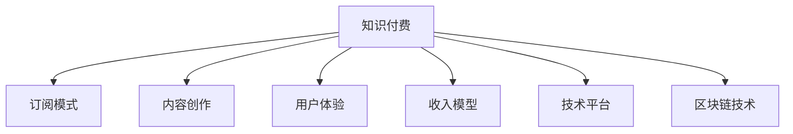

                 

# 如何打造个人知识付费订阅模式

> 关键词：知识付费、订阅模式、内容创作、用户体验、收入模型、技术平台、区块链、内容激励

## 1. 背景介绍

### 1.1 问题由来
在数字化时代的浪潮中，知识的获取和分享变得前所未有的便捷。个人知识付费订阅模式正是在这样的背景下诞生，它利用互联网和支付技术，将知识与货币结合，为内容创作者和知识消费者提供了一种新的价值交换方式。相比于传统的线下培训、书籍出版等知识传播途径，个人知识付费订阅模式更加灵活、互动性强、内容更新及时。

然而，如何构建一个成功且可持续的个人知识付费订阅平台，却是一个复杂而系统的问题。它不仅涉及技术实现、内容策划、用户体验设计，还包括收入模型构建、平台运营策略等多方面内容。本文旨在深入剖析这一模式，为有意进入这一领域的创业者、内容创作者和平台运营者提供全面而深入的指导。

## 2. 核心概念与联系

### 2.1 核心概念概述

为了更清晰地理解个人知识付费订阅模式的构建，本节将介绍几个关键概念，并阐明它们之间的联系。

- **知识付费（Knowledge Payment）**：基于互联网和支付技术，以订阅、打赏、课程销售等方式，实现知识内容的价值化。

- **订阅模式（Subscription Model）**：用户通过付费，获得在指定时间周期内，持续访问特定知识内容的能力。

- **内容创作（Content Creation）**：知识付费订阅平台的核心功能之一，包括内容策划、制作、发布和维护。

- **用户体验（User Experience, UX）**：指用户在使用平台过程中，对内容的可访问性、互动性和易用性等感受。

- **收入模型（Revenue Model）**：平台通过用户订阅、广告、会员增值服务等多种方式，实现盈利的机制。

- **技术平台（Technical Platform）**：构建知识付费订阅模式的基础设施，包括但不限于用户管理系统、支付系统、内容管理系统等。

- **区块链技术（Blockchain Technology）**：为知识付费订阅平台提供可信的认证和激励机制，保障创作者和消费者的权益。

这些概念之间相互关联，共同构成了个人知识付费订阅模式的框架。理解这些概念，是构建平台的关键。

### 2.2 核心概念原理和架构的 Mermaid 流程图



这个流程图展示了个人知识付费订阅模式的核心概念及其相互关系。

## 3. 核心算法原理 & 具体操作步骤

### 3.1 算法原理概述

个人知识付费订阅模式的核心算法原理涉及用户行为分析、个性化推荐、订阅续费模型等多个方面。这些算法通过数据分析和机器学习技术，实现对用户需求的精准识别和内容推荐的优化，从而提升平台的用户粘性和留存率。

### 3.2 算法步骤详解

1. **用户行为分析**：
   - **数据收集**：通过平台记录的用户操作数据（如访问时长、浏览记录、互动行为等），了解用户偏好。
   - **特征提取**：使用TF-IDF、协同过滤等技术，从收集的数据中提取用户特征。
   - **模型训练**：使用分类、聚类等机器学习模型，对用户行为进行分析和预测。

2. **个性化推荐**：
   - **内容推荐**：根据用户特征和历史行为，推荐最符合用户兴趣的内容。
   - **算法优化**：使用协同过滤、深度学习等算法，不断优化推荐效果。

3. **订阅续费模型**：
   - **用户细分**：根据用户行为和特征，将用户分成高价值和低价值两类。
   - **续费策略**：对高价值用户提供折扣优惠、专属内容等激励措施，降低续费难度。
   - **模型评估**：使用A/B测试等方法，评估续费模型的效果。

### 3.3 算法优缺点

**优点**：
- **精准推荐**：通过大数据分析，个性化推荐满足用户需求的内容，提升用户满意度。
- **高效运营**：自动化分析用户行为，优化推荐策略，减少人工干预。
- **持续增长**：通过订阅续费模型，不断提升用户留存率和ARPU值（每用户平均收入）。

**缺点**：
- **数据隐私**：大量用户数据收集和分析可能涉及隐私问题，需严格遵守法律法规。
- **算法复杂**：推荐和续费算法复杂度高，需要较高的技术投入。
- **市场竞争**：知识付费市场竞争激烈，需不断创新以吸引和留住用户。

### 3.4 算法应用领域

个人知识付费订阅模式已经广泛应用于在线教育、远程工作、健康管理、兴趣分享等多个领域，涵盖了从专业技能培训到兴趣培养的各类内容。以下列举几个典型应用场景：

- **在线教育**：通过订阅模式，用户可以获取优质课程，持续学习和提升技能。
- **远程工作**：提供相关的技术、管理和工具知识，帮助用户提高工作效率。
- **健康管理**：分享健康饮食、运动锻炼等知识，提升用户健康水平。
- **兴趣分享**：围绕特定兴趣领域，创建专属社群，提供丰富的内容和服务。

## 4. 数学模型和公式 & 详细讲解 & 举例说明

### 4.1 数学模型构建

个人知识付费订阅模式涉及多个数学模型，以下是几个关键模型的构建和说明：

1. **用户行为预测模型**：
   - **模型**：逻辑回归、随机森林等分类模型。
   - **目标**：预测用户是否会续费订阅。

2. **个性化推荐模型**：
   - **模型**：协同过滤、深度学习推荐系统。
   - **目标**：推荐用户可能感兴趣的内容。

3. **收入预测模型**：
   - **模型**：线性回归、时间序列分析等。
   - **目标**：预测平台未来收入。

### 4.2 公式推导过程

以**用户行为预测模型**为例，其推导过程如下：

设用户行为数据为$D=\{(x_i,y_i)\}_{i=1}^N$，其中$x_i$为用户行为特征向量，$y_i$为是否续费的标签。

使用逻辑回归模型进行预测，其数学表达式为：

$$
\hat{y_i} = \frac{1}{1+e^{-z_i}}
$$

其中，$z_i=\sum_{j=1}^n \theta_j x_{ij} + \theta_0$，$\theta$为模型参数。

**损失函数**：

$$
\mathcal{L}(\theta) = -\frac{1}{N}\sum_{i=1}^N (y_i \log \hat{y_i} + (1-y_i) \log (1-\hat{y_i}))
$$

**梯度下降算法**：

$$
\theta_j \leftarrow \theta_j - \eta \frac{\partial \mathcal{L}(\theta)}{\partial \theta_j}
$$

其中，$\eta$为学习率。

### 4.3 案例分析与讲解

以某在线教育平台为例，分析如何构建用户行为预测模型：

1. **数据收集**：收集用户登录时长、课程完成度、互动评分等行为数据。
2. **特征提取**：提取用户活跃度、课程评分、互动频率等特征。
3. **模型训练**：使用随机森林模型进行训练，预测用户是否会续费订阅。
4. **模型评估**：使用准确率、召回率、F1-score等指标评估模型性能。

## 5. 项目实践：代码实例和详细解释说明

### 5.1 开发环境搭建

为了便于开发，本节提供完整的开发环境搭建流程：

1. **安装Python**：
   - 从官网下载Python 3.x版本。
   - 安装依赖包，如numpy、pandas、scikit-learn等。

2. **环境配置**：
   - 安装虚拟环境管理器（如virtualenv）。
   - 创建虚拟环境，安装相关依赖包。

3. **模型训练**：
   - 准备训练数据集，进行数据预处理。
   - 编写模型训练代码，进行模型训练和评估。

### 5.2 源代码详细实现

以下是一个用户行为预测模型的示例代码：

```python
import numpy as np
from sklearn.ensemble import RandomForestClassifier

# 准备训练数据
X_train = np.array([[1, 2, 3], [4, 5, 6], [7, 8, 9]])
y_train = np.array([0, 1, 0])

# 构建随机森林模型
model = RandomForestClassifier(n_estimators=100)

# 模型训练
model.fit(X_train, y_train)

# 预测新数据
X_test = np.array([[10, 11, 12]])
print(model.predict(X_test))
```

### 5.3 代码解读与分析

1. **数据准备**：将用户行为数据转换为numpy数组，作为训练集的输入特征。
2. **模型构建**：使用随机森林分类器，设置树的数量为100。
3. **模型训练**：使用训练集数据进行模型训练。
4. **预测新数据**：将新数据输入模型，进行分类预测。

## 6. 实际应用场景

### 6.1 在线教育平台

在线教育平台通过个人知识付费订阅模式，提供系统的课程体系和灵活的学习方式。用户可以根据自己的需求和兴趣，选择订阅不同层次的课程，获得专业的知识传授和技能培训。

### 6.2 远程工作培训

远程工作模式下的知识付费订阅平台，提供专业的工作技能培训、时间管理、团队协作等方面的知识。通过订阅获取持续的学习内容和指导，提升工作效率，适应远程工作的新挑战。

### 6.3 健康管理应用

健康管理应用通过订阅模式，分享营养饮食、运动健身等知识。用户可以选择订阅不同主题的健康计划，获取专业的健康指导和数据监测服务，提升生活质量。

### 6.4 兴趣社群平台

兴趣社群平台专注于特定兴趣领域，如编程、摄影、旅游等。通过订阅获取专属内容，参与社区活动，建立兴趣社交网络，提升知识获取和社交互动的效率和质量。

## 7. 工具和资源推荐

### 7.1 学习资源推荐

为了帮助开发者深入理解个人知识付费订阅模式，本节推荐一些优质的学习资源：

1. **《深度学习入门》**：讲解深度学习基本原理和应用，适合初学者。
2. **《机器学习实战》**：实践导向，提供大量代码示例和项目案例。
3. **Coursera《机器学习》**：斯坦福大学开设的知名课程，涵盖机器学习算法和应用。
4. **Kaggle**：数据科学和机器学习竞赛平台，提供丰富的数据集和模型。
5. **GitHub**：代码托管平台，可以找到相关领域的开源项目和代码。

通过这些学习资源，可以系统掌握个人知识付费订阅模式的技术实现和应用。

### 7.2 开发工具推荐

为了提升开发效率和平台稳定性，推荐以下开发工具：

1. **Jupyter Notebook**：交互式编程环境，方便代码调试和结果展示。
2. **Python Flask**：轻量级Web框架，适合构建知识付费订阅平台后端。
3. **Vue.js**：前端开发框架，适合构建知识付费订阅平台前端界面。
4. **TensorFlow**：深度学习框架，适合构建推荐系统等复杂算法模型。
5. **Django**：全栈Web框架，适合构建知识付费订阅平台后端。

这些工具能够显著提升开发效率和平台稳定性，是构建个人知识付费订阅模式的关键。

### 7.3 相关论文推荐

为了深入了解个人知识付费订阅模式的理论基础，推荐以下论文：

1. **《推荐系统的协同过滤技术》**：介绍了协同过滤算法的基本原理和应用。
2. **《基于逻辑回归的用户行为预测模型》**：讨论了逻辑回归模型在用户行为预测中的应用。
3. **《深度学习在推荐系统中的应用》**：分析了深度学习在推荐系统中的优势和挑战。
4. **《区块链技术在知识付费中的应用》**：探讨了区块链技术如何保障知识付费的安全性和可信度。

这些论文提供了丰富的理论基础和实践案例，对理解个人知识付费订阅模式有重要参考价值。

## 8. 总结：未来发展趋势与挑战

### 8.1 研究成果总结

本文详细探讨了个人知识付费订阅模式的构建，从核心概念到具体算法，再到实际应用，为构建平台提供了全面的指导。通过数据分析、个性化推荐和订阅续费模型的应用，提升了平台的用户粘性和留存率，构建了稳定可持续的知识付费生态。

### 8.2 未来发展趋势

未来，个人知识付费订阅模式将继续发展和创新，展现出以下趋势：

1. **个性化推荐系统**：更加智能和精准的推荐算法，提升用户满意度。
2. **区块链技术应用**：保障内容创作的版权和用户的权益，提升平台的可信度。
3. **多渠道内容分发**：通过视频、音频等多种形式，丰富用户的学习体验。
4. **社交互动功能**：增加社区功能，促进用户之间的交流和学习。
5. **人工智能辅助**：利用AI技术，提供智能答疑、学习计划制定等服务。

### 8.3 面临的挑战

尽管个人知识付费订阅模式具有广阔的发展前景，但也面临以下挑战：

1. **内容版权问题**：盗版和侵权行为频发，需加强版权保护。
2. **用户数据隐私**：大量用户数据收集和分析，需严格遵守隐私保护法规。
3. **平台运营成本**：技术投入和运营成本较高，需平衡商业利益和社会责任。
4. **用户付费意愿**：用户对知识付费的认知和接受度仍有待提升。
5. **市场竞争**：知识付费市场竞争激烈，需不断创新以吸引和留住用户。

### 8.4 研究展望

面向未来，个人知识付费订阅模式的研究应在以下方面取得突破：

1. **隐私保护技术**：开发更好的隐私保护技术，保障用户数据安全。
2. **智能推荐系统**：引入更多智能算法，提升推荐效果。
3. **区块链激励机制**：利用区块链技术，建立创作者和消费者的信任关系。
4. **个性化服务**：通过数据分析和AI技术，提供更个性化的服务。
5. **市场教育**：提升用户对知识付费的认知和接受度，推动市场发展。

总之，个人知识付费订阅模式是一个充满机遇与挑战的领域。只有在技术、运营、内容等多方面持续创新，才能构建一个可持续、健康发展的知识付费生态。

## 9. 附录：常见问题与解答

**Q1: 如何保障内容创作的版权和创作者权益？**

A: 利用区块链技术，为知识内容创建唯一标识（如哈希值），记录创作时间和创作者信息。通过区块链的不可篡改和透明特性，保障内容版权和创作者权益。

**Q2: 如何提升用户对知识付费的接受度？**

A: 提供免费试用期和样本内容，让用户在付费前体验产品。通过社交媒体和营销活动，宣传知识付费的独特价值和优势。

**Q3: 如何处理内容盗版和侵权问题？**

A: 利用版权保护技术，如数字水印、内容识别等，检测和追踪盗版行为。建立严格的侵权举报和处理机制，及时处理侵权问题。

**Q4: 如何优化推荐系统，提升用户体验？**

A: 引入深度学习推荐算法，通过大数据分析和用户行为预测，实现精准推荐。同时，定期更新和优化推荐模型，提升推荐效果。

**Q5: 如何平衡商业利益和用户隐私保护？**

A: 制定严格的数据保护政策，确保用户数据隐私安全。通过匿名化处理和数据脱敏，减少隐私风险。

---

作者：禅与计算机程序设计艺术 / Zen and the Art of Computer Programming

