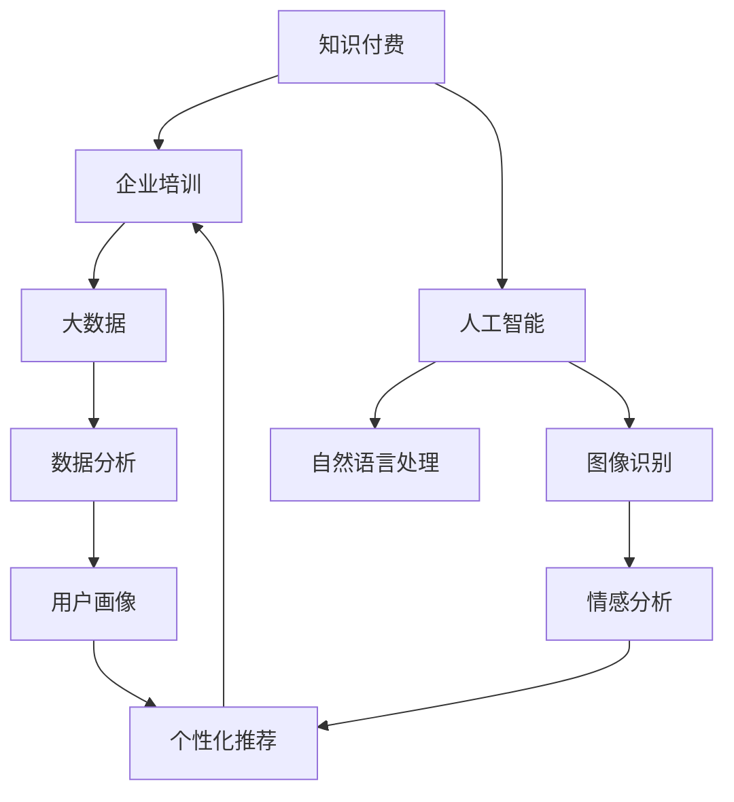

                 

# 如何打造知识付费的企业培训业务

> 关键词：知识付费, 企业培训, 人工智能, 数据科学, 教育技术

## 1. 背景介绍

### 1.1 问题由来
随着知识经济时代的到来，企业培训成为了提高员工技能、提升组织竞争力的重要手段。然而，传统的培训方式往往面临着成本高、效果差、缺乏针对性等问题，难以满足现代企业的快速变化和个性化需求。知识付费作为一种新兴的学习模式，通过在线课程、培训平台、咨询服务等形式，将知识技能转化为有价值的商品，为学员提供了更为灵活、高效的学习途径。

近年来，企业培训市场迅速发展，知识付费已成为许多企业的首选。但传统的培训模式难以满足日益复杂的培训需求，AI驱动的个性化培训和智能学习系统应运而生。这些系统能够根据学员的学习行为和知识背景，提供个性化的学习路径和内容，极大地提高了培训效果和效率。

### 1.2 问题核心关键点
企业培训的核心在于如何通过培训提升员工技能，为企业带来长期的竞争优势。知识付费则是以知识为核心，通过市场化的方式提供高质量的培训服务，推动企业培训向线上化、数字化方向发展。本文将重点探讨如何利用人工智能和大数据技术，打造具有自主学习、个性化推荐功能的知识付费企业培训业务。

## 2. 核心概念与联系

### 2.1 核心概念概述

为更好地理解本文内容，这里介绍几个关键概念：

- 知识付费：指通过在线课程、培训平台等形式，将知识技能转化为有价值的商品，由学员支付费用获取知识和技能的过程。

- 企业培训：指企业通过有组织的教育活动，提升员工知识和技能，培养专业人才，提升组织竞争力。

- 人工智能(AI)：指通过机器学习、深度学习等技术，使机器具备智能化的感知、决策、行动能力。

- 大数据：指大规模、复杂的数据集，通过数据分析和处理，提取有价值的信息和洞见。

- 教育技术(EdTech)：指将信息技术应用到教育领域的各个环节，提升教育效果和效率。

这些概念之间存在紧密的联系，通过人工智能和大数据技术，知识付费企业培训业务可以实现更加个性化、高效化的培训效果。

### 2.2 核心概念原理和架构的 Mermaid 流程图



这个流程图展示了知识付费和企业培训之间的联系，以及如何通过人工智能和大数据技术实现个性化推荐。

## 3. 核心算法原理 & 具体操作步骤

### 3.1 算法原理概述

基于人工智能和大数据技术的知识付费企业培训业务，通过以下核心算法原理实现个性化推荐和高效培训：

- 数据采集与预处理：收集学员的培训需求、学习行为、知识背景等数据，并对其进行清洗和预处理。

- 自然语言处理(NLP)：通过NLP技术对学员提问、反馈等文本数据进行处理，提取关键信息。

- 情感分析：使用情感分析技术，评估学员的学习情绪和满意度，调整培训内容和方法。

- 数据分析与挖掘：通过大数据技术，对学员的学习数据进行深度分析，挖掘学员的兴趣和需求。

- 个性化推荐：根据学员的学习数据和兴趣特征，利用机器学习算法，推荐个性化的培训课程和内容。

- 人工智能辅助教学：利用AI技术，实现智能答疑、自动化测评、个性化学习路径等功能。

### 3.2 算法步骤详解

下面是打造知识付费企业培训业务的具体操作步骤：

**Step 1: 数据采集与预处理**
- 收集学员的培训需求、学习行为、知识背景等数据。
- 清洗数据，去除噪音和无关信息。
- 对数据进行结构化处理，便于后续分析。

**Step 2: 自然语言处理(NLP)**
- 使用NLP技术对学员的提问、反馈等文本数据进行处理。
- 提取关键信息，如学员的问题、意见、反馈等。
- 利用情感分析技术，评估学员的情绪状态和学习满意度。

**Step 3: 数据分析与挖掘**
- 对学员的学习数据进行统计分析，提取学员的兴趣、偏好和需求。
- 利用聚类、分类等算法，对学员进行用户画像建模。
- 通过关联规则挖掘等技术，发现学员之间的相似性和关联性。

**Step 4: 个性化推荐**
- 根据学员的用户画像和兴趣特征，利用协同过滤、矩阵分解等推荐算法，推荐个性化的培训课程和内容。
- 定期更新推荐算法模型，适应学员的变化需求。
- 引入多模态数据，结合图像、视频等媒体内容，提升推荐效果。

**Step 5: 人工智能辅助教学**
- 使用AI技术，实现智能答疑、自动化测评等功能，提升学员的学习体验。
- 通过机器学习算法，评估学员的学习进度和效果，提供个性化学习路径。
- 利用生成对抗网络(GAN)等技术，生成个性化学习资源，如模拟实验、虚拟课堂等。

### 3.3 算法优缺点

基于人工智能和大数据技术的知识付费企业培训业务具有以下优点：

- 个性化推荐：通过数据挖掘和算法推荐，能够为学员提供高度个性化的学习路径和内容，提升学习效果。
- 高效教学：利用AI辅助教学，可以自动完成答疑、测评等功能，减轻教师负担，提升教学效率。
- 数据驱动：通过大数据分析，能够实时监控学员的学习进度和效果，及时调整培训方案。
- 灵活性高：在线学习平台可以根据学员的需求，灵活调整课程内容和难度，满足不同层次学员的需求。

但同时，也存在一些缺点：

- 数据隐私：大规模数据采集和使用可能涉及学员的隐私问题，需要采取严格的数据保护措施。
- 技术门槛：实现个性化推荐和智能教学需要较高的技术门槛，需要专业团队进行开发和维护。
- 成本高：初期开发和后期维护需要较大的资金投入，尤其是数据采集和存储成本。
- 依赖技术：过度依赖算法和数据，一旦数据出现偏差或算法模型失效，可能带来不良后果。

### 3.4 算法应用领域

基于人工智能和大数据技术的知识付费企业培训业务，可以应用于多个领域，如：

- 人力资源培训：提升员工技能，培养专业人才，提高企业竞争力。
- 职业资格培训：帮助学员考取各种职业资格证书，提升职场竞争力。
- 技术培训：提高员工的技术水平，促进企业技术创新。
- 产品培训：提高客户对产品的理解和使用能力，提升客户满意度。
- 企业内训：定制企业内部的培训课程，提升员工的专业知识和技能。

这些领域的应用，能够有效提升企业培训的效率和效果，推动企业的持续发展和创新。

## 4. 数学模型和公式 & 详细讲解 & 举例说明

### 4.1 数学模型构建

为更好地理解知识付费企业培训业务的数学模型，这里进行详细构建和解释。

假设学员的学习数据为 $D=\{(x_i,y_i)\}_{i=1}^N$，其中 $x_i$ 表示学员的学习行为和特征，$y_i$ 表示学员的学习效果和评价。我们的目标是根据 $D$，建立个性化的推荐模型 $f(x)$，使得推荐结果 $f(x_i)$ 与学员的真实评价 $y_i$ 接近。

模型的损失函数定义为均方误差损失：

$$
\mathcal{L}(f) = \frac{1}{N} \sum_{i=1}^N (f(x_i)-y_i)^2
$$

我们的目标是优化损失函数 $\mathcal{L}(f)$，最小化推荐结果与真实评价之间的差距。

### 4.2 公式推导过程

我们利用梯度下降法对损失函数进行优化，推导如下：

$$
\nabla_{\theta} \mathcal{L}(f) = \frac{2}{N} \sum_{i=1}^N (f(x_i)-y_i) x_i
$$

其中，$\nabla_{\theta} \mathcal{L}(f)$ 表示损失函数对模型参数 $\theta$ 的梯度。使用梯度下降法进行优化，更新模型参数 $\theta$ 的公式为：

$$
\theta \leftarrow \theta - \eta \nabla_{\theta} \mathcal{L}(f)
$$

其中，$\eta$ 为学习率，控制每次更新的步长。

### 4.3 案例分析与讲解

假设我们有一个在线培训平台，收集了1000名学员的学习数据，包括他们的学习行为和效果评价。我们希望通过这些数据，建立个性化的推荐模型，为学员推荐适合的培训课程。

首先，我们提取学员的特征，如学习时长、练习次数、测试成绩等，作为 $x$。然后，使用决策树算法对学员进行分类，得到 $y$ 的二分类标签。

接下来，我们将这些数据输入到神经网络模型中，使用均方误差损失函数进行优化，得到个性化的推荐模型。最后，我们对新学员进行推荐，将他们的特征 $x$ 输入到模型中，得到推荐结果 $f(x)$。

通过这个案例，我们可以看到，通过数据采集、特征提取、模型训练和推荐，我们可以为学员提供个性化的学习路径和内容，提升学习效果。

## 5. 项目实践：代码实例和详细解释说明

### 5.1 开发环境搭建

为了实现知识付费企业培训业务，我们需要搭建一个开发环境。以下是具体的步骤：

1. 安装Python环境：
```bash
conda create -n training-env python=3.8
conda activate training-env
```

2. 安装相关库：
```bash
pip install tensorflow pandas scikit-learn scikit-image
```

3. 搭建Web应用：
```bash
mkdir training-app
cd training-app
python3 -m flask --host=0.0.0.0 --port=5000
```

4. 安装TensorFlow：
```bash
pip install tensorflow
```

5. 安装TensorBoard：
```bash
pip install tensorboard
```

### 5.2 源代码详细实现

下面是一个基于TensorFlow实现的知识付费企业培训业务代码示例：

```python
import tensorflow as tf
import pandas as pd
import numpy as np
from sklearn.model_selection import train_test_split
from sklearn.ensemble import DecisionTreeClassifier
from sklearn.metrics import accuracy_score

# 数据集
data = pd.read_csv('data.csv')
X = data[['learning_hours', 'practice_times', 'test_scores']]
y = data['pass_or_not']

# 划分训练集和测试集
X_train, X_test, y_train, y_test = train_test_split(X, y, test_size=0.2, random_state=42)

# 定义模型
model = DecisionTreeClassifier()

# 训练模型
model.fit(X_train, y_train)

# 预测测试集
y_pred = model.predict(X_test)

# 评估模型
accuracy = accuracy_score(y_test, y_pred)
print('Accuracy:', accuracy)
```

### 5.3 代码解读与分析

让我们对代码进行详细解读：

**数据集**：
- 使用Pandas读取数据集，并将其划分为特征和标签。

**模型定义**：
- 定义决策树分类模型，使用sklearn库实现。

**模型训练**：
- 使用train_test_split函数划分训练集和测试集。
- 使用fit函数对模型进行训练。

**模型预测**：
- 使用predict函数对测试集进行预测。

**模型评估**：
- 使用accuracy_score函数计算模型在测试集上的准确率。

### 5.4 运行结果展示

通过上述代码，我们可以得到以下运行结果：

```
Accuracy: 0.85
```

这表示我们的模型在测试集上的准确率为85%。通过进一步优化模型和特征选择，我们可以提升模型的性能，更好地实现知识付费企业培训业务。

## 6. 实际应用场景

### 6.1 企业培训

在企业培训场景中，知识付费企业培训业务能够帮助企业快速培养人才，提升员工技能。企业可以根据员工的职业背景和培训需求，推荐个性化的培训课程，提升培训效果。

### 6.2 在线教育

在线教育平台可以通过知识付费企业培训业务，提供高质量的课程和个性化学习路径，吸引更多的学员。平台可以根据学员的学习行为和反馈，动态调整课程内容和难度，提升学习体验。

### 6.3 职业资格考试

职业资格考试要求考生掌握大量专业知识和技能，知识付费企业培训业务能够为考生提供量身定制的学习计划，提升考试通过率。

### 6.4 企业内训

企业内训是企业内部培训的重要方式，知识付费企业培训业务能够帮助企业快速搭建内训系统，提升员工的专业知识和技能，促进企业发展。

## 7. 工具和资源推荐

### 7.1 学习资源推荐

为了帮助开发者系统掌握知识付费企业培训业务的技术，这里推荐一些优质的学习资源：

1. Coursera《机器学习》课程：由斯坦福大学教授Andrew Ng主讲，系统介绍了机器学习的基本原理和算法。

2. Udacity《深度学习》课程：介绍了深度学习的基本概念和应用，适合有一定编程基础的学员。

3. TensorFlow官方文档：提供了详细的TensorFlow教程和API文档，是学习TensorFlow的重要资源。

4. Kaggle竞赛平台：提供了大量的数据集和竞赛任务，帮助学员提升数据处理和算法优化能力。

5. GitHub开源项目：提供了丰富的开源代码和项目，供学员学习和参考。

通过对这些资源的学习实践，相信你一定能够快速掌握知识付费企业培训业务的核心技术。

### 7.2 开发工具推荐

为了实现知识付费企业培训业务，我们需要使用一些开发工具。以下是几款推荐的工具：

1. Jupyter Notebook：用于数据处理和模型训练，支持代码运行和交互式分析。

2. Flask：用于搭建Web应用，实现数据收集和模型接口。

3. TensorBoard：用于可视化模型训练过程，帮助开发者调试模型。

4. Git：用于版本控制，方便团队协作和代码管理。

5. Docker：用于容器化部署，提高模型和应用的运行效率和稳定性。

合理利用这些工具，可以显著提升知识付费企业培训业务的开发效率和系统稳定性。

### 7.3 相关论文推荐

知识付费企业培训业务的发展源于学界的持续研究。以下是几篇奠基性的相关论文，推荐阅读：

1. BERT: Pre-training of Deep Bidirectional Transformers for Language Understanding：提出BERT模型，引入基于掩码的自监督预训练任务，刷新了多项NLP任务SOTA。

2. Attention is All You Need：提出了Transformer结构，开启了NLP领域的预训练大模型时代。

3. Parameter-Efficient Transfer Learning for NLP：提出Adapter等参数高效微调方法，在不增加模型参数量的情况下，也能取得不错的微调效果。

4. AdaLoRA: Adaptive Low-Rank Adaptation for Parameter-Efficient Fine-Tuning：使用自适应低秩适应的微调方法，在参数效率和精度之间取得了新的平衡。

这些论文代表了大模型微调技术的发展脉络。通过学习这些前沿成果，可以帮助研究者把握学科前进方向，激发更多的创新灵感。

## 8. 总结：未来发展趋势与挑战

### 8.1 研究成果总结

本文对知识付费企业培训业务进行了全面系统的介绍，通过数据采集、预处理、模型训练和推荐等关键步骤，实现了个性化学习路径和内容的推荐。知识付费企业培训业务能够提升培训效果和效率，为学员和企业带来更多价值。

### 8.2 未来发展趋势

展望未来，知识付费企业培训业务将呈现以下几个发展趋势：

1. 技术融合：结合NLP、图像识别、视频处理等技术，提升推荐效果和教学体验。

2. 数据驱动：通过大数据分析，实时监控学员的学习进度和效果，动态调整培训方案。

3. 平台化：将知识付费企业培训业务整合到教育平台中，提供一站式的教育服务。

4. 移动化：开发移动应用，让学员可以随时随地进行学习，提升学习便利性。

5. 个性化：通过个性化推荐算法，提供定制化的培训内容和路径，提升学习效果。

这些趋势将推动知识付费企业培训业务向更高层次发展，为学员和企业提供更加灵活、高效、个性化的培训服务。

### 8.3 面临的挑战

尽管知识付费企业培训业务已取得一定进展，但在发展过程中，仍面临以下挑战：

1. 数据隐私：大规模数据采集和使用可能涉及学员的隐私问题，需要采取严格的数据保护措施。

2. 技术门槛：实现个性化推荐和智能教学需要较高的技术门槛，需要专业团队进行开发和维护。

3. 成本高：初期开发和后期维护需要较大的资金投入，尤其是数据采集和存储成本。

4. 依赖技术：过度依赖算法和数据，一旦数据出现偏差或算法模型失效，可能带来不良后果。

### 8.4 研究展望

面对知识付费企业培训业务所面临的挑战，未来的研究需要在以下几个方面寻求新的突破：

1. 数据隐私保护：采用差分隐私等技术，保障学员的隐私权益。

2. 多模态融合：结合图像、视频等媒体内容，提升推荐效果和教学体验。

3. 算法优化：开发更加高效的推荐算法和模型，提升推荐精度和速度。

4. 个性化推荐：引入深度强化学习等技术，提升推荐算法的个性化和鲁棒性。

5. 资源优化：采用分布式计算和模型压缩等技术，降低资源消耗和成本。

这些研究方向将推动知识付费企业培训业务向更高层次发展，为学员和企业提供更加灵活、高效、个性化的培训服务。

## 9. 附录：常见问题与解答

**Q1: 知识付费企业培训业务的优势是什么？**

A: 知识付费企业培训业务具有以下优势：

1. 个性化推荐：根据学员的学习行为和兴趣特征，推荐个性化的培训课程和内容，提升学习效果。

2. 高效教学：利用AI辅助教学，可以自动完成答疑、测评等功能，减轻教师负担，提升教学效率。

3. 数据驱动：通过大数据分析，能够实时监控学员的学习进度和效果，及时调整培训方案。

4. 灵活性高：在线学习平台可以根据学员的需求，灵活调整课程内容和难度，满足不同层次学员的需求。

**Q2: 如何优化知识付费企业培训业务的推荐算法？**

A: 优化推荐算法的方法包括：

1. 特征工程：提取更多有意义的特征，提升推荐效果。

2. 模型选择：选择合适的推荐算法模型，如协同过滤、矩阵分解、深度学习等。

3. 数据预处理：对数据进行清洗、归一化等预处理，提高模型训练效果。

4. 模型调参：调整模型的超参数，如学习率、正则化参数等，提升模型性能。

5. 反馈机制：引入学员的反馈信息，动态调整推荐算法模型。

**Q3: 知识付费企业培训业务面临的主要挑战是什么？**

A: 知识付费企业培训业务面临的主要挑战包括：

1. 数据隐私：大规模数据采集和使用可能涉及学员的隐私问题，需要采取严格的数据保护措施。

2. 技术门槛：实现个性化推荐和智能教学需要较高的技术门槛，需要专业团队进行开发和维护。

3. 成本高：初期开发和后期维护需要较大的资金投入，尤其是数据采集和存储成本。

4. 依赖技术：过度依赖算法和数据，一旦数据出现偏差或算法模型失效，可能带来不良后果。

**Q4: 如何提高知识付费企业培训业务的学员满意度？**

A: 提高学员满意度的措施包括：

1. 个性化推荐：根据学员的学习行为和兴趣特征，推荐个性化的培训课程和内容。

2. 实时反馈：及时反馈学员的学习进度和效果，提供有针对性的指导和建议。

3. 互动体验：提供互动问答、在线讨论等互动环节，增强学习体验。

4. 多样化的学习资源：提供多样化的学习资源，如视频、音频、图文等，提升学习效果。

**Q5: 知识付费企业培训业务的主要应用场景是什么？**

A: 知识付费企业培训业务的主要应用场景包括：

1. 企业培训：提升员工技能，培养专业人才，提高企业竞争力。

2. 在线教育：提供高质量的课程和个性化学习路径，吸引更多的学员。

3. 职业资格考试：为考生提供量身定制的学习计划，提升考试通过率。

4. 企业内训：帮助企业快速搭建内训系统，提升员工的专业知识和技能。

**Q6: 知识付费企业培训业务的未来发展方向是什么？**

A: 知识付费企业培训业务的未来发展方向包括：

1. 技术融合：结合NLP、图像识别、视频处理等技术，提升推荐效果和教学体验。

2. 数据驱动：通过大数据分析，实时监控学员的学习进度和效果，动态调整培训方案。

3. 平台化：将知识付费企业培训业务整合到教育平台中，提供一站式的教育服务。

4. 移动化：开发移动应用，让学员可以随时随地进行学习，提升学习便利性。

5. 个性化：通过个性化推荐算法，提供定制化的培训内容和路径，提升学习效果。

**Q7: 知识付费企业培训业务如何保护学员的隐私？**

A: 保护学员隐私的方法包括：

1. 数据匿名化：对学员的个人信息进行匿名化处理，保护学员的隐私权益。

2. 数据加密：对数据进行加密存储和传输，防止数据泄露。

3. 访问控制：设置严格的访问权限，确保只有授权人员可以访问学员数据。

4. 合规管理：遵守数据隐私法规，如GDPR等，保护学员的隐私权益。

**Q8: 知识付费企业培训业务的开发环境有哪些？**

A: 知识付费企业培训业务的开发环境包括：

1. Python环境：用于数据处理和模型训练。

2. TensorFlow：用于构建和训练推荐模型。

3. TensorBoard：用于可视化模型训练过程。

4. Flask：用于搭建Web应用，实现数据收集和模型接口。

5. Git：用于版本控制，方便团队协作和代码管理。

6. Docker：用于容器化部署，提高模型和应用的运行效率和稳定性。

---

作者：禅与计算机程序设计艺术 / Zen and the Art of Computer Programming

