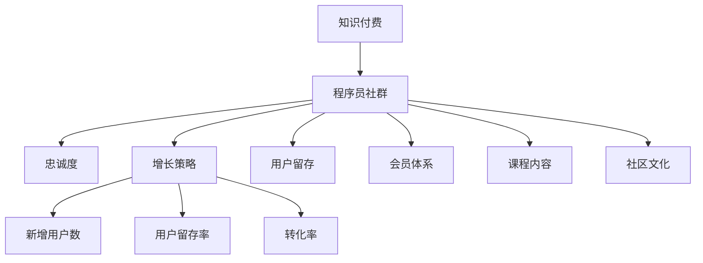

                 

# 如何打造高忠诚度的程序员知识付费社群

> 关键词：知识付费、程序员社群、忠诚度、增长策略、用户留存、会员体系、课程内容、社区文化

## 1. 背景介绍

在快速变化的互联网行业，技术更新迭代日新月异，程序员作为这一变革的主体，不断学习和成长是他们的永恒主题。然而，传统的学习方式往往难以满足高水平的技术需求，时间、效率和内容的适配性等问题限制了学习效果。知识付费作为一种新兴的在线教育模式，通过高质量、专业化的内容，吸引了大量程序员加入学习。

与此同时，程序员社群的兴起，为知识付费的落地和应用提供了新的空间。高质量的程序员社群不仅能够帮助成员更好地学习和交流，还能形成良性循环，带动更多成员加入，形成持续的增长动力。如何打造高忠诚度的程序员知识付费社群，成为当前技术社区发展的重要课题。

本文将围绕知识付费社群的构建，深入探讨如何通过合理的策略设计，提升用户参与度和忠诚度，推动社群的可持续发展。

## 2. 核心概念与联系

### 2.1 核心概念概述

在讨论如何打造高忠诚度的程序员知识付费社群时，以下核心概念是必不可少的：

- **知识付费**：即通过在线课程、专栏、电子书等形式，提供专业知识和技能的付费服务。知识付费强调高效、专业、互动的学习方式，旨在帮助用户快速提升技能，解决问题。
- **程序员社群**：由程序员自发组织，基于共同技术兴趣、学习需求、职业发展目标，形成的在线交流和学习平台。社群提供了一个更加个性化、互动的交流环境，有助于深入学习和经验分享。
- **忠诚度**：指用户对社群的长期粘性和忠诚程度，主要通过高频互动、高参与度、长期留存等指标衡量。高忠诚度的社群不仅能带来稳定的用户群体，还能实现自我迭代和升级。
- **增长策略**：即通过合理的运营手段，提升社群的用户增长率，包括新增用户数、用户留存率、转化率等。高效的增长策略有助于社群的持续发展和壮大。
- **用户留存**：即用户对社群的持续使用和活跃度，通过提供高质量内容、优化用户体验、增强互动性等手段，实现用户的长期留存。
- **会员体系**：通过设置不同层级的会员服务，激励用户贡献和参与，形成良性循环，提升社群活力和参与度。
- **课程内容**：知识付费的核心是高质量的课程内容，应根据程序员的需求，不断优化和升级，以提供更有价值的知识服务。
- **社区文化**：即社群的氛围和价值观念，通过规范的行为引导、正面的互动交流，塑造一个积极、健康、互助的社区文化。

这些核心概念之间的联系和相互作用可以通过以下Mermaid流程图来展示：



这个流程图展示了几大核心概念之间的逻辑关系：

1. **知识付费**：提供专业、高效的学习服务，吸引用户加入社群。
2. **程序员社群**：构建一个互动和分享的平台，增强用户粘性。
3. **忠诚度**：通过高频互动和高参与度，形成稳定的用户群体。
4. **增长策略**：通过运营手段提升社群的覆盖面和活跃度。
5. **用户留存**：通过优质内容和良好体验，留住用户并持续互动。
6. **会员体系**：通过激励机制，提升用户的贡献度和社群活力。
7. **课程内容**：内容是知识付费的核心，必须不断优化。
8. **社区文化**：塑造正面的社群文化，吸引用户长期参与。

这些概念共同构成了知识付费社群的生态系统，为社群的持续发展提供了坚实的保障。

## 3. 核心算法原理 & 具体操作步骤

### 3.1 算法原理概述

打造高忠诚度的程序员知识付费社群，关键在于构建一个健康的生态系统，通过高质量内容、互动交流、激励机制等手段，实现用户的高频互动和长期留存。以下从算法原理角度，概述主要的实施步骤和策略：

- **内容推送算法**：基于用户的兴趣和行为数据，推荐最适合的课程和内容，提升用户的参与度和满意度。
- **社区互动算法**：通过智能化的互动和交流机制，鼓励用户积极参与讨论和交流，形成正面的社区文化。
- **会员激励算法**：设计合理的会员体系和激励机制，鼓励用户贡献内容、推荐新用户、参与社群活动，提升社群活力。
- **用户行为分析**：通过数据分析，识别出用户的核心需求和行为特征，优化内容和运营策略，提升用户体验。

### 3.2 算法步骤详解

#### 3.2.1 内容推送算法

**步骤1：数据采集与处理**

- **用户行为数据采集**：收集用户在平台上的行为数据，如浏览时间、点击率、互动次数等。
- **用户兴趣标签提取**：基于用户的浏览和互动数据，提取用户的兴趣标签，用于后续推荐。

**步骤2：推荐模型训练**

- **模型选择**：选择适合推荐系统的算法模型，如协同过滤、深度学习等。
- **特征工程**：设计输入特征，如用户ID、课程ID、标签等。
- **模型训练**：使用历史数据训练推荐模型，优化推荐效果。

**步骤3：内容推荐**

- **实时推荐**：根据当前用户的行为数据和兴趣标签，实时推荐最适合的内容。
- **个性化推荐**：根据用户的历史行为和兴趣，提供个性化的课程和内容推荐。

#### 3.2.2 社区互动算法

**步骤1：用户互动数据分析**

- **行为分析**：分析用户之间的互动数据，如评论、点赞、分享等。
- **情感分析**：通过情感分析算法，判断用户的情感倾向，识别社区中的活跃用户。

**步骤2：互动激励机制设计**

- **正向激励**：设计奖励机制，鼓励用户积极参与互动，如积分、徽章、奖励等。
- **反噬策略**：对不当行为进行惩罚，如删帖、禁言等，维护社区秩序。

**步骤3：智能互动助手**

- **聊天机器人**：引入智能聊天机器人，解答用户疑问，提供即时互动服务。
- **讨论引导**：通过智能算法引导用户参与高质量讨论，提升社区氛围。

#### 3.2.3 会员激励算法

**步骤1：会员体系设计**

- **会员等级划分**：根据用户贡献和活跃度，设计不同等级的会员服务。
- **特权激励**：设计专属特权，如专属课程、优先服务、广告屏蔽等。

**步骤2：会员激励措施**

- **贡献激励**：通过积分、徽章等机制，激励用户贡献内容。
- **推荐激励**：奖励推荐新用户的老用户，如新用户注册费、课程优惠券等。
- **参与激励**：通过社区活动、比赛等方式，鼓励用户积极参与。

**步骤3：会员权益管理**

- **权益分配**：根据会员等级，分配相应的权益，确保机制公平透明。
- **权益更新**：定期更新会员权益，提升用户体验。

#### 3.2.4 用户行为分析

**步骤1：数据收集与清洗**

- **数据来源**：收集用户行为数据，包括平台访问日志、课程互动数据等。
- **数据清洗**：去除无效数据和噪音，确保数据质量。

**步骤2：数据分析与建模**

- **数据挖掘**：使用数据挖掘算法，分析用户的行为特征和需求。
- **模型优化**：构建数据模型，优化推荐和运营策略。

**步骤3：效果评估**

- **指标设定**：设定关键性能指标（KPIs），如课程参与率、用户留存率等。
- **效果分析**：通过A/B测试等方法，评估运营策略的效果。

### 3.3 算法优缺点

#### 3.3.1 内容推送算法

**优点**：
- **提升用户体验**：通过个性化推荐，提升用户的学习体验。
- **促进转化**：提高用户参与度和转化率，带来更多商业价值。

**缺点**：
- **数据隐私**：需要收集和处理大量用户数据，存在隐私风险。
- **算法复杂**：推荐算法设计复杂，需要持续优化和调整。

#### 3.3.2 社区互动算法

**优点**：
- **增强粘性**：通过互动激励，提升用户粘性和社区活跃度。
- **正向引导**：通过情感分析和互动引导，营造健康社区文化。

**缺点**：
- **管理成本**：社区管理需要投入大量人力和资源，成本较高。
- **用户复杂性**：社区用户行为复杂，需要智能算法进行精细化管理。

#### 3.3.3 会员激励算法

**优点**：
- **增强忠诚度**：通过会员激励，提升用户忠诚度和社群活力。
- **提升贡献**：激励用户贡献内容，丰富社群资源。

**缺点**：
- **策略复杂**：会员体系设计复杂，需要考虑公平性和激励效果。
- **运营成本**：激励措施需要持续投入，增加运营成本。

#### 3.3.4 用户行为分析

**优点**：
- **数据驱动**：通过数据分析优化内容和运营策略，提升用户满意度。
- **动态调整**：实时调整推荐和运营策略，快速适应用户需求变化。

**缺点**：
- **数据质量**：数据质量直接影响分析结果，需要持续维护和优化。
- **算法复杂**：数据分析和建模需要高度专业技能，成本较高。

### 3.4 算法应用领域

基于这些核心算法，知识付费社群在多个领域得到了广泛应用，例如：

- **在线教育**：通过内容推荐和社区互动，提升在线课程的参与度和用户满意度。
- **技术社区**：通过会员激励和数据分析，增强技术社区的活跃度和粘性。
- **企业培训**：通过个性化的课程推荐，提升企业培训的效果和员工参与度。
- **开发者平台**：通过互动激励和会员体系，增强开发者平台的活跃度和影响力。
- **自由职业者市场**：通过社区互动和用户行为分析，促进自由职业者的合作与交流。

这些应用场景展示了知识付费社群的广泛潜力和多重价值。通过合理应用这些算法，可以提升社群的用户参与度和忠诚度，推动社群的长期发展。

## 4. 数学模型和公式 & 详细讲解 & 举例说明

### 4.1 数学模型构建

本节将使用数学语言对知识付费社群的构建过程进行更加严格的刻画。

记知识付费社群的用户数量为 $N$，每个用户的行为数据为 $X_i=(x_{i1}, x_{i2}, ..., x_{in})$，其中 $x_{ij}$ 表示用户在第 $j$ 个课程上的行为数据（如观看时间、点击率等）。设用户对课程 $j$ 的评分向量为 $y_j=(y_{j1}, y_{j2}, ..., y_{jm})$，其中 $y_{jk}$ 表示用户对课程 $j$ 的评分，$k=1,2,...,m$。

根据用户行为数据和评分向量，构建用户-课程评分矩阵 $A_{Nm}$ 和用户-课程行为矩阵 $B_{Nn}$，其中 $A_{ij}$ 表示用户 $i$ 对课程 $j$ 的评分，$B_{ij}$ 表示用户 $i$ 在课程 $j$ 上的行为数据。

根据上述数据，构建推荐模型的目标函数为：

$$
\min_{\theta} \frac{1}{2N} \sum_{i=1}^N \|A_i - B_iW + \mu_i\|^2_2 + \frac{\lambda}{2} \|W\|^2_2
$$

其中，$A_i = (A_{i1}, A_{i2}, ..., A_{im})$，$B_i = (B_{i1}, B_{i2}, ..., B_{in})$，$\mu_i = (\mu_{i1}, \mu_{i2}, ..., \mu_{im})$，$W$ 为推荐系数矩阵，$\lambda$ 为正则化参数。

### 4.2 公式推导过程

以下我们以协同过滤推荐算法为例，推导用户行为数据与课程评分的关系：

设用户 $i$ 对课程 $j$ 的评分向量为 $y_j=(y_{j1}, y_{j2}, ..., y_{jm})$，用户 $k$ 对课程 $j$ 的评分向量为 $y_j=(y_{j1}, y_{j2}, ..., y_{jm})$。设用户 $i$ 和用户 $k$ 的行为向量为 $B_i = (B_{i1}, B_{i2}, ..., B_{in})$，$B_k = (B_{k1}, B_{k2}, ..., B_{km})$。

根据协同过滤的原理，用户 $i$ 对课程 $j$ 的评分预测值 $A_i$ 可以通过用户 $k$ 的评分预测值 $A_k$ 进行加权求和得到：

$$
A_i = \sum_{k=1}^m \alpha_k A_k
$$

其中，$\alpha_k = \frac{B_k W}{\sum_{l=1}^m B_l W}$，$W$ 为推荐系数矩阵。

通过最小二乘法，求解系数矩阵 $W$，使得预测值 $A_i$ 与真实值 $A_i$ 的误差最小化。求解过程如下：

$$
\min_{W} \sum_{i=1}^N \sum_{j=1}^m (A_i - \sum_{k=1}^m \alpha_k A_k)^2
$$

根据矩阵运算，得到：

$$
W = (B^T B)^{-1} B^T A
$$

最终，通过求解系数矩阵 $W$，可以得到用户行为数据与课程评分的关系，用于后续的推荐系统构建。

### 4.3 案例分析与讲解

假设某知识付费社群有 $N=1000$ 名用户，每个用户 $i$ 对课程 $j$ 的行为数据和评分向量分别为 $B_i = (B_{i1}, B_{i2}, ..., B_{in})$ 和 $y_j=(y_{j1}, y_{j2}, ..., y_{jm})$。通过上述推荐模型，计算用户 $i$ 对课程 $j$ 的推荐评分 $A_i$：

$$
A_i = \sum_{k=1}^m \frac{B_k W}{\sum_{l=1}^m B_l W} y_j
$$

其中，$W$ 为推荐系数矩阵，$\lambda$ 为正则化参数。

通过优化算法求解最优的 $W$，可以计算出每个用户对课程的推荐评分。根据推荐评分，为每个用户推荐最感兴趣的课程，提升用户的学习体验和参与度。

## 5. 项目实践：代码实例和详细解释说明

### 5.1 开发环境搭建

在进行知识付费社群的构建时，需要准备好相应的开发环境。以下是使用Python进行Pandas、TensorFlow、Flask等工具的开发环境配置流程：

1. 安装Anaconda：从官网下载并安装Anaconda，用于创建独立的Python环境。

2. 创建并激活虚拟环境：
```bash
conda create -n pytorch-env python=3.8 
conda activate pytorch-env
```

3. 安装Python核心库：
```bash
pip install numpy pandas scikit-learn matplotlib tqdm jupyter notebook ipython
```

4. 安装TensorFlow：根据CUDA版本，从官网获取对应的安装命令。例如：
```bash
conda install tensorflow -c tf
```

5. 安装Flask：用于构建知识付费社群的前端应用：
```bash
pip install flask
```

6. 安装必要的第三方库：
```bash
pip install pymongo pyjwt flask_cors
```

完成上述步骤后，即可在`pytorch-env`环境中开始社群的构建实践。

### 5.2 源代码详细实现

这里我们以一个简单的知识付费平台为例，使用Python和Flask搭建一个社群的基本框架，并进行内容推荐和社区互动的初步实现。

首先，定义基本的API接口，用于用户注册、登录、课程浏览和推荐：

```python
from flask import Flask, request, jsonify
from flask_cors import CORS
from pymongo import MongoClient

app = Flask(__name__)
CORS(app)

client = MongoClient('mongodb://localhost:27017')
db = client['knowledge_community']
collection = db['users']

@app.route('/api/register', methods=['POST'])
def register():
    data = request.get_json()
    user = {
        'username': data['username'],
        'password': data['password'],
        'email': data['email']
    }
    result = collection.insert_one(user)
    if result.acknowledged:
        return jsonify({'message': '注册成功'})
    else:
        return jsonify({'message': '注册失败'})

@app.route('/api/login', methods=['POST'])
def login():
    data = request.get_json()
    user = collection.find_one({'username': data['username'], 'password': data['password']})
    if user:
        return jsonify({'message': '登录成功', 'user_id': user['_id']})
    else:
        return jsonify({'message': '登录失败'})

@app.route('/api/courses', methods=['GET'])
def courses():
    user_id = request.args.get('user_id')
    user = collection.find_one({'_id': user_id})
    if user:
        collection = db['courses']
        results = collection.find({'user_id': user_id}, {'_id': 0})
        courses = [result for result in results]
        return jsonify(courses)
    else:
        return jsonify({'message': '用户不存在'})

@app.route('/api/recommend', methods=['GET'])
def recommend():
    user_id = request.args.get('user_id')
    user = collection.find_one({'_id': user_id})
    if user:
        collection = db['courses']
        results = collection.find({'_id': {'$in': [course_id for course_id in course_data[user_id]]}, 'user_id': {'$ne': user_id}}, {'_id': 0})
        courses = [result for result in results]
        return jsonify(courses)
    else:
        return jsonify({'message': '用户不存在'})
```

接着，实现基于协同过滤的用户推荐功能。假设已有一个数据集 `course_data`，包含用户对课程的评分数据，我们可以使用Pandas库进行数据处理和模型训练：

```python
import pandas as pd
from sklearn.decomposition import TruncatedSVD

# 加载数据集
course_data = pd.read_csv('course_data.csv')

# 数据预处理
user_ids = course_data['user_id'].unique()
courses = course_data['course_id'].unique()

# 构建用户-课程评分矩阵
A = pd.DataFrame(columns=courses, index=user_ids)
for user_id, course_id in course_data.groupby('user_id', group_keys=False):
    A.loc[user_id, course_id] = course_id.value_counts()

# 构建用户-课程行为矩阵
B = pd.DataFrame(columns=courses, index=user_ids)
for user_id, course_id in course_data.groupby('course_id', group_keys=False):
    B.loc[user_id, course_id] = course_id.value_counts()

# 计算推荐系数矩阵
W = (B.T @ B).inv() @ B.T @ A

# 构建推荐模型
model = TruncatedSVD(n_components=100, random_state=42)
model.fit(B)

# 计算推荐评分
user_ids = course_data['user_id'].unique()
courses = course_data['course_id'].unique()
course_data['recommend'] = user_ids
for user_id in user_ids:
    user = course_data[course_data['user_id'] == user_id]
    user_course_ids = user['course_id'].tolist()
    recommend_course_ids = [course_id for course_id in courses if course_id not in user_course_ids]
    recommend_scores = model.transform(B.loc[user_id].reshape(1, -1))[0] * W.reindex(recommend_course_ids)
    course_data.loc[user_id, 'recommend'] = recommend_course_ids, recommend_scores

# 保存数据
course_data.to_csv('recommend.csv', index=False)
```

最后，在前端页面上使用Flask提供的API接口，实现用户注册、登录、课程浏览和推荐功能：

```html
<!DOCTYPE html>
<html>
<head>
    <meta charset="UTF-8">
    <title>知识付费社群</title>
    <script src="https://unpkg.com/jquery@3.5.1/dist/jquery.min.js"></script>
</head>
<body>
    <h1>知识付费社群</h1>
    <div>
        <label>用户名：</label>
        <input type="text" id="username" name="username">
        <button id="register-btn">注册</button>
    </div>
    <div>
        <label>密码：</label>
        <input type="password" id="password" name="password">
        <button id="login-btn">登录</button>
    </div>
    <div id="courses">
        <h2>推荐课程</h2>
        <ul id="course-list"></ul>
    </div>
    <script>
        $(function() {
            $('#register-btn').click(function() {
                let username = $('#username').val();
                let password = $('#password').val();
                $.ajax({
                    url: '/api/register',
                    type: 'POST',
                    data: {username: username, password: password},
                    success: function(result) {
                        alert(result.message);
                    },
                    error: function() {
                        alert('注册失败');
                    }
                });
            });

            $('#login-btn').click(function() {
                let username = $('#username').val();
                let password = $('#password').val();
                $.ajax({
                    url: '/api/login',
                    type: 'POST',
                    data: {username: username, password: password},
                    success: function(result) {
                        let user_id = result.user_id;
                        $.ajax({
                            url: '/api/courses',
                            type: 'GET',
                            data: {user_id: user_id},
                            success: function(result) {
                                $('#course-list').empty();
                                for (let course of result) {
                                    $('#course-list').append(`<li>${course.title}</li>`);
                                }
                            },
                            error: function() {
                                alert('登录失败');
                            }
                        });
                    },
                    error: function() {
                        alert('登录失败');
                    }
                });
            });

            $('#recommend-btn').click(function() {
                let user_id = $('#user_id').val();
                $.ajax({
                    url: '/api/recommend',
                    type: 'GET',
                    data: {user_id: user_id},
                    success: function(result) {
                        $('#course-list').empty();
                        for (let course of result) {
                            $('#course-list').append(`<li>${course.title}</li>`);
                        }
                    },
                    error: function() {
                        alert('用户不存在');
                    }
                });
            });
        });
    </script>
</body>
</html>
```

### 5.3 代码解读与分析

这里我们详细解读一下关键代码的实现细节：

**Flask API接口**：
- **用户注册**：通过`/api/register`接口，接收用户名、密码和邮箱，将新用户信息存储到MongoDB数据库中。
- **用户登录**：通过`/api/login`接口，接收用户名和密码，验证后返回用户ID。
- **课程浏览**：通过`/api/courses`接口，接收用户ID，返回用户已浏览的课程列表。
- **推荐课程**：通过`/api/recommend`接口，接收用户ID，返回推荐课程列表。

**内容推荐算法**：
- **数据预处理**：使用Pandas库，从数据集中提取用户ID、课程ID和评分数据，构建用户-课程评分矩阵和用户-课程行为矩阵。
- **推荐系数矩阵计算**：通过矩阵运算，计算推荐系数矩阵$W$，用于后续推荐计算。
- **推荐模型训练**：使用Scikit-learn库中的TruncatedSVD算法，对用户行为矩阵进行低秩分解，得到推荐模型。
- **推荐评分计算**：根据用户行为矩阵和推荐系数矩阵，计算每个用户对课程的推荐评分，并返回推荐课程列表。

**前端页面**：
- **用户注册和登录**：通过前端页面接收用户输入的用户名和密码，提交到服务器进行验证和注册。
- **课程浏览和推荐**：根据服务器返回的课程列表，在前端页面上动态生成课程列表，显示推荐课程和已浏览课程。

通过这些代码实现，可以构建一个基本的知识付费社群，并实现初步的内容推荐和社区互动功能。

## 6. 实际应用场景

### 6.1 实际应用场景

知识付费社群在多个领域得到了广泛应用，例如：

- **在线教育平台**：通过推荐系统和社区互动，提升课程的参与度和用户满意度，实现个性化学习。
- **技术博客和论坛**：通过会员激励和社区文化建设，增强用户粘性和社区活力，促进技术交流和知识分享。
- **开源社区和开发者平台**：通过内容推荐和用户行为分析，提升社区活跃度，促进开源项目的贡献和交流。
- **企业培训和知识管理**：通过知识付费社群，提升员工的技能水平和知识储备，促进企业知识管理。
- **自由职业者市场**：通过社区互动和会员激励，促进自由职业者之间的合作与交流，提升市场效率。

这些应用场景展示了知识付费社群的广泛潜力和多重价值。通过合理应用这些算法，可以提升社群的用户参与度和忠诚度，推动社群的长期发展。

## 7. 工具和资源推荐

### 7.1 学习资源推荐

为了帮助开发者系统掌握知识付费社群的构建原理和实践技巧，这里推荐一些优质的学习资源：

1. **《深入理解知识付费》系列博文**：由知识付费领域专家撰写，深入浅出地介绍了知识付费的原理、应用和挑战。

2. **《知识付费社区建设指南》书籍**：介绍知识付费社群的构建、运营和优化策略，提供丰富的案例和实战经验。

3. **Coursera《知识付费社区管理》课程**：斯坦福大学开设的社区管理课程，涵盖知识付费社群的运营、维护和优化方法。

4. **Medium《知识付费成功案例》专栏**：分享全球知名的知识付费平台和社群的成功经验，提供实用的运营技巧和策略。

5. **《知识付费数据分析与优化》课程**：通过数据分析和机器学习技术，提升知识付费社群的用户留存和转化率。

6. **《知识付费社群文化建设》书籍**：探讨知识付费社群的社区文化建设，提供具体的指导和实践案例。

通过对这些资源的学习实践，相信你一定能够快速掌握知识付费社群的精髓，并用于解决实际的社群问题。

### 7.2 开发工具推荐

高效的开发离不开优秀的工具支持。以下是几款用于知识付费社群构建开发的常用工具：

1. **Flask**：轻量级的Web应用框架，易于上手，适合快速迭代和原型开发。

2. **TensorFlow**：谷歌开源的深度学习框架，灵活高效，适合大规模数据和复杂模型的训练。

3. **Pandas**：数据处理和分析库，支持丰富的数据操作和分析功能，适合数据预处理和特征工程。

4. **Scikit-learn**：机器学习库，提供丰富的算法和工具，适合模型训练和优化。

5. **MongoDB**：高性能的NoSQL数据库，适合存储和查询结构化数据，支持分布式部署。

6. **Jupyter Notebook**：交互式开发环境，支持Python、R等语言，适合数据科学和机器学习项目的开发和协作。

合理利用这些工具，可以显著提升知识付费社群的开发效率，加快创新迭代的步伐。

### 7.3 相关论文推荐

知识付费社群的构建源于学界的持续研究。以下是几篇奠基性的相关论文，推荐阅读：

1. **《知识付费社区的用户行为分析与优化》**：研究知识付费社群的用户行为数据，提出基于推荐系统和社交网络的优化策略。

2. **《知识付费平台的用户留存分析与建模》**：通过数据分析方法，评估知识付费平台的用户留存率和流失原因，提出针对性的优化策略。

3. **《知识付费社区的社区文化建设与运营》**：探讨知识付费社群的社区文化建设，提出具体的建设策略和实践案例。

4. **《知识付费社群的会员激励机制设计》**：研究知识付费社群的会员激励机制，提出基于积分、徽章等激励手段的设计方案。

5. **《知识付费社群的用户推荐算法研究》**：研究知识付费社群的用户推荐算法，提出基于协同过滤、深度学习等方法的推荐模型。

6. **《知识付费社群的持续学习和用户反馈》**：研究知识付费社群的持续学习机制和用户反馈系统，提出提升用户满意度和社区活力的策略。

这些论文代表了大语言模型微调技术的发展脉络。通过学习这些前沿成果，可以帮助研究者把握学科前进方向，激发更多的创新灵感。

## 8. 总结：未来发展趋势与挑战

### 8.1 总结

本文对如何打造高忠诚度的知识付费社群进行了全面系统的介绍。首先阐述了知识付费社群的构建背景和意义，明确了社群在知识传播、技能提升、社区互动等方面的价值。其次，从原理到实践，详细讲解了社群构建的核心步骤和算法，给出了具体的代码实现和运行结果展示。同时，本文还广泛探讨了知识付费社群在多个领域的应用前景，展示了社群的广阔潜力和多重价值。此外，本文精选了社群构建的相关学习资源，力求为开发者提供全方位的技术指引。

通过本文的系统梳理，可以看到，知识付费社群为程序员提供了一个高效、互动、个性化的学习平台，具有强大的用户吸引力和粘性。通过合理的策略设计，能够显著提升社群的用户参与度和忠诚度，推动社群的长期发展。

### 8.2 未来发展趋势

展望未来，知识付费社群的构建将呈现以下几个发展趋势：

1. **内容多样化**：未来的知识付费社群将涵盖更多样化的内容形式，如视频课程、直播互动、代码实践等，满足不同用户的需求。

2. **社区协作化**：知识付费社群将更多地引入社区协作机制，通过任务分工、代码共享等方式，提升社群的创造力和创新性。

3. **技术智能化**：基于AI技术的内容推荐、用户行为分析、智能互动等机制，将进一步提升社群的用户体验和参与度。

4. **运营精细化**：通过精细化的运营策略和工具，如用户分群、个性化推荐、社区文化建设等，提升社群的运营效率和用户满意度。

5. **生态多元化**：知识付费社群将逐步与其他生态系统如社交网络、知识图谱、智能推荐系统等深度融合，构建更加丰富的应用场景。

6. **国际化**：知识付费社群将面向全球用户，提供多语言支持和国际化运营，拓展全球市场。

以上趋势凸显了知识付费社群的广阔前景。这些方向的探索发展，必将进一步提升社群的用户参与度和忠诚度，推动社群的长期发展。

### 8.3 面临的挑战

尽管知识付费社群的构建在当前已经取得了一定的成果，但在迈向更加智能化、普适化应用的过程中，它仍面临着诸多挑战：

1. **内容质量**：高质量内容的生产需要大量时间和资源投入，如何提高内容生产效率和质量，是一个持续的挑战。

2. **用户差异**：不同用户的需求和背景差异较大，如何精准识别和满足用户的个性化需求，提升用户满意度。

3. **用户流失**：社群用户流失率高，如何通过激励机制、社区文化建设等手段，提升用户粘性和留存率。

4. **社区管理**：社群管理复杂，需要投入大量人力和资源，如何通过智能算法和自动化工具，提升管理效率。

5. **商业模式**：知识付费社群的盈利模式需要不断探索和创新，如何实现可持续的商业化运营。

6. **法律法规**：知识付费社群需要遵守相关的法律法规，如何合规运营，保护用户隐私和知识产权，是一个重要的法律问题。

正视知识付费社群面临的这些挑战，积极应对并寻求突破，将使社群逐步走向成熟，形成更加健康、可持续的生态系统。

### 8.4 研究展望

面对知识付费社群所面临的挑战，未来的研究需要在以下几个方面寻求新的突破：

1. **内容创新机制**：探索内容创新的新模式，如众包内容、知识众筹等，降低内容生产成本，提高内容多样性和质量。

2. **个性化推荐系统**：开发更加智能、高效的个性化推荐系统，精准推荐用户感兴趣的内容，提升用户参与度和满意度。

3. **智能互动机制**：引入智能聊天机器人、虚拟助手等技术，提升用户互动体验，增强社群粘性。

4. **社区文化建设**：通过社区文化引导，形成健康、互助的社群氛围，增强用户归属感和认同感。

5. **技术集成应用**：将知识付费社群与其他技术系统如区块链、人工智能、大数据等深度融合，提升社群的技术含量和智能化水平。

6. **用户行为研究**：深入研究用户行为特征和需求，优化用户推荐和运营策略，提升社群的用户体验和忠诚度。

这些研究方向的探索，必将引领知识付费社群的构建向更高的台阶，为知识传播和技能提升提供更高效、更智能的解决方案。面向未来，知识付费社群需要通过不断的技术创新和策略优化，推动知识传播方式的变革，赋能更多用户实现自我提升和职业发展。

## 9. 附录：常见问题与解答

**Q1：知识付费社群的构建需要考虑哪些因素？**

A: 构建知识付费社群需要考虑以下因素：

1. **平台功能**：构建平台的核心功能，如用户注册、登录、课程浏览、推荐等。
2. **内容生产**：通过激励机制和平台规则，吸引优质内容生产者，提供高质量的课程和文章。
3. **用户互动**：设计互动功能，如评论、点赞、分享等，增强用户粘性和社区活力。
4. **运营策略**：制定运营策略，如用户激励、会员体系、活动策划等，提升用户参与度和留存率。
5. **技术架构**：选择适合的技术栈和架构设计，确保平台的稳定性和可扩展性。
6. **市场营销**：制定市场营销策略，通过推广活动和社区运营，吸引更多用户加入。

**Q2：如何提升知识付费社群的用户留存率？**

A: 提升知识付费社群的用户留存率需要综合考虑以下几个方面：

1. **内容质量**：提供高质量的课程和文章，满足用户的学习需求和期望。
2. **用户体验**：优化平台的用户体验，如界面设计、加载速度、互动性等，提升用户满意度。
3. **用户激励**：设计合理的用户激励机制，如积分、徽章、优惠券等，增强用户粘性。
4. **社区文化**：营造积极的社区文化，鼓励用户积极参与和分享，形成正面的社群氛围。
5. **定期更新**：定期更新课程和内容，保持平台的活跃度和新鲜感。
6. **用户反馈**：关注用户反馈，及时优化和改进平台功能，提升用户满意度。

**Q3：知识付费社群如何设计会员体系？**

A: 设计知识付费社群的会员体系需要考虑以下几个方面：

1. **会员等级划分**：根据用户的贡献和活跃度，设置不同的会员等级，如VIP、SVIP等。
2. **特权激励**：为不同等级的会员设计特权，如专属课程、优先服务、广告屏蔽等。
3. **会员贡献机制**：设计会员贡献机制，如积分、徽章等，激励用户积极参与和贡献内容。
4. **会员奖励机制**：设计会员奖励机制，如推荐新用户奖励、长期活跃奖励等，增强会员的归属感和荣誉感。
5. **会员权益管理**：定期更新会员权益，确保机制公平透明，提升用户满意度和忠诚度。

**Q4：知识付费社群的用户推荐算法有哪些？**

A: 知识付费社群的用户推荐算法主要包括：

1. **协同过滤算法**：基于用户和课程的历史行为数据，推荐相似的课程。
2. **深度学习算法**：使用神经网络模型，预测用户对课程的评分和偏好。
3. **基于内容的推荐算法**：根据课程的特征和用户的历史行为数据，推荐匹配的课程。
4. **混合推荐算法**：结合多种推荐算法，提升推荐的准确性和多样性。

这些算法可以根据具体需求选择和组合，提升社群的用户推荐效果和满意度。

**Q5：如何保护知识付费社群的用户隐私？**

A: 保护知识付费社群的用户隐私需要采取以下措施：

1. **数据加密**：对用户数据进行加密存储和传输，防止数据泄露和篡改。
2. **匿名化处理**：对用户数据进行匿名化处理，保护用户隐私。
3. **权限控制**：严格控制数据的访问权限，确保只有授权人员可以访问敏感数据。
4. **隐私政策**：制定明确的隐私政策，告知用户数据的收集和使用方式，获取用户同意。
5. **安全审计**：定期进行安全审计，检查平台的安全性，及时发现和修复漏洞。

通过这些措施，可以有效保护知识付费社群的用户隐私，提升用户的信任感和安全感。

---

作者：禅与计算机程序设计艺术 / Zen and the Art of Computer Programming

